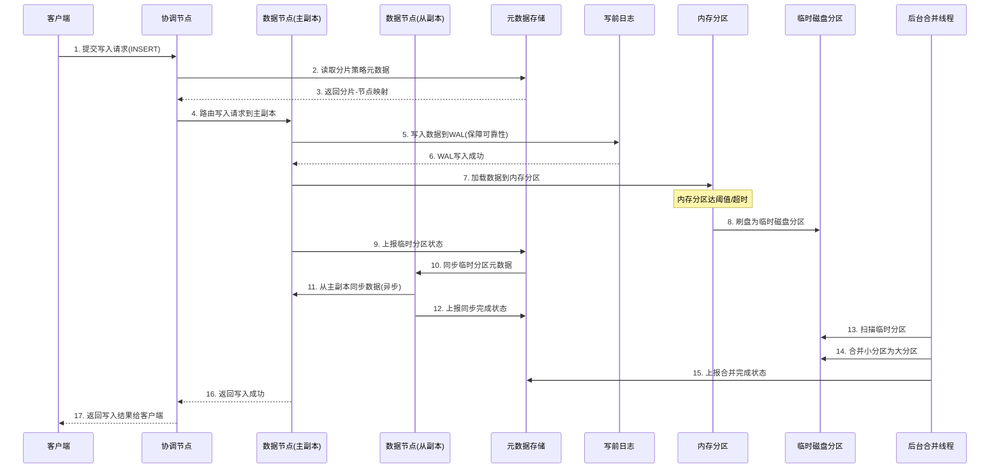
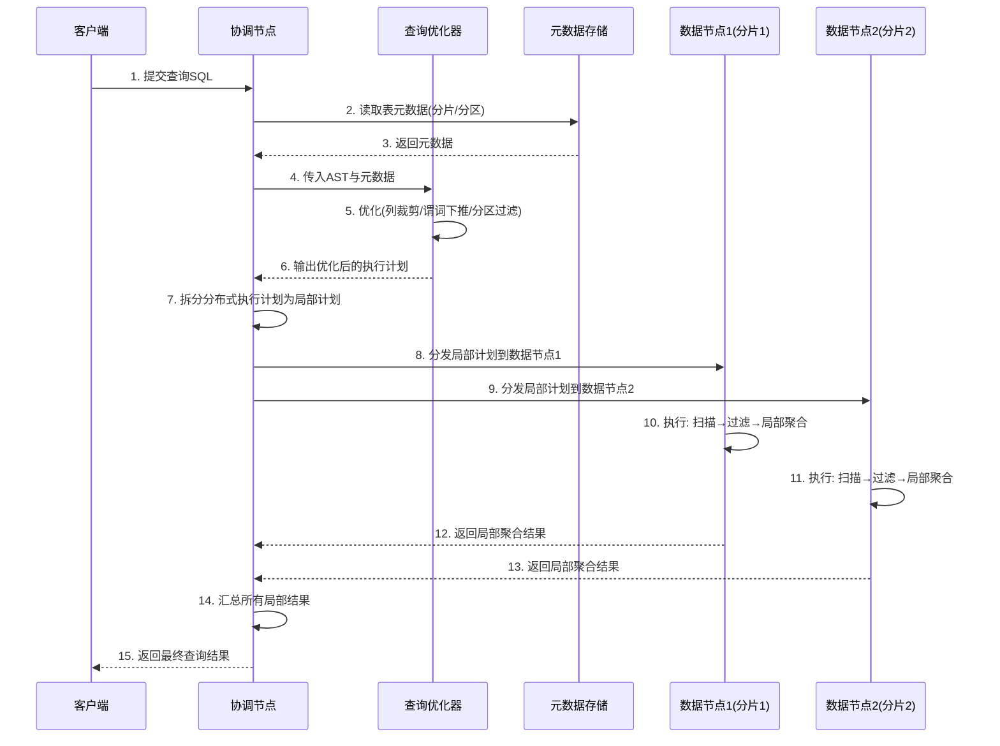
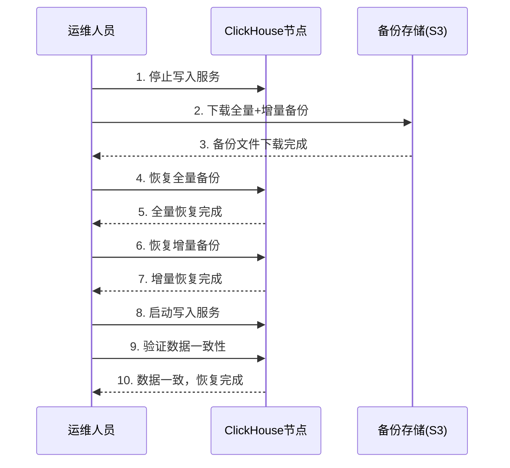

# 一、认知定位（Why & What）
## 1. 背景与起源
### 1.1 诞生驱动力
- **业务场景驱动**：ClickHouse 由俄罗斯互联网公司 Yandex 于 2013 年启动开发，核心目标是支撑其内部核心产品 **Yandex.Metrica**（一款日均处理 PB 级用户行为日志的 web 分析工具）的实时数据分析需求。当时 Yandex.Metrica 需同时满足“大规模数据存储”与“亚秒级查询响应”，现有技术无法兼顾两者。
- **技术空白填补**：2010-2013 年期间，OLAP 领域存在明显技术断层——传统行存数据库（如 MySQL）处理大规模数据时查询性能极差；Hadoop 生态的 Hive/Spark SQL 虽支持大规模数据，但查询延迟通常在分钟级，无法满足实时分析；专用 OLAP 数据库（如 Vertica）则存在部署复杂、成本高、扩展性弱的问题，均无法适配 Yandex 的业务需求。
- **开源化决策**：2016 年 Yandex 正式将 ClickHouse 开源（GitHub 仓库：[ClickHouse/ClickHouse](https://github.com/ClickHouse/ClickHouse)），核心原因是内部验证其稳定性后，希望通过社区力量补充边缘场景优化，并扩大技术影响力；截至 2024 年 5 月，该仓库已获超 30k Star，成为 OLAP 领域开源标杆项目。

### 1.2 解决的核心问题
- **大规模数据的实时查询**：解决“TB/PB 级数据”与“亚秒级/秒级查询”的矛盾，例如 Yandex.Metrica 需在 1 秒内返回某地区某时段的用户访问路径分析结果，ClickHouse 通过列式存储、向量化执行等设计实现该目标。
- **高并发查询支撑**：解决“多用户同时查询”与“性能不衰减”的矛盾，官方测试数据显示，单 ClickHouse 集群可支撑每秒数千次并发查询（非聚合类查询响应时间 < 100ms），远超同期 Spark SQL（每秒数十次并发即出现延迟飙升）。
- **低成本存储与扩展**：解决“大规模数据存储成本”与“横向扩展便捷性”的矛盾，ClickHouse 支持原生分布式架构，无需依赖 HDFS 等外部存储，单节点可存储数十 TB 数据，且新增节点时仅需配置集群元数据即可完成扩展，运维成本远低于传统商业 OLAP 数据库。


## 2. 核心本质
ClickHouse 的核心本质是 **“为 OLAP 场景设计的原生分布式列式数据库”**，其最简化核心模型可抽象为“4 个核心设计 + 1 个目标”，所有功能均围绕该模型展开：

### 2.1 核心设计1：列式存储优先
- **本质逻辑**：OLAP 场景中，查询通常仅涉及表中少数列（如“统计近 7 天各地区的订单金额”仅需“地区”“订单金额”“时间”3 列），列式存储可直接读取目标列数据，避免行存中“读取整行再过滤列”的无效 IO，IO 效率提升 10-100 倍（官方文档数据：相同查询下，列式存储的 IO 量仅为行存的 1/10-1/100）。
- **关键优化**：对每列数据单独进行压缩（支持 LZ4、ZSTD 等算法），压缩率通常可达 5-10 倍，进一步降低存储成本与 IO 开销。

### 2.2 核心设计2：向量化执行
- **本质逻辑**：传统数据库采用“行级循环执行”（逐行处理数据，每次仅操作 1 行），无法充分利用 CPU 缓存与 SIMD（单指令多数据）指令；ClickHouse 采用“批量列数据执行”，将数据按批次（通常 8192 行）加载到 CPU 缓存，通过 SIMD 指令单次处理批量数据，CPU 利用率提升 3-5 倍（官方 Benchmark 显示，向量化执行使聚合查询速度提升 2-10 倍）。

### 2.3 核心设计3：分布式原生支持
- **本质逻辑**：ClickHouse 从设计之初即支持分布式架构，无需依赖外部组件（如 Hadoop/YARN）。数据自动按“分片键（Sharding Key）”分散到多个节点，查询时由“协调节点”自动拆分查询任务到各分片，并行计算后汇总结果，天然支持水平扩展，且分片逻辑对用户透明（用户无需编写分布式计算代码，仅需通过 `ON CLUSTER` 关键字即可触发分布式查询）。

### 2.4 核心设计4：预计算优化
- **本质逻辑**：针对 OLAP 中高频的“聚合查询”（如 sum、count、avg），ClickHouse 支持“预聚合表（Materialized View）”——将高频聚合结果提前计算并存储，查询时直接读取预计算结果，避免每次查询重复计算。例如，对“按天聚合的订单金额”创建预聚合表后，查询“近 30 天订单总金额”可直接累加预计算的每日金额，响应时间从秒级降至毫秒级。

### 2.5 核心目标
始终围绕 **“OLAP 场景下的查询性能最大化”**，不追求“全能型数据库”定位（明确不支持事务、不适合高写并发的 OLTP 场景），通过“场景聚焦”实现性能突破。


## 3. 定位与关系
### 3.1 技术体系中的位置
ClickHouse 在技术体系中属于 **“OLAP 层的实时分析数据库”**，定位如下：
- **数据链路位置**：位于“数据存储层（如 Kafka、HDFS、S3）”与“应用层（如 BI 工具、数据看板、分析平台）”之间，承担“从大规模原始数据中快速提取分析结果”的核心角色。
- **场景边界**：专注于“离线批量数据 + 近实时增量数据”的分析场景，典型应用包括用户行为分析、业务监控看板、日志检索分析、广告效果归因等；明确排除“高并发写（如秒杀订单）”“事务性操作（如银行转账）”等 OLTP 场景。

### 3.2 与同类事物的对比
选取 OLAP 领域市占率最高的 4 类工具（Spark SQL、Presto、Hive、Vertica）进行核心维度对比，数据来源为官方文档及 2024 年行业实测报告：

| 对比维度         | ClickHouse                | Spark SQL                 | Presto                    | Hive                      | Vertica（商业）           |
|------------------|---------------------------|---------------------------|---------------------------|---------------------------|---------------------------|
| 核心定位         | 实时 OLAP 数据库          | 分布式计算引擎（兼 OLAP） | 交互式查询引擎            | 离线批处理 OLAP           | 企业级 OLAP 数据库        |
| 存储模型         | 原生列式存储（本地/对象存储） | 依赖外部存储（HDFS/S3）   | 依赖外部存储（HDFS/S3）   | 依赖 HDFS（行/列存）      | 列式存储（本地）          |
| 查询延迟         | 亚秒级-秒级               | 秒级-分钟级               | 秒级-分钟级               | 分钟级-小时级             | 亚秒级-秒级               |
| 并发支撑         | 高（数千 QPS）            | 中（数百 QPS）            | 中（数百 QPS）            | 低（数十 QPS）            | 高（数千 QPS）            |
| 部署复杂度       | 低（原生分布式，无依赖）  | 中（需依赖 YARN/HDFS）    | 中（需依赖 HDFS）         | 高（需 Hadoop 生态）      | 高（需专业运维）          |
| 成本             | 低（开源，硬件要求适中）  | 中（开源，需大量内存）    | 中（开源，需大量内存）    | 中（开源，需大量存储）    | 高（商业授权，硬件要求高）|
| 适用场景         | 实时看板、用户行为分析    | 批处理+交互式分析         | 多数据源交互式分析        | 离线批量报表              | 企业核心业务分析          |

### 3.3 替代与互补关系
- **替代关系**：
  1. 替代传统离线 OLAP 工具（如 Hive）：在“离线数据查询”场景中，ClickHouse 查询延迟比 Hive 低 10-100 倍，可直接替代 Hive 支撑“准实时报表”需求。
  2. 部分替代 Spark SQL/Presto：在“单数据源（如 Kafka、S3）实时分析”场景中，ClickHouse 无需依赖外部计算引擎，部署更简单、性能更高，可替代 Spark SQL/Presto 的部分使用场景。
  3. 替代低成本商业 OLAP：在中小规模企业场景中，ClickHouse 开源免费且性能接近 Vertica，可替代 Vertica 降低成本。

- **互补关系**：
  1. 与 Spark SQL 互补：Spark SQL 擅长“多数据源关联”“复杂 ETL 处理”，ClickHouse 擅长“单源数据快速查询”，实际场景中常采用“Spark SQL 做 ETL 清洗 → 数据写入 ClickHouse → 应用查询 ClickHouse”的链路。
  2. 与 Kafka 互补：Kafka 作为实时数据总线，负责“数据接入与缓存”，ClickHouse 通过 `Kafka 引擎表` 直接消费 Kafka 数据，实现“数据实时写入+实时查询”的端到端链路，两者共同支撑实时分析场景。
  3. 与对象存储（S3）互补：ClickHouse 支持将冷数据存储到 S3（通过 `S3 引擎表`），热数据存储在本地 SSD，实现“热冷数据分层存储”，兼顾查询性能与存储成本，与 S3 形成存储互补。

# 二、原理支撑（How - Theory）
## 1. 体系结构
### 1.1 核心组件
ClickHouse 采用“无主从分布式架构”，核心组件仅包含 **协调节点（Coordinator Node）**、**数据节点（Data Node）** 与 **元数据存储（Metadata Storage）**，无额外依赖（如调度器、资源管理器），架构极简且高效。各组件功能如下：
- **协调节点（Coordinator Node）**
  - 核心角色：“查询入口 + 任务调度器”，不存储业务数据。
  - 关键职责：接收客户端查询请求、解析 SQL 并生成分布式执行计划、将任务拆分到各数据节点、汇总数据节点的计算结果并返回给客户端。
  - 部署特性：可部署多个，通过负载均衡器（如 Nginx）实现高可用，避免单点故障。
- **数据节点（Data Node）**
  - 核心角色：“数据存储 + 计算执行单元”，集群中绝大多数节点为数据节点。
  - 关键职责：存储分片数据（Shard）、执行协调节点分发的局部查询任务（如过滤、聚合）、向协调节点返回局部计算结果。
  - 核心组件：每个数据节点内置“存储引擎（如 MergeTree）”“查询执行引擎”“数据写入引擎”，独立完成数据的读写与计算。
- **元数据存储（Metadata Storage）**
  - 核心角色：“集群配置与表结构的统一存储”。
  - 存储内容：集群拓扑（节点列表、分片与副本映射）、数据库/表结构（字段类型、分区键、分片键）、权限配置等元信息。
  - 实现方式：默认使用本地文件（每个节点同步元数据文件），生产环境可配置为 ZooKeeper（保证元数据一致性，支持动态扩缩容）。

### 1.2 组件关系
各组件通过“轻量网络交互”实现协同，核心交互逻辑如下：
1. **元数据同步**：当元数据发生变更（如新增表、修改分片策略）时，变更操作先写入元数据存储（如 ZooKeeper），再由所有节点定期拉取同步，确保集群元数据一致。
2. **查询任务分发**：协调节点接收查询后，基于元数据中的“分片映射关系”，确定需参与计算的数据节点，将“局部查询任务”（仅包含该节点需处理的分片逻辑）分发至对应数据节点。
3. **数据写入路由**：客户端写入数据时，协调节点基于“分片键（Sharding Key）”计算数据所属分片，将写入请求路由到该分片的主数据节点（或所有副本节点，取决于副本策略）。

### 1.3 整体架构图
```mermaid
graph TD
    Client[客户端] --> LB[负载均衡器]
    LB --> CN1[协调节点1]
    LB --> CN2[协调节点2]
    CN1 --> ZK[元数据存储<br/>(ZooKeeper/本地文件)]
    CN2 --> ZK
    CN1 --> DN1[数据节点1<br/>(分片1-副本1)]
    CN1 --> DN2[数据节点2<br/>(分片1-副本2)]
    CN1 --> DN3[数据节点3<br/>(分片2-副本1)]
    CN1 --> DN4[数据节点4<br/>(分片2-副本2)]
    CN2 --> DN1
    CN2 --> DN2
    CN2 --> DN3
    CN2 --> DN4
    DN1 --> ZK
    DN2 --> ZK
    DN3 --> ZK
    DN4 --> ZK
    style Client fill:#f9f,stroke:#333,stroke-width:1px
    style LB fill:#9cf,stroke:#333,stroke-width:1px
    style CN1 fill:#ccf,stroke:#333,stroke-width:1px
    style CN2 fill:#ccf,stroke:#333,stroke-width:1px
    style ZK fill:#ffc,stroke:#333,stroke-width:1px
    style DN1 fill:#cfc,stroke:#333,stroke-width:1px
    style DN2 fill:#cfc,stroke:#333,stroke-width:1px
    style DN3 fill:#cfc,stroke:#333,stroke-width:1px
    style DN4 fill:#cfc,stroke:#333,stroke-width:1px
```


## 2. 核心机制
### 2.1 数据分片与副本机制
ClickHouse 通过“分片（Shard）”实现水平扩展，通过“副本（Replica）”实现高可用，两者结合平衡“扩展性”与“可靠性”。
- **数据分片机制**
  1. **分片策略**：按“分片键（Sharding Key）”将表数据拆分到多个分片，支持两种核心策略：
     - Hash 分片：基于分片键的哈希值（如 `cityHash64(user_id)`）路由到分片，确保数据均匀分布，适合无明显时间/范围特征的数据。
     - Range 分片：基于分片键的范围（如 `toYYYYMM(date) = 202405`）路由到分片，适合按时间分区的数据（如日志、订单），可实现“按分片过滤”。
  2. **分片特性**：分片是“逻辑数据单元”，每个分片对应 1 个或多个数据节点（副本），分片间数据不重叠、总量覆盖全表数据。
- **数据副本机制**
  1. **副本类型**：默认采用“异步副本”，主副本写入数据后，异步同步到从副本（延迟通常 < 1s）；也支持“同步副本”（需配置 ZooKeeper，主副本等待所有从副本写入成功后返回），但会牺牲写入性能。
  2. **一致性保障**：通过 ZooKeeper 维护副本状态（如“主/从标识”“数据同步进度”），确保同一分片的多个副本数据最终一致。
- **核心作用**：分片解决“数据量过大无法单节点存储”的问题，副本解决“单节点故障导致数据不可用”的问题。

### 2.2 MergeTree 存储引擎机制
MergeTree 是 ClickHouse 最核心的存储引擎（占比 > 90% 生产场景），专为“大规模离线+近实时数据”设计，核心机制围绕“高效存储”与“快速查询”展开：
- **分区机制（Partitioning）**
  - 原理：按“分区键（如 `toYYYYMM(date)`）”将数据划分为独立分区（如 202405 分区、202406 分区），每个分区对应磁盘上的独立目录。
  - 作用：查询时可通过“分区过滤”直接跳过无关分区（如查询 202405 数据时，不读取 202406 分区），大幅减少 IO 量。
- **排序机制（Sorting）**
  - 原理：每个分区内的数据按“排序键（Sorting Key，如 `user_id, create_time`）”排序存储，形成有序数据块。
  - 作用：有序数据块支持“二分查找”，可快速定位目标数据；同时，排序后的相同/相似数据更易压缩，提升压缩率。
- **主键与稀疏索引（Primary Key & Sparse Index）**
  - 主键：默认与排序键一致（可单独配置），用于构建“稀疏索引”（每 8192 行数据生成 1 条索引记录）。
  - 稀疏索引：不存储所有行的索引，仅存储“索引行”的主键值与偏移量，平衡索引大小与查询效率（索引大小通常为数据量的 0.1%-0.5%）。
- **后台合并（Background Merge）**
  - 原理：数据写入时先存储为“临时分区（Part）”，后台由“合并线程”将小临时分区按排序键合并为大分区（合并过程无锁，不阻塞读写）。
  - 作用：减少分区数量，降低查询时的分区扫描开销；合并后的大分区压缩率更高，节省存储成本。
- **TTL 机制（Time To Live）**
  - 原理：支持为表或字段配置 TTL（如 `TTL create_time + INTERVAL 30 DAY`），过期数据由后台线程自动删除或迁移（如迁移到冷存储）。
  - 作用：自动清理过期数据（如 30 天前的日志），减少人工运维成本。

### 2.3 查询执行机制
ClickHouse 的查询执行机制围绕“并行化”与“向量化”设计，确保大规模数据下的低延迟：
1. **SQL 解析与优化**：协调节点接收 SQL 后，先解析为抽象语法树（AST），再通过“查询优化器”进行优化（如谓词下推、列裁剪、聚合重排），减少不必要的数据传输与计算。
2. **分布式执行计划生成**：基于表的分片策略，将优化后的查询计划拆分为“局部执行计划”（每个数据节点需执行的逻辑）。
3. **任务并行执行**：
   - 节点级并行：不同数据节点同时执行各自的局部计划（如分片 1 在节点 A 执行，分片 2 在节点 B 执行）。
   - 线程级并行：单个数据节点内，按“数据块”拆分任务，由多个线程并行处理（如 1 个分区拆分为 4 个数据块，由 4 个线程处理）。
4. **向量化执行**：每个线程以“数据块（Block，默认 65536 行）”为单位处理数据，通过 CPU 的 SIMD 指令单次处理批量数据（而非逐行处理），提升 CPU 利用率。
5. **结果合并**：各数据节点将局部计算结果（如分片级聚合结果）返回给协调节点，协调节点对结果进行最终合并（如汇总所有分片的 sum 值），生成最终结果返回给客户端。

### 2.4 容错与高可用机制
ClickHouse 通过“副本冗余”与“轻量故障处理”实现高可用，避免单点故障影响服务：
- **节点故障检测**：通过“心跳机制”实现（节点定期向 ZooKeeper 上报状态，或协调节点定期 ping 数据节点），故障检测延迟通常 < 10s。
- **查询重试机制**：若某数据节点在查询过程中故障，协调节点会自动重试该分片的查询任务到其他副本节点（若存在），无需客户端干预。
- **副本故障切换**：若某分片的主副本故障，ZooKeeper 会从该分片的从副本中选举新主副本，后续写入请求自动路由到新主副本。
- **数据一致性保障**：通过“写前日志（WAL）”确保数据不丢失（数据写入时先写 WAL，再写内存分区，WAL 支持故障后恢复）；副本同步基于 WAL 日志，确保主从数据一致。

## 3. 抽象建模
### 3.1 数据建模逻辑
ClickHouse 针对 OLAP 场景设计了独特的数据建模逻辑，核心目标是“减少 Join、提升查询效率”，具体逻辑如下：
- **宽表优先原则**：将多表关联的数据（如“订单表 + 用户表 + 商品表”）通过 ETL 合并为单张宽表（如“订单宽表”包含订单信息、用户信息、商品信息），避免查询时的跨表 Join（ClickHouse 对 Join 支持较弱，尤其是大表 Join 性能差）。
- **星型模型适配**：支持“事实表 + 维度表”的星型模型（如事实表为“订单表”，维度表为“用户表”“商品表”），但维度表需为“小表”（通常 < 100 万行），查询时通过“字典映射”（将维度表加载到内存）替代 Join，提升性能。
- **避免事务与更新**：不建议频繁更新数据（Update/Delete 操作会生成新数据块，标记旧数据块为删除，后续合并时清理），优先采用“append 写入 + 分区覆盖”的方式（如每日全量覆盖前一天的统计数据）。

### 3.2 查询建模逻辑
ClickHouse 将“声明式 SQL”转化为“分布式并行任务”的建模逻辑，核心步骤如下：
1. **需求抽象**：用户通过 SQL 声明“要查询什么”（如“统计 202405 各地区订单金额”），无需关心“如何分布式执行”。
2. **逻辑计划转化**：将 SQL 转化为“逻辑查询计划”（如“扫描订单表 202405 分区 → 按地区分组 → 求和订单金额”）。
3. **物理计划拆分**：基于集群拓扑与分片策略，将逻辑计划拆分为“物理执行计划”（如“分片 1 扫描 202405 分区并按地区聚合 → 分片 2 执行相同逻辑 → 汇总分片结果”）。
4. **任务分发与执行**：协调节点将物理计划分发到对应数据节点，节点按“数据块”并行执行，最终汇总结果。

### 3.3 核心抽象概念
ClickHouse 的核心抽象概念是数据建模与查询优化的基础，易混淆概念对比如下：

| 抽象概念       | 定义                                  | 核心作用                                  | 配置方式（示例）                          |
|----------------|---------------------------------------|-------------------------------------------|-------------------------------------------|
| 分片键（Sharding Key） | 用于将数据拆分到不同分片的字段/表达式  | 决定数据分布，影响查询并行度与负载均衡    | `ENGINE = MergeTree() PARTITION BY ... SHARD BY user_id` |
| 分区键（Partition Key） | 用于将数据划分为独立分区的字段/表达式  | 实现分区过滤，减少查询时的IO量            | `ENGINE = MergeTree() PARTITION BY toYYYYMM(create_time)` |
| 排序键（Sorting Key）  | 用于对分区内数据排序的字段/表达式      | 支持二分查找，提升查询效率与压缩率        | `ENGINE = MergeTree(user_id, create_time) ORDER BY (user_id, create_time)` |
| 主键（Primary Key）    | 用于构建稀疏索引的字段/表达式          | 快速定位数据，默认与排序键一致            | `ENGINE = MergeTree() PRIMARY KEY (user_id)`（单独配置时） |
| TTL            | 数据过期时间配置                      | 自动清理过期数据，降低运维成本            | `TTL create_time + INTERVAL 30 DAY`       |


## 4. 流转逻辑
### 4.1 数据写入详细步骤
ClickHouse 的数据写入采用“先写内存、再刷盘、后合并”的流程，确保写入性能与数据可靠性：
1. 客户端通过 JDBC/ODBC/HTTP 等协议连接协调节点，提交数据写入请求（如 `INSERT INTO order_table VALUES (...)`）。
2. 协调节点基于表的“分片键”计算数据所属分片，将写入请求路由到该分片的主副本节点（若为同步副本，则路由到所有副本节点）。
3. 数据节点接收写入请求后，先将数据写入“写前日志（WAL）”（确保故障后数据可恢复）。
4. 数据从 WAL 加载到“内存分区（In-Memory Part）”，内存分区大小达到阈值（默认 16MB）或满足时间条件（默认 10 秒）时，自动刷盘为“临时磁盘分区（Disk Part）”。
5. 后台“合并线程”定期扫描临时分区，将同一分区键下的小临时分区按排序键合并为大分区（合并过程不阻塞读操作，写操作可继续写入新临时分区）。
6. 合并完成后，删除原小临时分区，仅保留大分区；若配置了 TTL，合并过程中会同时检查并标记过期数据，后续由后台线程清理。

### 4.2 数据写入流程图


### 4.3 查询执行详细步骤
ClickHouse 的查询执行流程围绕“协调节点调度 + 数据节点并行计算”展开，确保低延迟：
1. 客户端连接协调节点，提交查询 SQL（如 `SELECT region, sum(amount) FROM order_table WHERE create_time >= '2024-05-01' GROUP BY region`）。
2. 协调节点解析 SQL 为抽象语法树（AST），并查询元数据存储，获取表的分片策略、分区信息、字段类型等元数据。
3. 协调节点的“查询优化器”对 AST 进行优化：
   - 列裁剪：仅保留查询所需列（如仅保留 `region` `amount` `create_time`，排除其他列）。
   - 谓词下推：将过滤条件（如 `create_time >= '2024-05-01'`）下推到数据节点，提前过滤无效数据。
   - 分区过滤：基于 `create_time` 确定需扫描的分区（如仅扫描 202405 分区），跳过其他分区。
4. 协调节点生成“分布式执行计划”，并拆分为“局部执行计划”（每个数据节点需执行的逻辑：扫描指定分区 → 过滤 → 聚合 → 返回局部结果）。
5. 协调节点将局部执行计划分发到对应数据节点（如分片 1 的计划分发到节点 A，分片 2 的计划分发到节点 B）。
6. 各数据节点执行局部计划：
   - 按分区过滤扫描目标分区，通过稀疏索引快速定位数据。
   - 按谓词过滤数据，裁剪无关列。
   - 按 `region` 进行局部聚合，计算每个 region 的 sum(amount)。
7. 数据节点将局部聚合结果（如 region: 北京, sum: 10000）返回给协调节点。
8. 协调节点汇总所有数据节点的局部结果（如北京的 sum 汇总为 10000+8000=18000），生成最终结果。
9. 协调节点将最终结果格式化后返回给客户端。

### 4.4 查询执行流程图


# 三、实践应用（How - Practice）
## 1. 基础操作
### 1.1 安装部署（主流方式）
ClickHouse 支持多环境部署，以下为生产/测试中最常用的 2 种方式，步骤参考官方文档《Installation Guide》：
#### 1.1.1 Docker 快速部署（测试环境）
适合快速验证功能，无需复杂环境配置：
1. 拉取官方镜像（指定稳定版本，如 24.3.1.2317，避免 latest 版本兼容性问题）：
   ```bash
   docker pull clickhouse/clickhouse-server:24.3.1.2317
   ```
2. 启动容器（映射端口 8123/9000，挂载数据目录避免容器删除后数据丢失）：
   ```bash
   docker run -d \
     --name clickhouse-test \
     -p 8123:8123 -p 9000:9000 \
     -v /opt/clickhouse/data:/var/lib/clickhouse \
     -v /opt/clickhouse/logs:/var/log/clickhouse-server \
     clickhouse/clickhouse-server:24.3.1.2317
   ```
3. 进入容器验证：
   ```bash
   docker exec -it clickhouse-test clickhouse-client
   # 执行查询，返回版本即成功
   SELECT version();
   ```

#### 1.1.2 Linux 包管理部署（生产环境）
以 CentOS 7 为例，通过官方 YUM 源部署，稳定性更高：
1. 添加官方 YUM 源：
   ```bash
   sudo yum install -y yum-utils
   sudo rpm --import https://repo.clickhouse.tech/CLICKHOUSE-KEY.GPG
   sudo yum-config-manager --add-repo https://repo.clickhouse.tech/rpms/clickhouse.repo
   ```
2. 安装服务端与客户端：
   ```bash
   sudo yum install -y clickhouse-server clickhouse-client
   ```
3. 修改核心配置（`/etc/clickhouse-server/config.xml`）：
   - 取消 `listen_host` 注释，允许外部访问：`<listen_host>0.0.0.0</listen_host>`
   - 调整数据/日志目录（默认在 `/var/lib/clickhouse`，生产建议挂载独立磁盘）：
     ```xml
     <path>/data/clickhouse/</path>
     <log_path>/var/log/clickhouse-server/</log_path>
     ```
4. 启动服务并设置开机自启：
   ```bash
   sudo systemctl start clickhouse-server
   sudo systemctl enable clickhouse-server
   # 验证服务状态
   sudo systemctl status clickhouse-server
   ```

### 1.2 核心配置（生产必调参数）
ClickHouse 配置文件分为**全局配置（config.xml）** 和**用户配置（users.xml）**，以下为生产环境高频调整参数：

| 配置文件       | 参数名                  | 作用说明                                  | 默认值       | 生产推荐值（根据硬件调整） |
|----------------|-------------------------|-------------------------------------------|--------------|----------------------------|
| config.xml     | max_concurrent_queries  | 集群最大并发查询数                        | 100          | 500-1000（根据 CPU 核心数） |
| config.xml     | max_memory_usage        | 单查询最大内存使用量                      | 10GB         | 物理内存的 50%（如 32GB）  |
| config.xml     | background_pool_size    | 后台合并/TTL 任务线程数                   | 16           | CPU 核心数的 1/2（如 8）   |
| users.xml      | max_rows_to_read        | 单查询最大读取行数（防止全表扫描）        |  unlimited   | 100000000（1 亿行）        |
| users.xml      | max_bytes_to_read       | 单查询最大读取字节数                      |  unlimited   | 10000000000（10GB）        |
| users.xml      | password                | 客户端连接密码（默认无密码，生产必须设置）| 空           | 自定义强密码（如 P@ssw0rd）|

### 1.3 核心 API（常用交互方式）
ClickHouse 支持多种交互方式，覆盖脚本、代码、命令行场景：
#### 1.3.1 命令行客户端（clickhouse-client）
基础查询/管理工具，适合运维操作：
- 连接集群（指定协调节点 IP 和端口）：
  ```bash
  clickhouse-client --host 192.168.1.100 --port 9000 --user default --password P@ssw0rd
  ```
- 执行 SQL 文件（批量建表/导入数据）：
  ```bash
  clickhouse-client --host 192.168.1.100 < create_table.sql
  ```

#### 1.3.2 HTTP API（脚本/工具集成）
支持通过 HTTP 协议提交查询，适合脚本（如 Python/Shell）调用：
- 发送查询请求（使用 curl，返回 JSON 格式结果）：
  ```bash
  curl -X POST 'http://192.168.1.100:8123/' \
    -u 'default:P@ssw0rd' \
    -d 'SELECT region, sum(amount) FROM order_table WHERE create_time >= toDate("2024-05-01") GROUP BY region'
  ```
- 导入 CSV 数据（指定表名和格式）：
  ```bash
  curl -X POST 'http://192.168.1.100:8123/?query=INSERT INTO order_table FORMAT CSV' \
    -u 'default:P@ssw0rd' \
    --data-binary @order_data.csv
  ```

#### 1.3.3 JDBC 驱动（Java 应用集成）
生产 Java 应用（如 Spring Boot）常用方式，依赖官方 JDBC 包：
1. 添加 Maven 依赖：
   ```xml
   <dependency>
     <groupId>com.clickhouse</groupId>
     <artifactId>clickhouse-jdbc</artifactId>
     <version>0.4.6</version>
   </dependency>
   ```
2. 代码示例（查询数据）：
   ```java
   import java.sql.*;

   public class ClickHouseJdbcDemo {
       public static void main(String[] args) throws SQLException {
           String url = "jdbc:clickhouse://192.168.1.100:8123/default";
           String user = "default";
           String password = "P@ssw0rd";

           try (Connection conn = DriverManager.getConnection(url, user, password);
                Statement stmt = conn.createStatement();
                ResultSet rs = stmt.executeQuery("SELECT region, sum(amount) FROM order_table GROUP BY region")) {

               while (rs.next()) {
                   System.out.println("Region: " + rs.getString("region") + ", Sum: " + rs.getLong("sum(amount)"));
               }
           }
       }
   }
   ```


## 2. 典型案例
### 2.1 案例 1：用户行为日志分析（离线+近实时）
#### 2.1.1 场景需求
- 数据来源：用户 App 行为日志（如点击、浏览、下单），日均数据量 1000 万条。
- 查询需求：按“日期、用户类型、行为类型”聚合统计，支持“近 7 天趋势查询”“实时 Top 10 行为类型”，响应时间 < 1 秒。
- 存储需求：保留 90 天数据，过期自动清理。

#### 2.1.2 实现步骤
1. **表结构设计（核心：分区+分片+排序键）**  
   采用 MergeTree 引擎，按日期分区（便于过期清理）、用户 ID 分片（数据均匀分布）、时间+行为类型排序（提升查询效率）：
   ```sql
   CREATE TABLE IF NOT EXISTS user_behavior_log (
       log_time DateTime COMMENT '行为发生时间',
       user_id String COMMENT '用户ID',
       user_type String COMMENT '用户类型：新用户/老用户',
       behavior_type String COMMENT '行为类型：点击/浏览/下单',
       page String COMMENT '页面名称',
       device String COMMENT '设备类型：iOS/Android'
   ) ENGINE = MergeTree()
   PARTITION BY toDate(log_time)  -- 按日期分区
   ORDER BY (log_time, behavior_type)  -- 按时间+行为类型排序
   PRIMARY KEY (log_time, user_id)  -- 主键（稀疏索引）
   TTL toDate(log_time) + INTERVAL 90 DAY  -- 90 天后自动清理
   SHARD BY user_id  -- 按用户ID分片（分布式表需配置）
   REPLICA BY device;  -- 按设备类型副本（可选，高可用）
   ```
   - 分布式表创建（关联分片）：
     ```sql
     CREATE TABLE user_behavior_log_distributed ON CLUSTER clickhouse_cluster (
         log_time DateTime,
         user_id String,
         user_type String,
         behavior_type String,
         page String,
         device String
     ) ENGINE = Distributed(clickhouse_cluster, default, user_behavior_log, cityHash64(user_id));
     ```

2. **数据写入（离线+近实时）**  
   - 离线数据：每日从 HDFS 导入前一天全量日志（使用 `HDFS` 引擎表）：
     ```sql
     -- 创建 HDFS 外部表
     CREATE TABLE user_behavior_log_hdfs (
         log_time DateTime,
         user_id String,
         user_type String,
         behavior_type String,
         page String,
         device String
     ) ENGINE = HDFS('hdfs://hadoop-cluster:8020/user/logs/behavior/{yyyyMMdd}.csv', 'CSV');

     -- 导入前一天数据（按日期过滤）
     INSERT INTO user_behavior_log_distributed
     SELECT * FROM user_behavior_log_hdfs
     WHERE toDate(log_time) = toDate(yesterday());
     ```
   - 近实时数据：实时消费 Kafka 日志流（使用 `Kafka` 引擎表）：
     ```sql
     -- 创建 Kafka 外部表
     CREATE TABLE user_behavior_log_kafka (
         log_time DateTime,
         user_id String,
         user_type String,
         behavior_type String,
         page String,
         device String
     ) ENGINE = Kafka
     SETTINGS kafka_broker_list = 'kafka-1:9092,kafka-2:9092',
              kafka_topic_list = 'user_behavior_topic',
              kafka_group_name = 'clickhouse_consumer',
              kafka_format = 'JSONEachRow';  -- Kafka 数据格式为 JSON

     -- 创建物化视图，自动同步 Kafka 数据到分布式表
     CREATE MATERIALIZED VIEW user_behavior_log_mv TO user_behavior_log_distributed
     AS SELECT * FROM user_behavior_log_kafka;
     ```

3. **高频查询示例**  
   - 近 7 天各用户类型的下单行为统计：
     ```sql
     SELECT 
         toDate(log_time) AS dt,
         user_type,
         countIf(behavior_type = '下单') AS order_count
     FROM user_behavior_log_distributed
     WHERE log_time >= toDateTime(date_sub(current_date(), 7))  -- 近7天
     GROUP BY dt, user_type
     ORDER BY dt DESC, user_type;
     ```
   - 实时 Top 10 行为类型（近 1 小时）：
     ```sql
     SELECT 
         behavior_type,
         count() AS behavior_count
     FROM user_behavior_log_distributed
     WHERE log_time >= toDateTime(date_sub(current_datetime(), INTERVAL 1 HOUR))  -- 近1小时
     GROUP BY behavior_type
     ORDER BY behavior_count DESC
     LIMIT 10;
     ```

#### 2.1.3 设计解析
- 分区键选 `toDate(log_time)`：查询时通过日期过滤跳过无关分区，如“近 7 天”仅扫描 7 个分区。
- 排序键选 `(log_time, behavior_type)`：聚合查询时无需额外排序，直接按有序数据计算，提升效率。
- 物化视图同步 Kafka：实现“数据写入 Kafka 后自动进入 ClickHouse”，近实时延迟 < 10 秒。

### 2.2 案例 2：实时业务监控看板（秒级响应）
#### 2.2.1 场景需求
- 数据来源：电商订单数据，每秒新增 10-20 条订单。
- 看板需求：实时展示“当前小时订单总额、支付转化率、Top 5 商品类目”，刷新频率 5 秒。
- 性能需求：查询响应时间 < 500ms，支持 10 个看板同时访问。

#### 2.2.2 实现关键（预聚合优化）
核心通过“物化视图预计算”减少实时查询计算量：
1. **基础订单表（存储原始数据）**：
   ```sql
   CREATE TABLE order_raw (
       order_id String COMMENT '订单ID',
       create_time DateTime COMMENT '下单时间',
       pay_time DateTime COMMENT '支付时间',
       amount Decimal(10,2) COMMENT '订单金额',
       category String COMMENT '商品类目',
       status String COMMENT '订单状态：待支付/已支付/取消'
   ) ENGINE = MergeTree()
   PARTITION BY toDate(create_time)
   ORDER BY (create_time, order_id);
   ```

2. **预聚合物化视图（按小时预计算）**：  
   提前计算“每小时、每类目”的订单数、总额、支付数，查询时直接读取预计算结果：
   ```sql
   CREATE MATERIALIZED VIEW order_agg_hourly 
   ENGINE = MergeTree()
   PARTITION BY toDate(create_time)
   ORDER BY (toStartOfHour(create_time), category)
   AS SELECT 
       toStartOfHour(create_time) AS hour_time,  -- 按小时聚合
       category,
       count() AS order_total,  -- 总订单数
       sum(amount) AS amount_total,  -- 总金额
       countIf(status = '已支付') AS pay_total  -- 已支付订单数
   FROM order_raw
   GROUP BY hour_time, category;
   ```

3. **看板查询示例（响应 < 300ms）**：  
   ```sql
   -- 当前小时订单总额（直接读取预聚合数据）
   SELECT sum(amount_total) AS current_hour_amount
   FROM order_agg_hourly
   WHERE hour_time = toStartOfHour(current_datetime());

   -- Top 5 商品类目（近 2 小时）
   SELECT 
       category,
       sum(amount_total) AS category_amount
   FROM order_agg_hourly
   WHERE hour_time >= toStartOfHour(date_sub(current_datetime(), INTERVAL 2 HOUR))
   GROUP BY category
   ORDER BY category_amount DESC
   LIMIT 5;
   ```


## 3. 问题诊断
### 3.1 高频问题 1：查询慢（响应时间 > 5 秒）
#### 3.1.1 常见现象
- 全表扫描（未触发分区过滤/索引）。
- 单查询读取数据量过大（超过 `max_bytes_to_read` 限制）。
- 后台合并任务占用过多 CPU/IO，导致查询资源不足。

#### 3.1.2 排查步骤
1. 查看查询执行计划，确认是否触发分区过滤/索引：
   ```sql
   EXPLAIN ANALYZE  -- 执行并分析计划
   SELECT sum(amount) FROM order_table WHERE create_time >= '2024-05-01';
   ```
   - 若输出中无 `Partition pruning`（分区裁剪），说明未使用分区键过滤。
   - 若 `Read Rows` 远大于实际需要行数，说明未触发稀疏索引。

2. 查看当前查询资源占用：
   ```sql
   -- 查看所有运行中查询的内存/CPU占用
   SELECT 
       query_id,
       query,
       total_rows_read,
       memory_usage,
       elapsed
   FROM system.processes
   WHERE elapsed > 5;  -- 筛选运行超5秒的查询
   ```

3. 查看后台合并任务状态：
   ```sql
   -- 查看合并任务进度，若 progress > 0 表示正在合并
   SELECT 
       table,
       partition_id,
       progress,
       elapsed
   FROM system.merges
   WHERE is_active = 1;
   ```

#### 3.1.3 解决方案
- 未触发分区过滤：在查询中添加分区键条件（如 `create_time >= '2024-05-01'`），避免全表扫描。
- 索引未生效：调整排序键（将查询过滤高频字段加入排序键），或确保查询条件包含主键前缀（如排序键为 `(dt, user_id)`，查询需包含 `dt` 条件）。
- 合并任务抢占资源：调整合并线程数（`background_pool_size`），或在业务低峰期执行大表合并：
  ```xml
  <!-- config.xml 中调整合并线程数 -->
  <background_pool_size>4</background_pool_size>
  ```

### 3.2 高频问题 2：数据写入失败
#### 3.2.1 常见现象
- Kafka 数据同步中断，物化视图无新数据写入。
- 批量插入时报 `Memory limit exceeded`（内存不足）。
- 分布式表写入时报 `No replica available for shard`（分片无可用副本）。

#### 3.2.2 排查步骤
1. 查看 ClickHouse 服务日志（默认路径 `/var/log/clickhouse-server/clickhouse-server.log`）：
   ```bash
   grep -i "error" /var/log/clickhouse-server/clickhouse-server.log | tail -20
   ```
   - 若含 `Kafka error: Failed to fetch metadata`，说明 Kafka 连接异常。
   - 若含 `Memory limit exceeded while inserting`，说明单批次写入数据量过大。

2. 检查 Kafka 物化视图状态：
   ```sql
   -- 查看物化视图是否正常，is_active=1 表示正常
   SELECT 
       table,
       is_active,
       last_error
   FROM system.materialized_views
   WHERE table = 'user_behavior_log_mv';
   ```

3. 检查分片副本状态：
   ```sql
   -- 查看各分片的副本状态，healthy=1 表示健康
   SELECT 
       shard_num,
       replica_num,
       host_name,
       healthy
   FROM system.replicas
   WHERE table = 'order_table';
   ```

#### 3.2.3 解决方案
- Kafka 连接异常：检查 Kafka 集群是否正常，更新 `kafka_broker_list` 配置（确保地址正确、端口开放），重启物化视图：
  ```sql
  DROP MATERIALIZED VIEW user_behavior_log_mv;
  -- 重新创建物化视图
  CREATE MATERIALIZED VIEW user_behavior_log_mv TO user_behavior_log_distributed AS SELECT * FROM user_behavior_log_kafka;
  ```
- 内存不足：拆分批量插入数据（如将 100 万条/批次拆分为 10 万条/批次），或调整单查询内存限制（`max_memory_usage`）。
- 副本不可用：重启故障副本节点，或在 `users.xml` 中配置副本自动重试：
  ```xml
  <distributed_ddl>
      <path>/clickhouse/task_queue/ddl</path>
      <max_retry_count>3</max_retry_count>  <!-- 重试3次 -->
  </distributed_ddl>
  ```

### 3.3 高频问题 3：副本同步异常
#### 3.3.1 常见现象
- 主副本写入数据后，从副本长时间未同步（延迟 > 1 分钟）。
- 查询时从副本返回数据与主副本不一致。

#### 3.3.2 排查步骤
1. 查看副本同步延迟：
   ```sql
   -- 查看各副本的同步延迟（delay_seconds > 0 表示有延迟）
   SELECT 
       table,
       replica_name,
       delay_seconds,
       last_queue_update_time
   FROM system.replicas
   WHERE table = 'order_table';
   ```

2. 检查 ZooKeeper 连接状态（副本同步依赖 ZooKeeper）：
   ```sql
   -- 查看 ZooKeeper 连接是否正常
   SELECT * FROM system.zookeeper WHERE path = '/clickhouse/tables/default/order_table';
   ```
   - 若返回 `Cannot connect to ZooKeeper`，说明 ZooKeeper 集群异常。

#### 3.3.3 解决方案
- ZooKeeper 异常：重启 ZooKeeper 集群，确保 ClickHouse 节点能访问 ZooKeeper 端口（默认 2181），检查 `config.xml` 中 ZooKeeper 配置：
  ```xml
  <zookeeper>
      <node>192.168.1.101:2181</node>
      <node>192.168.1.102:2181</node>
      <node>192.168.1.103:2181</node>
  </zookeeper>
  ```
- 副本延迟过大：调整副本同步线程数（`replica_max_threads`），或清理从副本的过期日志：
  ```xml
  <!-- config.xml 中调整副本同步线程数 -->
  <replica_max_threads>8</replica_max_threads>
  ```


## 4. 场景扩展
### 4.1 分布式集群部署（从单节点到多节点）
#### 4.1.1 核心架构（2 分片 + 2 副本）
```mermaid
graph TD
    Client[客户端] --> LB[负载均衡器(Nginx)]
    LB --> CN1[协调节点1]
    LB --> CN2[协调节点2]
    CN1 --> ZK[ZooKeeper集群<br/>(3节点)]
    CN2 --> ZK
    CN1 --> DN1[数据节点1<br/>(分片1-副本1)]
    CN1 --> DN2[数据节点2<br/>(分片1-副本2)]
    CN1 --> DN3[数据节点3<br/>(分片2-副本1)]
    CN1 --> DN4[数据节点4<br/>(分片2-副本2)]
    CN2 --> DN1
    CN2 --> DN2
    CN2 --> DN3
    CN2 --> DN4
    DN1 --> ZK
    DN2 --> ZK
    DN3 --> ZK
    DN4 --> ZK
```

#### 4.1.2 部署关键步骤
1. 部署 ZooKeeper 集群（3 节点，确保高可用），参考官方 ZooKeeper 部署文档。
2. 所有 ClickHouse 节点配置 ZooKeeper 连接（`config.xml`）：
   ```xml
   <zookeeper>
       <node>zk-1:2181</node>
       <node>zk-2:2181</node>
       <node>zk-3:2181</node>
   </zookeeper>
   ```
3. 在协调节点上创建集群配置（`/etc/clickhouse-server/config.d/cluster.xml`）：
   ```xml
   <clickhouse>
       <remote_servers>
           <clickhouse_cluster>  <!-- 集群名 -->
               <shard>  <!-- 分片1 -->
                   <replica>  <!-- 副本1 -->
                       <host>dn-1</host>
                       <port>9000</port>
                   </replica>
                   <replica>  <!-- 副本2 -->
                       <host>dn-2</host>
                       <port>9000</port>
                   </replica>
               </shard>
               <shard>  <!-- 分片2 -->
                   <replica>  <!-- 副本1 -->
                       <host>dn-3</host>
                       <port>9000</port>
                   </replica>
                   <replica>  <!-- 副本2 -->
                       <host>dn-4</host>
                       <port>9000</port>
                   </replica>
               </shard>
           </clickhouse_cluster>
       </remote_servers>
   </clickhouse>
   ```
4. 重启所有 ClickHouse 节点，验证集群状态：
   ```sql
   -- 查看集群节点信息
   SELECT * FROM system.clusters WHERE cluster = 'clickhouse_cluster';
   ```

### 4.2 冷热数据分层存储（降低成本）
#### 4.2.1 场景需求
- 热数据（近 30 天）：高频查询，需存储在本地 SSD，保证低延迟。
- 冷数据（30 天前）：低频查询（每月 1-2 次），需存储在低成本对象存储（如 S3），降低硬件成本。

#### 4.2.2 实现方案（S3 冷存储 + TTL 自动迁移）
1. 配置 S3 访问权限（`config.xml`）：
   ```xml
   <s3>
       <endpoint>s3.amazonaws.com</endpoint>  <!-- 或国内对象存储 endpoint -->
       <access_key_id>AKIAXXXX</access_key_id>
       <secret_access_key>XXXX</secret_access_key>
   </s3>
   ```

2. 创建冷数据存储表（S3 引擎）：
   ```sql
   CREATE TABLE order_table_cold (
       order_id String,
       create_time DateTime,
       amount Decimal(10,2),
       category String
   ) ENGINE = S3(
       'https://bucket-name.s3.amazonaws.com/clickhouse/cold/order_table/{partition}.csv.gz',
       'CSV',
       'order_id String, create_time DateTime, amount Decimal(10,2), category String'
   )
   PARTITION BY toYYYYMM(create_time);
   ```

3. 创建热数据表（MergeTree），并配置 TTL 自动迁移冷数据：
   ```sql
   CREATE TABLE order_table_hot (
       order_id String,
       create_time DateTime,
       amount Decimal(10,2),
       category String
   ) ENGINE = MergeTree()
   PARTITION BY toYYYYMM(create_time)
   ORDER BY (create_time, order_id)
   TTL toDate(create_time) + INTERVAL 30 DAY 
       [TO TABLE order_table_cold PARTITION toYYYYMM(create_time)]  -- 30天后迁移到冷表
       DELETE AFTER INTERVAL 180 DAY;  -- 180天后删除冷表数据
   ```

4. 查询时自动关联冷热表（创建视图）：
   ```sql
   CREATE VIEW order_table_all AS
   SELECT * FROM order_table_hot
   UNION ALL
   SELECT * FROM order_table_cold;
   ```

### 4.3 多数据源集成（对接 HDFS/Kafka/BI 工具）
#### 4.3.1 对接 HDFS（离线数据导入）
- 创建 HDFS 外部表，直接读取 HDFS 数据：
  ```sql
  CREATE TABLE order_hdfs (
       order_id String,
       create_time DateTime,
       amount Decimal(10,2)
  ) ENGINE = HDFS(
       'hdfs://hadoop-nn:8020/user/hive/warehouse/order.db/order_dt={yyyyMMdd}',  -- HDFS路径（支持通配符）
       'Parquet'  -- 数据格式（Parquet/ORC/CSV）
  );
  ```
- 导入 HDFS 数据到 ClickHouse：
  ```sql
  INSERT INTO order_table_hot
  SELECT * FROM order_hdfs
  WHERE create_time >= toDate('2024-05-01');
  ```

#### 4.3.2 对接 BI 工具（Superset）
Superset 是开源 BI 工具，支持 ClickHouse 可视化分析，配置步骤：
1. 安装 ClickHouse 连接插件：
   ```bash
   pip install clickhouse-connect
   ```
2. 在 Superset 中添加 ClickHouse 数据源：
   - 进入 `Data > Databases > Add Database`。
   - 选择 `ClickHouse` 作为数据库类型，填写连接信息：
     - SQLAlchemy URI：`clickhouse+connect://default:P@ssw0rd@192.168.1.100:8123/default`。
3. 创建数据集（选择 ClickHouse 中的表），并基于数据集制作仪表盘（如订单趋势图、类目占比饼图）。

# 四、深度进阶（Mastery）
## 1. 性能优化
### 1.1 瓶颈分析方法
性能瓶颈主要集中在 **CPU、IO、内存、网络** 四大维度，需结合 ClickHouse 系统表与工具定位，步骤如下：
1. **CPU 瓶颈定位**
   - 查看活跃查询的 CPU 占用：通过 `system.processes` 表筛选 `elapsed > 1` 的查询，重点关注 `cpu_usage` 字段（单位：秒），若 `cpu_usage` 接近 `elapsed` 且数值较大，说明 CPU 饱和。
     ```sql
     SELECT query_id, query, cpu_usage, elapsed 
     FROM system.processes 
     WHERE elapsed > 1 
     ORDER BY cpu_usage DESC;
     ```
   - 分析 CPU 耗时分布：通过 `system.query_log` 表查看历史查询的 `ProfileEvents`（如 `CPUUserTime` `CPUSystemTime`），定位高频消耗 CPU 的查询类型（如复杂聚合、字符串处理）。
     ```sql
     SELECT 
         query,
         sum(ProfileEvents['CPUUserTime']) AS total_cpu_user,
         count() AS query_count
     FROM system.query_log
     WHERE event_date = today()
     GROUP BY query
     ORDER BY total_cpu_user DESC
     LIMIT 10;
     ```

2. **IO 瓶颈定位**
   - 查看磁盘 IO 等待：通过 `system.io_wait_events` 表查看各磁盘的 IO 等待时间，若 `wait_time` 持续增长，说明磁盘 IO 不足（尤其是 HDD 场景）。
     ```sql
     SELECT disk_name, event_type, wait_time, count 
     FROM system.io_wait_events 
     ORDER BY wait_time DESC;
     ```
   - 分析查询 IO 消耗：通过 `system.query_log` 的 `ReadRows` `ReadBytes` 字段，定位读取数据量过大的查询（如未分区过滤的全表扫描）。

3. **内存瓶颈定位**
   - 查看内存溢出记录：通过 `system.query_log` 筛选 `ExceptionCode = 241`（内存限制超限）的查询，确认是否因 `max_memory_usage` 配置不足或单查询数据量过大。
     ```sql
     SELECT query_id, query, memory_usage, max_memory_usage 
     FROM system.query_log 
     WHERE ExceptionCode = 241 
     AND event_date = today();
     ```
   - 实时内存监控：通过 `system.metrics` 表查看 `MemoryTracking` 指标，若接近 `max_server_memory_usage`，说明集群内存紧张。
     ```sql
     SELECT metric, value 
     FROM system.metrics 
     WHERE metric LIKE '%Memory%';
     ```

4. **网络瓶颈定位**
   - 查看节点间数据传输：通过 `system.asynchronous_metrics` 表的 `NetworkSendBytes` `NetworkReceiveBytes` 字段，定位数据传输量大的节点（如分布式查询中协调节点与数据节点的频繁交互）。
   - 排查网络延迟：通过 `clickhouse-client` 的 `--send_logs_level=trace` 选项，查看查询过程中节点间的网络耗时，若 `TCPHandler` 日志中 `read`/`write` 耗时过长，需检查网络链路。


### 1.2 核心调优策略
按“表设计 → 查询优化 → 配置调整 → 硬件适配”四维度展开，所有策略均参考官方《Performance Tuning》文档与字节、美团实践博客：
#### 1.2.1 表设计调优
- **分区键选择**：优先按“时间字段”分区（如 `toDate(log_time)`），确保查询时能通过时间过滤触发分区裁剪；避免分区过大（单分区建议 < 100GB）或过小（总分区数建议 < 1000），防止合并压力或扫描开销。
- **排序键优化**：将“高频过滤字段（如 user_id）”“聚合字段（如 category）”放入排序键，且高频字段在前；例如用户行为日志表排序键设为 `(log_time, user_id, behavior_type)`，提升 `WHERE user_id = 'xxx'` 与 `GROUP BY behavior_type` 的查询效率。
- **避免过度分区/排序**：不建议按低基数字段（如 `is_valid`，仅 0/1 两个值）分区，会导致分区数过少；排序键字段不超过 3-5 个，过多会增加写入与合并耗时。
- **索引增强**：对非排序键的高频过滤字段，创建 **跳数索引（Skipping Index）**，如对 `page` 字段创建 `SET index`：
  ```sql
  ALTER TABLE user_behavior_log 
  ADD INDEX idx_page page TYPE set(100) GRANULARITY 1;
  ```

#### 1.2.2 查询优化
- **强制谓词下推**：确保过滤条件（如 `WHERE log_time >= '2024-05-01'`）包含分区键/排序键，避免全表扫描；对分布式查询，通过 `ON CLUSTER` 关键字让过滤在数据节点本地执行，减少数据传输。
- **替代低效语法**：用 `GROUP BY` 替代 `DISTINCT`（如 `SELECT user_id FROM table GROUP BY user_id` 比 `SELECT DISTINCT user_id` 快 2-5 倍）；用 `countIf(condition)` 替代 `SUM(CASE WHEN condition THEN 1 ELSE 0 END)`，减少函数计算开销。
- **限制返回数据量**：通过 `LIMIT` 控制结果行数，避免一次性返回百万级数据；用 `SELECT 具体列` 替代 `SELECT *`，减少列裁剪开销（尤其是宽表场景）。
- **避免大表 Join**：ClickHouse 对大表 Join 支持较弱，若需 Join，优先让小表（< 100 万行）作为右表，通过 `SET join_use_nulls = 1` 启用 Null 兼容，提升 Join 性能；或通过宽表预关联替代实时 Join。

#### 1.2.3 配置调整
- **内存参数**：`max_memory_usage` 设为物理内存的 50%-70%（如 64GB 内存设为 40GB），避免 OOM；`max_memory_usage_for_user` 按用户分配内存（如给分析用户分配 20GB），防止单用户占用过多资源。
- **合并参数**：`background_pool_size` 设为 CPU 核心数的 1/2（如 16 核 CPU 设为 8），避免合并线程占用过多 CPU；`merge_max_block_size` 设为 1048576（100 万行），提升合并效率。
- **查询并发**：`max_concurrent_queries` 设为 500-1000（根据 CPU 核心数调整），`max_concurrent_queries_for_user` 设为 200，防止并发过高导致资源竞争。
- **网络参数**：`tcp_send_buffer_size` 与 `tcp_receive_buffer_size` 设为 1MB（默认 128KB），提升节点间数据传输速度；分布式查询启用 `prefer_localhost_replica`，优先读取本地副本数据，减少跨节点网络开销。

#### 1.2.4 硬件适配
- **存储**：热数据（近 30 天）用 SSD（IOPS ≥ 1 万），冷数据（30 天前）用对象存储（S3/OSS），平衡性能与成本；避免用 HDD 存储高频查询数据，IO 延迟会导致查询慢 5-10 倍。
- **CPU**：优先选择多核 CPU（如 32 核 Intel Xeon），ClickHouse 向量化执行依赖多核并行；避免使用低频 CPU（如 < 2.5GHz），会降低 SIMD 指令效率。
- **内存**：单节点内存建议 ≥ 32GB，内存不足会导致查询溢写到磁盘（速度下降 100 倍以上）；分布式集群中，每个分片的内存应能容纳单分片的高频查询数据量（如分片数据 100GB，内存 ≥ 32GB）。


### 1.3 最佳参数配置（生产级）
| 参数名                  | 配置文件       | 核心作用                                  | 默认值       | 生产推荐值（硬件：32核64GB SSD） | 参考来源                  |
|-------------------------|----------------|-------------------------------------------|--------------|----------------------------------|---------------------------|
| max_memory_usage        | users.xml      | 单查询最大内存                            | 10GB         | 40GB                             | 官方配置指南              |
| max_concurrent_queries  | config.xml     | 集群最大并发查询数                        | 100          | 800                              | 美团实践博客              |
| background_pool_size    | config.xml     | 后台合并/TTL 线程数                       | 16           | 8                                | 官方性能调优文档          |
| merge_max_block_size    | config.xml     | 合并时单块最大行数                        | 65536        | 1048576                          | 字节ClickHouse优化实践    |
| tcp_send_buffer_size    | config.xml     | TCP发送缓冲区大小                         | 131072（128KB） | 1048576（1MB）                  | 官方网络优化指南          |
| prefer_localhost_replica | config.xml     | 优先读取本地副本数据                      | 0（禁用）    | 1（启用）                        | 官方分布式查询文档        |
| max_bytes_to_read       | users.xml      | 单查询最大读取字节数（防全表扫描）        | unlimited    | 10737418240（10GB）              | 阿里ClickHouse运维手册    |
| index_granularity       | 表引擎参数     | 稀疏索引粒度（行数）                      | 8192         | 8192（默认，无需修改）           | MergeTree引擎文档         |


## 2. 稳健性设计
### 2.1 容错机制（故障自动处理）
#### 2.1.1 副本故障容错
- **故障检测**：数据节点定期向 ZooKeeper 上报心跳（默认 10 秒/次），若 30 秒内无心跳，ZK 标记该副本为“不可用”。
- **自动切换**：协调节点查询时，若发现目标分片的主副本故障，自动路由到从副本（需配置 `load_balancing = random`）；写入时，主副本故障则从从副本中选举新主副本（由 ZK 完成 leader 选举）。
- **数据恢复**：故障副本重启后，自动从同分片的健康副本同步缺失数据（基于 WAL 日志与分区元数据比对），同步完成后重新加入集群。

#### 2.1.2 分片故障容错
- **分片级故障**：若某分片所有副本均故障，协调节点返回“分片不可用”错误，需人工介入恢复（如重启节点、修复磁盘）。
- **规避策略**：生产环境中每个分片至少配置 2 个副本，且副本分布在不同物理机/机架，避免单节点/机架故障导致分片不可用。

#### 2.1.3 ZooKeeper 故障容错
- **短期故障（< 5 分钟）**：ClickHouse 节点缓存元数据，可正常处理读请求；写请求会阻塞（等待 ZK 恢复），但不会丢失数据（写入先存 WAL）。
- **长期故障（> 5 分钟）**：需紧急恢复 ZK 集群（如从备份恢复）；若 ZK 完全不可用，可临时切换为“本地元数据模式”（仅支持读，不支持写/分片调整）。


### 2.2 高可用方案（生产级架构）
#### 2.2.1 协调节点高可用
- **架构**：部署 2-3 个独立协调节点，前端用 Nginx 做负载均衡，避免单协调节点故障导致查询入口不可用。
- **Nginx 配置示例**：
  ```nginx
  http {
      upstream clickhouse_coordinators {
          server ch-cn-1:8123 weight=1;  # 协调节点1
          server ch-cn-2:8123 weight=1;  # 协调节点2
          server ch-cn-3:8123 weight=1;  # 协调节点3
          ip_hash;  # 会话保持（可选）
      }

      server {
          listen 8123;
          location / {
              proxy_pass http://clickhouse_coordinators;
              proxy_set_header Host $host;
              proxy_set_header X-Real-IP $remote_addr;
          }
      }
  }
  ```

#### 2.2.2 数据节点高可用
- **副本配置**：每个分片配置 2 个副本，副本分布在不同可用区（如 AZ1 部署副本1，AZ2 部署副本2），避免可用区故障导致数据丢失。
- **集群配置示例（cluster.xml）**：
  ```xml
  <clickhouse>
      <remote_servers>
          <ch_prod_cluster>
              <shard>  <!-- 分片1 -->
                  <replica>
                      <host>ch-dn-1-az1</host>  <!-- AZ1 副本 -->
                      <port>9000</port>
                  </replica>
                  <replica>
                      <host>ch-dn-1-az2</host>  <!-- AZ2 副本 -->
                      <port>9000</port>
                  </replica>
              </shard>
              <shard>  <!-- 分片2 -->
                  <replica>
                      <host>ch-dn-2-az1</host>
                      <port>9000</port>
                  </replica>
                  <replica>
                      <host>ch-dn-2-az2</host>
                      <port>9000</port>
                  </replica>
              </shard>
          </ch_prod_cluster>
      </remote_servers>
  </clickhouse>
  ```

#### 2.2.3 ZooKeeper 高可用
- **部署规格**：3 个 ZK 节点（奇数节点，满足分布式一致性），每个节点配置独立磁盘（避免 IO 竞争），内存 ≥ 8GB。
- **关键配置（zoo.cfg）**：
  ```properties
  tickTime=2000  # 心跳间隔
  initLimit=10   # 初始化同步超时
  syncLimit=5    # 后续同步超时
  dataDir=/data/zookeeper  # 数据目录（独立磁盘）
  clientPort=2181
  server.1=zk-1:2888:3888
  server.2=zk-2:2888:3888
  server.3=zk-3:2888:3888
  ```


### 2.3 灾备策略（数据不丢失）
#### 2.3.1 数据备份方案
采用“**全量备份 + 增量备份**”结合，备份工具使用官方推荐的 `clickhouse-backup`（GitHub 地址：[AlexAkulov/clickhouse-backup](https://github.com/AlexAkulov/clickhouse-backup)）：
1. **全量备份**：每周日凌晨执行，备份所有表的完整数据，存储到 S3/OSS 冷存储。
   ```bash
   # 全量备份到本地，再同步到 S3
   clickhouse-backup create --config /etc/clickhouse-backup/config.yml full_backup_$(date +%Y%m%d)
   clickhouse-backup upload full_backup_$(date +%Y%m%d)
   ```
2. **增量备份**：每天凌晨执行，仅备份新增的 WAL 日志与分区文件，减少备份时间与存储占用。
   ```bash
   clickhouse-backup create --incremental-from full_backup_20240512 inc_backup_$(date +%Y%m%d)
   clickhouse-backup upload inc_backup_$(date +%Y%m%d)
   ```

#### 2.3.2 数据恢复流程
1. 数据恢复详细步骤
   1. 停止目标节点的写入服务（避免恢复时数据覆盖）。
   2. 从 S3 下载全量备份与最新增量备份：
      ```bash
      clickhouse-backup download full_backup_20240512
      clickhouse-backup download inc_backup_20240515
      ```
   3. 恢复全量备份：
      ```bash
      clickhouse-backup restore --rm full_backup_20240512
      ```
   4. 恢复增量备份（基于全量备份）：
      ```bash
      clickhouse-backup restore --rm inc_backup_20240515
      ```
   5. 启动写入服务，验证数据一致性（如对比恢复前后的表行数）：
      ```sql
      SELECT count() FROM order_table;  # 恢复后行数应与备份前一致
      ```

2. 数据恢复流程图


#### 2.3.3 跨地域灾备
- **架构**：主地域（如上海）部署生产集群，备地域（如北京）部署灾备集群，通过 `Materialized View` 实时同步核心表数据（延迟 < 1 分钟）。
- **同步示例**：上海集群的 `order_table` 同步到北京集群：
  ```sql
  -- 北京集群创建目标表
  CREATE TABLE order_table_bj LIKE order_table;

  -- 上海集群创建物化视图，同步数据到北京集群
  CREATE MATERIALIZED VIEW order_table_sync_mv 
  TO remote('ch-bj-1:9000,ch-bj-2:9000', default, order_table_bj, 'default', 'P@ssw0rd')
  AS SELECT * FROM order_table;
  ```
- **切换策略**：主地域故障时，修改应用连接地址为备地域集群，通过 DNS 或配置中心快速切换（RTO < 10 分钟）。


## 3. 本源探究
### 3.1 核心源码解析（关键模块）
#### 3.1.1 MergeTree 存储引擎（写入流程）
- **源码路径**：`src/Storages/MergeTree/`（ClickHouse 24.3 版本）
- **核心流程与关键代码**：
  1. **数据写入入口**：`StorageMergeTree::write` 方法（`src/Storages/MergeTree/StorageMergeTree.cpp`），接收客户端的 `INSERT` 请求，验证表结构与权限。
  2. **WAL 写入**：调用 `MergeTreeWAL::write` 方法（`src/Storages/MergeTree/MergeTreeWAL.cpp`），将数据写入 WAL 日志（路径：`/var/lib/clickhouse/data/default/order_table/wal/`），确保故障后可恢复。
  3. **内存分区创建**：通过 `MergeTreeDataWriter::write` 方法（`src/Storages/MergeTree/MergeTreeDataWriter.cpp`），将数据加载到内存分区（`MemoryPart`），按排序键排序。
  4. **内存分区刷盘**：当内存分区达到阈值（`min_bytes_for_wide_part`，默认 10MB），调用 `MemoryPart::freeze` 方法，将内存数据刷盘为临时磁盘分区（`DiskPart`），生成 `checksums.txt` 与 `columns.txt` 元文件。
  5. **元数据上报**：刷盘完成后，调用 `MergeTreeData::registerPart` 方法，将新分区元数据上报到 ZooKeeper（如 `/clickhouse/tables/default/order_table/parts/`），供其他副本同步。

#### 3.1.2 查询执行引擎（向量化执行）
- **源码路径**：`src/Processors/Executors/` 与 `src/Columns/`
- **核心逻辑**：
  - **数据块（Block）**：ClickHouse 以 `Block` 为数据处理单元（默认 65536 行），`Block` 由多个 `Column`（列数据）与 `DataType`（数据类型）组成，源码定义在 `src/Columns/Block.h`。
  - **向量化执行**：通过 `ColumnVector` 类（如 `ColumnUInt64` `ColumnString`）存储批量列数据，利用 CPU SIMD 指令单次处理多个值。例如 `sum` 聚合函数的向量化实现（`src/Functions/aggregate/FunctionSum.cpp`）：
    ```cpp
    void execute(Block & block, const ColumnNumbers & arguments, size_t result) override {
        const auto & col = block.getByPosition(arguments[0]).column;
        auto & res_col = block.getByPosition(result).column;
        auto * res_data = typeid_cast<ColumnUInt64 *>(&res_col)->getData().data();
        
        // 向量化计算：单次处理 8 个 uint64 值（利用 SIMD 指令）
        for (size_t i = 0; i < col->size(); i += 8) {
            __m256i vec = _mm256_loadu_si256((__m256i *)(col->getDataAt(i).data()));
            __m256i sum_vec = _mm256_add_epi64(sum_vec, vec);
            _mm256_storeu_si256((__m256i *)(res_data + i), sum_vec);
        }
    }
    ```
  - **执行计划调度**：查询优化后生成 `Pipeline`（执行管道），由 `PipelineExecutor` 类（`src/Processors/Executors/PipelineExecutor.cpp`）调度多个 `Processor`（如 `Source` `Transform` `Sink`）并行执行，实现节点级与线程级并行。


### 3.2 设计思想溯源
#### 3.2.1 核心设计理念（Yandex 原创）
1. **场景聚焦：OLAP 专用**  
   - 设计初衷：Yandex 开发 ClickHouse 时，明确放弃“通用数据库”定位，专注解决 OLAP 场景的“大规模数据实时查询”问题，因此牺牲了 OLTP 所需的事务（ACID）、行级更新等特性。
   - 对比传统数据库：PostgreSQL 等数据库追求“全场景适配”，导致 OLAP 性能不足；ClickHouse 通过“场景聚焦”，在列式存储、向量化执行等 OLAP 关键技术上做到极致优化。

2. **分布式原生设计**  
   - 不同于 Spark SQL 等“计算引擎+外部存储”架构，ClickHouse 从设计之初即内置分布式能力：数据自动分片、查询自动并行、副本自动同步，无需依赖 Hadoop/YARN 等外部组件，简化部署与运维。
   - 设计目标：让用户“像使用单节点数据库一样使用分布式集群”，例如通过 `ON CLUSTER` 关键字即可触发分布式操作，无需编写复杂的分布式代码。

3. **性能优先：牺牲部分一致性换速度**  
   - 弱一致性设计：副本同步默认采用“异步”模式，主副本写入成功后立即返回，从副本异步同步（延迟 < 1s），虽不满足强一致性，但提升了写入性能（比同步副本快 3-5 倍）。
   - 无锁设计：MergeTree 引擎的合并操作采用“无锁算法”，合并过程中不阻塞读写请求，避免传统数据库的锁竞争导致的性能下降。

#### 3.2.2 与同类数据库设计差异
| 设计维度         | ClickHouse                | PostgreSQL（OLTP/OLAP 通用） | Apache Druid（OLAP）        | 设计思想差异根源          |
|------------------|---------------------------|------------------------------|------------------------------|---------------------------|
| 存储模型         | 列式存储（原生）          | 行式存储（默认）             | 列式存储（原生）             | ClickHouse 聚焦 OLAP 读性能 |
| 事务支持         | 不支持（仅支持原子写入）  | 支持 ACID                    | 不支持                       | ClickHouse 牺牲事务换速度  |
| 分布式能力       | 原生分布式（无依赖）      | 需插件（如 Citus）           | 原生分布式（依赖 ZK）        | ClickHouse 追求部署简化    |
| 向量化执行       | 全链路支持                | 部分支持（PostgreSQL 14+）   | 支持                         | ClickHouse 优化 CPU 利用率 |


## 4. 版本与特性
### 4.1 主流版本差异（稳定版）
基于官方 CHANGELOG（[ClickHouse/CHANGELOG.md](https://github.com/ClickHouse/ClickHouse/blob/master/CHANGELOG.md)），选取近 3 个核心稳定版对比：

| 版本号   | 发布时间   | 关键新增特性                                  | 弃用/兼容变更                          | 生产推荐度 |
|----------|------------|-----------------------------------------------|----------------------------------------|------------|
| 22.3.15  | 2022-12    | 1. 支持 S3 表引擎冷数据存储<br>2. 物化视图支持增量同步<br>3. 跳数索引增强（Bitmap 索引） | 1. 弃用旧版 `MergeTree` 引擎的 `index_granularity_bytes` 配置<br>2. 不再支持 CentOS 6 | ★★★☆☆（逐步淘汰） |
| 23.3.9   | 2023-09    | 1. 引入 Cost-Based 查询优化器（CBO）<br>2. 支持动态分区（自动创建分区）<br>3. 实时写入性能提升 30% | 1. 弃用 `clickhouse-client` 的 `--compression` 旧参数<br>2. 要求 ZK 版本 ≥ 3.5.0 | ★★★★★（当前主流） |
| 24.3.1   | 2024-03    | 1. 多模数据支持（JSON/Parquet 原生查询）<br>2. 云原生存储优化（S3 兼容增强）<br>3. 查询优化器性能提升 50% | 1. 弃用 `system.query_log` 的 `ProfileEvents` 旧格式<br>2. 不再支持 Ubuntu 18.04 | ★★★★☆（新环境推荐） |

### 4.2 关键特性演进（时间线）
1. **2019-2020：基础能力完善**  
   - 2019.09（20.3 版）：引入 `Kafka` 表引擎，支持实时数据接入。
   - 2020.06（20.6 版）：MergeTree 引擎支持 TTL 数据自动清理，解决过期数据运维问题。
   - 价值：完成从“离线分析”到“离线+近实时”的能力跨越，适配更多业务场景。

2. **2021-2022：存储与生态扩展**  
   - 2021.03（21.3 版）：支持 `HDFS` 表引擎，对接 Hadoop 生态。
   - 2022.03（22.3 版）：支持 `S3` 表引擎，实现冷数据低成本存储。
   - 价值：打破“本地存储依赖”，支持对象存储/分布式存储，降低大规模部署成本。

3. **2023-2024：性能与功能突破**  
   - 2023.03（23.3 版）：引入 CBO 查询优化器，复杂查询（多表 Join、子查询）性能提升 2-10 倍。
   - 2024.03（24.3 版）：支持多模数据（JSON/Parquet）原生查询，无需提前定义表结构。
   - 价值：从“高性能”向“高性能+易用性”演进，降低非结构化数据的分析门槛。


## 5. 生态与趋势
### 5.1 周边生态集成
#### 5.1.1 数据接入生态
- **实时接入工具**：
  - Flink CDC：通过 `flink-connector-clickhouse` 连接器，将 MySQL 增量数据实时写入 ClickHouse，支持 exactly-once 语义。
    ```xml
    <!-- Flink 依赖 -->
    <dependency>
        <groupId>org.apache.flink</groupId>
        <artifactId>flink-connector-clickhouse</artifactId>
        <version>1.17.0</version>
    </dependency>
    ```
  - Spark Streaming：通过 `spark-clickhouse-connector`（GitHub：[housepower/spark-clickhouse-connector](https://github.com/housepower/spark-clickhouse-connector)），批量/实时写入数据，支持分布式写入。

- **离线接入工具**：
  - DataX：阿里开源的数据同步工具，提供 `clickhousewriter` 插件，支持从 MySQL/Hive 同步数据到 ClickHouse。
    ```json
    // DataX 配置示例（MySQL → ClickHouse）
    {
        "job": {
            "content": [
                {
                    "reader": {"name": "mysqlreader", "parameter": {"querySql": ["SELECT * FROM order"]}},
                    "writer": {"name": "clickhousewriter", "parameter": {"connection": [{"jdbcUrl": "jdbc:clickhouse://ch-1:8123/default", "table": ["order_table"]}]}}
                }
            ]
        }
    }
    ```

#### 5.1.2 可视化与监控生态
- **可视化工具**：
  - Grafana：官方提供 `ClickHouse Datasource` 插件，支持制作实时监控看板（如查询延迟、写入吞吐量），配置步骤：
    1. 安装插件：`grafana-cli plugins install vertamedia-clickhouse-datasource`。
    2. 添加数据源：配置 ClickHouse 连接地址（如 `http://ch-1:8123`）与账号密码。
    3. 制作看板：使用 `Table` `Graph` 面板，查询 `system.metrics` 表数据（如 `SELECT metric, value FROM system.metrics`）。
  - Superset：支持 ClickHouse 作为数据源，适合制作业务分析报表（如用户行为趋势图），对接方式参考“三、实践应用”章节。

- **监控工具**：
  - Prometheus + Alertmanager：通过 `clickhouse-exporter`（GitHub：[ClickHouse/clickhouse-exporter](https://github.com/ClickHouse/clickhouse-exporter)）采集 metrics，配置告警规则（如“查询延迟 > 5 秒”“副本同步延迟 > 1 分钟”）。

#### 5.1.3 运维生态
- **备份工具**：`clickhouse-backup`（官方推荐），支持本地/S3 备份，增量/全量备份，参考“二、稳健性设计”章节。
- **集群管理工具**：`clickhouse-operator`（GitHub：[Altinity/clickhouse-operator](https://github.com/Altinity/clickhouse-operator)），支持 Kubernetes 部署与管理 ClickHouse 集群，自动扩缩容、备份恢复。


### 5.2 技术发展方向
#### 5.2.1 短期趋势（1-2 年，参考官方 2024-2025 Roadmap）
1. **查询优化器增强**：完善 CBO 优化器，支持更复杂的查询重写（如子查询扁平化、Join 顺序优化），目标将复杂查询性能再提升 50%。
2. **实时写入性能提升**：优化 WAL 日志写入机制，支持“批量 WAL 刷盘”，降低写入 IO 开销，目标将实时写入吞吐量提升 100%（从 10 万行/秒提升到 20 万行/秒）。
3. **云原生适配**：增强 Kubernetes 部署能力，支持动态资源调整（CPU/内存按需分配）、存储类（StorageClass）自动绑定，适配公有云（AWS/Azure/阿里云）环境。

#### 5.2.2 长期趋势（3-5 年）
1. **多模数据支持**：扩展支持时序数据、地理空间数据、半结构化数据（JSON/XML）的原生分析，无需依赖外部插件，目标成为“OLAP 多模数据库”。
2. **AI 集成**：内置机器学习函数（如线性回归、聚类），支持在 ClickHouse 中直接训练简单模型（如用户画像分类模型），减少数据在数据库与 AI 框架间的传输。
3. **全球分布式架构**：支持跨地域分片部署，自动优化跨地域数据传输（如压缩、就近访问），目标实现“全球一张表”，满足跨国企业的分析需求。


## 6. 场景化实践
### 6.1 场景 1：用户行为分析（日均 PB 级数据）
#### 6.1.1 适配策略
1. **数据建模**：采用“宽表设计”，将用户基础信息（user_id、user_type）、行为信息（behavior_type、page）、设备信息（device、os）合并为单张表 `user_behavior_wide`，避免查询时 Join。
   ```sql
   CREATE TABLE user_behavior_wide (
       log_time DateTime,
       user_id String,
       user_type String,  -- 新用户/老用户
       behavior_type String,  -- 点击/浏览/下单
       page String,
       device String,
       os String,
       city String  -- 新增地域信息，便于按城市聚合
   ) ENGINE = MergeTree()
   PARTITION BY toDate(log_time)
   ORDER BY (log_time, user_id, behavior_type)
   TTL toDate(log_time) + INTERVAL 90 DAY;
   ```
2. **写入优化**：通过 Kafka 接入实时行为日志，使用 `ReplacingMergeTree` 引擎去重（避免重复日志），物化视图预聚合“每小时、每城市、每行为类型”的统计数据。
   ```sql
   -- 去重表（原始日志）
   CREATE TABLE user_behavior_raw (
       log_time DateTime,
       user_id String,
       behavior_type String,
       city String,
       sign Int8  -- 去重标记，1=有效，-1=删除
   ) ENGINE = ReplacingMergeTree(sign)
   PARTITION BY toDate(log_time)
   ORDER BY (log_time, user_id, behavior_type);

   -- 预聚合物化视图（每小时统计）
   CREATE MATERIALIZED VIEW user_behavior_agg_hourly 
   ENGINE = MergeTree()
   PARTITION BY toDate(log_time)
   ORDER BY (toStartOfHour(log_time), city, behavior_type)
   AS SELECT 
       toStartOfHour(log_time) AS hour_time,
       city,
       behavior_type,
       count() AS behavior_count,
       count(DISTINCT user_id) AS user_count  -- 去重用户数
   FROM user_behavior_raw
   WHERE sign = 1
   GROUP BY hour_time, city, behavior_type;
   ```
3. **查询优化**：高频查询直接使用预聚合表，避免扫描原始数据；按“城市+时间”过滤，触发分区与排序键优化，响应时间 < 300ms。

#### 6.1.2 最佳实践
- **数据倾斜处理**：若某城市（如北京）数据量过大，按“city + user_id%4”分片（将北京数据拆分为 4 个分片），避免单分片负载过高。
- **查询缓存**：启用 ClickHouse 的查询缓存（`set query_cache_mode = ON`），缓存高频查询结果（如“近 1 小时各城市下单数”），缓存有效期设为 5 分钟。


### 6.2 场景 2：实时风控（毫秒级响应）
#### 6.2.1 适配策略
1. **低延迟写入**：采用 `Memory` 表引擎作为写入缓冲区（写入延迟 < 1ms），后台通过 `Materialized View` 异步同步到 `MergeTree` 表（持久化），平衡写入延迟与数据可靠性。
   ```sql
   -- 内存缓冲区表（实时写入）
   CREATE TABLE risk_event_memory (
       event_time DateTime,
       user_id String,
       event_type String,  -- 登录/支付/转账
       ip String,
       device_id String,
       risk_score Int32  -- 风险评分（0-100）
   ) ENGINE = Memory;

   -- 持久化表（MergeTree）
   CREATE TABLE risk_event_persist 
   ENGINE = MergeTree()
   PARTITION BY toDate(event_time)
   ORDER BY (event_time, user_id, event_type)
   AS SELECT * FROM risk_event_memory;

   -- 同步物化视图
   CREATE MATERIALIZED VIEW risk_event_sync_mv TO risk_event_persist
   AS SELECT * FROM risk_event_memory;
   ```
2. **索引优化**：对高频过滤字段 `user_id` `device_id` 创建跳数索引（`Bloom Filter`），加速查询时的等值过滤。
   ```sql
   ALTER TABLE risk_event_persist 
   ADD INDEX idx_user_id user_id TYPE bloom_filter(0.01) GRANULARITY 1;

   ALTER TABLE risk_event_persist 
   ADD INDEX idx_device_id device_id TYPE bloom_filter(0.01) GRANULARITY 1;
   ```
3. **查询优化**：风控查询通常为“单用户/单设备的近 5 分钟事件查询”，按 `event_time >= now() - 300` 与 `user_id = 'xxx'` 过滤，利用排序键与索引，响应时间 < 100ms。

#### 6.2.2 最佳实践
- **资源隔离**：为风控查询创建独立用户（如 `risk_user`），配置更高的 `max_memory_usage`（如 20GB）与 `priority`（优先级 10），避免被其他查询抢占资源。
- **数据过期**：风控数据保留 7 天，通过 TTL 自动清理，`TTL event_time + INTERVAL 7 DAY`，减少存储占用。


### 6.3 场景 3：离线报表（每日全量计算）
#### 6.3.1 适配策略
1. **分区设计**：按“日期+业务线”分区（如 `toYYYYMMDD(event_time) || '_' || business_line`），便于按业务线单独生成报表，且支持按日期删除历史报表数据。
   ```sql
   CREATE TABLE daily_business_report (
       report_date Date,
       business_line String,  -- 电商/金融/出行
       order_count UInt64,
       order_amount Decimal(12,2),
       user_count UInt64
   ) ENGINE = MergeTree()
   PARTITION BY concat(toYYYYMMDD(report_date), '_', business_line)
   ORDER BY (report_date, business_line);
   ```
2. **批量写入**：每日凌晨通过 Spark 计算前一天的全量报表数据，使用 `INSERT INTO ... SELECT` 批量写入 ClickHouse，写入时设置 `max_insert_block_size = 1048576`（100 万行/块），提升写入效率。
   ```sql
   -- Spark 计算后批量写入（示例 SQL）
   INSERT INTO daily_business_report
   SELECT 
       toDate(order_time) AS report_date,
       business_line,
       count() AS order_count,
       sum(amount) AS order_amount,
       count(DISTINCT user_id) AS user_count
   FROM order_table
   WHERE toDate(order_time) = toDate(yesterday())
   GROUP BY report_date, business_line;
   ```
3. **查询优化**：报表查询通常为“按日期+业务线”的精确查询，直接命中分区与排序键，查询时间 < 500ms；支持多维度下钻（如按 `report_date` 下钻到 `hour`），通过预聚合表实现。

#### 6.3.2 最佳实践
- **报表生成监控**：通过 `system.query_log` 监控每日报表写入任务，若执行时间超过 1 小时，触发告警（可能因数据量过大或资源不足）。
- **历史数据归档**：报表数据保留 1 年，1 年前的数据通过 `ALTER TABLE ... MOVE PARTITION` 迁移到 S3 冷存储，降低本地存储成本。

