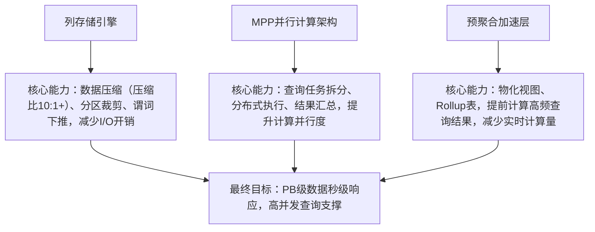
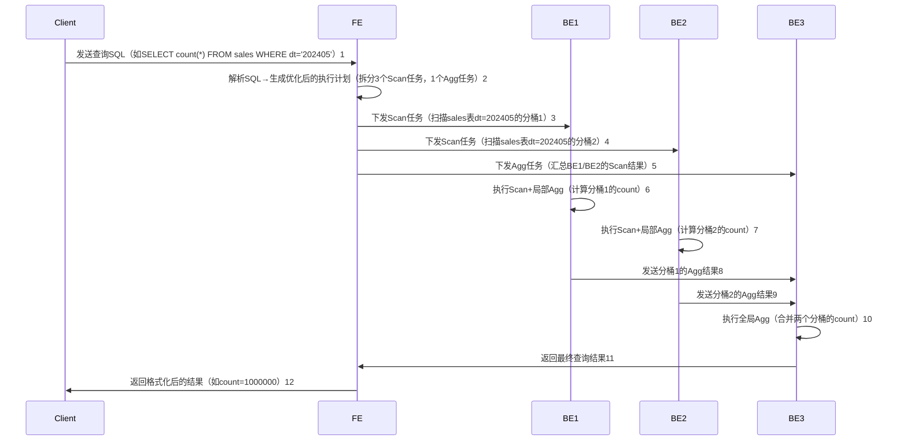
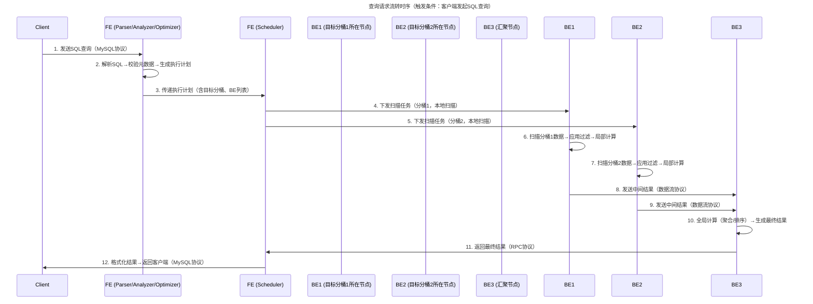
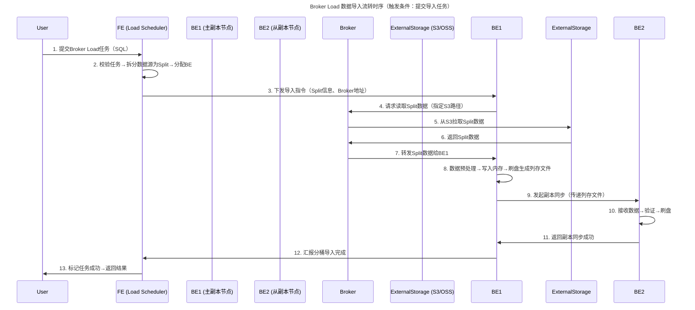
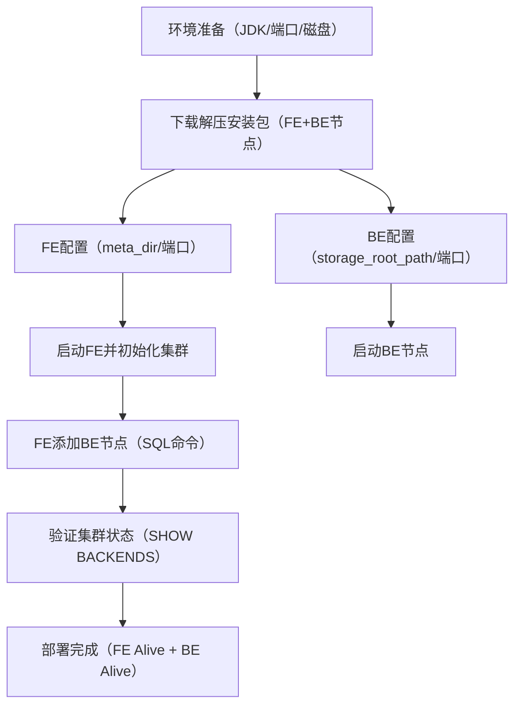
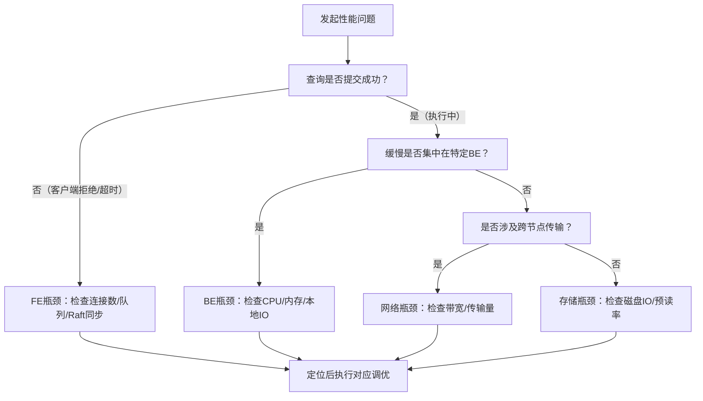
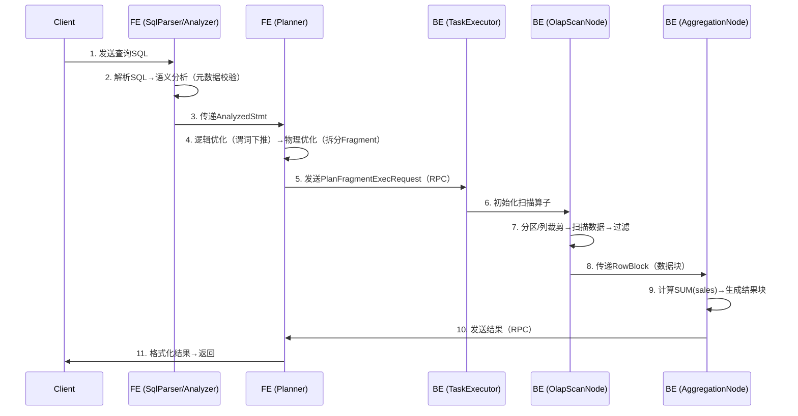

# 一、认知定位（Why & What）
## 1. 背景与起源：诞生的驱动力、解决的核心问题
### 1.1 诞生背景
- 来源：2017年由百度开源（初始名称为“百度Doris”），2021年进入Apache孵化器，2022年正式成为**Apache顶级开源项目（Apache Doris）**，目前由社区维护迭代
- 行业背景：大数据技术普及后，企业对“海量数据实时分析”的需求爆发式增长，但传统OLAP工具难以平衡“数据量、查询延迟、并发能力”三者关系

### 1.2 核心驱动力
Doris的诞生源于解决传统OLAP方案的核心痛点，具体包括：
- **Hive/Spark SQL痛点**：以批处理为核心，查询延迟达分钟级，无法满足实时报表、大屏监控等低延迟场景需求
- **Impala痛点**：强依赖Hadoop生态（YARN/HDFS），资源占用高，并发查询能力弱（仅支持数百QPS），运维成本高
- **ClickHouse痛点**：单表分析性能极致，但多表关联性能差、运维复杂度高（需手动调优分区、副本），对新手不友好
- **企业核心诉求**：需要一款“低延迟、高并发、易运维、兼容现有生态”的OLAP引擎，降低实时分析的技术门槛

### 1.3 解决的核心问题
- 海量数据实时查询：支持PB级结构化/半结构化数据，查询响应延迟控制在**秒级**（复杂查询<10秒，简单查询<1秒）
- 高并发业务场景：支撑数千QPS的查询请求（如电商大促实时大屏、金融实时风控报表、用户行为实时分析）
- 简化运维成本：采用单集群架构，无需依赖外部组件（可独立部署，也可对接S3/HDFS），支持自动副本管理、故障自愈
- 生态兼容：完全兼容MySQL协议，可直接使用MySQL客户端连接，无缝对接Tableau、FineBI、PowerBI等主流BI工具

## 2. 核心本质：最简化的核心模型（抽象本质）
### 2.1 核心模型抽象
Doris的本质是“**面向实时分析的列存MPP引擎**”，其最简化核心模型可拆解为3个关键模块，通过协同实现“海量数据秒级查询”目标：


### 2.2 核心设计理念
- **易用性优先**：兼容MySQL协议和标准SQL语法，降低开发与使用门槛（无需学习新协议/语法）
- **性能导向**：通过“列存+预聚合+MPP”三重优化，从“I/O、计算、数据量”三个维度降低查询延迟
- **灵活性适配**：支持两种部署模式（存算一体：本地磁盘；存算分离：对接S3/OSS/HDFS），适配不同存储成本与扩展性需求
- **稳定性保障**：内置副本机制（默认3副本）、故障自动转移、限流熔断等功能，确保生产环境高可用

## 3. 定位与关系：在技术体系中的位置、与同类事物的对比
### 3.1 在技术体系中的定位
Doris属于“**数据仓库/数据湖架构中的OLAP查询层**”，是连接“数据存储层”与“业务应用层”的核心枢纽，典型技术栈位置如下：
```mermaid
flowchart LR
    数据源[业务数据库/日志/埋点/第三方数据] --> ETL工具[Flink/Spark/DataX]
    ETL工具 --> 存储层[数据湖：S3/OSS/Hudi/Iceberg | 数据仓库：Hive]
    存储层 --> OLAP查询层[Apache Doris]
    OLAP查询层 --> 应用层[BI可视化工具/业务报表系统/实时大屏/数据API服务]
```
- 上游依赖：接收经ETL清洗后的结构化/半结构化数据，数据源可来自数据湖（如S3）或传统数据仓库（如Hive）
- 下游支撑：为业务提供查询能力，覆盖实时报表、即席分析（Ad-hoc）、数据大屏、业务监控等核心场景

### 3.2 与同类OLAP方案的对比（市占率TOP3）
选取当前市场使用率最高的3款OLAP工具（ClickHouse、Presto）与Doris进行横向对比，明确核心差异与适用场景：

| 对比维度         | Apache Doris               | ClickHouse（Yandex）        | Presto（Facebook）          |
|------------------|----------------------------|-----------------------------|-----------------------------|
| 架构类型         | 列存MPP（存算一体/分离）   | 列存分布式（非严格MPP）     | 内存型查询引擎（无存储）    |
| 查询延迟         | 秒级（PB级数据，复杂查询<10s） | 毫秒-秒级（单表极致性能，复杂查询易超时） | 秒-分钟级（依赖上游数据源性能） |
| 并发能力         | 高（支持数千QPS）          | 中（支持数百QPS，高并发易OOM） | 中（支持数百QPS，内存占用高） |
| 多表关联支持     | 强（优化完善，支持复杂Join） | 弱（单表优先，多表Join性能差） | 强（跨数据源Join能力突出）  |
| 存储依赖         | 灵活（本地盘/S3/HDFS/OSS） | 本地盘为主（需手动管理副本） | 无存储（依赖Hive/S3等外部源） |
| 运维复杂度       | 低（单集群，自动副本/故障转移） | 中（需手动调优分区/副本/合并策略） | 高（依赖Hadoop生态，需管理Coordinator/Worker） |
| 核心优势场景     | 实时报表、高并发查询、多表分析 | 单表极致分析（用户画像、日志统计） | 跨数据源即席查询（数据湖分析） |

### 3.3 替代与互补关系
#### 3.3.1 替代关系
- 替代Hive/Spark SQL：在实时报表场景中，Doris将查询延迟从“分钟级”降至“秒级”，同时降低资源占用（无需长期占用Spark集群）
- 替代Impala：在高并发分析场景中，Doris并发能力是Impala的3-5倍，且无需依赖YARN，运维更简单
- 部分替代ClickHouse：在需要多表关联、低运维成本的场景中，Doris可替代ClickHouse（如电商多维度订单分析）

#### 3.3.2 互补关系
- 与ClickHouse互补：Doris处理多表关联、高并发场景，ClickHouse处理单表极致性能场景（如用户行为日志明细查询），二者可共用存储层（如S3）
- 与Presto互补：Doris用于“高频固定报表”（预聚合加速），Presto用于“跨数据源灵活即席查询”（如同时查询Hive和MySQL数据）
- 与数据湖工具（Hudi/Iceberg）互补：Hudi/Iceberg负责“数据增量更新、版本管理”，Doris负责“更新后数据的低延迟查询”，形成“实时入湖+实时查询”闭环

# 二、原理支撑（How - Theory）
## 1. 体系结构：核心组件、组件关系、整体架构图
### 1.1 核心组件及职责
Doris 采用 **“前端（FE）+ 后端（BE）”的经典分布式架构**，配合可选的 Broker 组件实现外部存储对接，各组件职责明确且解耦，具体如下：

| 组件类型 | 核心角色                | 细分模块/实例类型       | 核心职责                                                                 |
|----------|-------------------------|-------------------------|--------------------------------------------------------------------------|
| **FE**   | 集群大脑（控制节点）    | Leader、Follower、Observer | - 元数据管理（库表结构、分区分桶、副本信息）<br>- 查询解析与优化（生成执行计划）<br>- 集群调度（BE 节点管理、任务分配）<br>- 导入任务规划（数据分片、分发策略） |
| **BE**   | 数据节点（存储与计算）  | 无细分类型（同质化节点） | - 数据存储（列存格式存储原始数据、预聚合结果）<br>- 执行查询任务（扫描、过滤、聚合、Join 等计算）<br>- 副本管理（数据同步、副本修复）<br>- 响应 FE 调度指令 |
| **Broker**| 外部存储代理（可选）    | 无细分类型（同质化节点） | - 对接外部存储（S3、OSS、HDFS 等）<br>- 实现“存算分离”场景下的数据读取/写入<br>- 屏蔽不同存储系统的协议差异，提供统一接口 |

### 1.2 整体架构图
Doris 集群的组件交互与数据流向可通过以下架构图直观理解（含存算一体与存算分离两种模式）：
```mermaid
graph TD
    subgraph 客户端层
        A[MySQL Client] -->|MySQL协议| FE
        B[BI工具（Tableau/FineBI）] -->|MySQL协议| FE
        C[导入工具（Stream Load/Broker Load）] -->|HTTP/内部协议| FE
    end

    subgraph 控制层（FE集群）
        FE_Leader[Leader FE<br>（唯一写节点）] -->|Raft协议同步元数据| FE_Follower[Follower FE<br>（读+投票节点）]
        FE_Leader -->|异步同步元数据| FE_Observer[Observer FE<br>（只读节点，扩展查询能力）]
    end

    subgraph 计算存储层（BE集群）
        BE1[BE Node 1] -->|数据同步| BE2[BE Node 2]
        BE2 -->|数据同步| BE3[BE Node 3]
        BE1 & BE2 & BE3 -->|汇报状态/执行任务| FE_Leader
    end

    subgraph 外部存储层（存算分离模式）
        Broker1[Broker Node 1] -->|代理读写| S3[S3/OSS]
        Broker2[Broker Node 2] -->|代理读写| HDFS[HDFS]
        Broker1 & Broker2 -->|接收指令| FE_Leader
        BE1 & BE2 & BE3 -->|通过Broker| S3 & HDFS
    end

    %% 标注两种模式
    style 外部存储层 fill:#f0f8ff,stroke:#4169e1,stroke-width:1px
    note over BE集群,外部存储层: 存算一体模式：BE直接读写本地磁盘；存算分离模式：BE通过Broker读写外部存储
```

### 1.3 组件核心交互关系
组件间通过“**指令调度+数据流转**”实现协同，关键交互逻辑包括：
1. **FE 内部交互**：通过 Raft 协议保证元数据一致性
   - Leader 是唯一能修改元数据的节点（如建表、删分区、修改副本数）；
   - Follower 同步 Leader 元数据，可参与 Leader 选举（当 Leader 故障时），同时提供读服务；
   - Observer 仅同步元数据，不参与选举，仅用于扩展查询并发能力（适合读多写少场景）。
2. **FE 与 BE 交互**：基于“心跳+指令”的双向通信
   - BE 每隔 10s 向 FE 发送心跳，汇报节点状态（存活、磁盘空间、数据负载）；
   - FE 根据心跳信息识别“健康 BE 节点”，并向其下发查询任务、导入任务、副本修复指令。
3. **BE 与 Broker 交互**：基于“代理请求”的单向通信
   - 存算分离场景下，BE 需读取外部存储数据时，先向 FE 申请 Broker 节点列表；
   - BE 向指定 Broker 发送数据读取请求，Broker 从外部存储拉取数据后返回给 BE。


## 2. 核心机制：支撑运行的关键原理
### 2.1 元数据管理机制
元数据是 Doris 集群的“中枢神经”，FE 通过 **“Raft 协议+分层存储”** 保证元数据的一致性、可靠性与高性能：
1. **元数据内容分层**
   - 核心元数据（必存 Raft 日志）：库表结构、分区分桶规则、FE/BE 节点信息、副本分布，这类数据修改需通过 Leader 写入 Raft 日志，确保集群一致；
   - 非核心元数据（本地存储）：查询历史、统计信息（如列的基数、最小值/最大值），这类数据仅用于优化查询计划，丢失后可重新计算，无需 Raft 同步。
2. **一致性保障流程**
   ```mermaid
   sequenceDiagram
       participant Client
       participant Leader FE
       participant Follower FE1
       participant Follower FE2

       Client->>Leader FE: 发送元数据修改请求（如建表）1
       Leader FE->>Leader FE: 校验请求合法性（权限、语法）2
       Leader FE->>Leader FE: 写入元数据到本地并生成Raft日志3
       Leader FE->>Follower FE1: 同步Raft日志4
       Leader FE->>Follower FE2: 同步Raft日志5
       Follower FE1-->>Leader FE: 返回日志同步成功6
       Follower FE2-->>Leader FE: 返回日志同步成功7
       Leader FE->>Client: 返回修改成功响应（需多数Follower确认）8
   ```
3. **元数据持久化**：Leader FE 将 Raft 日志写入本地磁盘（`meta_dir` 目录），Follower/Observer 同步日志后也持久化到本地，避免节点重启后元数据丢失。

### 2.2 查询调度与并行执行机制
Doris 能实现“PB 级数据秒级查询”，核心依赖 **“查询任务拆分+MPP 并行执行”** 机制，具体流程如下：
#### 2.2.1 文字化步骤
1. **查询解析与优化（FE 阶段）**
   1.1 客户端发送 SQL 到 FE，FE 的 Parser 模块将 SQL 解析为抽象语法树（AST）；
   1.2 Analyzer 模块结合元数据（表结构、分区信息）校验 AST 合法性（如字段存在性、权限）；
   1.3 Optimizer 模块生成最优执行计划：
       - 逻辑优化：合并过滤条件、消除冗余计算、选择 Join 顺序；
       - 物理优化：根据数据分布（分区分桶）拆分任务为“多个物理算子”（如 Scan、Filter、Aggregate），并分配到对应 BE 节点。
2. **任务分发与并行执行（BE 阶段）**
   2.1 FE 将执行计划拆分为“片段（Fragment）”，每个 Fragment 对应一组 BE 节点的计算任务；
   2.2 BE 节点接收 Fragment 后，启动多个线程并行执行（如按分桶扫描数据）；
   2.3 中间结果通过“数据流”在 BE 间传递（如 Shuffle Join 需将数据按 Join 键分发到目标 BE）；
3. **结果汇总与返回（FE+BE 协同）**
   3.1 最终计算结果由“汇聚节点”（某一个 BE）汇总；
   3.2 汇聚节点将结果返回给 FE，FE 再格式化后返回给客户端。

#### 2.2.2 查询执行时序图


### 2.3 数据存储与预聚合机制
Doris 通过 **“列存格式+分区分桶+预聚合”** 三重设计，从“存储层”降低 I/O 开销，提升查询性能：
1. **列存存储格式**
   - 数据按“列”而非“行”存储，查询时仅读取需要的列（如查询“销售额”时不读“用户ID”），减少无效数据读取；
   - 列数据天然具有高重复性，支持 LZ4、ZSTD 等压缩算法（压缩比通常达 10:1~20:1），大幅降低磁盘占用。
2. **分区与分桶（数据分片）**
   - 分区（Partition）：按时间（如 dt='202405'）、地域等粗粒度维度拆分数据，查询时通过“分区裁剪”排除无关分区（如查 5 月数据不读 4 月分区）；
   - 分桶（Bucket）：每个分区内按哈希键（如 user_id）细粒度拆分，将数据均匀分布到多个 BE 节点，实现并行扫描（如 1 个分区分 10 个桶，可由 10 个 BE 并行读取）。
3. **预聚合（Rollup 表）**
   - 原理：针对高频查询的“维度组合”（如按“日期+地区”统计销售额），提前计算并存储结果，查询时直接读取预聚合结果，无需扫描原始数据；
   - 示例：原始表按“日期、地区、商品ID”存储，创建 Rollup 表仅保留“日期、地区、销售额_sum”，查询“某日期各地区销售额”时，直接命中 Rollup 表，查询速度提升 10~100 倍。

### 2.4 容错与高可用机制
Doris 通过 **“副本冗余+故障检测+自动恢复”** 确保集群在节点故障时仍能正常服务，核心容错逻辑如下：
1. **FE 集群容错**
   - 基于 Raft 协议实现 Leader 选举：当 Leader FE 故障时，Follower FE 自动发起选举（需超过半数 Follower 投票），新 Leader 接管后继续提供服务，Raft 日志保证元数据不丢失；
   - Observer 扩容：通过增加 Observer 节点扩展读能力，且不影响选举流程（Observer 无投票权）。
2. **BE 节点容错**
   - 副本冗余：默认每个数据分片（Tablet）存储 3 个副本，分布在不同 BE 节点（跨机架部署更佳），单个 BE 故障不影响数据可用性；
   - 故障检测：FE 通过“心跳超时”识别故障 BE（默认 30s 未发心跳则标记为下线）；
   - 自动修复：FE 标记故障 BE 上的副本为“丢失”，并调度健康 BE 节点从其他副本同步数据，重建丢失的副本（修复完成后恢复 3 副本状态）。


## 3. 抽象建模：如何将现实问题转化为技术模型
### 3.1 核心抽象概念
Doris 将“业务数据查询需求”转化为“技术模型”，核心抽象概念对应现实场景的映射关系如下：

| 抽象概念       | 现实问题场景                                                                 | 技术定义与作用                                                                 |
|----------------|------------------------------------------------------------------------------|------------------------------------------------------------------------------|
| **表模型**     | 1. 需统计“多维度指标”（如各地区各品类销售额）<br>2. 需实时更新“用户余额”等数据<br>3. 需查询“原始日志明细” | 分三类表模型，适配不同场景：<br>- 聚合模型（Aggregate）：按 Key 列聚合，存储指标列的预计算结果（如 sum、count）<br>- 更新模型（Unique）：按 Key 列唯一，支持行级更新（如用户余额修改）<br>- 明细模型（Duplicate）：无聚合逻辑，存储原始数据（如日志查询） |
| **分区（Partition）** | 1. 需按“时间范围”查询（如近 7 天订单）<br>2. 需按“地域”隔离数据（如华东/华北地区数据） | 按“分区键”（如 dt 时间列、region 地域列）将表拆分为独立数据块，实现：<br>- 分区裁剪（查询时排除无关分区）<br>- 分区级操作（如删除历史分区、单独导入某分区数据） |
| **分桶（Bucket）**   | 1. 单表数据量过大（如 100TB），需分布式存储<br>2. 需并行查询提升速度（如多节点同时扫描） | 按“分桶键”（如 user_id、order_id）将单个分区拆分为更小的数据分片（Tablet），实现：<br>- 数据均匀分布（避免单节点负载过高）<br>- 并行计算（每个分桶对应一个查询任务，多节点并行执行） |
| **Rollup 表**       | 1. 高频查询“固定维度组合”（如按日期+地区查销售额）<br>2. 原始数据查询延迟高（如扫描 10TB 原始数据需分钟级） | 基于主表的“维度子集”创建预聚合表，存储：<br>- 简化的维度列（如主表有 5 个维度，Rollup 保留 2 个核心维度）<br>- 预计算的指标列（如 sum 销售额、avg 客单价）<br>查询时自动匹配最优 Rollup 表，降低延迟 |

### 3.2 建模逻辑（从业务到技术的转化步骤）
Doris 的建模过程需遵循“**业务需求→模型选择→分区分桶设计→预聚合优化**”的逻辑，确保技术模型贴合业务场景，具体步骤如下：
1. **Step 1：分析业务查询模式**
   - 明确核心需求：是“统计分析”（如报表）、“行级更新”（如用户数据）还是“原始明细查询”（如日志排查）？
   - 梳理高频查询：哪些维度（如时间、地区）和指标（如销售额、订单数）是查询热点？
2. **Step 2：选择表模型**
   - 若为“统计分析”：选**聚合模型**，指定“Key 列”（维度列）和“指标列”（sum/count 等）；
   - 若为“行级更新”：选**更新模型**，指定“唯一 Key 列”（如 user_id），确保更新操作仅作用于目标行；
   - 若为“原始明细查询”：选**明细模型**，无需指定聚合规则，保留所有原始字段。
3. **Step 3：设计分区策略**
   - 优先按“时间”分区（如 dt='yyyyMMdd'）：适配绝大多数“按时间范围查询”的业务场景，且便于历史数据归档；
   - 特殊场景按“业务维度”分区（如 region 地域列）：适合数据按地域隔离管理的场景（如不同地区数据权限不同）。
4. **Step 4：设计分桶策略**
   - 分桶键选择：优先选“高频过滤列”（如 user_id，查询时可通过分桶裁剪减少扫描范围）或“均匀分布列”（如 order_id，避免数据倾斜）；
   - 分桶数量：按“BE 节点数×2~3”设计（如 10 个 BE 节点，分 20~30 个桶），确保每个 BE 节点负载均匀，且支持并行查询。
5. **Step 5：创建 Rollup 表优化**
   - 针对高频查询的“维度组合”创建 Rollup 表：如主表按“dt、region、category、user_id”分桶，高频查询“dt+region”维度的销售额，则创建仅含“dt、region、sales_sum”的 Rollup 表；
   - 避免过度创建 Rollup：每个 Rollup 表会占用额外存储且增加导入延迟，仅针对“TOP 5 高频查询”创建。


## 4. 流转逻辑：数据/信息/指令的传递路径与触发条件
### 4.1 查询请求流转逻辑（从客户端到结果返回）
查询请求是 Doris 最核心的“信息流转”场景，需经过“客户端→FE→BE→FE→客户端”的完整路径，触发条件为“客户端发起 SQL 查询”。

#### 4.1.1 文字化步骤
1. **触发条件**：客户端（MySQL Client/BI 工具）通过 MySQL 协议向 FE 发送 SQL 查询请求（如 `SELECT * FROM sales WHERE dt='20240501'`）。
2. **FE 预处理阶段（信息解析与计划生成）**
   2.1 FE 的 **Parser** 模块将 SQL 解析为抽象语法树（AST），识别查询的表、字段、过滤条件；
   2.2 **Analyzer** 模块结合元数据校验：
       - 校验表/字段是否存在、用户是否有查询权限；
       - 解析分区条件（如 `dt='20240501'`），确定需扫描的分区；
   2.3 **Optimizer** 模块生成物理执行计划：
       - 确定扫描范围（目标分区的分桶列表）；
       - 选择执行算子（如 Scan、Filter、Aggregate）；
       - 分配 BE 节点（将分桶扫描任务分配到对应 BE，确保“本地扫描”（分桶所在 BE 执行扫描）以减少数据传输）。
3. **BE 执行阶段（数据计算与中间结果传递）**
   3.1 FE 通过 **内部 RPC 协议** 将执行计划片段（Fragment）下发到目标 BE 节点；
   3.2 BE 的 **Executor** 模块启动执行：
       - 按列存格式扫描目标分桶数据，应用过滤条件（如 `dt='20240501'`）；
       - 若有聚合/Join 操作，执行局部计算（如计算单个分桶的销售额总和）；
       - 中间结果通过 **数据流协议** 传递到“汇聚 BE 节点”（如多 BE 扫描结果需汇总到一个 BE 做全局聚合）。
4. **结果返回阶段（最终结果汇总与响应）**
   4.1 汇聚 BE 节点完成最终计算（如全局聚合、排序），将结果通过 RPC 协议返回给 FE；
   4.2 FE 对结果进行格式化（如按 MySQL 协议要求封装结果集），再通过 MySQL 协议返回给客户端。

#### 4.1.2 流转时序图


### 4.2 数据导入流转逻辑（从数据源到BE存储）
数据导入是 Doris 的“数据流转”核心场景，以最常用的 **Broker Load（批量导入外部存储数据）** 为例，触发条件为“用户通过 FE 提交导入任务”。

#### 4.2.1 文字化步骤
1. **触发条件**：用户通过 SQL 向 FE 提交 Broker Load 任务（如 `LOAD LABEL sales_load (DATA INFILE("s3://bucket/sales/20240501/*") INTO TABLE sales COLUMNS TERMINATED BY ',') WITH BROKER s3_broker`）。
2. **FE 导入规划阶段**
   2.1 FE 的 **Load Scheduler** 模块校验导入任务：
       - 校验表结构（字段数、数据类型）、导入权限；
       - 校验 Broker 配置（是否能连接外部存储 S3）；
   2.2 生成导入计划：
       - 拆分数据源：将外部存储的大文件拆分为多个“数据分片”（Split），每个 Split 大小默认 64MB~1GB（避免单分片过大导致超时）；
       - 分配 BE 节点：根据分桶分布，将每个 Split 分配给“目标分桶所在的 BE 节点”（确保数据直接写入目标分桶，减少副本同步开销）。
3. **BE 数据写入阶段**
   3.1 FE 向目标 BE 发送“导入指令”，包含 Split 信息、Broker 地址、分桶映射关系；
   3.2 BE 通过 Broker 读取外部存储数据：
       - BE 向 Broker 发送数据读取请求，Broker 从 S3 拉取 Split 数据并返回给 BE；
       - BE 对数据进行预处理（格式校验、字段转换、过滤脏数据）；
       - BE 将预处理后的数据写入“内存缓冲区”，按列存格式组织数据。
4. **数据提交与副本同步阶段**
   4.1 当一个分桶的所有 Split 写入完成后，BE 执行“数据合并”（将内存数据刷写到磁盘，生成列存文件）；
   4.2 触发副本同步：
       - 主副本 BE 向“从副本 BE”发送数据同步请求，传递列存文件；
       - 从副本 BE 接收并验证数据，完成后向主副本返回“同步成功”；
   4.3 BE 向 FE 汇报导入进度，当所有分桶的主从副本均完成写入后，FE 标记导入任务为“成功”。

#### 4.2.2 流转时序图


# 三、实践应用（How - Practice）
## 1. 基础操作：最小可用技能集（安装、配置、核心API）
### 1.1 安装部署（基于Apache Doris 2.1.x，主流稳定版本）
#### 1.1.1 环境准备（前置条件）
- **硬件要求**：
  - FE节点：CPU ≥ 4核，内存 ≥ 8GB（生产建议16GB+），磁盘 ≥ 100GB（存储元数据）
  - BE节点：CPU ≥ 8核，内存 ≥ 16GB（生产建议32GB+），磁盘 ≥ 1TB（存储业务数据，SSD优先）
- **软件要求**：
  - JDK 1.8+（FE依赖Java，BE为C++编写无需Java）
  - 操作系统：CentOS 7+/Ubuntu 18.04+（关闭SELinux、防火墙或开放端口）
  - 端口规划：FE默认端口（9030：MySQL客户端端口，8030：FE内部通信端口）；BE默认端口（9060：BE与FE通信端口，8040：BE内部通信端口）

#### 1.1.2 集群部署步骤（3节点示例：1 FE + 2 BE）
1. **下载与解压安装包**
   ```bash
   # 从官方镜像下载（https://doris.apache.org/zh-CN/download/）
   wget https://archive.apache.org/dist/doris/2.1.0/apache-doris-2.1.0-bin-x86_64.tar.gz
   tar -zxvf apache-doris-2.1.0-bin-x86_64.tar.gz
   cd apache-doris-2.1.0-bin-x86_64
   ```

2. **FE节点配置与启动**
   2.1 修改FE配置文件（`conf/fe.conf`）：
   ```ini
   meta_dir = /data/doris/fe/meta  # 元数据存储路径（需提前创建）
   http_port = 8030
   rpc_port = 9020
   query_port = 9030
   mysql_service_port = 9030
   ```
   2.2 启动FE并初始化集群：
   ```bash
   # 首次启动需加--initialize
   ./bin/start_fe.sh --daemon --initialize
   # 验证FE启动：查看日志或通过MySQL客户端连接
   mysql -h 127.0.0.1 -P 9030 -u root  # 初始无密码
   ```

3. **BE节点配置与添加**
   3.1 修改BE配置文件（`conf/be.conf`）：
   ```ini
   storage_root_path = /data/doris/be/storage  # 数据存储路径（需提前创建，多磁盘用逗号分隔）
   be_port = 9060
   webserver_port = 8040
   heartbeat_service_port = 9050
   ```
   3.2 启动BE：
   ```bash
   ./bin/start_be.sh --daemon
   ```
   3.3 从FE添加BE节点（通过MySQL客户端执行）：
   ```sql
   ALTER SYSTEM ADD BACKEND "be1_ip:9050", "be2_ip:9050";
   -- 验证BE状态（需为Alive）
   SHOW BACKENDS;
   ```

#### 1.1.3 部署流程可视化


### 1.2 核心配置（影响性能与稳定性的关键参数）
| 组件 | 参数名                | 配置文件       | 默认值       | 说明                                                                 | 生产环境建议                  |
|------|-----------------------|----------------|--------------|----------------------------------------------------------------------|-------------------------------|
| FE   | `meta_dir`            | conf/fe.conf   | 无           | FE元数据存储路径（含库表结构、分桶信息）                             | 独立磁盘，避免与系统盘共用    |
| FE   | `max_conn`            | conf/fe.conf   | 1024         | MySQL客户端最大连接数                                                | 高并发场景设为5000~10000       |
| BE   | `storage_root_path`   | conf/be.conf   | 无           | BE数据存储路径（支持多磁盘，用逗号分隔）                             | 多块SSD，按“/disk1/doris,/disk2/doris”格式配置 |
| BE   | `be_process_memory_limit` | conf/be.conf | 8G           | BE进程最大内存限制（避免OOM）                                        | 内存32GB节点设为20G~24G        |
| BE   | `columnar_storage_mode` | conf/be.conf | true         | 是否启用列存模式（Doris核心特性，不可关闭）                          | 保持true                      |
| 集群 | `replica_num`         | 建表语句       | 3            | 数据副本数（保障高可用）                                             | 生产环境设为3，测试环境可设为1 |

### 1.3 常用API（SQL为主，兼容MySQL协议）
#### 1.3.1 库表操作（核心DDL）
1. **创建数据库**
   ```sql
   CREATE DATABASE IF NOT EXISTS sales_db COMMENT '销售业务数据库';
   USE sales_db;
   ```

2. **创建表（三种核心表模型示例）**
   - 聚合模型（统计分析场景，如销售额汇总）：
     ```sql
     CREATE TABLE sales_agg (
         dt DATE COMMENT '日期',
         region_id INT COMMENT '地区ID',
         category STRING COMMENT '商品品类',
         sales_amount BIGINT SUM COMMENT '销售额（求和）',
         order_count BIGINT COUNT COMMENT '订单数（计数）'
     ) ENGINE=OLAP
     AGGREGATE KEY(dt, region_id, category)  -- 聚合Key（维度列）
     PARTITION BY RANGE (dt) (  -- 按日期分区
         PARTITION p202405 VALUES [('2024-05-01'), ('2024-06-01')),
         PARTITION p202406 VALUES [('2024-06-01'), ('2024-07-01'))
     )
     DISTRIBUTED BY HASH (region_id) BUCKETS 10  -- 按地区ID分桶，10个桶
     PROPERTIES (
         "replication_num" = "3",  -- 3副本
         "storage_medium" = "SSD"  -- 存储介质（SSD/HDD）
     );
     ```
   - 明细模型（原始数据查询场景，如用户行为日志）：
     ```sql
     CREATE TABLE user_behavior (
         user_id BIGINT COMMENT '用户ID',
         action_time DATETIME COMMENT '行为时间',
         action_type STRING COMMENT '行为类型（点击/下单）',
         page_url STRING COMMENT '页面URL'
     ) ENGINE=OLAP
     DUPLICATE KEY(user_id, action_time)  -- 排序Key（非唯一）
     PARTITION BY RANGE (action_time) (
         PARTITION p202405 VALUES [('2024-05-01 00:00:00'), ('2024-06-01 00:00:00'))
     )
     DISTRIBUTED BY HASH (user_id) BUCKETS 20;
     ```

#### 1.3.2 数据导入（两种主流方式）
1. **Broker Load（批量导入外部存储数据，如S3/OSS）**
   ```sql
   LOAD LABEL sales_db.load_sales_202405 (
       DATA INFILE("s3://sales-bucket/202405/*.csv")  -- S3文件路径
       INTO TABLE sales_agg
       COLUMNS TERMINATED BY ','  -- CSV分隔符
       COLUMNS (dt, region_id, category, sales_amount, order_count)  -- 匹配文件列
       SET (dt = str_to_date(dt, '%Y%m%d'))  -- 格式转换（如文件中dt为20240501）
   ) WITH BROKER s3_broker (  -- 提前配置的Broker名称
       "aws_access_key" = "AKxxxx",
       "aws_secret_key" = "SKxxxx",
       "aws_region" = "cn-north-1"
   ) PROPERTIES (
       "timeout" = "3600",  -- 导入超时时间（秒）
       "max_filter_ratio" = "0.01"  -- 脏数据容忍率（1%）
   );
   -- 查看导入状态
   SHOW LOAD WHERE LABEL = 'load_sales_202405';
   ```

2. **Stream Load（实时导入，如Flink/Java客户端推送）**
   ```bash
   # 示例：通过curl推送CSV数据到Doris
   curl -X PUT \
     -H "Authorization: Basic `echo -n 'root:' | base64`" \  # 用户名密码（root默认无密码）
     -H "Label: stream_load_sales_20240501" \
     -H "Columns: dt,region_id,category,sales_amount,order_count" \
     -T sales_20240501.csv \  # 本地CSV文件
     "http://fe_ip:8030/api/sales_db/sales_agg/_stream_load"
   ```

#### 1.3.3 查询操作（基础查询与优化示例）
1. **基础统计查询**
   ```sql
   -- 查2024-05各地区销售额Top5
   SELECT region_id, SUM(sales_amount) AS total_sales
   FROM sales_agg
   WHERE dt = '2024-05-01'
   GROUP BY region_id
   ORDER BY total_sales DESC
   LIMIT 5;
   ```

2. **分区裁剪优化（强制命中分区，减少扫描数据）**
   ```sql
   -- 仅扫描p202405分区，避免全表扫描
   SELECT category, AVG(order_count) AS avg_order
   FROM sales_agg
   WHERE dt BETWEEN '2024-05-01' AND '2024-05-31'  -- 与分区规则匹配
   GROUP BY category;
   ```


## 2. 典型案例：代表性场景的完整实现（含步骤与解析）
### 2.1 案例1：实时销售报表（聚合模型+Broker Load）
#### 2.1.1 需求分析
- **业务目标**：每日统计各地区、各品类的销售额与订单数，生成实时报表（查询延迟<5秒）
- **数据来源**：电商订单系统每日生成的CSV文件，存储在S3（路径：`s3://sales-bucket/daily/202405xx.csv`）
- **查询模式**：高频按“日期+地区”过滤，按“品类”分组统计

#### 2.1.2 实现步骤
1. **建模（创建聚合表）**
   参考1.3.1中“聚合模型”建表语句，核心设计：
   - 分区：按`dt`（DATE类型）Range分区，每月一个分区
   - 分桶：按`region_id`（INT）Hash分桶，10个桶（集群2个BE，每个BE负载5个桶）
   - 指标：`sales_amount`（SUM）、`order_count`（COUNT），提前聚合减少查询计算量

2. **数据导入（每日定时执行Broker Load）**
   ```sql
   -- 导入2024-05-02的销售数据
   LOAD LABEL sales_db.daily_load_20240502 (
       DATA INFILE("s3://sales-bucket/daily/20240502.csv")
       INTO TABLE sales_agg
       COLUMNS TERMINATED BY ','
       COLUMNS (dt_str, region_id, category, sales_amount, order_count)
       SET (dt = str_to_date(dt_str, '%Y-%m-%d'))  -- 转换文件中的日期字符串为DATE类型
   ) WITH BROKER s3_broker (
       "aws_access_key" = "AKxxxx",
       "aws_secret_key" = "SKxxxx"
   ) PROPERTIES (
       "timeout" = "7200",
       "max_filter_ratio" = "0.005"  -- 严格控制脏数据（0.5%）
   );
   ```

3. **报表查询与可视化**
   - 核心查询SQL（对接Tableau/FineBI）：
     ```sql
     SELECT 
         dt,
         region_id,
         category,
         SUM(sales_amount) AS total_sales,
         SUM(order_count) AS total_orders,
         ROUND(SUM(sales_amount)/SUM(order_count), 2) AS avg_order_value  -- 衍生指标：客单价
     FROM sales_agg
     WHERE dt BETWEEN '2024-05-01' AND '2024-05-07'
     GROUP BY dt, region_id, category
     ORDER BY dt DESC, total_sales DESC;
     ```
   - 可视化配置：Tableau中通过“MySQL连接”对接FE的9030端口，将查询结果生成分地区的销售额趋势图。

#### 2.1.3 案例解析
- **模型选择原因**：聚合模型提前按`dt+region_id+category`聚合指标，查询时无需扫描原始订单数据（原始数据量1000万/天，聚合后仅10万行），查询延迟从“分钟级”降至“秒级”。
- **分桶设计依据**：按`region_id`分桶，确保同一地区的数据集中存储，查询“某地区数据”时仅扫描对应分桶，减少跨节点数据传输。
- **导入优化**：Broker Load支持批量导入大文件（单文件10GB+），且通过`max_filter_ratio`过滤脏数据，保证报表数据准确性。

### 2.2 案例2：用户行为明细查询（明细模型+Stream Load）
#### 2.2.1 需求分析
- **业务目标**：实时查询用户近1小时内的行为轨迹（如点击、加购、下单），用于客服排查用户操作问题（查询延迟<10秒）
- **数据来源**：Flink实时流处理用户行为数据，每秒产生1000条记录，需实时写入Doris
- **查询模式**：低频但需灵活过滤（如按`user_id`、`action_type`、`action_time`组合查询）

#### 2.2.2 实现步骤
1. **建模（创建明细表）**
   ```sql
   CREATE TABLE user_behavior (
       user_id BIGINT COMMENT '用户ID',
       action_time DATETIME COMMENT '行为时间（精确到秒）',
       action_type STRING COMMENT '行为类型：click/add_cart/pay',
       page_url STRING COMMENT '页面URL',
       product_id BIGINT COMMENT '商品ID'
   ) ENGINE=OLAP
   DUPLICATE KEY(user_id, action_time)  -- 按用户ID+时间排序，加速范围查询
   PARTITION BY RANGE (action_time) (
       PARTITION p202405 VALUES [('2024-05-01 00:00:00'), ('2024-06-01 00:00:00'))
   )
   DISTRIBUTED BY HASH (user_id) BUCKETS 30  -- 30个桶，适配3个BE节点
   PROPERTIES (
       "replication_num" = "3",
       "storage_medium" = "SSD",  -- SSD提升明细数据的随机读性能
       "enable_persistent_index" = "true"  -- 启用持久化索引，加速按user_id过滤
   );
   ```

2. **实时导入（Flink对接Stream Load）**
   - Flink SQL配置（写入Doris）：
     ```sql
     CREATE TABLE doris_sink (
         user_id BIGINT,
         action_time DATETIME,
         action_type STRING,
         page_url STRING,
         product_id BIGINT
     ) WITH (
         'connector' = 'doris',
         'fenodes' = 'fe1_ip:8030,fe2_ip:8030',  -- FE节点列表（高可用）
         'table.identifier' = 'sales_db.user_behavior',
         'username' = 'root',
         'password' = '',
         'sink.batch.size' = '1000',  -- 每1000条数据批量推送
         'sink.max-retries' = '3',    -- 失败重试3次
         'sink.properties.labelPrefix' = 'flink_stream_load_'  -- 导入Label前缀
     );

     -- 将Flink源表数据写入Doris
     INSERT INTO doris_sink
     SELECT user_id, action_time, action_type, page_url, product_id
     FROM user_behavior_source;  -- Flink源表（Kafka/CDC）
     ```

3. **明细查询（客服排查场景）**
   ```sql
   -- 查用户10086在2024-05-02 14:00-15:00的行为轨迹
   SELECT 
       action_time,
       action_type,
       page_url,
       product_id
   FROM user_behavior
   WHERE 
       user_id = 10086
       AND action_time BETWEEN '2024-05-02 14:00:00' AND '2024-05-02 15:00:00'
   ORDER BY action_time ASC;
   ```

#### 2.2.3 案例解析
- **模型选择原因**：明细模型保留原始行为数据，支持任意维度的灵活过滤（如客服需同时按`user_id`和`action_type`查询），而聚合模型无法满足此类“非预定义维度”的查询需求。
- **存储介质选择**：SSD的随机读性能是HDD的5~10倍，明细查询常需按`user_id`随机定位数据，SSD可显著降低查询延迟。
- **实时导入优化**：Flink通过Stream Load批量推送数据（每1000条一批），平衡“实时性”（延迟<10秒）与“导入性能”（避免高频小批量请求压垮FE）。


## 3. 问题诊断：常见错误、异常排查与解决方案
### 3.1 集群部署类错误
| 错误现象 | 可能原因 | 排查步骤 | 解决方案 | 验证方法 |
|----------|----------|----------|----------|----------|
| FE启动失败，日志报“meta directory not exist” | `meta_dir`配置路径未创建或权限不足 | 1. 查看FE日志：`log/fe.out`<br>2. 检查`meta_dir`路径是否存在：`ls -ld /data/doris/fe/meta` | 1. 创建路径：`mkdir -p /data/doris/fe/meta`<br>2. 赋予权限：`chown -R doris:doris /data/doris` | 重新启动FE：`start_fe.sh --daemon`，日志无报错 |
| BE添加到FE后状态为“Decommissioned” | 1. BE与FE网络不通（9050端口）<br>2. BE存储路径权限不足 | 1. 在FE节点测试BE端口：`telnet be_ip 9050`<br>2. 查看BE日志：`log/be.out`，是否有“permission denied” | 1. 开放9050端口：`firewall-cmd --add-port=9050/tcp --permanent`<br>2. 修复存储路径权限：`chown -R doris:doris /data/doris/be` | 执行`ALTER SYSTEM RECOVER BACKEND "be_ip:9050";`，10秒后`SHOW BACKENDS`状态变为Alive |

### 3.2 数据导入类错误
| 错误现象 | 可能原因 | 排查步骤 | 解决方案 | 验证方法 |
|----------|----------|----------|----------|----------|
| Broker Load报“File does not exist” | 1. S3/OSS路径错误<br>2. Broker配置的AK/SK无权限 | 1. 检查`DATA INFILE`路径是否正确（是否多斜杠/少后缀）<br>2. 用Broker测试路径权限：`curl http://be_ip:8040/api/bootstrap_broker?path=s3://xxx` | 1. 修正文件路径（如`s3://sales-bucket/20240502.csv`）<br>2. 重新配置Broker的AK/SK：`ALTER SYSTEM SET BROKER PROPERTIES ...` | 重新提交Load任务，`SHOW LOAD`状态变为“FINISHED” |
| Stream Load报“Label already exists” | 同一Label在1小时内重复使用（Doris Label唯一周期为1小时） | 1. 查看历史导入记录：`SHOW LOAD WHERE LABEL = 'xxx'`<br>2. 确认Label是否在1小时内使用过 | 1. 修改Label为唯一值（如加时间戳：`stream_load_202405021430`）<br>2. 若需强制重跑，等待1小时后再用原Label | 重新推送数据，返回`"Status": "Success"` |

### 3.3 查询类错误
| 错误现象 | 可能原因 | 排查步骤 | 解决方案 | 验证方法 |
|----------|----------|----------|----------|----------|
| 查询超时（报“Query timed out”） | 1. 未命中分区，全表扫描<br>2. 数据量过大，BE计算资源不足 | 1. 查看执行计划：`EXPLAIN SELECT ...`，是否有“PARTITION: ALL”<br>2. 查看BE负载：`top`命令看CPU/内存使用率 | 1. 优化查询条件，强制分区裁剪（如加`dt = '2024-05-01'`）<br>2. 扩容BE节点或增加BE内存（调整`be_process_memory_limit`） | 重新执行查询，响应时间<10秒 |
| 多表Join报“Data skew” | 小表未被广播，大表Join键分布不均 | 1. 查看Join执行计划：是否有“BROADCAST JOIN”<br>2. 统计Join键分布：`SELECT join_key, COUNT(*) FROM table GROUP BY join_key` | 1. 强制小表广播：`SELECT /*+ BROADCAST(t1) */ ... FROM t1 JOIN t2 ON ...`（t1为小表，<10万行）<br>2. 拆分倾斜Key：将高频Join键拆分为多个子Key | 重新执行Join查询，无“Data skew”警告，执行时间缩短50%+ |

### 3.4 集群运维类错误
| 错误现象 | 可能原因 | 排查步骤 | 解决方案 | 验证方法 |
|----------|----------|----------|----------|----------|
| FE Leader频繁切换 | 1. FE节点间网络不稳定<br>2. Leader节点CPU/内存过载 | 1. 查看FE日志：`log/fe.log`，是否有“Leader lost”<br>2. 监控Leader节点资源：`vmstat 1`看CPU idle是否<20% | 1. 优化FE节点网络（如使用万兆网卡）<br>2. 迁移Leader节点到更高配置机器（16核32GB+） | 执行`SHOW PROC '/frontends'`，Leader节点稳定>24小时 |
| BE磁盘满（报“Storage full”） | 1. 历史分区未归档<br>2. 副本数配置过高 | 1. 查看各分区数据量：`SHOW PROC '/dbs/[db_id]/tables/[table_id]/partitions'`<br>2. 查看BE磁盘使用：`df -h /data/doris/be/storage` | 1. 归档历史分区：`ALTER TABLE table_name ARCHIVE PARTITION p202403`<br>2. 降低非核心表副本数：`ALTER TABLE table_name SET ("replication_num" = "2")` | 查看BE磁盘使用：`df -h`，使用率<80% |


## 4. 场景扩展：从单一场景到复杂系统的应用进阶
### 4.1 扩展1：多表关联查询（跨业务域分析）
#### 4.1.1 适用场景
需结合多个业务域数据进行分析（如“销售数据+用户数据”分析各用户等级的消费能力），核心挑战是避免数据倾斜、提升Join性能。

#### 4.1.2 实现步骤
1. **准备关联表**
   - 主表：`sales_agg`（销售数据，1000万行）
   - 关联表：`user_profile`（用户画像，100万行，小表）
     ```sql
     CREATE TABLE user_profile (
         user_id BIGINT COMMENT '用户ID',
         user_level STRING COMMENT '用户等级：V1/V2/V3',
         register_time DATE COMMENT '注册时间'
     ) ENGINE=OLAP
     DUPLICATE KEY(user_id)
     DISTRIBUTED BY HASH (user_id) BUCKETS 10
     PROPERTIES ("replication_num" = "3");
     ```

2. **优化Join查询**
   ```sql
   -- 分析2024-05各用户等级的销售额（强制广播小表user_profile）
   SELECT /*+ BROADCAST(up) */
       up.user_level,
       SUM(sa.sales_amount) AS total_sales,
       COUNT(DISTINCT sa.order_count) AS user_count  -- 去重统计付费用户数
   FROM sales_agg sa
   JOIN user_profile up ON sa.user_id = up.user_id  -- 按user_id关联
   WHERE sa.dt BETWEEN '2024-05-01' AND '2024-05-31'
     AND up.register_time < '2024-01-01'  -- 筛选老用户
   GROUP BY up.user_level
   ORDER BY total_sales DESC;
   ```

#### 4.1.3 关键技巧
- **小表广播规则**：当关联表数据量<10万行时，Doris自动广播；>10万行需手动加`/*+ BROADCAST(table) */` hint，避免大表Shuffle（Shuffle会产生大量网络传输）。
- **Join键对齐**：主表与关联表的分桶键尽量一致（如均按`user_id`分桶），实现“本地Join”（同一分桶内数据在同一BE节点关联，无需跨节点传输）。

### 4.2 扩展2：数据湖集成（对接Hudi/Iceberg）
#### 4.2.1 适用场景
采用“数据湖+Doris”架构，数据湖（Hudi/Iceberg）存储全量原始数据，Doris仅存储高频查询的聚合结果，降低存储成本（数据湖用低成本对象存储，如S3）。

#### 4.2.2 实现步骤（对接Hudi表）
1. **部署Hudi Broker**
   - 下载Hudi Broker插件：`https://doris.apache.org/zh-CN/docs/data-source/external-table/hudi`
   - 解压到Doris的`be/lib/broker`目录，重启BE节点。

2. **创建Hudi外部表**
   ```sql
   CREATE EXTERNAL TABLE hudi_sales_raw (
       order_id BIGINT COMMENT '订单ID',
       user_id BIGINT COMMENT '用户ID',
       sales_amount BIGINT COMMENT '销售额',
       dt DATE COMMENT '日期'
   ) ENGINE=HUDI
   COMMENT 'Hudi数据湖中的原始订单表'
   PROPERTIES (
       "hudi.path" = "s3://hudi-bucket/sales_raw",  -- Hudi表存储路径
       "hudi.metadata_enabled" = "true",
       "broker.name" = "hudi_broker"  -- 提前配置的Hudi Broker
   );
   ```

3. **Doris与Hudi联合查询**
   ```sql
   -- 从Hudi读原始数据，与Doris的聚合表关联分析
   SELECT 
       sa.dt,
       sa.region_id,
       COUNT(DISTINCT hsr.order_id) AS total_orders  -- Hudi表提供订单ID去重
   FROM sales_agg sa
   JOIN hudi_sales_raw hsr ON sa.dt = hsr.dt AND sa.user_id = hsr.user_id
   WHERE sa.dt = '2024-05-01'
   GROUP BY sa.dt, sa.region_id;
   ```

#### 4.2.3 关键技巧
- **元数据同步**：Hudi表结构变更后，需在Doris中执行`REFRESH EXTERNAL TABLE hudi_sales_raw`同步元数据。
- **查询优化**：仅在需要原始数据时关联Hudi表，高频统计查询优先使用Doris本地聚合表，避免频繁访问数据湖（数据湖查询延迟较高）。

### 4.3 扩展3：高并发查询优化（应对峰值场景）
#### 4.3.1 适用场景
电商大促（如618）期间，BI报表、实时大屏等场景的查询并发量从“数百QPS”飙升至“数千QPS”，需避免FE/BE过载。

#### 4.3.2 实现步骤
1. **FE扩容（增加Observer节点）**
   - Observer节点仅提供读服务，不参与Leader选举，可线性扩展查询并发：
     ```bash
     # 部署Observer（配置与FE一致，修改fe.conf的priority_networks）
     ./bin/start_fe.sh --daemon --helper fe_leader_ip:9010 --observer
     # 在Leader FE中添加Observer
     ALTER SYSTEM ADD OBSERVER "observer_ip:9010";
     ```
   - 客户端连接时，将查询请求分发到Observer节点（如通过Nginx代理FE的9030端口）。

2. **BE资源隔离**
   - 为高优先级查询（如实时大屏）分配独立BE资源池：
     ```sql
     -- 创建资源池（预留20% CPU给高优先级查询）
     CREATE RESOURCE GROUP high_priority_pool 
     PROPERTIES (
         "cpu_core_limit" = "20",
         "memory_limit" = "20%"
     );
     -- 绑定大屏查询用户到资源池
     GRANT USAGE ON RESOURCE GROUP high_priority_pool TO big_screen_user;
     ```

3. **查询缓存开启**
   - 对高频重复查询（如大屏固定报表）开启结果缓存：
     ```sql
     -- 全局开启缓存（有效期5分钟）
     SET GLOBAL query_cache_type = ON;
     SET GLOBAL query_cache_expire = 300;
     -- 单查询强制使用缓存
     SELECT /*+ USE_QUERY_CACHE */ * FROM sales_dashboard WHERE dt = '2024-05-01';
     ```

#### 4.3.3 关键技巧
- **Observer扩容原则**：按“1个Leader + 2个Follower + N个Observer”配置，Observer数量根据查询并发量调整（每Observer支持500~1000 QPS）。
- **缓存失效控制**：数据更新后（如销售数据每10分钟导入一次），手动清理对应缓存：`INVALIDATE QUERY CACHE WHERE TABLE = 'sales_agg';`。

### 4.4 扩展4：数据归档策略（管理历史数据）
#### 4.4.1 适用场景
业务数据按时间增长（如销售数据每月新增100GB），需将3个月前的历史数据归档到低成本存储（如HDFS冷存储），节省Doris本地SSD成本。

#### 4.4.2 实现步骤
1. **创建归档存储（HDFS外部表）**
   ```sql
   CREATE EXTERNAL TABLE sales_archive (
       dt DATE COMMENT '日期',
       region_id INT COMMENT '地区ID',
       category STRING COMMENT '商品品类',
       sales_amount BIGINT SUM COMMENT '销售额',
       order_count BIGINT COUNT COMMENT '订单数'
   ) ENGINE=HDFS
   COMMENT 'HDFS归档表'
   PARTITIONED BY RANGE (dt)
   PROPERTIES (
       "path" = "hdfs://hdfs-nn:9000/doris/archive/sales_archive",
       "format" = "parquet",  -- 用Parquet格式压缩存储
       "broker.name" = "hdfs_broker"
   );
   ```

2. **归档历史分区**
   ```sql
   -- 将2024-02的分区从Doris本地表归档到HDFS
   INSERT INTO sales_archive
   SELECT dt, region_id, category, sales_amount, order_count
   FROM sales_agg
   WHERE dt BETWEEN '2024-02-01' AND '2024-02-28';

   -- 归档完成后，删除Doris本地表的历史分区（释放SSD空间）
   ALTER TABLE sales_agg DROP PARTITION p202402;
   ```

3. **归档数据查询**
   - 通过“视图”统一查询实时数据与归档数据：
     ```sql
     CREATE VIEW sales_all AS
     SELECT * FROM sales_agg  -- 实时数据（近3个月）
     UNION ALL
     SELECT * FROM sales_archive;  -- 归档数据（3个月前）

     -- 查询2024年全年数据
     SELECT dt, SUM(sales_amount) AS total_sales
     FROM sales_all
     WHERE dt BETWEEN '2024-01-01' AND '2024-12-31'
     GROUP BY dt;
     ```

#### 4.4.3 关键技巧
- **归档时间选择**：在业务低峰期（如凌晨2~4点）执行归档，避免影响正常查询。
- **格式选择**：归档表用Parquet格式（压缩比高，查询时支持列裁剪），比CSV节省50%以上存储。

# 四、深度进阶（Mastery）
## 1. 性能优化：瓶颈分析、调优策略、最佳参数配置
### 1.1 瓶颈分析方法（定位性能卡点的核心流程）
性能瓶颈通常集中在 FE、BE、存储 I/O、网络四个环节，需按“先定位环节→再细化指标”的流程排查，具体方法如下：

#### 1.1.1 FE 瓶颈分析
- 核心工具：Doris 内置 SQL、FE 日志（`log/fe.log`）
- 关键指标与排查命令：
  1. 查询队列拥堵：执行 `SHOW PROC '/query_process_list';`，若大量任务处于“PENDING”状态，说明 FE 调度能力不足；
  2. 元数据操作延迟：查看 FE 日志中“metadata operation”耗时（如建表、删分区耗时>10s，可能是 Raft 同步慢）；
  3. 连接数超限：对比 `SHOW VARIABLES LIKE 'max_conn';`（最大连接数）与 `SHOW STATUS LIKE 'Threads_connected';`（当前连接数），若接近上限，说明连接数不足。
- 瓶颈特征：新查询无法提交、元数据操作超时、客户端连接被拒绝。

#### 1.1.2 BE 瓶颈分析
- 核心工具：Linux 命令（`top`/`vmstat`/`iostat`）、BE 监控页（`http://be_ip:8040/metrics`）
- 关键指标与排查命令：
  1. CPU 利用率：`top -p $(pidof be)`，若单进程 CPU 持续>90%，说明计算资源不足；
  2. 内存溢出风险：`free -h` 查看 BE 进程内存，若接近 `be_process_memory_limit`，易触发 OOM；
  3. 任务排队：BE 监控中 `doris_be_task_queue_length` 指标持续>10，说明计算线程不足。
- 瓶颈特征：查询执行缓慢、BE 进程频繁重启（OOM 导致）、部分查询报“Resource exhausted”。

#### 1.1.3 存储 I/O 瓶颈分析
- 核心工具：`iostat`/`iotop`、BE 日志（`log/be.out`）
- 关键指标与排查命令：
  1. 磁盘负载：`iostat -x 1`，若 `%util` 接近 100%，说明磁盘 IO 饱和；
  2. 读写耗时：BE 日志中“read block”“write block”耗时>100ms，说明存储性能差；
  3. 预读命中率：`cat /proc/vmstat | grep pgrep`，命中率<90% 需调整 I/O 调度。
- 瓶颈特征：全表扫描类查询延迟高、BE 磁盘 IO 使用率持续满负荷。

#### 1.1.4 网络瓶颈分析
- 核心工具：`ifstat`/`tcpdump`、BE 监控
- 关键指标与排查命令：
  1. 带宽利用率：`ifstat -i eth0 1`，若发送/接收带宽接近网卡上限，说明网络拥堵；
  2. 跨节点传输量：BE 监控中 `doris_be_data_transfer_bytes` 指标骤增（多表 Join 场景常见）。
- 瓶颈特征：跨节点 Join 查询延迟高、Broker Load 导入时传输超时。

#### 1.1.5 瓶颈分析流程可视化


### 1.2 核心调优策略（附实战示例）
#### 1.2.1 FE 调优（提升调度与连接能力）
1. 扩展读并发：增加 Observer 节点（无选举权限，仅承担读请求）
   - 部署命令：`./bin/start_fe.sh --daemon --helper fe_leader_ip:9010 --observer`
   - 效果：单 Observer 支持 500~1000 QPS，3 个 Observer 可将读并发提升至 1500~3000 QPS。
2. 优化连接配置：
   - 修改 `fe.conf`：`max_conn = 10000`（默认 1024，高并发场景调至 5000~10000），配套设置 `wait_timeout = 3600`（避免连接泄漏）。
3. 开启查询缓存：缓存高频重复查询（如实时大屏）
   - 全局开启：`SET GLOBAL query_cache_type = ON; SET GLOBAL query_cache_expire = 300;`（有效期 5 分钟）；
   - 单查询强制缓存：`SELECT /*+ USE_QUERY_CACHE */ region_id, SUM(sales) FROM sales_agg WHERE dt='20240501';`。

#### 1.2.2 BE 调优（提升计算与存储效率）
1. 内存资源分配：
   - 修改 `be.conf`：`be_process_memory_limit = 24G`（32GB 内存节点预留 8GB 系统内存），`exec_mem_limit = 16G`（单查询最大内存）。
2. 计算线程匹配 CPU：
   - 修改 `be.conf`：`cpu_core_limit = 16`（16 核 CPU 设为 16，避免上下文切换），`max_scan_threads_per_task = 4`（单扫描任务线程数）。
3. 存储 I/O 优化：
   - 介质升级：HDD 换 SSD（随机读性能提升 5~10 倍，明细查询延迟从秒级降毫秒级）；
   - 缓存调整：`block_cache_size = 8G`（SSD 建议 8~16G，HDD 建议 4~8G）。

#### 1.2.3 表设计调优（从源头降压力）
1. 分区分桶优化：
   - 分区键：优先按“时间”（如 dt），其次按“业务维度”（如 region），避免高基数列（如 user_id）；
   - 分桶数：分桶数 = BE 节点数 × 3~5（3 个 BE 设 9~15 桶），示例：`DISTRIBUTED BY HASH (region_id) BUCKETS 12;`。
2. Rollup 表预聚合：
   - 场景：高频查询“dt+region”维度，主表按“dt+region+category”分桶，创建 Rollup 表：
     ```sql
     ALTER TABLE sales_agg ADD ROLLUP rollup_dt_region (dt, region_id, sales_amount)
     DISTRIBUTED BY HASH (region_id) BUCKETS 12;
     ```
   - 效果：查询数据量减少 70%，延迟从 5 秒降至 1 秒。
3. 索引优化：
   - 明细模型加 Bloom Filter 索引（加速等值查询）：
     ```sql
     ALTER TABLE user_behavior ADD INDEX idx_user_id (user_id) USING BLOOMFILTER WITH (fpp = 0.01);
     ```

#### 1.2.4 SQL 调优（减少无效计算）
1. 强制分区裁剪：避免全表扫描，示例：
   - 反例：`SELECT * FROM sales_agg;`（100GB 数据需 30 秒）；
   - 正例：`SELECT * FROM sales_agg WHERE dt BETWEEN '20240501' AND '20240507';`（5GB 数据需 2 秒）。
2. 优化多表 Join：
   - 小表广播（<10 万行）：`SELECT /*+ BROADCAST(t2) */ t1.region_id, SUM(t1.sales) FROM sales_agg t1 JOIN user_profile t2 ON t1.user_id = t2.user_id;`；
   - 大表 Join 键对齐：主表与大表分桶键一致（如均按 user_id），实现“本地 Join”。

### 1.3 最佳参数配置（生产环境验证）
| 组件   | 参数名                  | 默认值   | 调优建议值 | 适用场景                  | 注意事项                          |
|--------|-------------------------|----------|------------|---------------------------|-----------------------------------|
| FE     | `max_conn`              | 1024     | 5000~10000 | 高并发查询（BI/API）      | 同步调整操作系统文件句柄（ulimit -n 65535） |
| BE     | `be_process_memory_limit` | 8G     | 24G（32GB内存） | 计算密集型查询            | 预留 20%~30% 内存给系统          |
| BE     | `block_cache_size`      | 2G       | 8G（SSD）  | 读密集型场景（明细查询）  | 不超过 BE 内存的 1/3              |
| 表级别 | `replication_num`       | 3        | 3（生产）  | 高可用需求                | 跨机架部署副本                    |
| 表级别 | `storage_medium`        | HDD      | SSD        | 低延迟查询（实时报表）    | 核心表用 SSD，非核心表用 HDD      |

## 2. 稳健性设计：容错机制、高可用方案、灾备策略
### 2.1 多层级容错机制（从组件到数据的全链路防护）
Doris 通过“组件容错→数据容错→链路容错”三层设计，确保单节点故障、网络抖动等问题不影响集群可用性，各层级核心逻辑如下：

#### 2.1.1 FE 组件容错（基于 Raft 协议的元数据安全）
- 核心逻辑：FE 集群通过 Raft 协议实现元数据一致性，Leader 负责写操作，Follower 同步元数据并参与选举，Observer 仅扩展读能力（无投票权）。
- 故障自愈流程：
  ```mermaid
  sequenceDiagram
      participant Leader FE
      participant Follower FE1
      participant Follower FE2
      participant Observer FE
      
      Note over Leader FE: 正常状态：Leader 处理写请求，Follower 同步元数据
      Leader FE->>Follower FE1: 1. 同步 Raft 日志（元数据修改）
      Leader FE->>Follower FE2: 2. 同步 Raft 日志（元数据修改）
      Follower FE1-->>Leader FE: 3. 日志同步确认
      Follower FE2-->>Leader FE: 4. 日志同步确认
      
      Note over Leader FE: Leader 故障（如宕机）
      Follower FE1->>Follower FE2: 5. 检测到 Leader 心跳超时（默认30s）
      Follower FE1->>Follower FE2: 6. 发起 Leader 选举请求
      Follower FE2-->>Follower FE1: 7. 投票支持 Follower FE1
      Note over Follower FE1: Follower FE1 成为新 Leader
      Follower FE1->>Observer FE: 8. 同步元数据（新 Leader 身份）
      Follower FE1->>BE 集群: 9. 通知 BE 新 Leader 地址
  ```
- 关键保障：
  1. 元数据持久化：Leader 将 Raft 日志写入本地磁盘（`meta_dir`），Follower/Observer 同步后也持久化，避免重启丢失；
  2. 选举阈值：超过半数 Follower 投票即可产生新 Leader（如 2 个 Follower 需 1 票，3 个 Follower 需 2 票）。

#### 2.1.2 BE 组件容错（副本冗余+自动修复）
- 核心逻辑：每个数据分片（Tablet）默认存储 3 个副本，分布在不同 BE 节点（跨机架部署），故障后自动重建副本。
- 故障处理步骤：
  1. 故障检测：FE 通过“心跳超时”标记故障 BE（默认 30s 未发送心跳）；
  2. 副本标记：FE 将故障 BE 上的 Tablet 副本标记为“缺失”（Missing）；
  3. 重建调度：FE 选择健康 BE 节点（优先同机架空闲节点），从其他健康副本同步数据；
  4. 恢复完成：新副本同步完成后，FE 将其标记为“正常”（Normal），恢复 3 副本状态。
- 实战配置：跨机架部署副本，修改 `be.conf` 中 `priority_networks = 192.168.1.0/24;192.168.2.0/24`（指定不同机架网段），确保副本分散在不同物理机架。

#### 2.1.3 数据容错（脏数据过滤+写入原子性）
- 脏数据过滤：导入时通过 `max_filter_ratio` 配置容忍率（如 0.01 表示允许 1% 脏数据），示例：
  ```sql
  LOAD LABEL sales_load (...) PROPERTIES ("max_filter_ratio" = "0.01");
  ```
- 写入原子性：
  - 导入任务要么全量成功（所有 Tablet 写入完成），要么全量失败（任意 Tablet 失败则回滚）；
  - 依赖“两阶段提交”：第一阶段所有 BE 完成数据写入但不生效，第二阶段 FE 确认所有 BE 就绪后，通知 BE 生效数据。

### 2.2 高可用方案设计（生产级集群部署）
#### 2.2.1 FE 高可用部署（避免单点故障）
- 集群配置：推荐“1 Leader + 2 Follower + N Observer”，具体角色分工：
  | 角色       | 数量建议 | 核心职责                          | 硬件配置（生产）       |
  |------------|----------|-----------------------------------|------------------------|
  | Leader     | 1        | 处理写请求、元数据管理、集群调度  | 16核32GB内存，SSD 200GB |
  | Follower   | 2        | 同步元数据、参与选举、处理读请求  | 16核32GB内存，SSD 200GB |
  | Observer   | 2~4      | 仅处理读请求，扩展并发            | 16核32GB内存，SSD 200GB |
- 部署注意：
  1. Leader/Follower 需部署在不同物理机，避免整机柜故障；
  2. Observer 可部署在同一机房其他机器，仅需保证与 Leader 网络通畅。

#### 2.2.2 BE 高可用部署（提升数据可靠性）
- 节点数量：最少 3 个 BE（满足 3 副本存储），生产建议 6~12 个（按数据量扩容）；
- 存储配置：
  1. 单 BE 挂载多块磁盘（如 4 块 2TB SSD），配置 `storage_root_path = /disk1/doris;/disk2/doris;/disk3/doris;/disk4/doris`；
  2. 磁盘使用率监控：通过 `SHOW PROC '/backends'` 查看 `DiskUsedPercent`，超过 80% 需扩容或归档数据。
- 负载均衡：FE 自动将 Tablet 均匀分配到各 BE，避免单 BE 负载过高（可通过 `ALTER SYSTEM BALANCE TABLET;` 手动触发均衡）。

#### 2.2.3 导入链路高可用（避免数据丢失）
- Stream Load 高可用：
  - 客户端多 FE 轮询：Flink/Java 客户端配置 FE 节点列表（如 `fe1:8030,fe2:8030,fe3:8030`），某 FE 故障时自动切换；
  - 重试机制：客户端设置重试次数（如 3 次），重试间隔 5s，避免临时网络抖动导致失败。
- Broker Load 高可用：
  - 多 Broker 节点：部署 3~5 个 Broker 节点，避免 Broker 单点故障；
  - 任务监控：通过 `SHOW LOAD` 定期检查导入状态，失败后通过 `RESUME LOAD` 重启（无需重新上传数据）。

### 2.3 灾备策略（数据备份与恢复）
#### 2.3.1 冷备方案（定期全量备份）
- 元数据备份（FE 核心）：
  1. 备份命令（Leader FE 执行）：
     ```bash
     # 备份元数据到指定目录（需提前创建）
     ./bin/meta_tool.sh backup --meta_dir /data/doris/fe/meta --backup_dir /data/doris/fe/backup/$(date +%Y%m%d)
     ```
  2. 备份频率：每日凌晨备份（业务低峰期），保留最近 7 天备份文件。
- 数据备份（BE 表数据）：
  1. 适用场景：非核心表或历史归档表；
  2. 备份方法：通过 `EXPORT TABLE` 导出数据到 HDFS/S3，示例：
     ```sql
     EXPORT TABLE sales_agg TO "hdfs://hdfs-nn:9000/doris/backup/sales_agg_202405"
     PROPERTIES ("format" = "parquet") WITH BROKER hdfs_broker;
     ```

#### 2.3.2 热备方案（跨集群实时同步）
- 适用场景：核心业务表（如实时销售数据），需 RTO（恢复时间目标）< 1 小时。
- 实现方案：基于 Stream Load 跨集群同步，流程如下：
  ```mermaid
  flowchart LR
      A[源集群 Doris] -->|1. 数据变更触发| B[Flink CDC 捕获变更]
      B -->|2. 实时同步数据| C[Flink 计算引擎]
      C -->|3. Stream Load 写入| D[灾备集群 Doris]
      D -->|4. 定期校验| E[数据一致性检查（如count对比）]
  ```
- 关键配置：
  1. 源集群开启 binlog 日志（Doris 2.0+ 支持）；
  2. 灾备集群表结构与源集群完全一致（含分区分桶、表模型）；
  3. 定期执行一致性校验：`SELECT COUNT(*) FROM 源表` 与 `SELECT COUNT(*) FROM 灾备表` 对比。

#### 2.3.3 恢复演练（确保灾备有效）
- 演练频率：每季度 1 次，模拟“源集群故障→灾备集群切换”全流程。
- 恢复步骤：
  1. 停止源集群导入任务，冻结数据；
  2. 在灾备集群执行数据校验（count、抽样对比）；
  3. 修改业务客户端连接地址，指向灾备集群；
  4. 验证业务查询正常（如报表生成、API 响应）；
  5. 恢复源集群，通过反向同步将灾备数据同步回源集群，切换回源集群。

## 3. 本源探究：核心源码解析、设计思想溯源
### 3.1 核心源码结构（基于Apache Doris 2.1.x，GitHub主干）
Doris 源码分为 **FE（Frontend，Java实现）** 和 **BE（Backend，C++实现）** 两大模块，仓库组织清晰，核心目录与职责对应如下，便于定位关键逻辑：

#### 3.1.1 源码仓库整体结构
```
apache-doris/
├── fe/                  # FE 源码（Java）
│   ├── src/main/java/org/apache/doris/
│   │   ├── common/      # 通用工具类（配置、日志、异常）
│   │   ├── meta/        # 元数据管理（Raft同步、元数据存储）
│   │   ├── planner/     # 查询计划生成与优化
│   │   ├── ql/          # SQL解析、语义分析、执行器
│   │   ├── service/     # 服务端（MySQL协议、HTTP接口）
│   │   └── load/        # 导入任务管理（Broker Load/Stream Load）
│   └── src/test/        # FE 单元测试
├── be/                  # BE 源码（C++）
│   ├── src/
│   │   ├── agent/       # 与FE通信（心跳、任务执行）
│   │   ├── exec/        # 查询执行器（Scan/Agg/Join算子）
│   │   ├── storage/     # 数据存储（Tablet、列存格式、索引）
│   │   ├── load/        # 数据导入处理（数据解析、写入）
│   │   └── util/        # 通用工具（内存管理、线程池）
│   └── test/            # BE 单元测试
└── docs/                # 官方文档（设计文档、API说明）
```

#### 3.1.2 FE 核心模块与关键类
FE 作为“集群大脑”，核心逻辑集中在 **元数据管理、查询优化、任务调度** 三大模块，关键类与职责如下：

| 模块         | 核心类                          | 职责描述                                                                 |
|--------------|---------------------------------|--------------------------------------------------------------------------|
| 元数据管理   | MetaManager、RaftMetaState      | 1. 元数据（库表/分桶/副本）的存储与加载<br>2. 基于Raft协议同步元数据（Leader-Follower） |
| SQL解析      | SqlParser、AstBuilder           | 1. 将SQL字符串解析为抽象语法树（AST）<br>2. 支持MySQL语法兼容（如SELECT、CREATE TABLE） |
| 查询优化     | LogicalPlanner、PhysicalPlanner | 1. 逻辑优化：合并过滤条件、消除冗余计算<br>2. 物理优化：生成分布式执行计划（拆分Fragment） |
| 导入管理     | LoadScheduler、BrokerLoadJob    | 1. 接收导入任务，校验合法性<br>2. 拆分导入任务，分配给BE节点执行          |

#### 3.1.3 BE 核心模块与关键类
BE 作为“数据节点”，核心逻辑集中在 **数据存储、查询执行、导入处理** 三大模块，关键类与职责如下：

| 模块         | 核心类                          | 职责描述                                                                 |
|--------------|---------------------------------|--------------------------------------------------------------------------|
| 数据存储     | Tablet、RowBlock、ColumnStorage | 1. Tablet：数据分片的最小单位（对应分桶+分区）<br>2. 列存格式：按列存储数据，支持压缩（LZ4/ZSTD） |
| 查询执行     | ScanNode、AggregationNode、JoinNode | 1. ScanNode：扫描列存数据，应用谓词过滤<br>2. AggregationNode：执行聚合计算（SUM/COUNT）<br>3. JoinNode：执行多表Join（广播/Shuffle） |
| 导入处理     | LoadChannel、TabletWriter       | 1. LoadChannel：接收导入数据，缓存到内存<br>2. TabletWriter：将数据按列存格式写入磁盘 |
| 副本同步     | TabletReplica、SyncService      | 1. 管理副本状态（Normal/Missing）<br>2. 从主副本同步数据，修复丢失副本    |


### 3.2 关键流程源码解析（面试高频场景）
#### 3.2.1 查询执行流程（从SQL到结果的核心链路）
以“`SELECT SUM(sales) FROM sales_agg WHERE dt='20240501'`”为例，解析 FE 到 BE 的源码执行链路：

##### 1. FE 阶段：SQL解析→执行计划生成
1. **SQL解析（ql/parser/SqlParser.java）**
   - 入口方法：`SqlParser.parse(String sql)`，调用 Antlr 生成的语法解析器，将SQL转换为 `SelectStmt`（AST节点）；
   - 关键逻辑：校验SQL语法合法性（如关键字、函数是否存在），不涉及元数据校验。

2. **语义分析（ql/analyzer/Analyzer.java）**
   - 入口方法：`Analyzer.analyze(Stmt stmt)`，结合元数据（从 MetaManager 获取）完成：
     - 表存在性校验（`Catalog.getCurrentCatalog().getDb(dbName).getTable(tableName)`）；
     - 字段类型匹配（如 `sales` 列是否为数值型，`dt` 列是否为日期型）；
     - 生成 `AnalyzedStmt`（带元数据的抽象计划）。

3. **执行计划优化（planner/Planner.java）**
   - 逻辑优化（planner/LogicalPlanner.java）：
     - 触发 `LogicalPlanner.plan(AnalyzedStmt stmt)`，优化逻辑如“谓词下推”（将 `dt='20240501'` 下推到扫描层，减少数据读取）；
   - 物理优化（planner/PhysicalPlanner.java）：
     - 入口方法：`PhysicalPlanner.createPlan(LogicalPlan logicalPlan)`，核心是拆分 `Fragment`（分布式执行单元）：
       - 生成 `ScanFragment`（BE 扫描任务，指定目标分区/分桶）；
       - 生成 `AggFragment`（BE 聚合任务，计算 `SUM(sales)`）；
     - 分配 BE 节点：根据分桶分布，将 `ScanFragment` 分配到分桶所在的 BE（本地扫描，减少网络传输）。

##### 2. BE 阶段：任务执行→结果返回
1. **任务接收（exec/TaskExecutor.java）**
   - FE 通过 RPC 向 BE 发送 `PlanFragmentExecRequest`，BE 的 `TaskExecutor` 接收请求，创建 `FragmentExecutor`；
   - 入口方法：`FragmentExecutor.execute()`，初始化执行算子链（`ScanNode → AggregationNode`）。

2. **数据扫描（exec/ScanNode.java）**
   - 核心子类：`OlapScanNode`（扫描 Doris 本地表数据），调用 `storage/TabletReader.java` 读取 Tablet 数据；
   - 关键逻辑：
     - 分区裁剪：仅读取 `dt='20240501'` 对应的分区；
     - 列裁剪：仅读取 `dt` 和 `sales` 列（列存优势，减少 I/O）；
     - 谓词过滤：在扫描时过滤非目标 `dt` 数据，返回 `RowBlock`（内存数据块）。

3. **聚合计算（exec/AggregationNode.java）**
   - 入口方法：`AggregationNode.open()`，初始化聚合哈希表（按无分组键，仅计算全局 SUM）；
   - 关键逻辑：
     - 遍历 `ScanNode` 输出的 `RowBlock`，累加 `sales` 列值；
     - 计算完成后生成结果 `RowBlock`，传递给 `ResultSender`。

4. **结果返回（rpc/ResultService.java）**
   - BE 通过 RPC 将结果 `RowBlock` 发送给 FE，FE 汇总所有 BE 的结果（本例仅一个聚合结果），格式化后返回客户端。

##### 3. 流程可视化


#### 3.2.2 数据导入流程（Stream Load 为例）
以“Flink 推送数据 via Stream Load”为例，解析 BE 数据写入的核心源码：

1. **FE 任务接收（load/StreamLoadService.java）**
   - 入口：FE 的 HTTP 服务（`/api/{db}/{table}/_stream_load`），接收请求后校验：
     - 表权限（`Auth.checkTablePrivilege(user, table, Privilege.INSERT)`）；
     - Label 唯一性（避免重复导入，Label 有效期 1 小时）；
   - 生成 `StreamLoadJob`，分配目标 BE 节点（分桶所在 BE）。

2. **BE 数据接收（http/StreamLoadHandler.cpp）**
   - BE 接收 HTTP 请求，创建 `LoadChannel`（内存缓存通道），入口方法：`StreamLoadHandler::handle_request()`；
   - 关键逻辑：解析请求头（Label、Columns），将数据写入 `LoadChannel` 的内存缓冲区（默认 128MB，可配置）。

3. **数据解析与写入（load/TabletWriter.cpp）**
   - `LoadChannel` 触发写入（缓冲区满或请求结束），创建 `TabletWriter`（按分桶分配）；
   - 数据解析：调用 `load/LoadParser.cpp` 解析 CSV/JSON 数据，转换为 `RowBlock`；
   - 列存写入：`TabletWriter` 调用 `storage/Tablet.cpp` 的 `write_row_block()` 方法，将 `RowBlock` 按列存格式写入磁盘：
     - 压缩：对每列数据应用 LZ4 压缩（默认）；
     - 索引更新：更新 Bloom Filter 索引（若表配置）；
     - 持久化：数据刷盘到 `storage/tablet/data/` 目录下的列存文件（如 `.dat` 数据文件、`.idx` 索引文件）。

4. **副本同步触发（storage/TabletReplica.cpp）**
   - 主副本写入完成后，`TabletReplica` 标记数据版本，触发 `SyncService`（be/src/service/SyncService.cpp）；
   - 从副本通过 `pull` 方式从主副本同步新数据文件，校验后更新本地副本，完成同步。


### 3.3 设计思想溯源（为什么这么设计？）
#### 3.3.1 核心设计思想来源
Doris 的设计借鉴了多款开源 OLAP 引擎的优势，同时结合企业级场景做了适配优化，核心思想溯源如下：

| 设计思想         | 借鉴来源                |  Doris 适配优化                                                                 |
|------------------|-------------------------|------------------------------------------------------------------------------|
| MPP 架构         | Greenplum、Netezza      | 1. 简化架构：去除 Greenplum 的“主从节点”，用 FE+BE 两层架构，降低运维复杂度；<br>2. 动态任务分配：FE 按分桶分布分配任务，避免 Greenplum 的静态分片负载不均 |
| 列存存储         | ClickHouse、Parquet     | 1. 自研列存格式：比 ClickHouse 更轻量，减少元数据开销；<br>2. 自适应压缩：根据列数据类型选择 LZ4/ZSTD（数值型用 LZ4，字符串用 ZSTD） |
| MySQL 协议兼容   | MySQL                   | 1. 复用 MySQL 客户端协议（9030 端口），无需开发专用客户端；<br>2. 支持 MySQL 语法子集（如 SELECT、INSERT），降低用户学习成本 |
| 灵活表模型       | Kudu（更新模型）、Hive（明细模型） | 1. 整合三类表模型（Aggregate/Unique/Duplicate），无需像 Kudu+Hive 那样部署多引擎；<br>2. 同一集群支持“统计+更新+明细”场景，减少架构复杂度 |

#### 3.3.2 关键设计权衡（取舍背后的逻辑）
1. **“易用性优先” vs “极致性能”**
   - 权衡：Doris 选择优先保证易用性，再优化性能，例如：
     - 兼容 MySQL 协议（放弃自研协议，虽可能损失部分性能，但降低用户门槛）；
     - 默认开启副本自动修复（增加 BE 开销，但减少运维操作）；
   - 场景适配：企业级场景中，“降低运维成本”比“10% 性能提升”更重要，这也是 Doris 在互联网公司普及的核心原因。

2. **“存算一体” vs “存算分离”**
   - 权衡：Doris 支持两种模式，而非单一架构：
     - 存算一体（本地 SSD）：适合低延迟场景（实时报表），I/O 性能高；
     - 存算分离（对接 S3/HDFS）：适合低成本海量存储（历史归档），扩展性好；
   - 实现逻辑：通过 Broker 组件屏蔽存储差异，BE 无需感知存储位置，只需通过 Broker 读写数据，兼顾灵活性与性能。

3. **“RBO 优化” vs “CBO 优化”**
   - 权衡：Doris 以 RBO（基于规则优化）为主，CBO（基于代价优化）为辅（2.0+ 逐步增强 CBO）：
     - RBO 优势：无统计信息依赖，优化速度快（适合实时查询，避免统计信息过期导致的计划错误）；
     - CBO 补充：仅在复杂多表 Join 场景启用（通过 `SET enable_cbo = true`），基于表统计信息（行数、基数）选择最优 Join 顺序；
   - 场景适配：OLAP 场景中，简单查询（单表统计）占比 80% 以上，RBO 足够应对，CBO 仅用于复杂场景。

## 4. 版本与特性：主流版本差异、关键特性演进（含弃用与新增）
### 4.1 主流版本对比（近3年稳定版，企业选型参考）
Doris 版本迭代以“**LTS（长期支持版）+ 稳定版**”为主，LTS 版本提供 18 个月官方支持，稳定版侧重新特性验证。以下为生产环境最常用的 3 个版本核心差异，帮助选型：

| 版本号       | 发布时间   | 版本定位       | 核心改进（对比前序版本）                                                                 | 适用场景                                  | 注意事项                                  |
|--------------|------------|----------------|------------------------------------------------------------------------------------------|-------------------------------------------|-------------------------------------------|
| **1.2.x**    | 2022.10    | LTS（长期支持）| 1. 完善存算分离功能（支持 S3/OSS 批量读写优化）<br>2. 新增动态分区（自动创建/删除分区）<br>3. 优化 BE 内存管理（减少 OOM 概率） | 1. 需长期稳定运行的核心业务（如实时报表）<br>2. 对新特性需求低，优先稳定性          | 1. 不支持向量执行引擎<br>2. CBO 优化仅基础支持，复杂 Join 需手动调优 |
| **2.0.x**    | 2023.07    | 稳定版（过渡） | 1. 引入 CBO 优化增强（支持多表 Join 代价估算）<br>2. 新增 Materialized View（物化视图，替代部分 Rollup 场景）<br>3. 优化 Stream Load 吞吐量（提升 30%） | 1. 需复杂多表关联的场景（如用户画像分析）<br>2. 需物化视图加速高频查询的业务        | 1. 物化视图不支持更新模型表<br>2. 升级需注意元数据兼容性（需先升级 FE 再升 BE） |
| **2.1.x**    | 2024.03    | 稳定版（推荐） | 1. 引入向量执行引擎（单表查询性能提升 50%+）<br>2. 存算分离性能优化（S3 读取延迟降低 40%）<br>3. 新增动态分区自动归档（对接 HDFS/S3）<br>4. 完善 Bloom Filter 索引（支持字符串列） | 1. 性能敏感场景（如大促实时大屏）<br>2. 存算分离架构的大规模集群<br>3. 明细查询频繁的业务 | 1. 向量执行需手动开启（`set enable_vectorized_execution = true`）<br>2. 最低 JDK 版本要求 11（前序版本支持 JDK 8） |

#### 4.1.1 版本选择建议
- **稳定性优先**：核心业务（如金融报表、电商交易统计）选 1.2.x（LTS），官方支持周期长，BUG 修复及时；
- **性能/新特性优先**：非核心业务或新集群选 2.1.x，向量执行、存算分离优化能显著降低延迟；
- **过渡选型**：若当前用 1.2.x 且需 CBO 功能，可先升级到 2.0.x 验证，再逐步过渡到 2.1.x。


### 4.2 关键特性演进（按时间线梳理，实战价值导向）
Doris 特性演进围绕“**性能提升、易用性优化、生态兼容**”三大方向，以下为近 3 年最具实战价值的特性迭代：

#### 4.2.1 基础能力增强（降低使用门槛）
| 特性名称       | 引入版本 | 核心价值                                                                 | 应用场景示例                                  |
|----------------|----------|--------------------------------------------------------------------------|-----------------------------------------------|
| MySQL 协议完全兼容 | 1.0+     | 支持 MySQL 客户端直接连接（无需专用驱动），兼容 95% 以上 MySQL DDL/DML 语法 | 用 Navicat 连接 Doris 执行 `CREATE TABLE`、`SELECT` |
| 动态分区       | 1.2.x    | 按时间自动创建分区（如每日自动创建次日分区），自动删除历史分区（如保留 90 天） | 日志表按天分区，无需手动执行 `ALTER TABLE ADD PARTITION` |
| 自动副本修复   | 1.1.x    | FE 检测到副本丢失后，自动调度 BE 重建副本（无需手动执行 `ALTER SYSTEM RECOVER`） | BE 节点宕机后，数据副本自动恢复到 3 副本状态    |

#### 4.2.2 性能优化特性（核心痛点解决）
| 特性名称       | 引入版本 | 核心价值                                                                 | 性能提升效果                                  |
|----------------|----------|--------------------------------------------------------------------------|-----------------------------------------------|
| 向量执行引擎   | 2.1.x    | 按“向量”（批量数据）而非“单行”处理，减少函数调用开销（如 SUM/COUNT 计算） | 单表聚合查询延迟降低 50%~80%，10 亿行数据查询从 10s 降至 2s |
| 存算分离优化   | 2.0.x→2.1.x | 1. 新增 S3 预读缓存（减少重复读取）<br>2. 优化 Broker 连接池（降低连接开销） | 存算分离场景下，S3 数据查询延迟从 8s 降至 3s    |
| Bloom Filter 索引增强 | 2.1.x | 支持字符串列（如 `user_id` 字符串），等值查询过滤效率提升 10 倍 | 明细表按字符串 `order_id` 查询，过滤无效数据量 99% |

#### 4.2.3 高级功能拓展（复杂场景支持）
| 特性名称       | 引入版本 | 核心价值                                                                 | 适用场景                                  |
|----------------|----------|--------------------------------------------------------------------------|-------------------------------------------|
| 物化视图（Materialized View） | 2.0.x | 支持更灵活的预聚合规则（如跨表 Join 预聚合），比 Rollup 表更通用 | 需关联“销售表+用户表”预计算“各用户等级销售额”，查询时直接命中物化视图 |
| 动态分区归档   | 2.1.x | 自动将历史分区数据归档到 HDFS/S3（如 3 个月前分区），释放 Doris 本地 SSD 空间 | 销售表本地存储近 3 个月数据，历史数据归档到低成本 HDFS |
| CBO 优化增强   | 2.0.x | 基于表统计信息（行数、列基数、数据分布）选择最优执行计划（如 Join 顺序、Join 类型） | 3 表以上复杂 Join 查询，执行时间从 20s 降至 5s    |


### 4.3 弃用与新增功能（避坑指南+新特性用法）
#### 4.3.1 已弃用功能（生产环境需避免使用）
| 弃用功能/配置         | 弃用版本 | 替代方案                                                                 | 风险提示                                  |
|-----------------------|----------|--------------------------------------------------------------------------|-------------------------------------------|
| 旧 Broker 配置方式（`ALTER SYSTEM ADD BROKER` 不带属性） | 2.0.x | 新方式：`ALTER SYSTEM ADD BROKER s3_broker PROPERTIES ("aws_access_key" = "xxx")` | 旧方式配置的 Broker 无法在 2.0.x+ 正常使用，需重新配置 |
| 聚合模型的 `REPLACE` 聚合函数 | 1.2.x | 改用更新模型（Unique Key）实现行级替换（`REPLACE` 函数易导致数据不一致） | 若原用 `REPLACE` 函数，需重建表为 Unique 模型 |
| FE 配置 `metadata_failure_recovery` | 2.0.x | 无需手动配置，FE 自动检测元数据损坏并尝试恢复 | 旧配置在 2.0.x+ 无效，删除即可             |

#### 4.3.2 新增实用功能（2.1.x 重点推荐）
1. **向量执行引擎开启**（性能提升关键）
   - 全局开启：`SET GLOBAL enable_vectorized_execution = true;`
   - 单查询开启（仅当前会话）：`SET enable_vectorized_execution = true;`
   - 验证：执行 `EXPLAIN SELECT SUM(sales) FROM sales_agg;`，计划中出现“VectorizedExecution: true”即为生效。

2. **动态分区自动归档**（存储成本优化）
   ```sql
   -- 创建表时配置：3 个月前的分区自动归档到 HDFS
   CREATE TABLE sales_agg (
       dt DATE COMMENT '日期',
       sales_amount BIGINT SUM COMMENT '销售额'
   ) ENGINE=OLAP
   AGGREGATE KEY(dt)
   PARTITION BY RANGE (dt) (
       START ('2024-01-01') END ('2025-01-01') EVERY (INTERVAL 1 DAY)
   )
   PROPERTIES (
       "dynamic_partition.enable" = "true",
       "dynamic_partition.archive_enable" = "true",  -- 开启自动归档
       "dynamic_partition.archive_ttl" = "90 DAY",   -- 90 天前的分区归档
       "dynamic_partition.archive_path" = "hdfs://hdfs-nn:9000/doris/archive/sales_agg"  -- 归档路径
   );
   ```

3. **字符串列 Bloom Filter 索引**（明细查询加速）
   ```sql
   -- 为 user_behavior 表的 page_url（字符串列）添加 Bloom Filter 索引
   ALTER TABLE user_behavior 
   ADD INDEX idx_page_url (page_url) 
   USING BLOOMFILTER 
   WITH (fpp = 0.01);  -- fpp：误判率（0.01 表示 1% 误判率）
   ```

## 5. 生态与趋势：周边生态集成、技术发展方向（短期/长期）
### 5.1 周边生态集成（实战导向，覆盖高频工具链）
Doris 并非孤立运行，需与“数据同步工具、BI 可视化工具、数据湖组件”等协同，形成完整数据链路。以下为生产中最常用的生态集成方案，含具体实现步骤与避坑点：

#### 5.1.1 数据同步工具集成（Flink/DataX，实时+批量）
##### 1. Flink × Doris（实时同步首选）
- **集成场景**：Flink 消费 Kafka 实时流（如用户行为、订单数据），写入 Doris 支撑实时报表；或 Flink 批处理任务（如每日数据汇总）写入 Doris。
- **实现步骤**：
  1. **依赖配置**：Flink 项目添加 Doris 连接器依赖（Flink 1.15+ 对应 Doris 2.0+）：
     ```xml
     <dependency>
         <groupId>org.apache.doris</groupId>
         <artifactId>flink-doris-connector-1.15</artifactId>
         <version>2.1.0</version>
     </dependency>
     ```
  2. **实时写入（Stream Load）**：
     ```sql
     -- Flink SQL：创建 Doris 结果表（Stream Load 模式）
     CREATE TABLE doris_sales (
         dt DATE,
         region_id INT,
         sales_amount BIGINT
     ) WITH (
         'connector' = 'doris',
         'fenodes' = 'fe1:8030,fe2:8030',  -- 多 FE 高可用
         'table.identifier' = 'sales_db.sales_agg',
         'username' = 'root',
         'password' = '',
         'sink.batch.size' = '1000',  -- 每 1000 条批量写入
         'sink.max-retries' = '3',    -- 失败重试 3 次
         'sink.properties.labelPrefix' = 'flink_doris_'  -- Label 前缀（避免重复）
     );

     -- 消费 Kafka 流并写入 Doris
     INSERT INTO doris_sales
     SELECT 
         to_date(create_time) AS dt,
         region_id,
         sum(amount) AS sales_amount
     FROM kafka_orders  -- Kafka 源表
     GROUP BY to_date(create_time), region_id;
     ```
  3. **批量写入（Broker Load）**：适合大数据量批处理（如 T+1 数据）：
     ```sql
     -- 新增 'sink.load.mode' = 'BROKER' 配置
     CREATE TABLE doris_sales_batch (
         -- 同实时表结构
     ) WITH (
         'connector' = 'doris',
         'fenodes' = 'fe1:8030',
         'table.identifier' = 'sales_db.sales_agg',
         'username' = 'root',
         'password' = '',
         'sink.load.mode' = 'BROKER',  -- 批量模式
         'sink.broker.name' = 'hdfs_broker',  -- 对接 HDFS Broker
         'sink.broker.hadoop_conf_path' = '/etc/hadoop/conf'  -- Hadoop 配置路径
     );
     ```
- **关键技巧**：
  - 实时场景用 Stream Load（延迟 <10s），批量场景用 Broker Load（避免高频小批量请求压垮 FE）；
  - 多 FE 配置用逗号分隔，Flink 自动轮询，避免 FE 单点故障。

##### 2. DataX × Doris（批量同步补充）
- **集成场景**：从 MySQL/Oracle 等关系库批量同步历史数据到 Doris（如初始化数据）。
- **实现步骤**：
  1. **下载 DataX 插件**：从 Doris 官网下载 `dorisreader` 和 `dorisswriter` 插件，放入 DataX 的 `plugin/reader` 和 `plugin/writer` 目录；
  2. **编写同步作业配置（json）**：
     ```json
     {
         "job": {
             "content": [
                 {
                     "reader": {
                         "name": "mysqlreader",  // 源端 MySQL
                         "parameter": {
                             "connection": [{"querySql": ["SELECT dt, region_id, sales FROM mysql_sales WHERE dt < '2024-01-01'"]}],
                             "password": "123456",
                             "username": "root",
                             "column": ["dt", "region_id", "sales"],
                             "connection": [{"jdbcUrl": ["jdbc:mysql://mysql-ip:3306/sales_db"]}]
                         }
                     },
                     "writer": {
                         "name": "dorisswriter",  // 目标端 Doris
                         "parameter": {
                             "fenodes": "fe1:8030",
                             "tableName": "sales_agg",
                             "database": "sales_db",
                             "username": "root",
                             "password": "",
                             "loadProps": {
                                 "timeout": "3600",
                                 "max_filter_ratio": "0.01"
                             }
                         }
                     }
                 }
             ],
             "setting": {"speed": {"channel": "5"}}  // 5 并发通道
         }
     }
     ```
  3. **执行同步**：`python bin/datax.py job/mysql2doris.json`。
- **关键技巧**：
  - 分批次同步大表（如按 dt 分区拆分作业），避免单作业超时；
  - 同步前检查数据类型兼容性（如 MySQL 的 DATETIME 对应 Doris 的 DATETIME）。

#### 5.1.2 BI 可视化工具集成（Tableau/FineBI，查询展示）
##### 1. Tableau × Doris（海外主流 BI）
- **集成原理**：Doris 兼容 MySQL 协议，Tableau 通过“MySQL 连接器”对接 Doris。
- **实现步骤**：
  1. **Tableau 连接配置**：
     - 打开 Tableau → 连接 → 选择“MySQL”；
     - 输入 FE 节点 IP（或负载均衡 IP）、端口 9030、数据库名、用户名（root）、密码（默认空）；
  2. **数据提取优化**：
     - 选择“实时连接”（适合实时报表），避免“数据提取”（会缓存数据，导致延迟）；
     - 拖放字段时，优先使用 Doris 预聚合的 Rollup 表/物化视图字段，减少 Tableau 本地计算。
- **避坑点**：
  - Tableau 默认查询超时为 30s，需在“数据连接”→“编辑连接”→“超时”中设为 60s（应对复杂查询）；
  - 避免在 Tableau 中做“多表 Join”，优先在 Doris 中创建视图（`CREATE VIEW`），Tableau 直接查视图。

##### 2. FineBI × Doris（国内主流 BI）
- **集成步骤**：
  1. **FineBI 添加数据源**：
     - 管理系统 → 数据连接 → 新增 → 选择“MySQL”；
     - 配置 FE 地址、9030 端口、数据库名，测试连接通过；
  2. **数据集设计**：
     - 新建“即时查询数据集”，直接编写 Doris SQL（如 `SELECT dt, region_id, SUM(sales) FROM sales_agg GROUP BY dt, region_id`）；
     - 启用“数据集缓存”（缓存 5 分钟，减少重复查询压力）。
- **关键技巧**：
  - FineBI 支持“参数查询”，可将 `dt` 设为参数（如“近 7 天”），联动 Doris 的分区裁剪；
  - 复杂报表用“定时刷新”（如每小时刷新一次），避免用户每次打开都触发查询。

#### 5.1.3 数据湖工具集成（Hudi/Iceberg，湖仓一体）
##### 1. Hudi × Doris（实时数据湖）
- **集成场景**：Hudi 存储实时更新的原始数据（如用户订单变更），Doris 作为查询层，直接查询 Hudi 表数据（无需导入）。
- **实现步骤**：
  1. **部署 Hudi Broker**：
     - 下载 Doris Hudi Broker 插件 → 解压到 BE 的 `lib/broker/hudi` 目录 → 重启 BE；
  2. **创建 Hudi 外部表**：
     ```sql
     CREATE EXTERNAL TABLE hudi_orders (
         order_id BIGINT,
         user_id BIGINT,
         amount BIGINT,
         create_time DATETIME
     ) ENGINE=HUDI
     PROPERTIES (
         "hudi.path" = "hdfs://hdfs-nn:9000/hudi/orders",  -- Hudi 表路径
         "hudi.metadata_enabled" = "true",
         "broker.name" = "hudi_broker"  -- 配置的 Hudi Broker 名
     );
     ```
  3. **查询 Hudi 表**：
     ```sql
     -- 直接查询 Hudi 表，Doris 通过 Broker 读取数据
     SELECT user_id, SUM(amount) AS total_amount
     FROM hudi_orders
     WHERE create_time >= '2024-05-01'
     GROUP BY user_id;
     ```
- **关键技巧**：
  - Hudi 表结构变更后，需在 Doris 执行 `REFRESH EXTERNAL TABLE hudi_orders` 同步元数据；
  - 高频查询的 Hudi 表数据，建议通过 `INSERT INTO Doris表 SELECT * FROM hudi_orders` 导入 Doris，用 Doris 加速查询。

#### 5.1.4 生态集成架构图
```mermaid
flowchart LR
    subgraph 数据来源层
        A[Kafka实时流] --> B[Flink]
        C[MySQL/Oracle] --> D[DataX]
        E[Hudi/Iceberg数据湖] --> F[Doris Broker]
    end

    subgraph 计算存储层
        B --> G[Doris（实时写入）]
        D --> G[Doris（批量写入）]
        F --> G[Doris（外部表查询）]
    end

    subgraph 应用展示层
        G --> H[Tableau/FineBI（BI可视化）]
        G --> I[Java/Python客户端（API查询）]
        G --> J[实时大屏（如DataV）]
    end

    note over G: Doris 作为核心枢纽，连接数据来源与应用展示
```

### 5.2 技术发展方向（短期1-2年/长期3-5年，社区规划+行业趋势）
#### 5.2.1 短期方向（1-2年，聚焦性能与易用性）
1. **CBO 优化深化**
   - 现状：2.1.x CBO 仅支持基础 Join 顺序选择，不支持索引选择、数据倾斜优化；
   - 规划：
     - 支持“索引选择”（自动选择 Bloom Filter 索引/ Bitmap 索引）；
     - 支持“数据倾斜检测与优化”（自动拆分倾斜 Key，避免单节点过载）；
   - 价值：复杂查询（3 表以上 Join）性能提升 30%~50%，无需手动调优。

2. **存算分离架构完善**
   - 现状：存算分离依赖 Broker 读取外部存储，大文件读取延迟较高；
   - 规划：
     - 支持“对象存储直读”（BE 直接对接 S3/OSS API，去除 Broker 中间层）；
     - 新增“分层存储”（热数据存本地 SSD，冷数据存对象存储，自动迁移）；
   - 价值：存算分离场景查询延迟降低 40%，存储成本降低 50%（冷数据用低成本对象存储）。

3. **多模数据支持**
   - 现状：仅支持结构化数据，不支持 JSON、时序数据；
   - 规划：
     - 支持 JSON 数据类型（如 `JSONB`，高效查询 JSON 内字段）；
     - 支持时序数据优化（如按时间分区自动压缩、时序函数加速）；
   - 价值：覆盖“日志JSON分析”“IoT时序监控”场景，无需额外部署 Elasticsearch/InfluxDB。

#### 5.2.2 长期方向（3-5年，拥抱湖仓一体与云原生）
1. **湖仓一体深度融合**
   - 现状：Doris 需通过外部表查询数据湖，不支持数据湖事务、元数据共享；
   - 趋势：
     - 支持“数据湖事务互通”（Doris 写入直接更新 Hudi/Iceberg 表，无需同步）；
     - 共享元数据（复用 Hive Metastore，避免元数据重复维护）；
   - 价值：消除“数据湖+Doris”的割裂感，实现“一份数据，多引擎查询”。

2. **云原生架构重构**
   - 现状：Doris 部署依赖手动配置，不支持 Kubernetes 动态扩缩容；
   - 趋势：
     - 支持 Kubernetes 部署（Operator 管理 FE/BE 生命周期）；
     - 支持“无状态 BE”（数据全存对象存储，BE 可随时扩缩容）；
   - 价值：云环境部署运维成本降低 60%，按需扩缩容（大促时临时扩容 BE）。

3. **AI 与 OLAP 融合**
   - 现状：需通过外部工具（如 Spark MLlib）训练模型，Doris 仅做结果存储；
   - 趋势：
     - 内置“机器学习函数”（如线性回归、聚类，直接在 Doris 中训练简单模型）；
     - 支持“AI 辅助查询优化”（基于历史查询记录，自动生成最优执行计划）；
   - 价值：小批量数据的 AI 分析可在 Doris 内完成，无需跨引擎，效率提升 70%。

## 6. 场景化实践：不同业务场景的适配策略与最佳实践
针对生产中最高频的 **电商实时报表、金融风控分析、日志明细查询** 三大场景，从“需求痛点→技术适配→落地步骤→避坑技巧”全流程拆解，确保方案可直接复用。

### 6.1 场景1：电商实时销售报表（低延迟+高并发）
#### 6.1.1 需求痛点
- **核心需求**：大促期间（如618）实时统计“各地区、各品类销售额/订单数”，支撑运营大屏（查询延迟<3秒）、BI报表（并发QPS>2000）；
- **数据特征**：
  - 数据量：每秒新增1000+订单，单日数据量50GB+；
  - 查询模式：高频按“时间（近1小时/今日）+地区”过滤，按“品类”分组统计；
  - 数据更新：订单创建后不修改（仅新增，无更新/删除）。

#### 6.1.2 适配策略
| 适配维度       | 选型方案                                                                 | 选型原因                                                                 |
|----------------|--------------------------------------------------------------------------|--------------------------------------------------------------------------|
| 表模型         | 聚合模型（Aggregate Key）                                                | 提前按“时间+地区+品类”预聚合销售额/订单数，查询时无需扫描原始订单数据（减少90%计算量） |
| 分区分桶       | 分区：按“订单创建时间（dt_hh，精确到小时）”Range分区<br>分桶：按“地区ID”Hash分桶（30个桶） | 1. 小时级分区：大促期间仅扫描“今日小时分区”，减少数据量；<br>2. 地区分桶：同一地区数据集中存储，避免跨节点Join |
| 预聚合优化     | 创建2级Rollup表：<br>1. Rollup1（dt_hh+地区ID，仅统计销售额）<br>2. Rollup2（dt_hh+品类，仅统计订单数） | 匹配两类高频查询：<br>- 大屏查“地区销售额”→命中Rollup1；<br>- BI查“品类订单数”→命中Rollup2 |
| 存储介质       | BE本地SSD                                                                | 随机读性能比HDD高5~10倍，确保小时级分区扫描延迟<1秒                        |

#### 6.1.3 落地步骤
1. **建表（聚合模型+Rollup）**
   ```sql
   CREATE TABLE sales_real_time (
       dt_hh DATETIME COMMENT '订单创建时间（精确到小时，如2024-06-18 14:00:00）',
       region_id INT COMMENT '地区ID',
       category_id INT COMMENT '品类ID',
       sales_amount BIGINT SUM COMMENT '销售额（求和）',
       order_count BIGINT COUNT COMMENT '订单数（计数）'
   ) ENGINE=OLAP
   AGGREGATE KEY(dt_hh, region_id, category_id)
   PARTITION BY RANGE (dt_hh) (
       -- 大促前预创建6月18日全天小时分区
       PARTITION p2024061814 VALUES [('2024-06-18 14:00:00'), ('2024-06-18 15:00:00')),
       PARTITION p2024061815 VALUES [('2024-06-18 15:00:00'), ('2024-06-18 16:00:00')),
       ...
   )
   DISTRIBUTED BY HASH (region_id) BUCKETS 30
   PROPERTIES (
       "replication_num" = "3",
       "storage_medium" = "SSD",
       "dynamic_partition.enable" = "true",  -- 自动创建后续小时分区
       "dynamic_partition.prefix" = "p",
       "dynamic_partition.range" = "24"  -- 保留24小时分区
   );

   -- 添加Rollup表
   ALTER TABLE sales_real_time ADD ROLLUP rollup_region (dt_hh, region_id, sales_amount) 
   DISTRIBUTED BY HASH (region_id) BUCKETS 30;

   ALTER TABLE sales_real_time ADD ROLLUP rollup_category (dt_hh, category_id, order_count) 
   DISTRIBUTED BY HASH (category_id) BUCKETS 30;
   ```

2. **实时导入（Flink+Stream Load）**
   - Flink 消费 Kafka 订单流，按“dt_hh+region_id+category_id”聚合后，通过 Stream Load 写入 Doris：
     ```sql
     -- Flink SQL 写入逻辑
     INSERT INTO doris_sales_real_time
     SELECT 
         date_trunc('hour', create_time) AS dt_hh,  -- 截断到小时
         region_id,
         category_id,
         sum(amount) AS sales_amount,
         count(DISTINCT order_id) AS order_count  -- 去重订单数
     FROM kafka_orders
     GROUP BY date_trunc('hour', create_time), region_id, category_id;
     ```

3. **高频查询优化**
   - 运营大屏查询（命中 Rollup1）：
     ```sql
     -- 查14:00-15:00各地区销售额Top10（延迟<2秒）
     SELECT 
         region_id,
         SUM(sales_amount) AS total_sales
     FROM sales_real_time
     WHERE dt_hh BETWEEN '2024-06-18 14:00:00' AND '2024-06-18 15:00:00'
     GROUP BY region_id
     ORDER BY total_sales DESC
     LIMIT 10;
     ```

#### 6.1.4 避坑技巧
- **Rollup表数量控制**：不超过5个，过多会导致导入延迟（每个Rollup需单独写入）；
- **大促前预热**：提前1天导入历史数据（如6月17日数据），触发数据压缩，避免大促时压缩占用CPU；
- **FE扩容**：大促期间新增2~3个Observer节点，分摊读并发（Observer不参与选举，无性能损耗）。


### 6.2 场景2：金融风控用户画像（行级更新+低延迟查询）
#### 6.2.1 需求痛点
- **核心需求**：实时更新用户“风险等级、剩余额度、近期交易次数”，支撑风控系统实时决策（查询延迟<500ms）；
- **数据特征**：
  - 数据量：1亿+用户，单用户数据量1KB，总数据量10GB；
  - 查询模式：高频按“用户ID”等值查询（如风控系统校验用户风险等级）；
  - 数据更新：用户每完成一笔交易，更新“剩余额度、交易次数”（每秒更新1000+次）。

#### 6.2.2 适配策略
| 适配维度       | 选型方案                                                                 | 选型原因                                                                 |
|----------------|--------------------------------------------------------------------------|--------------------------------------------------------------------------|
| 表模型         | 更新模型（Unique Key）                                                  | 按“用户ID”唯一，支持行级更新（如剩余额度=原额度-消费金额），确保数据一致性 |
| 分区分桶       | 分区：按“用户ID范围”Range分区（如1-1000万、1001万-2000万）<br>分桶：按“用户ID”Hash分桶（60个桶） | 1. 范围分区：便于按用户ID范围归档历史数据；<br>2. 用户ID分桶：同一用户数据固定存储在一个BE，更新/查询无跨节点开销 |
| 索引优化       | 为“用户ID”添加 Bloom Filter 索引（fpp=0.01）                            | 等值查询时快速过滤无效数据，查询延迟从1秒降至500ms内                      |
| 导入方式       | Stream Load（批量提交，每500ms一批）                                     | 平衡“实时性”（更新延迟<1秒）与“导入性能”（避免高频小批量请求压垮BE）      |

#### 6.2.3 落地步骤
1. **建表（更新模型+Bloom Filter索引）**
   ```sql
   CREATE TABLE user_risk_profile (
       user_id BIGINT COMMENT '用户ID（唯一Key）',
       risk_level TINYINT COMMENT '风险等级（1-低、2-中、3-高）',
       remaining_quota DECIMAL(18,2) COMMENT '剩余额度',
       recent_trans_count INT COMMENT '近7天交易次数',
       update_time DATETIME COMMENT '最后更新时间'
   ) ENGINE=OLAP
   UNIQUE KEY(user_id)  -- 按用户ID唯一，支持更新
   PARTITION BY RANGE (user_id) (
       PARTITION p1 VALUES [1, 10000000),
       PARTITION p2 VALUES [10000000, 20000000),
       ...
       PARTITION p10 VALUES [90000000, 100000000)
   )
   DISTRIBUTED BY HASH (user_id) BUCKETS 60
   PROPERTIES (
       "replication_num" = "3",
       "storage_medium" = "SSD",
       "enable_unique_key_merge_on_write" = "true"  -- 写入时合并更新，提升性能
   );

   -- 添加Bloom Filter索引（加速user_id等值查询）
   ALTER TABLE user_risk_profile ADD INDEX idx_user_id (user_id) 
   USING BLOOMFILTER WITH (fpp = 0.01);
   ```

2. **实时更新（Java客户端+Stream Load批量提交）**
   - 风控系统捕捉用户交易事件后，缓存到本地队列，每500ms批量提交一次：
     ```java
     // Java伪代码：批量提交更新请求
     List<UserRiskUpdate> updates = queue.pollBatch(1000);  // 每次取1000条更新
     if (updates.isEmpty()) return;

     // 构建CSV数据（user_id, risk_level, remaining_quota, recent_trans_count, update_time）
     String csvData = updates.stream()
         .map(u -> String.format("%d,%d,%.2f,%d,%s", 
             u.getUserId(), u.getRiskLevel(), u.getRemainingQuota(), 
             u.getRecentTransCount(), u.getUpdateTime()))
         .collect(Collectors.joining("\n"));

     // 调用Stream Load API提交
     HttpPost post = new HttpPost("http://fe-ip:8030/api/risk_db/user_risk_profile/_stream_load");
     post.setHeader("Authorization", "Basic " + Base64.getEncoder().encodeToString("root:".getBytes()));
     post.setHeader("Label", "risk_update_" + System.currentTimeMillis());
     post.setEntity(new StringEntity(csvData, ContentType.TEXT_PLAIN));

     CloseableHttpResponse response = httpClient.execute(post);
     // 解析响应，确认提交成功
     ```

3. **风控查询（低延迟校验）**
   ```sql
   -- 风控系统查询用户10086的风险信息（延迟<500ms）
   SELECT risk_level, remaining_quota 
   FROM user_risk_profile 
   WHERE user_id = 10086;
   ```

#### 6.2.4 避坑技巧
- **更新模型Key列选择**：仅选“用户ID”作为Unique Key，避免多列Key（如user_id+date），否则会导致更新时定位数据变慢；
- **批量提交大小**：每批500~1000条，过小会增加HTTP请求次数，过大可能导致导入超时；
- **数据过期清理**：定期删除长期不活跃用户数据（如1年无交易），通过 `ALTER TABLE user_risk_profile DROP PARTITION pX` 释放空间。


### 6.3 场景3：日志明细查询（海量数据+低成本存储）
#### 6.3.1 需求痛点
- **核心需求**：存储APP用户行为日志（如点击、页面跳转），支持运营人员按“用户ID、时间范围、行为类型”灵活查询（查询延迟<10秒）；
- **数据特征**：
  - 数据量：每日新增10亿条日志，单条日志100字节，单日数据量100GB，需保留3个月；
  - 查询模式：低频灵活查询（日均查询<100次），无固定维度，需支持任意字段过滤；
  - 数据更新：日志写入后不可修改（仅新增，无更新/删除）。

#### 6.3.2 适配策略
| 适配维度       | 选型方案                                                                 | 选型原因                                                                 |
|----------------|--------------------------------------------------------------------------|--------------------------------------------------------------------------|
| 表模型         | 明细模型（Duplicate Key）                                                | 无预聚合，保留原始日志字段，支持任意维度过滤（如按“页面URL”“设备型号”查询） |
| 分区分桶       | 分区：按“日志时间（dt，精确到天）”Range分区<br>分桶：按“日志时间+用户ID”Hash分桶（100个桶） | 1. 按天分区：便于删除3个月前的历史分区；<br>2. 时间+用户ID分桶：避免单桶数据过大（单日100GB/100桶=1GB/桶） |
| 存储架构       | 存算分离（BE 不存储本地数据，通过 Broker 读取 S3 日志文件）              | 1. 存储成本降低70%（S3 成本比 SSD 低）；<br>2. 无需扩容 BE 磁盘，支持无限存储 |
| 索引优化       | 为“用户ID、行为类型”添加 Bloom Filter 索引                              | 等值查询时过滤99%无效数据，避免全表扫描                                  |

#### 6.3.3 落地步骤
1. **建表（明细模型+存算分离）**
   ```sql
   CREATE TABLE app_user_behavior (
       dt DATE COMMENT '日志日期',
       log_time DATETIME COMMENT '日志生成时间',
       user_id BIGINT COMMENT '用户ID',
       action_type STRING COMMENT '行为类型（click/jump/close）',
       page_url STRING COMMENT '页面URL',
       device_model STRING COMMENT '设备型号',
       app_version STRING COMMENT 'APP版本'
   ) ENGINE=OLAP
   DUPLICATE KEY(dt, log_time, user_id)  -- 排序Key，非唯一
   PARTITION BY RANGE (dt) (
       PARTITION p20240501 VALUES [('2024-05-01'), ('2024-05-02')),
       PARTITION p20240502 VALUES [('2024-05-02'), ('2024-05-03')),
       ...
   )
   DISTRIBUTED BY HASH (dt, user_id) BUCKETS 100
   PROPERTIES (
       "replication_num" = "3",
       "storage_medium" = "HDD",  -- 存算分离场景，介质仅为标记
       "storage_type" = "HDFS"    -- 启用存算分离，对接S3（通过Broker）
   );

   -- 添加Bloom Filter索引
   ALTER TABLE app_user_behavior ADD INDEX idx_user_id (user_id) USING BLOOMFILTER WITH (fpp = 0.01);
   ALTER TABLE app_user_behavior ADD INDEX idx_action_type (action_type) USING BLOOMFILTER WITH (fpp = 0.01);
   ```

2. **日志导入（Flink+Broker Load）**
   - Flink 消费 Kafka 日志流，按天分区写入 S3（路径：`s3://app-log-bucket/20240501/`），每日凌晨通过 Broker Load 导入 Doris：
     ```sql
     -- 导入2024-05-01的日志数据
     LOAD LABEL log_db.load_20240501 (
         DATA INFILE("s3://app-log-bucket/20240501/*.parquet")  -- S3上的Parquet日志文件
         INTO TABLE app_user_behavior
         COLUMNS TERMINATED BY '\t'
         COLUMNS (dt_str, log_time, user_id, action_type, page_url, device_model, app_version)
         SET (dt = str_to_date(dt_str, '%Y%m%d'))
     ) WITH BROKER s3_broker (
         "aws_access_key" = "AKxxxx",
         "aws_secret_key" = "SKxxxx",
         "aws_region" = "cn-north-1"
     ) PROPERTIES (
         "timeout" = "7200",
         "max_filter_ratio" = "0.05"  -- 日志允许5%脏数据
     );
     ```

3. **灵活查询（运营分析）**
   ```sql
   -- 查2024-05-01用户10086的所有点击行为（延迟<10秒）
   SELECT log_time, page_url, device_model
   FROM app_user_behavior
   WHERE 
       dt = '2024-05-01'
       AND user_id = 10086
       AND action_type = 'click'
   ORDER BY log_time ASC;
   ```

#### 6.3.4 避坑技巧
- **存算分离Broker配置**：部署3个以上Broker节点，避免Broker单点故障导致查询失败；
- **分区删除策略**：每月1号删除3个月前的分区（如6月1号删除3月分区），通过脚本自动执行：`ALTER TABLE app_user_behavior DROP PARTITION p202403xx;`；
- **查询超时设置**：日志查询可能耗时较长，将FE配置 `query_timeout` 从默认30秒改为60秒（`SET GLOBAL query_timeout = 60;`）。


### 6.4 场景适配总结（快速选型对照表）
| 场景类型         | 核心诉求                | 表模型选择   | 存储架构       | 关键优化手段                          |
|------------------|-------------------------|--------------|----------------|---------------------------------------|
| 电商实时报表     | 低延迟、高并发、预聚合  | 聚合模型     | 存算一体（SSD）| Rollup表、向量执行、Observer扩容      |
| 金融风控画像     | 行级更新、低延迟查询    | 更新模型     | 存算一体（SSD）| Bloom Filter索引、批量Stream Load     |
| 日志明细查询     | 海量存储、灵活过滤、低成本 | 明细模型     | 存算分离（S3） | 按天分区、Bloom Filter索引、Broker扩容 |

