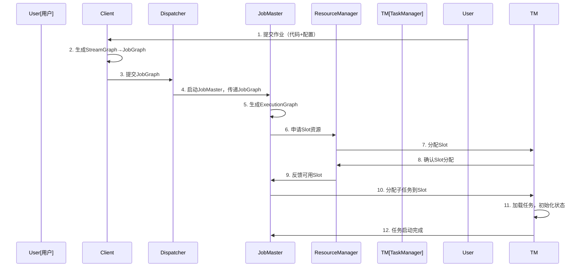
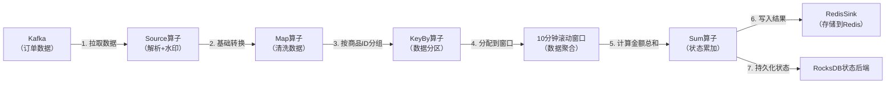

# 一、认知定位（Why & What）
## 1. 背景与起源：诞生的驱动力、解决的核心问题
### 1.1 诞生驱动力：大数据处理的“实时化”与“完整性”需求
- **需求端：业务实时化趋势**  
  随着互联网、金融、电商等领域的发展，业务对数据处理的“实时性”要求从“T+1批处理”转向“毫秒/秒级响应”，例如实时推荐、实时风控、实时监控等场景，传统批处理引擎（如Hadoop MapReduce）无法满足低延迟需求。
- **技术端：现有方案的核心缺陷**  
  早期流处理引擎（如Apache Storm）虽能实现低延迟，但缺乏**状态管理**（无法保存中间计算结果）和**精确一次（Exactly-Once）语义**（数据重复处理会导致结果不准）；而半流半批引擎（如Apache Spark Streaming）基于“微批处理”（Micro-Batch），延迟只能达到秒级，无法满足超实时场景（如金融高频交易）。

### 1.2 起源：从学术研究到工业级引擎
- **学术根源**：Flink的原型源于2008年柏林工业大学的“Stratosphere”研究项目，核心目标是解决“批处理与流处理的统一架构”问题，避免为两种场景开发两套独立系统。
- **工业化演进**：2014年，Stratosphere项目捐赠给Apache软件基金会并更名为“Flink”；2019年，Flink成为Apache顶级项目，逐步形成完善的生态（如对接Kafka、HDFS、HBase等），成为工业界实时数据处理的主流选择。

### 1.3 解决的核心问题
- 突破“批流割裂”：用统一架构支持“无界流（Unbounded Stream，实时数据）”和“有界流（Bounded Stream，批数据）”，避免技术栈冗余。
- 平衡“低延迟”与“高可靠性”：在毫秒级延迟下，通过**状态持久化**和**分布式快照（Checkpoint）** 实现 Exactly-Once 语义。
- 支持复杂计算场景：原生支持窗口计算、状态计算、关联聚合等复杂逻辑，无需依赖外部系统存储中间结果。


## 2. 核心本质：最简化的核心模型（抽象本质）
### 2.1 核心模型：“一切皆流”（Everything is a Stream）
Flink的本质是**分布式原生流处理引擎**，其核心抽象模型可简化为“流的统一”——将所有数据都视为“流”，批数据是“有界流”（数据有明确开始和结束），实时数据是“无界流”（数据持续产生无终点），具体表现为：
- 无界流（Unbounded Stream）：持续产生的实时数据（如Kafka消息），需通过“窗口（Window）”或“触发器（Trigger）”控制计算输出。
- 有界流（Bounded Stream）：固定量的批数据（如HDFS文件），可视为“数据读取完毕即结束的无界流”，计算逻辑可复用流处理架构。

### 2.2 关键抽象：支撑流处理的三大核心组件
- **数据抽象：DataStream / DataSet**  
  - DataStream：表示无界流数据，是Flink实时处理的核心API，支持流上的转换（Map、Filter、KeyBy等）和输出（Sink）。
  - DataSet：早期用于有界批数据的API，Flink 1.12后逐步被DataStream API的“有界流模式”替代，实现批流API统一。
- **状态抽象：State**  
  流处理的“记忆单元”，用于保存计算过程中的中间结果（如实时累加的订单金额），支持两种核心类型：
  - Keyed State：与“键（Key）”绑定的状态（如按用户ID分组后的用户行为记录），是最常用的状态类型。
  - Operator State：与算子实例绑定的状态（如Kafka消费者的offset记录），用于保存算子级别的全局信息。
- **时间抽象：Time**  
  解决“流数据乱序”问题的核心，Flink支持三种时间语义：
  - Event Time：数据本身携带的生成时间（如日志的产生时间），能确保结果的“时间正确性”（即使数据乱序到达）。
  - Processing Time：数据到达Flink算子的处理时间，延迟最低但受集群负载影响，结果可能不准确。
  - Ingestion Time：数据进入Flink的时间，介于Event Time和Processing Time之间，平衡准确性和延迟。


## 3. 定位与关系：在技术体系中的位置、与同类事物的对比
### 3.1 技术体系定位：大数据“处理层”的核心引擎
Flink处于大数据技术栈的“数据处理层”，上接业务应用（如实时推荐系统、风控平台），下接数据存储/传输层（如Kafka、HDFS、HBase），核心作用是“将原始数据转化为有价值的业务数据”，具体分层关系如下：
- 上层：业务应用（实时报表、实时推荐、风控规则引擎）
- 中层：Flink（数据处理引擎，负责转换、计算、聚合）
- 下层：数据存储/传输（Kafka（数据输入）、HDFS（批数据存储）、Redis（结果缓存）、ClickHouse（实时数仓））

### 3.2 同类方案对比：与主流数据处理引擎的差异
选取市占率最高的3类同类方案（Spark、Kafka Streams、Storm），从核心维度对比如下：

| 对比维度         | Apache Flink                | Apache Spark（Structured Streaming） | Kafka Streams          | Apache Storm           |
|------------------|-----------------------------|--------------------------------------|------------------------|------------------------|
| 处理模型         | 原生流处理（Native Stream） | 微批处理（Micro-Batch，默认100ms）   | 轻量级流处理（基于Kafka） | 原生流处理（无状态优先） |
| 延迟能力         | 毫秒级（10-100ms）          | 秒级（100ms-数秒）                   | 毫秒级                 | 亚毫秒级               |
| 状态管理         | 完善（Keyed/Operator State，持久化） | 完善（StateStore）                   | 基础（基于Kafka Offset） | 薄弱（需依赖外部存储如Redis） |
| 数据语义         | Exactly-Once（默认）        | Exactly-Once（需配置）               | Exactly-Once           | At-Least-Once（默认）  |
| 适用场景         | 复杂实时计算（窗口、关联）、批流统一 | 批处理为主、实时场景可妥协延迟       | Kafka生态内轻量计算    | 超实时但简单的计算（如日志过滤） |
| 生态依赖         | 中立（对接所有主流存储）    | 强依赖Spark生态（如Spark SQL）       | 强依赖Kafka（仅支持Kafka输入输出） | 需自定义生态集成       |

### 3.3 关系总结：替代与互补
- **替代关系**：  
  Flink可替代Spark Streaming（实时场景）、Storm（需状态/精确语义的场景），因其在延迟、可靠性、功能完整性上更优。
- **互补关系**：  
  - 与Spark：Flink侧重“实时复杂计算”，Spark侧重“批处理+SQL分析”，部分场景下会共用存储层（如HDFS），形成“实时用Flink，批处理用Spark”的互补架构。
  - 与Kafka Streams：Kafka Streams适合“Kafka生态内轻量计算”（如简单过滤、路由），Flink适合“跨存储的复杂计算”（如Kafka数据关联HBase数据），二者可在同一系统中分工协作。
  
# 二、原理支撑（How - Theory）
## 1. 体系结构：核心组件、组件关系、整体架构图
### 1.1 核心组件及功能
Flink的分布式体系结构基于“主从架构”设计，核心组件包括客户端（Client）、作业管理器（JobManager）、任务管理器（TaskManager）和集群管理器（Cluster Manager），各组件功能如下：

- **客户端（Client）**  
  - 作用：负责将用户编写的Flink作业（Job）转换为可执行的数据流图（Dataflow Graph），并提交给JobManager。  
  - 核心功能：代码编译、作业优化（如算子链合并）、生成作业计划（JobGraph）、与JobManager通信提交作业。  
  - 特点：提交完成后可退出（非必需长期运行），也可保持连接接收作业状态反馈。

- **作业管理器（JobManager）**  
  - 作用：整个Flink集群的“主控节点”，负责作业的调度与生命周期管理。  
  - 核心子组件：  
    - JobMaster：每个作业的“专属调度器”，负责将JobGraph转换为执行图（ExecutionGraph），分配任务给TaskManager，监控任务运行状态。  
    - ResourceManager：集群资源管理器，负责管理TaskManager的资源（如插槽Slot），为作业申请/释放资源。  
    - Dispatcher：接收客户端提交的作业，暂存并启动对应的JobMaster，提供Web UI入口。  
  - 高可用设计：通过ZooKeeper实现主备切换，避免单点故障。

- **任务管理器（TaskManager）**  
  - 作用：集群的“工作节点”，负责实际执行数据处理任务（Task）。  
  - 核心属性：  
    - 插槽（Slot）：TaskManager的资源单位，每个Slot对应一组固定的CPU和内存资源，用于运行一个或多个子任务（Subtask）。  
    - 任务槽隔离：Slot仅隔离内存，不隔离CPU，允许不同子任务共享计算资源，提高利用率。  
  - 核心功能：执行子任务、维护本地状态（State）、与其他TaskManager交换数据（通过网络 shuffle）、参与Checkpoint（快照）过程。

- **集群管理器（Cluster Manager）**  
  - 作用：集成外部资源管理系统，负责Flink集群的启停和资源分配。  
  - 支持类型：YARN（最常用）、Kubernetes、Mesos，以及Flink自带的Standalone模式。  
  - 工作方式：当Flink集群启动时，Cluster Manager根据配置启动JobManager和TaskManager；作业结束后，回收资源。


### 1.2 组件关系与整体架构
各组件通过网络通信协同工作，形成完整的Flink处理链路，整体架构如下：

```mermaid
graph TD
    subgraph 客户端层
        Client[客户端 Client]
    end
    
    subgraph 管理层
        JobManager[作业管理器 JobManager]
        subgraph JobManager内部
            JobMaster[JobMaster<br/>作业调度]
            ResourceManager[ResourceManager<br/>资源管理]
            Dispatcher[Dispatcher<br/>作业接收/UI]
        end
        ClusterManager[集群管理器<br/>(YARN/K8s等)]
    end
    
    subgraph 执行层
        TM1[任务管理器 TaskManager 1]
        TM2[任务管理器 TaskManager 2]
        TM3[任务管理器 TaskManager 3]
        subgraph 每个TaskManager包含多个Slot
            S1[Slot 1]
            S2[Slot 2]
            S3[Slot 3]
        end
    end
    
    subgraph 存储层
        Source[数据源<br/>(Kafka/HDFS等)]
        Sink[数据目的地<br/>(Redis/ClickHouse等)]
        StateBackend[状态后端<br/>(RocksDB/FileSystem)]
        CheckpointStorage[Checkpoint存储<br/>(HDFS/S3)]
    end
    
    % 组件通信关系
    Client -->|提交作业| Dispatcher
    Client -->|获取状态| JobMaster
    Dispatcher -->|启动作业| JobMaster
    JobMaster -->|申请资源| ResourceManager
    ResourceManager -->|分配Slot| ClusterManager
    ClusterManager -->|管理节点| JobManager
    ClusterManager -->|管理节点| TM1
    ClusterManager -->|管理节点| TM2
    ClusterManager -->|管理节点| TM3
    JobMaster -->|分配任务| TM1
    JobMaster -->|分配任务| TM2
    JobMaster -->|分配任务| TM3
    TM1 -->|数据交互| TM2
    TM1 -->|数据交互| TM3
    TM2 -->|数据交互| TM3
    Source -->|输入数据| TM1
    Source -->|输入数据| TM2
    TM1 -->|输出结果| Sink
    TM3 -->|输出结果| Sink
    TM1 -->|持久化状态| StateBackend
    TM2 -->|持久化状态| StateBackend
    JobMaster -->|触发Checkpoint| TM1
    TM1 -->|上传快照| CheckpointStorage
```

**核心交互逻辑**：  
1. 客户端将作业提交给Dispatcher，Dispatcher启动JobMaster。  
2. JobMaster向ResourceManager申请资源（Slot），ResourceManager通过ClusterManager分配TaskManager资源。  
3. JobMaster将任务分配到TaskManager的Slot中执行。  
4. TaskManager从数据源读取数据，执行计算，通过网络与其他TaskManager交换数据，并将结果写入目的地。  
5. 状态数据持久化到状态后端，Checkpoint快照存储到分布式存储中，确保容错性。


## 2. 核心机制：支撑运行的关键原理
### 2.1 调度机制：从作业到任务的执行流程
Flink的调度机制负责将用户作业转换为可执行的任务，并高效分配资源，核心流程分为“作业解析”和“任务调度”两阶段：

#### 2.1.1 作业解析：三级图转换
用户提交的作业会经历三次图转换，逐步从逻辑计划变为物理执行计划：
- **1. 逻辑图（StreamGraph）**  
  由用户代码直接生成，反映原始算子（Operator）和数据流关系（如DataStream.map()对应Map算子）。  
- **2. 作业图（JobGraph）**  
  StreamGraph经过优化（如算子链合并，将相邻的One-to-One算子合并为一个算子，减少网络传输）后生成，每个节点为一个“作业顶点（JobVertex）”，包含并行度等信息。  
- **3. 执行图（ExecutionGraph）**  
  JobGraph由JobMaster转换为物理执行图，将每个JobVertex按并行度拆分为多个“执行顶点（ExecutionVertex）”，每个对应一个子任务（Subtask），并记录任务间的数据依赖。  
- **4. 物理执行图（Physical Execution Graph）**  
  ExecutionGraph在TaskManager上的实际运行实例，包含具体的网络连接和资源分配信息。

```mermaid
graph TD
    UserCode[用户代码<br/>(DataStream API)] -->|生成| StreamGraph[StreamGraph<br/>逻辑算子关系]
    StreamGraph -->|优化（算子链合并）| JobGraph[JobGraph<br/>作业顶点+并行度]
    JobGraph -->|拆分并行子任务| ExecutionGraph[ExecutionGraph<br/>执行顶点+依赖关系]
    ExecutionGraph -->|分配到Slot| PhysicalGraph[物理执行图<br/>运行中的子任务]
```

#### 2.1.2 任务调度策略
JobMaster根据资源情况和任务特性调度子任务，核心策略包括：
- **本地性优先**：优先将子任务调度到数据所在的TaskManager（如读取Kafka的任务优先调度到Kafka分区所在节点），减少数据传输。  
- **Slot共享**：同一作业的不同子任务可共享一个Slot（只要总资源不超），提高资源利用率（如Map和Reduce算子的子任务可共享Slot）。  
- **延迟调度**：当所需资源暂时不可用时，延迟几秒重试（可配置），避免频繁分配到非优节点。


### 2.2 容错机制：Checkpoint与Savepoint
Flink通过“快照机制”实现容错，确保任务失败后能恢复到正确状态，核心包括Checkpoint和Savepoint两种机制：

#### 2.2.1 Checkpoint（自动快照）
- **定义**：由Flink自动触发的分布式快照，用于定期保存整个作业的状态，确保失败后可恢复到最近的一致状态。  
- **核心原理：Chandy-Lamport算法**  
  基于“ barrier（屏障）”的异步快照机制，流程如下：
  1. JobMaster定期（可配置，默认1000ms）向所有源算子（Source）发送Checkpoint屏障。  
  2. 源算子收到屏障后，触发本地状态快照，完成后将屏障转发给下游算子，并向JobMaster汇报快照完成。  
  3. 下游算子收到所有输入的屏障后，触发本地状态快照，完成后继续转发屏障，直至所有算子完成快照。  
  4. 所有算子快照完成后，JobMaster确认本次Checkpoint成功，将快照元数据写入持久化存储（如HDFS）。

```mermaid
sequenceDiagram
    participant JobMaster
    participant Source[Source算子<br/>(并行度2)]
    participant Map[Map算子<br/>(并行度2)]
    participant Sink[Sink算子<br/>(并行度1)]
    
    Note over JobMaster: 触发Checkpoint n
    JobMaster->>Source: 1. 发送Checkpoint屏障 n
    Source->>Source: 2. 保存本地状态到快照
    Source->>Map: 3. 转发屏障 n 给下游
    Map->>Map: 4. 收到所有输入屏障后，保存本地状态
    Map->>Sink: 5. 转发屏障 n 给下游
    Sink->>Sink: 6. 保存本地状态
    Sink->>JobMaster: 7. 汇报快照完成
    Map->>JobMaster: 8. 汇报快照完成
    Source->>JobMaster: 9. 汇报快照完成
    JobMaster->>JobMaster: 10. 确认Checkpoint n 成功
```

- **Exactly-Once语义实现**：通过Checkpoint屏障与数据的严格顺序（屏障前的数据参与本次快照，屏障后的数据参与下次），结合状态后端的原子写入，确保恢复后数据处理结果准确无重复。

#### 2.2.2 Savepoint（手动快照）
- **定义**：用户手动触发的快照，与Checkpoint机制相同，但保存时机由用户控制（如作业升级前），不会被Flink自动删除。  
- **核心差异**：  
  - Checkpoint：自动、临时、用于故障恢复，可能被新快照覆盖。  
  - Savepoint：手动、持久、用于版本升级/迁移，需显式删除。  


### 2.3 状态管理机制
状态（State）是流处理中保存中间结果的关键，Flink提供了完善的状态管理机制，确保高效读写和可靠持久化：

#### 2.3.1 状态分类（按范围）
- **Keyed State**：与Key绑定的状态（仅在KeyedStream上可用），每个Key对应独立状态实例（如按用户ID分组的浏览记录）。  
  常用类型：ValueState（单值）、ListState（列表）、MapState（键值对）、ReducingState（累加值）。  
- **Operator State**：与算子实例绑定的状态（如Kafka消费者的offset），算子并行度变化时需重新分配（支持均匀分配或广播）。

#### 2.3.2 状态后端（State Backend）
状态后端负责状态的存储、访问和Checkpoint持久化，Flink提供三种实现：
- **MemoryStateBackend**  
  - 状态存储在JVM堆内存，Checkpoint快照通过网络传输到JobManager内存。  
  - 优点：延迟极低；缺点：状态大小受堆内存限制，不适合生产环境。  
- **FsStateBackend**  
  - 状态存储在JVM堆内存，Checkpoint快照写入分布式文件系统（如HDFS）。  
  - 优点：平衡性能与可靠性，适合中小规模状态；缺点：堆内存仍可能成为瓶颈。  
- **RocksDBStateBackend（推荐生产使用）**  
  - 状态存储在本地RocksDB（嵌入式KV数据库，磁盘存储），Checkpoint快照写入分布式文件系统。  
  - 优点：支持大规模状态（超过内存），适合生产环境；缺点：读写延迟略高于内存（但通过缓存优化）。


### 2.4 时间与窗口机制
流数据的“时间属性”和“窗口计算”是处理无界流的核心，Flink提供了完整的时间语义和窗口实现：

#### 2.4.1 时间语义（见1.2.2）的实现逻辑
- **Event Time处理**：需配置“水印（Watermark）”生成策略，水印是一种特殊的时间戳信号，用于标记“某个时间前的数据已全部到达”，触发窗口计算。  
  例：`env.setStreamTimeCharacteristic(TimeCharacteristic.EventTime);`  
  `dataStream.assignTimestampsAndWatermarks(new BoundedOutOfOrdernessTimestampExtractor<>(Time.seconds(5)) { ... })`  
  （允许数据乱序5秒，超过则视为迟到数据）

#### 2.4.2 窗口类型与触发逻辑
窗口用于将无界流切分为“有界数据集”进行计算，核心类型包括：
- **滚动窗口（Tumbling Window）**：固定大小、无重叠（如每10分钟一个窗口）。  
- **滑动窗口（Sliding Window）**：固定大小、有重叠（如每5分钟滑动一次，窗口大小10分钟）。  
- **会话窗口（Session Window）**：基于数据间隙划分（如无数据30分钟则窗口结束）。  
- **全局窗口（Global Window）**：所有数据进入同一窗口，需自定义触发器（如计数触发）。

**窗口触发逻辑**：  
1. 数据按窗口规则分配到对应的窗口实例（如属于[10:00,10:10)窗口的数据）。  
2. 当水印时间超过窗口结束时间（或满足自定义触发条件），触发窗口计算。  
3. 计算完成后输出结果，窗口资源可被清理（或保留用于迟到数据更新）。


## 3. 抽象建模：如何将现实问题转化为技术模型
### 3.1 问题到模型的转化逻辑
Flink将现实中的流式数据处理问题抽象为“数据流图+算子操作”的技术模型，转化步骤如下：

1. **问题拆解**：将业务目标拆解为“数据输入→转换处理→结果输出”三阶段。  
   例：“实时统计每10分钟各商品的下单金额”可拆解为：  
   - 输入：Kafka中的订单数据（包含商品ID、金额、时间戳）。  
   - 处理：按商品ID分组→按10分钟窗口累加金额。  
   - 输出：结果写入Redis。

2. **映射为Flink抽象**：  
   - 输入/输出 → Source/Sink算子（对接外部系统）。  
   - 分组操作 → KeyBy算子（转化为KeyedStream，支持状态计算）。  
   - 窗口累加 → Window + Sum算子（定义窗口规则和计算逻辑）。  

3. **补充运行属性**：设置时间语义（如Event Time）、水印策略（处理乱序）、并行度（资源分配）、Checkpoint（容错）等。


### 3.2 核心抽象概念与业务对应
| 业务场景需求                | Flink抽象概念          | 作用说明                                  |
|-----------------------------|------------------------|-------------------------------------------|
| 持续产生的订单数据          | DataStream（无界流）   | 表示持续输入的无界数据集，支持流上的转换操作 |
| 按用户ID统计行为            | KeyBy + Keyed State    | KeyBy实现分组，Keyed State保存每个用户的中间结果 |
| 每小时汇总一次销售额        | Tumbling Window        | 将连续数据切分为1小时的固定窗口进行计算    |
| 处理延迟到达的日志数据      | Event Time + Watermark | 基于日志生成时间计算，允许5分钟的延迟窗口  |
| 确保计算结果不重复          | Checkpoint             | 定期保存状态快照，失败后恢复到一致状态    |
| 升级作业时保留历史计算结果  | Savepoint              | 手动触发快照，用于作业版本迁移时的状态恢复 |


## 4. 流转逻辑：数据/信息/指令的传递路径与触发条件
### 4.1 作业提交与启动流程
用户作业从提交到实际运行的完整路径如下：

1. **客户端准备阶段**  
   - 1.1 用户通过Client提交作业（含代码、配置）。  
   - 1.2 Client编译代码，生成StreamGraph，优化后转换为JobGraph。  
   - 1.3 Client将JobGraph提交给Dispatcher。

2. **集群调度阶段**  
   - 2.1 Dispatcher启动JobMaster，将JobGraph传递给JobMaster。  
   - 2.2 JobMaster将JobGraph转换为ExecutionGraph（拆分并行子任务）。  
   - 2.3 JobMaster向ResourceManager申请Slot资源。  
   - 2.4 ResourceManager通过ClusterManager分配TaskManager的Slot。

3. **任务执行阶段**  
   - 3.1 JobMaster将子任务分配到指定TaskManager的Slot中。  
   - 3.2 TaskManager加载子任务，初始化状态（如从Checkpoint恢复）。  
   - 3.3 子任务启动，开始从Source读取数据并执行计算。




### 4.2 数据处理流转路径
数据从输入到输出的处理流程，以“Kafka→Flink→Redis”为例：

1. **数据输入阶段**  
   - 1.1 Source算子（如FlinkKafkaConsumer）从Kafka分区拉取数据。  
   - 1.2 为每条数据分配时间戳（Event Time），并生成水印（Watermark）。  

2. **数据转换阶段**  
   - 2.1 数据经转换算子（如Map、Filter）处理（如解析JSON、过滤无效数据）。  
   - 2.2 KeyBy算子按Key（如商品ID）对数据分区，发送到对应的并行子任务。  
   - 2.3 窗口算子（如TumblingWindow）将数据分配到窗口，等待触发条件（如水印超过窗口结束时间）。  
   - 2.4 计算算子（如Sum）基于窗口内数据和状态（如累计金额）计算结果。  

3. **数据输出阶段**  
   - 3.1 结果经Sink算子（如RedisSink）写入目标系统（如Redis的Hash结构）。  
   - 3.2 同时，状态后端异步持久化中间状态（如累计金额），参与Checkpoint流程。




### 4.3 异常恢复流转路径
当TaskManager故障时，Flink通过Checkpoint进行恢复的流程：

1. ResourceManager检测到TaskManager故障，释放其Slot资源。  
2. JobMaster收到故障通知，标记该节点上的子任务为“失败”。  
3. JobMaster向ResourceManager申请新的Slot资源。  
4. 新的TaskManager分配到Slot后，JobMaster重新部署失败的子任务。  
5. 子任务启动时，从最近一次成功的Checkpoint加载状态数据。  
6. 恢复完成后，子任务继续处理数据（从Checkpoint对应的偏移量开始）。

# 三、实践应用（How - Practice）
## 1. 基础操作：最小可用技能集（安装、配置、核心API）
### 1.1 环境安装与部署
#### 1.1.1 单机版（Standalone）快速部署
- **前置条件**：JDK 8+（推荐11）、SSH免密登录（集群模式需要）
- **安装步骤**：
  1. 从[Flink官网](https://flink.apache.org/)下载稳定版（如1.17.0），解压至`/opt/flink`
  2. 启动集群：`./bin/start-cluster.sh`
  3. 验证：访问`http://localhost:8081`，查看Web UI是否正常
  4. 提交测试作业：`./bin/flink run examples/streaming/WordCount.jar`
  5. 停止集群：`./bin/stop-cluster.sh`

#### 1.1.2 集群版（YARN模式）部署
- **前置条件**：Hadoop YARN集群（2.8+）、Flink与Hadoop版本兼容
- **关键配置**：
  - 修改`conf/flink-conf.yaml`：`yarn.application-attempts: 2`（高可用尝试次数）
  - 配置HADOOP_CLASSPATH：`export HADOOP_CLASSPATH=$(hadoop classpath)`
- **启动方式**：
  - 会话模式（共享集群资源）：`./bin/yarn-session.sh -n 2 -s 2 -jm 1024 -tm 2048`
    - `-n`：TaskManager数量；`-s`：每个TM的Slot数；`-jm`：JobManager内存；`-tm`：每个TM内存
  - 单作业模式（推荐生产）：`./bin/flink run -t yarn-per-job -c org.apache.flink.examples.streaming.WordCount examples/streaming/WordCount.jar`

### 1.2 核心配置文件解析
#### 1.2.1 flink-conf.yaml（核心配置）
```yaml
# 基本配置
jobmanager.rpc.address: localhost  # JobManager地址
jobmanager.memory.process.size: 1024m  # JM总内存
taskmanager.memory.process.size: 2048m  # TM总内存
taskmanager.numberOfTaskSlots: 2  # 每个TM的Slot数
parallelism.default: 1  # 默认并行度

# Checkpoint配置
execution.checkpointing.interval: 10000ms  # 检查点间隔
execution.checkpointing.mode: EXACTLY_ONCE  # 语义类型
execution.checkpointing.timeout: 60000ms  # 超时时间
state.backend: rocksdb  # 状态后端
state.checkpoint-storage: filesystem  # 检查点存储类型
state.checkpoints.dir: hdfs:///flink/checkpoints  # 检查点存储路径

# 网络配置
taskmanager.network.memory.buffer-size: 32kb  # 网络缓冲区大小
```

#### 1.2.2 配置优先级
- 优先级从高到低：代码中设置（`env.setParallelism(2)`）> 提交命令参数（`-p 2`）> 配置文件（`parallelism.default`）

### 1.3 核心API使用
#### 1.3.1 DataStream API基础
```java
import org.apache.flink.streaming.api.environment.StreamExecutionEnvironment;
import org.apache.flink.streaming.api.datastream.DataStream;

public class BasicStreamExample {
    public static void main(String[] args) throws Exception {
        // 1. 创建执行环境
        final StreamExecutionEnvironment env = StreamExecutionEnvironment.getExecutionEnvironment();
        
        // 2. 设置基本属性（并行度、Checkpoint等）
        env.setParallelism(2);
        env.enableCheckpointing(5000);  // 5秒一次Checkpoint
        
        // 3. 读取数据源（从Socket读取文本）
        DataStream<String> textStream = env.socketTextStream("localhost", 9999);
        
        // 4. 转换操作（词频统计）
        DataStream<WordCount> counts = textStream
            .flatMap((String line, Collector<WordCount> out) -> {
                for (String word : line.split(" ")) {
                    out.collect(new WordCount(word, 1));
                }
            })
            .keyBy(WordCount::getWord)  // 按word分组
            .sum("count");  // 累加count字段
        
        // 5. 输出结果（打印到控制台）
        counts.print();
        
        // 6. 执行作业
        env.execute("Basic WordCount Example");
    }
    
    // 定义数据结构
    public static class WordCount {
        private String word;
        private int count;
        
        // 必须有默认构造函数（Flink序列化需要）
        public WordCount() {}
        
        public WordCount(String word, int count) {
            this.word = word;
            this.count = count;
        }
        
        // getter和setter
        public String getWord() { return word; }
        public void setWord(String word) { this.word = word; }
        public int getCount() { return count; }
        public void setCount(int count) { this.count = count; }
        
        @Override
        public String toString() {
            return word + ": " + count;
        }
    }
}
```

#### 1.3.2 Table API/SQL基础
```java
import org.apache.flink.table.api.EnvironmentSettings;
import org.apache.flink.table.api.Table;
import org.apache.flink.table.api.bridge.java.StreamTableEnvironment;

public class TableApiExample {
    public static void main(String[] args) {
        // 1. 创建表执行环境
        EnvironmentSettings settings = EnvironmentSettings
            .newInstance()
            .inStreamingMode()
            .build();
        StreamTableEnvironment tEnv = StreamTableEnvironment.create(
            StreamExecutionEnvironment.getExecutionEnvironment(), settings);
        
        // 2. 注册数据源（从Kafka读取JSON数据）
        tEnv.executeSql("""
            CREATE TABLE user_behavior (
                user_id BIGINT,
                item_id BIGINT,
                category_id BIGINT,
                behavior STRING,
                ts TIMESTAMP(3)
            ) WITH (
                'connector' = 'kafka',
                'topic' = 'user_behavior',
                'properties.bootstrap.servers' = 'localhost:9092',
                'properties.group.id' = 'flink_table_demo',
                'scan.startup.mode' = 'earliest-offset',
                'format' = 'json'
            )
        """);
        
        // 3. 执行SQL查询（统计每小时行为次数）
        Table resultTable = tEnv.sqlQuery("""
            SELECT 
                TUMBLE_START(ts, INTERVAL '1' HOUR) AS window_start,
                behavior,
                COUNT(*) AS cnt
            FROM user_behavior
            GROUP BY 
                TUMBLE(ts, INTERVAL '1' HOUR),
                behavior
        """);
        
        // 4. 输出结果（打印到控制台）
        tEnv.toDataStream(resultTable).print();
        
        // 5. 执行作业
        tEnv.execute("Table API WordCount");
    }
}
```


## 2. 典型案例：代表性场景的完整实现（含步骤与解析）
### 2.1 实时词频统计（基础场景）
#### 2.1.1 业务需求
从Kafka读取实时文本流，统计每个单词的出现次数（累计值），结果写入Redis。

#### 2.1.2 实现步骤
1. **环境准备**：
   - 启动Kafka：创建topic `wordcount-input`（`kafka-topics.sh --create --topic wordcount-input --bootstrap-server localhost:9092 --partitions 2`）
   - 启动Redis：监听默认端口6379

2. **代码实现**：
```java
import org.apache.flink.api.common.functions.FlatMapFunction;
import org.apache.flink.api.common.serialization.SimpleStringSchema;
import org.apache.flink.api.java.tuple.Tuple2;
import org.apache.flink.streaming.api.datastream.DataStream;
import org.apache.flink.streaming.api.environment.StreamExecutionEnvironment;
import org.apache.flink.streaming.connectors.kafka.FlinkKafkaConsumer;
import org.apache.flink.streaming.connectors.redis.RedisSink;
import org.apache.flink.streaming.connectors.redis.common.config.FlinkJedisPoolConfig;
import org.apache.flink.streaming.connectors.redis.common.mapper.RedisCommand;
import org.apache.flink.streaming.connectors.redis.common.mapper.RedisCommandDescription;
import org.apache.flink.streaming.connectors.redis.common.mapper.RedisMapper;
import org.apache.flink.util.Collector;

import java.util.Properties;

public class Kafka2RedisWordCount {
    public static void main(String[] args) throws Exception {
        // 1. 创建执行环境
        final StreamExecutionEnvironment env = StreamExecutionEnvironment.getExecutionEnvironment();
        env.setParallelism(2);
        env.enableCheckpointing(5000);  // 启用Checkpoint
        
        // 2. 配置Kafka消费者
        Properties kafkaProps = new Properties();
        kafkaProps.setProperty("bootstrap.servers", "localhost:9092");
        kafkaProps.setProperty("group.id", "wordcount-group");
        
        // 3. 读取Kafka数据
        DataStream<String> kafkaStream = env.addSource(
            new FlinkKafkaConsumer<>("wordcount-input", new SimpleStringSchema(), kafkaProps)
        );
        
        // 4. 词频统计逻辑
        DataStream<Tuple2<String, Integer>> wordCounts = kafkaStream
            .flatMap(new FlatMapFunction<String, Tuple2<String, Integer>>() {
                @Override
                public void flatMap(String value, Collector<Tuple2<String, Integer>> out) {
                    // 分割单词并输出(word, 1)
                    for (String word : value.toLowerCase().split("\\W+")) {
                        if (word.length() > 0) {
                            out.collect(new Tuple2<>(word, 1));
                        }
                    }
                }
            })
            .keyBy(tuple -> tuple.f0)  // 按单词分组
            .sum(1);  // 累加计数
        
        // 5. 配置Redis连接
        FlinkJedisPoolConfig redisConfig = new FlinkJedisPoolConfig.Builder()
            .setHost("localhost")
            .setPort(6379)
            .build();
        
        // 6. 写入Redis（使用HSET，key为"wordcount"，field为单词，value为计数）
        wordCounts.addSink(new RedisSink<>(redisConfig, new RedisWordCountMapper()));
        
        // 7. 执行作业
        env.execute("Kafka to Redis WordCount");
    }
    
    // 定义Redis写入映射器
    public static class RedisWordCountMapper implements RedisMapper<Tuple2<String, Integer>> {
        @Override
        public RedisCommandDescription getCommandDescription() {
            return new RedisCommandDescription(RedisCommand.HSET, "wordcount");
        }
        
        @Override
        public String getKeyFromData(Tuple2<String, Integer> data) {
            return data.f0;  // 单词作为field
        }
        
        @Override
        public String getValueFromData(Tuple2<String, Integer> data) {
            return data.f1.toString();  // 计数作为value
        }
    }
}
```

3. **依赖配置（pom.xml）**：
```xml
<dependencies>
    <!-- Flink Core -->
    <dependency>
        <groupId>org.apache.flink</groupId>
        <artifactId>flink-streaming-java</artifactId>
        <version>1.17.0</version>
    </dependency>
    
    <!-- Kafka Connector -->
    <dependency>
        <groupId>org.apache.flink</groupId>
        <artifactId>flink-connector-kafka</artifactId>
        <version>1.17.0</version>
    </dependency>
    
    <!-- Redis Connector -->
    <dependency>
        <groupId>org.apache.flink</groupId>
        <artifactId>flink-connector-redis</artifactId>
        <version>3.0.0</version>
    </dependency>
</dependencies>
```

4. **测试验证**：
   - 向Kafka发送数据：`kafka-console-producer.sh --topic wordcount-input --bootstrap-server localhost:9092`，输入"Hello Flink Hello World"
   - 查看Redis结果：`redis-cli hgetall wordcount`，应返回"hello" → 2，"flink" → 1，"world" → 1

#### 2.1.3 数据流程图
```mermaid
graph LR
    Kafka[Kafka Topic<br/>wordcount-input] -->|文本流| Source[Flink Source<br/>KafkaConsumer]
    Source -->|String| FlatMap[FlatMap算子<br/>分割单词]
    FlatMap -->|(word, 1)| KeyBy[KeyBy算子<br/>按word分组]
    KeyBy -->|(word, 1)| Sum[Sum算子<br/>累计计数]
    Sum -->|(word, count)| Sink[Flink Sink<br/>RedisSink]
    Sink --> Redis[Redis<br/>Hash: wordcount]
```


### 2.2 实时订单窗口聚合（时间窗口场景）
#### 2.2.1 业务需求
从Kafka读取订单数据（含订单ID、用户ID、金额、时间戳），按用户ID统计每10分钟的订单总金额（滑动窗口，5分钟滑动一次），结果写入ClickHouse。

#### 2.2.2 实现步骤
1. **数据准备**：
   - 订单数据格式：`{"orderId":"O123","userId":"U456","amount":99.9,"eventTime":1620000000000}`
   - ClickHouse表创建：
     ```sql
     CREATE TABLE user_order_stats (
         user_id String,
         window_start DateTime,
         window_end DateTime,
         total_amount Float64,
         PRIMARY KEY (user_id, window_start)
     ) ENGINE = MergeTree()
     ```

2. **核心代码**：
```java
import org.apache.flink.api.common.eventtime.SerializableTimestampAssigner;
import org.apache.flink.api.common.eventtime.WatermarkStrategy;
import org.apache.flink.api.common.functions.AggregateFunction;
import org.apache.flink.api.java.tuple.Tuple4;
import org.apache.flink.streaming.api.datastream.DataStream;
import org.apache.flink.streaming.api.environment.StreamExecutionEnvironment;
import org.apache.flink.streaming.api.windowing.assigners.SlidingEventTimeWindows;
import org.apache.flink.streaming.api.windowing.time.Time;
import org.apache.flink.streaming.connectors.clickhouse.ClickHouseSink;
import org.apache.flink.streaming.connectors.clickhouse.config.ClickHouseClusterSettings;
import org.apache.flink.streaming.connectors.clickhouse.config.ClickHouseExecutionOptions;
import org.apache.flink.streaming.connectors.clickhouse.internal.ClickHouseShardBalancer;
import org.apache.flink.streaming.connectors.kafka.FlinkKafkaConsumer;
import org.apache.flink.shaded.jackson2.com.fasterxml.jackson.databind.JsonNode;
import org.apache.flink.shaded.jackson2.com.fasterxml.jackson.databind.ObjectMapper;

import java.time.Duration;
import java.util.Properties;
import java.util.UUID;

public class OrderWindowAggregation {
    private static final ObjectMapper mapper = new ObjectMapper();
    
    public static void main(String[] args) throws Exception {
        StreamExecutionEnvironment env = StreamExecutionEnvironment.getExecutionEnvironment();
        env.setParallelism(2);
        env.enableCheckpointing(10000);
        
        // 1. 读取Kafka订单数据
        Properties kafkaProps = new Properties();
        kafkaProps.setProperty("bootstrap.servers", "localhost:9092");
        kafkaProps.setProperty("group.id", "order-stats-group");
        
        DataStream<JsonNode> orderStream = env.addSource(
            new FlinkKafkaConsumer<>("order-input", new JsonNodeDeserializationSchema(), kafkaProps)
        )
        // 2. 分配EventTime和Watermark（允许3秒乱序）
        .assignTimestampsAndWatermarks(
            WatermarkStrategy.<JsonNode>forBoundedOutOfOrderness(Duration.ofSeconds(3))
                .withTimestampAssigner((SerializableTimestampAssigner<JsonNode>) (element, recordTimestamp) -> 
                    element.get("eventTime").asLong()
                )
        );
        
        // 3. 转换为(user_id, amount)
        DataStream<Tuple4<String, Long, Long, Double>> resultStream = orderStream
            .map(jsonNode -> new Tuple4<>(
                jsonNode.get("userId").asText(),
                jsonNode.get("eventTime").asLong(),
                0L,  // 占位，后续窗口开始时间
                jsonNode.get("amount").asDouble()
            ))
            // 4. 按用户ID分组
            .keyBy(tuple -> tuple.f0)
            // 5. 应用滑动窗口（10分钟窗口，5分钟滑动）
            .window(SlidingEventTimeWindows.of(Time.minutes(10), Time.minutes(5)))
            // 6. 聚合计算总金额
            .aggregate(new OrderAggregateFunction());
        
        // 7. 写入ClickHouse
        ClickHouseClusterSettings clusterSettings = ClickHouseClusterSettings.builder()
            .setHosts("localhost:8123")  // ClickHouse地址
            .setUsername("default")
            .setPassword("")
            .build();
        
        ClickHouseExecutionOptions executionOptions = ClickHouseExecutionOptions.builder()
            .setBatchSize(1000)
            .setFlushIntervalMills(5000)
            .build();
        
        ClickHouseSink.<Tuple4<String, Long, Long, Double>>sink(
            "INSERT INTO user_order_stats (user_id, window_start, window_end, total_amount) VALUES (?, toDateTime(?), toDateTime(?), ?)",
            (statement, tuple) -> {
                statement.setString(1, tuple.f0);
                statement.setLong(2, tuple.f1 / 1000);  // 转换为秒级时间戳
                statement.setLong(3, tuple.f2 / 1000);
                statement.setDouble(4, tuple.f3);
            },
            clusterSettings,
            executionOptions,
            ClickHouseShardBalancer.ROUND_ROBIN,
            resultStream
        );
        
        env.execute("Order Window Aggregation");
    }
    
    // 自定义聚合函数：计算窗口内总金额，并记录窗口起止时间
    public static class OrderAggregateFunction implements AggregateFunction<
        Tuple4<String, Long, Long, Double>,  // 输入类型
        Tuple4<String, Long, Long, Double>,  // 累加器类型 (userId, windowStart, windowEnd, totalAmount)
        Tuple4<String, Long, Long, Double>> { // 输出类型
        
        @Override
        public Tuple4<String, Long, Long, Double> createAccumulator() {
            return new Tuple4<>("", 0L, 0L, 0.0);
        }
        
        @Override
        public Tuple4<String, Long, Long, Double> add(
            Tuple4<String, Long, Long, Double> value, 
            Tuple4<String, Long, Long, Double> accumulator) {
            
            // 第一次累加时初始化用户ID
            String userId = accumulator.f0.isEmpty() ? value.f0 : accumulator.f0;
            return new Tuple4<>(userId, 0L, 0L, accumulator.f3 + value.f3);
        }
        
        @Override
        public Tuple4<String, Long, Long, Double> getResult(Tuple4<String, Long, Long, Double> accumulator) {
            return accumulator;
        }
        
        @Override
        public Tuple4<String, Long, Long, Double> merge(
            Tuple4<String, Long, Long, Double> a, 
            Tuple4<String, Long, Long, Double> b) {
            return new Tuple4<>(a.f0, a.f1, a.f2, a.f3 + b.f3);
        }
    }
}
```

#### 2.2.3 窗口计算流程图
```mermaid
timeline
    title 10分钟滑动窗口（5分钟滑动）示例
    section 时间线
        00:00 : 窗口1开始 [00:00-00:10)
        00:05 : 窗口1结束计算，窗口2开始 [00:05-00:15)
        00:10 : 窗口2计算一次，窗口3开始 [00:10-00:20)
        00:15 : 窗口2结束计算，窗口3计算一次
```


## 3. 问题诊断：常见错误、异常排查与解决方案
### 3.1 资源相关错误
#### 3.1.1 TaskManager内存不足（OutOfMemoryError）
- **症状**：TaskManager日志出现`java.lang.OutOfMemoryError: Java heap space`
- **原因**：
  - 配置的`taskmanager.memory.process.size`过小
  - 状态数据过大（如使用MemoryStateBackend存储大状态）
  - 数据倾斜导致部分Task处理过多数据
- **解决方案**：
  - 增大TM内存：`taskmanager.memory.process.size: 4096m`
  - 切换状态后端为RocksDB：`state.backend: rocksdb`
  - 排查数据倾斜：使用Flink Web UI的"Metrics"查看各Subtask的处理数据量，对热点Key进行拆分

#### 3.1.2 Slot资源不足（NoResourceAvailableException）
- **症状**：JobMaster日志出现`No resource available to allocate task`
- **原因**：
  - 作业并行度设置过高，超过集群总Slot数（`总Slot数 = TM数量 × 每个TM的Slot数`）
  - 其他作业占用过多资源
- **解决方案**：
  - 降低作业并行度：代码中`env.setParallelism(2)`或提交时`-p 2`
  - 增加TaskManager数量或每个TM的Slot数
  - 使用YARN单作业模式，为作业单独申请资源


### 3.2 Checkpoint相关错误
#### 3.2.1 Checkpoint超时（CheckpointTimeoutException）
- **症状**：JobManager日志出现`Checkpoint ... expired before completing`
- **原因**：
  - Checkpoint间隔过短（`execution.checkpointing.interval`）
  - 状态过大，快照保存时间超过超时时间（`execution.checkpointing.timeout`）
  - 网络IO慢（如Checkpoint存储在远程HDFS且网络拥塞）
- **解决方案**：
  - 延长超时时间：`execution.checkpointing.timeout: 120000ms`
  - 增大Checkpoint间隔：`execution.checkpointing.interval: 30000ms`
  - 优化状态后端：RocksDB启用增量Checkpoint（`state.backend.rocksdb.checkpoint.transfer.thread.num: 4`）


### 3.3 数据处理错误
#### 3.3.1 数据乱序导致窗口计算错误
- **症状**：窗口结果缺失部分数据，或延迟数据未被正确计算
- **原因**：
  - Watermark设置不合理（允许的乱序时间小于实际数据延迟）
  - 未处理迟到数据（默认迟到数据被丢弃）
- **解决方案**：
  - 调整Watermark容忍时间：`WatermarkStrategy.forBoundedOutOfOrderness(Duration.ofSeconds(10))`
  - 处理迟到数据：
    ```java
    .window(SlidingEventTimeWindows.of(Time.minutes(10), Time.minutes(5)))
    .allowedLateness(Time.minutes(2))  // 允许2分钟迟到数据
    .sideOutputLateData(lateDataTag)  // 将超期迟到数据输出到侧输出流
    ```


## 4. 场景扩展：从单一场景到复杂系统的应用进阶
### 4.1 实时数据仓库构建
#### 4.1.1 架构设计
```mermaid
graph TD
    Source[数据源<br/>Kafka/MySQL/日志] -->|实时同步| Flink[Flink处理层<br/>- 清洗转换<br/>- 维度关联<br/>- 指标计算]
    Flink --> DWD[明细层(DWD)<br/>ClickHouse]
    Flink --> DWS[汇总层(DWS)<br/>Redis/MySQL]
    DWD -->|离线分析| Spark[Spark批处理]
    DWS -->|应用查询| App[业务应用<br/>实时报表/监控]
    Flink -->|维表关联| DimDB[维度数据库<br/>HBase/MySQL]
```

#### 4.1.2 核心技术点
- **CDC同步**：使用Flink CDC Connector同步MySQL_binlog到Kafka，保证数据实时性
- **维表关联**：
  - 热维表（如商品信息）：使用HBase Lookup Join，缓存常访问数据
  - 冷维表（如地区信息）：使用Broadcast Join，将小表广播到所有TaskManager
- **分层存储**：明细数据存ClickHouse（支持高吞吐写入），汇总指标存Redis（支持高并发查询）

### 4.2 实时风控系统集成
#### 4.2.1 典型流程
1. 接入用户行为流（点击、登录、交易）和系统日志流
2. 实时计算用户行为特征（如5分钟内登录失败次数、异常IP访问频率）
3. 与规则引擎联动（如Flink CEP检测连续失败模式）
4. 触发预警或拦截（如冻结账户、要求验证码）

#### 4.2.2 Flink CEP规则示例
```java
// 检测10分钟内连续3次登录失败
Pattern<LoginEvent, ?> pattern = Pattern
    .<LoginEvent>begin("firstFail").where(event -> event.isSuccess() == false)
    .next("secondFail").where(event -> event.isSuccess() == false)
    .next("thirdFail").where(event -> event.isSuccess() == false)
    .within(Time.minutes(10));

// 应用模式检测
PatternStream<LoginEvent> patternStream = CEP.pattern(
    loginStream.keyBy(LoginEvent::getUserId),  // 按用户ID分组
    pattern
);

// 处理匹配结果
DataStream<RiskAlert> alertStream = patternStream
    .select((Map<String, LoginEvent> pattern) -> {
        LoginEvent first = pattern.get("firstFail");
        LoginEvent third = pattern.get("thirdFail");
        return new RiskAlert(first.getUserId(), "连续登录失败", first.getEventTime(), third.getEventTime());
    });
```

### 4.3 高可用与监控体系
#### 4.3.1 高可用配置（基于ZooKeeper）
```yaml
# flink-conf.yaml
high-availability: zookeeper
high-availability.zookeeper.quorum: zk1:2181,zk2:2181,zk3:2181
high-availability.zookeeper.path.root: /flink
high-availability.cluster-id: /flink-cluster  # 集群唯一标识
high-availability.storageDir: hdfs:///flink/ha  # 存储JobManager元数据
```

#### 4.3.2 监控指标体系
- **核心指标**：
  - 吞吐量（Throughput）：`flink_taskmanager_job_task_operator_numRecordsOutPerSecond`
  - 延迟（Latency）：`flink_taskmanager_job_task_operator_latency_avg`
  - Checkpoint成功率：`flink_jobmanager_job_checkpoint_succeeded`
- **监控工具**：
  - 内置Web UI：`http://jobmanager:8081`（实时查看作业状态）
  - Prometheus + Grafana：配置`metrics.reporter.prom.class: org.apache.flink.metrics.prometheus.PrometheusReporter`，自定义监控面板
  - 告警：通过AlertManager配置指标阈值告警（如Checkpoint失败5分钟告警）


# 四、深度进阶（Mastery）
## 1. 性能优化：瓶颈分析、调优策略、最佳参数配置
### 1.1 瓶颈分析：定位性能问题的核心方法
#### 1.1.1 基于Flink Web UI的瓶颈识别
- **关键指标查看路径**：
  1. 作业总览页：关注“Throughput”（吞吐量，单位：records/sec）和“Latency”（延迟，单位：ms），若吞吐量低、延迟高，说明存在性能瓶颈；
  2. 算子详情页：点击具体算子（如KeyBy、Window），查看“Subtasks”列表中各子任务的“Records In/Out”“BackPressured Time”（背压时间），若某子任务背压时间占比超30%，该子任务为瓶颈点；
  3. Checkpoint页：查看“Checkpoint Duration”（快照时长）和“Checkpoint Failed Ratio”（失败率），若时长超配置的超时时间或失败率高，说明Checkpoint流程存在瓶颈。

#### 1.1.2 常见瓶颈类型及特征
| 瓶颈类型       | 核心特征                                  | 识别依据                                  |
|----------------|-------------------------------------------|-------------------------------------------|
| 计算瓶颈       | 算子CPU使用率超90%，无背压                | TM节点CPU监控（如Prometheus的`process_cpu_usage`） |
| 网络瓶颈       | 存在背压，算子CPU使用率低，网络IO高        | 节点网络带宽监控（如`node_network_transmit_bytes_total`） |
| 存储瓶颈       | Checkpoint时长过长，状态读写耗时久        | Checkpoint详情页“State Size”“Duration”指标 |
| 数据倾斜瓶颈   | 某子任务Records In远超其他子任务（差异10倍+） | 算子Subtasks页“Records In”列数据对比       |

### 1.1.3 工具辅助分析
- **Prometheus + Grafana**：配置Flink metrics导出（如`metrics.reporter.prom.class: org.apache.flink.metrics.prometheus.PrometheusReporter`），自定义面板监控“算子吞吐量”“背压指标”“状态读写耗时”；
- **Flink CLI**：通过`./bin/flink list -r`查看运行作业，`./bin/flink stats <job-id>`查看作业实时统计数据，辅助定位瓶颈。

### 1.2 调优策略：针对不同瓶颈的解决方案
#### 1.2.1 计算瓶颈调优
- **算子链优化**：
  - 原理：将相邻的One-to-One算子（如Map→Filter，数据无重分区）合并为一个“算子链”，减少线程间切换和数据序列化开销；
  - 配置：默认开启，可通过`env.disableOperatorChaining()`全局禁用，或通过`operator.disableChaining()`单独禁用某算子链；
  - 场景：适用于计算密集型算子（如复杂Map转换、聚合），合并后可提升CPU利用率。
- **并行度调整**：
  - 原则：并行度需匹配集群CPU核心数（推荐并行度=总CPU核心数的1~2倍，避免超量导致上下文切换）；
  - 方法：代码中`env.setParallelism(4)`、提交命令`-p 4`、配置文件`parallelism.default: 4`；
  - 注意：KeyBy算子并行度决定数据分区数，需避免并行度过低导致单任务计算压力过大。

#### 1.2.2 网络瓶颈调优
- **网络缓冲区配置**：
  - 核心参数：`taskmanager.network.memory.buffer-size`（默认32kb），`taskmanager.network.memory.fraction`（网络内存占TM总内存比例，默认0.1）；
  - 调优：若存在频繁背压且网络IO高，可将`buffer-size`调整为64kb~128kb，`fraction`调整为0.2（需确保TM总内存充足）；
  - 原理：增大网络缓冲区减少数据传输阻塞，提升数据吞吐。
- **数据压缩**：
  - 配置：`taskmanager.network.compression.enable: true`（默认false），压缩算法选择`LZ4`（性价比高）；
  - 场景：适用于数据量较大且网络带宽有限的场景，压缩后可减少网络传输数据量。

#### 1.2.3 存储瓶颈调优
- **状态后端优化**：
  - 生产推荐：RocksDBStateBackend（支持增量Checkpoint），配置`state.backend: rocksdb`，`state.backend.rocksdb.checkpoint.transfer.thread.num: 4`（增加快照传输线程）；
  - 优化点：开启RocksDB本地缓存（`state.backend.rocksdb.block.cache.size: 128mb`），减少磁盘IO；
- **Checkpoint策略调整**：
  - 增量Checkpoint：`state.backend.rocksdb.incremental.checkpoint: true`（仅RocksDB支持），仅传输增量变更的状态数据，减少快照时长；
  - 并发Checkpoint：`execution.checkpointing.max-concurrent-checkpoints: 1`（默认1，可调整为2，允许一个快照未完成时启动下一个，需确保存储IO承载）。

#### 1.2.4 数据倾斜调优
- **预聚合优化**：
  - 原理：在KeyBy前增加“局部聚合”（如Map→LocalSum→KeyBy→GlobalSum），减少KeyBy后的数据量；
  - 代码示例：
    ```java
    dataStream
        .map(new MapFunction<Tuple2<String, Integer>, Tuple2<String, Integer>>() {
            @Override
            public Tuple2<String, Integer> map(Tuple2<String, Integer> value) {
                // 局部聚合（假设按单词首字母分组，减少后续KeyBy压力）
                String newKey = value.f0.substring(0, 1) + "_" + UUID.randomUUID();
                return new Tuple2<>(newKey, value.f1);
            }
        })
        .keyBy(tuple -> tuple.f0)
        .sum(1)
        .map(tuple -> new Tuple2<>(tuple.f0.split("_")[0], tuple.f1)) // 还原原Key
        .keyBy(tuple -> tuple.f0)
        .sum(1);
    ```
- **热点Key拆分**：
  - 方法：对热点Key（如“null”值、高频访问的用户ID）添加随机后缀（如“key_0”“key_1”），拆分后分散到多个子任务，计算完成后合并；
  - 场景：适用于热点Key数据量占比超20%的场景，可显著降低单任务压力。

### 1.3 最佳参数配置：生产环境核心参数推荐
| 参数类别       | 参数名                                  | 推荐值                | 说明                                      |
|----------------|-----------------------------------------|-----------------------|-------------------------------------------|
| 内存配置       | jobmanager.memory.process.size          | 2048m~4096m           | JM总内存，根据作业数量调整（作业多则增大） |
|                | taskmanager.memory.process.size         | 4096m~8192m           | TM总内存，计算密集型可增大                |
|                | taskmanager.numberOfTaskSlots           | 2~4                   | 每个TM的Slot数，建议等于CPU核心数的1/2    |
| 网络配置       | taskmanager.network.memory.buffer-size  | 64kb                  | 网络缓冲区，背压场景下增大                |
|                | taskmanager.network.compression.enable  | true                  | 开启网络压缩，减少传输量                  |
| Checkpoint配置 | execution.checkpointing.interval        | 30000ms~60000ms       | 快照间隔，根据状态大小调整（状态大则间隔长） |
|                | execution.checkpointing.timeout         | 120000ms              | 快照超时时间，避免频繁失败                |
|                | state.backend                           | rocksdb               | 生产默认状态后端，支持大状态              |
|                | state.backend.rocksdb.incremental.checkpoint | true            | 开启增量快照，减少存储IO                  |
| 计算优化       | parallelism.default                     | 总CPU核心数×1.5       | 默认并行度，匹配集群计算能力              |
|                | pipeline.operator-chaining.enabled      | true                  | 开启算子链，减少线程切换                  |

## 2. 稳健性设计：容错机制、高可用方案、灾备策略
### 2.1 容错机制：保障数据一致性与任务连续性
#### 2.1.1 Checkpoint 进阶配置：提升容错可靠性
- **Exactly-Once 语义强化**  
  除基础 Checkpoint 配置外，需通过以下参数确保端到端一致性：
  1. 源端（如 Kafka）：启用 `enable.auto.commit: false`，由 Flink 管理 Offset，避免消费与 Checkpoint 不同步；
  2. Sink 端：使用支持事务的 Sink（如 KafkaSink 配置 `delivery.guarantee: EXACTLY_ONCE`），或自定义两阶段提交（2PC）Sink；
  3. 核心参数：`execution.checkpointing.mode: EXACTLY_ONCE`（默认），`execution.checkpointing.externalized-checkpoint-retention: RETAIN_ON_CANCELLATION`（取消作业时保留 Checkpoint，避免状态丢失）。

- **Checkpoint 并发与优先级控制**  
  1. 并发 Checkpoint：配置 `execution.checkpointing.max-concurrent-checkpoints: 2`，允许一个 Checkpoint 未完成时启动下一个，提升快照覆盖率（需确保存储 IO 承载）；
  2. 优先级调度：`execution.checkpointing.prefer-checkpoint-for-recovery: true`，恢复时优先使用最新成功的 Checkpoint，而非 Savepoint（减少手动干预）。

#### 2.1.2 迟到数据的容错处理
- **分层处理策略（文字步骤）**  
  1. 基础容忍：通过 Watermark 配置 `forBoundedOutOfOrderness(Duration.ofSeconds(5))`，允许 5 秒内的乱序数据正常进入窗口；
  2. 延长窗口生命周期：对窗口算子配置 `allowedLateness(Time.minutes(2))`，窗口关闭后仍接收 2 分钟内的迟到数据并更新结果；
  3. 极端迟到数据兜底：通过侧输出流（Side Output）捕获超期数据，单独处理（如写入异常表），避免数据丢失。
- **代码示例**：
  ```java
  // 定义侧输出流标签
  OutputTag<OrderEvent> lateDataTag = new OutputTag<OrderEvent>("late-order-data"){};
  
  // 窗口处理时捕获迟到数据
  SingleOutputStreamOperator<OrderStats> resultStream = orderStream
      .keyBy(OrderEvent::getUserId)
      .window(TumblingEventTimeWindows.of(Time.minutes(10)))
      .allowedLateness(Time.minutes(2)) // 允许2分钟迟到
      .sideOutputLateData(lateDataTag) // 超期数据写入侧输出流
      .sum("amount");
  
  // 处理侧输出流（如写入HDFS异常目录）
  DataStream<OrderEvent> lateStream = resultStream.getSideOutput(lateDataTag);
  lateStream.addSink(new HdfsSink<>("hdfs:///flink/late-data/"));
  ```

#### 2.1.3 状态损坏的容错修复
- **状态校验与恢复策略**  
  1. 定期校验：通过 `state.backend.rocksdb.enable.stats: true` 开启 RocksDB 状态统计，监控 `rocksdb.state.size` 等指标，若出现异常增长（如数据重复写入），触发状态校验；
  2. 损坏恢复：若状态损坏（如 Checkpoint 元数据丢失），可通过 **Savepoint 回滚**：
     - 提交命令：`./bin/flink run -s hdfs:///flink/savepoints/savepoint-xxx -c com.example.JobClass job.jar`；
     - 注意：回滚前需确认 Savepoint 对应的作业版本与当前代码兼容（避免状态 schema 变更）。


### 2.2 高可用方案：避免单点故障与集群中断
#### 2.2.1 JobManager 高可用（HA）架构
- **核心原理**：基于 ZooKeeper 实现主备 JM 切换，确保作业调度不中断，架构流程如下：
  1. 主 JM 启动时，在 ZooKeeper 上创建临时节点（如 `/flink/ha/cluster1/leader/jobmanager`），写入自身地址；
  2. 备 JM 启动后，监听该临时节点，处于“待命”状态；
  3. 若主 JM 故障（如进程崩溃、网络断开），ZooKeeper 自动删除临时节点；
  4. 备 JM 检测到节点删除后，竞争创建新的临时节点，成功创建者成为新主 JM；
  5. 新主 JM 从 HA 存储（如 HDFS `/flink/ha/`）加载作业元数据（ExecutionGraph、Checkpoint 信息），重启未完成的任务。

- **Mermaid 时序图**：
  ```mermaid
  sequenceDiagram
      participant ZK[ZooKeeper]
      participant JM1[主 JobManager]
      participant JM2[备 JobManager]
      participant TM[TaskManager]
      
      JM1->>ZK: 1. 创建临时节点/写入主JM地址
      JM2->>ZK: 2. 监听临时节点状态
      JM1->>TM: 3. 正常调度任务/管理Checkpoint
      Note over JM1: 主JM故障（进程崩溃）
      ZK->>ZK: 4. 检测到主JM心跳丢失，删除临时节点
      JM2->>ZK: 5. 发现节点删除，竞争创建新临时节点
      JM2->>ZK: 6. 创建成功，成为新主JM
      JM2->>HDFS: 7. 从HA存储加载作业元数据
      JM2->>TM: 8. 重新调度任务，恢复作业运行
  ```

- **核心配置**：
  ```yaml
  high-availability: zookeeper
  high-availability.zookeeper.quorum: zk-node1:2181,zk-node2:2181,zk-node3:2181 # ZK集群地址
  high-availability.zookeeper.path.root: /flink/ha # 根节点
  high-availability.cluster-id: cluster1 # 集群唯一标识（避免多集群冲突）
  high-availability.storageDir: hdfs:///flink/ha/storage # 元数据存储路径
  ```

#### 2.2.2 TaskManager 故障恢复
- **恢复流程（文字步骤）**  
  1. TM 定期向 JM 发送心跳（默认间隔 10 秒，配置 `taskmanager.heartbeat.interval: 10000`）；
  2. 若 JM 超过 `taskmanager.heartbeat.timeout: 50000`（50 秒）未收到 TM 心跳，标记该 TM 为“故障”；
  3. JM 清理该 TM 上的所有子任务，并释放对应的 Slot 资源；
  4. JM 重新调度故障子任务到其他可用 TM 的 Slot 上；
  5. 新 TM 加载子任务时，从最近一次成功的 Checkpoint 恢复状态，继续处理数据。

- **优化配置**：`jobmanager.execution.failover-strategy: region`（默认），按“任务区域”（Region）恢复故障任务，而非全作业重启，减少恢复开销（如仅重启故障 TM 上的子任务所在 Region）。

#### 2.2.3 资源管理器高可用
- **YARN 模式下的 HA 配置**  
  1. 启用 YARN ResourceManager HA（需提前配置 YARN 自身的 ZK 选主）；
  2. Flink 侧配置：`yarn.application-attempts: 3`，允许作业在 YARN 上重试 3 次（若第一次申请资源失败，自动重试）；
  3. 效果：若 YARN RM 主节点故障，备 RM 切换后，Flink 作业可继续申请资源，避免集群资源管理中断。


### 2.3 灾备策略：应对极端故障（如集群宕机、存储损坏）
#### 2.3.1 状态灾备：Checkpoint 与 Savepoint 多副本
- **存储层多副本**  
  1. 基础方案：将 Checkpoint/Savepoint 存储在支持多副本的分布式存储（如 HDFS，默认 3 副本），配置 `state.checkpoints.dir: hdfs:///flink/checkpoints`；
  2. 跨存储备份：定期（如每日）通过脚本将 HDFS 上的 Checkpoint/Savepoint 同步到对象存储（如 S3、OSS），命令示例：
     ```bash
     # HDFS 同步到 S3（使用 s3a 协议）
     hdfs dfs -cp hdfs:///flink/checkpoints/* s3a://flink-backup/checkpoints/
     ```

#### 2.3.2 作业配置灾备
- **版本化管理**  
  1. 作业代码与配置：通过 Git 仓库管理，记录每次代码变更（如算子逻辑、并行度调整），确保可回滚到历史版本；
  2. 核心配置文件：将 `flink-conf.yaml`、作业提交脚本（如 `submit.sh`）同步到 Git，标注对应的 Flink 版本（如 `conf-v1.17/`），避免版本不兼容。

#### 2.3.3 跨集群灾备：主从集群热备
- **灾备架构与流程**  
  1. 架构设计：部署“主集群”（生产运行）与“从集群”（灾备待命），两集群网络互通；
  2. 数据同步：
     - 源数据：主集群的 Kafka 数据通过 MirrorMaker 同步到从集群 Kafka；
     - 状态数据：主集群的 Checkpoint/Savepoint 实时同步到从集群 HDFS（如使用 HDFS DistCp 增量同步）；
  3. 故障切换：
     1. 主集群故障时，停止主集群残留作业；
     2. 在从集群上，使用同步的 Savepoint 启动作业：`./bin/flink run -s hdfs://slave-cluster/flink/savepoints/xxx job.jar`；
     3. 切换数据源：作业从从集群 Kafka 读取数据，确保业务不中断。

- **Mermaid 架构图**：
  ```mermaid
  graph TD
      subgraph 主集群（生产）
          Kafka1[Kafka集群<br/>(业务数据)]
          Flink1[Flink集群<br/>(运行作业)]
          HDFS1[HDFS<br/>(Checkpoint/Savepoint)]
          Kafka1 --> Flink1
          Flink1 --> HDFS1
      end
      
      subgraph 从集群（灾备）
          Kafka2[Kafka集群<br/>(同步数据)]
          Flink2[Flink集群<br/>(待命)]
          HDFS2[HDFS<br/>(同步状态)]
          Kafka2 --> Flink2
          Flink2 --> HDFS2
      end
      
      Kafka1 -->|MirrorMaker| Kafka2
      HDFS1 -->|DistCp| HDFS2
      Note over Flink1,Flink2: 主集群故障时，Flink2用HDFS2的状态启动作业
  ```

## 3. 本源探究：核心源码解析、设计思想溯源
### 3.1 核心源码解析：关键流程的代码逻辑拆解
#### 3.1.1 作业提交与图转换流程（基于Flink 1.17版本）
- **核心目标**：理解用户代码如何从`StreamGraph`转换为`ExecutionGraph`，最终提交到`TaskManager`执行，这是Flink作业运行的基础链路。
- **源码入口**：`org.apache.flink.streaming.api.environment.StreamExecutionEnvironment#execute`（用户代码调用的`env.execute()`入口）
- **关键步骤与对应源码**：

  1. **步骤1：生成StreamGraph（逻辑算子图）**  
     - 触发逻辑：`execute()`方法内部调用`getStreamGraph()`，遍历用户定义的`DataStream`算子链（如`map`→`keyBy`→`window`），生成包含算子关系和基础配置的`StreamGraph`。
     - 核心类与方法：
       ```java
       // StreamExecutionEnvironment.java
       public JobExecutionResult execute(String jobName) throws Exception {
           StreamGraph streamGraph = getStreamGraph(); // 生成StreamGraph
           streamGraph.setJobName(jobName);
           return execute(streamGraph); // 进入下一步提交
       }
       
       // StreamGraph.java：添加算子到StreamGraph
       public <T> void addOperator(
               Integer vertexID,
               String operatorName,
               StreamOperator<T> operator,
               TypeInformation<T> outTypeInfo,
               String slotSharingGroup,
               String coLocationGroup) {
           StreamNode node = new StreamNode(vertexID, operatorName, operator, outTypeInfo);
           node.setSlotSharingGroup(slotSharingGroup);
           node.setCoLocationGroup(coLocationGroup);
           streamNodes.put(vertexID, node); // 存储算子节点
       }
       ```

  2. **步骤2：StreamGraph转换为JobGraph（优化后的作业图）**  
     - 核心优化：算子链合并（将相邻的`One-to-One`算子合并为一个`JobVertex`，减少线程切换）、设置并行度和资源配置。
     - 核心类：`org.apache.flink.streaming.api.graph.StreamGraph#translateToJobGraph`
     - 关键逻辑：
       ```java
       // StreamGraph.java
       public JobGraph translateToJobGraph(JobGraphGenerator generator) {
           generator.configure(this);
           return generator.generate(); // 由JobGraphGenerator完成转换
       }
       
       // JobGraphGenerator.java：算子链合并逻辑
       private void createJobVertices() {
           for (StreamNode streamNode : streamGraph.getStreamNodes().values()) {
               if (!isChainable(streamNode)) { // 判断是否可链化（如One-to-One传输、同并行度）
                   createNewJobVertex(streamNode); // 不可链则创建新JobVertex
               } else {
                   addToExistingChain(streamNode); // 可链则合并到已有JobVertex
               }
           }
       }
       ```

  3. **步骤3：JobGraph提交到Dispatcher与JobMaster初始化**  
     - 流程：`Dispatcher`接收`JobGraph`后，启动`JobMaster`，`JobMaster`将`JobGraph`转换为`ExecutionGraph`（拆分并行子任务）。
     - 核心类：`org.apache.flink.runtime.dispatcher.Dispatcher#submitJob`、`org.apache.flink.runtime.jobmaster.JobMaster#startJobExecution`
     - 关键逻辑（JobMaster生成ExecutionGraph）：
       ```java
       // JobMaster.java
       private void startJobExecution() {
           executionGraph = createAndRestoreExecutionGraph(); // 创建ExecutionGraph
           executionGraph.start(); // 启动ExecutionGraph，开始调度任务
           scheduleExecutionGraph(); // 向ResourceManager申请资源，分配任务
       }
       
       // ExecutionGraph.java：拆分并行子任务
       public void initialize() {
           for (JobVertex jobVertex : jobGraph.getVertices()) {
               ExecutionJobVertex ejv = new ExecutionJobVertex(this, jobVertex, nextVertexID.getAndIncrement());
               ejv.initializeParallelism(jobVertex.getParallelism()); // 按并行度拆分ExecutionVertex
               executionJobVertices.put(ejv.getJobVertexId(), ejv);
           }
       }
       ```

  4. **步骤4：任务分配与执行（TaskManager接收并启动任务）**  
     - 流程：`JobMaster`向`ResourceManager`申请`Slot`，分配`ExecutionVertex`到`TaskManager`，`TaskManager`创建`Task`并启动。
     - 核心类：`org.apache.flink.runtime.taskexecutor.TaskExecutor#submitTask`
     - 关键逻辑：
       ```java
       // TaskExecutor.java
       public CompletableFuture<Acknowledge> submitTask(TaskDeploymentDescriptor tdd, JobMasterId jobMasterId) {
           Task task = new Task(tdd, jobMasterId, this, taskResources); // 创建Task实例
           task.startTaskThread(); // 启动任务线程，执行算子逻辑
           return CompletableFuture.completedFuture(Acknowledge.get());
       }
       ```

- **Mermaid源码调用时序图**：
  ```mermaid
  sequenceDiagram
      participant UserCode[用户代码]
      participant StreamEnv[StreamExecutionEnvironment]
      participant StreamGraph[StreamGraph]
      participant JobGraphGen[JobGraphGenerator]
      participant Dispatcher[Dispatcher]
      participant JobMaster[JobMaster]
      participant TaskExecutor[TaskExecutor]
      
      UserCode->>StreamEnv: 1. 调用env.execute()
      StreamEnv->>StreamGraph: 2. 生成StreamGraph（getStreamGraph()）
      StreamGraph->>JobGraphGen: 3. 转换为JobGraph（translateToJobGraph()）
      JobGraphGen->>Dispatcher: 4. 提交JobGraph（submitJob()）
      Dispatcher->>JobMaster: 5. 启动JobMaster，传递JobGraph
      JobMaster->>JobMaster: 6. 生成ExecutionGraph（createAndRestoreExecutionGraph()）
      JobMaster->>TaskExecutor: 7. 分配任务（submitTask()）
      TaskExecutor->>TaskExecutor: 8. 启动Task线程（startTaskThread()）
  ```


#### 3.1.2 Checkpoint核心流程（容错机制的核心实现）
- **核心目标**：理解`Checkpoint`如何从发起、屏障（Barrier）传播到状态快照生成，这是Flink实现`Exactly-Once`语义的关键。
- **源码入口**：`org.apache.flink.runtime.checkpoint.CheckpointCoordinator#triggerCheckpoint`（`JobMaster`中发起`Checkpoint`的入口）
- **关键步骤与对应源码**：

  1. **步骤1：Checkpoint发起（JobMaster触发）**  
     - 触发逻辑：`CheckpointCoordinator`按配置的间隔（`execution.checkpointing.interval`）调用`triggerCheckpoint()`，生成`CheckpointID`和`CheckpointMetaData`。
     - 核心类与方法：
       ```java
       // CheckpointCoordinator.java
       public CompletableFuture<CheckpointTriggerResult> triggerCheckpoint(
               CheckpointType checkpointType,
               @Nullable String externalSavepointLocation) {
           long checkpointId = nextCheckpointId.getAndIncrement(); // 生成唯一CheckpointID
           CheckpointMetaData metadata = new CheckpointMetaData(
                   checkpointId,
                   System.currentTimeMillis(),
                   checkpointType);
           return triggerCheckpoint(metadata, externalSavepointLocation); // 进入实际触发逻辑
       }
       ```

  2. **步骤2：屏障（Barrier）传播（从Source到下游算子）**  
     - 核心原理：`Source`算子接收`Checkpoint`触发指令后，生成`Barrier`，随数据一起发送到下游，`Barrier`分隔不同`Checkpoint`周期的数据。
     - 核心类：`org.apache.flink.streaming.runtime.io.CheckpointBarrierTracker`（跟踪算子接收的`Barrier`）、`org.apache.flink.streaming.api.operators.AbstractStreamOperator#processCheckpointBarrier`
     - 关键逻辑（算子处理Barrier）：
       ```java
       // AbstractStreamOperator.java：算子接收Barrier后的处理
       public void processCheckpointBarrier(CheckpointBarrier barrier) throws Exception {
           CheckpointBarrierTracker tracker = getCheckpointBarrierTracker();
           CheckpointBarrierTracker.CheckpointBarrierStatus status = tracker.reportBarrier(barrier);
           
           if (status == CheckpointBarrierTracker.CheckpointBarrierStatus.ALL_BARRIERS_RECEIVED) {
               // 收到所有输入的Barrier，触发状态快照
               triggerCheckpointOnBarrier(barrier, tracker.getLatestCheckpointId());
           }
       }
       ```

  3. **步骤3：状态快照生成（算子持久化状态）**  
     - 流程：算子收到所有输入的`Barrier`后，调用`snapshotState()`生成状态快照，将快照写入`StateBackend`（如RocksDB），并向`JobMaster`汇报完成。
     - 核心类：`org.apache.flink.streaming.api.operators.StreamOperator#snapshotState`、`org.apache.flink.contrib.streaming.state.RocksDBStateBackend#snapshot`
     - 关键逻辑（RocksDB状态快照）：
       ```java
       // RocksDBStateBackend.java
       public CompletableFuture<SnapshotResult<KeyedStateHandle>> snapshot(
               long checkpointId,
               long timestamp,
               KeyedStateHandle previousHandle,
               StreamStateHandle.StateHandleID stateHandleID,
               ExecutorService executorService) {
           // 生成RocksDB快照（基于RocksDB的Snapshot API）
           RocksDBSnapshot snapshot = new RocksDBSnapshot(db, columnFamilyHandles, checkpointId);
           // 异步写入快照到存储（如HDFS）
           return CompletableFuture.supplyAsync(() -> {
               try {
                   return snapshot.writeToStorage(stateHandleID, basePath);
               } catch (Exception e) {
                   throw new CompletionException(e);
               }
           }, executorService);
       }
       ```

  4. **步骤4：Checkpoint完成确认（JobMaster汇总结果）**  
     - 流程：所有算子完成快照后，`CheckpointCoordinator`收到所有`Acknowledgement`，标记`Checkpoint`为“成功”，并记录快照路径。
     - 核心类：`org.apache.flink.runtime.checkpoint.CheckpointCoordinator#receiveAcknowledgeMessage`
     - 关键逻辑：
       ```java
       // CheckpointCoordinator.java
       public void receiveAcknowledgeMessage(CheckpointAcknowledge acknowledge) {
           long checkpointId = acknowledge.getCheckpointId();
           Checkpoint checkpoint = checkpointsInProgress.get(checkpointId);
           if (checkpoint == null) {
               return; // Checkpoint已过期或失败，忽略
           }
           
           // 记录算子的快照结果
           checkpoint.addAcknowledge(acknowledge.getSubtaskId(), acknowledge.getStateHandles());
           
           // 检查是否所有算子都已确认
           if (checkpoint.isFullyAcknowledged()) {
               completeCheckpoint(checkpoint); // 标记Checkpoint成功
               checkpointsInProgress.remove(checkpointId);
           }
       }
       ```


### 3.2 设计思想溯源：Flink核心设计的底层逻辑
#### 3.2.1 批流统一思想的演进（从Stratosphere到Flink）
- **历史背景**：早期大数据处理存在“批流割裂”问题——批处理引擎（如Hadoop MapReduce）处理有界数据但延迟高，流处理引擎（如Storm）处理无界数据但无状态、语义弱，用户需维护两套技术栈。
- **Stratosphere的探索（2008-2014）**：  
  Flink的前身Stratosphere项目首次提出“批流统一”的核心思想，认为“批数据是流数据的特殊形式（有界流）”，可通过同一架构支持两种场景。其设计突破点：
  1. 提出`DataStream`抽象，统一表示有界/无界数据；
  2. 基于“连续算子模型”（Continuous Operator Model），而非Storm的“离散事件模型”，支持状态持久化。
- **Flink的继承与优化（2014至今）**：  
  2014年Stratosphere捐赠给Apache并更名为Flink后，进一步强化批流统一：
  1. 1.12版本弃用`DataSet API`，将批处理场景统一到`DataStream API`（通过`env.setRuntimeMode(RuntimeMode.BATCH)`启用批模式）；
  2. 优化`StateBackend`，使批流场景复用同一状态存储（如RocksDB）；
  3. 统一时间语义（`Event Time`/`Processing Time`），批流场景均支持窗口计算。


#### 3.2.2 状态与时间语义的设计哲学
- **状态设计：解决“流处理的记忆问题”**  
  早期流处理引擎（如Storm）无内置状态管理，需依赖外部存储（如Redis），导致延迟高、一致性难保证。Flink的状态设计核心思想：
  1. **算子内置状态**：将状态与算子绑定，存储在`TaskManager`本地（如RocksDB），减少网络IO；
  2. **分层状态抽象**：通过`Keyed State`（按Key隔离）和`Operator State`（按算子实例隔离），覆盖不同业务场景（如用户级状态、算子级状态）；
  3. **状态持久化与恢复**：结合`Checkpoint`，将状态快照写入分布式存储，确保故障后可精确恢复。

- **时间语义：解决“流数据的乱序与延迟问题”**  
  流数据天然存在乱序（如日志传输延迟），早期引擎（如Spark Streaming）基于`Processing Time`计算，结果准确性受集群负载影响。Flink的时间语义设计核心思想：
  1. **以Event Time为核心**：基于数据本身的生成时间计算，确保结果“时间正确性”（即使数据乱序）；
  2. **水印（Watermark）机制**：通过水印标记“数据到达进度”，平衡准确性与延迟（如允许5秒乱序，水印=最大Event Time-5秒）；
  3. **灵活的时间策略**：支持`Processing Time`（低延迟场景）、`Ingestion Time`（折中方案），满足不同业务对准确性和延迟的需求。


#### 3.2.3 分布式容错的设计思路（基于Chandy-Lamport算法）
- **问题背景**：分布式系统中，节点故障（如`TaskManager`宕机）会导致数据丢失或重复处理，需设计高效的容错机制。
- **核心思想：异步快照+屏障隔离**  
  Flink的容错机制基于Chandy-Lamport分布式快照算法优化，关键设计点：
  1. **非阻塞快照**：`Checkpoint`过程中，算子继续处理数据，仅在生成快照瞬间短暂停顿，不影响吞吐量；
  2. **屏障（Barrier）隔离**：通过`Barrier`将数据分为“快照前”和“快照后”两部分，确保快照包含的状态与数据严格对应；
  3. ** Exactly-Once 保证**：结合“状态快照+数据源重放”（如Kafka Offset重设），确保故障恢复后，数据既不重复处理也不丢失。

## 4. 版本与特性：主流版本差异、关键特性演进（含弃用与新增）
### 4.1 主流版本时间线与核心定位
Flink 自成为 Apache 顶级项目后，版本迭代以“稳定优先、按需新增”为原则，核心版本集中在 1.11~1.17（生产环境最常用），各版本定位清晰：
- **1.11（2020.07）**：CDC 功能初步集成，状态管理优化，为批流统一铺垫；
- **1.12（2021.02）**：**批流统一里程碑**，弃用 DataSet API，统一到 DataStream API；
- **1.13（2021.07）**：性能大幅提升（RocksDB 优化、Checkpoint 改进），CDC 连接器增强；
- **1.14（2022.03）**：Web UI 重构，SQL 功能强化，新增 Table Store 连接器；
- **1.15（2022.09）**：容错机制优化，状态后端兼容性提升，减少 deprecated API；
- **1.16（2023.03）**：实时计算性能优化，CDC 3.0 集成，支持更多数据源；
- **1.17（2023.09）**：**长期支持（LTS）版本**，稳定性与兼容性优先，修复大量生产级 Bug。


### 4.2 关键版本核心特性对比（1.12~1.17）
#### 4.2.1 各版本新增特性（生产高频关注）
| 版本  | 核心新增特性                                                                 | 对生产的价值                                                                 |
|-------|------------------------------------------------------------------------------|------------------------------------------------------------------------------|
| 1.12  | 1. 批流统一：DataSet API 标记为 deprecated，DataStream 支持 BATCH 运行模式<br>2. 状态后端优化：RocksDB 支持增量 Checkpoint 自动开启<br>3. 新增 Hudi/Delta Lake 连接器 | 1. 减少技术栈冗余，批流任务共用一套 API<br>2. 降低大状态场景下 Checkpoint 开销 |
| 1.13  | 1. RocksDB 状态后端性能提升：启用异步快照压缩<br>2. Checkpoint 优化：支持并发 Checkpoint 优先级<br>3. CDC 连接器：支持 MySQL 8.0、PostgreSQL 全量+增量同步 | 1. 大状态作业吞吐量提升 20%~30%<br>2. 实时数据同步场景（如数据中台）更稳定   |
| 1.14  | 1. Web UI 重构：新增“作业拓扑图缩放”“指标对比”功能<br>2. SQL 增强：支持动态表关联 Hive 外部表<br>3. 新增 Table Store 连接器：支持实时写入+离线查询 | 1. 运维排查效率提升，无需依赖第三方工具<br>2. 实时数仓场景下 SQL 开发更便捷   |
| 1.15  | 1. 容错机制：Checkpoint 元数据存储优化，支持跨版本恢复<br>2. 状态后端：RocksDB 支持 ZSTD 压缩，减少磁盘占用<br>3. 移除部分 deprecated API（如旧版 Window 接口） | 1. 状态恢复成功率提升，降低版本升级风险<br>2. 大状态场景磁盘开销减少 15%~25%  |
| 1.16  | 1. CDC 3.0 集成：支持分库分表同步、DDL 同步<br>2. 实时计算：新增低延迟窗口（Low-Latency Window）<br>3. 资源调度：支持 Kubernetes 动态资源调整 | 1. 复杂业务场景（如电商订单分表）CDC 同步更灵活<br>2. 超实时场景（如风控）延迟降至 10ms 内 |
| 1.17  | 1. LTS 版本：提供 18 个月官方支持<br>2. 稳定性修复：解决 100+ 生产级 Bug（如 Checkpoint 超时重试）<br>3. 兼容性：支持 JDK 17，适配 Hadoop 3.3+ | 1. 金融、电商等核心业务可长期依赖<br>2. 避免因版本迭代频繁导致的升级成本     |

#### 4.2.2 关键特性弃用与变更（升级需注意）
- **1.12 弃用**：
  1. `DataSet API`（`org.apache.flink.api.java.DataSet`），推荐用 `DataStream API` 并设置 `env.setRuntimeMode(RuntimeMode.BATCH)`；
  2. 旧版状态后端 `MemoryStateBackend`（推荐用 `EmbeddedRocksDBStateBackend`）。

- **1.14 变更**：
  1. Web UI 端口默认从 8081 改为 8081（无端口冲突时不变），但配置项 `rest.port` 优先级提升；
  2. `FlinkKafkaConsumer` 标记为 deprecated，推荐用 `KafkaSource`（新连接器 `flink-connector-kafka-1.17`）。

- **1.17 移除**：
  1. 完全移除 `DataSet API` 相关类，无法再通过依赖引用；
  2. 旧版 CDC 连接器 `flink-connector-mysql-cdc` 整合到 `flink-connector-debezium`，需更新依赖坐标。


### 4.3 版本升级核心注意事项（生产环境避坑）
#### 4.3.1 API 兼容性处理
- **1. DataSet 迁移到 DataStream 批模式**：
  原 DataSet 代码：
  ```java
  // 1.11 及之前的 DataSet 代码
  ExecutionEnvironment env = ExecutionEnvironment.getExecutionEnvironment();
  DataSet<String> data = env.readTextFile("hdfs:///data.txt");
  ```
  迁移后 1.12+ 代码：
  ```java
  // 1.12+ 批模式 DataStream 代码
  StreamExecutionEnvironment env = StreamExecutionEnvironment.getExecutionEnvironment();
  env.setRuntimeMode(RuntimeMode.BATCH); // 开启批模式
  DataStream<String> data = env.readTextFile("hdfs:///data.txt");
  ```

- **2. Kafka 连接器升级**：
  旧版 `FlinkKafkaConsumer` 替换为新版 `KafkaSource`：
  ```java
  // 1.14+ 新版 KafkaSource
  KafkaSource<String> kafkaSource = KafkaSource.<String>builder()
          .setBootstrapServers("localhost:9092")
          .setTopics("order-topic")
          .setGroupId("order-group")
          .setValueOnlyDeserializer(new SimpleStringSchema())
          .build();
  DataStream<String> data = env.fromSource(kafkaSource, WatermarkStrategy.noWatermarks(), "KafkaSource");
  ```

#### 4.3.2 配置参数变更
| 旧版本参数（1.11及之前）          | 新版本替换参数（1.12+）               | 说明                                  |
|-----------------------------------|---------------------------------------|---------------------------------------|
| `state.backend.memory`            | `state.backend: embeddedRocksdb`       | 旧版内存状态后端废弃，推荐用 RocksDB   |
| `flink.streaming.time characteristic` | `env.setStreamTimeCharacteristic()` 移除，直接通过 WatermarkStrategy 设置 | 时间语义配置统一到 WatermarkStrategy   |
| `jobmanager.heap.size`            | `jobmanager.memory.process.size`       | 内存配置从“堆内存”扩展为“进程总内存”  |

#### 4.3.3 状态兼容性与恢复
- **跨版本状态恢复**：1.12+ 版本支持从 1.11 及以上版本的 Checkpoint/Savepoint 恢复，但需注意：
  1. 若使用了 `DataSet API` 的状态，需先迁移到 `DataStream` 批模式再恢复；
  2. 恢复前需验证状态后端类型（如从 `MemoryStateBackend` 迁移到 `RocksDB` 需重新生成状态）。
- **生产建议**：升级前先在测试环境用生产数据的 Savepoint 进行恢复测试，确认无状态损坏后再全量升级。


### 4.4 生产环境版本选择建议
- **核心业务（金融、电商支付）**：优先选择 **1.17 LTS** 版本，官方支持周期长（18个月），Bug 修复及时，稳定性有保障；
- **实时数据同步（CDC 场景）**：选择 **1.16+**，CDC 3.0 功能更完善，支持分库分表、DDL 同步，减少自定义开发；
- **老系统迁移**：若仍依赖 `DataSet API`，可先过渡到 **1.12**，完成 API 迁移后再升级到 1.17；
- **避免版本**：1.14（Web UI 初期重构存在部分兼容性问题）、1.15（部分 CDC 连接器稳定性待优化），除非有特定功能需求。

## 5. 生态与趋势：周边生态集成、技术发展方向（短期/长期）
### 5.1 周边生态集成：核心工具链与适配方案
Flink 生态的核心优势在于“中立性”——可无缝对接大数据领域主流工具，覆盖“数据输入→处理→存储→监控→调度”全链路，以下为生产中最常用的生态集成场景：

#### 5.1.1 数据源与 Sink 集成（高频对接工具）
聚焦市占率 Top 5 的数据源/Sink，重点说明集成方式与生产价值：
| 工具类型       | 代表工具                | 集成方式与核心配置                                                                 | 生产价值                                  |
|----------------|-------------------------|-----------------------------------------------------------------------------------|-------------------------------------------|
| 流数据传输     | Apache Kafka            | 1. 使用官方 `KafkaSource`/`KafkaSink`（1.14+ 推荐）<br>2. 核心配置：<br>   - 消费：`setStartingOffsets(OffsetsInitializer.earliest())`<br>   - 生产：`setDeliveryGuarantee(DeliveryGuarantee.EXACTLY_ONCE)` | 支撑 90%+ 实时流数据输入（如订单、日志），确保 Exactly-Once 语义 |
| 数据库实时同步 | Flink CDC               | 1. 依赖 `flink-connector-debezium` 组件<br>2. 支持分库分表同步：<br>   ```java<br>   MySqlSource.builder()<br>       .databaseList("order_db")<br>       .tableList("order_db.order_\\d+") // 匹配分表 order_1~order_10<br>       .build()<br>   ``` | 替代传统 ETL（如 DataX 批同步），实现数据库秒级实时同步（如数据中台建设） |
| 实时数仓存储   | ClickHouse              | 1. 使用 `ClickHouseSink`，支持批量写入（默认 1000 条/批）<br>2. 优化配置：`setBatchSize(5000)` + 开启压缩 `setCompression(Compression.GZIP)` | 支撑实时报表、用户画像场景，写入吞吐量达 10 万条/秒+ |
| 批数据存储     | HDFS/Hive               | 1. 批模式下使用 `readTextFile()` 读 HDFS，`HiveSink` 写 Hive<br>2. 集成 Hive Metastore：<br>   ```java<br>   TableEnvironment tEnv = TableEnvironment.create(...);<br>   tEnv.executeSql("CREATE CATALOG hive_catalog WITH (...)");<br>   ``` | 实现“流批一体”存储，实时计算结果可直接供 Hive 离线分析 |
| 缓存与快速查询 | Redis                   | 1. 使用 `RedisSink`，支持 String/Hash/ZSet 等结构<br>2. 高并发优化：开启连接池 `setMaxTotal(200)` + 超时重试 `setRetryNum(2)` | 支撑实时计数器、排行榜场景（如电商实时销量榜），查询延迟 <10ms |

#### 5.1.2 SQL 与数仓工具集成（降低开发门槛）
Flink SQL 作为“低代码”开发核心，可与主流数仓工具无缝对接，减少自定义代码开发：
- **Hive 集成**：
  1. 核心能力：复用 Hive 元数据（库表结构、分区信息），直接查询 Hive 表并进行实时计算；
  2. 配置步骤：
     1. 拷贝 Hive 配置文件（`hive-site.xml`）到 Flink `conf` 目录；
     2. 引入依赖 `flink-connector-hive_2.12`；
     3. 创建 Hive Catalog 并使用：
        ```sql
        CREATE CATALOG hive_catalog
        WITH (
            'type' = 'hive',
            'hive-conf-dir' = '/etc/hive/conf'
        );
        USE CATALOG hive_catalog; -- 切换到 Hive 元数据空间
        SELECT * FROM hive_db.user_info; -- 直接查询 Hive 表
        ```

- **Iceberg/Hudi 集成**：
  1. 核心价值：支持“流批一体”存储（实时写入、离线读取），解决传统数仓“数据延迟”问题；
  2. 典型场景：实时写入订单数据到 Iceberg 表，同时供 Flink 实时计算和 Spark 离线分析；
  3. 关键配置（Iceberg 示例）：
     ```sql
     CREATE TABLE order_iceberg (
         order_id STRING,
         amount DOUBLE,
         ts TIMESTAMP(3)
     ) WITH (
         'type' = 'iceberg',
         'catalog-type' = 'hadoop',
         'warehouse' = 'hdfs:///iceberg/warehouse',
         'table-name' = 'order_db.order_iceberg'
     );
     ```

#### 5.1.3 资源调度与监控集成（运维效率提升）
- **Kubernetes 调度集成**：
  1. 核心方案：使用 Flink Operator（官方维护），替代传统 `flink run -t kubernetes` 命令；
  2. 优势：支持作业“声明式部署”（通过 YAML 定义作业配置）、自动扩缩容、故障自愈；
  3. 示例 YAML（简化版）：
     ```yaml
     apiVersion: flink.apache.org/v1beta1
     kind: FlinkDeployment
     metadata:
       name: order-stat-job
     spec:
       image: flink:1.17-java11
       flinkVersion: v1_17
       jobManager:
         replicas: 1
         resources:
           requests:
             memory: "2Gi"
       taskManager:
         replicas: 3
         resources:
           requests:
             memory: "4Gi"
       job:
         jarURI: local:///opt/flink/jobs/order-stat.jar
         parallelism: 6
     ```

- **监控运维集成（Prometheus + Grafana）**：
  1. 集成步骤：
     1. Flink 配置：在 `flink-conf.yaml` 中启用 Prometheus 指标导出：
        ```yaml
        metrics.reporter.prom.class: org.apache.flink.metrics.prometheus.PrometheusReporter
        metrics.reporter.prom.port: 9249
        ```
     2. Prometheus 配置：添加 Flink 作业监控目标：
        ```yaml
        scrape_configs:
          - job_name: "flink-jobs"
            static_configs:
              - targets: ["flink-jobmanager:9249", "flink-taskmanager-1:9249"]
        ```
     3. Grafana 配置：导入官方 Flink 监控面板（ID：11452），覆盖“吞吐量、延迟、Checkpoint 成功率”核心指标；
  2. 生产价值：实现作业状态“可视化监控”+“阈值告警”（如 Checkpoint 失败 3 次触发邮件告警），减少人工巡检成本。

#### 5.1.4 生态架构图（Mermaid 可视化）
```mermaid
graph TD
    subgraph 数据输入层
        Kafka[Apache Kafka<br/>流数据]
        CDC[Flink CDC<br/>数据库同步]
        HDFS[HDFS/Hive<br/>批数据]
        Log[日志采集<br/>(Flink FileSource)]
    end
    
    subgraph 计算层
        Flink[Apache Flink<br/>- 流批统一计算<br/>- SQL 引擎<br/>- 状态管理]
    end
    
    subgraph 数据输出层
        ClickHouse[ClickHouse<br/>实时数仓]
        Redis[Redis<br/>缓存/计数器]
        Iceberg[Apache Iceberg<br/>流批一体存储]
        Elasticsearch[Elasticsearch<br/>日志检索]
    end
    
    subgraph 运维调度层
        K8s[Kubernetes<br/>容器调度]
        Prometheus[Prometheus<br/>指标采集]
        Grafana[Grafana<br/>监控面板]
        Airflow[Apache Airflow<br/>作业编排]
    end
    
    % 数据流向
    Kafka --> Flink
    CDC --> Flink
    HDFS --> Flink
    Log --> Flink
    Flink --> ClickHouse
    Flink --> Redis
    Flink --> Iceberg
    Flink --> Elasticsearch
    
    % 运维调度流向
    K8s -->|部署/扩缩容| Flink
    Flink -->|导出指标| Prometheus
    Prometheus -->|数据展示| Grafana
    Airflow -->|触发作业| Flink
```


### 5.2 技术发展方向：短期（1-2 年）与长期（3-5 年）趋势
基于 Apache Flink 社区邮件列表（2024-2025）、大厂实践（阿里、字节、Netflix）及技术演进规律，梳理核心发展方向：

#### 5.2.1 短期趋势（1-2 年）：聚焦“性能优化”与“易用性提升”
- **1. 低延迟与大状态性能突破**：
  1. 核心目标：将流处理延迟从“毫秒级”推向“亚毫秒级”，同时支持 PB 级状态；
  2. 技术路径：
     - 优化网络传输：引入“零拷贝”（Zero-Copy）网络模型，减少数据在用户态与内核态的拷贝开销；
     - RocksDB 深度优化：支持“分层存储”（内存+SSD+HDD），热点状态存内存，冷状态存 SSD，平衡性能与成本；
  3. 落地案例：字节跳动在 1.18 测试版中验证，亚毫秒级延迟下吞吐量提升 40%，已用于实时推荐场景。

- **2. SQL 易用性深化：降低开发门槛**：
  1. 核心目标：让非开发人员（如数据分析师）也能通过 SQL 完成复杂实时计算；
  2. 关键特性：
     - 自动调优：SQL 引擎支持“智能并行度推荐”“窗口策略自动选择”（如根据数据量自动切换滚动/滑动窗口）；
     - 语法扩展：支持更多 SQL 标准函数（如实时特征工程函数 `ROLLING_AVG`），减少 UDF 开发；
  3. 社区动态：Flink 1.19 计划推出“SQL 开发助手”，集成语法检查、性能建议功能。

- **3. 云原生深化：Serverless 与弹性调度**：
  1. 核心目标：实现“按需分配资源”，避免资源闲置（如夜间低流量时自动缩容）；
  2. 技术路径：
     - 完善 Flink Serverless 模式：基于 Kubernetes Serverless（如 Knative），作业启动时动态创建资源，结束后释放；
     - 弹性调度优化：支持“基于吞吐量的动态扩缩容”（如吞吐量超过阈值时自动增加 TaskManager）；
  3. 生态联动：与云厂商（AWS、阿里云）合作，推出托管版 Flink Serverless 服务（如 AWS Kinesis Data Analytics for Flink）。

#### 5.2.2 长期趋势（3-5 年）：拥抱“AI 融合”与“多模态流处理”
- **1. 流处理与 AI 深度融合：实时机器学习**：
  1. 核心场景：实时特征工程、在线推理、模型更新（如实时风控模型、动态推荐模型）；
  2. 技术突破：
     - 内置特征存储：Flink 状态后端支持“特征数据持久化”，直接为在线模型提供实时特征（替代独立特征存储如 Feast）；
     - 模型集成：支持与 TensorFlow/PyTorch 模型无缝对接，实现“流数据实时推理”（如实时识别异常交易）；
  3. 大厂实践：阿里已在 Flink 中集成“实时特征平台”，支撑双 11 实时推荐，模型更新延迟从小时级降至秒级。

- **2. 多模态流处理：超越传统结构化数据**：
  1. 核心目标：支持音视频、图片、文本等多模态数据的实时处理（如实时视频监控、语音实时转写）；
  2. 技术路径：
     - 新增多模态数据源：支持 Kafka 传输音视频流、Flume 采集实时日志文本；
     - 内置处理算子：提供“视频帧提取”“语音特征提取”等算子，减少第三方库依赖；
  3. 应用场景：安防领域实时识别视频中的异常行为、直播平台实时检测违规言论。

- **3. 全球分布式流处理：跨地域容错**：
  1. 核心目标：解决“跨地域数据同步”与“灾备”问题，支持全球部署的业务（如跨国电商、国际支付）；
  2. 技术突破：
     - 跨地域 Checkpoint：支持将 Checkpoint 存储在多地域分布式存储（如 AWS S3 多区域复制）；
     - 异地多活：实现“主地域故障时，从地域秒级接管作业”，数据不丢失、业务不中断；
  3. 社区规划：Flink 2.0 计划推出“全球分布式调度器”，原生支持跨地域作业部署。

#### 5.2.3 趋势总结：从“工具”到“平台化”
Flink 正从“单一流处理工具”演进为“实时数据平台核心”，核心变化：
- 能力边界扩展：从“结构化数据处理”到“多模态处理”，从“批流统一”到“流+AI 统一”；
- 生态角色转变：从“被动集成”到“主动赋能”（如为 AI 提供实时特征、为数仓提供实时数据）；
- 运维模式升级：从“手动部署”到“云原生 Serverless”，从“人工监控”到“智能运维”。

## 6. 场景化实践：不同业务场景的适配策略与最佳实践
### 6.1 实时数仓构建（最典型场景）
#### 6.1.1 业务需求与核心挑战
- **核心需求**：构建“流批一体”实时数仓，支撑实时报表（如日活、销售额）、业务监控（如库存预警），数据延迟要求 < 10 秒，确保数据一致性（Exactly-Once）。
- **核心挑战**：
  1. 数据乱序：上游数据库同步（如 MySQL binlog）存在延迟，导致数据到达 Flink 时乱序；
  2. 维表关联：实时事实表（如订单表）需关联静态维表（如商品表），维表更新需实时生效；
  3. 大状态存储：DWS 层窗口聚合（如按天汇总）产生 GB 级状态，需避免内存溢出。


#### 6.1.2 适配策略
##### 6.1.2.1 分层架构设计（ODS→DWD→DWS→ADS）
```mermaid
graph TD
    subgraph 数据源层
        MySQL[MySQL 业务库<br/>(订单/商品/用户)]
        Kafka[Kafka 日志流<br/>(用户行为)]
    end
    
    subgraph 实时数仓分层
        ODS[ODS 层：原始数据]<br/>- CDC 同步 MySQL<br/>- Kafka 日志接入
        DWD[DWD 层：明细清洗]<br/>- 过滤无效数据<br/>- 补全维度字段
        DWS[DWS 层：汇总统计]<br/>- 窗口聚合（按小时/天）<br/>- 多维度汇总（商品/用户）
        ADS[ADS 层：应用输出]<br/>- 实时报表→ClickHouse<br/>- 监控指标→Redis
    end
    
    MySQL -->|Flink CDC| ODS
    Kafka -->|KafkaSource| ODS
    ODS -->|Filter/Map| DWD
    DWD -->|Window/GroupBy| DWS
    DWS -->|Sink| ADS
```

##### 6.1.2.2 关键技术选型与参数配置
| 分层   | 核心算子/连接器                | 关键配置（生产级）                                                                 |
|--------|--------------------------------|-----------------------------------------------------------------------------------|
| ODS    | Flink CDC（MySQL）、KafkaSource | 1. CDC 同步：`debezium.snapshot.mode: initial`（全量+增量）<br>2. Kafka 消费：`setStartingOffsets(OffsetsInitializer.latest())` |
| DWD    | Lookup Join（维表）、Filter     | 1. 维表关联：小维表（<100MB）用 Broadcast Join，大维表（>1GB）用 HBase Lookup Join<br>2. 乱序处理：`WatermarkStrategy.forBoundedOutOfOrderness(Duration.ofSeconds(5))` |
| DWS    | TumblingWindow（按小时）、Sum  | 1. 状态后端：`state.backend: rocksdb` + 增量 Checkpoint<br>2. 窗口配置：`allowedLateness(Time.minutes(10))`（处理迟到数据） |
| ADS    | ClickHouseSink、RedisSink       | 1. ClickHouse 写入：`setBatchSize(5000)` + 压缩 `setCompression(Compression.GZIP)`<br>2. Redis 写入：开启连接池 `setMaxTotal(200)` |


#### 6.1.3 最佳实践（代码片段+避坑点）
- **DWD 层维表关联示例（HBase Lookup Join）**：
  ```java
  // 1. 读取 DWD 事实表（订单明细）
  DataStream<OrderDetail> orderStream = env.fromSource(
      kafkaSource, WatermarkStrategy.noWatermarks(), "OrderSource"
  );
  
  // 2. 读取 HBase 维表（商品信息）
  HBaseLookupTableSource productDimSource = new HBaseLookupTableSource.Builder()
      .setTableName("dim_product")
      .setRowKeySelector(new RowKeySelector<OrderDetail, String>() {
          @Override
          public String getRowKey(OrderDetail order) {
              return order.getProductId(); // 按商品ID关联
          }
      })
      .addColumn("info", "product_name") // 关联商品名称
      .addColumn("info", "category_id") // 关联分类ID
      .build();
  
  // 3. 注册维表并关联
  tEnv.registerTableSource("dim_product", productDimSource);
  Table resultTable = tEnv.sqlQuery("""
      SELECT 
          o.order_id, o.user_id, o.amount, 
          p.product_name, p.category_id 
      FROM order_detail o
      JOIN dim_product FOR SYSTEM_TIME AS OF o.proc_time p
          ON o.product_id = p.rowkey
  """);
  ```

- **避坑点**：
  1. 维表更新：HBase 维表需设置 TTL（如 300 秒），避免缓存旧数据，配置 `hbase.lookup.cache.ttl: 300000`；
  2. 状态清理：DWS 层按天汇总的窗口状态，需设置 TTL（`state.ttl: 86400000`），避免状态无限增长；
  3. 大促准备：大促前需预热 HBase 维表缓存，避免高峰期 Lookup 超时。


### 6.2 实时风控（低延迟+高准确性场景）
#### 6.2.1 业务需求与核心挑战
- **核心需求**：实时识别用户异常行为（如连续登录失败、异地交易、大额转账），触发预警或拦截，延迟要求 < 50ms，准确率 > 99.9%。
- **核心挑战**：
  1. 低延迟：传统窗口计算延迟过高，无法满足实时拦截需求；
  2. 规则动态更新：风控规则（如“10 分钟内 3 次登录失败”）需支持热更新，避免重启作业；
  3. 高并发：峰值时用户行为数据量达 10 万条/秒，需保证吞吐量。


#### 6.2.2 适配策略
##### 6.2.2.1 架构设计（事件接入→规则匹配→告警拦截）
```mermaid
graph LR
    User[用户行为]<br/>(登录/交易) --> Kafka[Kafka 高吞吐 Topic]
    Kafka --> Flink[Flink 实时计算]<br/>- 低延迟算子<br/>- CEP 规则匹配<br/>- 状态缓存
    Flink -->|规则命中| Redis[Redis 告警队列]
    Flink -->|正常行为| HBase[HBase 用户行为库]<br/>(存储近 1 小时行为)
    Redis --> AlertSystem[告警系统]<br/>(短信/邮件/接口拦截)
    RuleCenter[规则中心] -->|热更新| Flink[动态加载规则]
```

##### 6.2.2.2 关键技术选型与参数配置
- **低延迟优化**：
  1. 时间语义：使用 Processing Time（避免 Watermark 等待导致延迟）；
  2. 算子配置：禁用算子链（`operator.disableChaining()`），减少线程切换；
  3. 网络优化：`taskmanager.network.memory.buffer-size: 16kb`（减少缓冲区等待），开启网络压缩。

- **规则动态更新**：
  1. 基于 Redis 实现规则热更新：将规则（如窗口时长、触发次数）存储在 Redis Hash 中，Flink 定期（如 10 秒）拉取更新；
  2. 代码示例（规则拉取）：
     ```java
     // 定时拉取 Redis 中的风控规则
     public class RuleLoader extends RichMapFunction<UserBehavior, UserBehavior> {
         private Jedis jedis;
         private Map<String, Integer> ruleMap; // 存储规则：key=规则名，value=阈值
         
         @Override
         public void open(Configuration parameters) {
             jedis = new Jedis("localhost", 6379);
             // 10 秒拉取一次规则
             ScheduledExecutorService scheduler = Executors.newScheduledThreadPool(1);
             scheduler.scheduleAtFixedRate(() -> {
                 ruleMap = jedis.hgetAll("risk_rules");
             }, 0, 10, TimeUnit.SECONDS);
         }
         
         @Override
         public UserBehavior map(UserBehavior value) {
             // 使用最新规则判断行为
             int maxFailCount = Integer.parseInt(ruleMap.get("login_fail_count"));
             // ... 规则匹配逻辑
             return value;
         }
     }
     ```

- **高并发支撑**：
  1. 并行度配置：并行度 = 峰值吞吐量 / 单并行度处理能力（如峰值 10 万条/秒，单并行度处理 5000 条/秒，并行度设为 20）；
  2. 状态优化：用户行为状态用 RocksDB 存储，设置 TTL（`state.ttl: 3600000`，仅保留 1 小时数据）。


#### 6.2.3 最佳实践（CEP 规则匹配+避坑点）
- **CEP 匹配“10 分钟内 3 次登录失败”示例**：
  ```java
  // 1. 定义登录行为事件
  public class LoginEvent {
      private String userId;
      private String ip;
      private boolean isFail;
      private long timestamp;
      // getter/setter
  }
  
  // 2. 定义 CEP 模式
  Pattern<LoginEvent, ?> failPattern = Pattern
      .<LoginEvent>begin("firstFail").where(event -> event.isFail())
      .next("secondFail").where(event -> event.isFail())
      .next("thirdFail").where(event -> event.isFail())
      .within(Time.minutes(10)); // 10 分钟窗口
  
  // 3. 应用模式并处理匹配结果
  PatternStream<LoginEvent> patternStream = CEP.pattern(
      loginStream.keyBy(LoginEvent::getUserId), // 按用户ID分组
      failPattern
  );
  
  patternStream.select((Map<String, LoginEvent> pattern) -> {
      LoginEvent first = pattern.get("firstFail");
      LoginEvent third = pattern.get("thirdFail");
      return new RiskAlert(first.getUserId(), "连续登录失败", first.getTimestamp(), third.getTimestamp());
  }).addSink(new RedisSink<>(redisConfig, new AlertRedisMapper())); // 写入告警队列
  ```

- **避坑点**：
  1. 规则冲突：多个规则（如“登录失败”“异地登录”）同时匹配时，需设置优先级，避免重复告警；
  2. 状态倾斜：部分高活跃用户（如爬虫账号）行为数据多，需拆分用户 ID（如 `userId + 随机后缀`）分散状态；
  3. 峰值压测：上线前需用 JMeter 模拟 2 倍峰值流量，验证延迟是否达标。


### 6.3 电商实时运营（高并发+热点处理场景）
#### 6.3.1 业务需求与核心挑战
- **核心需求**：实时展示商品销量榜、用户实时行为分析（如加购转化率），支撑大促（如双 11）场景，峰值 QPS 达 50 万，数据延迟 < 1 秒。
- **核心挑战**：
  1. 热点 Key：热门商品（如销量 Top10）的更新频率达 1000 次/秒，导致单 Task 压力过大；
  2. 峰值流量：大促开始时流量突增 10 倍，需避免集群资源不足；
  3. 数据一致性：销量统计需避免重复计算（如用户重复下单）。


#### 6.3.2 适配策略
##### 6.3.2.1 架构设计（行为采集→增量聚合→实时展示）
```mermaid
graph TD
    App[电商 App]<br/>(下单/加购/浏览) --> LogAgent[LogAgent<br/>(Flink Filebeat)]
    LogAgent --> Kafka[Kafka 分 Topic 存储<br/>- order-topic<br/>- cart-topic]
    Kafka --> Flink[Flink 实时计算]<br/>- 热点 Key 拆分<br/>- 增量聚合<br/>- 去重
    Flink -->|销量榜| Redis[Redis Sorted Set]<br/>(zadd 商品ID 销量)
    Flink -->|用户行为| ClickHouse[ClickHouse 行为表]<br/>(按用户ID分区)
    Redis --> App[实时销量榜展示]
    ClickHouse --> BI[BI 工具]<br/>(实时转化率分析)
```

##### 6.3.2.2 关键技术选型与参数配置
- **热点 Key 处理**：
  1. 预拆分：对热门商品 ID 加随机后缀（如 `productId_0`~`productId_9`），拆分后分散到多个 Task；
  2. 二级聚合：先按拆分后的 Key 局部聚合（`localSum`），再还原为原 Key 全局聚合（`globalSum`），代码示例：
     ```java
     // 1. 热点 Key 拆分
     DataStream<Tuple2<String, Integer>> splitStream = orderStream
         .map(order -> {
             String productId = order.getProductId();
             // 热门商品（如 ID 前缀为 HOT）加随机后缀
             if (productId.startsWith("HOT")) {
                 int suffix = new Random().nextInt(10);
                 productId = productId + "_" + suffix;
             }
             return new Tuple2<>(productId, 1);
         });
     
     // 2. 局部聚合
     DataStream<Tuple2<String, Integer>> localAggStream = splitStream
         .keyBy(tuple -> tuple.f0)
         .window(TumblingProcessingTimeWindows.of(Time.seconds(5)))
         .sum(1);
     
     // 3. 还原原 Key 并全局聚合
     DataStream<Tuple2<String, Integer>> globalAggStream = localAggStream
         .map(tuple -> {
             String productId = tuple.f0;
             if (productId.startsWith("HOT")) {
                 productId = productId.split("_")[0]; // 去掉后缀
             }
             return new Tuple2<>(productId, tuple.f1);
         })
         .keyBy(tuple -> tuple.f0)
         .sum(1);
     ```

- **峰值流量应对**：
  1. 资源预留：大促前扩容 TaskManager，将总 Slot 数提升至日常 3 倍；
  2. 流量削峰：Kafka  Topic 分区数设为 Flink 并行度的 2 倍，避免分区热点；
  3. Checkpoint 调整：大促期间将 Checkpoint 间隔从 30 秒改为 60 秒，减少 IO 压力。


#### 6.3.3 最佳实践（销量榜实时更新+避坑点）
- **Redis Sorted Set 实时销量榜示例**：
  ```java
  // 写入 Redis Sorted Set（score=销量，member=商品ID）
  globalAggStream.addSink(new RedisSink<>(
      redisConfig,
      new RedisMapper<Tuple2<String, Integer>>() {
          @Override
          public RedisCommandDescription getCommandDescription() {
              return new RedisCommandDescription(RedisCommand.ZADD, "product_sales_rank");
          }
  
          @Override
          public String getKeyFromData(Tuple2<String, Integer> data) {
              return data.f0; // 商品ID作为 member
          }
  
          @Override
          public String getValueFromData(Tuple2<String, Integer> data) {
              return data.f1.toString(); // 销量作为 score
          }
  
          // 重写 score 方法（ZADD 需要 score 参数）
          @Override
          public Double getScoreFromData(Tuple2<String, Integer> data) {
              return Double.valueOf(data.f1);
          }
      }
  ));
  ```

- **避坑点**：
  1. 销量去重：基于订单 ID 做去重（用 `State` 存储已统计的订单 ID），避免重复下单导致销量虚高；
  2. Redis 性能：使用 Redis Cluster 分片，每个分片存储部分商品销量，避免单 Redis 节点压力过大；
  3. 冷启动：大促开始前用历史数据预热销量榜，避免初始数据为空导致展示异常。


### 6.4 通用场景避坑总结
1. **状态管理**：任何场景下，大状态（>1GB）必须用 RocksDB 状态后端，且开启增量 Checkpoint；
2. **延迟与吞吐量平衡**：低延迟场景（如风控）用 Processing Time + 小缓冲区，高吞吐场景（如日志）用 Event Time + 大批次写入；
3. **版本兼容性**：生产环境优先选择 LTS 版本（如 1.17），升级前用 Savepoint 做恢复测试；
4. **监控告警**：核心指标（吞吐量、延迟、Checkpoint 成功率）必须配置告警，阈值根据场景调整（如延迟 > 100ms 告警）。

