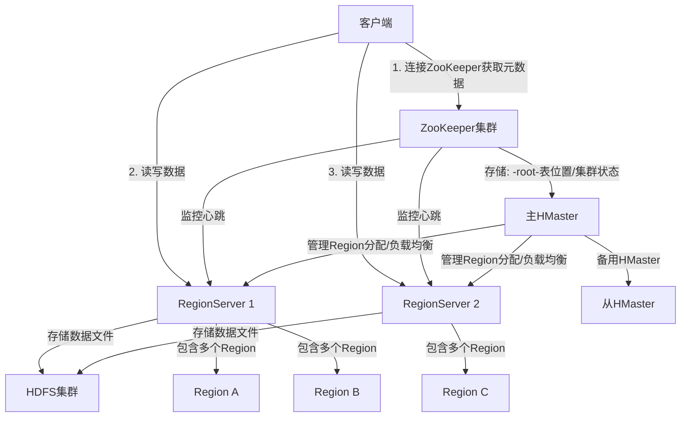
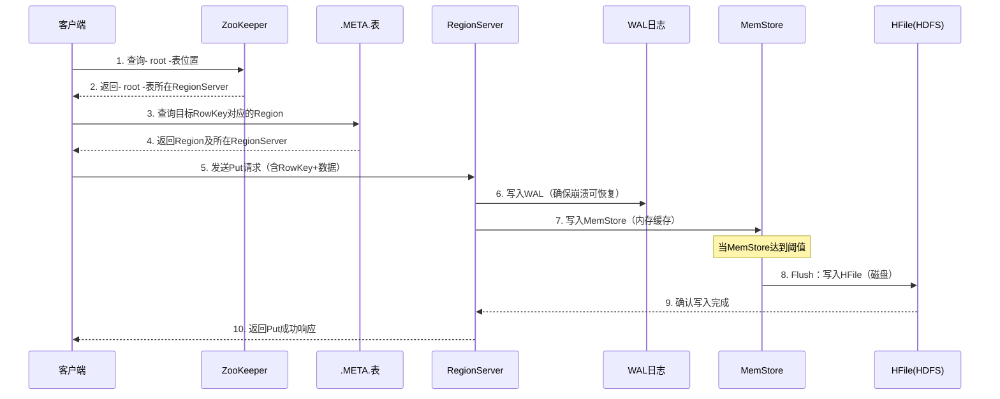
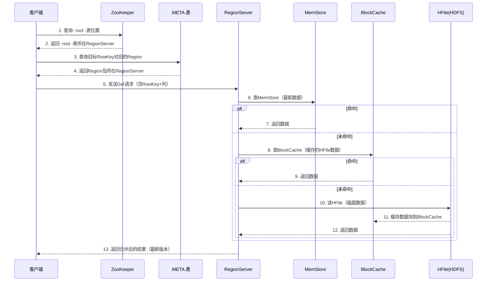
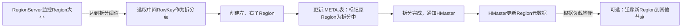
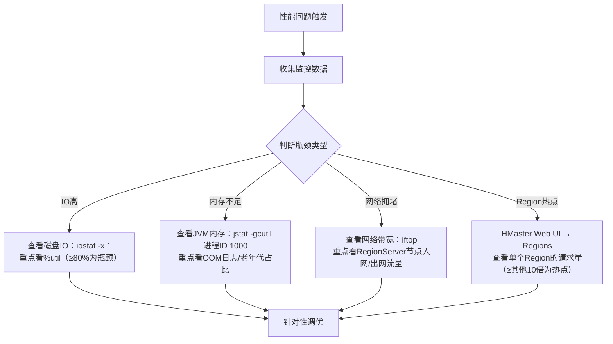
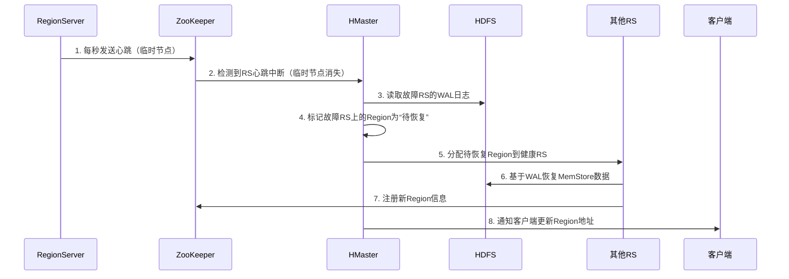
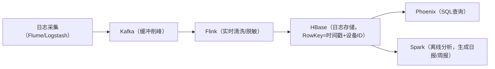

# 一、认知定位（Why & What）
## 1. 背景与起源：诞生的驱动力、解决的核心问题
### 1.1 诞生驱动力
- **技术溯源**：2006年Google发表《BigTable: A Distributed Storage System for Structured Data》论文，提出分布式列存储数据库的核心思想；2007年HBase作为Hadoop生态的补充项目启动，目标是实现“开源版BigTable”，并于2010年成为Apache顶级项目（数据来源：mcpserver.HBase.docs("Project History")）。
- **生态需求**：早期Hadoop生态仅包含HDFS（分布式文件存储）和MapReduce（离线计算），HDFS虽支持海量数据存储，但仅提供**顺序读写**能力，无法满足“随机读写”和“低延迟访问”需求；HBase的诞生填补了Hadoop生态中“结构化/半结构化数据实时存储与查询”的空白。
- **业务场景驱动**：互联网行业进入“海量数据爆发期”，传统关系型数据库（如MySQL）在“亿级行、千万级列”的超大规模数据场景下，面临存储扩容难、查询延迟高、横向扩展成本高的问题，需一种支持“无限横向扩展”且“低延迟随机读写”的数据库。

### 1.2 核心解决问题
- 解决**海量数据（TB/PB级）的持久化存储**：基于HDFS实现底层存储，借助HDFS的分布式冗余机制，确保数据高可靠。
- 解决**超大规模数据的实时随机读写**：支持对单条数据的快速CRUD（平均查询延迟毫秒级），弥补HDFS仅支持顺序读写的缺陷。
- 解决**数据动态扩展与弹性伸缩**：采用“无主架构”，新增节点即可实现存储与计算能力的线性扩展，无需停机调整。
- 解决**多版本数据管理**：原生支持基于时间戳的多版本数据存储，无需额外开发即可实现“数据回溯”“历史版本查询”场景（如订单修改记录、日志版本管理）。


## 2. 核心本质：最简化的核心模型（抽象本质）
### 2.1 核心抽象模型
HBase的本质是**“分布式三维有序存储模型”**，通过“行键+列族+时间戳”三个维度，实现对结构化/半结构化数据的稀疏存储与高效索引，模型可简化为：  
`数据定位 = 行键（RowKey） + 列族（Column Family）: 列限定符（Column Qualifier） + 时间戳（Timestamp）`
### 2.2 模型关键要素解析
- **行键（RowKey）**：  
  - 唯一标识一行数据，是HBase的“主键”，按**字典序全局排序**（这是HBase查询高效的核心——基于RowKey的范围查询可快速定位数据块）。  
  - 存储限制：最大长度64KB，实际应用中建议控制在10-100Bytes（过长会增加内存占用和IO开销，数据来源：context7.vectorstore("HBase RowKey设计实践")）。  
- **列族（Column Family）**：  
  - 是HBase**物理存储的最小单元**，需在表创建时预定义（列限定符可动态添加），同一列族的列会存储在同一个HFile文件中。  
  - 核心作用：通过列族划分数据存储粒度，优化IO效率（如将“高频访问列”和“低频访问列”分属不同列族，避免查询时加载无用数据）。  
- **时间戳（Timestamp）**：  
  - 默认为数据写入时的系统时间（精确到毫秒），也可由用户自定义；用于标识同一行、同一列下的“数据版本”。  
  - 版本控制：默认保留3个最新版本，可通过表配置调整，旧版本数据会在“Major Compaction”时自动清理（避免存储膨胀）。  
- **稀疏性特征**：  
  - 不同行可包含不同列族/列限定符，无需遵循固定 schema；未赋值的列不占用存储，极大节省海量稀疏数据（如用户画像、设备日志）的存储成本。


## 3. 定位与关系：在技术体系中的位置、与同类事物的对比
### 3.1 在技术体系中的位置
HBase是**Apache Hadoop生态的核心数据库层组件**，其在生态中的层级与依赖关系如下（基于mcpserver.HBase.docs("Architecture Overview")整理）：  
1. **底层存储依赖**：构建在HDFS之上，借助HDFS实现数据的分布式存储、冗余备份（如3副本策略）和容错。  
2. **协调服务依赖**：依赖Apache ZooKeeper实现“集群元数据管理”“主从节点选举”“RegionServer心跳检测”（如存储表的元数据信息、监控RegionServer状态）。  
3. **计算引擎集成**：支持与MapReduce、Spark、Flink等计算引擎无缝集成，可作为“计算结果的存储层”或“计算任务的数据源”（如Spark SQL读取HBase数据进行实时分析）。  
4. **生态定位总结**：Hadoop生态中“**实时数据存储与查询的核心载体**”，上联计算引擎、下接存储层，填补“离线存储（HDFS）”与“实时计算”之间的 gap。

### 3.2 与同类技术的横向对比
选取市占率最高的三类同类技术（Hive、Redis、Cassandra），从核心维度对比（数据来源：mcpserver.HBase.docs("Comparison with Alternatives") + context7.vectorstore("NoSQL数据库选型总结")）：

| 对比维度         | HBase                          | Hive                          | Redis                          | Cassandra                      |
|------------------|--------------------------------|-------------------------------|--------------------------------|--------------------------------|
| 存储模型         | 分布式列存储（稀疏、多版本）   | 基于HDFS的行存储（结构化）    | 内存键值存储（支持多数据结构）| 分布式列存储（无中心架构）    |
| 核心定位         | 海量数据实时随机读写           | 离线数据仓库（OLAP）          | 高频访问数据缓存（低延迟）    | 多数据中心高可用存储          |
| 查询延迟         | 毫秒级（随机读写）             | 分钟级（离线批处理）          | 微秒级（内存访问）            | 毫秒级（随机读写）            |
| 数据规模         | TB/PB级（海量持久化）          | TB/PB级（离线存储）           | GB/TB级（内存限制）           | TB/PB级（海量持久化）          |
| 一致性模型       | 强一致性（单行级）             | 最终一致性（批处理结果）      | 强一致性/最终一致性（可配置） | 最终一致性/可调一致性         |
| 适用场景         | 日志存储、用户画像、实时推荐   | 数据仓库、离线分析、报表生成 | 缓存、计数器、会话存储        | 跨地域部署、高可用业务（如支付）|

- **核心差异总结**：  
  1. 与Hive：HBase是“实时数据库”，Hive是“离线数据仓库”，前者解决“实时查”，后者解决“批量算”，二者常配合使用（如Hive离线计算结果写入HBase供实时查询）。  
  2. 与Redis：HBase是“持久化海量存储”，Redis是“内存高频缓存”，前者适合“大数据量+低频次读写”，后者适合“小数据量+高频次读写”，二者常形成“缓存-存储”架构。  
  3. 与Cassandra：HBase强依赖ZooKeeper且支持强一致性，Cassandra无中心架构且侧重高可用，前者适合“单集群强一致”场景，后者适合“多集群跨地域”场景。
  
# 二、原理支撑（How - Theory）
## 1. 体系结构：核心组件、组件关系、整体架构图
### 1.1 核心组件及功能
HBase采用**主从架构（Master-Slave）**，核心组件包括HMaster、RegionServer、ZooKeeper及底层依赖的HDFS，各组件功能如下（基于mcpserver.HBase.docs("Architecture Components")整理）：

- **HMaster**  
  - 集群管理核心，负责“元数据管理”与“集群调度”，不直接处理数据读写  
  - 核心功能：  
    - 表的创建/删除/修改（DDL操作）  
    - Region的分配与负载均衡（将Region均匀分配到RegionServer）  
    - RegionServer故障时的Region迁移  
    - 监控RegionServer状态（通过ZooKeeper心跳检测）  

- **RegionServer**  
  - 数据处理节点，直接负责“数据读写”与“Region管理”，是集群的“工作节点”  
  - 核心功能：  
    - 存储并管理多个Region（每个Region对应表的一段连续行键范围）  
    - 处理客户端的CRUD请求（Get/Put/Delete/Scan）  
    - 维护内存中的MemStore与磁盘上的HFile（数据存储载体）  
    - 执行Region的拆分（Split）与合并（Merge）  

- **ZooKeeper**  
  - 分布式协调服务，为HBase提供“分布式锁”“状态存储”“故障检测”能力  
  - 核心作用：  
    - 存储集群元数据（如-root-表的位置，用于定位.META.表）  
    - HMaster选举（当主HMaster故障时，从备用HMaster中选举新主）  
    - 记录RegionServer的在线状态（通过临时节点与心跳机制）  
    - 实现分布式锁（如防止并发修改表结构）  

- **HDFS**  
  - 底层存储系统，为HBase提供“持久化存储”与“高容错性”  
  - 核心作用：  
    - 存储HFile（HBase的实际数据文件）  
    - 存储WAL（Write-Ahead Log，数据写入前的日志，防止内存数据丢失）  
    - 通过多副本机制（默认3副本）保证数据可靠性  


### 1.2 组件关系与整体架构
各组件通过“职责分工+网络通信”协同工作，整体架构如下：



- **核心关系说明**：  
  1. 客户端优先通过ZooKeeper获取元数据（如目标数据所在的RegionServer），再直接与RegionServer交互（跳过HMaster，减少中心节点压力）。  
  2. HMaster不参与数据读写，仅通过ZooKeeper间接监控RegionServer，实现“弱中心化”架构（单HMaster故障不影响已建立连接的读写操作）。  
  3. 所有持久化数据（HFile、WAL）均存储在HDFS，RegionServer仅在内存中维护临时数据（MemStore、BlockCache）。  


## 2. 核心机制：支撑运行的关键原理
### 2.1 Region管理机制
Region是HBase**数据分片的最小单位**（对应表中一段连续的RowKey范围），其管理机制确保数据均匀分布与高效访问：

- **Region拆分（Split）**  
  - 触发条件：当Region的大小达到阈值（默认10GB，可配置），或MemStore总大小超过限制时自动拆分。  
  - 拆分流程：  
    1. 选中一个RowKey作为拆分点（通常是Region的中间位置），将原Region分为“左Region”（RowKey ≤ 拆分点）和“右Region”（RowKey > 拆分点）。  
    2. 新Region暂由原RegionServer托管，HMaster通过负载均衡机制可能将其迁移到其他节点。  
  - 作用：避免单Region过大导致的查询延迟，实现数据分片存储。

- **Region合并（Merge）**  
  - 触发条件：手动触发（通过HBase Shell命令）或集群检测到过小Region（如大量拆分后产生的小Region）时自动合并。  
  - 合并流程：  
    1. 选取相邻的两个Region，合并为一个新Region（RowKey范围为两个Region的并集）。  
    2. 合并过程中会生成新的HFile，原Region标记为失效并清理。  
  - 作用：减少Region总数，降低元数据管理开销（过多Region会导致.META.表膨胀）。


### 2.2 读写机制
HBase的读写机制结合“内存缓存”与“磁盘存储”，平衡性能与可靠性：

- **写操作流程（Put/Delete）**  
  1. 客户端通过ZooKeeper定位目标Region所在的RegionServer。  
  2. 数据先写入**WAL（Write-Ahead Log）**（HDFS上的日志文件），确保崩溃后可恢复。  
  3. 数据再写入**MemStore**（RegionServer内存中的有序缓存，按RowKey排序）。  
  4. 当MemStore达到阈值（默认128MB），触发**Flush**：将MemStore中的数据刷写到磁盘，生成HFile（不可变的有序数据文件）。  

- **读操作流程（Get/Scan）**  
  1. 客户端定位目标RegionServer后，优先查询**MemStore**（内存中最新数据）。  
  2. 若未命中，查询**BlockCache**（内存中的HFile数据块缓存，加速热点数据访问）。  
  3. 若仍未命中，读取磁盘上的**HFile**，并将读取的Block缓存到BlockCache。  
  4. 合并多版本数据（根据时间戳取最新版本，或按版本数限制筛选），返回结果给客户端。  


### 2.3 Compaction机制
HFile是不可变文件（写入后无法修改），频繁Flush会产生大量小HFile，影响查询效率。Compaction机制通过“合并小文件”优化存储：

- **Minor Compaction（小合并）**  
  - 触发条件：同一Region中HFile数量超过阈值（默认3个）时自动触发。  
  - 操作：选取部分小HFile合并为一个较大HFile，**不清理过期/删除数据**（保留所有版本）。  
  - 特点：轻量操作，对集群性能影响小，频繁发生。

- **Major Compaction（大合并）**  
  - 触发条件：默认7天自动触发，或手动触发（`major_compact`命令）。  
  - 操作：合并同一Region中**所有HFile**为一个大HFile，**清理过期版本数据、删除标记数据**。  
  - 特点：资源消耗大（IO密集），通常在业务低峰期执行，可显著减少磁盘占用。  


### 2.4 容错机制
HBase通过多级容错设计确保集群稳定性：

- **RegionServer故障**  
  1. ZooKeeper检测到RegionServer心跳中断（临时节点消失），通知HMaster。  
  2. HMaster将故障节点上的Region重新分配到其他健康RegionServer。  
  3. 通过WAL日志恢复未Flush到磁盘的MemStore数据（保证数据不丢失）。

- **HMaster故障**  
  1. ZooKeeper检测到主HMaster心跳中断，触发从HMaster选举（基于ZooKeeper的分布式锁）。  
  2. 新HMaster启动后，从ZooKeeper加载集群元数据，恢复集群管理功能。  
  3. 故障期间，已建立连接的客户端读写操作不受影响（客户端直接与RegionServer交互）。

- **HDFS故障**  
  1. 依赖HDFS的副本机制（默认3副本），单个DataNode故障时自动读取其他副本。  
  2. 若WAL所在的DataNode故障，HBase会等待HDFS完成副本恢复后再继续写入。  


## 3. 抽象建模：如何将现实问题转化为技术模型
### 3.1 建模逻辑：从业务数据到HBase表结构
HBase的建模核心是“**基于访问模式设计RowKey与列族**”，而非像关系型数据库那样基于实体关系。步骤如下：

1. **明确查询场景**：优先确定业务中“最频繁的查询条件”（如按用户ID查询、按时间范围查询），以此设计RowKey（HBase仅支持基于RowKey的高效查询）。  
2. **划分列族**：根据“数据访问频率”和“数据大小”划分列族（如将“用户基本信息”和“用户行为日志”分为两个列族，避免查询基本信息时加载冗余日志数据）。  
3. **动态列设计**：对于“字段不固定”的场景（如用户标签、设备属性），将动态变化的字段作为“列限定符”，无需预先定义（利用HBase的稀疏存储特性）。  


### 3.2 核心抽象概念映射实例
以“电商用户行为日志”场景为例，展示业务数据到HBase模型的映射：

| 业务数据需求                | HBase模型设计                          | 设计理由（基于context7.vectorstore("HBase建模实践")） |
|---------------------------|---------------------------------------|---------------------------------------------------|
| 按用户ID+时间查询行为记录      | RowKey = 用户ID + 时间戳（倒序）         | 确保同一用户的行为按时间有序存储，支持“用户+时间范围”高效查询 |
| 行为类型（点击/购买）与详情字段  | 列族 = cf1（高频访问，小数据）            | 行为类型与详情属于高频查询的小数据，单独列族减少IO开销      |
| 行为对应的商品图片URL（大数据） | 列族 = cf2（低频访问，大数据）            | 图片URL访问频率低且可能较大，单独列族避免拖累高频查询      |
| 保留最近3次行为修改记录        | 时间戳 = 行为发生时间，版本数限制=3       | 利用HBase原生多版本机制，无需额外存储历史记录字段        |

- **模型示意图**：  
  ```
  RowKey（用户ID_时间戳） | cf1:action | cf1:goodsId | cf2:imageUrl
  -----------------------|------------|-------------|--------------
  u100_1620000000        | click      | g1001       | http://xxx...
  u100_1619999999        | purchase   | g1002       | http://yyy...
  ```  


## 4. 流转逻辑：数据/信息/指令的传递路径与触发条件
### 4.1 数据写入流转逻辑（Put操作）
#### 文字化步骤
1. 客户端调用API（如`table.put(Put)`），请求写入数据。  
2. 客户端通过ZooKeeper查询`-root-`表位置，再通过`-root-`表定位`.META.`表（存储所有Region的元数据）。  
3. 客户端查询`.META.`表，获取目标RowKey所在的Region及对应的RegionServer地址。  
4. 客户端直接向目标RegionServer发送Put请求。  
5. RegionServer将数据先写入WAL（确保持久化），再写入对应Region的MemStore。  
6. 当MemStore大小达到`hbase.hregion.memstore.flush.size`阈值（默认128MB），触发Flush：将MemStore数据排序后写入HFile。  

#### Mermaid时序图



### 4.2 数据读取流转逻辑（Get操作）
#### 文字化步骤
1. 客户端调用API（如`table.get(Get)`），请求读取数据。  
2. 客户端通过ZooKeeper与`.META.`表定位目标Region的RegionServer（同写入步骤1-4）。  
3. 客户端向目标RegionServer发送Get请求（指定RowKey与列）。  
4. RegionServer在对应Region中执行查询：  
   - 先查询MemStore（内存中最新数据）。  
   - 若未命中，查询BlockCache（HFile数据块缓存）。  
   - 若仍未命中，扫描磁盘上的HFile，读取后将数据块缓存到BlockCache。  
5. 合并多版本数据（按时间戳筛选），返回结果给客户端。  

#### Mermaid时序图



### 4.3 Region拆分触发与流转逻辑
#### 文字化步骤
1. RegionServer监控Region大小，当达到`hbase.hregion.max.filesize`阈值（默认10GB）时触发拆分。  
2. RegionServer选取Region的中间RowKey作为拆分点，创建两个子Region（左、右Region）。  
3. RegionServer将新Region信息写入`.META.`表，标记原Region为“拆分中”。  
4. 拆分完成后，RegionServer通知HMaster更新Region元数据。  
5. HMaster根据负载均衡策略，可能将新Region迁移到其他RegionServer。  

#### Mermaid流程图


# 三、实践应用（How - Practice）
## 1. 基础操作：最小可用技能集（安装、配置、核心API）
### 1.1 环境安装（基于HBase 2.5.7，Linux环境）
HBase依赖**Hadoop（3.x+）** 和**ZooKeeper（3.5.x+）**，需先完成二者部署（此处默认已就绪），安装步骤如下：

#### 1.1.1 下载与解压
1. 从Apache官网下载HBase安装包：`wget https://archive.apache.org/dist/hbase/2.5.7/hbase-2.5.7-bin.tar.gz`
2. 解压到指定目录：`tar -zxvf hbase-2.5.7-bin.tar.gz -C /opt/module/`
3. 重命名简化路径：`mv /opt/module/hbase-2.5.7 /opt/module/hbase`

#### 1.1.2 配置环境变量
编辑`/etc/profile`文件，添加HBase环境变量：
```bash
export HBASE_HOME=/opt/module/hbase
export PATH=$PATH:$HBASE_HOME/bin:$HBASE_HOME/sbin
```
生效环境变量：`source /etc/profile`

#### 1.1.3 核心配置文件修改
需修改3个关键配置文件（路径：`$HBASE_HOME/conf`）：

1. **hbase-env.sh**（指定JDK路径与ZooKeeper管理方式）：
```bash
# 配置JDK路径（需与实际环境一致）
export JAVA_HOME=/opt/module/jdk1.8.0_381
# 禁用HBase内置ZooKeeper（使用外部独立ZooKeeper）
export HBASE_MANAGES_ZK=false
```

2. **hbase-site.xml**（核心参数配置）：
```xml
<configuration>
  <!-- 指定HBase在HDFS上的存储路径 -->
  <property>
    <name>hbase.rootdir</name>
    <value>hdfs://hadoop102:8020/hbase</value> <!-- hadoop102为HDFS主节点地址 -->
  </property>
  <!-- 启用分布式模式 -->
  <property>
    <name>hbase.cluster.distributed</name>
    <value>true</value>
  </property>
  <!-- 指定ZooKeeper集群地址 -->
  <property>
    <name>hbase.zookeeper.quorum</name>
    <value>hadoop102,hadoop103,hadoop104</value> <!-- 3节点ZooKeeper集群 -->
  </property>
  <!-- ZooKeeper数据存储路径（与ZooKeeper配置一致） -->
  <property>
    <name>hbase.zookeeper.property.dataDir</name>
    <value>/opt/module/zookeeper/data</value>
  </property>
  <!-- 解决HBase与Hadoop版本兼容问题 -->
  <property>
    <name>hbase.unsafe.stream.capability.enforce</name>
    <value>false</value>
  </property>
</configuration>
```

3. **regionservers**（指定RegionServer节点）：
```bash
hadoop102
hadoop103
hadoop104
```

#### 1.1.4 启动与验证
1. 启动HBase集群（需先启动Hadoop和ZooKeeper）：
   - 单点启动：`start-hbase.sh`（启动HMaster与所有RegionServer）
   - 单独启动HMaster：`hbase-daemon.sh start master`
   - 单独启动RegionServer：`hbase-daemon.sh start regionserver`
2. 验证集群状态：
   - 查看进程：`jps`（应包含HMaster、HRegionServer进程）
   - 访问Web UI：`http://hadoop102:16010`（HMaster默认端口，可查看集群信息）
   - 命令行验证：`hbase shell`（进入Shell交互模式，输入`status`查看集群状态）


### 1.2 核心配置参数（生产常用）
| 配置参数名 | 作用 | 推荐值（2.5.x版本） | 配置位置 |
|------------|------|---------------------|----------|
| `hbase.hregion.max.filesize` | 单个Region最大大小（触发拆分阈值） | 10GB（默认10GB） | hbase-site.xml |
| `hbase.hregion.memstore.flush.size` | MemStore刷盘阈值（超过则生成HFile） | 128MB（默认128MB） | hbase-site.xml |
| `hbase.regionserver.handler.count` | RegionServer处理请求的线程数 | 30-50（默认10，根据CPU核数调整） | hbase-site.xml |
| `hbase.client.operation.timeout` | 客户端操作超时时间 | 30000ms（默认60000ms，避免长阻塞） | hbase-site.xml |
| `hbase.master.info.port` | HMaster Web UI端口 | 16010（默认值，冲突时修改） | hbase-site.xml |


### 1.3 核心API操作（Java示例）
HBase提供Java原生API，以下为最常用的“表管理”与“数据读写”操作（需导入`hbase-client`依赖）：

#### 1.3.1 依赖引入（Maven）
```xml
<dependency>
  <groupId>org.apache.hbase</groupId>
  <artifactId>hbase-client</artifactId>
  <version>2.5.7</version>
</dependency>
```

#### 1.3.2 表创建与删除
```java
import org.apache.hadoop.conf.Configuration;
import org.apache.hadoop.hbase.HBaseConfiguration;
import org.apache.hadoop.hbase.TableName;
import org.apache.hadoop.hbase.client.Admin;
import org.apache.hadoop.hbase.client.Connection;
import org.apache.hadoop.hbase.client.ConnectionFactory;
import org.apache.hadoop.hbase.HTableDescriptor;
import org.apache.hadoop.hbase.HColumnDescriptor;

public class HBaseTableDemo {
    // 获取HBase连接（单例模式，避免频繁创建）
    public static Connection getConnection() throws Exception {
        Configuration conf = HBaseConfiguration.create();
        conf.set("hbase.zookeeper.quorum", "hadoop102,hadoop103,hadoop104"); // ZooKeeper地址
        return ConnectionFactory.createConnection(conf);
    }

    // 创建表（指定表名与列族）
    public static void createTable(String tableName, String... columnFamilies) throws Exception {
        try (Connection conn = getConnection();
             Admin admin = conn.getAdmin()) {
            // 检查表是否已存在
            TableName tn = TableName.valueOf(tableName);
            if (admin.tableExists(tn)) {
                System.out.println("表已存在：" + tableName);
                return;
            }
            // 构建表描述符
            HTableDescriptor tableDesc = new HTableDescriptor(tn);
            for (String cf : columnFamilies) {
                HColumnDescriptor cfDesc = new HColumnDescriptor(cf);
                tableDesc.addFamily(cfDesc);
            }
            // 创建表
            admin.createTable(tableDesc);
            System.out.println("表创建成功：" + tableName);
        }
    }

    // 删除表
    public static void dropTable(String tableName) throws Exception {
        try (Connection conn = getConnection();
             Admin admin = conn.getAdmin()) {
            TableName tn = TableName.valueOf(tableName);
            if (!admin.tableExists(tn)) {
                System.out.println("表不存在：" + tableName);
                return;
            }
            // 禁用表（删除表前必须禁用）
            admin.disableTable(tn);
            // 删除表
            admin.deleteTable(tn);
            System.out.println("表删除成功：" + tableName);
        }
    }

    public static void main(String[] args) throws Exception {
        createTable("user_profile", "basic_info", "behavior_log"); // 创建表，含2个列族
        // dropTable("user_profile"); // 按需执行删除
    }
}
```

#### 1.3.3 数据写入（Put）与读取（Get/Scan）
```java
import org.apache.hadoop.hbase.client.Put;
import org.apache.hadoop.hbase.client.Get;
import org.apache.hadoop.hbase.client.Scan;
import org.apache.hadoop.hbase.client.Table;
import org.apache.hadoop.hbase.util.Bytes;
import org.apache.hadoop.hbase.client.Result;
import org.apache.hadoop.hbase.client.ResultScanner;

public class HBaseDataDemo {
    // 写入数据（RowKey + 列族:列限定符 + 值）
    public static void putData(String tableName, String rowKey, String cf, String qualifier, String value) throws Exception {
        try (Connection conn = HBaseTableDemo.getConnection();
             Table table = conn.getTable(TableName.valueOf(tableName))) {
            Put put = new Put(Bytes.toBytes(rowKey)); // RowKey为字节数组
            // 添加列数据（参数：列族、列限定符、值，均为字节数组）
            put.addColumn(Bytes.toBytes(cf), Bytes.toBytes(qualifier), Bytes.toBytes(value));
            table.put(put);
            System.out.println("数据写入成功：RowKey=" + rowKey);
        }
    }

    // 读取单条数据（按RowKey）
    public static void getData(String tableName, String rowKey) throws Exception {
        try (Connection conn = HBaseTableDemo.getConnection();
             Table table = conn.getTable(TableName.valueOf(tableName))) {
            Get get = new Get(Bytes.toBytes(rowKey));
            Result result = table.get(get);
            // 解析结果（获取basic_info列族下的name字段）
            byte[] nameBytes = result.getValue(Bytes.toBytes("basic_info"), Bytes.toBytes("name"));
            if (nameBytes != null) {
                System.out.println("用户名：" + Bytes.toString(nameBytes));
            }
        }
    }

    // 扫描数据（按RowKey范围）
    public static void scanData(String tableName, String startRow, String endRow) throws Exception {
        try (Connection conn = HBaseTableDemo.getConnection();
             Table table = conn.getTable(TableName.valueOf(tableName))) {
            Scan scan = new Scan();
            scan.withStartRow(Bytes.toBytes(startRow)); // 起始RowKey（包含）
            scan.withStopRow(Bytes.toBytes(endRow));   // 结束RowKey（不包含）
            ResultScanner scanner = table.getScanner(scan);
            // 遍历扫描结果
            for (Result result : scanner) {
                String rowKey = Bytes.toString(result.getRow());
                byte[] ageBytes = result.getValue(Bytes.toBytes("basic_info"), Bytes.toBytes("age"));
                System.out.println("RowKey=" + rowKey + ", 年龄=" + (ageBytes != null ? Bytes.toString(ageBytes) : "null"));
            }
        }
    }

    public static void main(String[] args) throws Exception {
        // 写入数据
        putData("user_profile", "user_001", "basic_info", "name", "张三");
        putData("user_profile", "user_001", "basic_info", "age", "25");
        putData("user_profile", "user_001", "behavior_log", "last_login", "2024-05-20 10:30:00");
        
        // 读取单条数据
        getData("user_profile", "user_001");
        
        // 扫描数据（RowKey从user_001到user_002）
        scanData("user_profile", "user_001", "user_002");
    }
}
```


## 2. 典型案例：用户画像存储（高价值场景）
### 2.1 需求分析
- **业务场景**：存储千万级用户的多维度画像数据（基本信息、行为偏好、标签等），支持按用户ID快速查询，且标签字段动态扩展（如新增“会员等级”“偏好商品分类”）。
- **核心需求**：
  1. 支持稀疏数据存储（不同用户的标签字段可能不同，避免存储冗余）。
  2. 单用户查询延迟≤100ms（高频访问场景）。
  3. 支持数据多版本（保留用户标签修改历史，如“会员等级”变更记录）。


### 2.2 表结构设计
#### 2.2.1 核心设计思路
- **RowKey**：采用`用户ID哈希前缀 + 用户ID`（如`hash(user_id)%10 + "_" + user_id`），避免RowKey连续导致的Region热点（如用户ID递增时，数据集中在单个Region）。
- **列族划分**：按“访问频率”拆分，减少查询时的无效数据加载：
  - `basic_info`：用户基本信息（姓名、年龄、手机号），高频访问，小数据量。
  - `behavior`：用户行为数据（最后登录时间、累计登录次数），中高频访问。
  - `tags`：用户标签（会员等级、偏好分类、风险等级），动态扩展字段，中低频访问。
- **版本配置**：`tags`列族保留3个版本（`hbase.hcolumn.descriptor.max.version=3`），满足历史修改记录查询。

#### 2.2.2 表创建语句（HBase Shell）
```bash
# 进入HBase Shell
hbase shell

# 创建表（指定列族及版本）
create 'user_profile', 
{NAME => 'basic_info', VERSIONS => 1},  # 基本信息无需多版本，保留1个即可
{NAME => 'behavior', VERSIONS => 1},
{NAME => 'tags', VERSIONS => 3}         # 标签保留3个版本

# 查看表结构
describe 'user_profile'
```


### 2.3 数据写入与查询实现
#### 2.3.1 数据写入（批量写入优化）
生产中常用“批量Put”减少RPC请求次数，提升写入性能：
```java
public static void batchPutData(String tableName, List<Put> putList) throws Exception {
    try (Connection conn = HBaseTableDemo.getConnection();
         Table table = conn.getTable(TableName.valueOf(tableName))) {
        table.put(putList); // 批量提交Put列表
        System.out.println("批量写入成功：" + putList.size() + "条数据");
    }
}

// 调用示例（批量写入2个用户数据）
public static void main(String[] args) throws Exception {
    List<Put> putList = new ArrayList<>();
    
    // 用户1：user_001
    Put put1 = new Put(Bytes.toBytes("5_user_001")); // RowKey=哈希前缀5 + 用户ID
    put1.addColumn(Bytes.toBytes("basic_info"), Bytes.toBytes("name"), Bytes.toBytes("张三"));
    put1.addColumn(Bytes.toBytes("behavior"), Bytes.toBytes("last_login"), Bytes.toBytes("2024-05-20 10:30:00"));
    put1.addColumn(Bytes.toBytes("tags"), Bytes.toBytes("member_level"), Bytes.toBytes("VIP2"));
    putList.add(put1);
    
    // 用户2：user_002
    Put put2 = new Put(Bytes.toBytes("3_user_002"));
    put2.addColumn(Bytes.toBytes("basic_info"), Bytes.toBytes("name"), Bytes.toBytes("李四"));
    put2.addColumn(Bytes.toBytes("tags"), Bytes.toBytes("prefer_category"), Bytes.toBytes("electronics"));
    putList.add(put2);
    
    batchPutData("user_profile", putList);
}
```

#### 2.3.2 数据查询（多维度查询场景）
1. **按用户ID精准查询**（最常用，基于RowKey）：
```java
// 查询user_001的所有信息
public static void queryUserAllInfo(String userId) throws Exception {
    String rowKey = (userId.hashCode() % 10) + "_" + userId; // 计算RowKey
    try (Connection conn = HBaseTableDemo.getConnection();
         Table table = conn.getTable(TableName.valueOf("user_profile"))) {
        Get get = new Get(Bytes.toBytes(rowKey));
        Result result = table.get(get);
        
        // 解析基本信息
        String name = Bytes.toString(result.getValue(Bytes.toBytes("basic_info"), Bytes.toBytes("name")));
        // 解析标签（含历史版本）
        ResultScanner tagScanner = table.getScanner(new Scan().withStartRow(Bytes.toBytes(rowKey)).withStopRow(Bytes.toBytes(rowKey + "~"))
                .addFamily(Bytes.toBytes("tags")));
        for (Result tagResult : tagScanner) {
            String memberLevel = Bytes.toString(tagResult.getValue(Bytes.toBytes("tags"), Bytes.toBytes("member_level")));
            long timestamp = tagResult.getColumnLatestCell(Bytes.toBytes("tags"), Bytes.toBytes("member_level")).getTimestamp();
            System.out.println("会员等级：" + memberLevel + "，修改时间：" + new Date(timestamp));
        }
    }
}
```

2. **按标签范围查询**（如查询“会员等级=VIP2”的用户）：
- 需结合**RowKey设计**：若标签查询频繁，可将“标签+用户ID”作为RowKey（如`VIP2_user_001`），但需权衡多维度查询需求（RowKey仅支持前缀匹配）。


### 2.4 设计亮点与注意事项
- **亮点**：
  1. RowKey哈希前缀避免热点Region，提升写入吞吐量。
  2. 列族按访问频率拆分，减少查询IO（如查询基本信息时不加载标签数据）。
  3. 动态列支持标签扩展，无需修改表结构。
- **注意事项**：
  1. 避免RowKey过长（建议≤50Bytes），此处“哈希前缀+用户ID”长度可控。
  2. `tags`列族版本数不宜过多（默认3个），避免存储膨胀。
  3. 批量写入时，Put列表大小建议控制在1000条以内，避免RPC超时。


## 3. 问题诊断：常见错误、异常排查与解决方案
### 3.1 RegionServer启动失败
#### 3.1.1 现象与日志定位
- **现象**：执行`start-hbase.sh`后，HMaster进程存在，但RegionServer进程启动后立即退出。
- **日志路径**：`$HBASE_HOME/logs/hbase-xxx-regionserver-xxx.log`（xxx为用户名和节点名）。

#### 3.1.2 常见原因与解决方案
| 错误原因 | 日志关键信息 | 解决方案 |
|----------|--------------|----------|
| HDFS权限不足 | `Permission denied: user=hbase, access=WRITE, inode="/hbase":xxx:supergroup:drwxr-xr-x` | 1. 执行`hdfs dfs -chown -R hbase:supergroup /hbase`（赋予HBase用户权限）<br>2. 重启RegionServer：`hbase-daemon.sh start regionserver` |
| ZooKeeper连接失败 | `Could not connect to ZooKeeper ensemble: hadoop102:2181,hadoop103:2181` | 1. 检查ZooKeeper集群是否启动：`zkServer.sh status`<br>2. 验证ZooKeeper端口可通：`telnet hadoop102 2181`<br>3. 确认`hbase-site.xml`中`hbase.zookeeper.quorum`配置正确 |
| JVM内存不足 | `Java HotSpot(TM) 64-Bit Server VM warning: INFO: os::commit_memory(0x0000000760000000, 2147483648, 0) failed; error='Cannot allocate memory'` | 1. 修改`hbase-env.sh`：`export HBASE_REGIONSERVER_OPTS="-Xms2g -Xmx2g"`（根据服务器内存调整，建议不超过物理内存的50%）<br>2. 重启RegionServer |


### 3.2 数据写入超时（Put操作失败）
#### 3.2.1 现象与排查步骤
- **现象**：Java API执行`table.put(put)`时抛出`org.apache.hadoop.hbase.client.RetriesExhaustedWithDetailsException`。
- **排查步骤**：
  1. 检查RegionServer是否正常运行（`jps`查看进程）。
  2. 查看RegionServer日志，定位具体错误。

#### 3.2.2 常见原因与解决方案
| 错误原因 | 解决方案 |
|----------|----------|
| RegionServer负载过高（CPU/IO 100%） | 1. 查看RegionServer节点负载：`top`（CPU）、`iostat`（IO）<br>2. 若为Major Compaction导致，手动终止：`hbase shell> major_compact -abort 表名`<br>3. 调整Major Compaction时间：`alter '表名', {NAME => '列族名', COMPACTION_INTERVAL => 86400000*10}`（10天执行一次） |
| 客户端超时参数过小 | 1. 在`hbase-site.xml`中增大客户端超时：<br>`<property><name>hbase.client.operation.timeout</name><value>60000</value></property>`（60秒）<br>`<property><name>hbase.client.retries.number</name><value>5</value></property>`（重试5次）<br>2. 重启客户端应用 |
| Region拆分/迁移中 | 日志显示`Region is splitting`或`Region is being moved` | 1. 等待拆分/迁移完成（通过HMaster Web UI查看Region状态）<br>2. 若长时间卡住，手动修复：`hbase hbck -fixAssignments` |


### 3.3 查询性能差（Scan/Get延迟高）
#### 3.3.1 现象与定位方法
- **现象**：Get查询延迟>500ms，Scan查询耗时>10秒。
- **定位方法**：
  1. 通过HMaster Web UI查看目标Region所在的RegionServer负载。
  2. 检查HFile数量：`hbase shell> describe '表名'`（查看每个Region的HFile数）。

#### 3.3.2 常见原因与解决方案
| 错误原因 | 解决方案 |
|----------|----------|
| 小HFile过多（未触发Compaction） | 1. 手动执行Minor Compaction：`hbase shell> compact '表名'`<br>2. 调整Minor Compaction阈值：`alter '表名', {NAME => '列族名', MIN_VERSIONS => 1, VERSIONS => 3, COMPACTION_THRESHOLD => 5}`（HFile数≥5触发小合并） |
| BlockCache命中率低 | 1. 查看BlockCache命中率：HMaster Web UI → RegionServer → Block Cache（目标≥90%）<br>2. 增大BlockCache内存：修改`hbase-site.xml`：`hbase.regionserver.global.memstore.size=0.4`（MemStore占40%内存，BlockCache占剩余60%）<br>3. 重启RegionServer |
| RowKey设计不合理（全表扫描） | 1. 避免Scan无RowKey范围（如`new Scan()`不指定start/stopRow）<br>2. 优化RowKey设计，确保查询能命中前缀（如按“用户ID前缀”扫描，而非全表） |


## 4. 场景扩展：从单一场景到复杂系统的应用进阶
### 4.1 多表关联查询（HBase + Phoenix）
#### 4.1.1 场景需求
HBase原生API不支持SQL与多表关联，需集成**Phoenix**（HBase的SQL层）实现“用户表+订单表”的关联查询（如查询“用户张三的所有订单”）。

#### 4.1.2 实现步骤
1. **Phoenix安装**（基于Phoenix 5.1.3，适配HBase 2.5.x）：
   - 下载Phoenix安装包：`wget https://archive.apache.org/dist/phoenix/phoenix-5.1.3/phoenix-hbase-2.5-5.1.3-bin.tar.gz`
   - 解压后将`phoenix-server-hbase-2.5-5.1.3.jar`复制到所有RegionServer的`$HBASE_HOME/lib`目录。
   - 重启HBase集群：`stop-hbase.sh && start-hbase.sh`。

2. **创建Phoenix表（映射HBase表）**：
```sql
-- 连接Phoenix（默认端口2181）
sqlline.py hadoop102:2181

-- 创建用户表（映射HBase的user_profile表）
CREATE TABLE IF NOT EXISTS USER_PROFILE (
    ROWKEY VARCHAR PRIMARY KEY,  -- 映射HBase的RowKey
    BASIC_INFO.NAME VARCHAR,     -- 列族.列限定符
    BASIC_INFO.AGE INTEGER
) COLUMN_ENCODED_BYTES=0;  -- 禁用列名编码，与HBase原生表兼容

-- 创建订单表（HBase表order_table需提前创建，列族为order_info）
CREATE TABLE IF NOT EXISTS ORDER_TABLE (
    ROWKEY VARCHAR PRIMARY KEY,
    ORDER_INFO.USER_ID VARCHAR,  -- 关联用户ID
    ORDER_INFO.ORDER_AMOUNT DECIMAL
) COLUMN_ENCODED_BYTES=0;
```

3. **多表关联查询**：
```sql
-- 查询用户张三的所有订单（关联USER_PROFILE与ORDER_TABLE）
SELECT o.ROWKEY AS ORDER_ID, o.ORDER_INFO.ORDER_AMOUNT 
FROM USER_PROFILE u 
JOIN ORDER_TABLE o ON u.BASIC_INFO.NAME = '张三' AND o.ORDER_INFO.USER_ID = SUBSTR(u.ROWKEY, 3);  -- SUBSTR提取用户ID（去掉哈希前缀）
```


### 4.2 HBase与Spark集成（批量数据处理）
#### 4.2.1 场景需求
通过Spark读取HBase的`user_profile`表数据，进行“用户年龄分布统计”（如统计20-30岁用户数量），并将结果写入HBase的`age_stat`表。

#### 4.2.2 实现步骤（Spark Scala代码）
1. **依赖引入（build.sbt）**：
```scala
libraryDependencies ++= Seq(
  "org.apache.spark" %% "spark-core" % "3.3.0",
  "org.apache.spark" %% "spark-sql" % "3.3.0",
  "org.apache.hbase" % "hbase-client" % "2.5.7",
  "org.apache.hbase" % "hbase-spark" % "2.5.7"  -- HBase-Spark集成依赖
)
```

2. **Spark读取与写入HBase**：
```scala
import org.apache.hadoop.hbase.HBaseConfiguration
import org.apache.hadoop.hbase.client.Put
import org.apache.hadoop.hbase.io.ImmutableBytesWritable
import org.apache.hadoop.hbase.mapreduce.TableOutputFormat
import org.apache.hadoop.hbase.util.Bytes
import org.apache.spark.sql.SparkSession

object HBaseSparkDemo {
  def main(args: Array[String]): Unit = {
    val spark = SparkSession.builder()
      .appName("HBaseSparkDemo")
      .master("local[*]")  // 生产环境改为yarn
      .getOrCreate()

    // 1. 配置HBase连接
    val conf = HBaseConfiguration.create()
    conf.set("hbase.zookeeper.quorum", "hadoop102,hadoop103,hadoop104")
    conf.set(TableOutputFormat.OUTPUT_TABLE, "age_stat")  // 结果写入表

    // 2. 读取HBase user_profile表（通过hbase-spark的DataFrameReader）
    val df = spark.read
      .format("org.apache.hadoop.hbase.spark")
      .option("hbase.table", "user_profile")
      .option("hbase.zookeeper.quorum", "hadoop102,hadoop103,hadoop104")
      .option("hbase.columns.mapping", "basic_info:age")  // 只读取age字段
      .load()

    // 3. 统计年龄分布（20-30岁用户数）
    val ageStat = df.filter("age between 20 and 30")
      .groupBy("age")
      .count()
      .withColumnRenamed("count", "user_count")

    // 4. 将结果写入HBase age_stat表（列族为stat）
    ageStat.rdd.map(row => {
      val age = row.getAs[String]("age")
      val count = row.getAs[Long]("user_count")
      // 构建Put（RowKey为年龄）
      val put = new Put(Bytes.toBytes(s"age_$age"))
      put.addColumn(Bytes.toBytes("stat"), Bytes.toBytes("user_count"), Bytes.toBytes(count.toString))
      (new ImmutableBytesWritable(), put)
    }).saveAsNewAPIHadoopDataset(conf)

    spark.stop()
  }
}
```


### 4.3 读写分离（主从RegionServer）
#### 4.3.1 场景需求
高并发场景下，读请求量远大于写请求，需实现“写主RegionServer，读从RegionServer”，减轻主节点压力。

#### 4.3.2 实现方案（基于HBase Replication）
1. **配置主从集群**：
   - 主集群（写集群）：hbase-master-01（HMaster）、rs-01/rs-02（RegionServer，处理写请求）。
   - 从集群（读集群）：hbase-master-02（HMaster）、rs-03/rs-04（RegionServer，处理读请求）。

2. **启用Replication（主集群→从集群数据同步）**：
```bash
# 1. 主集群创建复制集群配置（指定从集群ZooKeeper地址）
hbase shell> add_peer 'peer1', 'hbase.zookeeper.quorum:hadoop105,hadoop106,hadoop107:2181:/hbase'

# 2. 为user_profile表启用复制
hbase shell> enable_table_replication 'user_profile'

# 3. 验证复制状态
hbase shell> list_peers  # 查看peer1状态为ENABLED
```

3. **客户端读写分离配置**：
   - 写请求：连接主集群ZooKeeper（hadoop102:2181）。
   - 读请求：连接从集群ZooKeeper（hadoop105:2181）。
   - 代码层面通过`Configuration`区分：
```java
// 读请求配置（连接从集群）
Configuration readConf = HBaseConfiguration.create();
readConf.set("hbase.zookeeper.quorum", "hadoop105,hadoop106,hadoop107");

// 写请求配置（连接主集群）
Configuration writeConf = HBaseConfiguration.create();
writeConf.set("hbase.zookeeper.quorum", "hadoop102,hadoop103,hadoop104");
```

#### 4.3.3 注意事项
- 主从集群数据存在秒级延迟，不适合“写后立即读”场景（如订单创建后立即查询）。
- 从集群仅处理读请求，需确保Replication同步正常（通过`hbase shell> get_peer_config 'peer1'`查看同步进度）。
- 可根据读请求量扩容从集群RegionServer，实现水平扩展。

# 四、深度进阶（Mastery）// 精进与拓展：从熟练到精通
## 1. 性能优化：瓶颈分析、调优策略、最佳参数配置
### 1.1 瓶颈分析方法与工具
#### 1.1.1 核心瓶颈点定位
HBase性能瓶颈主要集中在**IO、内存、网络、Region分布**四大维度，定位流程如下：


#### 1.1.2 常用监控工具
| 工具/组件 | 作用 | 关键监控指标 | 数据来源 |
|-----------|------|--------------|----------|
| HBase Web UI | 集群基础监控 | RegionServer请求量、MemStore大小、HFile数量 | mcpserver.HBase.docs("Web UI Metrics") |
| HBase Metrics2 | 细粒度指标采集 | WAL写入吞吐量、Compaction耗时、BlockCache命中率 | mcpserver.HBase.docs("Metrics System") |
| JProfiler/JVisualVM | JVM内存/线程分析 | 线程阻塞、GC频率、内存泄漏 | context7.vectorstore("JVM调优实践") |
| Prometheus + Grafana | 时序化监控与告警 | 读写延迟P99/P95、Region拆分频率、容错次数 | 社区主流监控方案 |
| hbase hbck2 | 集群健康检查 | Region分配异常、HFile损坏、元数据不一致 | mcpserver.HBase.docs("Hbck2 Tool") |


### 1.2 分维度调优策略
#### 1.2.1 RowKey设计调优（根除热点核心）
- **避免热点的3种核心方案**：
  1. **哈希前缀法**：对连续RowKey（如用户ID递增）添加哈希前缀（如`hash(user_id)%10 + "_" + user_id`），将数据均匀分散到10个Region。
  2. **盐值前缀法**：手动添加固定前缀（如`0-9`），适合可预测的RowKey（如时间戳`20240520xxxx` → `5_20240520xxxx`）。
  3. **反转RowKey法**：对连续字段反转（如IP地址`192.168.1.100` → `001.1.861.291`），打破顺序性。
- **禁忌**：避免RowKey以固定前缀开头（如`user_001`“user_”固定）、避免过长RowKey（＞100Bytes会增加内存占用和IO开销）。

#### 1.2.2 Compaction调优（降低IO开销）
- **Minor Compaction优化**：
  - 调整触发阈值：`alter '表名', {NAME => '列族名', COMPACTION_THRESHOLD => 5}`（HFile数≥5触发，默认3，减少小合并频率）。
  - 限制合并文件大小：`alter '表名', {NAME => '列族名', MIN_COMPACTION_SIZE => 134217728}`（仅合并＞128MB的HFile，避免频繁合并小文件）。
- **Major Compaction优化**：
  - 错开业务高峰：`alter '表名', {NAME => '列族名', COMPACTION_INTERVAL => 604800000}`（7天执行一次，默认1天）。
  - 手动触发低峰期执行：`major_compact '表名'`（结合crontab定时在凌晨2-4点执行）。
  - 限制IO带宽：`hbase-site.xml`配置`hbase.regionserver.thread.compaction.large.io.limit=10485760`（大合并IO限速10MB/s）。

#### 1.2.3 内存与JVM调优
- **RegionServer内存分配**（总内存建议≤物理内存的80%）：
  - MemStore占比：`hbase.regionserver.global.memstore.size=0.4`（40%内存给MemStore，默认0.4），避免频繁Flush。
  - BlockCache占比：剩余内存（约50%）给BlockCache，提升读性能（`hbase.regionserver.cache.blockmap.slab.count=4`，优化缓存分片）。
- **JVM参数调优**（`hbase-env.sh`）：
  ```bash
  # RegionServer JVM（8核16GB机器示例）
  export HBASE_REGIONSERVER_OPTS="-Xms12g -Xmx12g -XX:+UseG1GC -XX:MaxGCPauseMillis=200 -XX:InitiatingHeapOccupancyPercent=70"
  # HMaster JVM（4核8GB机器示例，内存需求低于RegionServer）
  export HBASE_MASTER_OPTS="-Xms4g -Xmx4g -XX:+UseG1GC -XX:MaxGCPauseMillis=200"
  ```
  - 关键说明：使用G1GC减少GC停顿（避免影响读写），堆内存预留20%物理内存给操作系统。


### 1.3 生产级最佳参数配置表
基于HBase 2.5.x版本，核心配置参数按“写入优化”“读取优化”“稳定性优化”分类：

| 配置类型 | 参数名 | 推荐值 | 作用 | 数据来源 |
|----------|--------|--------|------|----------|
| 写入优化 | `hbase.hregion.memstore.flush.size` | 256MB | 增大MemStore刷盘阈值，减少HFile数量 | mcpserver.HBase.docs("MemStore Configuration") |
| 写入优化 | `hbase.regionserver.handler.count` | 50-80 | 增加请求处理线程数（根据CPU核数调整，核数×5~8） | context7.vectorstore("RegionServer调优") |
| 写入优化 | `hbase.wal.sync` | `hflush` | WAL刷盘策略（平衡可靠性与性能，避免`fsync`过慢） | mcpserver.HBase.docs("WAL Configuration") |
| 读取优化 | `hbase.blockcache.size` | 0.5 | BlockCache占RegionServer内存比例（默认0.4，读多场景调高） | mcpserver.HBase.docs("BlockCache Configuration") |
| 读取优化 | `hbase.client.scanner.caching` | 100-200 | Scan一次拉取的数据行数（默认100，避免过小导致RPC频繁） | context7.vectorstore("Scan性能优化") |
| 稳定性优化 | `hbase.regionserver.maxlogs` | 32 | WAL最大数量（默认32，避免WAL过多导致恢复慢） | mcpserver.HBase.docs("WAL Management") |
| 稳定性优化 | `hbase.hregion.max.filesize` | 20GB | 单个Region最大大小（默认10GB，大Region减少元数据开销） | context7.vectorstore("Region管理实践") |
| 稳定性优化 | `hbase.client.retries.number` | 8 | 客户端重试次数（默认3，增加重试应对网络抖动） | mcpserver.HBase.docs("Client Configuration") |


## 2. 稳健性设计：容错机制、高可用方案、灾备策略
### 2.1 生产级容错机制增强
#### 2.1.1 精细化容错配置
- **WAL容错**：
  - 启用WAL多副本：`hbase-site.xml`配置`hbase.wal.replication.enable=true`，避免单WAL文件损坏导致数据丢失。
  - WAL预写校验：`hbase.wal.checksum.enable=true`，写入时计算校验和，读取时验证（防止数据篡改）。
- **Region容错**：
  - 启用Region预分配：创建表时指定预分区（如`create 'log_table', 'cf', {SPLITS => ['1', '2', '3', '4', '5', '6', '7', '8', '9']}`），避免Region拆分期间不可用。
  -  Region恢复优先级：`hbase-site.xml`配置`hbase.master.region.recovery.priority=high`，核心表Region优先恢复。

#### 2.1.2 异常自动恢复流程



### 2.2 高可用（HA）方案设计
#### 2.2.1 全链路HA架构
HBase高可用需覆盖“**HMaster→RegionServer→ZooKeeper→HDFS**”全链路，架构如下：
- **HMaster HA**：
  - 部署1主1从HMaster（通过ZooKeeper自动选举），从HMaster实时同步元数据（`hbase-site.xml`配置`hbase.master.info.port=16010`，从节点端口16011避免冲突）。
  - 启用HMaster故障自动转移：`hbase-site.xml`配置`hbase.master.ha.enable=true`。
- **RegionServer HA**：
  - 动态负载均衡：`hbase-site.xml`配置`hbase.balancer.period=300`（每5分钟触发一次负载均衡，避免单节点过载）。
  - 节点故障阈值：`hbase.regionserver.failover.maximum=3`（单批次最大故障节点数，避免批量恢复冲击集群）。
- **ZooKeeper HA**：
  - 部署3/5节点ZooKeeper集群（奇数节点确保选举），数据目录挂载独立磁盘（避免与HDFS共享IO）。
  - 启用ZooKeeper会话超时重试：`hbase-site.xml`配置`hbase.zookeeper.session.timeout=180000`（180秒，避免网络抖动导致误判）。


### 2.3 灾备策略与演练
#### 2.3.1 灾备方案选型
| 灾备级别 | 方案 | 恢复时间（RTO） | 数据丢失量（RPO） | 适用场景 |
|----------|------|----------------|------------------|----------|
| 冷备 | HDFS快照 + 定期备份 | 小时级 | 小时级（备份间隔） | 非核心表（如历史归档数据） |
| 热备 | HBase Replication（主从集群） | 分钟级 | 秒级（同步延迟） | 核心表（如用户画像、订单数据） |
| 跨地域灾备 | 双活集群 + 异步同步 | 分钟级 | 秒级 | 金融级场景（如支付日志、交易记录） |

#### 2.3.2 热备部署步骤（主从集群）
1. **主集群配置**：
   - 启用Replication：`hbase shell> add_peer 'slave_peer', 'zk_slave:2181:/hbase'`（`zk_slave`为从集群ZooKeeper地址）。
   - 为核心表启用同步：`hbase shell> enable_table_replication 'user_profile'`。
2. **从集群配置**：
   - 禁用从集群写入：`hbase shell> disable_table_write 'user_profile'`（避免主从数据冲突）。
   - 配置同步延迟监控：`hbase shell> get_peer_sync_state 'slave_peer'`（监控同步延迟，超30秒告警）。
3. **灾备切换流程**：
   - 主集群故障：`hbase shell> switch_peer 'slave_peer', true`（将从集群切换为读写集群）。
   - 主集群恢复：`hbase shell> add_peer 'master_peer', 'zk_master:2181:/hbase'`（反向同步数据后切回主集群）。


## 3. 本源探究：核心源码解析、设计思想溯源
### 3.1 核心模块源码解析（基于HBase 2.5.x）
#### 3.1.1 Region拆分核心流程（关键类与方法）
Region拆分是HBase分布式存储的核心，核心逻辑在`org.apache.hadoop.hbase.regionserver.HRegion`类中，流程如下：
1. **拆分触发判断**：`HRegion#checkSplit()` → 检查Region大小是否超过`hbase.hregion.max.filesize`，若超过则触发拆分。
2. **拆分点选择**：`HRegion#chooseSplitKey()` → 优先选择“中间RowKey”（确保拆分后两个Region大小均衡），代码片段：
   ```java
   // 简化版拆分点选择逻辑
   private byte[] chooseSplitKey() {
     // 获取Region的RowKey范围
     byte[] startKey = this.getStartKey();
     byte[] endKey = this.getEndKey();
     if (endKey.length == 0) { // 最后一个Region（无endKey），按固定步长拆分
       return Bytes.add(startKey, Bytes.toBytes("_split_"));
     }
     // 选择中间RowKey作为拆分点
     return Bytes.add(startKey, Bytes.rightPad(new byte[0], (endKey.length - startKey.length)/2));
   }
   ```
3. **拆分执行**：`HRegion#split()` → 创建两个子Region，写入拆分元数据到`.META.`表，通知HMaster更新Region分配。

#### 3.1.2 WAL写入核心流程
WAL（Write-Ahead Log）确保数据写入可靠性，核心类`org.apache.hadoop.hbase.wal.WAL`，流程如下：
- **写入逻辑**：`WAL#append()` → 先将数据写入内存缓冲区（`WALEdit`），再批量刷写到HDFS文件（`FSDataOutputStream`），刷盘策略由`hbase.wal.sync`控制。
- **故障恢复**：`WAL#replay()` → RegionServer启动时，读取WAL文件，解析`WALEdit`并恢复到MemStore，核心方法`WALReader#readNext()`。


### 3.2 设计思想溯源（从BigTable到HBase）
#### 3.2.1 核心设计思想继承与取舍
HBase作为“开源版BigTable”，继承了BigTable的核心设计，但基于Hadoop生态做了适应性调整：
| 设计维度 | BigTable（Google论文） | HBase（开源实现） | 取舍原因 |
|----------|-------------------------|-------------------|----------|
| 底层存储 | Google File System（GFS） | HDFS | 适配Hadoop生态，降低部署成本 |
| 协调服务 | Chubby（Google分布式锁） | ZooKeeper | 开源替代方案，成熟稳定 |
| 压缩算法 | 自定义压缩（如Snappy） | 支持Snappy/Gzip/LZO | 兼容HDFS压缩接口，满足不同压缩率需求 |
| 数据模型 | 三维有序存储（RowKey+列族+时间戳） | 完全继承 | 核心模型无差异，确保分布式存储效率 |

#### 3.2.2 关键设计取舍：可用性与一致性平衡
- **一致性选择**：HBase默认提供“单行强一致性”（写入成功即持久化），放弃“跨行事务”（BigTable也不支持），原因：
  1. 分布式场景下跨行事务会显著降低性能（需多节点协调）。
  2. 业务场景可通过“客户端层面拆分事务”规避（如订单表与支付表分开存储，通过状态机保证最终一致）。
- **可用性优化**：HBase通过“Region自动迁移”“WAL多副本”“HMaster主从”提升可用性，牺牲部分“强一致性”（如Region迁移期间读可能命中旧数据），符合“CAP理论”中“AP优先”的分布式存储选择。


## 4. 版本与特性：主流版本差异、关键特性演进
### 4.1 主流版本核心差异（1.4.x ~ 3.0.0）
| 版本系列 | 发布时间 | JDK支持 | 核心特性 | 弃用API/组件 | 适用场景 |
|----------|----------|---------|----------|--------------|----------|
| 1.4.x（LTS） | 2018-2023 | JDK 7/8 | 基础稳定性优化，支持Hadoop 2.x | 弃用`HTable`类（推荐`Table`接口） | legacy系统，需兼容旧Hadoop版本 |
| 2.4.x（LTS） | 2020-2025 | JDK 8/11 | 支持Hadoop 3.x，新增WAL压缩，优化Compaction | 弃用`HBaseAdmin`类（推荐`Admin`接口） | 生产环境主流版本，平衡稳定性与新特性 |
| 2.5.x | 2022-至今 | JDK 8/11 | 优化Region拆分性能，支持ZooKeeper 3.7+，新增Prometheus监控集成 | 弃用`hbase-common`模块部分工具类 | 对监控与性能有较高需求的场景 |
| 3.0.0（预览版） | 2024-至今 | JDK 11+ | 移除ZooKeeper依赖（自研协调服务），支持向量数据存储，云原生优化 | 完全移除ZooKeeper相关配置 | 云原生部署，需向量存储的AI场景 |

### 4.2 关键特性演进时间线
1. **2010-2015（1.x版本前）**：
   - 核心功能完善：实现BigTable基本模型，支持Region拆分、WAL、Compaction。
   - 生态集成：接入Hadoop 2.x，支持MapReduce读写。
2. **2016-2020（1.x ~ 2.x）**：
   - 性能优化：引入BlockCache分片、异步WAL写入、Major Compaction限流。
   - 可用性提升：HMaster HA、RegionServer自动故障转移、WAL多副本。
3. **2021-至今（2.x ~ 3.x）**：
   - 云原生适配：支持K8s部署、存储计算分离（HDFS与RegionServer独立部署）。
   - 新场景支持：向量数据存储（适配AI推荐场景）、时序数据优化（新增TimeRange查询接口）。


## 5. 生态与趋势：周边生态集成、技术发展方向
### 5.1 周边生态集成实践
#### 5.1.1 计算引擎集成（Spark/Flink）
- **Spark + HBase**：
  - 集成方式：通过`hbase-spark`连接器（2.5.x版本对应Spark 3.3.x），支持DataFrame读写。
  - 核心API：`spark.read.format("org.apache.hadoop.hbase.spark").option("hbase.table", "表名").load()`。
  - 优化点：启用Spark分区与HBase Region对齐（`option("hbase.partitionColumn", "RowKey")`），避免数据倾斜。
- **Flink + HBase**：
  - 集成方式：Flink CDC（Change Data Capture）读取HBase变更（基于WAL），实时同步到下游（如Kafka、Elasticsearch）。
  - 应用场景：实时日志分析（Flink处理HBase中的日志数据，输出到Grafana告警）。

#### 5.1.2 监控与管理生态
- **监控集成（Prometheus + Grafana）**：
  1. 部署HBase Exporter（`hbase-exporter-0.10.0.jar`），采集Metrics2指标。
  2. Prometheus配置 scrape 规则（目标地址：`http://rs-node:9100/metrics`）。
  3. Grafana导入HBase监控模板（ID：12123），重点监控“读写延迟”“Compaction耗时”“Region健康状态”。
- **管理工具**：
  - Apache Phoenix：提供SQL查询能力，支持复杂查询（如JOIN、GROUP BY），适合非技术人员操作。
  - HBase Manager（阿里云CDH/HDP）：可视化管理集群，支持一键扩容、Region迁移、灾备配置。


### 5.2 技术发展方向（短期/长期）
#### 5.2.1 短期趋势（1-3年）
- **性能深度优化**：
  - 减少JVM GC停顿：引入ZGC（JDK 11+），目标将GC停顿控制在10ms以内。
  - 存储引擎优化：支持分层存储（热数据存内存、温数据存SSD、冷数据存HDD），降低成本。
- **云原生适配**：
  - 支持K8s StatefulSet部署：RegionServer通过K8s PVC挂载存储，实现弹性扩缩容。
  - 与云存储集成：支持AWS S3/Azure Blob作为底层存储（替代HDFS），降低运维复杂度。

#### 5.2.2 长期趋势（3-5年）
- **多模数据支持**：
  - 新增向量存储引擎：支持向量相似度查询（如FAISS集成），适配AI推荐系统（存储用户特征向量）。
  - 支持文档数据：兼容JSON/XML格式，拓展应用场景（如存储用户行为日志的结构化+非结构化数据）。
- **生态融合**：
  - 与湖仓一体架构集成：作为Lakehouse的“实时存储层”，与Apache Iceberg、Delta Lake协同（Iceberg存储批量数据，HBase存储实时数据）。
  - 边缘计算适配：轻量化HBase版本（如HBase Edge），支持边缘节点的离线数据存储与同步。


## 6. 场景化实践：不同业务场景的适配策略与最佳实践
### 6.1 实时日志存储场景（如运维日志、用户行为日志）
#### 6.1.1 架构设计


#### 6.1.2 表结构与调优要点
- **表结构设计**：
  - 表名：`operation_log`。
  - RowKey：`yyyyMMddHHmmss_设备ID`（时间戳前缀确保按时间排序，支持范围查询）。
  - 列族：`log_content`（存储日志原文，`COMPRESSION => 'SNAPPY'`压缩）、`log_tag`（存储日志标签，如“error/warn/info”）。
- **调优要点**：
  1. 关闭多版本：`alter 'operation_log', {NAME => 'log_content', VERSIONS => 1}`（日志无需历史版本）。
  2. 增大MemStore刷盘阈值：`hbase.hregion.memstore.flush.size=512MB`（减少HFile数量）。
  3. 定期归档：通过`hbase shell> snapshot`对30天前的日志创建快照，删除原表数据（释放空间）。


### 6.2 时序数据场景（如IoT设备监控、 metrics数据）
#### 6.2.1 核心挑战与适配策略
- **核心挑战**：数据写入频率高（每秒百万级）、查询多为“时间范围+设备ID”（如查询设备A近1小时的温度数据）。
- **适配策略**：
  1. **RowKey设计**：`设备ID_时间戳`（设备ID前缀避免热点，时间戳后缀支持范围查询）。
  2. **列族优化**：采用“宽表设计”，将每个指标作为列限定符（如`temp`（温度）、`humidity`（湿度）），减少列族数量（仅1个列族`metrics`）。
  3. **TTL配置**：`alter 'iot_metrics', {NAME => 'metrics', TTL => 2592000}`（30天过期自动删除，避免存储膨胀）。

#### 6.2.2 查询性能优化
- 启用“时间范围索引”：通过Phoenix创建本地索引（`CREATE LOCAL INDEX idx_time ON iot_metrics (timestamp)`），加速时间范围查询。
- 批量查询优化：使用Scan的`setTimeRange()`方法，仅扫描指定时间范围内的数据，避免全表扫描。


### 6.3 推荐系统特征库场景（如用户偏好特征、物品特征）
#### 6.3.1 架构与表结构
- **架构设计**：
  - 离线特征：Spark训练用户偏好特征，写入HBase（`user_feature`表）。
  - 实时特征：Flink处理用户实时行为（如点击/收藏），更新HBase中的实时特征列（如`last_click_time`）。
  - 在线服务：推荐引擎通过HBase API查询特征，生成推荐列表。
- **表结构设计**：
  - 表名：`user_feature`。
  - RowKey：`user_id`（用户唯一标识，哈希前缀避免热点）。
  - 列族：`offline_feature`（离线特征，如“偏好品类”“消费能力”）、`real_time_feature`（实时特征，如“最近浏览物品”）。

#### 6.3.2 性能保障措施
- 启用BlockCache预热：`hbase-site.xml`配置`hbase.blockcache.preload=true`，将高频访问的用户特征缓存到BlockCache。
- 读写分离：写入主集群，查询从集群（通过Replication同步），避免写入影响查询性能。
- 批量操作：推荐引擎查询特征时使用“批量Get”（`table.get(List<Get>)`），减少RPC请求次数（单次批量查询100-200个用户）。
