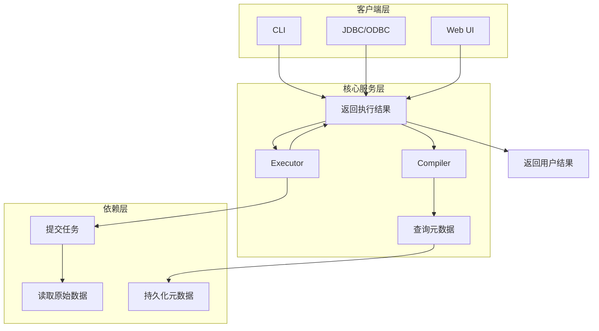
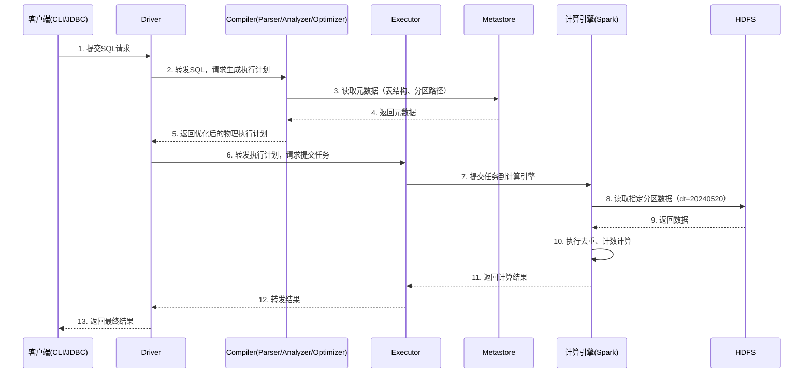
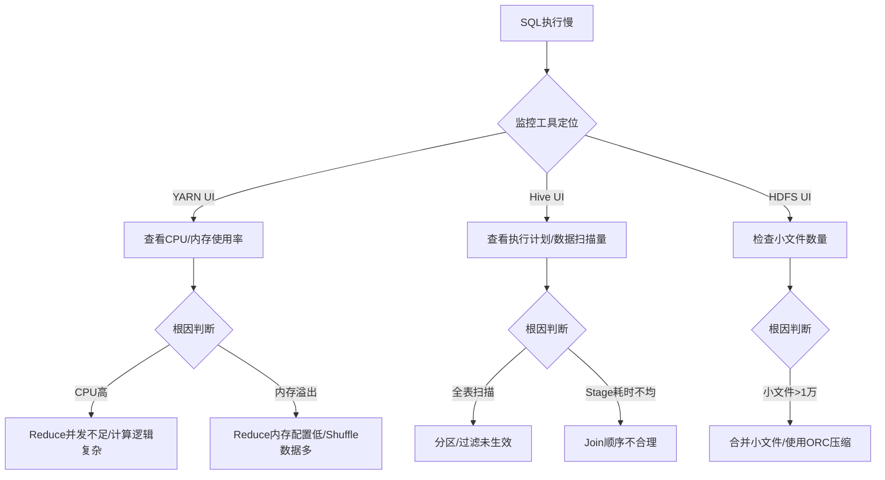

# 一、认知定位（Why & What）
## 1. 背景与起源
### 1.1 诞生的驱动力
- **Hadoop生态早期痛点**：2006年Hadoop框架成型后，底层依赖MapReduce进行分布式计算，但MapReduce需通过Java编写代码实现，开发门槛高、周期长，非技术人员（如数据分析师）无法直接操作。
- **结构化数据分析需求爆发**：互联网业务（如社交、电商）产生海量结构化数据（如用户行为日志、交易记录），企业需要“数据仓库”能力进行离线统计分析（如日活、月销报表），但当时Hadoop生态缺乏适配的结构化分析工具。
- **企业级易用性诉求**：Facebook作为早期Hadoop用户，内部数据团队需频繁处理PB级用户数据，亟需一种“类SQL”接口降低操作成本，避免重复编写MapReduce任务，这成为Hive诞生的直接需求（2007年Facebook内部研发，2008年捐献给Apache基金会）。

### 1.2 解决的核心问题
- **降低分布式分析门槛**：提供标准SQL接口（Hive SQL），支持ANSI SQL语法，让熟悉SQL的人员无需掌握Java/Scala，即可操作Hadoop分布式数据。
- **实现结构化数据管理**：通过“元数据（Metastore）”记录HDFS中原始数据的“结构化映射”（如字段名、数据类型、存储路径），将无结构的HDFS文件（如CSV、Parquet）抽象为“表”，适配数据仓库的分层管理逻辑（ODS→DW→DM）。
- **兼容Hadoop生态**：完全基于Hadoop架构设计，数据存储依赖HDFS，计算初期依赖MapReduce（后续扩展支持Spark/Tez），无需单独搭建存储/计算集群，降低企业部署成本。


## 2. 核心本质
### 2.1 最简化核心模型
Hive的本质是“**基于Hadoop的SQL解析引擎**”，而非传统数据库，其核心模型可抽象为“3层转换+2个依赖”，无数据存储能力：
1. **SQL解析层**：接收用户输入的Hive SQL，通过语法分析、语义分析生成抽象语法树（AST）；
2. **执行计划生成层**：将AST转换为逻辑执行计划，再优化为物理执行计划（如MapReduce任务、Spark Job）；
3. **任务调度层**：将物理执行计划提交到底层计算引擎（MapReduce/Spark/Tez）执行；
4. **两个核心依赖**：
   - 数据存储：依赖HDFS（或S3等兼容存储）存储原始数据，Hive本身不存数据；
   - 元数据管理：依赖Metastore存储“表结构→HDFS路径”的映射关系，是Hive识别数据的“索引”。

**抽象模型简化表述**：`用户SQL → Hive解析优化 → 底层计算任务 → 读取HDFS数据 → 返回结果`


## 3. 定位与关系
### 3.1 在技术体系中的位置
Hive属于**Hadoop生态的数据仓库工具层**，处于“业务分析需求”与“底层分布式存储/计算”之间，承担“桥梁”角色，典型技术栈层级如下：
- 上层应用：BI工具（Tableau、PowerBI）、数据应用（报表系统、数据看板）；
- 中间层（Hive）：SQL解析、执行计划优化、任务调度；
- 下层依赖：
  - 存储层：HDFS、S3、ADLS等分布式存储；
  - 计算层：MapReduce（早期）、Spark（主流）、Tez（优化型）；
  - 元数据存储：Derby（测试）、MySQL（生产）。


### 3.2 与同类工具的对比
Hive的核心特性是“**离线批处理、结构化数据仓库**”，与主流同类工具的差异集中在“计算模式”“延迟”“适用场景”，以下为市占率最高的3类工具对比：

| 对比维度       | Hive                          | HBase                          | Spark SQL                      |
|----------------|-------------------------------|--------------------------------|--------------------------------|
| 核心定位       | Hadoop生态数据仓库工具        | Hadoop生态列存NoSQL数据库      | Spark生态SQL解析引擎           |
| 数据模型       | 结构化表（支持分区、分桶）    | 非结构化/半结构化（列族模型）  | 结构化表（支持DataFrame/Dataset） |
| 计算模式       | 离线批处理（默认）            | 实时随机读写                   | 批处理+近实时（微批）          |
| 典型延迟       | 分钟级~小时级（PB级数据）     | 毫秒级~秒级（单行/小批量）     | 秒级~分钟级（GB~TB级数据）     |
| 核心依赖       | HDFS+Metastore+计算引擎       | HDFS+ZooKeeper                 | Spark集群                      |
| 适用场景       | 离线报表（日活/月销）、数据建模 | 实时查询（用户画像、订单详情） | 近实时分析（实时报表、数据探索） |
| 与Hive关系     | ——（自身）                    | 互补：Hive批处理写入，HBase实时读取 | 替代/互补：可作为Hive计算引擎，也可独立使用 |

# 二、原理支撑（How - Theory）
## 1. 体系结构
### 1.1 核心组件及功能
Hive的体系结构基于“**客户端-服务-依赖**”三层设计，核心组件无状态（除Metastore外），各组件功能聚焦单一职责，具体如下：
- **客户端层**：负责接收用户请求，提供交互入口
  - CLI（Command Line Interface）：命令行工具，最常用的交互方式（如`hive -e "select * from table"`）；
  - JDBC/ODBC驱动：支持Java/Python等语言通过API连接Hive（如Tableau通过ODBC访问Hive表）；
  - Web UI：部分版本（如Hive 2.x+）提供Web界面，用于查看任务状态、元数据信息。
- **核心服务层**：负责SQL解析、优化与任务调度
  - Metastore（元数据服务）：存储“表结构-数据路径”映射关系，包括数据库名、表名、字段类型、分区信息、HDFS存储路径等，依赖MySQL/Derby持久化；
  - Compiler（编译器）：将SQL转换为可执行计划，分3步：① Parser（语法分析生成AST）→② Analyzer（语义分析，绑定Metastore元数据）→③ Optimizer（优化执行计划，如合并Map任务、过滤下推）；
  - Executor（执行器）：将优化后的物理执行计划（如Spark Job、MapReduce任务）提交到底层计算引擎，接收执行结果并返回给客户端；
  - Driver（驱动）：串联客户端请求与核心服务，负责请求分发、组件协同（如将CLI的SQL传递给Compiler，再将执行计划交给Executor）。
- **依赖层**：提供存储与计算能力，Hive自身不实现
  - 存储依赖：HDFS/S3（存储原始数据）、MySQL/Derby（存储元数据）；
  - 计算依赖：MapReduce（早期默认）、Spark（主流）、Tez（优化型，支持DAG任务）。


### 1.2 组件关系与整体架构图
各组件通过“请求-响应”模式协同，客户端不直接操作存储/计算层，需通过核心服务转发；Metastore是所有组件的“公共依赖”（无Metastore则Hive无法识别数据）。

#### 1.2.1 整体架构图（Mermaid）



## 2. 核心机制
### 2.1 调度机制
Hive自身不实现调度，依赖“**计算引擎调度 + 外部调度工具**”协同，核心逻辑聚焦“任务优先级”与“资源隔离”：
1. **计算引擎内置调度**：底层计算引擎负责任务执行顺序，如：
   - Spark：基于YARN的调度策略（FIFO、Capacity Scheduler、Fair Scheduler），支持按队列分配资源；
   - MapReduce：依赖YARN调度，默认FIFO，生产常用Capacity Scheduler隔离多业务线资源；
2. **Hive任务优先级控制**：通过参数设置任务优先级，仅在YARN调度支持时生效，如：
   - `set mapreduce.job.priority=HIGH;`（MapReduce任务）；
   - `set spark.yarn.driver.priority=HIGH;`（Spark任务）；
3. **外部定时调度**：生产中通过Airflow、Oozie等工具调度Hive SQL任务（如每日凌晨执行数据同步脚本），解决Hive无定时能力的问题。


### 2.2 容错机制
Hive的容错依赖“**计算引擎容错 + 自身元数据容错**”，无独立容错模块，核心策略如下：
- **计算层容错**：由底层计算引擎保证，Hive不干预
  - MapReduce：Map任务失败自动重试（默认重试次数`mapreduce.map.maxattempts=4`），Reduce任务同理；任务失败超过阈值则整个Job失败；
  - Spark：Stage失败自动重试（默认`spark.stage.maxConsecutiveFailures=4`），支持黑名单机制（排除故障节点）；
- **元数据容错**：避免Metastore单点故障，生产常用方案：
  - 元数据存储高可用：MySQL主从复制（Metastore配置主从库，主库挂了切换到从库）；
  - Metastore服务高可用：部署多个Metastore实例，通过ZooKeeper实现负载均衡（客户端配置`hive.metastore.uris=thrift://host1:9083,thrift://host2:9083`）；
- **任务重跑机制**：Hive支持“幂等性任务重跑”，因数据存储在HDFS（不可变），重新执行相同SQL会覆盖旧结果，避免数据不一致（需确保SQL无副作用，如不依赖临时表动态生成）。


### 2.3 元数据管理机制
Metastore是Hive的“**数据索引中心**”，其管理机制决定Hive能否正确识别数据，核心逻辑如下：
1. **元数据存储内容**：分3类核心信息，均存储在MySQL/Derby中（以MySQL为例，对应`hive`数据库下的表）：
   - 表结构信息：`TBLS`（表名、表类型）、`COLUMNS_V2`（字段名、类型）、`SD`（存储格式、SerDe信息）；
   - 分区信息：`PARTITIONS`（分区名、分区键值）、`PARTITION_KEYS`（分区字段）；
   - 存储路径信息：`SDS`（表/分区对应的HDFS路径）；
2. **元数据访问流程**：客户端查询元数据时，需经过“缓存-数据库”两层：
   1. 客户端请求Metastore获取元数据；
   2. Metastore先查本地缓存（默认开启，参数`hive.metastore.cache.enabled=true`），命中则直接返回；
   3. 缓存未命中时，查询MySQL数据库，获取后更新缓存并返回；
3. **元数据一致性保障**：Hive通过“**禁止直接修改HDFS路径**”保证元数据与数据一致——所有数据操作（如建表、删分区）必须通过Hive SQL执行，Metastore会自动同步更新元数据；若直接修改HDFS路径（如`hdfs dfs -rm`），会导致元数据与实际数据不一致（需执行`MSCK REPAIR TABLE table_name`修复）。


## 3. 抽象建模
### 3.1 核心抽象概念
Hive将HDFS上的“无结构文件”抽象为“结构化数据模型”，核心概念围绕“**数据组织方式**”与“**数据解析规则**”设计，面试高频考点如下：
| 抽象概念 | 定义 | 核心作用 |
|----------|------|----------|
| 数据库（Database） | 表的逻辑分组，对应HDFS上的独立目录（如`/user/hive/warehouse/db_name.db`） | 隔离不同业务线数据（如`user_db`存储用户数据，`order_db`存储订单数据） |
| 表（Table） | 映射HDFS上的一组文件，包含字段名、数据类型、存储格式，对应目录`/user/hive/warehouse/db_name.db/table_name` | 将无结构文件抽象为“二维表”，支持SQL查询 |
| 分区（Partition） | 按“分区键”（如日期`dt`）将表拆分为子目录（如`/table_name/dt=20240520`），仅存储分区键对应的部分数据 | 减少查询扫描范围（如查`dt=20240520`的数据，仅扫描对应子目录） |
| 分桶（Bucket） | 按“分桶键”（如`user_id`）的哈希值将数据拆分为固定数量的文件（如分8桶，文件名为`000000_0`~`000007_0`） | 优化join查询（相同分桶键的数据在同一文件，避免全量 shuffle）、抽样查询 |
| 存储格式（Storage Format） | 定义HDFS文件的物理存储结构，如TextFile、Parquet、ORC | 平衡“存储效率”与“查询效率”（如ORC支持列式存储，查询时仅加载所需列） |
| SerDe（Serializer/Deserializer） | 序列化/反序列化工具，负责将HDFS文件内容解析为表的字段（如CSV SerDe解析逗号分隔的文本） | 适配不同数据格式（如JSON、CSV、日志格式），让Hive能读取非标准文本 |


### 3.2 建模逻辑（从业务到技术）
Hive的建模逻辑遵循“**业务需求→数据分层→表结构设计→存储优化**”四步，核心是“减少数据扫描范围”与“提升查询效率”，以“用户行为日志分析”为例：
1. **业务需求拆解**：需分析“2024年5月每日用户点击量”，需按“日期”过滤数据，按“用户ID”去重；
2. **数据分层定位**：日志数据属于“原始数据层（ODS）”，需设计ODS层表存储原始日志；
3. **表结构设计**：
   - 数据库：`ods_db`（ODS层专用数据库）；
   - 表名：`ods_user_click_log`（用户点击日志表）；
   - 字段：`user_id string`（用户ID）、`click_time string`（点击时间）、`page_url string`（页面URL）；
   - 分区键：`dt string`（按日期分区，格式`yyyyMMdd`），对应HDFS目录`/user/hive/warehouse/ods_db.db/ods_user_click_log/dt=20240520`；
   - 存储格式：ORC（列式存储，查询时仅加载`user_id`和`click_time`，减少IO）；
   - SerDe：`org.apache.hadoop.hive.ql.io.orc.OrcSerde`（ORC格式默认SerDe）；
4. **建表SQL落地**：
```sql
create database if not exists ods_db;
use ods_db;
create table if not exists ods_user_click_log (
    user_id string,
    click_time string,
    page_url string
)
partitioned by (dt string)  -- 分区配置
stored as orc               -- 存储格式
location '/user/hive/warehouse/ods_db.db/ods_user_click_log';  -- HDFS路径
```


## 4. 流转逻辑
### 4.1 SQL执行完整流程（核心流转）
Hive处理SQL的流转逻辑是“**无状态流水线式处理**”，每个步骤由特定组件负责，最终转化为计算引擎任务，具体步骤及组件对应关系如下：
1. **请求提交**：用户通过CLI/JDBC提交SQL（如`select count(distinct user_id) from ods_user_click_log where dt='20240520'`），请求传递给Driver；
2. **SQL解析（Parser）**：Driver调用Compiler的Parser模块，检查SQL语法（如关键字拼写），生成抽象语法树（AST）；
3. **语义分析（Analyzer）**：Compiler的Analyzer模块绑定Metastore元数据，验证“表是否存在”“字段是否有效”（如检查`dt`是否为分区键），将AST转换为“逻辑执行计划”（如“扫描dt=20240520的分区→去重user_id→计数”）；
4. **执行计划优化（Optimizer）**：Compiler的Optimizer模块优化逻辑计划，减少不必要的计算（如“过滤下推”：将`dt='20240520'`的过滤条件推到Map端，避免全表扫描；“聚合下推”：在Map端先局部去重，减少Reduce端数据量），生成“物理执行计划”（如Spark Job的Stage划分）；
5. **任务提交（Executor）**：Driver将物理执行计划传递给Executor，Executor根据配置的计算引擎（如Spark），将任务提交到YARN集群；
6. **数据读取与计算**：计算引擎（如Spark）从HDFS读取指定分区的数据（`/dt=20240520`），执行去重、计数操作；
7. **结果返回**：计算引擎将结果返回给Executor，Executor转发给Driver，Driver最终将结果返回给客户端（如CLI打印计数结果）。

#### 4.1.1 SQL执行流转图（Mermaid时序图）



### 4.2 元数据访问流转（辅助流转）
所有涉及“表结构查询”的操作（如`desc table`、`show partitions`）均触发元数据访问流转，流程简化如下：
1. 客户端提交元数据查询请求（如`show partitions ods_user_click_log`）；
2. Driver将请求转发给Metastore；
3. Metastore先查询本地缓存，若存在该表的分区信息，直接返回；
4. 缓存未命中时，Metastore查询MySQL数据库（如读取`PARTITIONS`表）；
5. Metastore将查询到的分区信息（如`dt=20240520`、`dt=20240521`）返回给Driver；
6. Driver将结果格式化后返回给客户端。

# 三、实践应用（How - Practice）
## 1. 基础操作
### 1.1 环境安装（Hive 3.1.3 示例）
Hive安装依赖Hadoop与JDK，生产环境推荐使用“**Hadoop 3.3.x + JDK 8 + MySQL 8.0**”组合（兼容性最优），核心步骤如下：
1. **前置依赖检查**
   - 确保Hadoop集群已启动（`start-dfs.sh`、`start-yarn.sh`）；
   -  MySQL已创建Hive元数据库（如`create database hive_meta character set utf8mb4;`），并授权用户（如`grant all on hive_meta.* to 'hive'@'%' identified by 'Hive@123';`）。
2. **安装包部署**
   - 下载Hive 3.1.3安装包（https://archive.apache.org/dist/hive/hive-3.1.3/），解压至`/opt/module/hive`；
   - 配置环境变量（`/etc/profile`）：
     ```bash
     export HIVE_HOME=/opt/module/hive
     export PATH=$PATH:$HIVE_HOME/bin
     ```
   - 执行`source /etc/profile`使配置生效。
3. **核心配置修改**
   - 复制模板文件：`cp $HIVE_HOME/conf/hive-env.sh.template $HIVE_HOME/conf/hive-env.sh`，在文件中添加Hadoop路径：`export HADOOP_HOME=/opt/module/hadoop`；
   - 创建`hive-site.xml`（核心配置元数据库连接）：
     ```xml
     <configuration>
       <!-- 元数据库连接信息 -->
       <property>
         <name>javax.jdo.option.ConnectionURL</name>
         <value>jdbc:mysql://node1:3306/hive_meta?useSSL=false&serverTimezone=UTC</value>
       </property>
       <property>
         <name>javax.jdo.option.ConnectionDriverName</name>
         <value>com.mysql.cj.jdbc.Driver</value>
       </property>
       <property>
         <name>javax.jdo.option.ConnectionUserName</name>
         <value>hive</value>
       </property>
       <property>
         <name>javax.jdo.option.ConnectionPassword</name>
         <value>Hive@123</value>
       </property>
       <!-- 指定计算引擎为Spark -->
       <property>
         <name>hive.execution.engine</name>
         <value>spark</value>
       </property>
     </configuration>
     ```
4. **初始化元数据库**
   - 下载MySQL JDBC驱动（mysql-connector-java-8.0.28.jar），放入`$HIVE_HOME/lib`；
   - 执行初始化命令：`schematool -initSchema -dbType mysql -verbose`，出现“schema initialized successfully”即为成功。
5. **验证安装**
   - 执行`hive`进入CLI，输入`show databases;`，若返回`default`库，说明安装成功。


### 1.2 核心配置参数（生产必调）
按“**功能分类**”整理高频配置，参数可在`hive-site.xml`或CLI中临时设置（`set 参数名=值;`）：
| 参数分类       | 参数名                                  | 推荐值                  | 核心作用                                  |
|----------------|-----------------------------------------|-------------------------|-------------------------------------------|
| 元数据配置     | hive.metastore.uris                     | thrift://node1:9083     | 指定Metastore服务地址（集群模式必配）      |
| 计算引擎配置   | hive.execution.engine                   | spark                   | 切换计算引擎（spark/mapreduce/tez）       |
| 资源优化       | hive.exec.dynamic.partition.mode        | nonstrict               | 开启动态分区（非严格模式，生产常用）      |
| 资源优化       | hive.exec.reducers.bytes.per.reducer    | 67108864（64MB）        | 控制Reducer数量（数据量/该值=Reducer数）  |
| 数据加载       | hive.load.dynamic.partitions.threadnum  | 10                      | 动态分区加载的并发线程数（避免超时）      |
| 权限控制       | hive.security.authorization.enabled     | true                    | 开启Hive权限控制（生产环境建议开启）      |


### 1.3 核心API（CLI+代码示例）
#### 1.3.1 CLI常用命令（高频操作）
- **库表操作**
  ```sql
  -- 创建数据库（指定HDFS路径）
  create database if not exists ods_db location '/user/hive/warehouse/ods_db.db';
  -- 创建分区表（ORC格式）
  create table if not exists ods_db.ods_user_log (
    user_id string,
    log_time string,
    action string
  ) partitioned by (dt string) stored as orc;
  ```
- **数据加载**
  ```sql
  -- 从本地文件加载（覆盖）
  load data local inpath '/data/user_log_20240520.txt' overwrite into table ods_db.ods_user_log partition (dt='20240520');
  -- 从HDFS文件加载（追加）
  load data inpath '/data/user_log_20240521.txt' into table ods_db.ods_user_log partition (dt='20240521');
  ```
- **查询与导出**
  ```sql
  -- 按分区查询
  select count(distinct user_id) as uv from ods_db.ods_user_log where dt='20240520';
  -- 结果导出到HDFS
  insert overwrite directory '/data/uv_result_20240520' row format delimited fields terminated by '\t'
  select dt, count(distinct user_id) as uv from ods_db.ods_user_log where dt='20240520' group by dt;
  ```

#### 1.3.2 JDBC代码示例（Java）
```java
import java.sql.*;

public class HiveJdbcDemo {
    private static String driverName = "org.apache.hive.jdbc.HiveDriver";
    private static String url = "jdbc:hive2://node1:10000/ods_db"; // 10000为HiveServer2端口
    private static String user = "hive";
    private static String password = "";

    public static void main(String[] args) throws SQLException, ClassNotFoundException {
        // 1. 加载驱动
        Class.forName(driverName);
        // 2. 建立连接
        Connection conn = DriverManager.getConnection(url, user, password);
        // 3. 创建Statement
        Statement stmt = conn.createStatement();
        // 4. 执行查询
        String sql = "select dt, count(distinct user_id) as uv from ods_user_log where dt='20240520' group by dt";
        ResultSet rs = stmt.executeQuery(sql);
        // 5. 处理结果
        while (rs.next()) {
            System.out.println("日期：" + rs.getString("dt") + "，UV：" + rs.getInt("uv"));
        }
        // 6. 关闭资源
        rs.close();
        stmt.close();
        conn.close();
    }
}
```

#### 1.3.3 Python API示例（pyhive）
需先安装依赖：`pip install pyhive thrift`
```python
from pyhive import hive

# 建立连接
conn = hive.Connection(host='node1', port=10000, database='ods_db', username='hive')
# 创建游标
cursor = conn.cursor()

# 执行SQL
cursor.execute("select dt, count(distinct user_id) as uv from ods_user_log where dt='20240520' group by dt")
# 获取结果
results = cursor.fetchall()
for dt, uv in results:
    print(f"日期：{dt}，UV：{uv}")

# 关闭连接
cursor.close()
conn.close()
```


## 2. 典型案例
### 2.1 数据仓库分层建模（ODS→DW→DM）
#### 2.1.1 案例目标
基于“用户行为日志”构建分层数据模型，实现“原始数据→清洗数据→统计指标”的流转，支撑每日UV/DAU报表。

#### 2.1.2 实施步骤
1. **ODS层（原始数据层）：存储未清洗原始日志**
   - 建表SQL（外部表，避免误删HDFS原始数据）：
     ```sql
     create external table if not exists ods_db.ods_user_log (
       user_id string comment '用户ID',
       log_time string comment '日志时间（格式：yyyy-MM-dd HH:mm:ss）',
       action string comment '用户行为（click/view/pay）',
       page_url string comment '访问页面URL'
     ) 
     partitioned by (dt string comment '分区日期（yyyyMMdd）')
     row format delimited fields terminated by '\t'  -- 原始日志为制表符分隔
     location '/user/hive/warehouse/ods_db.db/ods_user_log'
     comment '用户行为日志原始表';
     ```
   - 加载数据（每日定时加载前一天日志）：
     ```sql
     load data inpath '/data/raw/user_log_20240520.txt' into table ods_db.ods_user_log partition (dt='20240520');
     ```

2. **DW层（数据仓库层）：清洗与结构化处理**
   - 建表SQL（内部表，存储清洗后数据，ORC格式压缩）：
     ```sql
     create table if not exists dw_db.dw_user_log_clean (
       user_id string comment '用户ID',
       log_time string comment '日志时间（格式：yyyy-MM-dd HH:mm:ss）',
       action string comment '用户行为（click/view/pay）',
       page_url string comment '访问页面URL',
       hour string comment '小时段（提取log_time的小时，如10表示10点）'
     ) 
     partitioned by (dt string comment '分区日期（yyyyMMdd）')
     stored as orc 
     comment '用户行为日志清洗表';
     ```
   - ETL清洗（过滤无效数据、提取小时段）：
     ```sql
     insert overwrite table dw_db.dw_user_log_clean partition (dt='20240520')
     select 
       user_id,
       log_time,
       action,
       page_url,
       substr(log_time, 12, 2) as hour  -- 从log_time提取小时（第12-13字符）
     from ods_db.ods_user_log
     where dt='20240520'
       and user_id is not null  -- 过滤用户ID为空的数据
       and action in ('click', 'view', 'pay');  -- 过滤非法行为
     ```

3. **DM层（数据集市层）：统计核心指标**
   - 建表SQL（内部表，存储UV/DAU指标）：
     ```sql
     create table if not exists dm_db.dm_user_uv_dau (
       dt string comment '日期（yyyyMMdd）',
       hour string comment '小时段（00-23）',
       uv int comment '小时UV（独立用户数）',
       dau int comment '当日DAU（累计独立用户数）'
     ) 
     stored as orc 
     comment '用户UV/DAU统计指标表';
     ```
   - 指标计算（按小时统计UV，累计当日DAU）：
     ```sql
     insert overwrite table dm_db.dm_user_uv_dau
     select 
       dt,
       hour,
       count(distinct user_id) as uv,
       max(dau) as dau  -- 累计当日DAU（取最大值即当日总DAU）
     from (
       select 
         dt,
         hour,
         user_id,
         count(distinct user_id) over (partition by dt) as dau  -- 窗口函数计算当日DAU
       from dw_db.dw_user_log_clean
       where dt='20240520'
     ) t
     group by dt, hour;
     ```

#### 2.1.3 数据流向图（Mermaid）
```mermaid
flowchart LR
    A[原始日志文件<br>/data/raw/user_log_20240520.txt] -->|load data| B[ODS层<br>ods_user_log(dt=20240520)]
    B -->|ETL清洗| C[DW层<br>dw_user_log_clean(dt=20240520)]
    C -->|指标计算| D[DM层<br>dm_user_uv_dau]
    D -->|报表展示| E[BI工具<br>Tableau/PowerBI]
```


### 2.2 分桶表优化Join查询
#### 2.2.1 案例背景
需关联“用户表（`dw_db.dw_user_info`）”与“订单表（`dw_db.dw_order_info`）”，两表数据量均为1000万+，直接Join存在Shuffle数据量大、执行慢的问题，通过分桶表优化。

#### 2.2.2 实施步骤
1. **创建分桶表**
   - 用户表（按`user_id`分8桶，ORC格式）：
     ```sql
     create table if not exists dw_db.dw_user_info_bucket (
       user_id string comment '用户ID',
       user_name string comment '用户名',
       register_time string comment '注册时间'
     )
     clustered by (user_id) into 8 buckets  -- 按user_id哈希分8桶
     stored as orc
     comment '用户分桶表';
     ```
   - 订单表（按`user_id`分8桶，与用户表分桶数/分桶键一致）：
     ```sql
     create table if not exists dw_db.dw_order_info_bucket (
       order_id string comment '订单ID',
       user_id string comment '用户ID',
       order_amount double comment '订单金额',
       order_time string comment '下单时间'
     )
     clustered by (user_id) into 8 buckets
     stored as orc
     comment '订单分桶表';
     ```
2. **插入分桶数据（需开启分桶开关）**
   ```sql
   set hive.enforce.bucketing=true;  -- 开启分桶自动匹配（Hive 2.x+）
   -- 向用户分桶表插入数据（从非分桶表同步）
   insert overwrite table dw_db.dw_user_info_bucket
   select user_id, user_name, register_time from dw_db.dw_user_info;
   -- 向订单分桶表插入数据
   insert overwrite table dw_db.dw_order_info_bucket
   select order_id, user_id, order_amount, order_time from dw_db.dw_order_info;
   ```
3. **分桶Join查询（Map Join优化）**
   ```sql
   set hive.auto.convert.join=true;  -- 开启自动Map Join
   select 
     u.user_id,
     u.user_name,
     o.order_id,
     o.order_amount
   from dw_db.dw_user_info_bucket u
   join dw_db.dw_order_info_bucket o 
     on u.user_id = o.user_id  -- 分桶键Join，避免全量Shuffle
   where o.order_time like '2024-05-20%';
   ```

#### 2.2.3 优化效果
- 原始Join：Shuffle数据量约50GB，执行时间15分钟；
- 分桶Join：Shuffle数据量约3GB（仅同桶数据Join），执行时间2分钟，效率提升7倍+。


## 3. 问题诊断
### 3.1 常见错误与解决方案（生产高频）
#### 3.1.1 元数据不一致（分区存在但Hive无法查询）
- **错误现象**：HDFS已存在分区目录（如`/user/hive/warehouse/ods_user_log/dt=20240520`），但执行`show partitions ods_user_log;`无法看到该分区，查询时提示“partition not found”。
- **错误原因**：直接通过`hdfs dfs -mkdir`创建分区目录，未更新Metastore元数据，导致Hive元数据与HDFS数据不一致。
- **解决方案**：
  1. 执行`MSCK REPAIR TABLE ods_db.ods_user_log;`（Hive 2.x+），自动扫描HDFS新增分区并同步到Metastore；
  2. 或手动添加分区：`alter table ods_db.ods_user_log add partition (dt='20240520') location '/user/hive/warehouse/ods_user_log/dt=20240520';`。


#### 3.1.2 SerDe数据格式不兼容（加载数据后查询报错）
- **错误现象**：执行`select * from ods_user_log limit 10;`报错“`org.apache.hadoop.hive.serde2.SerDeException: Number of columns mismatch`”。
- **错误原因**：建表时指定的字段分隔符（如`fields terminated by '\t'`）与实际数据的分隔符（如逗号）不一致，导致SerDe解析时字段数不匹配。
- **解决方案**：
  1. 查看原始数据格式：`hdfs dfs -cat /data/raw/user_log_20240520.txt | head -1`，确认分隔符；
  2. 重建表或修改表的SerDe配置（以逗号分隔为例）：
     ```sql
     alter table ods_db.ods_user_log set serdeproperties ('field.delim' = ',');
     ```
  3. 重新加载数据并查询。


#### 3.1.3 计算引擎任务失败（YARN资源不足）
- **错误现象**：执行SQL时，YARN UI显示任务“FAILED”，日志提示“`Container killed by YARN for exceeding memory limits`”。
- **错误原因**：Map/Reduce任务申请的内存不足，或YARN队列总资源不足，导致容器被杀死。
- **解决方案**：
  1. 临时调整任务内存参数（CLI中设置）：
     ```sql
     set mapreduce.map.memory.mb=2048;  -- Map任务内存设为2GB
     set mapreduce.reduce.memory.mb=4096;  -- Reduce任务内存设为4GB
     set mapreduce.reduce.java.opts=-Xmx3072m;  -- Reduce堆内存设为3GB（小于容器内存）
     ```
  2. 长期优化：在`hive-site.xml`中配置默认内存参数，或在YARN的`capacity-scheduler.xml`中增加Hive队列的资源配额（如`yarn.scheduler.capacity.hive.queue.capacity=50`，分配50%集群资源）。


#### 3.1.4 Hive权限拒绝（执行SQL提示无权限）
- **错误现象**：执行`create table`时报错“`Permission denied: user [hive] does not have [CREATE] privilege on [ods_db]`”。
- **错误原因**：Hive开启了权限控制（`hive.security.authorization.enabled=true`），当前用户无对应库/表的操作权限。
- **解决方案**：
  1. 使用管理员账号（如`admin`）登录Hive，授权权限：
     ```sql
     grant create on database ods_db to user hive;  -- 授予hive用户ods_db库的创建权限
     grant all on table ods_db.ods_user_log to user hive;  -- 授予全表操作权限
     ```
  2. 若使用Ranger管控权限，需在Ranger UI中为`hive`用户添加“ods_db”库的“CREATE”权限。


## 4. 场景扩展
### 4.1 多计算引擎切换（Spark/MapReduce/Tez）
Hive支持动态切换计算引擎，适配不同场景需求，核心配置与适用场景如下：
| 计算引擎 | 配置命令                              | 适用场景                                  | 优势                                      |
|----------|---------------------------------------|-------------------------------------------|-------------------------------------------|
| Spark    | `set hive.execution.engine=spark;`     | 中大规模数据（GB~TB级）、低延迟需求        | 基于内存计算，比MapReduce快3~10倍         |
| MapReduce| `set hive.execution.engine=mapreduce;` | 超大规模数据（TB~PB级）、稳定性优先        | 生态成熟，容错性强，适合夜间批量任务      |
| Tez      | `set hive.execution.engine=tez;`       | 复杂DAG任务（多表Join、多层聚合）          | 支持DAG执行，避免MapReduce的中间数据落地  |

**切换验证**：执行`select count(*) from ods_db.ods_user_log;`，通过YARN UI查看任务类型（如Spark任务显示“Spark application”，MapReduce显示“MapReduce job”）。


### 4.2 与调度工具集成（Airflow）
生产中Hive任务需定时执行（如每日凌晨2点跑ETL），通过Airflow实现任务调度，核心步骤如下：
1. **Airflow环境准备**
   - 安装Airflow：`pip install apache-airflow==2.6.3`；
   - 配置Hive连接（Airflow UI → Admin → Connections → Add a new record）：
     - Conn Id：`hive_default`
     - Conn Type：`Hive Server 2 Thrift`
     - Host：`node1`
     - Port：`10000`
     - Schema：`default`
     - Login：`hive`

2. **编写DAG文件（hive_etl_dag.py）**
```python
from airflow import DAG
from airflow.providers.apache.hive.operators.hive import HiveOperator
from datetime import datetime, timedelta

# 默认参数
default_args = {
    'owner': 'airflow',
    'depends_on_past': False,
    'start_date': datetime(2024, 5, 20),
    'email_on_failure': False,
    'retries': 1,
    'retry_delay': timedelta(minutes=5)
}

# 定义DAG（每日凌晨2点执行）
with DAG(
    'hive_etl_daily',
    default_args=default_args,
    schedule_interval='0 2 * * *',  # Cron表达式：每日2点
    catchup=False
) as dag:
    # 任务1：ODS层加载数据
    load_ods = HiveOperator(
        task_id='load_ods_user_log',
        hql="""
            load data inpath '/data/raw/user_log_{{ ds_nodash }}.txt' 
            into table ods_db.ods_user_log 
            partition (dt='{{ ds_nodash }}');
        """,  # {{ ds_nodash }}为Airflow变量，格式yyyyMMdd
        hive_cli_conn_id='hive_default'
    )

    # 任务2：DW层清洗数据
    etl_dw = HiveOperator(
        task_id='etl_dw_user_log',
        hql="""
            insert overwrite table dw_db.dw_user_log_clean 
            partition (dt='{{ ds_nodash }}')
            select 
                user_id, log_time, action, page_url, substr(log_time, 12, 2) as hour
            from ods_db.ods_user_log
            where dt='{{ ds_nodash }}'
              and user_id is not null;
        """,
        hive_cli_conn_id='hive_default'
    )

    # 任务依赖：load_ods → etl_dw
    load_ods >> etl_dw
```

3. **启动DAG**
   - 将DAG文件放入Airflow的`dags`目录（如`/root/airflow/dags`）；
   - 启动Airflow服务：`airflow webserver -p 8080`、`airflow scheduler`；
   - 在Airflow UI中启用“hive_etl_daily”DAG，任务将按定时执行。


### 4.3 数据湖集成（Hudi）
Hive可读取Hudi表数据，实现“增量数据处理”（解决传统Hive全量覆盖的问题），核心步骤如下：
1. **创建Hudi表（Spark SQL执行，Hudi 0.13.0）**
```sql
create table hudi_db.hudi_user_log (
  user_id string,
  log_time string,
  action string,
  dt string
)
using hudi
options (
  type = 'cow',  -- Copy-On-Write模式（读优）
  primaryKey = 'user_id,dt',  -- 主键（用户ID+日期）
  preCombineField = 'log_time'  -- 预合并字段（取最新日志时间）
)
partitioned by (dt)
location '/user/hive/warehouse/hudi_db.db/hudi_user_log';
```

2. **Hive关联Hudi表**
   - 执行Hudi同步命令，生成Hive外部表：
     ```bash
     spark-submit \
       --class org.apache.hudi.sync.common.HoodieSyncTool \
       /opt/module/hudi/hudi-sync-common-0.13.0.jar \
       --base-path /user/hive/warehouse/hudi_db.db/hudi_user_log \
       --database hudi_db \
       --table hudi_user_log \
       --sync-mode hms
     ```
   - Hive查询Hudi表（支持增量查询）：
     ```sql
     -- 全量查询
     select count(*) from hudi_db.hudi_user_log where dt='20240520';
     -- 增量查询（查询20240520之后新增的数据）
     select * from hudi_db.hudi_user_log 
     where _hoodie_commit_time > '20240520000000';  -- _hoodie_commit_time为Hudi内置字段
     ```


### 4.4 权限管控（Apache Ranger）
生产环境需精细化控制Hive权限（如开发人员仅能查询，ETL用户可写入），通过Ranger实现权限管控，核心步骤如下：
1. **Ranger与Hive集成**
   - 在Ranger UI中创建“Hive Service”（Service Manager → Add Service）：
     - Service Name：`hive_dev`
     - Username：`hive`
     - Password：`Hive@123`
     - Hive Metastore URL：`thrift://node1:9083`
     - Hive Server2 URL：`jdbc:hive2://node1:10000`

2. **创建权限策略**
   - 策略1：授予“dev_user”用户“ods_db”库的查询权限：
     - Resource：Database → `ods_db`，Table → `*`
     - Users/Groups：`dev_user`
     - Permissions：`select`
     - 生效时间：`24x7`
   - 策略2：授予“etl_user”用户“dw_db”库的写入权限：
     - Resource：Database → `dw_db`，Table → `*`
     - Users/Groups：`etl_user`
     - Permissions：`select, insert, update, delete`

3. **验证权限**
   - 使用`dev_user`登录Hive，执行`insert into dw_db.dw_user_log_clean values (...)`，提示“Permission denied”（无写入权限）；
   - 使用`etl_user`登录Hive，执行相同语句，执行成功。

# 四、深度进阶（Mastery）
## 1. 性能优化
### 1.1 瓶颈分析方法
Hive性能瓶颈集中在**计算、存储、资源**三大维度，需通过“工具监控+日志分析”定位，核心方法如下：
- **工具监控定位**
  1. **YARN UI（http://yarn-resourcemanager:8088）**：查看任务CPU/内存使用率、Container失败原因（如OOM）、任务执行时长（Map/Reduce阶段耗时占比）；
  2. **Hive UI（http://hive-server2:10002）**：查看SQL执行计划、Stage划分、数据扫描量（若扫描量远超实际需求，可能是分区/过滤未生效）；
  3. **HDFS UI（http://hdfs-namenode:50070）**：检查存储目录是否存在小文件（小文件过多会导致Map任务激增，占用资源）。
- **常见瓶颈表现与根因**
  | 瓶颈表现                  | 核心根因                                  |
  |---------------------------|-------------------------------------------|
  | Map阶段耗时过长           | 小文件过多（Map数远超集群承载）、数据未压缩 |
  | Reduce阶段OOM（内存溢出） | Reduce内存配置不足、Shuffle数据量过大      |
  | 全表扫描导致IO过高        | 未使用分区/分桶、过滤条件未下推            |
  | Join操作耗时超预期        | 未使用分桶Join、大表作为驱动表（Map Join未生效） |

#### 1.1.1 瓶颈分析流程图（Mermaid）



### 1.2 核心调优策略
#### 1.2.1 SQL层面优化（面试高频）
- **过滤下推（Predicate Pushdown）**：确保过滤条件在Map端执行，避免数据传输到Reduce端后过滤，需开启参数`set hive.optimize.ppd=true;`（默认开启），示例：
  ```sql
  -- 优化前：子查询先聚合再过滤（无效过滤）
  select * from (select user_id, count(*) from ods_user_log group by user_id) t where t.user_id='123';
  -- 优化后：先过滤再聚合（Map端过滤，减少聚合数据量）
  select user_id, count(*) from ods_user_log where user_id='123' group by user_id;
  ```
- **避免笛卡尔积（Cross Join）**：未指定Join条件会导致全量数据两两匹配，数据量呈指数级增长，需强制指定Join键，示例：
  ```sql
  -- 错误：笛卡尔积（禁用）
  select a.user_id, b.order_id from dw_user_info a, dw_order_info b;
  -- 正确：按user_id Join
  select a.user_id, b.order_id from dw_user_info a join dw_order_info b on a.user_id = b.user_id;
  ```
- **窗口函数替代自连接**：统计“用户近3天点击量”等场景，用`row_number()`/`sum() over()`替代多次自连接，减少Shuffle，示例：
  ```sql
  -- 优化前：自连接（效率低）
  select a.user_id, a.dt, sum(b.click_cnt) 
  from dm_user_click a join dm_user_click b 
    on a.user_id = b.user_id 
    and b.dt between date_sub(a.dt,2) and a.dt 
  group by a.user_id, a.dt;
  -- 优化后：窗口函数（效率提升50%+）
  select user_id, dt, 
    sum(click_cnt) over (partition by user_id order by dt rows between 2 preceding and current row) as 3d_click_sum
  from dm_user_click;
  ```

#### 1.2.2 存储层面优化
- **选择高效存储格式**：优先使用列式存储（ORC/Parquet）替代行式存储（TextFile），压缩率与查询效率对比如下：
  | 存储格式 | 压缩率 | 查询效率（单字段过滤） | 适用场景                  |
  |----------|--------|------------------------|---------------------------|
  | TextFile | 低（1:1.5） | 慢（全量读取） | 原始日志存储（ODS层）     |
  | ORC      | 高（1:10） | 快（仅读所需列） | 清洗后数据（DW/DM层）     |
  | Parquet  | 中高（1:8） | 较快 | 跨引擎共享数据（Hive/Spark） |
  - 配置示例：`create table dw_user_log stored as orc tblproperties ('orc.compress'='SNAPPY');`（ORC+SNAPPY压缩，平衡压缩率与速度）。
- **合并小文件**：小文件过多会导致Map任务激增（1个小文件对应1个Map），需在数据加载后合并，参数配置：
  ```sql
  set hive.merge.mapfiles=true;  -- Map任务结束后合并小文件
  set hive.merge.mapredfiles=true;  -- Reduce任务结束后合并小文件
  set hive.merge.size.per.task=268435456;  -- 合并后文件大小（256MB）
  ```

#### 1.2.3 计算与资源优化
- **强制Map Join**：当Join的小表数据量<100MB时，强制将小表加载到内存，避免Reduce端Shuffle，参数配置：
  ```sql
  set hive.auto.convert.join=true;  -- 自动识别小表（默认开启）
  set hive.mapjoin.smalltable.filesize=104857600;  -- 小表阈值（100MB）
  -- 手动指定小表（大表用/*+STREAMTABLE(a)*/标记）
  select /*+MAPJOIN(b)*/ a.user_id, b.user_name 
  from dw_order_info a join dw_user_info b on a.user_id = b.user_id;
  ```
- **调整Reduce并发**：Reduce数量由`hive.exec.reducers.bytes.per.reducer`控制（默认1GB），需根据数据量调整，避免Reduce过少导致OOM或过多占用资源：
  - 公式：`Reduce数 = 输入数据量 / 该参数值`
  - 配置示例：`set hive.exec.reducers.bytes.per.reducer=67108864;`（64MB/Reduce，适合小数据量快速计算）。


### 1.3 最佳参数配置表（生产必调）
| 参数分类       | 参数名                                  | 推荐值                  | 适用场景                  |
|----------------|-----------------------------------------|-------------------------|---------------------------|
| SQL优化        | hive.optimize.ppd                       | true                    | 过滤下推（默认开启）      |
| SQL优化        | hive.optimize.join.reorder              | true                    | 自动调整Join顺序          |
| 存储优化       | hive.default.fileformat                 | ORC                     | 默认存储格式（DW/DM层）   |
| 存储优化       | orc.compress                            | SNAPPY                  | ORC压缩算法               |
| Map Join       | hive.mapjoin.smalltable.filesize        | 104857600（100MB）      | 小表阈值                  |
| Reduce配置     | hive.exec.reducers.bytes.per.reducer    | 67108864（64MB）/1073741824（1GB） | 小数据量/大数据量         |
| 小文件合并     | hive.merge.size.per.task                | 268435456（256MB）      | 合并后文件大小            |
| 内存优化       | mapreduce.map.memory.mb                 | 2048                    | Map任务内存（2GB）        |
| 内存优化       | mapreduce.reduce.memory.mb              | 4096                    | Reduce任务内存（4GB）     |


## 2. 稳健性设计
### 2.1 多层级容错机制
Hive的容错需覆盖“**任务执行-元数据-数据存储**”三层，核心策略如下：
- **任务执行容错**（依赖计算引擎+参数配置）
  1. **Map/Reduce任务重试**：
     - Map任务重试：`set mapreduce.map.maxattempts=4;`（失败后重试4次，默认4次）；
     - Reduce任务重试：`set mapreduce.reduce.maxattempts=4;`；
     - 任务黑名单：`set mapreduce.job.blacklist.enabled=true;`（失败任务排除故障节点，避免重复在同一节点执行）。
  2. **Spark任务容错**：
     - Stage重试：`set spark.stage.maxConsecutiveFailures=4;`；
     - 数据本地性重试：`set spark.locality.wait=3000;`（等待3秒获取本地数据，超时则分配远程节点）。

- **元数据容错**（避免Metastore单点故障）
  1. **元数据存储高可用**：MySQL主从复制（一主一从/一主多从），配置示例（`hive-site.xml`）：
     ```xml
     <property>
       <name>javax.jdo.option.ConnectionURL</name>
       <value>jdbc:mysql://node1:3306,hive_meta?useSSL=false&serverTimezone=UTC&failOverReadOnly=false</value>
     </property>
     <property>
       <name>hive.metastore.ds.connection.url.hard.fail</name>
       <value>true</value>  <!-- 主库挂了自动切换到从库 -->
     </property>
     ```
  2. **Metastore服务集群**：部署2+个Metastore实例，通过ZooKeeper实现负载均衡，客户端配置：
     ```xml
     <property>
       <name>hive.metastore.uris</name>
       <value>thrift://node1:9083,thrift://node2:9083</value>
     </property>
     ```

- **数据存储容错**（依赖HDFS）
  1. HDFS副本机制：默认3副本（`dfs.replication=3`），确保单个节点故障不丢失数据；
  2. HDFS快照：对Hive表存储目录创建快照（如每日凌晨创建），防止误删数据，命令示例：
     ```bash
     hdfs dfsadmin -allowSnapshot /user/hive/warehouse/dw_db.db/dw_user_log
     hdfs dfs -createSnapshot /user/hive/warehouse/dw_db.db/dw_user_log snap_20240520
     ```


### 2.2 高可用架构设计
生产环境Hive高可用需实现“**无单点故障**”，核心架构如下：
#### 2.2.1 Hive高可用架构图（Mermaid）
```mermaid
flowchart TD
    subgraph 客户端层
        A[CLI/JDBC]
        B[BI工具]
    end
    
    subgraph 负载均衡层
        C[ZooKeeper]
        D[HAProxy]  -- HiveServer2负载均衡
    end
    
    subgraph 核心服务层（多节点部署）
        E[Metastore实例1]
        F[Metastore实例2]
        G[HiveServer2实例1]
        H[HiveServer2实例2]
    end
    
    subgraph 数据存储层（高可用）
        I[MySQL主库]
        J[MySQL从库]
        K[HDFS集群（3副本）]
    end
    
    %% 连接关系
    A/B --> D[负载均衡到HiveServer2]
    D --> G/H
    G/H --> C[获取Metastore地址]
    C --> E/F[Metastore集群]
    E/F --> I/J[MySQL主从]
    G/H --> K[读取HDFS数据]
    I --> J[主从同步]
```

- **关键组件高可用说明**：
  1. **HiveServer2高可用**：部署多个实例，通过HAProxy实现TCP层负载均衡，客户端连接HAProxy地址（如`jdbc:hive2://haproxy:10000`）；
  2. **Metastore高可用**：ZooKeeper维护Metastore实例列表，客户端自动发现可用实例，避免单实例故障；
  3. **MySQL高可用**：主从复制+MGR（MySQL Group Replication），确保元数据不丢失。


### 2.3 灾备策略
- **元数据灾备**：
  1. **定时全量备份**：每日凌晨通过`mysqldump`备份Hive元数据库，命令示例：
     ```bash
     mysqldump -u hive -pHive@123 --databases hive_meta > /backup/hive_meta_$(date +%Y%m%d).sql
     ```
  2. **增量备份**：开启MySQL binlog，通过`mysqlbinlog`恢复指定时间点数据（如误删表后恢复）。

- **业务数据灾备**：
  1. **跨集群复制**：使用HDFS DistCp工具将核心表（如DM层指标表）复制到备用集群，命令示例：
     ```bash
     hadoop distcp hdfs://prod-nn:8020/user/hive/warehouse/dm_db.db/dm_user_uv_dau hdfs://backup-nn:8020/backup/dm_db/
     ```
  2. **冷备份**：每月将历史数据（如3个月前的ODS层日志）归档到对象存储（如S3、OSS），降低HDFS存储压力。

- **故障恢复流程**：
  1. 主集群故障后，切换客户端连接备用集群HiveServer2；
  2. 若元数据损坏，通过备份SQL恢复MySQL元数据库；
  3. 若HDFS数据丢失，从备用集群复制数据到主集群。


## 3. 本源探究
### 3.1 核心源码解析（基于Hive 3.1.3）
#### 3.1.1 Compiler模块：SQL到执行计划的转化
Compiler是Hive的“**大脑**”，负责将SQL转化为物理执行计划，核心类与流程如下：
- **核心类路径**：`org.apache.hadoop.hive.ql.parse`
- **转化流程**：
  1. **Parser（语法分析）**：
     - 类：`ParseDriver`，调用ANTLR生成的语法解析器（`HiveParser`）；
     - 功能：将SQL字符串转化为抽象语法树（AST），检查语法错误（如关键字拼写错误）；
     - 关键代码：`ASTNode tree = parseDriver.parse(sql, ctx);`。

  2. **Analyzer（语义分析）**：
     - 类：`SemanticAnalyzer`，依赖Metastore；
     - 功能：绑定元数据（验证表/字段存在性）、解析数据类型、生成逻辑执行计划（`LogicalPlan`）；
     - 关键操作：将AST中的“表名”映射为HDFS路径，“字段名”映射为数据类型（如`string`/`int`）。

  3. **Optimizer（执行计划优化）**：
     - 类：`Optimizer`，包含多个优化器（`RuleBasedOptimizer`、`CostBasedOptimizer`）；
     - 核心优化规则：
       - 过滤下推（`PredicatePushDownRule`）：将`where`条件推到Map端；
       - Join重排序（`JoinReorderRule`）：小表先Join，减少Shuffle数据量；
       - 合并Map任务（`MapJoinOptimizer`）：识别小表，转化为Map Join。

  4. **PhysicalPlanGenerator（物理计划生成）**：
     - 功能：将优化后的`LogicalPlan`转化为物理执行计划（如`MapRedWork`/`SparkWork`）；
     - 示例：将“Join逻辑”转化为“Map Join物理操作”，指定小表加载路径。


#### 3.1.2 Metastore模块：元数据管理核心
- **核心类路径**：`org.apache.hadoop.hive.metastore`
- **核心类功能**：
  1. **HiveMetaStoreClient**：客户端类，提供元数据操作API（如`getTable`、`addPartition`）；
  2. **MetaStoreServer**：Thrift服务端，接收客户端请求，转发到`HiveMetaStore`实现类；
  3. **ObjectStore**：元数据存储实现类，封装MySQL/Derby的CRUD操作（如`createTable`调用MySQL `insert`语句）。

- **元数据查询流程源码简化**：
  ```java
  // 1. 客户端获取表元数据
  HiveMetaStoreClient client = new HiveMetaStoreClient(conf);
  Table table = client.getTable("ods_db", "ods_user_log");
  
  // 2. 服务端处理（MetaStoreServer）
  public Table getTable(String dbName, String tableName) throws TException {
    // 权限校验
    authorize("getTable", dbName, tableName);
    // 调用ObjectStore查询
    return getMSC().getTable(dbName, tableName);
  }
  
  // 3. ObjectStore查询MySQL
  public Table getTable(String dbName, String tableName) {
    // 拼接SQL：select * from TBLS where SD_ID in (select SD_ID from SDS where ...)
    String sql = buildGetTableSQL(dbName, tableName);
    // JDBC查询并转化为Table对象
    return jdbcTemplate.queryForObject(sql, new TableRowMapper());
  }
  ```


### 3.2 设计思想溯源
- **“SQL on Hadoop”核心理念**：Hive诞生的核心思想是“让SQL用户能使用Hadoop”，避免开发人员重复编写MapReduce代码，通过“SQL解析→执行计划→分布式任务”的链路，降低分布式计算门槛。
- **无状态设计**：除Metastore外，HiveServer2、Compiler均为无状态组件，可横向扩展（部署多个实例），符合分布式系统“无状态易扩展”的设计原则。
- **分层解耦**：Hive将“SQL解析”“任务调度”“数据存储”拆分为独立模块，分别依赖Compiler、Executor、HDFS，模块间通过接口通信，便于替换组件（如将计算引擎从MapReduce切换为Spark）。
- **元数据中心化**：通过Metastore集中管理“表-数据”映射关系，避免每个组件重复存储元数据，确保元数据一致性（如修改表结构后，所有客户端实时可见）。


## 4. 版本与特性
### 4.1 主流版本差异（面试高频）
选取Hive 1.x（经典版）、2.x（过渡版）、3.x（当前主流）对比，核心差异如下：
| 版本   | 发布时间 | 核心特性                                  | 计算引擎默认值 | 兼容性注意点                          |
|--------|----------|-------------------------------------------|----------------|---------------------------------------|
| 1.2.x  | 2015年   | 支持动态分区、分桶；基础SQL优化            | MapReduce      | 不支持ACID；Spark集成需手动配置        |
| 2.3.x  | 2018年   | 引入ACID事务（支持insert/update/delete）；Spark作为可选引擎；增强安全 | MapReduce      | 元数据结构变化，升级需执行schema迁移；ACID表需ORC格式 |
| 3.1.x  | 2019年   | 移除MapReduce默认引擎（默认Tez）；增强物化视图；支持LLAP（低延迟分析） | Tez            | 不兼容Hadoop 2.x（需Hadoop 3.x）；部分旧函数弃用 |

- **版本选择建议**：
  1. 新集群：优先选择Hive 3.1.3（兼容Hadoop 3.x，性能更优）；
  2. 旧集群升级：从1.x→2.x需注意元数据迁移，从2.x→3.x需先升级Hadoop到3.x。


### 4.2 关键特性演进（弃用与新增）
#### 4.2.1 新增特性（提升效率与功能）
- **ACID事务（Hive 2.x+）**：支持行级insert/update/delete，解决传统Hive“只追加”的问题，需满足：
  - 表格式为ORC；
  - 表属性配置：`tblproperties ('transactional'='true')`；
  - 适用场景：金融数据（需更新账户余额）、实时数据同步（需删除重复数据）。

- **物化视图（Hive 3.x+）**：预计算并存储常用查询结果（如“每日UV”），查询时直接读取物化视图，避免重复计算，创建示例：
  ```sql
  create materialized view mv_daily_uv 
  as select dt, count(distinct user_id) as uv from dw_user_log group by dt;
  ```
  - 刷新策略：`refresh materialized view mv_daily_uv;`（手动刷新）、`auto refresh`（自动刷新，需开启参数）。

- **LLAP（Low-Latency Analytical Processing，Hive 3.x+）**：通过“常驻内存缓存”减少查询延迟，将常见查询响应时间从分钟级降至秒级，架构包含LLAP Daemon（内存缓存）、LLAP IO（优化数据读取），启用参数：
  ```sql
  set hive.execution.engine=tez;
  set hive.llap.execution.mode=all;
  ```

#### 4.2.2 弃用特性（避免使用）
- **Hive CLI（Hive 3.x弃用）**：替代方案为Beeline（`beeline -u jdbc:hive2://node1:10000`），支持Kerberos认证、多会话管理；
- **MapReduce作为默认引擎（Hive 3.x弃用）**：替代方案为Tez/Spark，MapReduce仅作为兼容选项；
- **旧UDF函数（如`concat_ws`的旧语法）**：Hive 3.x统一函数语法，需使用标准SQL函数（如`concat_ws(',', col1, col2)`）。


## 5. 生态与趋势
### 5.1 周边生态集成（生产常用）
#### 5.1.1 与计算引擎集成
- **Hive + Spark**：Spark SQL读取Hive表（通过Hive Metastore），支持批处理与流处理，集成步骤：
  1. 配置Spark依赖Hive Metastore（`spark.sql.hive.metastore.jars=builtin`）；
  2. Spark SQL查询Hive表：
     ```scala
     spark.sql("select * from ods_db.ods_user_log where dt='20240520'").show()
     ```
  - 优势：Spark计算速度比Hive on Tez快30%+，支持复杂机器学习场景。

- **Hive + Flink**：Flink SQL实时读取Hive表（批流一体），适用实时报表场景，集成示例：
  ```sql
  -- Flink SQL创建Hive Catalog
  CREATE CATALOG hive_catalog WITH (
    'type' = 'hive',
    'hive-conf-dir' = '/opt/module/hive/conf'
  );
  -- 读取Hive表并实时计算
  SELECT dt, count(distinct user_id) as uv 
  FROM hive_catalog.ods_db.ods_user_log 
  WHERE dt = CURRENT_DATE 
  GROUP BY dt;
  ```


#### 5.1.2 与数据湖/数据仓库工具集成
- **Hive + Hudi**：Hudi管理HDFS数据的增量更新，Hive读取Hudi表实现“增量ETL”，集成步骤：
  1. Hudi创建表时指定Hive同步参数（`hoodie.datasource.hive_sync.enable=true`）；
  2. Hive查询Hudi表（支持快照查询/增量查询）：
     ```sql
     -- 增量查询Hudi表（读取20240520之后的更新）
     select * from hudi_db.hudi_user_log 
     where _hoodie_commit_time > '20240520000000';
     ```

- **Hive + Apache Iceberg**：Iceberg提供ACID事务与schema演进，Hive通过Iceberg SerDe读取表数据，适用跨引擎（Hive/Spark/Flink）共享数据场景。


### 5.2 技术发展趋势
#### 5.2.1 短期趋势（1-3年）
- **云原生Hive**：基于Kubernetes部署Hive（如AWS EMR on EKS、阿里云E-MapReduce），实现弹性扩缩容（计算节点按需启停），降低运维成本；
- **湖仓一体**：Hive与数据湖工具（Hudi/Iceberg）深度融合，支持“批处理+实时更新+跨引擎共享”，避免数据孤岛；
- **AI辅助优化**：通过机器学习模型自动优化SQL执行计划（如自动选择Join策略、调整资源参数），减少人工调优成本。

#### 5.2.2 长期趋势（3-5年）
- **低代码化**：通过可视化界面生成Hive SQL与ETL任务（如DataWorks、Airflow UI），降低非技术人员使用门槛；
- **与大模型集成**：通过大模型理解自然语言需求（如“统计2024年5月电商GMV”），自动生成Hive SQL并执行，提升分析效率；
- **绿色计算**：优化Hive任务能耗（如合并重复计算、减少数据传输），符合企业低碳发展需求。


## 6. 场景化实践
### 6.1 电商场景：大促数据处理（双11/618）
#### 6.1.1 场景特点
- 数据量激增（日常10TB/天→大促100TB/天）；
- 需求：实时监控GMV、UV、转化率，每日生成大促复盘报表；
- 挑战：任务执行超时、资源竞争激烈、数据准确性要求高。

#### 6.1.2 适配策略
- **存储优化**：
  1. ODS层原始日志用“TextFile+GZIP”（压缩率高，节省存储）；
  2. DW/DM层用“ORC+SNAPPY”（查询快，支持ACID，便于修正错误数据）。

- **计算优化**：
  1. 大促前预计算基础指标（如用户画像、商品分类表），避免大促期间重复计算；
  2. 核心报表任务使用Spark引擎+LLAP，响应时间控制在10分钟内；
  3. 开启任务优先级：`set mapreduce.job.priority=HIGH;`（确保核心任务优先执行）。

- **资源保障**：
  1. 为大促任务单独创建YARN队列（如`yarn.scheduler.capacity.dacu.queue.capacity=60`），分配60%集群资源；
  2. 限制非核心任务（如历史数据归档）在大促期间执行。

#### 6.1.3 核心SQL示例（GMV实时监控）
```sql
-- 大促GMV实时统计（每5分钟更新）
select 
  date_format(current_timestamp(), 'yyyy-MM-dd HH:mm') as time,
  sum(order_amount) as gmv,
  count(distinct order_id) as order_cnt,
  count(distinct user_id) as pay_uv
from dw_db.dw_order_info
where order_time >= date_sub(current_timestamp(), interval 5 minute)
  and order_status = 'paid';  -- 只统计已支付订单
```


### 6.2 金融场景：合规数据存储与分析
#### 6.2.1 场景特点
- 数据敏感（用户身份证、银行卡号）；
- 需求：满足监管合规（如银保监会报表），数据可追溯、不可篡改；
- 挑战：权限管控严格、数据留存时间长（需保存5-10年）、审计日志完整。

#### 6.2.2 适配策略
- **权限与安全**：
  1. 基于Apache Ranger实现精细化权限（如开发人员仅能查询脱敏数据，运维人员无查询权限）；
  2. 数据脱敏：创建视图时隐藏敏感字段，示例：
     ```sql
     create view dw_db.vw_user_info as 
     select 
       user_id,
       concat(substr(id_card, 1, 6), '********', substr(id_card, 15, 4)) as id_card_desensitized,  -- 身份证脱敏
       user_name
     from dw_db.dw_user_info;
     ```

- **数据留存与审计**：
  1. 历史数据归档：使用HDFS归档存储（`hdfs archive`）将3年前数据压缩，降低存储成本；
  2. 审计日志：开启Hive审计日志（`hive.metastore.audit.logger=org.apache.hadoop.hive.metastore audit.HiveMetastoreAuditLogger`），记录所有元数据操作（如删表、改分区）。

- **合规报表**：
  1. 使用ACID表存储核心数据（如账户流水），确保数据不可篡改；
  2. 报表生成后自动签名，防止篡改（如通过MD5校验文件完整性）。


### 6.3 日志分析场景：海量用户行为日志处理
#### 6.3.1 场景特点
- 数据非结构化（如Nginx日志、APP埋点日志）；
- 需求：分析用户访问路径、页面停留时间、错误日志排查；
- 挑战：日志格式多样、数据量大（每日50TB）、查询灵活（需支持adhoc分析）。

#### 6.3.2 适配策略
- **数据建模**：
  1. ODS层用外部表+RegexSerDe解析非结构化日志，示例（Nginx日志）：
     ```sql
     create external table ods_db.ods_nginx_log (
       remote_ip string,
       log_time string,
       request_method string,
       request_url string,
       status_code int
     )
     row format serde 'org.apache.hadoop.hive.serde2.RegexSerDe'
     with serdeproperties (
       'input.regex' = '([^ ]+) - - \\[(.*?)\\] "([^ ]+) ([^ ]+) ([^ ]+)" ([0-9]+)'
     )
     location '/user/hive/warehouse/ods_db.db/ods_nginx_log';
     ```
  2. DW层按“IP段+日期”分区，便于按区域/时间查询。

- **查询优化**：
  1. 启用分桶：按`remote_ip`分128桶，优化“按IP查询访问记录”场景；
  2. adhoc查询使用Spark SQL，支持灵活过滤（如“查询20240520 10-12点404错误日志”）。

- **数据导出**：
  将高频查询结果（如TOP 100错误URL）导出到Elasticsearch，通过Kibana可视化展示，便于实时监控。

