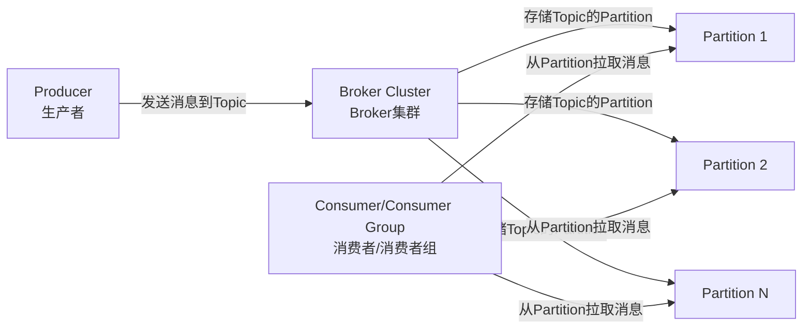
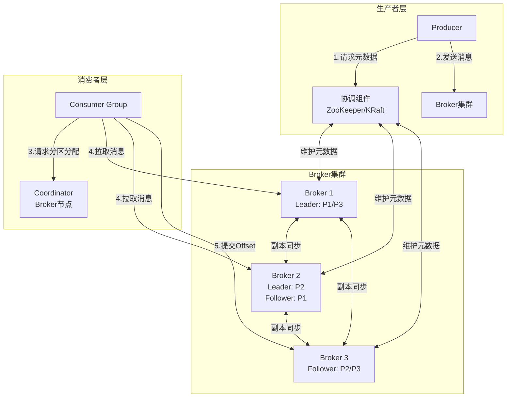
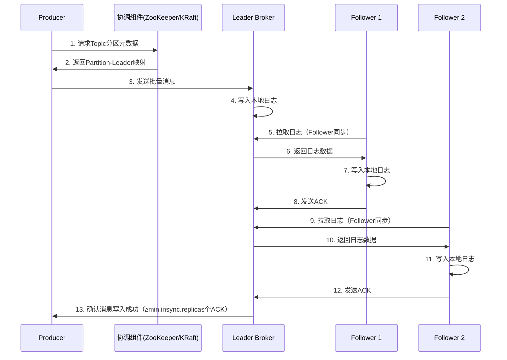
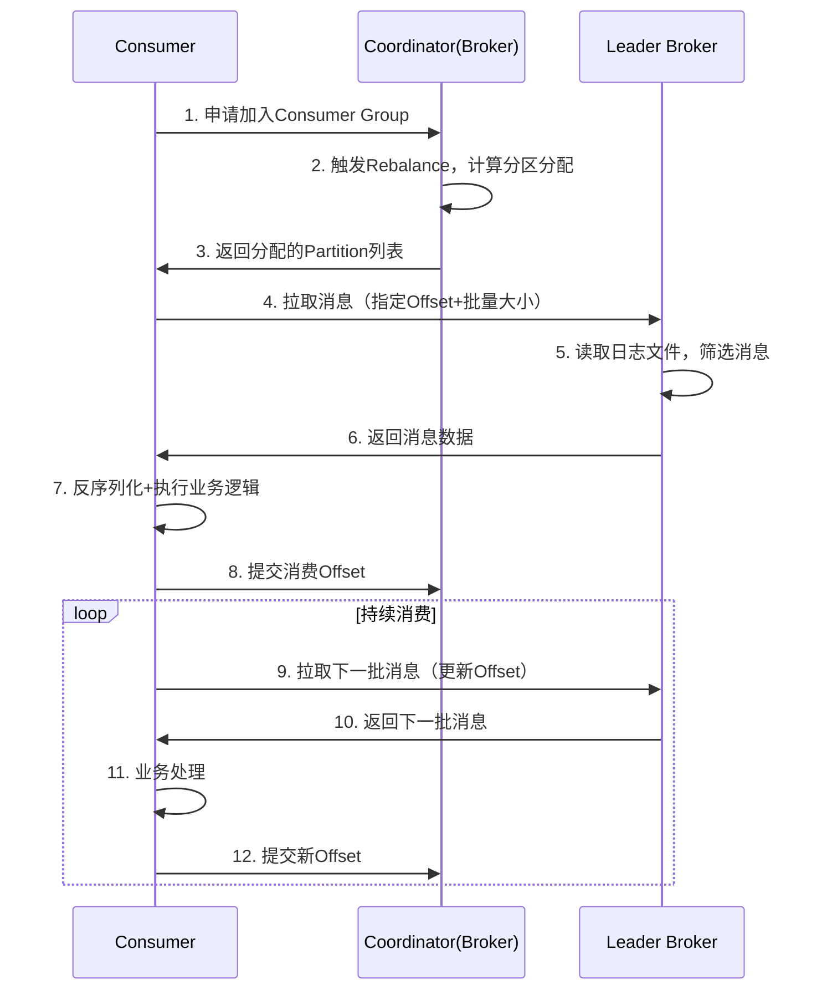
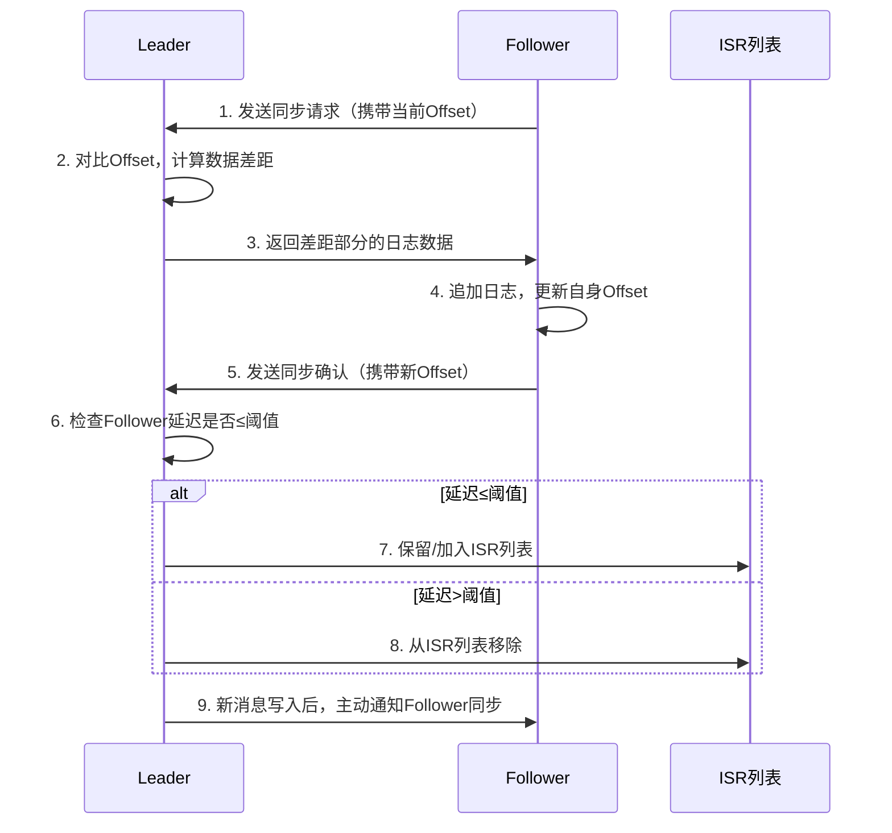
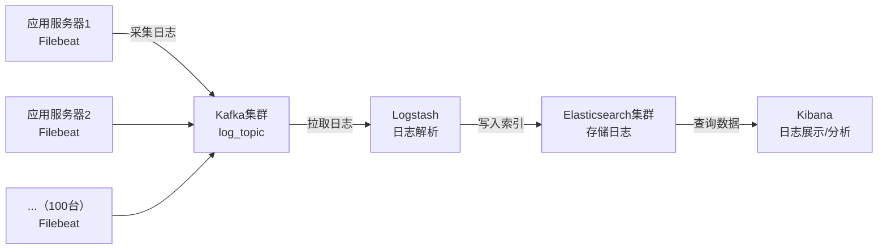
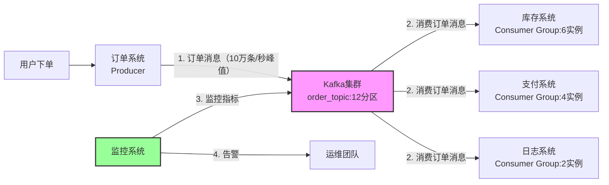

# 一、认知定位（Why & What）
## 1. 背景与起源
### 1.1 诞生的驱动力
- **互联网数据爆发式增长**：2010年前后，互联网进入“海量数据”时代，用户行为日志、业务交易数据、系统监控数据等规模呈指数级上升，传统数据传输工具无法应对TB级甚至PB级的实时数据流转需求。
- **传统消息队列的技术瓶颈**：当时主流的消息队列（如ActiveMQ）存在明显短板——基于JMS规范设计，架构偏重“功能完备性”（如事务、复杂路由），但**吞吐量极低**（单节点每秒仅数千条消息）、**集群扩展性差**（扩容需重启服务）、**持久化能力弱**（依赖内存缓存，易丢失数据），无法满足高并发场景。
- **LinkedIn的业务刚性需求**：Kafka最初由LinkedIn内部团队开发，核心目标是解决两大场景痛点：
  1. **用户行为追踪**：需实时采集全球用户的点击、浏览、登录等行为数据，用于用户画像和推荐系统，要求低延迟、不丢数据。
  2. **系统日志聚合**：需统一收集多台服务器的日志数据（如Nginx日志、应用日志），用于监控和故障排查，要求高吞吐、支持海量存储。

### 1.2 解决的核心问题
- **海量数据的高效传输（高吞吐）**：通过“顺序磁盘IO”（消息写入时按顺序追加到日志文件，避免随机IO）、“批量发送/接收”（Producer批量打包消息，Consumer批量拉取消息）、“零拷贝”（利用OS内核优化，减少数据在内存与磁盘间的拷贝次数），将单节点吞吐量提升至**每秒数十万条消息**，远超传统MQ。
- **数据的可靠持久化**：消息默认持久化到磁盘（而非内存），且支持多副本（Replication）机制，即使单台Broker宕机，数据也能通过副本恢复，解决了“内存型MQ易丢失数据”的问题。
- **分布式架构的高可用**：基于ZooKeeper（早期）/Kafka自身（2.8+版本）实现集群协调，Broker节点无单点故障，任意节点下线不影响整体服务，满足生产环境“7×24小时”运行需求。
- **灵活的水平扩展**：支持Broker、Topic Partition的动态扩容，无需重启集群即可提升存储和处理能力，适配数据量增长的线性扩展需求。
- **实时数据处理的低延迟**：通过“拉模式”（Consumer主动拉取消息，而非Broker推送）减少消息堆积，配合分区并行处理，将端到端延迟控制在**毫秒级**，满足流处理（如实时计算、实时推荐）的时间要求。


## 2. 核心本质
### 2.1 核心抽象模型
Kafka的核心模型可简化为“**生产者- Broker - 消费者**”的三层架构，通过3个关键概念实现数据流转：
- **Topic（主题）**：数据的“分类标签”，Producer将消息发送到指定Topic，Consumer从指定Topic订阅消息，实现“生产者与消费者的解耦”（无需感知对方存在）。
- **Partition（分区）**：Topic的“并行化单元”，每个Topic会拆分为多个Partition（可配置），每个Partition是**有序、不可变的日志文件**（消息按写入顺序追加，不支持修改）；Partition的数量决定了Kafka的并行度（Producer可并行向不同Partition发消息，Consumer可并行从不同Partition拉消息）。
- **Broker（代理节点）**：Kafka集群的“存储节点”，每个Broker负责存储部分Topic的Partition（含副本），并提供“消息写入”和“消息读取”的接口；Broker集群无主从之分（早期依赖ZooKeeper选主，2.8+版本自研KRaft协议），共同承担数据存储和请求处理压力。

#### 核心模型简化图（Mermaid）


### 2.2 本质特性提炼
- **本质是“分布式日志系统”**：Kafka的核心并非“消息队列”，而是“基于分布式架构的日志存储与传输系统”——每个Partition本质是一份分布式日志，消息的“生产-存储-消费”过程，本质是“日志的写入-持久化-读取”过程；“消息队列”只是其应用场景之一，其更核心的价值是作为“实时数据的统一存储与流转中枢”。
- **基于“分区”的并行化设计**：Partition是Kafka实现高吞吐、高扩展的核心——通过Partition拆分，将单Topic的压力分散到多个Broker，同时让Producer和Consumer可并行操作不同Partition，从架构层面突破“单节点性能瓶颈”。
- **“推拉结合”的通信模式**：
  1. **Producer推模式**：主动将消息推送到Broker，避免Broker“轮询等待”，提升写入效率；
  2. **Consumer拉模式**：主动从Broker拉取消息，Consumer可根据自身处理能力控制拉取频率（如“处理完一批再拉取下一批”），避免“Broker推送过载导致Consumer崩溃”，更适配高并发场景。
- **基于“偏移量（Offset）”的消费进度管理**：每个Consumer（或Consumer Group）会记录自己在每个Partition上的“消费偏移量”（Offset）——即“已消费到日志的哪个位置”；通过Offset，Consumer可实现“断点续传”（重启后从上次消费位置继续）、“消息重放”（回退Offset重新消费历史消息）、“延迟消费”（指定Offset读取历史数据），极大提升了消费灵活性。


## 3. 定位与关系
### 3.1 在技术体系中的位置
Kafka在现代数据架构中扮演“**实时数据中枢**”的角色，核心定位有3类：
1. **实时数据管道（Data Pipeline）**：连接“数据源”与“数据处理系统”的桥梁——
   - 数据源：日志采集工具（如Flume、Filebeat）、业务系统（如Java应用、MySQL binlog）、IoT设备等，通过Producer将数据写入Kafka；
   - 数据处理系统：流处理引擎（如Flink、Spark Streaming）、实时数仓（如ClickHouse）、消息消费系统（如Java服务）等，通过Consumer从Kafka读取数据；
   - 作用：解耦数据源与处理系统，屏蔽不同系统的协议差异，实现“数据一次写入，多系统复用”。

2. **分布式消息中间件（Message Broker）**：替代传统MQ，用于“业务解耦”和“异步通信”——
   - 场景：订单系统生成订单后，无需同步调用库存系统、支付系统，只需将“订单创建”消息写入Kafka，其他系统订阅消息后异步处理；
   - 优势：相比RabbitMQ/ActiveMQ，在“高吞吐、海量存储”场景下更优，适合电商大促、直播弹幕等高频消息场景。

3. **流处理平台（Stream Processing Platform）**：通过内置的“Kafka Streams”组件，直接实现“实时流计算”——
   - 能力：支持消息过滤、聚合、关联（如“实时计算每小时的订单总额”），无需依赖外部流处理引擎；
   - 定位：作为“轻量级流处理方案”，补充Flink/Spark Streaming的场景（如简单计算场景，无需部署复杂集群）。


### 3.2 与同类技术的对比
选取当前市场占有率最高的3类消息中间件（RabbitMQ、RocketMQ、ActiveMQ），与Kafka从核心维度对比：

| 对比维度         | Kafka                                  | RabbitMQ                              | RocketMQ（阿里）                      | ActiveMQ                              |
|------------------|----------------------------------------|---------------------------------------|---------------------------------------|---------------------------------------|
| 设计目标         | 高吞吐、海量存储、实时流数据           | 低延迟、复杂路由、灵活消费            | 高吞吐、高可用、金融级稳定性          | 功能全面（支持JMS/XMPP）、兼容性强    |
| 吞吐量           | 极高（单节点数十万条/秒）              | 中等（单节点数万条/秒）               | 高（单节点十几万条/秒）               | 低（单节点数千条/秒）                 |
| 延迟             | 毫秒级（默认批量模式下）               | 微秒级（轻量级消息）                  | 毫秒级                                | 毫秒级（部分场景达秒级）              |
| 持久化能力       | 强（磁盘+多副本，支持数据长期存储）    | 中等（内存/磁盘可选，默认内存+持久化）| 强（磁盘+多副本，支持定时清理）       | 中等（支持持久化，但性能损耗大）      |
| 扩展性           | 强（动态扩Broker/Partition，无上限）   | 中等（扩节点需配置，有上限）          | 强（支持Broker动态扩容）              | 弱（扩节点需重启，兼容性差）          |
| 生态集成         | 极强（适配Flink/Spark/Elasticsearch等）| 较强（适配Spring/Java/.NET，生态较老）| 较强（适配阿里系产品，国内生态完善）  | 中等（适配传统企业级应用，生态衰退）  |
| 适用场景         | 日志聚合、实时流计算、高吞吐消息       | 实时通信（如IM）、低延迟通知          | 电商交易、金融支付、国内企业级场景    | 传统企业应用（如OA系统）、兼容性需求  |
| 关系（替代/互补）| 替代：在高吞吐场景替代ActiveMQ；<br>互补：在低延迟场景与RabbitMQ互补 | 替代：无（低延迟场景不可替代）；<br>互补：与Kafka在不同延迟/吞吐场景互补 | 替代：国内场景下可替代Kafka（生态适配性）；<br>竞争：功能重叠度高，属直接竞争关系 | 替代：基本被Kafka/RocketMQ替代；<br>淘汰：市场份额持续下降 |


#### 关键结论
- **Kafka vs RabbitMQ**：非“替代关系”，而是“场景互补”——Kafka胜在“高吞吐、海量存储”，RabbitMQ胜在“低延迟、复杂路由”；例如：直播平台的“弹幕消息”用Kafka（高吞吐），“用户登录通知”用RabbitMQ（低延迟）。
- **Kafka vs RocketMQ**：“直接竞争关系”，功能重叠度高——RocketMQ在国内生态（如阿里云、Spring Cloud Alibaba）更适配，Kafka在国际生态（如Flink/Spark）更成熟；金融场景优先选RocketMQ（稳定性验证更充分），开源跨平台场景优先选Kafka。
- **Kafka vs ActiveMQ**：“完全替代关系”——ActiveMQ在吞吐量、扩展性、性能上全面落后，当前仅在传统企业的老旧系统中使用，新系统已极少选型。

# 二、原理支撑（How - Theory）

## 1. 体系结构
### 1.1 核心组件
- **Producer（生产者）**：消息发送端，负责：
  - 消息序列化（如 StringSerializer、AvroSerializer）
  - 基于策略选择目标 Partition（轮询 / 哈希 / 自定义）
  - 重试机制（retries 配置）与确认机制（acks 配置）
- **Consumer（消费者）**：消息接收端，核心特性：
  - 隶属于 Consumer Group（CG），同 CG 内分区唯一分配
  - 管理消费偏移量（Offset），支持断点续传
  - 反序列化消息（对应 Producer 的序列化方式）
- **Broker（代理节点）**：集群存储节点，功能包括：
  - 存储 Topic 的 Partition（含主从副本）
  - 处理 Producer 写入与 Consumer 拉取请求
  - 参与副本同步与 Leader 选举
- **Topic（主题）**：消息逻辑分类容器，无物理存储，仅关联 Partition
- **Partition（分区）**：并行与存储的物理单元，特性：
  - 单分区内消息有序（Offset 递增）
  - 不可变（仅追加写入，不支持修改）
  - 分布式存储（副本跨 Broker 分布）
- **Replica（副本）**：Partition 的冗余副本，分两类：
  - Leader：处理读写请求，唯一写入入口
  - Follower：同步 Leader 日志，Leader 宕机后可晋升
- **ISR（In-Sync Replicas）**：与 Leader 保持同步的副本集合（延迟≤replica.lag.time.max.ms）
- **协调组件**：
  - 早期：ZooKeeper（存储元数据、选主、监控节点）
  - 2.8+：KRaft（内置集群协调，替代 ZooKeeper，减少依赖）

### 1.2 组件关系
- **Producer ↔ Broker**：Producer 通过元数据接口获取 Partition Leader 地址，直接向 Leader 发送消息
- **Consumer ↔ Broker**：Consumer 从 Coordinator（Broker 担任）获取分区分配结果，向 Leader 拉取消息
- **Replica ↔ Leader**：Follower 定时拉取 Leader 日志，同步完成后发送 ACK；Leader 维护 ISR 列表
- **协调组件 ↔ 其他组件**：存储 Topic/Partition 元数据，触发 Leader 选举与 Rebalance（分区重分配）

### 1.3 整体架构图（Mermaid）


## 2. 核心机制
### 2.1 调度机制
#### 2.1.1 Producer 分区分配策略（表格）
| 策略类型           | 逻辑                                 | 适用场景                        |
| -------------- | ---------------------------------- | --------------------------- |
| 轮询（RoundRobin） | 无 Key 时，按消息发送顺序轮询分配到所有 Partition   | 消息均匀分布，无顺序要求                |
| 哈希（Hash）       | 有 Key 时，对 Key 哈希后取模分配到固定 Partition | 同一 Key 消息需有序（如用户 ID→用户行为消息） |
| 自定义（Custom）    | 实现 Partitioner 接口，自定义分配逻辑          | 业务特殊需求（如按地区分配到指定 Partition） |

#### 2.1.2 Consumer 分区分配策略（表格）
| 策略类型       | 逻辑                                                     | 优缺点                               |
| ---------- | ------------------------------------------------------ | --------------------------------- |
| Range      | 按 Partition 序号分段，为每个 Consumer 分配连续分区（如 8 分区→2 消费者：4+4） | 优点：分区连续，便于管理；缺点：分区数不整除 CG 规模时分配不均 |
| RoundRobin | 遍历所有 Partition 与 Consumer，依次分配（如 8 分区→2 消费者：1+1 循环）    | 优点：分配均匀；缺点：跨 Topic 分配时可能混乱        |
| Sticky（粘性） | 优先保留原有分配，仅调整新增 / 下线分区，减少 Rebalance 影响                  | 优点：降低消费中断频率；缺点：逻辑较复杂              |

#### 2.1.3 副本同步机制（ISR）
1. Leader 接收 Producer 消息后，写入本地日志文件
2. Follower 按固定间隔（replica.fetch.interval.ms）向 Leader 发送拉取请求
3. Follower 将拉取的日志追加到本地，完成后向 Leader 发送 ACK
4. Leader 判断 Follower 同步延迟（当前时间 - 最后同步时间）≤replica.lag.time.max.ms，保留其在 ISR 中
5. 当 Leader 收到 ISR 中≥min.insync.replicas 个 ACK 后，标记消息为 “Committed”（可消费状态）

### 2.2 容错机制
#### 2.2.1 Leader 选举机制
- **触发条件**：Leader 宕机（Broker 离线）、Leader 网络分区（与 ISR 断开连接）
- **ZooKeeper 版本（≤2.7）**：
  1. Follower 监测到与 Leader 心跳超时（zookeeper.session.timeout.ms）
  2. Follower 向 ZooKeeper 写入 “/brokers/topics/[topic]/partitions/[partition]/leaders” 临时节点，发起选举
  3. 首个成功写入的 Follower 成为新 Leader，其他 Follower 更新 Leader 地址
- **KRaft 版本（≥2.8）**：
  1. Controller 节点（KRaft 集群的主节点）监测到 Leader 离线
  2. Controller 从 ISR 中选择 “最新同步偏移量最大” 的 Follower 作为新 Leader
  3. Controller 向所有 Broker 广播 Leader 变更通知，无需 ZooKeeper 交互

#### 2.2.2 Rebalance 机制（消费者分区重分配）
- **触发条件**：
  1. CG 内新增/下线 Consumer
  2. Topic 新增 Partition
  3. Consumer 主动离开 CG（如会话超时）
- **执行流程**：
  1. 触发 Rebalance 后，Coordinator 将 CG 标记为 “准备重分配” 状态
  2. 所有 Consumer 停止消费，提交当前 Offset
  3. Coordinator 基于分配策略（如 Range/Sticky）计算新的分区分配结果
  4. 向所有 Consumer 推送分配结果，Consumer 按新分配拉取消息
- **优化点**：使用 Sticky 策略减少分区变动，避免重复消费；开启 “增量 Rebalance”（Kafka 3.0+），仅调整变化部分

#### 2.2.3 数据容错保障
- **消息不丢失**：
  - Producer 端：acks=all（等待 ISR 全部确认）+ retries>0（重试失败请求）
  - Broker 端：开启副本（replication.factor≥3）+ min.insync.replicas≥2（至少 2 个副本确认）
  - Consumer 端：消费完成后提交 Offset（enable.auto.commit=false，手动提交）
- **消息不重复**：
  - 幂等性 Producer（enable.idempotence=true）：通过 Producer ID + 序列号避免重复写入
  - 消费端：业务层实现幂等处理（如基于消息 ID 去重）

## 3. 抽象建模
### 3.1 核心建模逻辑
Kafka 将 “实时数据流转” 问题抽象为 “分布式日志管理” 模型，核心映射关系如下：

#### 3.1.1 业务概念 → 技术模型（表格）
| 现实业务概念       | Kafka 技术模型                | 建模逻辑                                                                 |
| -------------- | ------------------------- | ---------------------------------------------------------------------- |
| 业务消息分类（如订单消息、日志消息） | Topic                     | 按业务维度聚合消息，解耦不同类型数据的生产与消费                              |
| 消息并行处理需求       | Partition                 | 将单 Topic 拆分为多个并行单元，突破单节点性能瓶颈，匹配 “并行计算” 需求              |
| 数据可靠性需求         | Replica + ISR             | 通过多副本冗余抽象 “数据备份”，用 ISR 抽象 “可用副本集合”，平衡可靠性与性能            |
| 消费进度跟踪           | Offset                    | 将 “已消费到哪条消息” 抽象为数字偏移量，简化进度管理，支持断点续传、消息重放          |
| 集群节点协调           | ZooKeeper/KRaft           | 抽象 “分布式一致性” 问题，通过第三方协调组件（或内置组件）管理元数据、选主、状态同步 |

### 3.2 关键抽象概念解析
- **日志条目（Log Entry）**：
  - 抽象：将业务消息（如 “订单创建” 事件）封装为 “日志条目”，包含 Offset、消息体、时间戳、键值对
  - 特性：不可变、有序，对应现实中 “日志记录不可篡改” 的特性
- **消费组（Consumer Group）**：
  - 抽象：将 “多个消费者共同消费一个 Topic” 的场景抽象为消费组，实现 “负载均衡” 与 “广播消费”
  - 逻辑：同 CG 内分区唯一分配（负载均衡），不同 CG 独立消费（广播）
- **控制器（Controller）**：
  - 抽象：在 KRaft 架构中，抽象 “集群管理者” 角色，统一处理 Leader 选举、分区变更、元数据同步
  - 作用：替代 ZooKeeper 的集中式协调功能，减少跨组件依赖

## 4. 流转逻辑
### 4.1 Producer 消息写入流程
#### 4.1.1 详细步骤
1. Producer 初始化时，向协调组件（ZooKeeper/KRaft）请求 Topic 的 Partition 元数据（含 Leader 地址）
2. Producer 根据分区策略（如 Hash）确定消息所属 Partition，获取该 Partition 的 Leader  Broker 地址
3. Producer 将消息批量打包（batch.size 配置），发送到 Leader Broker
4. Leader 接收消息后，写入本地日志文件（顺序追加，避免随机 IO）
5. Follower 定时拉取 Leader 日志，同步完成后向 Leader 发送 ACK
6. Leader 收到 ISR 中≥min.insync.replicas 个 ACK 后，向 Producer 返回 “写入成功” 响应
7. 若写入失败（如 Leader 宕机），Producer 按 retries 配置重试，重试时重新获取元数据（可能已选举新 Leader）

#### 4.1.2 写入流程图（Mermaid）


### 4.2 Consumer 消息消费流程
#### 4.2.1 详细步骤
1. Consumer 启动后，向 Coordinator（ Broker 节点，由 CG 哈希确定）发送 “加入 CG” 请求
2. Coordinator 检测到 CG 成员变化，触发 Rebalance，计算分区分配结果
3. Coordinator 向 Consumer 返回分配的 Partition 列表
4. Consumer 向目标 Partition 的 Leader Broker 发送拉取请求（指定拉取 Offset 与批量大小 fetch.min.bytes）
5. Leader Broker 从日志文件中读取对应 Offset 范围的消息，返回给 Consumer
6. Consumer 反序列化消息，执行业务逻辑
7. 业务处理完成后，Consumer 提交 Offset（自动提交：enable.auto.commit=true；手动提交：调用 commitSync()）
8. 重复步骤 4-7，持续拉取消息，直到 Consumer 停止或 Rebalance 触发

#### 4.2.2 消费流程图（Mermaid）


### 4.3 副本同步流转逻辑
#### 4.3.1 详细步骤
1. Leader 维护 ISR 列表，记录所有同步延迟≤replica.lag.time.max.ms 的 Follower
2. Follower 启动后，向 Leader 发送 “同步请求”，携带自身当前最大 Offset
3. Leader 对比 Follower 的 Offset 与自身最大 Offset，若存在差距，返回 “差距部分的日志数据”
4. Follower 接收日志数据，追加到本地日志文件，更新自身最大 Offset
5. Follower 向 Leader 发送 “同步确认”，携带更新后的 Offset
6. Leader 检查 Follower 的 Offset 是否追上自身（延迟≤阈值）：
   - 是：保留/加入 ISR 列表
   - 否：从 ISR 列表移除（若延迟超过阈值）
7. 当 Leader 收到新消息并写入日志后，主动通知 ISR 中的 Follower 有新数据待同步（优化机制，减少 Follower 轮询等待）

#### 4.3.2 副本同步流程图（Mermaid）


# 三、实践应用（How - Practice）

## 1. 基础操作
### 1.1 安装部署（单节点/集群）
#### 1.1.1 单节点部署（测试环境）
1. 环境准备：安装JDK 11+（Kafka 3.x+要求），配置`JAVA_HOME`环境变量
2. 下载安装包：从[Kafka官方地址](https://kafka.apache.org/downloads)下载稳定版（如3.6.0），解压到目标目录（如`/opt/kafka`）
3. 核心配置（修改`config/server.properties`）：
   - `broker.id=0`（单节点设为0，集群需唯一）
   - `listeners=PLAINTEXT://:9092`（监听端口，默认9092）
   - `log.dirs=/opt/kafka/logs`（日志存储路径，避免磁盘空间不足）
   - `zookeeper.connect=localhost:2181`（若用ZooKeeper，需先启动ZooKeeper；KRaft模式无需此配置）
4. 启动服务：
   - 若用ZooKeeper：先启动ZooKeeper（`bin/zookeeper-server-start.sh config/zookeeper.properties`）
   - 启动Kafka：`bin/kafka-server-start.sh config/server.properties`（后台启动加`-daemon`参数）
5. 验证：执行`bin/kafka-topics.sh --list --bootstrap-server localhost:9092`，无报错则部署成功

#### 1.1.2 3节点集群部署（生产环境）
1. 节点规划（3台服务器，IP分别为192.168.1.101/102/103）：
   - 101：broker.id=1，listeners=PLAINTEXT://192.168.1.101:9092
   - 102：broker.id=2，listeners=PLAINTEXT://192.168.1.102:9092
   - 103：broker.id=3，listeners=PLAINTEXT://192.168.1.103:9092
2. 统一配置（每台节点`server.properties`）：
   - `zookeeper.connect=192.168.1.101:2181,192.168.1.102:2181,192.168.1.103:2181`（ZooKeeper集群）
   - `default.replication.factor=3`（默认副本数，与节点数一致）
   - `min.insync.replicas=2`（最小同步副本数，保证可靠性）
3. 启动：依次在3台节点启动ZooKeeper和Kafka，验证集群状态（`bin/kafka-topics.sh --describe --bootstrap-server 192.168.1.101:9092 --topic test`）

### 1.2 核心配置（生产必调参数）
| 配置项                  | 用途说明                                  | 生产建议值       | 风险点                  |
|-----------------------|---------------------------------------|-------------|-----------------------|
| `log.retention.hours` | 日志留存时间（超过自动删除）                      | 72（3天）   | 设过长导致磁盘占满          |
| `log.segment.bytes`   | 单个日志段大小（达到后滚动生成新段）                 | 1GB         | 设过小导致文件过多，IO频繁    |
| `message.max.bytes`   | 单条消息最大大小（Producer发送消息不能超过）          | 10485760（10MB） | 设过小导致大消息发送失败      |
| `replica.fetch.max.bytes` | Follower拉取Leader日志的最大字节数           | 15728640（15MB） | 需大于`message.max.bytes`  |
| `acks`                | Producer消息确认机制（默认1，集群建议all）         | all         | 设为0/1可能导致消息丢失      |
| `retries`             | Producer发送失败重试次数                      | 3           | 设为0可能丢失临时网络故障的消息 |
| `group.initial.rebalance.delay.ms` | Consumer加入CG后延迟Rebalance时间       | 3000（3秒） | 设过短导致频繁Rebalance     |

### 1.3 核心API（Java示例）
#### 1.3.1 Producer API（消息发送）
```java
import org.apache.kafka.clients.producer.*;
import java.util.Properties;

public class KafkaProducerDemo {
    public static void main(String[] args) {
        // 1. 配置Producer参数
        Properties props = new Properties();
        props.put(ProducerConfig.BOOTSTRAP_SERVERS_CONFIG, "192.168.1.101:9092,192.168.1.102:9092");
        props.put(ProducerConfig.KEY_SERIALIZER_CLASS_CONFIG, "org.apache.kafka.common.serialization.StringSerializer");
        props.put(ProducerConfig.VALUE_SERIALIZER_CLASS_CONFIG, "org.apache.kafka.common.serialization.StringSerializer");
        props.put(ProducerConfig.ACKS_CONFIG, "all"); // 集群环境保证可靠性
        props.put(ProducerConfig.RETRIES_CONFIG, 3); // 重试3次

        // 2. 创建Producer实例
        try (Producer<String, String> producer = new KafkaProducer<>(props)) {
            // 3. 发送消息（同步/异步）
            // 异步发送（带回调，推荐生产使用）
            ProducerRecord<String, String> record = new ProducerRecord<>("order_topic", "order_1001", "{'orderId':'1001','amount':99.9}");
            producer.send(record, (metadata, exception) -> {
                if (exception == null) {
                    System.out.printf("发送成功：topic=%s, partition=%d, offset=%d%n",
                            metadata.topic(), metadata.partition(), metadata.offset());
                } else {
                    System.err.println("发送失败：" + exception.getMessage());
                }
            });
            // 同步发送（阻塞等待结果，适合关键消息）
            // RecordMetadata metadata = producer.send(record).get();
        } catch (Exception e) {
            e.printStackTrace();
        }
    }
}
```

#### 1.3.2 Consumer API（消息消费）
```java
import org.apache.kafka.clients.consumer.*;
import java.time.Duration;
import java.util.Collections;
import java.util.Properties;

public class KafkaConsumerDemo {
    public static void main(String[] args) {
        // 1. 配置Consumer参数
        Properties props = new Properties();
        props.put(ConsumerConfig.BOOTSTRAP_SERVERS_CONFIG, "192.168.1.101:9092,192.168.1.102:9092");
        props.put(ConsumerConfig.GROUP_ID_CONFIG, "inventory_group"); // 消费组ID，同一组共享分区
        props.put(ConsumerConfig.KEY_DESERIALIZER_CLASS_CONFIG, "org.apache.kafka.common.serialization.StringDeserializer");
        props.put(ConsumerConfig.VALUE_DESERIALIZER_CLASS_CONFIG, "org.apache.kafka.common.serialization.StringDeserializer");
        props.put(ConsumerConfig.ENABLE_AUTO_COMMIT_CONFIG, "false"); // 关闭自动提交Offset，手动控制
        props.put(ConsumerConfig.AUTO_OFFSET_RESET_CONFIG, "earliest"); // 无Offset时从最开始消费

        // 2. 创建Consumer实例
        try (Consumer<String, String> consumer = new KafkaConsumer<>(props)) {
            // 3. 订阅Topic
            consumer.subscribe(Collections.singletonList("order_topic"));

            // 4. 循环拉取消息
            while (true) {
                ConsumerRecords<String, String> records = consumer.poll(Duration.ofMillis(100)); // 拉取超时时间
                for (ConsumerRecord<String, String> record : records) {
                    // 5. 执行业务逻辑（如库存扣减）
                    System.out.printf("消费消息：key=%s, value=%s, partition=%d, offset=%d%n",
                            record.key(), record.value(), record.partition(), record.offset());
                }
                // 6. 手动提交Offset（确保业务处理完成后提交，避免重复消费）
                consumer.commitSync(); // 同步提交，失败抛异常；异步提交用commitAsync()
            }
        }
    }
}
```


## 2. 典型案例
### 2.1 日志聚合（ELK+Kafka架构）
#### 2.1.1 案例背景
需求：收集100台应用服务器的Nginx日志和应用日志，实时展示并支持7天内查询，用于问题排查和流量分析。

#### 2.1.2 实现步骤
1. 部署Filebeat（日志采集端，每台应用服务器）：
   - 配置`filebeat.yml`，指定日志路径（如`/var/log/nginx/access.log`、`/opt/app/logs/app.log`）
   - 输出端设为Kafka：`output.kafka: hosts: ["192.168.1.101:9092"]; topic: "log_topic"`
   - 启动Filebeat：`./filebeat -e -c filebeat.yml`

2. 创建Kafka Topic（日志存储）：
   - 执行命令：`bin/kafka-topics.sh --create --bootstrap-server 192.168.1.101:9092 --topic log_topic --partitions 6 --replication-factor 3`
   - 说明：6个分区（匹配Filebeat实例数，提升并行度），3个副本（保证可靠性）

3. 部署Logstash（日志处理）：
   - 配置`logstash.conf`，输入源为Kafka，输出到Elasticsearch：
     ```conf
     input {
       kafka {
         bootstrap_servers => "192.168.1.101:9092"
         topics => ["log_topic"]
         group_id => "logstash_group"
         codec => "json"
       }
     }
     filter {
       # 解析Nginx日志（按格式提取字段：ip、time、url等）
       if [source] =~ "nginx" {
         grok { match => { "message" => "%{IPORHOST:client_ip} - %{USER:user} \[%{HTTPDATE:log_time}\] \"%{WORD:method} %{URIPATHPARAM:url} HTTP/%{NUMBER:http_version}\" %{NUMBER:status} %{NUMBER:bytes_sent}" } }
       }
     }
     output {
       elasticsearch { hosts => ["192.168.1.104:9200"]; index => "log-%{+YYYY.MM.dd}" }
     }
     ```
   - 启动Logstash：`./bin/logstash -f config/logstash.conf`

4. 部署Elasticsearch+Kibana（存储与展示）：
   - 启动Elasticsearch集群（至少3节点，确保数据分片）
   - 配置Kibana连接Elasticsearch，创建索引模式`log-*`，制作日志仪表盘（如流量趋势图、错误状态码统计）

#### 2.1.3 架构流程图（Mermaid）


### 2.2 业务解耦（订单-库存系统异步通信）
#### 2.2.1 案例背景
需求：电商下单流程中，订单创建后需通知库存系统扣减库存，避免订单系统与库存系统强耦合（如库存系统故障导致订单创建失败）。

#### 2.2.2 实现步骤
1. 创建Kafka Topic（订单消息通道）：
   - 命令：`bin/kafka-topics.sh --create --bootstrap-server 192.168.1.101:9092 --topic order_topic --partitions 4 --replication-factor 3`
   - 分区策略：按`orderId`哈希分配（确保同一订单的消息在同一分区，避免乱序）

2. 订单系统（Producer）改造：
   - 订单创建成功后，调用Producer API发送“订单创建”消息（含`orderId`、`productId`、`quantity`）
   - 关键配置：`acks=all`（确保消息不丢失）、`retries=3`（应对临时网络故障）

3. 库存系统（Consumer）改造：
   - 部署2个Consumer实例（同属`inventory_group`），并行消费`order_topic`（4个分区→2个实例各分配2个分区）
   - 业务逻辑：
     1. 消费消息，查询数据库确认订单状态（避免重复扣减）
     2. 扣减对应商品库存（开启数据库事务）
     3. 扣减成功后，手动提交Offset；失败则抛出异常，Consumer重试（或发送到死信队列）

4. 死信队列处理（异常兜底）：
   - 创建死信Topic：`order_dead_topic`（用于存储扣减失败的消息）
   - 库存系统消费失败时，将消息转发到死信Topic，后续通过定时任务重试或人工处理

#### 2.2.2 流程解析
- 解耦价值：订单系统无需等待库存系统响应，同步转异步，提升下单接口吞吐量（TPS从500→2000+）
- 可靠性保障：Kafka消息持久化+手动提交Offset，避免库存扣减成功但消息未确认导致的重复扣减


## 3. 问题诊断
### 3.1 常见错误与解决方案（表格）
| 错误现象                          | 根因分析                                  | 解决方案                                  | 验证方法                                  |
|-------------------------------|---------------------------------------|---------------------------------------|---------------------------------------|
| Producer发送消息抛`TimeoutException` | 1. Broker负载过高（CPU/IO满）<br>2. 网络延迟/分区<br>3. 消息体过大（超过`message.max.bytes`） | 1. 扩容Broker节点，优化日志存储磁盘（用SSD）<br>2. 检查网络，增加`request.timeout.ms`（如5000）<br>3. 拆分大消息或调大`message.max.bytes` | 1. 查看Broker监控（CPU/IO使用率）<br>2. 执行`ping`/`telnet`测试网络<br>3. 检查Producer日志的消息大小 |
| Consumer频繁Rebalance          | 1. Consumer会话超时（`session.timeout.ms`过短）<br>2. Consumer处理消息耗时过长（超过`max.poll.interval.ms`）<br>3. CG内Consumer频繁上下线 | 1. 调大`session.timeout.ms`（如10000）<br>2. 减少单次拉取消息数（调小`max.poll.records`）或优化业务逻辑<br>3. 排查Consumer节点故障（如内存溢出） | 1. 查看Consumer日志的`Rebalance`关键字<br>2. 用`kafka-consumer-groups.sh`查看CG状态 |
| 消息丢失（Producer发送成功但Consumer未消费到） | 1. Producer `acks=0/1`，Leader宕机未同步到Follower<br>2. Consumer自动提交Offset（`enable.auto.commit=true`），业务未处理完就提交<br>3. Topic副本数不足（`replication-factor=1`） | 1. 设`acks=all`+`min.insync.replicas=2` <br>2. 关闭自动提交，业务处理完手动提交<br>3. 重建Topic并设`replication-factor≥3` | 1. 查看Producer日志的`acks`配置<br>2. 检查Consumer提交逻辑<br>3. 用`kafka-topics.sh --describe`查看副本数 |
| Broker宕机后数据无法恢复        | 1. ISR列表为空（所有Follower同步延迟超阈值）<br>2. `unclean.leader.election.enable=true`（非ISR副本成为Leader，丢失数据） | 1. 调大`replica.lag.time.max.ms`（如10000），确保Follower不轻易退出ISR<br>2. 设`unclean.leader.election.enable=false`（禁止非ISR副本选主） | 1. 查看Broker日志的`ISR`相关记录<br>2. 检查`server.properties`配置 |

### 3.2 工具辅助诊断
#### 3.2.1 命令行工具
- 查看Topic详情：`bin/kafka-topics.sh --describe --bootstrap-server 192.168.1.101:9092 --topic order_topic`（查看分区、副本、ISR）
- 查看消费组Offset：`bin/kafka-consumer-groups.sh --describe --bootstrap-server 192.168.1.101:9092 --group inventory_group`（重点看`LAG`，即未消费消息数）
- 生产测试消息：`bin/kafka-console-producer.sh --bootstrap-server 192.168.1.101:9092 --topic test_topic`（验证Producer链路）
- 消费测试消息：`bin/kafka-console-consumer.sh --bootstrap-server 192.168.1.101:9092 --topic test_topic --from-beginning`（验证Consumer链路）

#### 3.2.2 监控工具
- 内置JMX监控：通过JConsole连接Broker的JMX端口（默认9999），查看关键指标（如`kafka.server:type=BrokerTopicMetrics,name=MessagesInPerSec`（消息写入速率））
- Prometheus+Grafana：部署`kafka-exporter`暴露指标，配置Grafana仪表盘（推荐使用官方模板ID：7589），监控：
  - Broker：消息吞吐量、分区Leader分布、ISR收缩次数
  - Consumer：消费Lag（ Lag>1000需告警）、Rebalance次数


## 4. 场景扩展
### 4.1 流处理集成（Kafka Streams/Flink）
#### 4.1.1 Kafka Streams（轻量级流处理）
- 适用场景：简单流计算（如实时统计订单金额、过滤无效消息）
- 示例：实时计算`order_topic`中每小时的订单总额：
  ```java
  import org.apache.kafka.streams.KafkaStreams;
  import org.apache.kafka.streams.StreamsBuilder;
  import org.apache.kafka.streams.StreamsConfig;
  import org.apache.kafka.streams.kstream.KStream;
  import org.apache.kafka.streams.kstream.TimeWindows;
  import java.time.Duration;
  import java.util.Properties;

  public class OrderAmountStream {
      public static void main(String[] args) {
          Properties props = new Properties();
          props.put(StreamsConfig.APPLICATION_ID_CONFIG, "order-amount-stream");
          props.put(StreamsConfig.BOOTSTRAP_SERVERS_CONFIG, "192.168.1.101:9092");
          props.put(StreamsConfig.DEFAULT_KEY_SERDE_CLASS_CONFIG, "org.apache.kafka.common.serialization.Serdes$StringSerde");
          props.put(StreamsConfig.DEFAULT_VALUE_SERDE_CLASS_CONFIG, "org.apache.kafka.common.serialization.Serdes$StringSerde");

          StreamsBuilder builder = new StreamsBuilder();
          KStream<String, String> orderStream = builder.stream("order_topic");
          // 1. 解析订单金额，按小时窗口聚合
          orderStream
              .mapValues(value -> { // 从消息中提取金额（假设value是JSON格式）
                  String amountStr = value.split(",")[1].split(":")[1];
                  return Double.parseDouble(amountStr);
              })
              .groupByKey()
              .windowedBy(TimeWindows.of(Duration.ofHours(1)))
              .sum() // 累加每小时金额
              .toStream()
              .mapValues(sum -> "小时订单总额：" + sum)
              .to("order_amount_topic"); // 输出到结果Topic

          KafkaStreams streams = new KafkaStreams(builder.build(), props);
          streams.start();
      }
  }
  ```

#### 4.1.2 Flink集成（复杂实时计算）
- 适用场景：需关联多Topic数据（如订单+用户信息）、复杂聚合（如滑动窗口）
- 核心步骤：
  1. 引入Flink-Kafka依赖（`flink-connector-kafka`）
  2. 用`FlinkKafkaConsumer`读取`order_topic`和`user_topic`
  3. 基于`userId`关联两流数据，计算“用户每小时下单金额”
  4. 输出结果到Elasticsearch或Kafka

### 4.2 多集群同步（灾备/跨地域）
- 需求：北京集群（生产）与上海集群（灾备）实时同步数据，北京集群故障时可切换到上海集群。
- 实现方案：使用Kafka MirrorMaker2（官方工具，支持跨集群同步）
- 配置步骤：
  1. 编写`mm2.properties`：
     ```properties
     # 源集群（北京）和目标集群（上海）
     clusters=beijing,shanghai
     beijing.bootstrap.servers=192.168.1.101:9092,192.168.1.102:9092
     shanghai.bootstrap.servers=192.168.2.101:9092,192.168.2.102:9092
     # 同步所有Topic
     beijing->shanghai.topics=.*
     # 同步消费组Offset（确保切换后消费进度不丢失）
     beijing->shanghai.groups=.*
     ```
  2. 启动MirrorMaker2：`bin/connect-mirror-maker.sh config/mm2.properties`
- 验证：在上海集群执行`kafka-topics.sh --list`，查看是否同步北京集群的Topic，消费同步后的消息确认数据一致。

### 4.3 监控告警体系（生产稳定性保障）
- 核心指标（需配置告警阈值）：
  | 指标类型       | 关键指标                                  | 告警阈值                | 告警方式（邮件/钉钉）          |
  |------------|---------------------------------------|---------------------|-------------------------|
  | Broker指标   | 1. 消息写入失败率<br>2. 分区Leader离线数<br>3. 磁盘使用率 | 1. >0.1%<br>2. >0<br>3. >85% | 1. 立即告警<br>2. 立即告警<br>3. 预警（>85%）+ 紧急（>90%） |
  | Consumer指标 | 1. 消费Lag（未消费消息数）<br>2. Rebalance频率 | 1. >1000<br>2. >5次/小时 | 1. 预警（>1000）+ 紧急（>5000）<br>2. 立即告警 |
- 实现工具：Prometheus（采集指标）+ Grafana（可视化）+ Alertmanager（告警分发）

# 四、深度进阶（Mastery）

## 1. 性能优化
### 1.1 瓶颈分析（生产高频瓶颈）
- **磁盘IO瓶颈**：
  - 表现：Broker磁盘写入/读取耗时>50ms，消息吞吐量上不去，Producer出现`TimeoutException`
  - 根因：1. 用HDD硬盘（随机IO性能差）；2. 日志段过小（`log.segment.bytes`设为100MB以下，导致频繁滚动生成小文件）；3. 磁盘空间不足（使用率>90%，触发IO限流）
- **网络瓶颈**：
  - 表现：Broker网卡流量跑满（接近网卡带宽上限），Consumer拉取消息延迟>100ms
  - 根因：1. 单Topic分区数过少（并行度不足，集中在少数Broker）；2. 未开启批量传输（Producer`batch.size`过小，单条消息频繁发送）；3. 副本同步流量过大（`replication.factor`设为5+，非必要冗余）
- **内存瓶颈**：
  - 表现：Broker JVM频繁Full GC（间隔<5分钟），Consumer频繁OOM
  - 根因：1. Broker`heap.size`设过小（默认1G，生产需4-8G）；2. Consumer`fetch.max.bytes`过大（单次拉取超内存）；3. 日志缓存未合理利用（`log.cleaner.dedupe.buffer.size`不足，导致清理效率低）
- **CPU瓶颈**：
  - 表现：Broker CPU使用率>80%，消息序列化/反序列化耗时增加
  - 根因：1. 启用复杂压缩算法（如GZIP，CPU消耗高于Snappy）；2. Consumer业务逻辑与消息消费在同一线程（未异步处理）；3. 频繁Rebalance（CG内Consumer不稳定，反复计算分区分配）

### 1.2 针对性调优策略
#### 1.2.1 磁盘IO优化
1. **硬件选型**：生产环境优先用SSD（随机IO吞吐量是HDD的10-20倍），单盘容量建议1-2TB（避免单盘故障影响过大）
2. **日志配置优化**：
   - 调大`log.segment.bytes`至1-2GB（减少文件滚动频率，提升顺序IO占比）
   - 启用日志清理（`log.cleanup.policy=compact`，针对Key重复的消息，保留最新值，减少存储占用）
   - 分散日志存储路径（`log.dirs=/data1/kafka/logs,/data2/kafka/logs`，利用多块磁盘并行IO）
3. **磁盘监控**：配置磁盘使用率告警（阈值85%），定期清理过期日志（结合`log.retention.hours`，避免手动删除）

#### 1.2.2 网络优化
1. **分区并行度调整**：
   - 计算公式：分区数=（目标吞吐量/单分区最大吞吐量）×1.2（预留20%冗余）；例：目标10万条/秒，单分区最大2万条/秒→分区数=10万/2万×1.2=6
   - 动态扩容分区（`kafka-topics.sh --alter --topic test --partitions 12`，注意：分区数只能增不能减）
2. **批量传输优化**：
   - Producer：`batch.size=16384`（16KB，默认16KB，可增至32KB）+ `linger.ms=5`（等待5ms凑满批量，平衡延迟与吞吐量）
   - Consumer：`fetch.min.bytes=16384`（单次拉取至少16KB数据，减少请求次数）+ `fetch.max.wait.ms=500`（最多等500ms，避免无限等待）
3. **副本流量控制**：
   - 非核心Topic设`replication.factor=2`（减少同步流量），核心Topic（如订单）设3
   - 调优`replica.fetch.backoff.ms=100`（Follower拉取失败后重试间隔，避免频繁重试占用网络）

#### 1.2.3 内存与CPU优化
1. **Broker内存配置**：
   - JVM堆大小：`export KAFKA_HEAP_OPTS="-Xms4g -Xmx4g"`（不超过物理内存的50%，避免OS内存不足）
   - 日志缓存：`log.cleaner.dedupe.buffer.size=1g`（提升日志清理效率，减少CPU消耗）
2. **Consumer线程模型优化**：
   - 采用“消费-处理”分离线程：Consumer线程仅拉取消息，放入阻塞队列，业务线程从队列取消息处理（避免消费线程被业务逻辑阻塞，导致Rebalance）
   - 控制单次拉取消息数（`max.poll.records=500`，避免单次拉取过多导致OOM）
3. **压缩算法选择**：
   - 优先用Snappy（CPU消耗低，压缩比适中），禁用GZIP（CPU消耗高，仅在网络带宽极紧张时用）；配置：`compression.type=snappy`

### 1.3 最佳参数配置表（生产验证）
| 组件    | 配置项                          | 作用                                  | 生产建议值       | 注意事项                                  |
|-------|-------------------------------|-------------------------------------|-------------|---------------------------------------|
| Broker | `listeners`                   | 监听地址（区分内网/外网）                    | `INTERNAL://:9092,EXTERNAL://:9093` | 需配置`listener.security.protocol.map`映射协议 |
| Broker | `num.network.threads`         | 处理网络请求的线程数                       | 8（CPU核心数×1.5） | 过多会导致线程上下文切换频繁                   |
| Broker | `num.io.threads`              | 处理磁盘IO的线程数                        | 16（CPU核心数×2）  | 需与磁盘数量匹配，避免IO线程不足                |
| Producer | `acks`                        | 消息确认机制                            | `all`       | 核心Topic必设all，非核心可设1                  |
| Producer | `enable.idempotence`          | 幂等性（避免重复发送）                      | `true`      | 开启后`retries`默认3，`acks`自动设all          |
| Consumer | `session.timeout.ms`          | 会话超时（触发Rebalance）                  | 10000       | 需大于`max.poll.interval.ms`的1/3             |
| Consumer | `max.poll.interval.ms`        | 两次拉取间隔（超过触发Rebalance）            | 30000       | 业务处理耗时需小于此值，否则拆分业务逻辑          |


## 2. 稳健性设计
### 2.1 容错机制深化（超越基础）
#### 2.1.1 副本容错细粒度控制
- **ISR动态调整策略**：
  - 避免ISR频繁收缩：调大`replica.lag.time.max.ms=10000`（默认10s，Follower延迟超10s才退出ISR），减少非必要的Leader选举
  - ISR为空保护：`unclean.leader.election.enable=false`（禁止非ISR副本成为Leader，宁可服务不可用也不丢失数据；核心Topic必设，非核心可设true）
- **副本分布优化**：
  - 开启机架感知（`broker.rack=rack1`，每个Broker配置机架信息），Kafka自动将副本分配到不同机架，避免机架断电导致全副本丢失
  - 手动调整副本：`kafka-reassign-partitions.sh`（针对异常分布的副本，如某Broker副本数过多，手动迁移）

#### 2.1.2 消息投递语义保障
- **Exactly-Once（精确一次）实现**：
  1. Producer端：开启幂等性（`enable.idempotence=true`）+ 事务（`transactional.id=prod-1`），确保消息不重复、不丢失
  2. Consumer端：事务消费（`isolation.level=read_committed`），只消费已提交的事务消息，避免消费到事务回滚的消息
  3. 流程示例：Producer开启事务→发送消息→执行业务逻辑→提交事务；若业务失败，回滚事务，Consumer看不到该消息

### 2.2 高可用架构方案（生产级）
#### 2.2.1 KRaft架构 vs ZooKeeper架构（对比选型）
| 维度         | ZooKeeper架构（≤2.7）               | KRaft架构（≥3.0稳定）                | 选型建议                          |
|------------|-----------------------------------|-----------------------------------|-------------------------------|
| 依赖         | 需独立部署ZooKeeper集群（3-5节点）        | 无依赖（内置Controller节点）              | 新集群优先选KRaft，减少运维成本          |
| 性能         | 元数据操作延迟高（依赖ZooKeeper网络开销）      | 元数据本地处理，延迟降低50%+               | 高并发场景（如每秒万级Topic创建）选KRaft   |
| 扩展性       | ZooKeeper集群扩容复杂，有性能上限           | Controller集群支持动态扩容，无明显上限        | 大规模集群（Broker>100）选KRaft          |
| 运维复杂度    | 需维护两套集群（Kafka+ZooKeeper）          | 仅维护Kafka集群，配置简化                | 中小团队优先选KRaft，减少运维压力          |
| 兼容性       | 支持所有Kafka特性，生态成熟              | 3.0后支持所有特性，部分老工具需升级（如kafka-manager） | 若用老工具且无法升级，暂用ZooKeeper，逐步迁移 |

#### 2.2.2 KRaft架构部署关键配置
1. **Controller节点规划**：
   - 3个Controller节点（奇数，确保选主），配置`process.roles=controller,broker`（同时作为Broker，减少节点数；也可单独部署Controller）
   - 普通Broker节点：`process.roles=broker`
2. **核心配置**：
   - `controller.quorum.voters=1@192.168.1.101:9093,2@192.168.1.102:9093,3@192.168.1.103:9093`（Controller节点列表，格式：nodeId@host:port）
   - `listeners=PLAINTEXT://:9092,CONTROLLER://:9093`（区分业务监听端口和Controller通信端口）
   - `controller.listener.names=CONTROLLER`（指定Controller通信监听名）
3. **初始化集群**：生成集群ID（`kafka-storage.sh random-uuid`）→ 格式化存储（`kafka-storage.sh format -t <uuid> -c server.properties`）→ 启动所有节点

### 2.3 灾备与故障切换
#### 2.3.1 跨地域灾备方案（两种主流）
| 方案         | 实现方式                                  | 优势                                  | 劣势                                  | 适用场景                          |
|------------|---------------------------------------|-------------------------------------|-------------------------------------|-------------------------------|
| MirrorMaker2 | 官方工具，部署在目标集群，拉取源集群Topic数据并写入目标集群 | 1. 支持Topic、消费组Offset同步；2. 自动创建目标Topic；3. 支持故障自动重试 | 1. 同步延迟较高（秒级）；2. 不支持双向同步 | 跨城市灾备（如北京→上海），对延迟要求不高    |
| 双活集群（自定义） | 1. 源/目标集群互相同步；2. Producer双写（或用路由层）；3. Consumer跨集群消费 | 1. 同步延迟低（毫秒级）；2. 支持双向业务读写 | 1. 需自定义开发路由层；2. 数据一致性维护复杂 | 核心业务双活（如金融交易），对延迟和可用性要求极高 |

#### 2.3.2 故障切换步骤（MirrorMaker2方案）
1. **故障检测**：
   - 监控源集群Broker存活状态（如北京集群Broker离线数>1/2）
   - 监控同步延迟（目标集群消费Lag>1000，说明同步异常）
2. **切换执行**：
   1. 停止源集群Producer（避免新消息写入）
   2. 等待目标集群同步完源集群剩余消息（Lag=0）
   3. 修改业务配置：将Producer和Consumer的`bootstrap.servers`切换为目标集群地址（如上海集群）
   4. 启动Producer，验证消息写入目标集群；启动Consumer，验证消费Offset正确（基于同步的消费组Offset）
3. **回切步骤**：
   - 源集群恢复后，启动MirrorMaker2反向同步（上海→北京）
   - 同步完成后，按上述步骤切回源集群


## 3. 本源探究
### 3.1 核心源码解析（面试高频模块）
#### 3.1.1 Producer发送消息核心流程（基于Kafka 3.5）
- **关键类**：`org.apache.kafka.clients.producer.KafkaProducer`、`org.apache.kafka.clients.producer.internals.Sender`
- **流程源码拆解**：
  1. **消息发送入口（KafkaProducer.send()）**：
     ```java
     public Future<RecordMetadata> send(ProducerRecord<K, V> record, Callback callback) {
         // 1. 序列化Key和Value
         Serializer<K> keySerializer = this.keySerializer;
         Serializer<V> valueSerializer = this.valueSerializer;
         try {
             byte[] serializedKey = keySerializer.serialize(record.topic(), record.headers(), record.key());
             byte[] serializedValue = valueSerializer.serialize(record.topic(), record.headers(), record.value());
             // 2. 计算目标Partition（调用Partitioner）
             int partition = partition(record, serializedKey, serializedValue, metadata.fetch());
             // 3. 将消息放入RecordAccumulator（消息累加器，批量存储）
             return doSend(record, callback, serializedKey, serializedValue, partition);
         } catch (Exception e) {
             // 异常处理（如序列化失败）
             callback.onCompletion(null, e);
             return new FailedFuture(e);
         }
     }
     ```
  2. **消息批量发送（Sender.run()）**：
     - Sender是独立线程，循环执行`runOnce()`：
       - 从RecordAccumulator中获取可发送的批量消息（`accumulator.drain()`）
       - 向Broker发送请求（`client.send()`）
       - 处理Broker响应（成功则更新Offset，失败则重试）
  3. **重试机制（Retry机制）**：
     - 触发条件：网络异常、Leader不可用、ISR不足（`acks=all`时）
     - 重试控制：`retries`配置重试次数，`retry.backoff.ms`配置重试间隔；开启幂等性后，通过`ProducerId`和`SequenceNumber`避免重复发送

#### 3.1.2 Leader选举核心逻辑（KRaft架构）
- **关键类**：`org.apache.kafka.controller.QuorumController`、`org.apache.kafka.server.common.LeaderRecoveryState`
- **选举流程**：
  1. **Controller选主**：
     - 基于Raft协议，Controller节点投票选举Leader（获得过半数投票的节点成为Leader）
     - Leader负责管理全集群元数据（Topic、Partition、副本）
  2. **Partition Leader选举**：
     ```java
     // 简化逻辑：从ISR中选择最新同步的副本
     private Optional<Integer> selectLeader(PartitionMetadata metadata) {
         List<Integer> isr = metadata.isr();
         if (isr.isEmpty()) {
             return Optional.empty(); // ISR为空，无法选举（若unclean开启则选非ISR）
         }
         // 选择Offset最大的副本（最同步的副本）
         int leaderId = -1;
         long maxOffset = -1;
         for (int replicaId : isr) {
             long replicaOffset = getReplicaHighWatermark(replicaId, metadata.partitionId());
             if (replicaOffset > maxOffset) {
                 maxOffset = replicaOffset;
                 leaderId = replicaId;
             }
         }
         return Optional.of(leaderId);
     }
     ```
  3. **选举通知**：Leader选举完成后，Controller向所有Broker发送`MetadataResponse`，更新副本角色（Leader/Follower）

### 3.2 设计思想溯源
- **日志追加模型**：借鉴自Google的《The Google File System》，将消息按顺序追加到日志文件（顺序IO性能是随机IO的100倍以上），同时通过日志段（Log Segment）拆分大文件，避免单个文件过大导致的IO效率下降
- **分区并行思想**：参考分布式数据库的分表分库设计，将Topic拆分为多个Partition，实现“数据分片+并行处理”，突破单节点性能瓶颈；同时，Partition的有序性（单分区内消息Offset递增）满足业务对“顺序消费”的需求（如订单状态变更）
- **副本容错设计**：源于分布式系统的“冗余容错”思想，通过多副本（Replication）实现数据备份，结合ISR机制平衡“可靠性”与“性能”（仅同步的副本参与投票，避免慢副本影响可用性）
- **无状态Consumer**：Consumer不依赖Broker存储消费进度，而是通过Offset自主管理，实现“消费端水平扩展”（新增Consumer无需Broker同步状态），同时支持“消息重放”（回退Offset重新消费），这一设计借鉴了分布式日志系统的“游标”思想


## 4. 版本与特性
### 4.1 主流版本差异（近5年关键版本）
| 版本号   | 发布时间   | 核心特性                                  | 兼容性说明                          | 生产推荐度 |
|-------|--------|---------------------------------------|-----------------------------------|-------|
| 2.8.x | 2021.06 | 1. KRaft架构预览（非稳定，不可用于生产）；2. 新增Topic创建限流 | 兼容2.7.x及以下版本，可平滑升级          | ★★☆☆☆（仅用于KRaft测试） |
| 3.0.x | 2021.09 | 1. KRaft架构稳定（生产可用）；2. 弃用对Java 8的支持（需Java 11+）；3. 移除旧版Consumer API | 1. 不兼容Java 8；2. 从2.8.x升级需先验证KRaft配置 | ★★★★☆（新集群首选，无Java 8依赖） |
| 3.2.x | 2022.06 | 1. 支持Tiered Storage（分层存储，冷数据存S3）；2. 新增Consumer组管理API；3. KRaft性能优化 | 兼容3.0.x，升级无感知                | ★★★★★（生产主流版本，支持分层存储） |
| 3.5.x | 2023.06 | 1. 支持KRaft动态添加Controller节点；2. 新增消息过滤API（Consumer端过滤）；3. 优化副本同步性能 | 兼容3.2.x，KRaft功能更完善            | ★★★★★（2024-2025推荐版本，适合大规模集群） |
| 3.7.x | 2024.06 | 1. 支持双向MirrorMaker2（双活同步）；2. 优化日志清理性能（减少CPU占用）；3. 新增Prometheus原生监控 | 兼容3.5.x，双活场景友好              | ★★★★☆（双活需求优先选，新特性需验证） |

### 4.2 关键特性演进（弃用与新增）
#### 4.2.1 弃用特性（需规避）
- **ZooKeeper依赖**：3.0.x后标记为“deprecated”，3.5.x后默认不启用，未来版本将完全移除；建议新集群直接用KRaft，老集群逐步迁移
- **Java 8支持**：3.0.x后弃用，需升级Java 11+；注意：Java 17也兼容，但部分老依赖（如旧版Spring）需适配
- **旧版Producer/Consumer API**：如`kafka.javaapi.producer.Producer`（2.0.x后弃用），需替换为`org.apache.kafka.clients.producer.KafkaProducer`

#### 4.2.2 新增核心特性（生产价值）
- **Tiered Storage（分层存储）**：
  - 功能：将冷数据（如超过30天的日志）自动迁移到低成本存储（如AWS S3、阿里云OSS），热数据保留在本地SSD
  - 配置：`log.tiered.storage.enable=true` + `log.tiered.storage.provider=org.apache.kafka.server.log.remote.storage.S3RemoteStorageProvider`
  - 价值：降低存储成本（本地SSD成本是S3的5-10倍），同时保留全量数据
- **KRaft动态Controller扩容**：
  - 功能：3.5.x后支持在线添加Controller节点（无需重启集群），解决KRaft集群扩容难题
  - 操作：`kafka-controller.sh --alter --add 4@192.168.1.104:9093`（添加nodeId=4的Controller节点）
- **消息过滤API**：
  - 功能：Consumer端可配置过滤规则（如按消息头、Key过滤），避免拉取无用消息，减少网络和内存消耗
  - 示例：
    ```java
    // 过滤Key为"test"的消息
    Consumer<String, String> consumer = new KafkaConsumer<>(props);
    consumer.subscribe(Collections.singletonList("test_topic"), new ConsumerRebalanceListener() {
        @Override
        public void onPartitionsAssigned(Collection<TopicPartition> partitions) {
            // 配置过滤规则
            Filter<String, String> filter = (record) -> !"test".equals(record.key());
            consumer.assign(partitions, filter);
        }
        // 其他方法省略...
    });
    ```


## 5. 生态与趋势
### 5.1 周边生态集成（全链路工具链）
| 生态类别   | 核心工具                                  | 功能用途                                  | 生产选型建议                          |
|--------|---------------------------------------|---------------------------------------|-----------------------------------|
| 数据采集    | Filebeat、Flume、Logstash               | 采集日志、业务数据到Kafka                   | 1. 日志采集优先Filebeat（轻量）；2. 复杂数据清洗用Logstash |
| 流处理     | Flink、Spark Streaming、Kafka Streams     | 实时计算（如实时统计、数据关联）                | 1. 低延迟（毫秒级）选Flink；2. 简单计算（如过滤）选Kafka Streams；3. Spark生态用户选Spark Streaming |
| 数据存储    | Elasticsearch、ClickHouse、Hive          | 存储Kafka输出的数据（日志、统计结果）            | 1. 日志查询选Elasticsearch；2. 实时分析（OLAP）选ClickHouse；3. 离线分析选Hive |
| 监控运维    | Prometheus+Grafana、Kafka UI、Confluent Control Center | 监控指标、管理Topic、查看消息                | 1. 开源选型：Prometheus+Grafana+Kafka UI；2. 商业支持选Confluent Control Center |
| 消息治理    | Schema Registry、Kafka Connect          | 1. 管理消息Schema（避免格式不兼容）；2. 数据同步（如Kafka→MySQL） | 1. 多系统集成必用Schema Registry；2. 数据同步用Kafka Connect（避免自定义开发） |

### 5.2 技术发展方向（短期/长期）
#### 5.2.1 短期趋势（1-2年）
- **KRaft深度优化**：
  - 目标：提升KRaft在超大规模集群（Broker>1000）的性能，优化元数据同步延迟（从100ms降至10ms内）
  - 影响：完全替代ZooKeeper，成为Kafka唯一协调方案
- **云原生适配**：
  - 方向：1. 支持K8s StatefulSet部署（自动扩缩容、滚动升级）；2. 与云厂商存储集成（如AWS EBS、阿里云云盘）；3. 推出Serverless Kafka（按需付费，无需管理集群）
  - 代表产品：Confluent Cloud、AWS MSK（Managed Streaming for Kafka）
- **性能持续提升**：
  - 优化点：1. 日志清理算法（减少CPU占用）；2. 网络模型（引入IO_URING，提升Linux下的网络IO性能）；3. 批量传输（支持动态调整batch.size，适配不同流量）

#### 5.2.2 长期趋势（3-5年）
- **实时数据湖集成**：
  - 方向：Kafka与数据湖（如Delta Lake、Hudi）深度融合，支持“流批一体”存储（实时写入Kafka，批量写入数据湖，数据一致性统一管理）
  - 价值：打破流处理与批处理的壁垒，简化数据架构
- **AI驱动的运维**：
  - 方向：1. 智能监控（基于AI预测Broker故障、消费Lag异常）；2. 自动调优（根据流量自动调整分区数、批量大小）；3. 异常根因分析（AI定位消息丢失、延迟高的根本原因）
- **多模态数据支持**：
  - 方向：除传统文本消息外，支持图片、视频等二进制大文件的高效传输（优化分片传输、断点续传），适配IoT、直播等场景
  - 技术点：基于Topic分层存储（大文件存冷存储，元数据存Kafka），支持部分读取（无需下载全文件）


## 6. 场景化实践（业务适配）
### 6.1 电商大促场景（高并发、低延迟）
#### 6.1.1 业务痛点
- 流量波动大：平时1万条/秒，大促峰值10万条/秒，易触发Broker过载
- 消息不能丢：订单、支付消息丢失会导致业务异常（如超卖、漏单）
- 延迟要求高：下单后需实时通知库存、物流系统，延迟需<100ms

#### 6.1.2 适配策略
1. **集群架构设计**：
   - 集群规模：6个Broker节点（3个Controller+Broker，3个Broker），每节点配置16核32G内存、2TB SSD
   - Topic配置：
     - 订单Topic：partitions=12（10万/秒÷8万/秒×1.2=15？实际按单分区最大8万条/秒，12分区足够），replication.factor=3，acks=all
     - 日志Topic：partitions=6，replication.factor=2，acks=1（非核心，平衡性能与可靠性）
2. **流量控制**：
   - Producer端：1. 开启限流（`max.in.flight.requests.per.connection=5`，控制并发请求数）；2. 批量优化（`batch.size=32768`，`linger.ms=10`）；3. 重试配置（`retries=5`，`retry.backoff.ms=100`）
   - Broker端：1. 开启流量控制（`producer.purgatory.purge.interval.requests=1000`，清理过期请求）；2. 调大网络线程（`num.network.threads=12`）
3. **监控告警**：
   - 核心指标：1. 消息写入延迟（阈值50ms）；2. 消费Lag（阈值1000）；3. Broker CPU使用率（阈值85%）；4. 磁盘IO耗时（阈值30ms）
   - 告警方式：钉钉群实时推送+电话告警（峰值期间）

#### 6.1.3 架构流程图（Mermaid）


### 6.2 实时推荐场景（流处理、数据关联）
#### 6.2.1 业务需求
- 实时采集用户行为：点击、浏览、加购等行为，延迟<500ms
- 关联多数据源：用户行为+用户画像+商品信息，计算推荐权重
- 结果实时输出：推荐结果写入Kafka，供APP端拉取

#### 6.2.2 适配策略
1. **数据流转设计**：
   - 输入Topic：
     - `user_behavior_topic`（用户行为，partitions=8，replication.factor=2）
     - `user_profile_topic`（用户画像，partitions=4，replication.factor=2）
     - `product_info_topic`（商品信息，partitions=4，replication.factor=2）
   - 流处理引擎：Flink（低延迟，支持数据关联）
   - 输出Topic：`recommend_result_topic`（推荐结果，partitions=4，replication.factor=2）
2. **数据关联逻辑**：
   - 基于`userId`关联`user_behavior_topic`和`user_profile_topic`（窗口大小5秒，迟到数据容忍1秒）
   - 基于`productId`关联上述结果与`product_info_topic`（维度表关联，缓存商品信息，定期刷新）
   - 计算推荐权重：点击次数×0.3 + 加购次数×0.5 + 浏览时长×0.2，取Top10商品作为推荐结果
3. **性能优化**：
   - 状态后端：用RocksDB（支持大状态存储，避免Flink OOM）
   - 并行度配置：Flink作业并行度=Kafka Topic分区数（充分利用并行度）
   - 数据缓存：用户画像、商品信息缓存到本地，减少关联时的IO消耗

### 6.3 IoT数据采集场景（海量设备、大文件）
#### 6.3.1 业务痛点
- 设备数量多：100万+IoT设备（如传感器、摄像头），每设备每秒发送1条消息，总流量100万条/秒
- 数据类型杂：包含小文本（传感器数值）和大文件（摄像头图片，100KB/张）
- 网络不稳定：设备分布在各地，网络波动大，易导致消息发送失败

#### 6.3.2 适配策略
1. **Topic设计**：
   - 按设备类型分区：`sensor_topic`（传感器数据，partitions=20，replication.factor=2）、`camera_topic`（图片数据，partitions=10，replication.factor=2）
   - 大文件处理：图片数据分片传输（每片10KB），消息中包含`fileId`、`sliceId`、`totalSlices`，Consumer端重组文件
2. **Producer适配**：
   - 设备端：1. 开启重试（`retries=10`，`retry.backoff.ms=500`，应对网络波动）；2. 批量发送（`batch.size=65536`，64KB，减少请求次数）；3. 压缩（`compression.type=snappy`，减少大文件传输流量）
   - 网关转发：部分设备（如老旧传感器）不支持Kafka协议，通过网关（如MQTT网关）转发到Kafka，网关负责协议转换、批量发送
3. **存储优化**：
   - 传感器数据：`log.retention.hours=24`（保留1天，用于实时监控），`log.cleanup.policy=delete`（过期删除）
   - 图片数据：开启Tiered Storage（保留7天热数据，7天后迁移到S3），`log.tiered.storage.remote.retention.hours=168`（远程保留7天）
4. **消费策略**：
   - 传感器数据：实时消费（Flink计算平均值、异常值），延迟要求<1秒
   - 图片数据：批量消费（每5分钟拉取一次，避免频繁处理大文件），消费后写入对象存储，元数据写入MySQL


