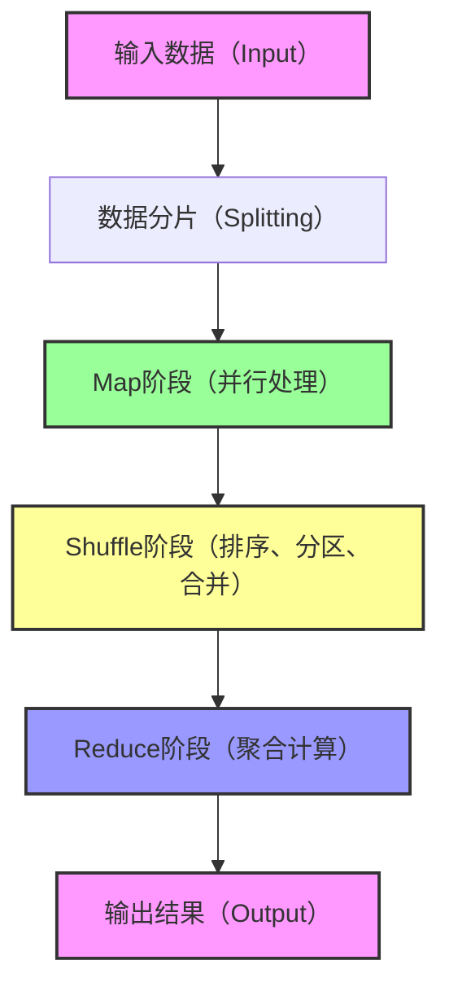
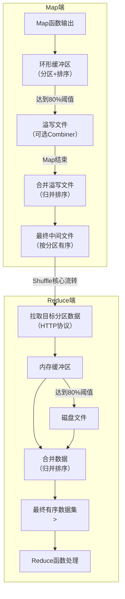
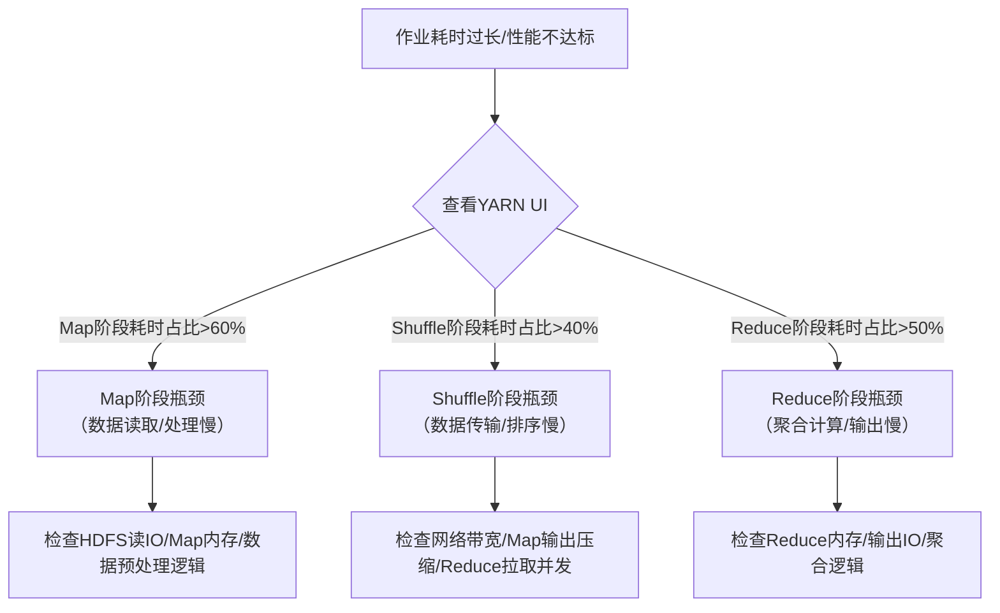
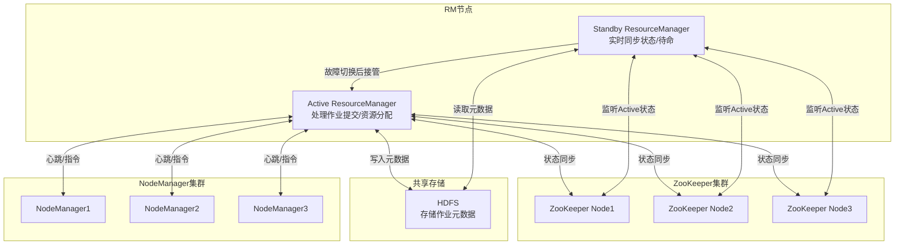

# 一、认知定位（Why & What）
## 1. 背景与起源

### 1.1 诞生的核心驱动力
Hadoop MapReduce 的诞生并非偶然，而是源于**传统数据处理技术在“海量数据时代”的根本性瓶颈**，主要驱动力可归纳为三点：
- **数据量爆炸式增长的挑战**：2000年后，互联网、日志、传感器等场景产生的数据量从GB级跃升至PB级，传统单机存储（如本地硬盘）和计算（如单机程序）无法承载此类规模数据的存储与处理。
- **传统计算模型的扩展性瓶颈**：传统计算框架（如单机版Java程序、数据库查询）依赖“垂直扩展”（升级单机CPU、内存、硬盘），成本极高且存在物理上限；而“水平扩展”（增加机器节点）的能力缺失，无法通过增加普通服务器来提升处理能力。
- **Google的技术思想启发**：MapReduce的核心设计源于Google在2004年发表的《MapReduce: Simplified Data Processing on Large Clusters》论文，该论文提出了“分而治之”的分布式计算模型，用于解决Google搜索引擎的网页索引、日志分析等海量数据处理问题。Apache Hadoop 项目（由Doug Cutting发起）基于此论文思想，实现了开源版的MapReduce，成为后续大数据技术的基石（参考：[Apache Hadoop 官方文档 - MapReduce起源](https://hadoop.apache.org/docs/stable/hadoop-mapreduce-client/hadoop-mapreduce-client-core/MapReduceTutorial.html)）。

### 1.2 解决的核心问题

MapReduce 从设计之初就瞄准海量数据处理的核心痛点，最终解决了三个关键问题：
- **海量数据的分布式并行处理**：通过将大任务拆解为多个“可并行的小任务”（Map任务），分配到不同节点执行，再将结果聚合（Reduce任务），实现PB级数据的高效处理，突破单机计算能力的限制。
- **低成本集群的容错性保障**：采用“ commodity hardware ”（普通商用服务器）构建集群，而非昂贵的专用服务器；同时内置容错机制（如任务失败自动重试、节点故障时重新分配任务），避免单节点故障导致整个任务失败，降低硬件成本的同时保证可靠性。
- **数据本地化计算的效率优化**：MapReduce 会优先将计算任务分配到“存储了该任务所需数据的节点”（依赖HDFS的块存储机制），减少跨节点数据传输的网络IO开销（网络IO是分布式计算的主要性能瓶颈之一），大幅提升计算效率。

## 2. 核心本质

### 2.1 核心模型：“分而治之”的两阶段流程
MapReduce 的本质是**将复杂的海量数据处理任务，拆解为“Map”和“Reduce”两个核心阶段**，配合“Shuffle”阶段完成数据流转，形成“输入→拆分→处理→聚合→输出”的闭环。其最简化流程可通过以下图表与步骤说明：

#### 2.1.1 核心流程图表（Mermaid）



#### 2.1.2 各阶段核心作用（步骤拆解）
1. **数据分片（Splitting）**：将输入的海量数据（存储在HDFS上）按照固定大小（默认与HDFS块大小一致，如128MB/256MB）拆分为多个“数据分片（InputSplit）”，每个分片对应一个Map任务，确保任务可并行。
2. **Map阶段**：“分”的核心——每个Map任务读取一个数据分片，按照用户定义的逻辑（如“提取日志中的用户ID和访问次数”）处理数据，输出“中间键值对（Key-Value）”（例如 `<用户ID, 1>`）。Map任务无状态，仅依赖输入分片，可完全并行执行。
3. **Shuffle阶段**：“连接Map与Reduce的桥梁”——负责将所有Map任务输出的中间键值对，按Key进行**分区（Partition）**（相同Key的键值对分配到同一个Reduce任务）、**排序（Sort）**、**合并（Combine）**（可选，在Map节点本地预聚合，减少网络传输），最终将整理后的数据发送给对应的Reduce任务。Shuffle是MapReduce的性能关键，也是面试高频考点。
4. **Reduce阶段**：“合”的核心——每个Reduce任务接收多个Map任务的中间键值对，按照用户定义的逻辑（如“统计每个用户ID的总访问次数”）对相同Key的数据进行聚合计算，输出最终结果（例如 `<用户ID, 100>`），并写入HDFS。

### 2.2 模型抽象特征
从上述流程中可提炼出MapReduce的三个核心抽象特征，也是其设计思想的体现：
- **无状态计算**：Map和Reduce任务均不依赖外部状态（如其他任务的计算结果），仅依赖输入数据，便于任务的并行调度和故障重试（失败后直接重新执行，无需恢复状态）。
- **数据驱动**：计算流程由输入数据的分片和中间键值对的Key决定，而非固定的执行顺序，适配海量非结构化/半结构化数据（如日志、网页）的处理场景。
- **粗粒度并行**：以“数据分片”为单位进行并行（而非细粒度的指令级并行），降低节点间的通信开销，更适合大规模集群（数十到数千节点）的分布式环境。

## 3. 定位与关系

### 3.1 在Hadoop生态中的核心定位

MapReduce 是 Apache Hadoop 生态系统的**核心计算引擎**，与HDFS（分布式存储）、YARN（资源调度）共同构成Hadoop的“三驾马车”，三者的关系如下：
- **HDFS（Hadoop Distributed File System）**：负责存储MapReduce任务所需的输入数据和输出结果，提供高可靠、高容量的分布式存储能力，是MapReduce的“数据底座”。
- **YARN（Yet Another Resource Negotiator）**：负责为MapReduce的Map/Reduce任务分配集群资源（CPU、内存），并调度任务在不同节点上执行，是MapReduce的“资源管家”。
- **MapReduce**：基于HDFS的存储和YARN的资源调度，实现海量数据的分布式计算逻辑，是Hadoop生态中“计算能力”的核心载体。

三者协同工作流程：用户提交MapReduce作业→YARN分配资源并启动作业→Map任务从HDFS读取数据并处理→Shuffle阶段整理数据→Reduce任务聚合计算→结果写入HDFS。

### 3.2 与同类计算框架的对比（替代/互补关系）
随着大数据技术的发展，MapReduce 逐渐被更高效的框架（如Spark、Flink）部分替代，但仍在特定场景中发挥作用。以下选取市占率最高的两个框架（Spark、Flink）与MapReduce进行对比，明确其适用边界：

| 对比维度         | Hadoop MapReduce                | Apache Spark                    | Apache Flink                    |
|------------------|---------------------------------|---------------------------------|---------------------------------|
| **核心计算模型** | 两阶段批处理（Map→Shuffle→Reduce），基于磁盘IO | 多阶段批处理/流处理，基于内存计算 | 流优先（批处理是流处理的特例），基于内存+磁盘混合IO |
| **处理速度**     | 慢（中间结果频繁写入磁盘，IO开销大） | 快（中间结果存于内存，减少磁盘IO），比MapReduce快10-100倍 | 快（实时流处理低延迟，批处理性能接近Spark） |
| **适用场景**     | 离线海量批处理（如T+1日志统计、数据仓库ETL），对实时性要求低 | 离线批处理（如数据挖掘、机器学习）、近实时处理（如分钟级报表） | 实时流处理（如实时风控、实时推荐）、批流一体处理（统一批/流任务） |
| **容错机制**     | 任务失败自动重试，基于磁盘快照恢复 | 基于RDD的 lineage（血缘）机制，内存数据丢失后可重新计算 | 基于Changelog的状态后端（如RocksDB），支持精确一次（Exactly-Once）语义 |
| **与MapReduce的关系** | 生态基石，被后续框架兼容（Spark/Flink可读取HDFS数据，基于YARN调度） | 替代关系（大部分离线批处理场景已被Spark替代） | 替代+互补关系（实时场景替代，批处理场景与Spark互补） |

#### 3.2.1 关键结论
- **MapReduce的不可替代性**：在超大规模（PB级以上）、低实时性要求、低成本的离线批处理场景（如传统数据仓库ETL）中，MapReduce仍因稳定性高、资源占用可控而被部分企业使用；同时，其“分而治之”的思想是后续分布式计算框架的基础。
- **主流替代方案**：Spark凭借更高的批处理效率，已成为离线计算的主流框架；Flink凭借“批流一体”和低延迟的流处理能力，在实时计算场景中占据主导地位。三者并非完全对立，而是在Hadoop生态中（基于HDFS/YARN）形成互补，适配不同的业务需求。

# 二、原理支撑（How - Theory）
## 1. 体系结构
### 1.1 核心组件
MapReduce的体系结构基于YARN（Yet Another Resource Negotiator）实现资源调度与任务管理，核心组件可分为**客户端层**、**资源调度层**、**节点管理层**、**任务执行层**，各组件功能明确且职责单一：
- **Client（客户端）**
  - 负责作业提交：检查输入输出路径合法性、将作业JAR包及配置文件上传至HDFS、向ResourceManager发起作业提交请求。
  - 负责作业监控：通过ApplicationMaster获取作业执行状态（如Map/Reduce Task完成率、失败原因），并向用户反馈。
  - 负责作业终止：支持手动终止未完成的作业，释放占用的集群资源。
- **ResourceManager（资源管理器）**
  - 集群级资源调度：管理整个集群的CPU、内存等资源，根据调度策略（如Capacity、Fair）为作业分配Container（资源单元）。
  - 作业入口管理：接收Client的作业提交请求，为作业分配第一个Container以启动ApplicationMaster。
  - 节点状态监控：通过NodeManager的心跳汇报，实时掌握各NodeManager的资源使用情况与健康状态。
- **NodeManager（节点管理器）**
  - 节点级资源管理：管理单个节点的资源（CPU核数、内存大小），负责Container的创建、启动、停止与资源隔离。
  - 任务执行监控：监控本节点上MapTask、ReduceTask的运行状态，收集任务日志并上报至ApplicationMaster。
  - 心跳汇报：定期向ResourceManager发送心跳，汇报节点资源剩余量、Container运行状态等信息。
- **ApplicationMaster（应用管理器）**
  - 作业级任务调度：为当前作业的MapTask、ReduceTask申请Container资源（向ResourceManager请求），并将任务分配至具体NodeManager。
  - 任务生命周期管理：监控所有Map/Reduce Task的执行，处理任务失败（如重新申请资源重试），协调任务间数据传输（如Shuffle阶段的数据流）。
  - 作业结果汇总：收集所有ReduceTask的输出结果，确认作业完成后向ResourceManager注销并释放资源。
- **MapTask（映射任务）**
  - 数据处理：读取InputSplit（输入数据逻辑分片），通过用户定义的Map函数对数据进行转换，输出中间键值对（<K1, V1> → <K2, V2>）。
  - 中间数据预处理：对Map输出的键值对进行排序、分区，通过溢写（Spill）与合并（Merge）生成有序的中间数据文件，存储于本地磁盘。
- **ReduceTask（归约任务）**
  - 中间数据拉取：通过Shuffle机制，从所有MapTask节点拉取属于当前分区的中间数据。
  - 数据聚合：对拉取的中间数据进行合并（Merge）与排序（Sort），通过用户定义的Reduce函数进行聚合处理（<K2, List<V2>> → <K3, V3>）。
  - 结果输出：将Reduce处理后的最终结果写入HDFS（而非本地磁盘，保证数据持久化）。
- **HDFS DataNode（数据节点，依赖组件）**
  - 存储输入输出数据：作业的输入数据（如文本文件）、作业JAR包、配置文件存储于HDFS；ReduceTask的最终输出结果也写入HDFS，确保数据高可用。


### 1.2 组件关系
各组件通过“请求-响应”“心跳汇报”“数据传输”三种交互方式协同工作，核心关系如下：
1. **客户端与资源调度层/任务执行层**：Client → ResourceManager（提交作业、查询状态）；Client → ApplicationMaster（获取任务详情、终止作业）。
2. **资源调度层与节点管理层**：ResourceManager ↔ NodeManager（心跳通信：ResourceManager下发资源分配指令，NodeManager上报节点状态）。
3. **应用管理器与资源调度层/节点管理层**：ApplicationMaster → ResourceManager（申请Container资源）；ApplicationMaster ↔ NodeManager（下发任务指令、监控任务状态、获取任务日志）。
4. **任务执行层内部**：MapTask → ReduceTask（数据传输：ReduceTask通过HTTP协议拉取MapTask的中间数据，即Shuffle阶段）。
5. **任务执行层与HDFS**：MapTask ← DataNode（读取InputSplit）；ReduceTask → DataNode（写入最终结果）。


## 2. 核心机制

### 2.1 调度机制（基于YARN）

YARN作为MapReduce的资源调度引擎，通过调度器（Scheduler）决定资源分配策略，核心调度器分为三类，适用于不同集群场景：

| 调度器类型 | 核心特点 | 优势 | 劣势 | 适用场景 |
|------------|----------|------|------|----------|
| FIFO Scheduler（先进先出调度器） | 单队列，按作业提交顺序分配资源；先提交的作业独占资源，后提交的作业等待 | 实现简单、无额外配置、低开销 | 资源利用率低（大作业阻塞小作业）、无公平性/优先级 | 小规模集群、测试环境、作业提交频率低的场景 |
| Capacity Scheduler（容量调度器） | 多队列设计，每个队列分配固定资源容量；队列内按FIFO排序，空闲资源可共享（抢占式/非抢占式） | 资源隔离（队列间互不干扰）、支持优先级、资源利用率较高 | 配置复杂、队列容量固定（非动态调整） | 多部门共享的集群（如企业内部不同团队使用） |
| Fair Scheduler（公平调度器） | 无固定队列容量，按“公平原则”分配资源（每个作业最终获得相等资源）；支持资源抢占 | 资源公平分配、动态适应负载、支持多租户 | 实现复杂、抢占式调度有性能开销 | 共享集群（如互联网公司通用计算集群）、作业类型多样的场景 |

> 注：Hadoop默认使用Capacity Scheduler，可通过`yarn-site.xml`的`yarn.resourcemanager.scheduler.class`配置修改调度器类型。


### 2.2 容错机制
MapReduce通过“故障检测”“故障恢复”两步实现高容错，覆盖从组件到任务的全链路故障处理：
#### 2.2.1 故障检测方式
所有组件通过**心跳机制**实现故障检测：
- NodeManager向ResourceManager发送心跳（默认3秒/次），若超过10次心跳未响应（默认30秒），ResourceManager判定该节点故障。
- Map/Reduce Task向ApplicationMaster发送心跳（默认3秒/次），若超过一定次数未响应，ApplicationMaster判定任务故障。
- ApplicationMaster向ResourceManager发送心跳（默认10秒/次），若超过一定次数未响应，ResourceManager判定其故障并重启。

#### 2.2.2 核心故障恢复逻辑
1. **MapTask故障恢复**
   - 检测：ApplicationMaster通过心跳发现MapTask未响应，标记该任务为“失败”。
   - 恢复：ApplicationMaster向ResourceManager申请新Container，在其他健康NodeManager上重启MapTask（默认最多重试4次，可通过`mapreduce.map.maxattempts`配置）。
   - 注意：MapTask输出存储于本地磁盘，故障后需重新执行（无数据持久化）。
2. **ReduceTask故障恢复**
   - 检测：同MapTask，通过心跳判定故障。
   - 恢复：重启ReduceTask（默认最多重试4次，`mapreduce.reduce.maxattempts`），重新拉取所有MapTask的中间数据（因中间数据已持久化于Map节点本地磁盘）。
3. **ApplicationMaster故障恢复**
   - 检测：ResourceManager通过心跳发现ApplicationMaster故障，标记该作业为“需要重启AM”。
   - 恢复：ResourceManager重新分配Container，启动新的ApplicationMaster（默认最多重试2次，`yarn.resourcemanager.am.max-attempts`）；新AM通过HDFS上的作业元数据（如InputSplit信息、任务状态）恢复作业进度，无需重新执行已完成的任务。
4. **NodeManager故障恢复**
   - 检测：ResourceManager判定节点故障后，标记该节点上所有Container为“失败”。
   - 恢复：ApplicationMaster重新为失败的Map/Reduce Task申请资源，在其他健康节点上重启任务；故障节点重启后，NodeManager会向ResourceManager重新注册，恢复资源贡献。
5. **ResourceManager故障恢复**
   - 依赖“ResourceManager HA（高可用）”机制：通过ZooKeeper实现主备RM选举，备RM实时同步主RM的元数据（如作业状态、资源分配）；主RM故障后，备RM快速切换为主节点（秒级），确保集群不中断服务。


### 2.3 Shuffle机制（核心数据流转机制）
Shuffle是MapReduce的“灵魂”，定义了**MapTask输出→ReduceTask输入**的中间数据流转过程，直接影响作业执行效率。整体分为“Map端处理”和“Reduce端处理”两阶段：

#### 2.3.1 Map端Shuffle流程
1. **输出收集（Collect）**：Map函数处理数据后，输出的<k2, v2>键值对先写入“环形缓冲区”（默认大小100MB），而非直接写入磁盘。
2. **分区（Partition）**：缓冲区中的键值对会先经过`Partitioner`（分区器），根据`k2`计算分区编号（决定该键值对属于哪个ReduceTask），每个分区对应一个ReduceTask。
3. **排序（Sort）**：缓冲区中的键值对按“分区编号→k2”的顺序实时排序（插入排序），确保同一分区内的键值对有序。
4. **溢写（Spill）**：当缓冲区数据达到阈值（默认80%，即80MB），后台线程将缓冲区中的数据按分区写入本地磁盘（生成“溢写文件”），剩余20%继续接收Map输出。
5. **合并（Merge）**：MapTask执行结束后，会生成多个溢写文件；此时Map端会将所有溢写文件按分区合并（归并排序），生成一个“最终中间数据文件”（每个分区内数据有序），并删除临时溢写文件。

> 注：若用户配置了`Combiner`（合并器），则在“溢写前”和“合并前”会触发Combiner，对同一<k2>的<v2>进行局部聚合（如WordCount中合并相同单词的计数），减少中间数据量，提升Shuffle效率。

#### 2.3.2 Reduce端Shuffle流程
1. **复制（Copy）**：ReduceTask启动后，通过HTTP协议向所有MapTask节点发起请求，拉取属于当前ReduceTask分区的中间数据（仅拉取目标分区，而非全部数据）。
2. **合并（Merge）**：拉取的中间数据先存入Reduce端内存缓冲区（默认大小100MB），当缓冲区达到阈值（默认80%），数据写入本地磁盘；同时，Reduce端会定期将内存中的数据与磁盘中的数据合并（归并排序），避免磁盘文件过多。
3. **排序（Sort）**：所有MapTask的目标分区数据拉取完成后，Reduce端对所有合并后的文件进行最终归并排序，生成一个全局有序的<k2, List<v2>>数据集，作为Reduce函数的输入。

#### 2.3.3 Shuffle流程示意图



### 2.4 分区（Partition）机制
Partition机制用于将Map端输出的中间数据按“键”划分到不同ReduceTask，确保**相同<k2>的键值对被同一个ReduceTask处理**，是实现数据聚合的前提。

#### 2.4.1 核心原理
1. **分区逻辑**：`Partitioner`接口定义分区逻辑，核心方法为`int getPartition(K2 key, V2 value, int numReduceTasks)`，返回值为分区编号（0~numReduceTasks-1）。
2. **默认分区器**：Hadoop默认使用`HashPartitioner`，分区逻辑为`(key.hashCode() & Integer.MAX_VALUE) % numReduceTasks`；通过哈希值取模确保相同<k2>的键值对落入同一分区，且分区数据分布相对均匀。

#### 2.4.2 自定义分区场景与实现
当默认哈希分区无法满足需求时，需自定义`Partitioner`，典型场景：
- 按业务字段分区（如按“地区”字段将数据分配到不同ReduceTask，每个地区对应一个输出文件）。
- 按数据范围分区（如按“订单金额”区间分区：0~1000→分区0，1001~5000→分区1）。

自定义步骤：
1. 实现`Partitioner<K2, V2>`接口，重写`getPartition`方法。
2. 在Driver代码中通过`job.setPartitionerClass(自定义分区器.class)`配置。
3. 确保`numReduceTasks`（ReduceTask数量）与分区数一致（避免分区无对应ReduceTask或ReduceTask无数据处理）。


### 2.5 Hadoop序列化机制
序列化是将对象转化为字节流（用于网络传输或磁盘存储）的过程，反序列化则是反向过程。MapReduce需频繁在节点间传输数据（如Shuffle），因此需要高效的序列化机制。

#### 2.5.1 为什么不用Java序列化？
Java序列化存在三大问题，无法满足大数据场景需求：
- 体积大：Java序列化会包含对象的类元数据（如类名、字段类型），导致字节流冗余，增加存储与传输开销。
- 速度慢：序列化/反序列化过程复杂，涉及反射等操作，性能低。
- 不可扩展：无法灵活添加字段，兼容性差。

#### 2.5.2 Hadoop序列化核心接口：Writable
Hadoop自定义`Writable`接口实现高效序列化，核心方法：
- `void write(DataOutput out)`：将对象数据写入输出流（序列化）。
- `void readFields(DataInput in)`：从输入流读取数据到对象（反序列化，注意字段读取顺序需与写入顺序一致）。

#### 2.5.3 常用Writable实现类
Hadoop提供丰富的`Writable`实现类，覆盖常见数据类型：

| Writable实现类 | 对应Java类型 | 用途 |
|----------------|--------------|------|
| IntWritable | int | 整数类型（4字节） |
| LongWritable | long | 长整数类型（8字节） |
| Text | String | 字符串类型（UTF-8编码） |
| FloatWritable | float | 单精度浮点数（4字节） |
| DoubleWritable | double | 双精度浮点数（8字节） |
| NullWritable | null | 空值（无数据，用于仅需键或仅需值的场景） |
| MapWritable | Map | 键值对集合（键和值需实现Writable） |

> 注：若需自定义数据类型（如自定义Java Bean），需实现`Writable`接口，并重写`write`和`readFields`方法。

## 3. 抽象建模

MapReduce通过“抽象函数”“数据模型”“任务划分”三层建模，将现实中的数据处理问题转化为可执行的分布式任务，核心是“分而治之”思想。

### 3.1 核心抽象概念：Map与Reduce函数
MapReduce将数据处理过程抽象为**Map（映射）** 和**Reduce（归约）** 两个核心函数，用户仅需实现这两个函数的业务逻辑，无需关注分布式细节（如任务调度、数据传输）。

#### 3.1.1 Map函数：“分”——拆分与转换
- **输入**：<K1, V1>（原始数据键值对，由`InputFormat`定义），例如：
  - 文本文件场景：K1=行偏移量（LongWritable），V1=行内容（Text）。
- **输出**：<K2, V2>（中间数据键值对，由用户业务逻辑定义），例如：
  - WordCount场景：Map函数将行内容拆分为单词，输出<单词（Text）, 1（IntWritable）>。
- **核心作用**：将原始数据拆分为细粒度的中间数据，完成“数据转换”（如格式统一、字段提取），不涉及聚合逻辑。

#### 3.1.2 Reduce函数：“合”——聚合与计算
- **输入**：<K2, List<V2>>（按K2分组后的中间数据，由Shuffle机制保证），例如：
  - WordCount场景：输入<单词（Text）, [1,1,1,...]>（同一单词的所有计数）。
- **输出**：<K3, V3>（最终结果键值对，由`OutputFormat`定义），例如：
  - WordCount场景：Reduce函数求和，输出<单词（Text）, 总次数（IntWritable）>。
- **核心作用**：对同一K2的中间数据进行聚合计算（如求和、计数、排序），生成最终结果。

#### 3.1.3 建模示例：WordCount问题转化
现实问题：统计海量文本文件中每个单词的出现次数。
MapReduce建模逻辑：
1. **Map阶段**：将“文本行”拆分为“单词-计数1”，实现“拆分”——解决“海量数据无法单机处理”的问题。
2. **Shuffle阶段**：将“相同单词的计数1”聚合到同一ReduceTask，实现“分组”——解决“数据分布在不同节点”的问题。
3. **Reduce阶段**：对“同一单词的所有计数1”求和，实现“聚合”——解决“统计结果”的问题。


### 3.2 数据模型：统一键值对（Key-Value）
MapReduce将所有数据（输入、中间、输出）统一抽象为**<Key, Value>键值对**，确保数据处理流程的一致性，具体定义如下：

| 数据阶段 | 键值对类型 | 定义者 | 核心作用 |
|----------|------------|--------|----------|
| 输入数据 | <K1, V1> | `InputFormat`（如TextInputFormat） | 定义原始数据的读取方式（如按行读取） |
| 中间数据 | <K2, V2> | 用户自定义（Map函数输出） | 承载Map阶段的转换结果，为Reduce阶段聚合做准备 |
| 输出数据 | <K3, V3> | `OutputFormat`（如TextOutputFormat） | 定义最终结果的存储格式（如按“K3\tV3”写入文本） |

> 关键约束：Key必须实现`WritableComparable`接口（支持序列化与排序），Value仅需实现`Writable`接口（仅支持序列化）；因Shuffle阶段需按Key排序，故Key需具备可比较性。


### 3.3 任务划分模型：InputSplit与任务数量
为实现“分布式处理”，MapReduce将输入数据划分为多个**InputSplit（输入分片）**，每个InputSplit对应一个MapTask；ReduceTask数量则根据业务需求配置，核心划分逻辑如下：

#### 3.3.1 InputSplit：输入数据的逻辑分片
- **定义**：InputSplit是“逻辑分片”，而非物理分片（不切割原始文件），仅记录“数据的存储位置（DataNode列表）”和“数据的起始/结束偏移量”。
- **大小**：默认与HDFS Block大小一致（如128MB或256MB），原因：
  - 避免“数据本地化失效”：若Split大小小于Block，MapTask需跨节点读取数据（网络传输开销大）；若Split大小大于Block，一个Split需读取多个Block（可能跨节点）。
  - 平衡“任务数量”与“调度开销”：Split过小会导致MapTask数量过多（调度开销大），Split过大则会导致单个MapTask处理时间过长（拖慢作业）。
- **生成者**：由`InputFormat`的`getSplits(JobContext context)`方法生成，默认实现为`TextInputFormat`（按行拆分，不切割行数据）。

#### 3.3.2 任务数量确定
- **MapTask数量**：由InputSplit数量决定，公式为“MapTask数量 = InputSplit总数”；无法手动配置，只能通过调整Split大小（如修改`mapreduce.input.fileinputformat.split.maxsize`）间接控制。
- **ReduceTask数量**：手动配置（默认1），公式为“ReduceTask数量 = job.setNumReduceTasks(N)”；配置原则：
  - 若无需聚合（如仅数据转换），可设为0（跳过Reduce阶段，Map输出直接写入HDFS）。
  - 若需聚合，建议设为“集群ReduceSlot数量的1~2倍”（避免资源浪费，同时保证并行度）。
  - 数量不宜过多（否则输出文件过多，后续处理麻烦），也不宜过少（并行度低，作业执行慢）。

## 4. 流转逻辑

### 4.1 作业提交与初始化流程
MapReduce作业从提交到初始化，涉及Client、ResourceManager、ApplicationMaster的多轮交互，核心步骤如下：

#### 4.1.1 作业提交详细步骤
1. Client调用`Job.submit()`方法，首先检查作业配置：
   - 检查输入路径是否存在（若不存在，抛出`FileNotFoundException`）。
   - 检查输出路径是否已存在（若存在，抛出`FileAlreadyExistsException`）。
   - 确认作业JAR包、配置文件（如`mapred-site.xml`）是否完整。
2. Client向ResourceManager发送“作业提交请求”，并上传作业资源至HDFS：
   - 上传作业JAR包至HDFS的`/tmp/hadoop-yarn/staging/<username>/.staging/<jobid>/`目录。
   - 上传作业配置文件（合并Client与集群的配置）至同一HDFS目录。
   - 调用`InputFormat.getSplits()`生成InputSplit列表，上传至HDFS（命名为`splits`）。
3. ResourceManager接收请求后，为作业分配第一个Container（用于启动ApplicationMaster），并通知对应NodeManager启动ApplicationMaster。
4. NodeManager接收到ResourceManager的指令后，在本地启动ApplicationMaster进程（JVM进程）。
5. ApplicationMaster启动后，首先加载HDFS上的作业资源（JAR包、配置、InputSplit），初始化作业执行计划：
   - 解析InputSplit列表，确定MapTask数量（=Split数量）。
   - 读取`mapreduce.job.reduces`配置，确定ReduceTask数量。
6. ApplicationMaster向ResourceManager发送“资源申请请求”，为所有MapTask和ReduceTask申请Container：
   - 申请MapTask Container时，优先选择“存储InputSplit数据的DataNode节点”（数据本地化，减少网络传输）。
   - 申请ReduceTask Container时，无数据本地化要求（因Reduce需拉取所有Map的中间数据）。
7. ResourceManager根据调度策略（如Capacity）为ApplicationMaster分配Container，并返回Container的节点信息（NodeManager地址）。
8. ApplicationMaster向目标NodeManager发送“任务启动指令”，携带作业JAR包路径、任务配置（如MapTask对应哪个InputSplit）。
9. NodeManager接收到指令后，在本地启动MapTask/ReduceTask进程（JVM进程），作业进入“任务执行阶段”。


### 4.2 MapTask执行流转逻辑
MapTask的执行流程从“读取InputSplit”到“输出中间数据”，全程在本地磁盘完成，核心步骤如下：

#### 4.2.1 MapTask执行详细步骤
1. MapTask进程启动后，初始化`Mapper`对象（用户自定义的Mapper子类），并加载任务配置（如对应哪个InputSplit）。
2. MapTask通过`RecordReader`（由`InputFormat`创建，如`LineRecordReader`）读取InputSplit数据：
   - `RecordReader`按“<K1, V1>”格式读取数据（如`LineRecordReader`读取一行数据，K1=行偏移量，V1=行内容）。
   - 每读取一组<K1, V1>，调用`Mapper.map(K1, V1, Context)`方法。
3. Mapper.map()方法执行用户定义的业务逻辑，输出<k2, v2>键值对，通过`Context.write(k2, v2)`写入环形缓冲区。
4. 环形缓冲区中的<k2, v2>按“分区→k2”排序（实时插入排序），当缓冲区达到80%阈值时，触发溢写（Spill）：
   - 后台线程将缓冲区数据按分区写入本地磁盘的临时目录（如`/tmp/hadoop-mapred/map/<taskid>/spill<num>.out`）。
   - 若配置了`Combiner`，溢写前会调用`Combiner.combine(k2, Iterable<v2>, Context)`对同一k2的v2进行局部聚合。
5. 当`RecordReader`读取完所有InputSplit数据（即Map函数执行结束），MapTask启动“合并溢写文件”流程：
   - 将所有溢写文件（`spill<num>.out`）按分区进行归并排序，每个分区生成一个有序的数据集。
   - 合并完成后，删除临时溢写文件，仅保留“最终中间数据文件”（`part-m-<taskid>`）和“分区索引文件”（`part-m-<taskid>.index`，记录每个分区在数据文件中的起始/结束偏移量）。
6. MapTask向ApplicationMaster发送“任务完成汇报”，携带中间数据文件的存储路径（HDFS或本地磁盘路径）。
7. ApplicationMaster接收到汇报后，标记该MapTask为“成功”，并将其中间数据路径通知给所有ReduceTask（用于Reduce端拉取数据）。


### 4.3 ReduceTask执行流转逻辑
ReduceTask的执行流程从“拉取Map中间数据”到“写入最终结果至HDFS”，核心步骤如下：

#### 4.3.1 ReduceTask执行详细步骤
1. ReduceTask进程启动后，初始化`Reducer`对象（用户自定义的Reducer子类），并从ApplicationMaster获取“所有MapTask的中间数据路径”。
2. ReduceTask启动多个“复制线程”（默认5个，可通过`mapreduce.reduce.shuffle.parallelcopies`配置），通过HTTP协议向所有MapTask节点拉取属于当前ReduceTask分区的中间数据：
   - 复制线程首先读取MapTask的“分区索引文件”（`part-m-<taskid>.index`），定位目标分区在数据文件中的偏移量。
   - 仅拉取目标分区的数据（而非全部数据），拉取的数据先存入Reduce端内存缓冲区（默认100MB）。
3. 当内存缓冲区数据达到阈值（默认80%），ReduceTask将数据写入本地磁盘的临时目录（生成“临时合并文件”）；同时，定期将内存中的数据与磁盘中的临时文件合并（归并排序），避免磁盘文件过多。
4. 当所有MapTask的目标分区数据均拉取完成（ReduceTask通过ApplicationMaster确认所有MapTask已完成），ReduceTask启动“最终合并”流程：
   - 将所有内存中的数据和磁盘中的临时文件进行归并排序，生成一个全局有序的<k2, List<v2>>数据集。
5. ReduceTask调用`Reducer.reduce(k2, Iterable<v2>, Context)`方法，执行用户定义的聚合逻辑，输出<k3, v3>键值对。
6. ReduceTask通过`RecordWriter`（由`OutputFormat`创建，如`TextRecordWriter`）将<k3, v3>写入HDFS：
   - 写入路径为用户配置的`mapreduce.output.fileoutputformat.outputdir`，文件名格式为`part-r-<taskid>`（如`part-r-00000`）。
   - 若配置了`OutputCommitter`，写入完成后会提交输出（删除临时输出目录，标记结果为“正式”）。
7. ReduceTask向ApplicationMaster发送“任务完成汇报”，携带最终输出文件的HDFS路径。
8. ApplicationMaster接收到所有ReduceTask的完成汇报后，标记作业为“成功”，并向ResourceManager注销作业，释放所有占用的Container资源。

# 三、实践应用（How - Practice）
## 1. 基础操作

### 1.1 环境准备与Hadoop安装（MapReduce依赖Hadoop生态）
MapReduce是Hadoop核心组件之一，无法单独部署，需先完成Hadoop集群/单机环境搭建，以下为**单机伪分布式环境（适合开发测试）** 核心步骤：
1. 环境依赖检查：确保已安装JDK 8+（Hadoop 3.x推荐），执行`java -version`验证；关闭防火墙（CentOS：`systemctl stop firewalld`，Ubuntu：`ufw disable`）。
2. 下载Hadoop安装包：从Apache官网（https://hadoop.apache.org/releases.html）下载稳定版（如3.3.6），解压至目标目录（例：`/opt/hadoop`）。
3. 配置环境变量：编辑`/etc/profile`，添加Hadoop路径，执行`source /etc/profile`生效：
   ```bash
   export HADOOP_HOME=/opt/hadoop
   export PATH=$PATH:$HADOOP_HOME/bin:$HADOOP_HOME/sbin
   ```
4. 修改核心配置文件（路径：`$HADOOP_HOME/etc/hadoop`）：
   - `core-site.xml`：配置HDFS默认FS和临时目录
     ```xml
     <property>
         <name>fs.defaultFS</name>
         <value>hdfs://localhost:9000</value>
     </property>
     <property>
         <name>hadoop.tmp.dir</name>
         <value>/opt/hadoop/tmp</value>
     </property>
     ```
   - `hdfs-site.xml`：配置HDFS副本数（伪分布式设为1）
     ```xml
     <property>
         <name>dfs.replication</name>
         <value>1</value>
     </property>
     ```
   - `mapred-site.xml`：指定MapReduce框架为YARN
     ```xml
     <property>
         <name>mapreduce.framework.name</name>
         <value>yarn</value>
     </property>
     ```
   - `yarn-site.xml`：配置YARN资源管理器地址
     ```xml
     <property>
         <name>yarn.resourcemanager.address</name>
         <value>localhost:8032</value>
     </property>
     <property>
         <name>yarn.nodemanager.aux-services</name>
         <value>mapreduce_shuffle</value>
     </property>
     ```
5. 免密SSH配置：执行`ssh-keygen -t rsa`生成密钥，`cat ~/.ssh/id_rsa.pub >> ~/.ssh/authorized_keys`实现本地免密登录。
6. 初始化HDFS：执行`hdfs namenode -format`（仅首次执行），启动集群：`start-dfs.sh`+`start-yarn.sh`，执行`jps`验证进程（需包含NameNode、DataNode、ResourceManager、NodeManager）。

### 1.2 MapReduce核心配置调整（生产常用参数）
通过修改`mapred-site.xml`或提交作业时指定参数，优化MapReduce任务性能，关键参数如下表：

| 参数名 | 作用 | 默认值 | 生产推荐值（示例） |
|--------|------|--------|--------------------|
| mapreduce.map.memory.mb | 单个MapTask可使用的最大内存 | 1024 | 2048（大数据量场景） |
| mapreduce.reduce.memory.mb | 单个ReduceTask可使用的最大内存 | 1024 | 4096（聚合计算场景） |
| mapreduce.map.cpu.vcores | 单个MapTask占用的CPU核心数 | 1 | 2（CPU密集型任务） |
| mapreduce.reduce.cpu.vcores | 单个ReduceTask占用的CPU核心数 | 1 | 4（CPU密集型任务） |
| mapreduce.job.reduces | ReduceTask数量 | -1（自动计算） | 设为MapTask数量的1/2~1/3（避免Shuffle压力） |
| mapreduce.map.output.compress | 是否压缩Map输出的中间数据 | false | true（用Snappy压缩，减少Shuffle数据量） |

### 1.3 MapReduce核心API解析（Java版）
MapReduce任务的核心逻辑通过**Mapper、Reducer、Driver**三类组件实现，API核心方法与作用如下：

#### 1.3.1 Mapper组件（数据预处理）
负责“分”：读取输入数据，按业务逻辑处理后输出<Key, Value>键值对（中间数据），核心方法：
```java
// 泛型依次为：输入Key类型、输入Value类型、输出Key类型、输出Value类型
public class MyMapper extends Mapper<LongWritable, Text, Text, IntWritable> {
    // 每读取一行数据调用一次（LongWritable：行偏移量，Text：行内容）
    @Override
    protected void map(LongWritable key, Text value, Context context) throws IOException, InterruptedException {
        // 1. 数据切分（例：按空格分割单词）
        String[] words = value.toString().split(" ");
        // 2. 处理并输出（例：每个单词标记为<单词, 1>）
        for (String word : words) {
            context.write(new Text(word), new IntWritable(1));
        }
    }
}
```

#### 1.3.2 Reducer组件（数据聚合）
负责“合”：接收Mapper输出的相同Key的Value集合，聚合计算后输出最终结果，核心方法：
```java
public class MyReducer extends Reducer<Text, IntWritable, Text, IntWritable> {
    // 相同Key的Value集合会触发一次reduce方法（Text：Key，Iterable<IntWritable>：Value集合）
    @Override
    protected void reduce(Text key, Iterable<IntWritable> values, Context context) throws IOException, InterruptedException {
        // 1. 聚合计算（例：统计每个单词的总次数）
        int sum = 0;
        for (IntWritable value : values) {
            sum += value.get();
        }
        // 2. 输出最终结果（<单词, 总次数>）
        context.write(key, new IntWritable(sum));
    }
}
```

#### 1.3.3 Driver组件（任务入口）
负责配置作业参数、指定Mapper/Reducer类、定义输入输出路径，提交任务到YARN，核心代码：
```java
public class MyDriver {
    public static void main(String[] args) throws Exception {
        // 1. 创建作业配置对象
        Configuration conf = new Configuration();
        Job job = Job.getInstance(conf, "MyMapReduceJob"); // 作业名：MyMapReduceJob
        
        // 2. 指定Driver类（当前类）
        job.setJarByClass(MyDriver.class);
        
        // 3. 指定Mapper和Reducer类
        job.setMapperClass(MyMapper.class);
        job.setReducerClass(MyReducer.class);
        
        // 4. 指定最终输出的Key和Value类型（与Reducer输出一致）
        job.setOutputKeyClass(Text.class);
        job.setOutputValueClass(IntWritable.class);
        
        // 5. 指定输入输出路径（从命令行参数获取，args[0]：输入路径，args[1]：输出路径）
        FileInputFormat.addInputPath(job, new Path(args[0]));
        FileOutputFormat.setOutputPath(job, new Path(args[1]));
        
        // 6. 提交作业，等待执行完成（true：打印执行日志）
        System.exit(job.waitForCompletion(true) ? 0 : 1);
    }
}
```

## 2. 典型案例

### 2.1 WordCount（MapReduce入门案例）
#### 2.1.1 需求分析
统计指定文本文件中每个单词的出现次数，输入为文本文件（每行多个单词，空格分隔），输出为<单词, 次数>的键值对。

#### 2.1.2 实现步骤（基于1.3节API）

1. 代码编写：创建`WordCountMapper`、`WordCountReducer`、`WordCountDriver`，逻辑与1.3节示例一致（直接复用）。
2. 打包作业：用Maven/Gradle打包为JAR包（例：`wordcount-1.0.jar`），确保MANIFEST.MF指定Main-Class为`WordCountDriver`。
3. 准备输入数据：
   - 在HDFS创建输入目录：`hdfs dfs -mkdir /input`
   - 上传本地文本文件到HDFS：`hdfs dfs -put local_text.txt /input`
4. 提交作业到YARN：
   ```bash
   hadoop jar wordcount-1.0.jar /input /output
   ```
   （注：/output目录需不存在，否则作业报错，可先执行`hdfs dfs -rm -r /output`删除）
5. 查看结果：
   - 执行`hdfs dfs -cat /output/part-r-00000`（part-r-00000为Reducer输出文件），查看单词统计结果。


## 3. 问题诊断
### 3.1 高频错误分类与排查（表格）

| 错误类型 | 常见现象 | 根因分析 | 解决方案 |
|----------|----------|----------|----------|
| 资源不足错误 | 任务日志显示“Container killed by YARN for exceeding memory limits” | 1. Map/ReduceTask内存配置不足<br>2. 数据量突增导致内存溢出 | 1. 调整`mapreduce.map.memory.mb`和`mapreduce.reduce.memory.mb`（参考1.2节推荐值）<br>2. 增加ReduceTask数量，分散计算压力 |
| Shuffle阶段异常 | 作业卡停在“Shuffle 100%”，或日志显示“Fetch failed” | 1. Map输出数据未压缩，网络传输慢<br>2. ReduceTask拉取数据超时 | 1. 开启Map输出压缩：在`mapred-site.xml`配置`mapreduce.map.output.compress=true`，并指定压缩算法（`mapreduce.map.output.compress.codec=org.apache.hadoop.io.compress.SnappyCodec`）<br>2. 调整超时参数：`mapreduce.reduce.shuffle.fetch.timeout=600000`（10分钟） |
| 数据倾斜 | 部分ReduceTask执行时间极长（远超其他Reduce），整体作业卡顿 | 1. 某类Key数据量过大（如“null”值Key）<br>2. ReduceTask数量不合理 | 1. 预处理数据：过滤无效Key（如null），或对热点Key进行拆分（例：在Key后加随机后缀，分散到多个Reduce）<br>2. 调整`mapreduce.job.reduces`，设为MapTask数量的1/2~1/3 |
| 输入输出路径错误 | 作业启动即报错“org.apache.hadoop.mapreduce.lib.input.InvalidInputException: Input path does not exist” | 1. HDFS输入路径不存在<br>2. 输出路径已存在（MapReduce禁止覆盖输出目录） | 1. 执行`hdfs dfs -ls /input`验证输入路径，不存在则创建：`hdfs dfs -mkdir /input`<br>2. 删除已存在的输出路径：`hdfs dfs -rm -r /output` |
| 权限问题 | 日志显示“Permission denied: user=xxx, access=WRITE, inode="/output":hdfs:supergroup:drwxr-xr-x” | 提交作业的用户（如xxx）无HDFS输出目录的写权限 | 1. 切换为HDFS超级用户执行：`su hdfs`，再提交作业<br>2. 赋予用户写权限：`hdfs dfs -chmod 775 /output`（或根据实际用户组调整） |

### 3.2 排查工具与日志位置
1. YARN Web UI：访问`http://ResourceManager地址:8088`，查看作业状态（RUNNING/FAILED），点击“Application ID”可查看每个Task的日志。
2. 本地日志：Hadoop集群节点的日志路径为`$HADOOP_HOME/logs`，关键日志文件：
   - `yarn-hadoop-resourcemanager-xxx.log`：ResourceManager日志
   - `yarn-hadoop-nodemanager-xxx.log`：NodeManager日志
   - `mapred-hadoop-historyserver-xxx.log`：任务历史日志（需启动HistoryServer：`mr-jobhistory-daemon.sh start historyserver`）

## 4. 场景扩展

### 4.1 数据倾斜进阶优化（除基础方案外的生产实践）
#### 4.1.1 Combiner组件（Map端局部聚合）
- 应用场景：需减少Shuffle阶段数据量（如WordCount、求和类任务），避免Map输出大量重复<Key, Value>。
- 实现方式：在Driver中指定Combiner类（复用Reducer逻辑，因Combiner本质是Map端的“迷你Reducer”）：
  ```java
  // 在WordCountDriver的main方法中添加
  job.setCombinerClass(WordCountReducer.class);
  ```
- 注意事项：Combiner仅适用于“聚合逻辑满足交换律和结合律”的场景（如求和、计数），不适用求平均值（会导致结果错误）。

#### 4.1.2 Map端Join（小表关联优化）
- 应用场景：大表与小表（数据量<1GB）的关联任务（如“用户行为表（大表）+用户信息表（小表）”关联），避免Shuffle阶段大量数据传输。
- 实现原理：将小表加载到每个MapTask的内存中（通过`DistributedCache`），Map端直接用大表数据匹配小表，无需Reduce阶段。
- 核心步骤：
  1. 上传小表到HDFS：`hdfs dfs -put user_info.txt /cache`
  2. 在Driver中配置DistributedCache，加载小表：
     ```java
     // 添加小表到DistributedCache
     DistributedCache.addCacheFile(new URI("/cache/user_info.txt"), conf);
     // 禁用ReduceTask（Map端直接输出结果）
     job.setNumReduceTasks(0);
     ```
  3. 在Mapper的`setup`方法中读取小表到内存（如HashMap），`map`方法中用大表数据匹配小表并输出。

### 4.2 多输入多输出场景（处理异构数据与分类输出）
#### 4.2.1 多输入（读取多种格式/路径的数据）
- 应用场景：需同时处理HDFS上多个路径的异构数据（如“日志文件（Text格式）+用户表（SequenceFile格式）”）。
- 实现方式：使用`MultipleInputs`类，为不同输入路径指定专属Mapper：
  ```java
  // 在Driver中替换原FileInputFormat配置
  // 路径1：日志文件，用LogMapper处理
  MultipleInputs.addInputPath(job, new Path("/input/logs"), TextInputFormat.class, LogMapper.class);
  // 路径2：用户表，用UserMapper处理
  MultipleInputs.addInputPath(job, new Path("/input/users"), SequenceFileInputFormat.class, UserMapper.class);
  ```

#### 4.2.2 多输出（将结果写入多个目录）
- 应用场景：需将计算结果按业务分类输出（如“订单数据”按“支付状态”拆分为“已支付”“未支付”两个目录）。
- 实现方式：使用`MultipleOutputs`类，在Reducer中指定输出目录：
  1. 在Driver中配置多输出：
     ```java
     // 注册多输出（output1：已支付订单，output2：未支付订单）
     MultipleOutputs.addNamedOutput(job, "paid", TextOutputFormat.class, Text.class, Text.class);
     MultipleOutputs.addNamedOutput(job, "unpaid", TextOutputFormat.class, Text.class, Text.class);
     // 禁用默认输出（避免生成part-r-00000）
     job.setOutputFormatClass(NullOutputFormat.class);
     ```
  2. 在Reducer中使用MultipleOutputs输出：
     ```java
     private MultipleOutputs<Text, Text> multipleOutputs;
     
     @Override
     protected void setup(Context context) throws IOException, InterruptedException {
         multipleOutputs = new MultipleOutputs<>(context);
     }
     
     @Override
     protected void reduce(Text key, Iterable<Text> values, Context context) throws IOException, InterruptedException {
         for (Text value : values) {
             if (value.toString().contains("paid")) {
                 // 写入“已支付”目录（输出路径：/output/paid/paid-r-00000）
                 multipleOutputs.write("paid", key, value, "paid/paid");
             } else {
                 // 写入“未支付”目录（输出路径：/output/unpaid/unpaid-r-00000）
                 multipleOutputs.write("unpaid", key, value, "unpaid/unpaid");
             }
         }
     }
     
     @Override
     protected void cleanup(Context context) throws IOException, InterruptedException {
         multipleOutputs.close(); // 关闭资源
     }
     ```

### 4.3 与Hadoop生态组件集成（生产常用架构）
#### 4.3.1 MapReduce + Hive（SQL化开发）
- 应用场景：业务人员熟悉SQL，需用SQL实现MapReduce任务（避免编写Java代码）。
- 原理：Hive将SQL解析为MapReduce作业（或Spark作业），自动生成Mapper/Reducer逻辑。
- 示例：用Hive SQL实现WordCount（无需编写Java代码）：
  ```sql
  -- 1. 创建Hive表（对应HDFS输入数据）
  CREATE TABLE wordcount_input (line STRING) 
  ROW FORMAT DELIMITED FIELDS TERMINATED BY '\n' 
  LOCATION '/input';
  
  -- 2. 执行SQL，底层生成MapReduce作业
  SELECT word, COUNT(1) AS count 
  FROM (SELECT explode(split(line, ' ')) AS word FROM wordcount_input) t 
  GROUP BY word 
  INSERT OVERWRITE DIRECTORY '/output/hive_wordcount' 
  ROW FORMAT DELIMITED FIELDS TERMINATED BY '\t';
  ```

#### 4.3.2 MapReduce + Spark（混合计算架构）
- 应用场景：复杂业务需“Spark预处理 + MapReduce批量计算”（如Spark实时清洗数据，MapReduce夜间批量统计）。
- 实现流程：
  1. Spark读取Kafka实时数据，清洗后写入HDFS（格式：Parquet）；
  2. MapReduce读取HDFS上的清洗后数据，执行批量统计（如“日活用户计算”）；
  3. 结果写入HBase，供业务系统查询。
- 优势：Spark擅长实时/迭代计算，MapReduce擅长稳定的批量计算，二者互补满足复杂业务需求。

# 四、深度进阶（Mastery）
## 1. 性能优化
### 1.1 瓶颈定位方法（工具与指标）
要优化MapReduce性能，需先通过工具定位瓶颈，核心工具与关键指标如下：
- **YARN Web UI（http://RM地址:8088）**：
  - 查看作业总耗时（`Elapsed Time`）、各阶段占比（Map阶段/Shuffle阶段/Reduce阶段）；
  - 识别异常Task（如单个Task耗时远超平均、Task失败重试）。
- **任务日志（NodeManager节点日志路径：$HADOOP_HOME/logs/yarn-xxx-nodemanager-xxx.log）**：
  - 搜索`GC overhead limit exceeded`：定位内存溢出瓶颈；
  - 搜索`Fetch failed`/`Shuffle error`：定位Shuffle阶段网络/IO瓶颈。
- **Hadoop自带工具**：
  - `hadoop job -status <JobID>`：查看作业实时状态（Map/Reduce完成百分比）；
  - `mapred job -history <HistoryServer地址:19888> -job <JobID>`：查看历史作业的详细统计（如Map输出数据量、Shuffle传输量）。

#### 1.1.1 性能瓶颈分析流程图（Mermaid）


### 1.2 分阶段调优策略（Map/Shuffle/Reduce）
#### 1.2.1 Map阶段调优（解决“数据读取/处理慢”）
- **优化数据读取效率**：
  - 采用`CombineInputFormat`：当输入文件为大量小文件（<128MB，HDFS块默认大小）时，合并小文件为一个InputSplit，减少MapTask数量（避免资源浪费）；
  - 预加载小表到内存：通过`DistributedCache`将小表（<1GB）加载到MapTask内存，避免重复读取HDFS（适用于Map端Join场景）。
- **优化数据处理逻辑**：
  - 启用Combiner：在Map端对输出数据局部聚合（如WordCount的求和逻辑），减少Shuffle阶段传输的数据量（需满足“聚合逻辑可重复”，如求和/计数，不适用求平均）；
  - 避免Map端复杂计算：将非必要的复杂处理（如数据格式转换）前置到数据预处理阶段（如用Spark/Sqoop提前清洗数据）。

#### 1.2.2 Shuffle阶段调优（解决“数据传输/排序慢”）
Shuffle是MapReduce性能关键瓶颈，核心调优方向是“减少数据量+优化传输效率”：
- **压缩Map输出中间数据**：
  - 启用压缩：在`mapred-site.xml`配置`mapreduce.map.output.compress=true`，选择高效压缩算法（Snappy>LZ4>GZIP，Snappy压缩/解压速度最快，适合生产）；
  - 配置压缩算法：`mapreduce.map.output.compress.codec=org.apache.hadoop.io.compress.SnappyCodec`。
- **优化排序与分区**：
  - 自定义Partitioner：当Key分布不均时（如按用户ID分区），避免单个ReduceTask处理过多数据（减少数据倾斜）；
  - 调整排序缓冲：增大Map端排序缓冲区大小（`mapreduce.task.io.sort.mb`，默认100MB，生产可设为200-400MB），减少磁盘IO。
- **优化Reduce拉取并发**：
  - 增大Reduce拉取Map输出的并发数（`mapreduce.reduce.shuffle.parallelcopies`，默认5，生产可设为10-20），加快数据拉取速度。

#### 1.2.3 Reduce阶段调优（解决“聚合/输出慢”）
- **优化Reduce并行度**：
  - ReduceTask数量建议设为“MapTask数量的1/2~1/3”，或“集群总CPU核心数的1~2倍”（避免Reduce过多导致资源碎片，或过少导致负载集中）；
  - 通过`mapreduce.job.reduces`配置，若未指定则Hadoop自动计算（默认按`mapreduce.job.reduce.slowstart.completedmaps`（默认0.05）触发Reduce启动）。
- **优化输出效率**：
  - 批量写入HDFS：减少Reduce端输出文件的小写操作，可通过`mapreduce.output.fileoutputformat.compress`启用输出结果压缩（适合冷数据存储）；
  - 避免Reduce端数据倾斜：对热点Key（如null值）进行预处理（拆分Key+后续二次聚合），或使用`Partitioner`分散热点数据。

### 1.3 生产级最佳参数配置表（MapReduce 3.x）
| 参数分类       | 参数名                                  | 作用                                  | 默认值  | 生产推荐值（8核16GB节点） | 适用场景                  |
|----------------|-----------------------------------------|---------------------------------------|---------|---------------------------|---------------------------|
| Map内存配置    | mapreduce.map.memory.mb                 | 单个MapTask最大内存（含JVM堆外内存）  | 1024    | 2048-4096                 | 数据量大/计算密集型Map任务 |
| Map CPU配置    | mapreduce.map.cpu.vcores                | 单个MapTask占用CPU核心数              | 1       | 2                         | CPU密集型Map任务          |
| Reduce内存配置 | mapreduce.reduce.memory.mb              | 单个ReduceTask最大内存                | 1024    | 4096-8192                 | Shuffle数据多/聚合复杂任务 |
| Reduce CPU配置 | mapreduce.reduce.cpu.vcores             | 单个ReduceTask占用CPU核心数           | 1       | 4                         | CPU密集型Reduce任务       |
| Shuffle优化    | mapreduce.task.io.sort.mb               | Map端排序缓冲区大小                   | 100     | 200-400                   |  Map输出数据量大          |
| Shuffle优化    | mapreduce.reduce.shuffle.parallelcopies | Reduce拉取Map输出的并发数             | 5       | 10-20                     | 网络带宽充足场景          |
| 压缩配置       | mapreduce.map.output.compress           | 是否压缩Map输出中间数据               | false   | true                      | 所有场景（减少Shuffle数据）|
| 压缩配置       | mapreduce.map.output.compress.codec     | Map输出压缩算法                       | GZIP    | SnappyCodec               | 追求压缩/解压速度场景     |
| 容错配置       | mapreduce.map.maxattempts               | MapTask最大重试次数                   | 4       | 2-3                       | 减少无效重试耗时          |
| 容错配置       | mapreduce.reduce.maxattempts            | ReduceTask最大重试次数                | 4       | 2-3                       | 减少无效重试耗时          |


## 2. 稳健性设计
### 2.1 MapReduce核心容错机制（Task/AM/RM容错）
MapReduce依赖YARN和HDFS实现端到端容错，核心机制如下：

#### 2.1.1 Task级容错（Map/Reduce Task失败处理）
- **失败判定**：NodeManager定期向ResourceManager（RM）发送心跳（默认3秒），若Task超过`mapreduce.task.timeout`（默认600秒）无心跳，判定为失败。
- **重试逻辑**：
  - MapTask失败：因Map输出存储在本地磁盘（非HDFS），需重新执行该MapTask（重试次数由`mapreduce.map.maxattempts`控制，默认4次）；
  - ReduceTask失败：因Reduce输入来自Map输出（已通过Shuffle拉取或可重新拉取），直接重试该ReduceTask（重试次数由`mapreduce.reduce.maxattempts`控制，默认4次）。
- **Speculative Execution（推测执行）**：
  - 当某Task耗时远超同类型Task平均耗时（如2倍以上），YARN会在其他节点启动该Task的“备份任务”，先完成的任务结果生效，杀死未完成的任务（避免慢节点拖慢整体作业）；
  - 可通过`mapreduce.map.speculative`（默认true）和`mapreduce.reduce.speculative`（默认true）开启/关闭。

#### 2.1.2 ApplicationMaster（AM）容错
- **失败判定**：AM定期向RM发送心跳（默认3秒），若超过`yarn.am.liveness-monitor.expiry-interval-ms`（默认60000毫秒）无心跳，判定为失败。
- **重试逻辑**：
  - AM失败后，RM会重新分配Container启动新AM（重试次数由`yarn.resourcemanager.am.max-attempts`控制，默认2次）；
  - 新AM会通过“作业历史日志”（HistoryServer）恢复已完成的Task状态（避免重复执行已完成的Map/Reduce Task）。

#### 2.1.3 ResourceManager（RM）容错（YARN高可用）
RM是YARN的核心，单点故障会导致整个集群无法提交作业，需通过“主从架构”实现高可用：
- **架构设计**：部署2个RM节点（Active+Standby），通过ZooKeeper实现主从选举和状态同步；
- **状态存储**：AM的作业元数据存储在“共享存储”（如HDFS或ZooKeeper），Standby RM实时同步Active RM的状态；
- **故障切换**：当Active RM故障时，ZooKeeper触发选举，Standby RM切换为Active，接管集群资源管理（切换时间通常<30秒）。

#### 2.1.4 RM高可用架构图（Mermaid）


### 2.2 数据灾备策略（HDFS+作业灾备）
#### 2.2.1 HDFS数据备份（MapReduce输入/输出安全）
MapReduce的输入和输出依赖HDFS，需通过HDFS灾备确保数据不丢失：
- **副本机制**：默认3副本（`dfs.replication=3`），数据分散存储在不同节点/机架（避免单节点/机架故障导致数据丢失）；
- **HDFS快照（Snapshot）**：对关键目录（如MapReduce输出目录）创建快照（`hdfs dfsadmin -allowSnapshot /output`），可恢复误删除/篡改的数据；
- **跨集群复制（DistCp）**：定期将HDFS数据复制到备用集群（`hadoop distcp hdfs://源集群:9000/input hdfs://备用集群:9000/input`），应对集群级故障。

#### 2.2.2 作业灾备（避免作业失败后重新执行）
- **作业Checkpoint**：对长周期作业（如小时级/天级ETL），在关键阶段（如Map完成后）保存中间结果到HDFS，若后续阶段失败，可从Checkpoint恢复（需自定义开发，如通过`FileSystem` API写入中间文件）；
- **作业重跑机制**：
  - 记录作业输入数据的时间范围（如“2024-05-01”的日志），若作业失败，可仅重跑该时间范围的数据（避免全量重跑）；
  - 使用Hive的`INSERT OVERWRITE`或MapReduce的“输出目录自动清理”（需提前删除旧输出目录），确保重跑结果覆盖旧数据。


## 3. 本源探究
### 3.1 MapReduce核心执行流程源码解析（Hadoop 3.x）
MapReduce作业从提交到完成的核心逻辑，集中在`org.apache.hadoop.mapreduce`和`org.apache.hadoop.yarn`包下，关键步骤源码如下：

#### 3.1.1 作业提交（Client端）
用户通过`Job.waitForCompletion(true)`提交作业，核心源码在`Job.submit()`方法中：
```java
// Job.java（Client端）
public void submit() throws IOException, InterruptedException, ClassNotFoundException {
    ensureState(JobState.DEFINE); // 确保作业处于“定义”状态
    setUseNewAPI(); // 使用MapReduce 2.x+新API（基于YARN）
    // 创建YARN客户端，提交作业到RM
    connect(); 
    final JobSubmitter submitter = 
        getJobSubmitter(cluster.getFileSystem(), cluster.getClient());
    submitter.submitJobInternal(this, cluster); // 核心：提交作业到RM
    state = JobState.RUNNING; // 标记作业为“运行中”
}
```
- **关键动作**：Client将作业JAR包、配置文件、输入路径信息提交到RM，RM生成`ApplicationId`并返回给Client。

#### 3.1.2 ApplicationMaster启动（RM端）
RM接收作业后，分配第一个Container启动AM，核心源码在`ResourceManager`的`ApplicationMasterLauncher`中：
```java
// ApplicationMasterLauncher.java（RM端）
public void handle(ApplicationEvent event) {
    if (event instanceof ApplicationLauncherEvent) {
        ApplicationLauncherEvent launchEvent = (ApplicationLauncherEvent) event;
        ApplicationId appId = launchEvent.getApplicationId();
        ApplicationAttemptId attemptId = launchEvent.getAttemptId();
        // 构建AM启动命令（如“java -jar ApplicationMaster.jar”）
        ContainerLaunchContext amCLC = 
            ((ApplicationStartEvent) launchEvent).getContainerLaunchContext();
        // 向NodeManager发送指令，启动AM
        nmClientAsync.startContainerAsync(
            launchEvent.getContainerId(), amCLC);
    }
}
```

#### 3.1.3 Map/Reduce Task分配与启动（AM端）
AM启动后，通过`TaskScheduler`向RM申请资源，分配Map/Reduce Task，核心源码在`YARNRunner`中：
```java
// YARNRunner.java（AM端）
public void submitTasks(JobID jobId, List<Task> tasks) throws IOException {
    for (Task task : tasks) {
        // 为每个Task构建资源请求（内存/CPU）
        ResourceRequest request = ResourceRequest.newInstance(
            Priority.newInstance(task.getPriority()), 
            NodeId.newInstance("", 0), // 不指定节点（由RM调度）
            Resource.newInstance(task.getMemory(), task.getCpuCores()), 
            1); // 请求1个Container
        // 向RM提交资源请求
        resourceMgrDelegate.allocate(
            new AllocateRequest.Builder()
                .addAsks(request)
                .build());
        // 资源分配后，向NodeManager发送启动Task的命令
        launchTask(task);
    }
}
```

#### 3.1.4 Shuffle阶段核心逻辑（Map→Reduce数据传输）
Shuffle阶段的核心是“Map输出排序→Reduce拉取→Reduce合并排序”，关键类是`MapOutputCollector`（Map端）和`ShuffleConsumerPlugin`（Reduce端）：
- **Map端排序**：`MapOutputCollector`将Map输出的<Key, Value>写入内存缓冲区，当缓冲区达到阈值（`mapreduce.task.io.sort.mb`）时，触发**溢写（Spill）** 到本地磁盘，并对溢写文件排序；
- **Reduce端拉取**：`ShuffleConsumerPlugin`通过`HttpURLConnection`从Map节点拉取输出数据，存储到本地磁盘，并对多个Map的输出文件进行**合并排序（Merge）**；
- **核心源码片段（Reduce拉取）**：
  ```java
  // ShuffleConsumerPlugin.java（Reduce端）
  public void run() throws IOException, InterruptedException {
      // 1. 从AM获取所有MapTask的位置信息
      MapHosts mapHosts = context.getMapHosts();
      // 2. 并发拉取Map输出数据
      ExecutorService fetchExecutor = Executors.newFixedThreadPool(
          conf.getInt("mapreduce.reduce.shuffle.parallelcopies", 5));
      for (MapHost host : mapHosts) {
          fetchExecutor.submit(new FetchRunnable(host)); // 每个Host一个拉取线程
      }
      // 3. 合并拉取的文件并排序
      mergeAndSort();
  }
  ```

#### 3.1.5 作业完成（AM→RM通知）
当所有Map/Reduce Task完成后，AM向RM发送作业完成通知，核心源码在`ApplicationMaster`的`finishJob()`方法中：
```java
// ApplicationMaster.java（AM端）
private void finishJob(JobStatus.State state) throws IOException {
    // 1. 记录作业最终状态（成功/失败）
    jobStatus.setState(state);
    // 2. 向RM发送作业完成事件
    applicationReport.setFinalApplicationStatus(
        state == JobStatus.State.SUCCEEDED ? 
        FinalApplicationStatus.SUCCEEDED : FinalApplicationStatus.FAILED);
    // 3. 注销AM资源，释放Container
    resourceMgrDelegate.finishApplicationMaster(
        FinalApplicationStatus.SUCCEEDED, "", null);
}
```

### 3.2 WordCount源码深度解析（从API到执行）
WordCount是MapReduce的入门案例，其源码虽简单，但涵盖了MapReduce的核心组件交互逻辑：

#### 3.2.1 Mapper源码解析（WordCountMapper）
```java
public class WordCountMapper extends Mapper<LongWritable, Text, Text, IntWritable> {
    // 定义输出Value的复用对象（避免频繁创建对象，减少GC）
    private final static IntWritable one = new IntWritable(1);
    private Text word = new Text();

    @Override
    protected void map(LongWritable key, Text value, Context context) 
            throws IOException, InterruptedException {
        // 1. 读取一行数据（value为行内容，key为行偏移量）
        String line = value.toString();
        // 2. 切分单词（按空格分割，实际生产需处理标点符号）
        StringTokenizer tokenizer = new StringTokenizer(line);
        while (tokenizer.hasMoreTokens()) {
            // 3. 设置输出Key（单词）
            word.set(tokenizer.nextToken());
            // 4. 写入中间结果（<单词, 1>），Context是Map与后续阶段的通信接口
            context.write(word, one);
        }
    }
}
```
- **关键细节**：复用`IntWritable`和`Text`对象，避免Map端频繁创建对象导致的GC overhead（生产级代码必备优化）。

#### 3.2.2 Reducer源码解析（WordCountReducer）
```java
public class WordCountReducer extends Reducer<Text, IntWritable, Text, IntWritable> {
    // 定义输出Value的复用对象
    private IntWritable result = new IntWritable();

    @Override
    protected void reduce(Text key, Iterable<IntWritable> values, Context context) 
            throws IOException, InterruptedException {
        // 1. 聚合相同Key的Value（求和）
        int sum = 0;
        for (IntWritable val : values) {
            sum += val.get(); // 从IntWritable中获取int值
        }
        // 2. 设置输出Value（总次数）
        result.set(sum);
        // 3. 写入最终结果（<单词, 总次数>）
        context.write(key, result);
    }
}
```
- **关键细节**：`Iterable<IntWritable> values`是“延迟迭代器”，Reduce端不会一次性加载所有Value到内存（避免内存溢出），而是迭代读取。

#### 3.2.3 Driver源码解析（WordCountDriver）
Driver是作业的“入口与配置中心”，负责定义作业的核心参数：
```java
public class WordCountDriver {
    public static void main(String[] args) throws Exception {
        // 1. 创建Configuration对象（加载hadoop配置文件，如mapred-site.xml）
        Configuration conf = new Configuration();
        // 2. 创建Job对象（指定作业名，用于YARN UI识别）
        Job job = Job.getInstance(conf, "word count");
        // 3. 指定Driver类（RM通过该类找到作业入口）
        job.setJarByClass(WordCountDriver.class);
        // 4. 指定Mapper和Reducer类
        job.setMapperClass(WordCountMapper.class);
        job.setReducerClass(WordCountReducer.class);
        // 5. 指定最终输出的Key/Value类型（必须与Reducer输出一致）
        job.setOutputKeyClass(Text.class);
        job.setOutputValueClass(IntWritable.class);
        // 6. 指定输入/输出路径（从命令行参数获取，避免硬编码）
        FileInputFormat.addInputPath(job, new Path(args[0]));
        FileOutputFormat.setOutputPath(job, new Path(args[1]));
        // 7. 提交作业并等待完成（true：打印执行日志到控制台）
        System.exit(job.waitForCompletion(true) ? 0 : 1);
    }
}
```
- **关键细节**：`job.waitForCompletion(true)`是“阻塞式调用”，会等待作业完成后返回结果（true为成功，false为失败），退出码0表示正常，非0表示异常（方便脚本化调用）。

### 3.3 MapReduce设计思想溯源
MapReduce的设计源于“分治思想”和“大规模数据处理需求”，核心思想可概括为三点：
1. **分治（Divide and Conquer）**：
   - 将大规模数据（TB/PB级）拆分为多个小数据块（InputSplit，默认与HDFS块大小一致，128MB），每个数据块由一个MapTask处理；
   -  Reduce阶段将Map输出的相同Key的结果聚合，实现“分而治之”。
2. **移动计算而非数据（Move Computation to Data）**：
   -  MapTask优先调度到数据所在的NodeManager节点（HDFS DataNode与NodeManager同节点部署），避免大量数据在网络中传输（减少网络瓶颈）；
   -  仅传输Map输出的中间数据（经压缩后）到Reduce节点，进一步降低网络开销。
3. **容错优先（Fault Tolerance First）**：
   -  基于“冗余”设计容错：Task失败重试、AM失败重试、RM高可用，确保单点故障不影响整体作业；
   -  轻量级状态管理：作业元数据存储在HDFS/ ZooKeeper，避免状态丢失导致的作业不可恢复。


## 4. 版本与特性
### 4.1 主流版本划分与核心差异（2.x vs 3.x）
Hadoop MapReduce的版本演进以“YARN引入”和“性能优化”为核心节点，主流版本分为2.x和3.x两个系列，核心差异如下：

| 对比维度       | Hadoop 2.x（如2.7.x、2.10.x）          | Hadoop 3.x（如3.3.x、3.4.x）          | 生产选择建议                  |
|----------------|-----------------------------------------|-----------------------------------------|-------------------------------|
| 核心架构       | 基于YARN（MapReduce 2.0），分离资源管理与任务调度 | 继承YARN架构，优化资源调度效率          | 新集群优先选3.x；旧集群2.x可平滑升级到3.x |
| 硬件支持       | 仅支持CPU，不支持GPU/FPGA               | 支持GPU/FPGA硬件加速（通过`yarn.resource-types`配置） | AI/机器学习场景选3.x          |
| 性能优化       | Shuffle阶段效率较低，内存管理粗放       | 优化Shuffle（如异步拉取）、支持“堆外内存”管理 | 大数据量（>10TB）场景选3.x    |
| API兼容性      | 支持旧API（`org.apache.hadoop.mapred`）和新API（`org.apache.hadoop.mapreduce`） |  deprecated旧API（仅保留兼容），推荐使用新API | 新开发作业用3.x+新API         |
| 安全性         | 支持Kerberos认证，但配置复杂            | 简化Kerberos配置，支持LDAP集成          | 高安全需求场景选3.x           |
| 集群规模       | 单集群支持节点数上限约4000个            | 优化集群管理，支持节点数上限提升到10000+ | 超大规模集群（>4000节点）选3.x |

### 4.2 关键特性演进时间线（从1.x到3.x）
| 版本系列 | 发布时间 | 关键特性新增/弃用                          | 对MapReduce的影响                          |
|----------|----------|--------------------------------------------|--------------------------------------------|
| 1.x      | 2009-2012 | - 初始版本，无YARN（资源管理与任务调度耦合）<br>- 仅支持MapReduce 1.0 API | 集群规模受限（<1000节点），容错能力弱      |
| 2.x      | 2013-2020 | - 2013年：引入YARN，分离ResourceManager与ApplicationMaster<br>- 2014年：支持Combiner优化Shuffle<br>- 2016年：增强Speculative Execution | 集群规模提升到4000节点，支持多计算框架（MapReduce/Spark） |
| 3.x      | 2017-至今 | - 2017年：支持GPU/FPGA硬件加速<br>- 2019年：优化Shuffle异步拉取<br>- 2021年：deprecated旧MapReduce API<br>- 2023年：支持K8s集成（YARN on K8s） | 性能提升30%+，支持AI场景，适配云原生架构  |

### 4.3 版本选择与升级注意事项
#### 4.3.1 版本选择原则
- **稳定优先**：生产环境选择“Apache官方稳定版”（如3.3.6，2023年发布，修复大量Bug），避免使用“alpha/beta版”；
- **场景匹配**：
  - 传统批量计算（日志分析、ETL）：3.3.x或2.10.x（均稳定）；
  - AI/机器学习（需GPU加速）：必须选3.x；
  - 云原生部署（K8s集群）：3.4.x+（支持YARN on K8s）。

#### 4.3.2 2.x升级到3.x的注意事项
- **API兼容性**：若旧作业使用`org.apache.hadoop.mapred`（旧API），需迁移到`org.apache.hadoop.mapreduce`（新API），否则3.x版本可能报错；
- **配置文件变更**：
  - 3.x新增`yarn-site.xml`参数（如`yarn.resource-types`配置GPU），需同步更新；
  - 移除2.x中的废弃参数（如`mapreduce.jobtracker.address`，已被YARN的RM地址替代）；
- **数据兼容性**：HDFS数据可直接兼容（3.x可读取2.x的HDFS数据），但MapReduce输出的SequenceFile格式需验证（建议升级前做小批量测试）。


## 5. 生态与趋势
### 5.1 MapReduce与周边生态组件集成（生产常用架构）
MapReduce作为Hadoop生态的核心计算引擎，常与其他组件搭配实现复杂业务，主流集成场景如下：

| 生态组件 | 集成场景                                  | 核心价值                                  | 典型架构流程图（Mermaid）                  |
|----------|-------------------------------------------|-------------------------------------------|--------------------------------------------|
| Hive     | SQL化MapReduce开发（如日志统计、用户画像） | 业务人员用SQL替代Java代码，降低开发门槛    | ```mermaid<br>flowchart TD<br>    A[Hive SQL] --> B[解析为MapReduce作业]<br>    B --> C[YARN执行作业]<br>    C --> D[结果写入HDFS/Hive表]<br>``` |
| Spark    | 实时预处理+MapReduce批量计算（如实时清洗→日活统计） | Spark擅长实时/迭代计算，MapReduce擅长稳定批量计算 | ```mermaid<br>flowchart TD<br>    A[Kafka实时数据] --> B[Spark Streaming清洗]<br>    B --> C[写入HDFS]<br>    C --> D[MapReduce批量统计]<br>    D --> E[结果写入HBase]<br>``` |
| Flink    | 流批一体+MapReduce历史数据补算（如实时指标+历史回溯） | Flink处理实时流，MapReduce补算历史数据    | ```mermaid<br>flowchart TD<br>    A[实时流数据] --> B[Flink实时计算]<br>    C[历史数据] --> D[MapReduce补算]<br>    B & D --> E[合并结果→业务系统]<br>``` |
| HBase    | MapReduce批量读写HBase（如批量导入用户数据） | MapReduce支持HBase的`TableInputFormat`/`TableOutputFormat`，高效读写 | ```mermaid<br>flowchart TD<br>    A[HDFS原始数据] --> B[MapReduce批量处理]<br>    B --> C[写入HBase表]<br>    C --> D[业务系统查询HBase]<br>``` |

### 5.2 技术发展方向（短期/长期）
#### 5.2.1 短期方向（1-3年）：性能优化与场景适配
- **Shuffle阶段深度优化**：
  - 引入“零拷贝”技术（如Linux的`sendfile`），减少Map输出数据的磁盘IO次数；
  - 支持Shuffle数据本地化（将Map输出存储到HDFS，避免NodeManager节点故障导致数据丢失）。
- **AI场景适配**：
  - 增强GPU/FPGA的任务调度能力，支持MapReduce调用TensorFlow/PyTorch的离线训练任务；
  - 优化大模型训练数据的预处理（如Map端并行分词、特征提取）。
- **云原生适配**：
  - 完善YARN on K8s的稳定性，支持MapReduce作业在K8s集群中弹性调度（按需扩缩容）；
  - 支持云存储（如S3、OSS）作为MapReduce的输入/输出源（摆脱对HDFS的强依赖）。

#### 5.2.2 长期方向（3-5年）：融合与演进
- **流批一体融合**：
  - MapReduce与Flink/Spark的执行引擎融合，支持“同一作业既处理实时流又处理历史批数据”，避免多引擎维护成本；
  - 引入“动态Task调度”，根据数据量自动调整Map/Reduce并行度（无需人工配置）。
- **低代码/无代码开发**：
  - 基于Web UI可视化配置MapReduce作业（如拖拽组件定义Mapper/Reducer逻辑），进一步降低使用门槛；
  - 支持自动生成优化后的作业参数（根据输入数据量、集群资源自动推荐配置）。
- **绿色计算**：
  - 引入“能耗感知调度”，优先将MapReduce作业调度到低能耗节点，或在非高峰时段执行高耗能作业；
  - 优化作业执行的能源效率（如减少空闲CPU/内存的能耗，避免资源浪费）。


## 6. 场景化实践
### 6.1 场景1：日志分析（如用户行为日志统计）
#### 6.1.1 业务需求
分析TB级用户行为日志（格式：`用户ID|时间戳|行为类型|页面URL`），统计“各页面的日均访问次数”和“各行为类型的占比”。

#### 6.1.2 适配策略
- **数据预处理**：
  - 用`CombineInputFormat`合并日志小文件（避免MapTask过多）；
  - 在Map端过滤无效日志（如时间戳为空、URL非法的数据），减少后续处理压力。
- **Shuffle优化**：
  - 启用Snappy压缩Map输出（日志数据压缩率高，可减少50%+数据量）；
  - 自定义Partitioner按“页面URL哈希”分区，避免Reduce数据倾斜。
- **多输出设计**：
  - 用`MultipleOutputs`同时输出“页面访问次数”和“行为类型占比”（分别写入两个目录，避免后续分离数据）。

#### 6.1.3 最佳实践步骤
1. 日志上传HDFS：`hdfs dfs -put user_behavior.log /input/logs`；
2. 编写MapReduce作业：
   - Mapper：解析日志，输出<页面URL, 1>和<行为类型, 1>；
   - Reducer：聚合计数，通过`MultipleOutputs`分别输出两个结果；
3. 提交作业：`hadoop jar log_analysis.jar /input/logs /output/log_result`；
4. 结果验证：`hdfs dfs -cat /output/log_result/page_visit/part-*`查看页面访问次数。

### 6.2 场景2：数据仓库ETL（如订单数据同步到Hive）
#### 6.2.1 业务需求
将MySQL中的订单数据（每日增量100GB）同步到Hive数据仓库，需完成“数据清洗（去重、补全缺失值）”和“格式转换（MySQL行格式→Hive列格式Parquet）”。

#### 6.2.2 适配策略
- **数据同步**：
  - 用Sqoop将MySQL增量数据导出到HDFS（格式：CSV），作为MapReduce的输入；
  - 避免直接在MapReduce中读取MySQL（减少数据库压力）。
- **数据清洗与格式转换**：
  - Map端：去重（基于订单ID）、补全缺失值（如支付金额为空则设为0）；
  - Reduce端：将清洗后的数据转换为Parquet格式（列存储，适合Hive查询），通过`ParquetOutputFormat`输出。
- **性能优化**：
  - 启用Map端Combiner（去重逻辑可局部执行）；
  - 调整Reduce并行度为“MapTask数量的1/2”，避免输出文件过多（Hive查询多个小文件效率低）。

#### 6.2.3 最佳实践步骤
1. Sqoop导出MySQL数据：`sqoop import --connect jdbc:mysql://xxx:3306/order_db --table orders --target-dir /input/order_csv --incremental append --check-column id`；
2. MapReduce作业处理：
   - Mapper：读取CSV，清洗数据，输出<订单ID, 清洗后订单数据>；
   - Reducer：按订单ID去重，转换为Parquet格式输出到`/output/order_parquet`；
3. 创建Hive表：`CREATE EXTERNAL TABLE orders_parquet (...) STORED AS PARQUET LOCATION '/output/order_parquet';`；
4. 验证数据：`SELECT COUNT(*) FROM orders_parquet;`确认数据量正确。

### 6.3 场景3：机器学习预处理（如特征工程）
#### 6.3.1 业务需求
对百万级用户的行为数据（如点击、购买记录）进行特征工程，生成“用户活跃度”“商品偏好度”等特征，供后续模型训练使用。

#### 6.3.2 适配策略
- **特征计算并行化**：
  - Map端：按用户ID分组，计算用户的基础特征（如点击次数、购买次数）；
  - Reduce端：聚合用户的所有行为数据，计算衍生特征（如活跃度=点击次数/7天总天数）。
- **内存优化**：
  - 增大Map/Reduce内存（`mapreduce.map.memory.mb=4096`，`mapreduce.reduce.memory.mb=8192`），避免特征计算时内存溢出；
  - 用`ArrayWritable`复用对象，减少GC开销（特征数据通常为多维度数组）。
- **与AI框架集成**：
  - 将输出特征格式设为“TFRecord”（TensorFlow支持的格式），通过`TFRecordOutputFormat`直接输出，避免后续格式转换；
  - 支持特征分片（按用户ID哈希分片），方便后续模型训练时并行读取。

#### 6.3.3 最佳实践步骤
1. 准备输入数据：HDFS存储用户行为数据（格式：SequenceFile）；
2. 编写MapReduce作业：
   - Mapper：读取行为数据，输出<用户ID, (点击次数, 购买次数)>；
   - Reducer：计算用户活跃度、商品偏好度，输出<用户ID, TFRecord特征>；
3. 提交作业：`hadoop jar feature_engineering.jar /input/behavior /output/features`；
4. 模型训练：TensorFlow读取`/output/features`的TFRecord文件，进行模型训练。

