# 一、认知定位

## 1. 背景与起源：解决 “图表与文本脱节” 的痛点

**诞生背景**：Mermaid 是一个开源的 JavaScript 文本——图表渲染工具，目标是用可读的文本（类似 Markdown 的 DSL）来描述图表，把“文档里插图难维护/截图陈旧”的问题解决掉，让文档与图同步版本控制、易修改与复用。

**创始人与时间**：由 Knut Sveidqvist 于 2014 年发起，核心目标是 “用文本语法生成可视化图表”，让程序员 / 文档创作者无需离开文本编辑器即可绘制图表。

**解决的核心问题**：

- 打破 “文本 - 图表” 分离的协作壁垒（支持 Git 版本控制，图表与代码 / 文档同步迭代）；
- 降低图表绘制门槛（用类代码语法替代可视化操作，符合技术人员使用习惯）；
- 实现跨平台一致性（文本语法可在 Notion、GitBook、VS Code 等工具中统一渲染）。

## 2. 核心抽象：文本驱动的 “图表 DSL”

- **本质**：Mermaid 是一种**领域特定语言（DSL）**，通过 “结构化文本语法” 映射不同类型的可视化图表，核心模型可概括为：
  `文本描述 → 解析建模 → 布局计算 → 渲染输出（SVG/DOM）`

- 核心抽象：
  - 图表类型原子化：将流程图、时序图、类图等拆分为 “基础元素（节点 / 连线 / 参与者）+ 关系规则”；
  - 语法与图表一一对应：例如`flowchart TD A-->B`直接映射 “自上而下流程图中 A 节点指向 B 节点”。

## 3. 哲学与定位：文本生态中的 “可视化桥梁”

- **体系位置**：属于 “文本协作工具链” 的补充组件，衔接 “纯文本内容” 与 “可视化表达”，常见生态链路：
  `Markdown文档 / 代码注释 → Mermaid语法 → 渲染引擎 → SVG/PNG图表`

- 与其他工具的对比：

  | 维度     | Mermaid                 | 传统可视化工具（Visio） | 代码绘图库（D3.js）  |
  | -------- | ----------------------- | ----------------------- | -------------------- |
  | 操作方式 | 文本语法                | 拖拽交互                | 编写 JavaScript 代码 |
  | 集成性   | 支持 Markdown/IDE 嵌入  | 独立文件，难集成        | 需自定义集成逻辑     |
  | 学习成本 | 低（类代码语法）        | 中（需熟悉界面操作）    | 高（需掌握 JS/D3）   |
  | 版本控制 | 支持（文本可 Git 追踪） | 难（二进制文件冲突）    | 支持（代码可追踪）   |

# 二、原理支撑

## 1. **体系结构**

Mermaid 的核心是一个遵循经典编译器设计的**转换管道 (Transformation Pipeline)**，其处理过程与各组件关系如下图所示，并可按功能划分为清晰的三个层次：

 ```mermaid
 flowchart TB
     subgraph A [输入解析层]
         direction LR
         A1[文本/Markdown/API]
         A2[词法分析器<br>Lexer]
         A3[语法解析器<br>Parser]
         A1 -- 原始文本 --> A2
         A2 -- Tokens --> A3
         A3 -- 生成 --> A4[(AST)]
     end
 
     subgraph B [图形布局层]
         direction LR
         B1[布局算法<br>Dagre/ELK]
         B2[渲染引擎]
         B4[主题与样式]
         A4 -- 输入AST --> B1
         B4 -- 应用样式 --> B2
         B1 -- 坐标与路径 --> B2
     end
 
     subgraph C [输出集成层]
         direction LR
         C1[SVG生成器]
         C2[PNG编码器]
         C3[JSON导出]
         B2 -- 图形指令 --> C1
         B2 -- 图形指令 --> C2
         A4 -- 原始AST --> C3
     end
 
     C1 --> D1[SVG矢量图]
     C2 --> D2[PNG位图]
     C3 --> D3[AST数据]
     
     style A fill:#e6f7ff,stroke:#1890ff,stroke-width:2px
     style B fill:#f6ffed,stroke:#52c41a,stroke-width:2px
     style C fill:#fff2e8,stroke:#fa8c16,stroke-width:2px
 ```

 - **输入解析层 (Input Parsing Layer)**：
   - **目的**：将源代码转换为结构化的中间表示。
   - **核心组件**：**词法分析器 (Lexer)** 和基于 **PEG.js** 的**语法解析器 (Parser)**。
   - **输入**：用户编写的 Mermaid 文本代码（支持标准文本、Markdown 代码块、API 传入）。
   - **输出**：**抽象语法树 (Abstract Syntax Tree, AST)**，一个精确反映代码逻辑结构的 JSON 对象。
   - **过程**：Lexer 将文本流分解成令牌（Tokens），Parser 根据语法规则校验并构建 AST。
 - **图形布局层 (Graph Layout & Rendering Layer)**：
   - **目的**：将逻辑结构的 AST 转换为视觉元素的空间布局。
   - **核心组件**：**布局算法** 和 **渲染器**。
   - **输入**：上一步生成的 AST。
   - **处理**：布局算法（如 Dagre）根据图表类型计算每个元素的**精确坐标、大小和路径**。渲染器根据计算结果和配置的主题样式，生成最终的图形指令。
   - **输出**：包含布局和样式信息的图形数据。
 - **输出集成层 (Output Integration Layer)**：
   - **目的**：将处理后的图形数据转换为最终输出格式，并与外部环境集成。
   - **核心组件**：**SVG 生成器**、**PNG 编码器**、数据导出接口。
   - **输入**：布局渲染后的图形数据或原始 AST。
   - **输出**：最终嵌入到网页的 **SVG**、静态 **PNG** 图像，或用于二次开发的 **AST JSON** 数据。

**精炼图**

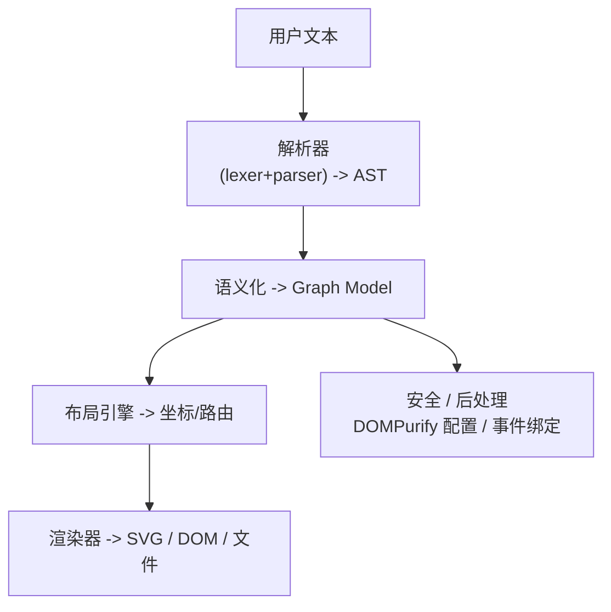

- **输入层**：支持 Markdown 内嵌（`mermaid`）、`.mmd`/纯文本、或通过 API 传入字符串。
- **解析层**：将文本词法化并生成 AST（结构化描述：节点/边/子图/属性）。（官方有独立 parser 包可用以做静态检查/测试）。
- **处理/布局层**：把 AST 转为内部 Graph Model，调用布局引擎计算节点坐标与边路由（默认 dagre，可选 ELK 等）。
- **渲染/输出层**：渲染为 SVG（浏览器端 DOM）或用 CLI 生成静态 SVG/PNG/PDF（适合 CI 预渲染）。
- **安全/后处理**：可配置 DOMPurify（`dompurifyConfig`）来控制 HTML/scripting 的允许级别，防止 XSS 等风险。

（上面每一步的数据形态：`string` → `Token[]` → `DiagramAST` → `GraphModel` → `{nodes:{x,y,w,h},edges:{path}}` → `SVG/PNG`）

## 2. 核心机制

Mermaid 的核心机制围绕 "文本解析→布局计算→图形渲染" 三个关键步骤展开：

**解析机制**：

- 采用**PEG.js**（Parsing Expression Grammar）定义各种图表的语法规则
- PEG 解析器具有 "贪婪性" 和 "无歧义性"，非常适合定义确定性的图表语言
- 解析过程：文本流→令牌 (Tokens)→抽象语法树 (AST)
- 解析器对语法错误会抛出可读性强的错误信息，便于调试

**布局机制**：
这是不同类型图表差异最大的地方，核心在于自动计算元素位置，力求清晰美观。
- **流程图/时序图/类图**：使用 **Dagre** 库作为主要布局引擎。它是一个用于**有向无环图 (DAG)** 的层级布局算法，其过程通常分为三步：**排名**（确定节点所在层级）、**排序**（调整同层节点顺序以减少交叉）、**坐标计算**（确定最终位置）。
- **饼图/甘特图**：使用自定义的确定性算法。饼图根据数据百分比计算扇形角度；甘特图根据日期顺序和持续时间计算时间轴上的块状位置。
- **其他图表**：如思维导图等，采用相应的树状或层级布局算法。

## 3. 知识模型

Mermaid 为每种图表类型定义了一套**领域特定语言 (DSL)**，其核心抽象包括：

**语法 (Syntax)**:

- 定义了合法的语句结构和元素表示方法
- 例如：在流程图中，`A[矩形]`表示矩形节点，`A --> B`表示节点间的连接
- 语法规则精确规定了如何组合这些基本元素形成完整图表

**元素抽象**:

- 节点 (Node)：表示流程图中的步骤、类图中的类、时序图中的参与者等
- 关系 (Relation)：表示元素间的连接，如流程图中的箭头、类图中的继承关系
- 属性 (Attribute)：描述元素的特性，如颜色、形状、大小等
- 容器 (Container)：用于组织相关元素，如`subgraph`定义的子图

**主题与样式 (Theme & Styling)**:

- 将图表的**语义结构**与**视觉表现**分离
- 可通过主题 (如`theme: forest`) 统一设置图表风格
- 支持通过`classDef`定义自定义样式类，灵活应用于不同元素
- 允许直接使用 CSS 样式精细化调整外观，无需修改核心逻辑代码

## 4. **数据/信息流转**

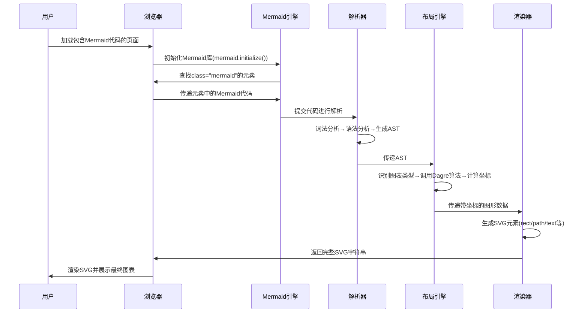

**数据和指令的流转过程[源码]：**

1. **初始化**：页面加载 Mermaid JavaScript 库。调用 `mermaid.initialize()` 初始化配置。
2. **指令获取**：Mermaid 在 DOM 中查找所有 `class="mermaid"` 的 HTML 元素，并读取其内部的文本内容（即 Mermaid 代码）。
3. **解析 (Parse)**：将文本代码传递给**解析器**。解析器根据预定义的 PEG 语法规则进行词法和语法分析，生成一颗代表图表结构的 **AST**。
4. **布局 (Layout)**：将 AST 传递给**布局渲染器**。渲染器识别图表类型为流程图，调用 **Dagre** 布局算法。Dagre 根据图的边关系计算每个节点的层级和位置，输出一个包含所有节点坐标和连接线路径的数据结构。
5. **渲染 (Render)**：基于布局算法输出的坐标和路径数据，渲染器使用 **SVG** 元素（如 `<rect>`, `<path>`, `<text>`）在内存中“绘制”出图形。
6. **输出与展示 (Output)**：将生成的完整 SVG 字符串注入到原始的 HTML `<div>` 中，替换掉之前的文本代码。浏览器解析并渲染这个 SVG 元素，用户就看到最终的流程图。

**数据和指令的流转过程：**

1. **输入（文本）**
    用户编写 Mermaid 源码（例如 `graph LR\n A-->B`）——这是一个纯字符串。

2. **词法/解析（lexer → parser）→ 返回 AST**
    字符串被送入解析器（parser），产生结构化表示（Diagram AST / JSON-like AST）。很多实现把每种图（flowchart/sequence/class/…）交给对应的 initializer/解析器模块处理。解析器通常对语法错误抛出可读错误信息。解析器包是可独立使用的（`@mermaid-js/parser` 提供 `parse()` 接口）。

   — *数据形态示例*：`string` → `Token[]` → `DiagramAST`（节点/边/子图/配置等结构）。

3. **语义化 / 中间图模型构建（AST → Graph Model）**
    AST 被转为内部的图模型（节点 Node、边 Edge、组 subgraph、属性 attrs），该模型是布局引擎与渲染器的共同输入。此阶段会合并配置（theme、classDefs、链接、注释处理等）。

4. **布局选择与坐标计算（layout engine）**
    根据配置选择布局引擎（默认 dagre；可选 ELK 等），布局引擎计算每个节点的坐标与边路由。不同引擎在算法目标（层级清晰 vs 复杂交叉优化）与可扩展性上有明显差别。

5. **渲染（renderer → DOM / SVG / PNG）**
    布局结果被渲染为 SVG/HTML 节点（浏览器端）或由 CLI 生成静态 SVG/PNG/PDF（`mermaid-cli` / `mmdc`）。渲染器处理节点形状、文本布局、箭头样式、class/theme 样式等。可选择在客户端渲染（动态、交互）或在 CI/构建时预渲染（静态、可控）。

6. **安全/后处理（sanitization、事件绑定、导出）**
    渲染到 DOM 时会经过安全策略（DOMPurify 基线/可配置），并根据 `securityLevel` / `dompurifyConfig` 决定能否运行脚本、绑定点击回调或注入自定义 HTML。务必理解和配置这些选项以避免 XSS 风险。

# 三、实践应用

## 1. 基本操作

### 1.1 流程图（Flowchart）

#### 1.1.1 图表声明与方向 (Declaration & Direction)

流程图的第一行代码用于声明图表类型和方向。

**语法：**

```
graph [方向代号]
```

或 (Mermaid 新版本推荐)

```
flowchart [方向代号]
```

**方向代号：**

| 代号 | 英文含义      | 中文含义     | 图示说明                     |
| :--- | :------------ | :----------- | :--------------------------- |
| `TB` | Top to Bottom | 从上到下     | **默认方向**，节点纵向排列   |
| `BT` | Bottom to Top | 从下到上     | 与 `TB` 相反                 |
| `RL` | Right to Left | 从右到左     | 节点横向排列，从右向左延伸   |
| `LR` | Left to Right | **从左到右** | **最常用方向**，节点横向排列 |
| `TD` | Same as TB    | 同 `TB`      | `TB` 的别名                  |

#### 1.1.2 节点 (Nodes) 类型

| 语法         | 名称          | 说明                                 |
| :----------- | :------------ | :----------------------------------- |
| `id[文本]`   | 矩形节点      | 默认节点，表示一个过程或操作         |
| `id(文本)`   | 圆角矩形节点  | 通常表示流程的**开始**或**结束**     | 
| `id{文本}`   | 菱形节点      | 表示**判断**、**决策**或**条件分支** | 
| `id((文本))` | 圆形节点      | 有时作为连接点或起终点               |
| `id>文本]`   | 非对称节点    | 类似便签形状，表示手动输入等         |
| `id{{文本}}` | 菱形 (旧语法) | 与 `id{文本}` 效果相同               | 

#### 1.1.3 连接线 (Edges) 类型

| 语法                     | 名称             | 说明                     | 渲染效果 (示意)  |
| :----------------------- | :--------------- | :----------------------- | :--------------- |
| `A --> B`                | **带箭头实线**   | 最常用，表示主要流程方向 | A ──────► B      |
| `A --- B`                | 无箭头实线       | 表示关联，无方向性       | A ────── B       |
| `A -.-> B`               | 带箭头虚线       | 表示辅助或可选流程       | A - - - - ► B    |
| `A -- 文本 --> B` | **带文本的箭头** | 在箭头上添加说明文字 | A ──"文本"──► B |
| `A ==> B`                | 加粗箭头         | 表示重要或主流程         | A ══════► B      |
| `A o--o B` `A <--> B`    | 双向箭头         | 表示相互关联或依赖       | A ◄──────► B     |
| `A -- 文本 --- B`        | 带文本的无箭头线 | 在线段中间添加文字       | A ──"文本"── B   |
| `A -.- B`                | 无箭头虚线       | 表示弱的、无方向关联     | A - - - - B      | 

#### 1.1.4 子图与注释

| 语法                         | 名称     | 说明                         | 示例                                    |
| :--------------------------- | :------- | :--------------------------- | :-------------------------------------- |
| `subgraph title` `...` `end` | **子图** | 将多个节点分组，形成模块     | `subgraph 模块A` <br>`A1 --> A2` <br>`end`      |
| `%% 注释文本`                | 注释     | 在代码中添加注释，不会被渲染 | `%% 这是一行注释` |

#### 1.1.5 样式与交互

| 语法                                             | 名称         | 说明                             | 示例                                                         |
| :----------------------------------------------- | :----------- | :------------------------------- | :----------------------------------------------------------- |
| `style id css;`                                  | **直接样式** | 为特定节点添加CSS样式            | `style A fill:#f9f,stroke:#333`                              |
| `classDef className css;` `class id className;`  | **样式类**   | 定义样式类并应用于节点           | `classDef highlight fill:#f96;` `class A highlight;`         |
| `click id callback "tip"` `click id "url" "tip"` | **点击交互** | 为节点定义点击事件（需安全配置） | `click A "https://example.com"` `click B callback "点击了我！"` |

**常用CSS样式属性:**

- `fill: color`：内部填充颜色 (e.g., `#ff6`, `red`)
- `stroke: color`：边框颜色
- `stroke-width: npx`：边框粗细
- `color: color`：文字颜色
- `border-radius: npx`：边框圆角 (对矩形节点有效)

**颜色配置**

1. Mermaid 支持的 4 种颜色表示类型

| 颜色类型        | 语法格式                               | 优点                          | 适用场景                         | 示例代码                                        |
| --------------- | -------------------------------------- | ----------------------------- | -------------------------------- | ----------------------------------------------- |
| 英文单词        | `color: 颜色名`                        | 直观易记，无需记数值          | 快速配置基础色（如红、绿、蓝）   | `fill: red`、`stroke: blue`                     |
| 十六进制（Hex） | `color: #RRGGBB` 或 `#RGB`             | 颜色精准，支持 1600 万 + 色值 | 需匹配设计规范（如品牌色）       | `fill: #ff0000`、`stroke: #f00`                 |
| RGB/RGBA        | `color: rgb(R,G,B)` 或 `rgba(R,G,B,A)` | 支持透明度（RGBA 的 A 值）    | 半透明效果（如叠加层、弱化节点） | `fill: rgb(255,0,0)`、`fill: rgba(255,0,0,0.5)` |
| HSL/HSLA        | `color: hsl(H,S,L)` 或 `hsla(H,S,L,A)` | 便于调整亮度 / 饱和度         | 动态调整颜色（如明暗变体）       | `fill: hsl(0,100%,50%)`（红色）                 |


2. 高频常用颜色值

| 功能分类   | 颜色名         | 视觉效果 | 适用元素（节点 / 连线 / 背景） |                                  |
| ---------- | -------------- | -------- | ------------------------------ | -------------------------------- |
| 基础色     | black（黑）    | 纯黑     | 边框、文本（突出重点）         | `stroke: black`、`color: black`  |
|            | white（白）    | 纯白     | 节点背景（浅色主题）           | `fill: white`                    |
|            | gray（灰）     | 中灰     | 辅助线、次要节点               | `stroke: gray`                   |
|            | silver（银灰） | 浅灰     | 边框、分隔线                   | `stroke: silver`                 |
| 业务状态色 | red（红）      | 纯红     | 错误节点、失败连线             | `fill: red`、`stroke: red`       |
|            | green（绿）    | 纯绿     | 成功节点、完成连线             | `fill: green`、`stroke: green`   |
|            | blue（蓝）     | 纯蓝     | 核心节点、主要流程             | `fill: blue`、`stroke: blue`     |
|            | yellow（黄）   | 纯黄     | 警告节点、待处理流程           | `fill: yellow`、`stroke: yellow` |
|            | orange（橙）   | 橙色     | 提醒节点、中间状态             | `fill: orange`、`stroke: orange` |
| 柔和色     | pink（粉）     | 浅粉     | 非核心节点、辅助说明           | `fill: pink`                     |
|            | purple（紫）   | 纯紫     | 特殊流程、外部接口节点         | `fill: purple`                   |
|            | cyan（青）     | 青色     | 数据相关节点（如数据库、接口） | `fill: cyan`                     |

**示例**：

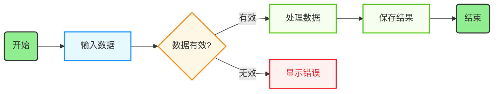

### 1.2 时序图（Sequence Diagram）

- **声明方式**：`sequenceDiagram`
- **常用语法**：
  - `Alice->>Bob: 消息` 实线箭头
  - `Alice-->>Bob: 异步消息`
  - `Note over A,B: 说明`
  - `alt / else / end` 条件分支

**示例**：

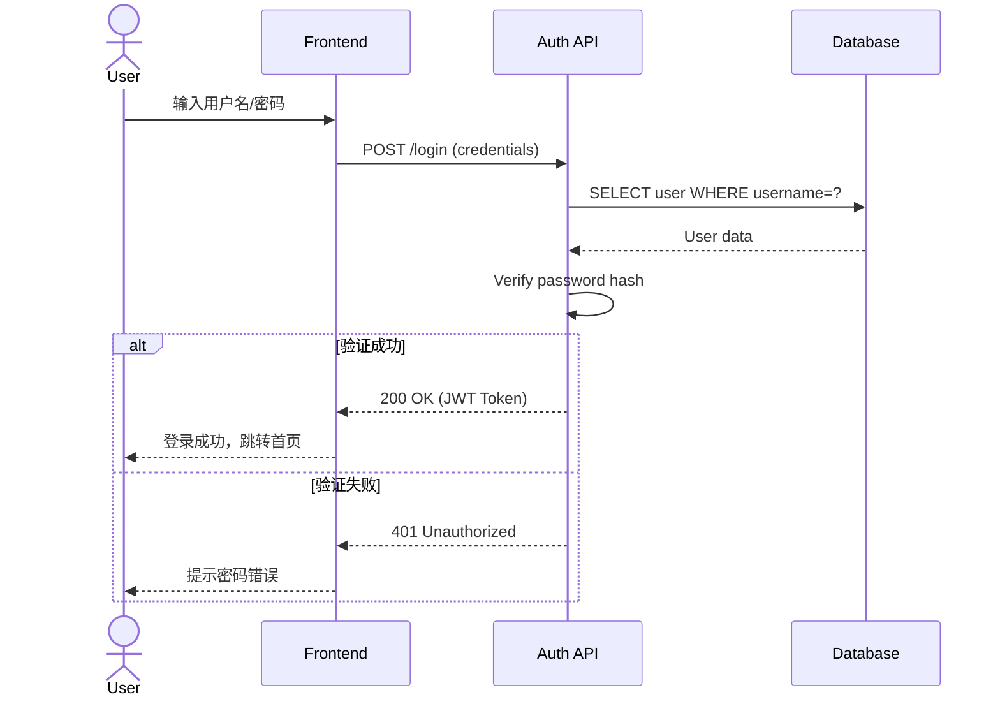

------

### 1.3 甘特图（Gantt Chart）

- **声明方式**：`gantt`
- **时间定义**：`dateFormat YYYY-MM-DD`
- **常见语法**：
  - `section 模块名称`
  - `任务名 :id, 开始时间, 持续时间`
  - `任务名 :id, after anotherId, 持续时间`

**示例**：

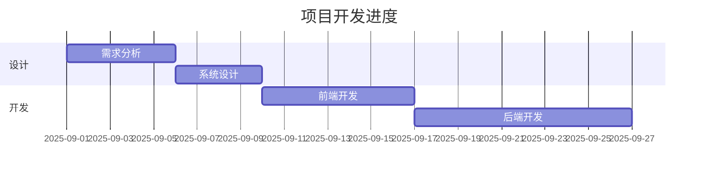

------

### 1.4 类图（Class Diagram）

- **声明方式**：`classDiagram`
- **常见语法**：
  - `class 类名 { 属性; 方法() }`
  - `A <|-- B` 继承
  - `A *-- B` 组合
  - `A o-- B` 聚合
  - `+`(public), `-`(private), `#`(protected), `~`(package/internal)

**示例**：

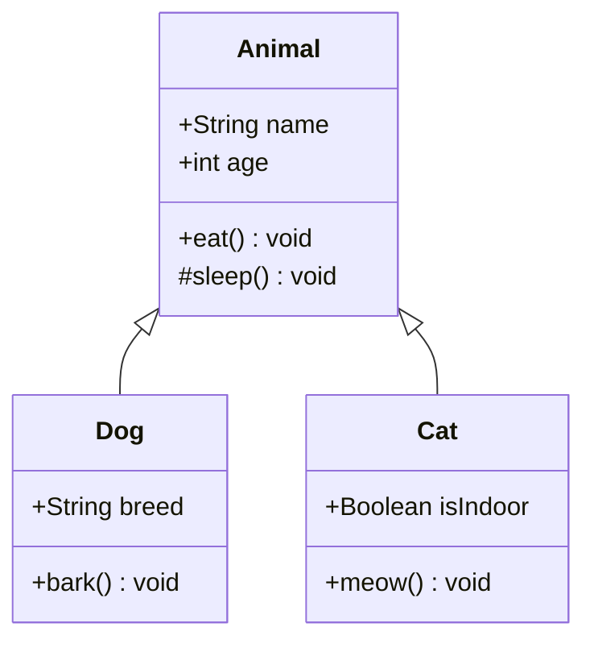

------

### 1.5 状态图（State Diagram）

- **声明方式**：`stateDiagram-v2`
- **常见语法**：
  - `[ * ] --> 状态A` 初始状态
  - `状态A --> 状态B : 条件`
  - `state 状态X { 子状态 }` 嵌套

**示例**：

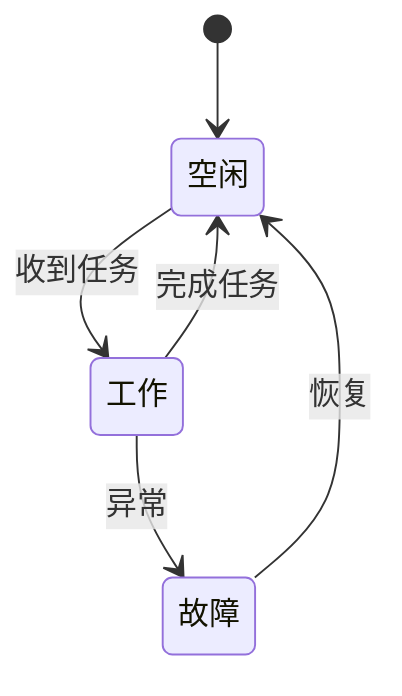

------

## 2. 典型案例

- **需求分析文档**：用流程图快速表达系统逻辑。
- **接口交互**：用时序图描述用户与服务的调用关系。
- **项目管理**：用甘特图规划开发周期。
- **系统建模**：用类图展示模块/对象关系。
- **状态机设计**：用状态图建模业务生命周期。

------

## 3. 常见问题与解决

| 常见错误                 | 原因分析                       | 解决办法                                                     |
| --------------------- | -------------------------- | ------------------------------------------------------------ |
| 图显示不全 / 节点重叠 | 节点过多，默认布局计算不足 | 使用 `graph TB` 调整方向；或通过 `%%{ init: { "themeVariables": { "fontSize": "12px" }}}%%` 控制样式 |
| 中文乱码              | 默认字体不支持中文         | 在主题中设置 `"fontFamily": "SimHei, Arial"`                 |
| 箭头不显示            | 语法写错                   | 检查 `-->` 是否多空格，或是否和节点名连在一起                |
| 样式配置无效          | 没加全局配置块             | 使用 `%%{init: { "theme": "forest"}}%%` 或 `style 节点 fill:#f9f,stroke:#333` |
| 图太大溢出            | 默认容器宽度限制           | 设置 `mermaid.initialize({ startOnLoad: true, theme: "default", flowchart: { useMaxWidth: false }})` |
| 颜色不生效（如`fill: red`无效果）  | 1. 语法错误（漏写冒号 / 分号）；2. 样式优先级冲突（inline 样式覆盖类样式） | 1. 检查语法：`fill: red;`（必须带冒号和分号）；2. 确认优先级：inline 样式（`style A fill:red`）> 类样式 |
| 十六进制颜色显示异常               | 漏写开头的`#`（如`ff0000` instead of `#ff0000`）             | 补全`#`：`fill: #ff0000;`                                    |
| RGBA 颜色透明效果不显示            | 1. A 值超出 0~1 范围（如`rgba(255,0,0,2)`）；2. 旧版本不支持 RGBA | 1. 修正 A 值：`rgba(255,0,0,0.5)`；2. 升级 Mermaid 到 v8.0+  |
| 文本颜色与背景色冲突（如白字白底） | 未同时配置`color`（文本色）和`fill`（背景色）                | 成对配置：`fill: blue; color: white;`（蓝底白字）            |

## 4. 应用场景

1. **小型笔记**：
   - 用 **流程图** 概括学习路径。
   - 用 **时序图** 说明 API 调用顺序。
2. **团队文档**：
   - 项目计划 → **甘特图**。
   - 系统架构说明 → **类图**。
3. **生产级文档**：
   - 使用 `mermaid-cli (mmdc)` 生成 SVG/PNG，嵌入到 Confluence、Wiki。
   - 配置主题（颜色、边框、字号）形成团队统一风格。
4. **高级实践**：
   - 在 CI/CD 中调用 `mermaid-cli` 自动渲染最新设计文档。
   - 与前端系统集成：运行时动态生成流程图（如根据数据结构绘制）。

------

## 配置技巧

**配置优先级**：`init < themeVariables < classDef/class < style`

### 1. 初始化配置（全局配置）

通过 `%%{init: {...}}%%` 在代码块开头进行全局初始化，设置主题、字体、配色等。

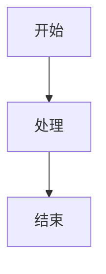

✅ 适用场景：整体图表风格控制（背景、颜色、字体统一）。

------

### 2. 主题与样式（classDef / class）

`classDef` 定义一类节点的样式，`class` 将节点应用到该类。

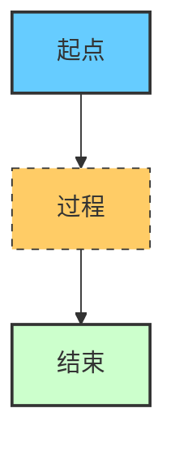

✅ 适用场景：为同一类节点统一配置样式，多节点配置如下图。

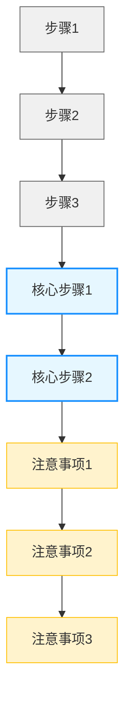

------

### 3. 节点样式配置（style）

`style` 可直接对单个节点设置样式。

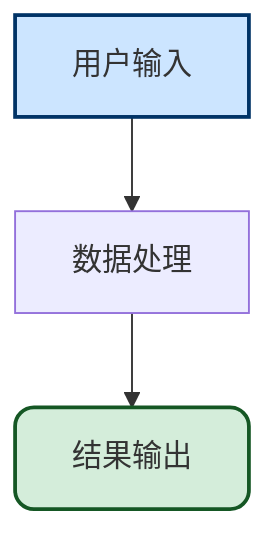

✅ 适用场景：单个节点需要特殊高亮或单独样式。

------

### 4. 连线样式配置（linkStyle）

`linkStyle` 用于修改边（连线）的样式，通过编号指定。编号从 `0` 开始，按图中边的定义顺序排列。

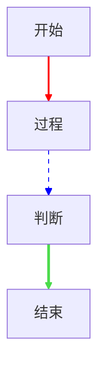

✅ 适用场景：标记重点流程路径，突出显示某些关系。

------

### 5. 调整图表整体大小[待后续实践typora大小调节存在异常]

#### 核心配置参数

调整图表大小主要涉及两类参数：**布局间距参数**（控制节点之间的距离）和 **节点样式参数**（控制节点本身的大小）。

| 类别         | 配置参数             | 作用范围                                         | 说明                                           | 默认值 | 推荐调整范围       |
| ------------ | -------------------- | ------------------------------------------------ | ---------------------------------------------- | ------ | ------------------ |
| **布局间距** | `nodeSpacing`        | 同一层级节点的**水平间距**（如 A、B 横向距离）   | 数值越小，水平方向越紧凑                       | 30     | 15-20              |
|              | `rankSpacing`        | 不同层级节点的**垂直间距**（如 A 与 D 纵向距离） | 数值越小，垂直方向越紧凑                       | 50     | 20-30              |
| **节点大小** | `fontSize`           | 全局字体大小（节点内容文字大小）                 | 字体越小，节点整体尺寸越小（节点随文字自适应） | 12px   | 10-11px            |
|              | `nodeWidth`（可选）  | 节点最小宽度（固定节点宽度，不常用）             | 强制节点宽度，可能导致文字换行                 | 自动   | 80-120（单位：px） |
|              | `nodeHeight`（可选） | 节点最小高度（固定节点高度，不常用）             | 强制节点高度，可能导致空白过多                 | 自动   | 30-50（单位：px）  |

#### 具体配置方法

通过 **`%%{init: {...}}%%` 内联配置**（放在流程图最顶部）统一设置上述参数，修改后的代码如下（含详细注释）：


