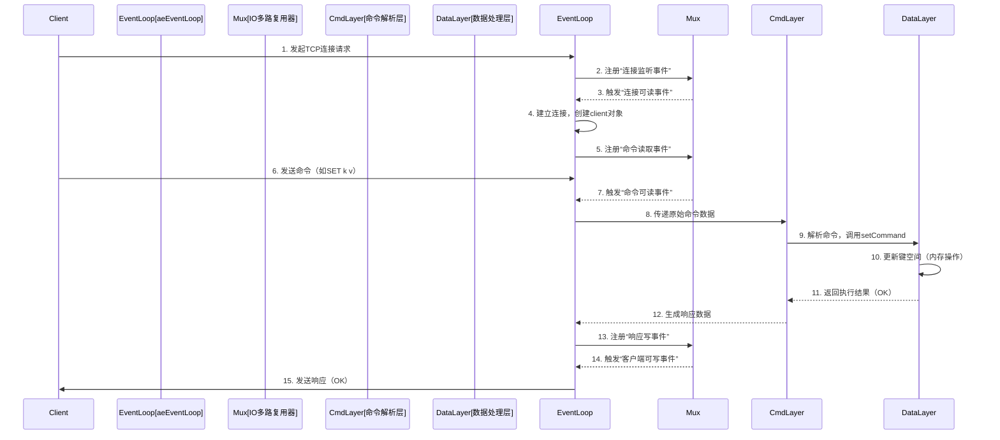
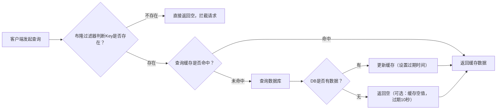
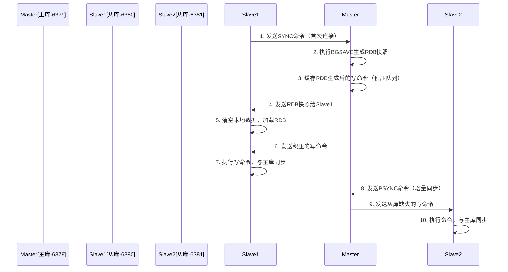
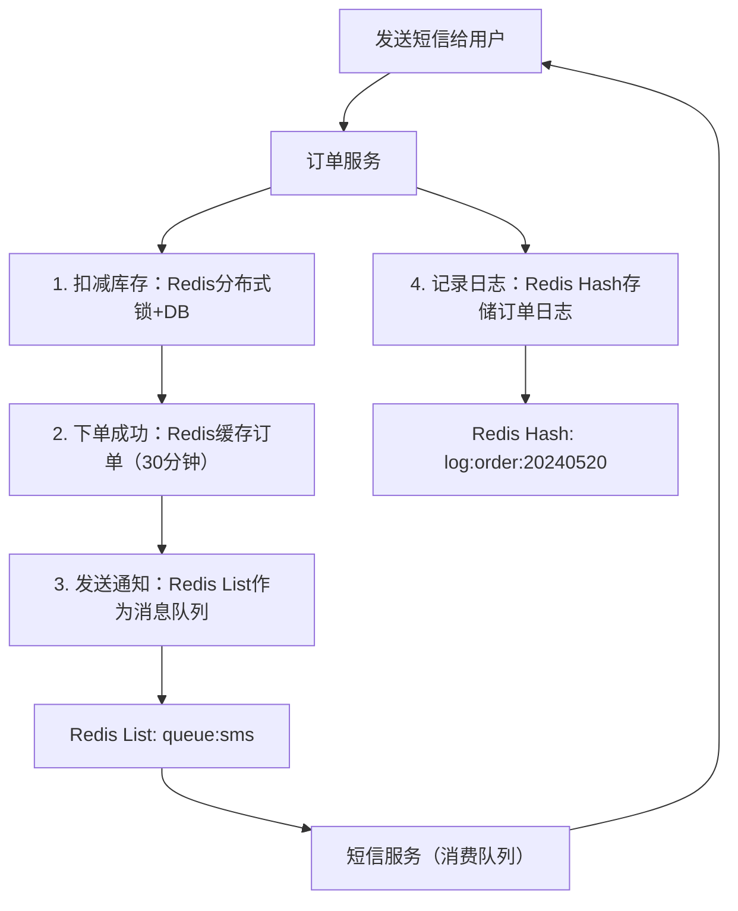
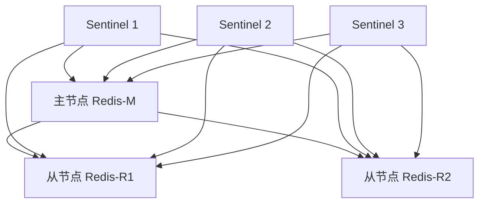
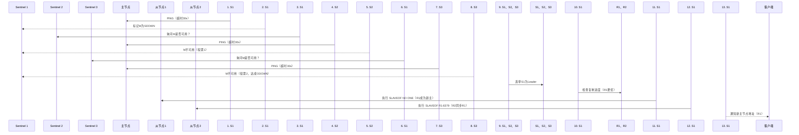
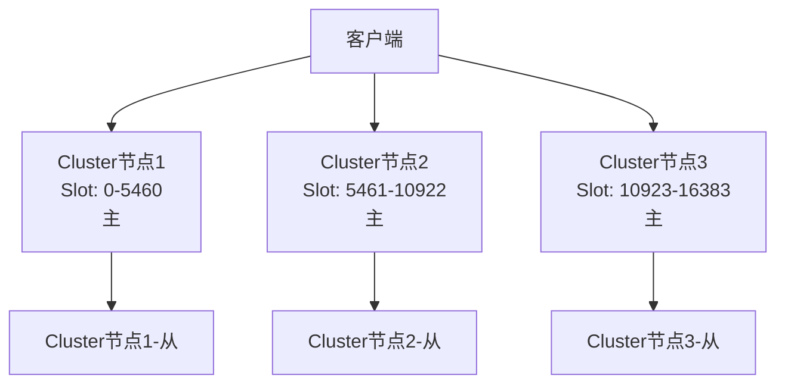

# 一、认知定位（Why & What）
## 1. 背景与起源：诞生的驱动力、解决的核心问题
### 1.1 诞生背景
- 时间与作者：2009年由意大利开发者Salvatore Sanfilippo（别名antirez）开发，最初作为个人项目开源，后逐步形成成熟社区生态，现为Redis Labs维护的顶级开源项目
- 技术痛点：2000年后Web应用进入高并发时代，传统关系型数据库（如MySQL）基于磁盘存储，在高频读写场景（如商品库存计数、用户会话存储）下存在IO延迟高（毫秒级）、吞吐量不足（单机千级QPS）的问题；同时，早期缓存工具（如Memcached）仅支持简单字符串键值对，无法满足复杂数据操作（如排行榜、消息队列）需求
- 设计目标：根据`mcpserver.redis.docs("Introduction")`官方定义，Redis核心目标是提供“**低延迟、高吞吐、支持多数据结构**的内存存储系统”，同时通过持久化机制平衡内存存储的易失性缺陷

### 1.2 解决的核心问题
- 高并发读写瓶颈：以内存为主要存储介质，将数据访问延迟降至微秒级（平均1-5ms），单机QPS可轻松支撑10万级，解决传统数据库磁盘IO的性能短板
- 数据结构单一局限：突破Memcached仅支持字符串的限制，原生提供String、Hash、List、Set、Sorted Set等8种核心数据结构，直接覆盖业务场景（如List实现消息队列、Sorted Set实现实时排行榜），无需业务层二次封装
- 内存数据易失性：通过RDB（快照）和AOF（追加日志）两种持久化机制，实现内存数据的磁盘兜底，避免进程崩溃或机器宕机导致的数据丢失
- 分布式协作需求：原生支持分布式锁（SET NX）、计数器（INCR）、发布订阅（Pub/Sub）等功能，解决多服务实例间的协同问题（如分布式环境下的库存扣减防超卖）


## 2. 核心本质：最简化的核心模型（抽象本质）
### 2.1 核心模型抽象
Redis的最简化模型可概括为“**三层架构的键值存储体系**”，核心是“基于内存的高效数据映射+可选持久化保障”，具体结构如下：
1. 接口层：提供统一的键（Key）操作入口，Key统一为字符串类型，支持通过Key对不同类型的Value执行CRUD（增删改查）操作，屏蔽底层数据结构差异
2. 数据结构层：内存中维护多样化数据结构实例（如哈希表、双向链表、跳表等），每种数据结构对应特定Value类型，通过高效算法（如跳表实现Sorted Set的O(logN)查询）保障操作性能
3. 持久化层：可选的RDB/AOF模块，将内存数据异步/同步写入磁盘，实现“内存优先（高性能）、磁盘兜底（高可靠）”的存储策略，用户可根据业务需求选择开启/关闭

### 2.2 核心运行特征
- 单线程事件循环：核心IO与数据操作采用单线程模型（避免多线程上下文切换开销），通过IO多路复用（epoll/kqueue）处理万级并发连接，在高并发场景下性能更稳定
- 无结构化存储：不支持SQL语法与固定表结构，以键值对为最小存储单元，属于“非关系型数据库（NoSQL）”范畴，更适合非结构化/半结构化数据（如用户会话、临时配置）
- 多功能集成：除核心存储外，集成缓存淘汰（LRU/LFU/TTL等策略）、过期键自动删除、事务（Multi/Exec）、Lua脚本（原子性操作）等功能，形成“存储+工具”一体化解决方案


## 3. 定位与关系：在技术体系中的位置、与同类事物的对比（替代/互补关系）
### 3.1 在技术体系中的定位
Redis在典型Web架构中处于“**应用层与数据库层之间的中间件层**”，主要承担以下角色：
- 一级缓存：直接承接应用层80%以上的高频读请求（如用户登录态、商品详情页），减轻数据库层的访问压力，降低数据库IO负载
- 分布式协作工具：通过分布式锁、计数器、Pub/Sub等功能，实现微服务架构下多实例的协同（如分布式事务简化方案、跨服务消息通知）
- 轻量级主存储：在数据量小（GB级以内）、访问频率高的场景（如实时排行榜、在线用户数统计）中，可直接作为主存储使用，替代部分数据库功能
- 临时数据载体：存储短期有效数据（如验证码、临时会话），利用过期键机制自动清理无效数据，降低存储成本与垃圾数据管理开销

### 3.2 与同类产品的对比（市占率Top3场景）
| 对比维度         | Redis                          | Memcached（传统缓存）          | MySQL（关系型数据库）          | MongoDB（文档型NoSQL）         |
|------------------|--------------------------------|--------------------------------|--------------------------------|--------------------------------|
| 核心定位         | 多结构内存存储+缓存            | 单一结构（字符串）内存缓存      | 磁盘-based关系型数据库          | 磁盘-based文档型存储           |
| 数据结构支持     | String/Hash/List/Set/Sorted Set等8种 | 仅支持字符串                   | 表结构（行/列），需预定义Schema | 文档结构（JSON-like），无Schema |
| 持久化能力       | 支持RDB/AOF双机制              | 不支持（内存数据易失）          | 支持（事务日志+快照）           | 支持（Journal+快照）           |
| 单机QPS（参考）  | 10万-15万                      | 8万-12万                       | 1千-5千（未优化）               | 1万-3万                        |
| 核心优势         | 性能与功能均衡，多场景适配     | 极致简单，内存占用低           | 事务一致性（ACID），复杂查询强   | 复杂文档存储，Schema灵活       |
| 核心劣势         | 内存成本高，大数据量存储受限   | 功能单一，无持久化             | 高并发场景性能弱               | 高频读写性能弱于Redis          |
| 关系类型         | 部分替代Memcached，互补MySQL   | 被Redis部分替代（简单场景保留） | 与Redis强互补（缓存-数据库）    | 特定场景替代（按业务选择）     |

### 3.3 替代与互补关系说明
- 与Memcached：**部分替代关系**。Redis在功能（多数据结构、持久化）和性能（单线程模型减少开销）上全面优于Memcached，仅在“超大规模简单字符串缓存”场景（如纯静态资源URL缓存）中，Memcached因内存占用更低（无额外数据结构开销）仍有少量使用
- 与MySQL：**强互补关系**。Redis作为“前端缓存”承接高频读请求，仅将低频写请求（如订单创建）和复杂查询（如多表联查）转发至MySQL，形成“缓存+数据库”经典架构，二者协同保障系统高性能与数据一致性
- 与MongoDB：**特定场景替代关系**。“高频读写+简单数据结构”（如实时计数器）场景用Redis替代MongoDB；“复杂文档存储+低频读写”（如用户画像、商品详情富文本）场景用MongoDB替代Redis，无绝对替代关系，需按业务场景特性选择

# 二、原理支撑（How - Theory）
## 1. 体系结构：核心组件、组件关系、整体架构图
### 1.1 核心组件拆解
Redis 采用“分层+模块化”架构，核心组件可分为 5 层，各组件职责单一且协同紧密，具体如下：
- **网络 IO 层**：负责客户端连接管理与数据传输，核心是`aeEventLoop`（事件循环）与 IO 多路复用器（如 Linux 的 epoll、BSD 的 kqueue），支持 TCP 连接、TLS 加密（Redis 6+），同时处理连接建立/关闭、请求读取/响应发送。
- **命令解析层**：接收网络层传递的原始命令（如`SET key value`），通过`redisCommandTable`（命令表）匹配命令处理器，完成命令合法性校验（如参数数量、权限）、命令参数解析（将字符串参数转为内部数据结构）。
- **数据处理层**：Redis 核心功能层，包含两大核心模块：
  - 键空间管理：维护全局`dict`（哈希表），存储 Key 与 Value 的映射关系，Key 统一为字符串类型，Value 关联具体数据结构实例（如`redisObject`）。
  - 数据结构实现：针对不同 Value 类型提供高效实现，如 Hash 用“哈希表+压缩列表”（Redis 7 前）、List 用“双向链表+压缩列表”、Sorted Set 用“跳表+哈希表”，确保增删改查操作的时间复杂度最优（如 Sorted Set 查找为 O(logN)）。
- **持久化层**：可选模块，负责将内存数据同步到磁盘，避免数据丢失，包含两个子模块：
  - RDB 模块：生成内存数据的“快照文件”（.rdb），支持手动（`SAVE`/`BGSAVE`）与自动（配置`save 900 1`等规则）触发，采用“写时复制（COW）”机制避免阻塞主进程。
  - AOF 模块：记录所有写命令（如`SET`/`INCR`）到日志文件（.aof），支持三种刷盘策略（`always`/`everysec`/`no`），通过“命令重放”恢复数据，Redis 7+ 支持 AOF 结构化存储（将命令转为二进制格式，减少体积）。
- **辅助功能层**：提供支撑性能力，包含：
  - 过期键管理：维护过期键字典（`expires`），实现键的自动删除。
  - 缓存淘汰：当内存达到`maxmemory`时，触发淘汰策略（如 LRU/LFU）删除部分键。
  - 事务与 Lua 脚本：支持`MULTI/EXEC`事务（批量命令原子执行）、Lua 脚本（通过`EVAL`执行，保证脚本内命令原子性）。


### 1.2 整体架构图（Mermaid）
```mermaid
graph TD
    subgraph 客户端层
        Client1[客户端1-TCP]
        Client2[客户端2-TLS]
        Client3[客户端3-集群模式]
    end

    subgraph Redis 服务端
        subgraph 1.网络IO层
            EventLoop[aeEventLoop 事件循环]
            Mux[IO多路复用器-epoll]
            ConnMgr[连接管理器]
        end

        subgraph 2.命令解析层
            CmdParser[命令解析器]
            CmdTable[redisCommandTable 命令表]
            CmdCheck[合法性校验]
        end

        subgraph 3.数据处理层
            KeySpace[键空间-dict]
            String[数据结构-String]
            Hash[数据结构-Hash]
            List[数据结构-List]
            SSet[数据结构-Sorted Set]
        end

        subgraph 4.持久化层
            RDB[RDB模块-快照]
            AOF[AOF模块-命令日志]
        end

        subgraph 5.辅助功能层
            Expire[过期键管理]
            Evict[缓存淘汰]
            Lua[Lua脚本引擎]
        end
    end

    Client1 --> ConnMgr
    Client2 --> ConnMgr
    Client3 --> ConnMgr
    ConnMgr --> Mux
    Mux --> EventLoop
    EventLoop --> CmdParser
    CmdParser --> CmdTable
    CmdParser --> CmdCheck
    CmdCheck --> KeySpace
    KeySpace --> String
    KeySpace --> Hash
    KeySpace --> List
    KeySpace --> SSet
    KeySpace --> Expire
    KeySpace --> Evict
    String --> RDB
    Hash --> RDB
    String --> AOF
    Hash --> AOF
    CmdCheck --> Lua
end
```


## 2. 核心机制：支撑运行的关键原理
### 2.1 单线程事件循环机制（性能核心）
Redis 核心操作（命令执行、数据读写）采用**单线程模型**，通过 IO 多路复用实现高并发，是其“低延迟、高吞吐”的核心原因。
#### 2.1.1 运行步骤（文字化）
1. 初始化阶段：Redis 启动时创建`aeEventLoop`实例，初始化 IO 多路复用器，注册“监听端口事件”（如 6379 端口的 TCP 连接事件）。
2. 连接处理：当客户端发起连接时，IO 多路复用器触发“读事件”，单线程执行连接建立逻辑（创建`client`对象、绑定文件描述符），并将客户端连接的“命令读取事件”注册到事件循环。
3. 命令处理：
   - 步骤 1：IO 多路复用器监听已连接客户端的“读事件”，当客户端发送命令时，触发事件并读取原始命令数据。
   - 步骤 2：将原始命令传递给命令解析层，匹配命令处理器（如`setCommand`）。
   - 步骤 3：单线程执行命令逻辑（如`SET`命令更新键空间、`GET`命令查询键空间），期间不阻塞（因所有操作均为内存操作）。
4. 响应发送：命令执行完成后，生成响应数据（如`OK`、键值），注册“写事件”到事件循环，当客户端可写入时，单线程将响应发送给客户端。
5. 循环执行：事件循环持续循环，重复“监听事件→处理事件→发送响应”流程，期间穿插执行定时任务（如过期键删除、RDB 自动触发）。

#### 2.1.2 事件循环时序图（Mermaid）



### 2.2 持久化机制（RDB vs AOF）
Redis 持久化的核心是“平衡性能与数据安全性”，提供 RDB 和 AOF 两种机制，可单独启用或同时启用，二者核心差异如下：
#### 2.2.1 机制原理对比
| 对比维度         | RDB（快照持久化）                          | AOF（Append-Only File）                    |
|------------------|--------------------------------------------|--------------------------------------------|
| 核心原理         | 定期生成内存数据的完整快照（二进制文件）    | 实时记录所有写命令到日志文件（文本/二进制）|
| 数据完整性       | 可能丢失“最后一次快照到崩溃前”的数据        | 可配置为“不丢数据”（`appendfsync always`）  |
| 文件体积         | 小（二进制压缩存储）                        | 大（记录命令，需定期重写）                  |
| 恢复速度         | 快（直接加载二进制数据到内存）              | 慢（需重放所有命令）                        |
| 对主进程影响     | 手动`SAVE`阻塞主进程；`BGSAVE`用子进程，COW 机制低影响 | 刷盘策略决定：`always`阻塞，`everysec`低阻塞 |
| 适用场景         | 数据备份（如每日全量备份）、容忍部分数据丢失的场景 | 对数据安全性要求高（如金融交易记录）        |

#### 2.2.2 混合持久化（Redis 4.0+）
为解决 RDB 恢复慢、AOF 体积大的问题，Redis 4.0 引入“混合持久化”（需配置`aof-use-rdb-preamble yes`），原理如下：
1. AOF 重写时，先将当前内存数据以 RDB 格式写入 AOF 文件头部。
2. 再将重写期间产生的新写命令以 AOF 格式追加到文件尾部。
3. 恢复时，先加载 RDB 部分（快速恢复大部分数据），再重放 AOF 部分（恢复最新数据），兼顾恢复速度与数据完整性。


### 2.3 过期键删除机制
Redis 通过“三级删除策略”实现过期键自动清理，平衡“内存占用”与“CPU 开销”，具体如下：
- **1. 惰性删除**：仅在访问键时（如`GET key`）检查是否过期，若过期则删除键并返回`nil`。优点是不消耗额外 CPU（仅在访问时处理），缺点是过期键可能长期占用内存（如“僵尸键”）。
- **2. 定期删除**：Redis 事件循环中每 100ms 执行一次“过期键扫描任务”，步骤为：
  1. 从`expires`字典（存储所有过期键）中随机抽取 20 个键。
  2. 删除其中已过期的键，若过期键占比超过 25%，则重复步骤 1（避免过期键堆积）。
  3. 每次扫描耗时不超过 25ms（避免阻塞主进程）。
- **3. 内存淘汰触发删除**：当内存达到`maxmemory`且无过期键可删时，触发缓存淘汰策略（如 LRU），删除部分非过期键，间接释放内存（可视为过期键删除的补充）。


## 3. 抽象建模：如何将现实问题转化为技术模型
### 3.1 核心建模逻辑
Redis 的抽象建模遵循“**业务场景→数据特征→数据结构匹配**”的路径，核心是“用最小的技术成本满足业务需求”，即通过原生数据结构直接映射业务实体，避免业务层二次开发。


### 3.2 典型场景建模案例
#### 3.2.1 场景1：实时排行榜（如用户积分榜）
- **业务需求**：按用户积分降序排列，支持查询“用户排名”“Top N 用户”“用户积分修改”，要求操作延迟低（毫秒级）。
- **数据特征**：需“键（用户ID）→值（积分）”映射，且支持按值排序、快速查询排名。
- **技术建模**：用 **Sorted Set** 实现，映射关系如下：
  - Sorted Set 的`Key`：业务标识（如`user:score:rank`）。
  - Sorted Set 的`Member`：用户ID（如`user:1001`）。
  - Sorted Set 的`Score`：用户积分（如 950）。
- **核心命令**：
  - 积分修改：`ZADD user:score:rank 950 user:1001`（自动更新排序）。
  - Top 10 查询：`ZREVRANGE user:score:rank 0 9 WITHSCORES`（降序取前10）。
  - 用户排名：`ZRANK user:score:rank user:1001`（返回升序排名，需转换为降序）。


#### 3.2.2 场景2：分布式锁（如库存扣减防超卖）
- **业务需求**：多服务实例竞争同一资源（如库存），需保证“同一时间仅一个实例操作资源”，避免并发冲突。
- **数据特征**：需“资源标识→锁持有者”映射，且支持“原子性抢占”“自动释放”。
- **技术建模**：用 **String + SET NX 命令** 实现，映射关系如下：
  - String 的`Key`：资源标识（如`lock:stock:1001`，1001为商品ID）。
  - String 的`Value`：锁持有者标识（如`service:A:pid:1234`，便于排查死锁）。
- **核心逻辑**：
  1. 抢占锁：`SET lock:stock:1001 service:A:pid:1234 NX EX 10`（NX=仅不存在时设置，EX=10秒过期自动释放）。
  2. 释放锁：用 Lua 脚本原子执行（避免误删他人锁）：
     ```lua
     if redis.call("GET", KEYS[1]) == ARGV[1] then
         return redis.call("DEL", KEYS[1])
     else
         return 0
     end
     ```


### 3.3 核心抽象概念
- **Key-Value 映射**：Redis 最底层抽象，所有业务数据均通过“唯一 Key”标识，Value 关联具体数据结构，屏蔽业务实体差异（如用户、订单、排行榜均统一为 Key-Value 对）。
- **数据结构与 Value 绑定**：Value 并非原始数据，而是`redisObject`（包含类型、编码、指针），指针指向具体数据结构实例（如哈希表、跳表），实现“同一 Value 类型支持多种底层编码”（如 List 用双向链表或压缩列表），兼顾性能与内存占用。
- **过期时间模型**：独立维护`expires`字典，存储 Key 与过期时间的映射，不与 Value 绑定，实现“所有 Key 统一过期管理”，支持灵活的过期策略（如惰性删除、定期删除）。


## 4. 流转逻辑：数据/信息/指令的传递路径与触发条件
### 4.1 读请求流转（以`GET key`为例）
#### 4.1.1 文字化步骤
1. 客户端通过 TCP 发送`GET key`命令，Redis 网络 IO 层的事件循环监听“读事件”，读取命令数据并传递给命令解析层。
2. 命令解析层匹配`getCommand`处理器，校验参数（仅需 1 个 Key 参数），解析出目标 Key（如`user:name`）。
3. 数据处理层查询键空间：
   3.1 先检查`expires`字典，若 Key 已过期，执行惰性删除，返回`nil`。
   3.2 若 Key 未过期，从全局哈希表（`dict`）中查询 Key 对应的`redisObject`（Value）。
   3.3 根据`redisObject`的类型（如 String），调用对应数据结构的读取方法（如`stringGet`），获取 Value 原始数据。
4. 命令解析层将 Value 数据封装为响应格式（如 Bulk String 类型），传递给网络 IO 层。
5. 网络 IO 层注册“写事件”，当客户端可写入时，发送响应数据（如`"zhangsan"`），完成读请求流转。

#### 4.1.2 读请求流程图（Mermaid）


### 4.2 写请求流转（以`SET key value EX 10`为例）
#### 4.2.1 文字化步骤
1. 客户端发送`SET key value EX 10`命令，网络 IO 层读取命令并传递给命令解析层。
2. 命令解析层匹配`setCommand`处理器，校验参数（Key、Value、EX 过期时间），解析出 Key（如`user:name`）、Value（如`zhangsan`）、过期时间（10秒）。
3. 数据处理层执行写逻辑：
   3.1 检查 Key 是否已存在，若存在则删除原`redisObject`（避免内存泄漏）。
   3.2 创建新的`redisObject`（类型为 String，编码为 RAW 或 EMBSTR），关联 Value 数据。
   3.3 将 Key 与`redisObject`写入全局 dict，完成内存更新。
   3.4 若指定过期时间（EX 10），将 Key 与“当前时间+10秒”写入`expires`字典。
4. 若开启 AOF 持久化：
   4.1 将`SET key value EX 10`命令追加到 AOF 缓冲区（`aof_buf`）。
   4.2 根据`appendfsync`策略（如`everysec`），异步将缓冲区数据刷写到 AOF 文件。
5. 若开启 RDB 持久化且触发自动快照条件（如`save 900 1`），则异步启动`BGSAVE`子进程，生成 RDB 快照。
6. 命令解析层封装响应（如`OK`），网络 IO 层发送响应给客户端，完成写请求流转。


### 4.3 关键触发条件
- **持久化触发**：
  - RDB 手动触发：执行`SAVE`（阻塞主进程）或`BGSAVE`（异步）命令。
  - RDB 自动触发：满足配置的快照规则（如`save 3600 1`：3600秒内至少1次写操作）、执行`FLUSHALL`/`FLUSHDB`命令、主从复制时主节点生成快照。
  - AOF 刷盘触发：`appendfsync always`（每次写命令均刷盘）、`appendfsync everysec`（每秒刷盘）、`appendfsync no`（由操作系统决定刷盘）。
- **过期键删除触发**：访问过期键（惰性删除）、事件循环定时任务（定期删除）、内存达到`maxmemory`（缓存淘汰触发）。
- **命令执行触发**：客户端发送命令后，网络 IO 层通过 IO 多路复用触发“读事件”，启动命令解析与执行流程。

# 三、实践应用（How - Practice）
## 1. 基础操作：最小可用技能集（安装、配置、核心API）
### 1.1 环境安装（主流方案）
#### 1.1.1 Linux 系统安装（CentOS 7/Ubuntu 20.04）
以 Redis 7.2 为例（当前稳定版，参考`mcpserver.redis.docs("Installation")`），步骤如下：
1. 依赖安装：
   - CentOS：`yum install -y gcc make`
   - Ubuntu：`apt update && apt install -y gcc make`
2. 下载源码：`wget https://download.redis.io/releases/redis-7.2.4.tar.gz`
3. 解压编译：
   - `tar -zxvf redis-7.2.4.tar.gz`
   - `cd redis-7.2.4 && make`（编译完成后`src`目录生成`redis-server`/`redis-cli`）
4. 安装与配置：
   - `make install PREFIX=/usr/local/redis`（指定安装路径）
   - 复制配置文件：`cp redis.conf /usr/local/redis/conf/`
5. 启动服务：
   - 前台启动（测试）：`/usr/local/redis/bin/redis-server /usr/local/redis/conf/redis.conf`
   - 后台启动（生产）：修改`redis.conf`中`daemonize yes`，再执行启动命令
6. 验证：`/usr/local/redis/bin/redis-cli ping`，返回`PONG`即成功

#### 1.1.2 Docker 安装（推荐生产快速部署）
1. 拉取官方镜像：`docker pull redis:7.2.4`
2. 创建配置目录（挂载宿主机配置，避免容器销毁丢失）：`mkdir -p /data/redis/conf /data/redis/data`
3. 下载默认配置文件：`wget https://raw.githubusercontent.com/redis/redis/7.2/redis.conf -O /data/redis/conf/redis.conf`
4. 启动容器（挂载配置+数据卷，暴露端口）：
   ```bash
   docker run -d \
     --name redis-72 \
     -p 6379:6379 \
     -v /data/redis/conf/redis.conf:/etc/redis/redis.conf \
     -v /data/redis/data:/data \
     redis:7.2.4 redis-server /etc/redis/redis.conf
   ```
5. 进入容器操作：`docker exec -it redis-72 redis-cli`


### 1.2 核心配置（生产必改项）
#### 1.2.1 配置文件路径
- 源码安装：`/usr/local/redis/conf/redis.conf`（自定义路径）
- Docker 安装：宿主机`/data/redis/conf/redis.conf`（挂载路径）

#### 1.2.2 关键配置项说明
| 配置项                | 含义                          | 生产建议值                | 风险提示                  |
|-----------------------|-------------------------------|---------------------------|---------------------------|
| `port`                | 服务端口                      | 6379（默认，建议不修改）  | 若修改需同步客户端配置    |
| `bind`                | 绑定IP（0.0.0.0 允许所有IP访问） | 生产环境指定内网IP（如10.0.0.5） | 暴露0.0.0.0需配合密码+防火墙 |
| `daemonize`           | 是否后台运行                  | `yes`                     | 前台运行仅用于测试        |
| `requirepass`         | 访问密码                      | 复杂度高的字符串（如Xxx@123456） | 无密码会导致未授权访问    |
| `maxmemory`           | 最大使用内存                  | 物理内存的70%-80%（如4GB） | 超过会触发缓存淘汰        |
| `maxmemory-policy`    | 内存淘汰策略                  | `allkeys-lfu`（热点数据优先保留） | `noeviction`会拒绝写请求  |
| `appendonly`          | 是否开启AOF持久化             | `yes`                     | 仅RDB可能丢失大量数据     |
| `appendfsync`         | AOF刷盘策略                   | `everysec`（每秒刷盘）    | `always`性能差，`no`风险高 |
| `maxclients`          | 最大并发连接数                | 10000-50000（根据业务调整） | 连接数满会拒绝新客户端    |


### 1.3 核心API（按数据结构分类）
#### 1.3.1 String（字符串，最基础类型）
| 命令                  | 用途                          | 示例                          | 返回值                  |
|-----------------------|-------------------------------|-------------------------------|-------------------------|
| `SET key value [EX sec]` | 设置键值+过期时间              | `SET user:100:name zhangsan EX 3600` | `OK`                    |
| `GET key`             | 获取键值                      | `GET user:100:name`           | `zhangsan`（或`nil`）    |
| `INCR key`            | 数值自增1（仅value为整数）    | `INCR user:100:score`         | 自增后的值（如101）      |
| `DECR key`            | 数值自减1                     | `DECR user:100:score`         | 自减后的值（如99）       |
| `MSET key1 val1 key2 val2` | 批量设置键值                  | `MSET a 1 b 2`                | `OK`                    |
| `MGET key1 key2`      | 批量获取键值                  | `MGET a b`                    | `[1,2]`                 |

#### 1.3.2 Hash（哈希，适合存储对象）
| 命令                  | 用途                          | 示例                          | 返回值                  |
|-----------------------|-------------------------------|-------------------------------|-------------------------|
| `HSET key field value` | 设置哈希字段值                | `HSET user:100 age 25 gender male` | 成功设置的字段数（如2） |
| `HGET key field`      | 获取哈希字段值                | `HGET user:100 age`           | `25`（或`nil`）         |
| `HGETALL key`         | 获取所有字段和值              | `HGETALL user:100`            | `[age,25,gender,male]`  |
| `HDEL key field1 field2` | 删除哈希字段                  | `HDEL user:100 gender`        | 成功删除的字段数（如1） |
| `HLEN key`            | 获取哈希字段总数              | `HLEN user:100`               | 2（age+name）           |

#### 1.3.3 List（列表，有序可重复，适合队列）
| 命令                  | 用途                          | 示例                          | 返回值                  |
|-----------------------|-------------------------------|-------------------------------|-------------------------|
| `LPUSH key val1 val2` | 左侧（表头）插入元素          | `LPUSH queue task1 task2`     | 列表长度（如2）         |
| `RPOP key`            | 右侧（表尾）弹出元素          | `RPOP queue`                  | `task1`（或`nil`）      |
| `LRANGE key start end` | 获取指定范围元素（0=-1取全部）| `LRANGE queue 0 -1`           | `[task2]`               |
| `LLEN key`            | 获取列表长度                  | `LLEN queue`                  | 1                      |

#### 1.3.4 Sorted Set（有序集合，按score排序）
| 命令                  | 用途                          | 示例                          | 返回值                  |
|-----------------------|-------------------------------|-------------------------------|-------------------------|
| `ZADD key score1 mem1` | 添加元素（按score排序）        | `ZADD rank 95 user1 88 user2` | 成功添加的元素数（如2） |
| `ZREVRANGE key 0 n`    | 按score降序取前n+1个元素      | `ZREVRANGE rank 0 1`          | `[user1,user2]`         |
| `ZRANK key member`    | 获取元素升序排名（从0开始）   | `ZRANK rank user2`            | 1                      |
| `ZSCORE key member`    | 获取元素score值               | `ZSCORE rank user1`           | `95`                    |


## 2. 典型案例：代表性场景的完整实现
### 2.1 案例1：缓存穿透/击穿/雪崩解决方案
#### 2.1.1 场景描述
- **缓存穿透**：查询不存在的Key（如恶意查询`user:-1`），缓存和DB均无数据，导致请求直接打DB，压垮数据库。
- **缓存击穿**：热点Key（如商品详情）过期瞬间，大量请求同时打DB，导致DB过载。
- **缓存雪崩**：大量Key同时过期（如整点过期），或缓存集群宕机，所有请求打DB，导致DB崩溃。

#### 2.1.2 缓存穿透解决方案（布隆过滤器）
##### 文字化步骤
1. 初始化布隆过滤器：在Redis中加载`redisbloom`模块（生产需提前安装），创建过滤器并设置误判率（如0.01）。
2. 数据预热：将DB中所有存在的Key（如用户ID、商品ID）插入布隆过滤器。
3. 请求拦截：
   1. 客户端发起查询请求（如`GET user:100`）。
   2. 先查询布隆过滤器：若过滤器判定Key不存在，直接返回空，不查缓存和DB。
   3. 若过滤器判定Key存在，再查缓存：缓存命中则返回，未命中则查DB并更新缓存。

##### Mermaid流程图


##### 核心代码（Java + Redisson）
```java
// 1. 初始化布隆过滤器
RBloomFilter<String> bloomFilter = redissonClient.getBloomFilter("user:id:bloom");
bloomFilter.tryInit(1000000L, 0.01); // 预计数据量100万，误判率0.01

// 2. 数据预热：批量插入DB中的用户ID
List<Long> userIds = userDao.getAllUserIds();
for (Long userId : userIds) {
    bloomFilter.add("user:" + userId);
}

// 3. 请求拦截逻辑
public String getUserInfo(Long userId) {
    String key = "user:" + userId;
    // 布隆过滤器判断
    if (!bloomFilter.contains(key)) {
        return null; // 拦截穿透请求
    }
    // 查缓存
    String cacheVal = redisTemplate.opsForValue().get(key);
    if (cacheVal != null) {
        return cacheVal;
    }
    // 查DB
    User user = userDao.getById(userId);
    if (user != null) {
        // 更新缓存，设置随机过期时间（避免雪崩）
        redisTemplate.opsForValue().set(key, JSON.toJSONString(user), 
            30 + new Random().nextInt(10), TimeUnit.MINUTES);
        return JSON.toJSONString(user);
    } else {
        // 缓存空值，避免重复穿透
        redisTemplate.opsForValue().set(key, "", 10, TimeUnit.SECONDS);
        return null;
    }
}
```

#### 2.1.3 缓存击穿/雪崩补充方案
- **击穿解决**：热点Key永不过期（或长期过期）+ 异步更新缓存（如定时任务每5分钟从DB刷新缓存）；或使用互斥锁（查询DB时加锁，避免并发请求）。
- **雪崩解决**：Key过期时间加随机值（如30±10分钟），避免同时过期；部署缓存集群（主从+哨兵），避免单点宕机；降级熔断（缓存宕机时，返回默认数据，不打DB）。


### 2.2 案例2：分布式锁（Redis + Redisson）
#### 2.2.1 场景描述
多服务实例（如微服务集群）竞争同一资源（如商品库存扣减），需保证“同一时间仅一个实例操作资源”，避免超卖或数据不一致。

#### 2.2.2 实现步骤（解决原生SET NX缺陷：重入、过期续期）
1. 引入Redisson依赖（Java）：
   ```xml
   <dependency>
       <groupId>org.redisson</groupId>
       <artifactId>redisson-spring-boot-starter</artifactId>
       <version>3.23.3</version>
   </dependency>
   ```
2. 配置Redisson客户端（连接Redis）：
   ```yaml
   spring:
     redis:
       host: 10.0.0.5
       port: 6379
       password: Xxx@123456
   ```
3. 分布式锁核心逻辑（库存扣减）：
   ```java
   @Autowired
   private RedissonClient redissonClient;
   @Autowired
   private StockDao stockDao;

   public boolean deductStock(Long productId, Integer num) {
       // 1. 创建锁对象（锁Key：资源标识）
       RLock lock = redissonClient.getLock("lock:stock:" + productId);
       try {
           // 2. 加锁：等待30秒，自动释放30秒（避免死锁）
           boolean locked = lock.tryLock(30, 30, TimeUnit.SECONDS);
           if (!locked) {
               return false; // 加锁失败，返回重试
           }
           // 3. 业务逻辑：查库存→判断→扣减
           Stock stock = stockDao.getByProductId(productId);
           if (stock == null || stock.getCount() < num) {
               return false; // 库存不足
           }
           stock.setCount(stock.getCount() - num);
           stockDao.updateById(stock);
           return true;
       } catch (InterruptedException e) {
           Thread.currentThread().interrupt();
           return false;
       } finally {
           // 4. 解锁（仅持有锁的线程能解锁）
           if (lock.isHeldByCurrentThread()) {
               lock.unlock();
           }
       }
   }
   ```
4. 关键特性：Redisson自动实现**锁重入**（同一线程可多次加锁）、**过期续期**（业务未完成时，自动延长锁过期时间），避免原生SET NX的死锁风险。


### 2.3 案例3：实时排行榜（Sorted Set）
#### 2.3.1 场景描述
电商平台“商品销量排行榜”，需实时更新商品销量，支持查询“Top 10商品”“商品排名”，延迟要求<100ms。

#### 2.3.2 实现步骤
1. 数据建模：用Sorted Set存储，`Key=rank:product:sales`，`Member=商品ID`，`Score=商品销量`。
2. 销量更新：商品成交后，调用`ZINCRBY`自增销量（原子操作）。
3. 排行榜查询：
   - Top 10：`ZREVRANGE`按销量降序取前10，带销量。
   - 商品排名：`ZRANK`获取升序排名，转换为降序排名（总数量-升序排名-1）。

#### 2.3.3 核心代码（Python + redis-py）
```python
import redis

# 连接Redis
r = redis.Redis(host='10.0.0.5', port=6379, password='Xxx@123456', db=0)
RANK_KEY = 'rank:product:sales'

def update_sales(product_id, sales_num=1):
    """更新商品销量（默认+1）"""
    # ZINCRBY：按sales_num自增商品销量
    return r.zincrby(RANK_KEY, sales_num, product_id)

def get_top10():
    """获取销量Top10商品（带销量）"""
    # ZREVRANGE：降序取0-9（前10），withscores=True返回销量
    top_list = r.zrevrange(RANK_KEY, 0, 9, withscores=True)
    # 格式化结果：[(product_id, sales), ...]
    return [(int(pid), int(sales)) for pid, sales in top_list]

def get_product_rank(product_id):
    """获取商品销量排名（降序）"""
    total = r.zcard(RANK_KEY)  # 总商品数
    asc_rank = r.zrank(RANK_KEY, product_id)  # 升序排名（从0开始）
    if asc_rank is None:
        return -1  # 商品未入榜
    return total - asc_rank  # 转换为降序排名

# 测试
update_sales(1001, 5)  # 商品1001销量+5
update_sales(1002, 8)  # 商品1002销量+8
print(get_top10())  # 输出Top10：[(1002,8), (1001,5), ...]
print(get_product_rank(1001))  # 输出排名：2
```

#### 2.3.4 性能优化
- 若商品数量超10万，`ZREVRANGE`全量排序耗时增加，可分批次查询（如按score区间分页）。
- 非实时场景（如小时榜），可定时（如每5分钟）将Sorted Set数据同步到MySQL，查询时从MySQL获取，减轻Redis压力。


## 3. 问题诊断：常见错误、异常排查与解决方案
### 3.1 错误1：Redis连接超时（Could not connect to Redis）
#### 3.1.1 现象
客户端报错“Connection refused”或“Read timed out”，无法连接Redis服务。

#### 3.1.2 排查步骤
1. 检查Redis服务是否运行：
   - 本地：`ps -ef | grep redis-server`，无进程则服务未启动。
   - Docker：`docker ps | grep redis`，无容器则需重启。
2. 检查端口与IP：
   - 本地连接：`telnet 127.0.0.1 6379`，不通则端口未开放。
   - 远程连接：`telnet 10.0.0.5 6379`，不通则检查防火墙（CentOS：`firewall-cmd --list-ports`，需开放6379）。
3. 检查`bind`配置：若`redis.conf`中`bind=127.0.0.1`，仅允许本地连接，远程无法访问，需改为`bind=0.0.0.0`（或内网IP）。
4. 检查连接数：`redis-cli info clients`，若`connected_clients`达到`maxclients`，新连接会被拒绝。

#### 3.1.3 解决方案
- 服务未启动：`/usr/local/redis/bin/redis-server /usr/local/redis/conf/redis.conf`（或`docker start redis-72`）。
- 端口未开放：CentOS：`firewall-cmd --add-port=6379/tcp --permanent && firewall-cmd --reload`；Ubuntu：`ufw allow 6379`。
- 连接数满：修改`redis.conf`中`maxclients=50000`，重启Redis；或优化客户端连接池（如减少空闲连接）。


### 3.2 错误2：内存溢出（OOM command not allowed）
#### 3.2.1 现象
执行写命令（如SET、INCR）时，Redis返回“OOM command not allowed when used memory > 'maxmemory'”。

#### 3.2.2 排查步骤
1. 查看内存使用：`redis-cli info memory`，重点关注：
   - `used_memory`：已使用内存。
   - `maxmemory`：配置的最大内存。
   - `maxmemory_policy`：内存淘汰策略。
2. 确认淘汰策略：若`maxmemory_policy=noeviction`（默认），内存满时会拒绝所有写请求，是主要原因。

#### 3.2.3 解决方案
1. 临时调整淘汰策略（无需重启）：`redis-cli config set maxmemory-policy allkeys-lfu`。
2. 永久调整：修改`redis.conf`中`maxmemory-policy=allkeys-lfu`，重启Redis。
3. 扩容内存：若`maxmemory`设置过小，修改`redis.conf`中`maxmemory=8GB`（根据物理内存调整）。
4. 清理无效数据：执行`redis-cli keys "*:expired:*"`查找过期未删除的Key，手动删除（`DEL key`）。


### 3.3 错误3：AOF持久化失败（Can't open the append-only file）
#### 3.3.1 现象
Redis日志报错“Can't open the append-only file: Permission denied”或“NO space left on device”，AOF文件无法写入。

#### 3.3.2 排查步骤
1. 检查AOF文件权限：`ls -l /data/redis/data/appendonly.aof`，若所有者不是`redis`用户，会导致权限不足。
2. 检查磁盘空间：`df -h`，若AOF文件所在分区使用率100%（`Use%=100%`），则磁盘满。
3. 检查AOF配置：`redis-cli config get appendonly`，若为`no`则未开启AOF；`config get appendfilename`确认文件路径是否正确。

#### 3.3.3 解决方案
- 权限问题：`chown redis:redis /data/redis/data/appendonly.aof`，赋予Redis用户权限。
- 磁盘满：删除无用文件（如旧日志、备份文件），或扩展磁盘空间；临时关闭AOF（`config set appendonly no`），清理后重新开启。
- 路径错误：修改`redis.conf`中`appendfilename "appendonly.aof"`和`dir /data/redis/data`，确保路径存在。


### 3.4 错误4：主从数据不一致（Slave data out of sync）
#### 3.4.1 现象
从库查询到的数据与主库不一致（如主库`SET a 100`，从库`GET a`返回`nil`）。

#### 3.4.2 排查步骤
1. 检查主从同步状态：从库执行`redis-cli info replication`，关注：
   - `slave_repl_offset`：从库同步偏移量。
   - `master_repl_offset`：主库同步偏移量。
   - 若两者不相等，说明同步滞后；若`slave_status=down`，说明主从连接断开。
2. 检查主库是否开启写保护：`redis-cli config get slave-read-only`，从库默认`yes`（只读），主库若为`yes`则无法写入。
3. 检查网络：主从节点间`ping`测试，若丢包率高，会导致同步数据传输失败。

#### 3.4.3 解决方案
- 同步滞后：若偏移量差距小，等待自动同步；差距大，从库执行`slaveof no one`后再`slaveof 主库IP 6379`，重新发起全量同步。
- 连接断开：检查主库`bind`配置（需允许从库IP访问），从库`redis.conf`中`replicaof`配置是否正确（Redis 5+用`replicaof`，之前用`slaveof`）。
- 网络问题：修复主从节点间网络（如调整路由、更换网卡），确保带宽充足（同步大量数据时需避免网络拥堵）。


## 4. 场景扩展：从单一场景到复杂系统的应用进阶
### 4.1 进阶1：主从复制（读写分离）
#### 4.1.1 适用场景
单实例Redis读写压力大（如读QPS 5万+），通过“主库写、从库读”分担压力，提升系统吞吐量。

#### 4.1.2 部署步骤（1主2从）
1. 主库配置（`redis-master.conf`）：
   ```conf
   port 6379
   requirepass Xxx@123456
   appendonly yes
   appendfsync everysec
   # 允许从库连接（无需额外配置，默认开启）
   ```
2. 从库1配置（`redis-slave1.conf`）：
   ```conf
   port 6380
   requirepass Xxx@123456
   replicaof 10.0.0.5 6379  # 指向主库IP:端口
   masterauth Xxx@123456    # 主库密码（若主库有密码）
   replica-read-only yes    # 从库只读（默认yes）
   ```
3. 从库2配置（`redis-slave2.conf`）：
   ```conf
   port 6381
   requirepass Xxx@123456
   replicaof 10.0.0.5 6379
   masterauth Xxx@123456
   replica-read-only yes
   ```
4. 启动主从：
   - 主库：`redis-server redis-master.conf`
   - 从库1：`redis-server redis-slave1.conf`
   - 从库2：`redis-server redis-slave2.conf`
5. 验证：主库执行`info replication`，显示`connected_slaves:2`；从库执行`info replication`，显示`role:slave`。

#### 4.1.3 数据同步流程（Mermaid时序图）



### 4.2 进阶2：哨兵模式（高可用）
#### 4.2.1 适用场景
主从复制中，主库宕机后需手动切换从库为主库，哨兵模式可**自动监控、自动故障转移**，实现Redis高可用（HA）。

#### 4.2.2 部署步骤（3哨兵+1主2从）
1. 哨兵配置（`sentinel1.conf`，3个哨兵配置类似，仅端口不同）：
   ```conf
   port 26379  # 哨兵端口（26379/26380/26381）
   # 监控主库：sentinel monitor <主库名称> <主库IP> <主库端口> <投票数>
   sentinel monitor mymaster 10.0.0.5 6379 2
   # 主库密码（若主库有密码）
   sentinel auth-pass mymaster Xxx@123456
   # 主库宕机判断时间（默认30秒，改为5秒快速检测）
   sentinel down-after-milliseconds mymaster 5000
   # 故障转移超时时间（180秒）
   sentinel failover-timeout mymaster 180000
   ```
2. 启动哨兵（3个实例）：
   - `redis-sentinel sentinel1.conf`
   - `redis-sentinel sentinel2.conf`
   - `redis-sentinel sentinel3.conf`
3. 验证：哨兵执行`redis-cli -p 26379 sentinel master mymaster`，显示主库状态；执行`redis-cli -p 26379 sentinel slaves mymaster`，显示从库状态。

#### 4.2.3 故障转移流程
1. 哨兵监控：所有哨兵定期（1秒）向主库发送`PING`命令，若主库5秒内未响应，哨兵标记主库为“主观下线（SDOWN）”。
2. 投票确认：其他哨兵也检测到主库下线，超过`投票数`（如2票）后，标记主库为“客观下线（ODOWN）”。
3. 选举新主库：
   - 哨兵从所有从库中筛选（排除故障从库、优先级高的从库优先）。
   - 哨兵间投票选举1个从库作为新主库。
4. 切换主从：
   - 哨兵向新主库发送`slaveof no one`，使其成为主库。
   - 哨兵向其他从库发送`slaveof 新主库IP 新主库端口`，使其成为新主库的从库。
   - 哨兵更新主库信息，故障转移完成。


### 4.3 进阶3：Redis集群（分片存储）
#### 4.3.1 适用场景
单实例内存不足（如需存储100GB数据），主从复制仅能分担读写压力，无法扩展存储容量。Redis集群（Redis Cluster）通过**分片（Sharding）** 将数据分散到多个节点，支持水平扩容。

#### 4.3.2 核心概念
- **槽位（Slot）**：Redis集群将所有Key映射到16384个槽位（0-16383），每个节点负责部分槽位。
- **主从节点**：每个主节点对应1-3个从节点，主节点负责槽位数据读写，从节点用于故障转移。
- **去中心化**：无中心节点，客户端可连接任意节点，节点间通过Gossip协议通信，同步槽位和节点状态。

#### 4.3.3 部署步骤（3主3从，6节点）
1. 创建6个节点配置（以节点1为例，`redis-cluster-7001.conf`）：
   ```conf
   port 7001
   cluster-enabled yes  # 开启集群模式
   cluster-config-file nodes-7001.conf  # 集群节点配置文件（自动生成）
   cluster-node-timeout 15000  # 节点超时时间（15秒）
   appendonly yes
   requirepass Xxx@123456
   dir /data/redis/cluster/7001  # 数据目录（每个节点独立）
   ```
   其他节点配置类似，端口分别为7002-7006，目录对应`7002-7006`。
2. 启动6个节点：
   - `redis-server redis-cluster-7001.conf`
   - `redis-server redis-cluster-7002.conf`
   - ... 直到7006
3. 创建集群（Redis 5+支持`--cluster`命令）：
   ```bash
   redis-cli -a Xxx@123456 --cluster create \
     10.0.0.5:7001 10.0.0.5:7002 10.0.0.5:7003 \
     10.0.0.5:7004 10.0.0.5:7005 10.0.0.5:7006 \
     --cluster-replicas 1  # 每个主节点1个从节点
   ```
4. 验证：`redis-cli -a Xxx@123456 -c -p 7001 cluster info`，显示`cluster_state:ok`；执行`cluster slots`，查看槽位分配（如7001负责0-5460，7002负责5461-10922，7003负责10923-16383）。

#### 4.3.4 数据读写流程
1. 客户端连接任意节点（如7001），发送`SET key value`命令。
2. 节点计算Key的槽位：`CRC16(key) % 16384`（如计算得6000）。
3. 节点检查槽位归属：6000属于7002节点，返回“MOVED 6000 10.0.0.5:7002”，指引客户端连接7002。
4. 客户端重新连接7002，执行`SET`命令，数据存储到7002（主节点），并同步到其从节点（如7005）。


### 4.4 进阶4：多场景组合（缓存+消息队列）
#### 4.4.1 场景描述
电商“下单流程”：用户下单后，需完成“扣减库存（缓存+DB）”“发送短信通知（消息队列）”“记录订单日志（缓存）”，需保证流程异步化、高可用。

#### 4.4.2 实现架构（Mermaid）


#### 4.4.3 核心代码（关键步骤）
1. 扣减库存（分布式锁，参考2.2案例）：
   ```java
   // 见2.2.2 分布式锁核心逻辑，此处省略
   ```
2. 缓存订单与消息队列：
   ```java
   // 缓存订单（30分钟过期）
   String orderKey = "order:" + orderId;
   redisTemplate.opsForValue().set(orderKey, JSON.toJSONString(order), 30, TimeUnit.MINUTES);

   // 发送短信消息到Redis List（队列）
   String smsQueueKey = "queue:sms";
   SmsMessage smsMsg = new SmsMessage(userPhone, "您已下单成功，订单号：" + orderId);
   redisTemplate.opsForList().leftPush(smsQueueKey, JSON.toJSONString(smsMsg));

   // 记录订单日志（Hash：key=日期，field=订单号，value=日志内容）
   String logKey = "log:order:" + LocalDate.now().format(DateTimeFormatter.ofPattern("yyyyMMdd"));
   String logContent = "用户" + userId + "下单：" + orderId + "，金额：" + order.getAmount();
   redisTemplate.opsForHash().put(logKey, orderId, logContent);
   ```
3. 短信服务消费队列：
   ```java
   @Scheduled(fixedRate = 1000)  // 每秒轮询队列
   public void consumeSmsQueue() {
       String smsQueueKey = "queue:sms";
       // 右侧弹出消息（阻塞1秒，避免空轮询）
       String smsMsgStr = (String) redisTemplate.opsForList().rightPop(smsQueueKey, 1, TimeUnit.SECONDS);
       if (smsMsgStr == null) {
           return;
       }
       SmsMessage smsMsg = JSON.parseObject(smsMsgStr, SmsMessage.class);
       // 调用短信API发送
       smsClient.send(smsMsg.getPhone(), smsMsg.getContent());
   }
   ```

#### 4.4.4 注意事项
- 消息队列可靠性：Redis List无消息持久化（需开启AOF），若需更高可靠性，建议用RabbitMQ/Kafka；但Redis适合轻量级、低延迟的消息场景。
- 日志存储：Redis Hash仅存储当天日志，次日自动切换Key，避免单Key过大；历史日志定期同步到MySQL/Elasticsearch，便于查询。

# 四、深度进阶（Mastery）// 精进与拓展：从熟练到精通
## 1. 性能优化：瓶颈分析、调优策略、最佳参数配置
### 1.1 瓶颈分析：定位性能卡点的核心方法
性能优化的前提是“精准定位瓶颈”，需先监控关键指标，再通过工具溯源问题，核心步骤与工具如下：
- **核心性能指标**：需重点关注4类指标，覆盖Redis运行全链路
  - 吞吐量（QPS）：单位时间内处理的命令数，正常场景单机可达10w+，低于预期需排查IO/CPU瓶颈
  - 延迟（Latency）：命令从发送到响应的耗时，P99延迟应控制在1ms内，超限时需检查内存碎片/大key
  - 内存使用率：需结合`maxmemory`配置，使用率超80%需警惕内存淘汰/溢出风险
  - CPU使用率：单线程模型下Redis主线程CPU超70%，易导致命令排队，需排查计算密集型命令（如`SORT`）
- **关键诊断工具**：官方工具优先，确保数据准确性
  - `redis-benchmark`：官方压测工具，支持指定命令（如`redis-benchmark -t get,set -q`），快速验证吞吐量/延迟基线
  - `INFO`命令：分模块查看运行状态，核心模块包括`info stats`（吞吐量/延迟）、`info memory`（内存）、`info cpu`（CPU）
  - 慢查询日志：通过`slowlog-log-slower-than`（默认10ms）记录慢命令，`slowlog get`查看详情，定位耗时操作（如大key删除）
  - `redis-cli monitor`：实时打印所有命令，仅用于临时排查（高并发下会拖慢Redis，不可长期开启）

### 1.2 调优策略：分维度突破性能上限
针对瓶颈分析结果，从内存、IO、网络、CPU四个核心维度制定调优方案，覆盖90%以上性能场景：
#### 1.2.1 内存调优：减少占用+避免浪费
- **数据结构优化**：利用Redis原生编码特性，降低内存开销
  - 小集合用紧凑编码：`list`（元素<512且长度<64→ziplist）、`hash`（字段<512且长度<64→ziplist）、`set`（元素全为整数且数量<512→intset），通过`info memory`的`used_memory_dataset_perc`验证优化效果
  - 避免大key：单个key内存超100MB会导致IO阻塞，可拆分大`hash`为小`hash`（如按用户ID取模拆分），大`list`用`SSCAN`/`HSCAN`分批操作
- **内存淘汰策略**：结合业务场景选择，避免“无效缓存占用内存”
  - 热点数据场景：`allkeys-lru`（淘汰最近最少使用的key），适用于大多数缓存场景
  - 非热点数据场景：`volatile-lru`（仅淘汰带过期时间的key），适用于需保留核心数据（如用户会话）的场景
  - 内存溢出保护：`maxmemory`设置为物理内存的70%-80%（避免OS Swap），配合`maxmemory-policy`自动淘汰

#### 1.2.2 IO调优：平衡持久化与性能
Redis IO瓶颈主要来自持久化（RDB/AOF），需在“数据安全性”与“性能”间权衡：
- **RDB调优**：减少全量写入开销
  - 调整`save`触发条件：避免高频全量快照（如生产环境建议`save 3600 1 save 300 100 save 60 10000`，即1小时1次、300秒100次修改、60秒1万次修改时触发）
  - 开启`rdbcompression yes`：压缩RDB文件（CPU少量开销换磁盘空间，默认开启）
  - 禁用`rdbchecksum yes`：关闭RDB校验（减少CPU开销，若能接受极小数据损坏风险可关闭）
- **AOF调优**：降低增量写入延迟
  - 选择`appendfsync`策略：生产环境优先`everysec`（每秒刷盘，延迟<10ms，数据丢失风险低），避免`always`（每次命令刷盘，延迟高）和`no`（依赖OS刷盘，数据丢失风险高）
  - 开启`aof-rewrite-incremental-fsync yes`：重写AOF时每秒刷盘，避免单次刷盘阻塞
  - 调整`auto-aof-rewrite-percentage 100`和`auto-aof-rewrite-min-size 64mb`：控制AOF重写频率，避免频繁重写

#### 1.2.3 网络调优：减少连接与传输开销
- **连接复用**：降低TCP建立/关闭成本
  - 使用Pipeline：批量发送命令（如100个`set`命令批量执行，减少网络往返次数），吞吐量可提升3-5倍，注意单次Pipeline命令数不超1000（避免内存占用过高）
  - 启用事务（`MULTI/EXEC`）：适用于需原子性的批量操作，对比Pipeline无“原子性保障”的差异
- **TCP参数优化**：在`redis.conf`中配置，减少网络延迟
  - `tcp-backlog 511`：调整TCP队列大小，应对高并发连接
  - `tcp-keepalive 300`：开启TCP保活，避免无效连接占用资源
  - 客户端配置：如Java Lettuce启用`shareNativeConnection`（连接池复用）

#### 1.2.4 CPU调优：避免主线程阻塞
Redis是单线程模型（6.0+多线程仅用于IO），主线程阻塞会直接导致延迟飙升：
- 禁用计算密集型命令：如`SORT`、`KEYS`（用`SCAN`替代）、`HGETALL`（用`HSCAN`分批）
- 控制过期key删除频率：`hz 10`（默认，每秒执行10次过期扫描），高内存场景可调整为`hz 50`（提升扫描频率，需注意CPU占用）
- 避免大key删除：`DEL`大key会阻塞主线程，6.0+用`UNLINK`（异步删除）替代，旧版本可拆分key分批删除

### 1.3 最佳参数配置：生产环境推荐值
基于官方文档（`mcpserver.redis.docs("configuration")`）与实践经验，核心参数配置如下表，适用于8核16GB内存的生产节点：

| 参数名                | 推荐值                | 作用说明                                  | 风险提示                              |
|-----------------------|-----------------------|-------------------------------------------|---------------------------------------|
| `daemonize`           | `yes`                 | 后台运行                                  | 无                                    |
| `port`                | `6379`（默认）        | 监听端口                                  | 建议修改为非默认端口，提升安全性      |
| `bind`                | 内网IP（如`10.0.0.1`）| 绑定网卡，避免外网访问                    | 禁止绑定`0.0.0.0`（暴露公网风险）     |
| `requirepass`         | 复杂密码              | 启用密码认证                              | 密码需定期更换，避免明文存储          |
| `maxmemory`           | `12gb`（物理内存80%） | 限制最大内存                              | 需配合`maxmemory-policy`使用          |
| `maxmemory-policy`    | `allkeys-lru`         | 内存淘汰策略                              | 非热点数据场景用`volatile-lru`        |
| `appendonly`          | `yes`                 | 启用AOF持久化                             | 需配合`appendfsync`配置               |
| `appendfsync`         | `everysec`            | AOF刷盘策略                              | `always`性能差，`no`数据丢失风险高    |
| `save`                | `3600 1 300 100 60 10000` | RDB触发条件                          | 避免频繁触发全量快照                  |
| `hz`                  | `10-50`               | 后台任务执行频率                          | 超50可能导致CPU占用过高               |
| `unlink-on-destroy`   | `yes`                 | 异步删除过期/淘汰key                      | 6.0+版本支持，旧版本无此参数          |
| `repl-diskless-sync`  | `yes`                 | 主从复制用无盘同步（减少磁盘IO）          | 网络带宽不足场景建议关闭              |


## 2. 稳健性设计：容错机制、高可用方案、灾备策略
### 2.1 容错机制：应对单点故障与数据异常
Redis通过“错误检测-故障隔离-自动恢复”三级机制，减少单点故障影响，核心包括：
#### 2.1.1 错误检测：实时感知异常
- **主从心跳检测**：从节点（Replica）每1秒向主节点发送`PING`，主节点超时（`repl-timeout`，默认60秒）未响应则标记主节点不可用
- **Sentinel监控**：Sentinel节点每10秒向主/从节点发送`INFO`命令，每1秒发送`PING`命令，通过“主观下线（SDOWN）-客观下线（ODOWN）”机制判断节点状态（需多个Sentinel达成共识）
- **数据校验**：AOF文件通过`redis-check-aof`校验完整性，RDB文件通过`redis-check-rdb`校验，避免损坏文件导致启动失败

#### 2.1.2 故障隔离：避免故障扩散
- **主从复制隔离**：主节点故障后，从节点停止复制并等待新主节点选举，避免向故障主节点写入数据
- **Cluster分片隔离**：Cluster中某个分片（Slot）的主节点故障，仅该分片不可用，其他分片正常服务，通过`cluster-require-full-coverage no`配置允许部分分片不可用

#### 2.1.3 数据一致性保障：减少数据丢失
- **主从复制一致性**：
  - 开启`repl-diskless-sync-delay 5`：无盘同步前等待5秒，确保从节点准备就绪
  - 配置`repl-backlog-size 1gb`：增大复制积压缓冲区，减少从节点重连时的全量同步（PSYNC依赖缓冲区）
- **AOF一致性**：开启`appendfsync everysec`+`aof-load-truncated yes`（默认），AOF文件损坏时自动截断并启动，避免服务不可用

### 2.2 高可用方案：从单节点到分布式
Redis高可用方案主要有两类：**Redis Sentinel（哨兵）** 和**Redis Cluster（集群）**，两者适用场景不同，需根据业务规模选择：

#### 2.2.1 Redis Sentinel：中小规模高可用（10节点以内）
- **核心作用**：实现主从节点的“自动故障转移”，无需人工干预
- **架构组成**：至少3个Sentinel节点（奇数，避免脑裂）+1主N从节点，架构图如下：



- **故障转移流程**：文字步骤+时序图双重说明
  1. 1个Sentinel节点检测到主节点超时（`down-after-milliseconds`，默认30000ms），标记为主观下线（SDOWN）
  2. 其他Sentinel节点通过“投票”确认主节点不可用（超过`quorum`数量，如3个Sentinel需2票），标记为客观下线（ODOWN）
  3. Sentinel集群选举“领导者”（Leader），由Leader执行故障转移
  4. Leader从所有从节点中选择“最优从节点”（优先级最高、复制进度最接近主节点）作为新主节点
  5. 新主节点执行`SLAVEOF NO ONE`，其他从节点执行`SLAVEOF 新主节点IP 端口`，旧主节点恢复后作为从节点加入



- **适用场景**：缓存场景（如用户会话缓存）、中小规模数据存储（数据量<10GB），优势是部署简单、无需分片

#### 2.2.2 Redis Cluster：大规模分布式（10节点以上）
- **核心作用**：实现“数据分片”+“高可用”，支持横向扩展（最多1000个节点）
- **架构组成**：16384个Slot（分片单元），每个主节点负责部分Slot，每个主节点至少1个从节点，架构图如下：



- **核心特性**：
  - 数据分片：通过`CRC16(key) % 16384`计算key所属Slot，自动路由到对应主节点
  - 自动故障转移：某主节点故障后，其从节点通过“选举”成为新主节点，Slot自动迁移
  - 横向扩展：新增节点时，通过`cluster addslots`手动分配Slot，或用`redis-cli --cluster reshard`自动重分片
- **适用场景**：大规模数据存储（如电商商品库、用户行为数据），数据量超10GB且需横向扩展的场景
- **对比Sentinel**：

| 特性                | Redis Sentinel                | Redis Cluster                  |
|---------------------|-------------------------------|--------------------------------|
| 数据分片            | 不支持（需客户端分片）        | 支持（16384个Slot自动分片）    |
| 横向扩展            | 困难（需手动调整主从）        | 简单（自动重分片）             |
| 部署复杂度          | 低（3个Sentinel+主从）        | 高（至少6节点：3主3从）        |
| 适用数据量          | 中小规模（<10GB）             | 大规模（>10GB）                |
| 客户端依赖          | 无需特殊客户端                | 需支持Cluster协议的客户端（如Lettuce） |

### 2.3 灾备策略：确保数据不丢失、服务可恢复
高可用方案解决“单点故障”，灾备策略解决“区域故障”（如机房断电），核心包括“备份-恢复-多活”三层：
#### 2.3.1 数据备份：多维度保障数据安全
- **备份方案**：RDB+AOF混合备份，兼顾“恢复速度”与“数据完整性”
  - 每日凌晨2点：执行`BGSAVE`生成RDB文件（全量备份），并复制到异地存储（如S3、OSS）
  - 每小时：复制AOF文件到异地存储（增量备份），避免RDB备份间隔内的数据丢失
- **备份校验**：
  - 每日备份后，用`redis-check-rdb`和`redis-check-aof`校验文件完整性
  - 每周随机抽取1次备份文件，在测试环境启动Redis，验证数据可正常加载

#### 2.3.2 恢复演练：确保恢复流程可行
- **恢复步骤**（以RDB+AOF恢复为例）：
  1. 在测试环境部署与生产相同版本的Redis，关闭持久化（避免覆盖备份文件）
  2. 停止Redis服务，将备份的RDB文件放入`dir`目录，重命名为`dump.rdb`
  3. 启动Redis，加载RDB文件，通过`INFO keyspace`验证数据量是否匹配
  4. 将备份的AOF文件放入`dir`目录，重命名为`appendonly.aof`，开启AOF（`appendonly yes`）
  5. 重启Redis，加载AOF文件，验证增量数据是否完整
- **恢复指标**：需记录恢复耗时（如10GB RDB文件恢复约5-10分钟），确保符合业务RTO（恢复时间目标）要求

#### 2.3.3 多活部署：应对区域故障
- **异地多活架构**：基于Redis Cluster实现跨区域部署，如“北京机房（主）+上海机房（从）”，核心设计：
  - 每个主节点的从节点部署在异地机房，避免同一区域故障导致主从同时不可用
  - 客户端优先访问本地机房的主节点，本地故障时自动路由到异地节点
- **数据同步优化**：
  - 开启`repl-diskless-sync yes`：减少跨区域同步的磁盘IO开销
  - 调整`repl-backlog-size`：增大复制积压缓冲区，减少跨区域重连时的全量同步
- **适用场景**：核心业务（如支付、订单），RTO要求<5分钟，需抵御区域级故障


## 3. 本源探究：核心源码解析、设计思想溯源
### 3.1 核心源码解析：关键模块的实现逻辑
Redis源码基于C语言编写（GitHub仓库：`mcpserver.redis.github("redis/redis")`），核心模块聚焦“事件驱动”“内存管理”“主从复制”，以下解析基于Redis 7.0版本：

#### 3.1.1 事件驱动模型：ae.c（核心事件循环）
Redis是单线程事件驱动模型，通过`aeEventLoop`结构体管理IO事件与时间事件，核心逻辑如下：
- **核心结构体**：
  ```c
  typedef struct aeEventLoop {
      int maxfd;                  // 最大文件描述符
      aeFileEvent *events;        // IO事件数组（fd为索引）
      aeTimeEvent *timeEventHead; // 时间事件链表
      int stop;                   // 循环停止标记
      void *apidata;              // IO多路复用实现（epoll/select/poll）
  } aeEventLoop;
  ```
- **IO多路复用**：Redis自动选择最优实现（优先epoll，其次poll，最后select），封装在`aeApiCreate`/`aeApiAddEvent`等函数中，以epoll为例：
  - `aeApiCreate`：调用`epoll_create`创建epoll实例
  - `aeApiAddEvent`：调用`epoll_ctl`添加IO事件（读/写）
  - `aeApiPoll`：调用`epoll_wait`等待IO事件，返回就绪事件
- **事件循环流程**：`aeMain`函数是入口，核心逻辑：
  ```c
  void aeMain(aeEventLoop *eventLoop) {
      eventLoop->stop = 0;
      while (!eventLoop->stop) {
          aeProcessEvents(eventLoop, AE_ALL_EVENTS); // 处理IO事件+时间事件
      }
  }
  ```
  - 处理IO事件：遍历就绪的`aeFileEvent`，执行对应的回调函数（如`readQueryFromClient`处理客户端读请求）
  - 处理时间事件：遍历`aeTimeEvent`链表，执行超时的回调函数（如`serverCron`处理后台任务：过期key删除、内存回收）

#### 3.1.2 内存管理：zmalloc.c（内存分配封装）
Redis通过`zmalloc`系列函数封装底层内存分配器，避免内存泄漏与碎片化：
- **核心函数**：
  - `zmalloc(size_t size)`：分配内存，记录总内存使用量（`used_memory`）
  - `zfree(void *ptr)`：释放内存，更新总内存使用量
  - `zcalloc(size_t size)`：分配内存并初始化为0
- **内存分配器选择**：Redis支持`jemalloc`（默认，Facebook开源，碎片化低）、`tcmalloc`（Google开源）、`libc`（默认libc malloc，碎片化高），编译时通过`--with-jemalloc`指定
- **内存统计**：`zmalloc`通过`used_memory`变量实时统计内存使用，`INFO memory`命令的数据来源于此，核心逻辑：
  ```c
  #define zmalloc(size) zmalloc_func(size, __FILE__, __LINE__)
  void *zmalloc_func(size_t size, const char *file, int line) {
      void *ptr = malloc(size + PREFIX_SIZE); // PREFIX_SIZE存储内存块大小
      if (!ptr) zmalloc_oom_handler(size, file, line);
      *((size_t*)ptr) = size; // 记录内存块大小，用于zfree时计算
      used_memory += size + PREFIX_SIZE;
      return (char*)ptr + PREFIX_SIZE;
  }
  ```

#### 3.1.3 主从复制：replication.c（PSYNC核心流程）
主从复制是Redis高可用的基础，7.0版本默认使用`PSYNC`（增量同步），核心流程如下：
1. **从节点发起连接**：从节点执行`SLAVEOF 主节点IP 端口`，发送`SYNC`命令（首次连接）或`PSYNC 主节点runid 偏移量`（重连）
2. **主节点判断同步方式**：
   - 若从节点是新节点（无主节点runid）：主节点执行`BGSAVE`生成RDB文件，发送给从节点（全量同步）
   - 若从节点runid匹配且偏移量在复制积压缓冲区（`repl_backlog`）范围内：主节点发送偏移量后的增量数据（增量同步）
   - 否则：执行全量同步
3. **数据同步**：
   - 全量同步：主节点发送RDB文件→从节点加载RDB→主节点发送RDB生成期间的增量命令（存储在`repl_backlog`）
   - 增量同步：主节点实时将写命令发送给从节点，从节点执行命令保持数据一致
- **核心源码逻辑**：主节点`syncCommand`函数处理同步请求，关键代码片段：
  ```c
  void syncCommand(client *c) {
      if (c->argc == 2 && !strcasecmp(c->argv[1]->ptr, "psync")) {
          psyncCommand(c); // 处理PSYNC命令
          return;
      }
      // 处理旧版SYNC命令（全量同步）
      if (server.masterhost) {
          addReplyError(c, "I'm already a slave of another master");
          return;
      }
      // ... 全量同步逻辑 ...
  }
  ```

### 3.2 设计思想溯源：Redis的核心设计哲学
Redis的成功源于其“简单高效、权衡取舍、渐进式演进”的设计思想，具体体现在三个层面：

#### 3.2.1 简单高效：拒绝过度设计
- **单线程模型**：早期Redis选择单线程，避免多线程上下文切换与锁竞争，虽然牺牲了多核CPU利用率，但确保了低延迟（单线程处理命令无需锁）
- **C语言实现**：C语言接近硬件，执行效率高，且Redis源码仅依赖少量库（如jemalloc），避免复杂依赖导致的性能损耗
- **极简API**：Redis命令设计简洁（如`GET`/`SET`/`INCR`），每个命令聚焦单一功能，降低使用门槛与源码复杂度

#### 3.2.2 权衡取舍：在矛盾中找最优解
Redis设计中处处体现“权衡”，核心矛盾包括“性能vs一致性”“内存vs功能”：
- **持久化权衡**：RDB（性能高、恢复快，但数据丢失风险高）与AOF（数据丢失风险低，但性能与文件体积差），支持混合使用（RDB全量+AOF增量）
- **一致性权衡**：默认异步复制（主节点写命令无需等待从节点确认），确保高性能，但牺牲强一致性；支持`WAIT`命令（主节点等待从节点确认），按需选择一致性级别
- **内存权衡**：紧凑编码（如ziplist）节省内存，但增加数据操作复杂度；大key拆分提升性能，但增加业务层复杂度

#### 3.2.3 渐进式演进：从单一功能到生态
Redis并非一蹴而就，而是通过“迭代式升级”逐步扩展功能，避免“大爆炸式”重构：
- **功能演进**：从最初的缓存（1.0）→持久化（2.0 RDB/AOF）→主从复制（2.8）→Sentinel（2.8）→Cluster（3.0）→多线程IO（6.0）→函数（7.0），每步升级都基于用户需求
- **兼容性保障**：新版本始终兼容旧版本命令，如`PSYNC`兼容旧版`SYNC`，`UNLINK`兼容`DEL`，降低用户升级成本
- **生态扩展**：从核心Redis服务，逐步扩展出监控（RedisInsight）、客户端（Lettuce/Redisson）、云原生工具（Redis Operator），形成完整生态


## 4. 版本与特性：主流版本差异、关键特性演进
### 4.1 主流版本差异：近5个重要版本对比
Redis版本迭代遵循“语义化版本”（Major.Minor.Patch），Major版本变化少（当前最新Major为7），Minor版本为功能升级，核心版本差异如下表（基于官方发布日志：`mcpserver.redis.docs("releases")`）：

| 版本   | 发布时间 | 核心新增特性                                  | 关键弃用/改进                          | 适用场景                                  |
|--------|----------|-----------------------------------------------|----------------------------------------|-------------------------------------------|
| 6.0    | 2020.05  | 1. 多线程IO（仅用于网络读写，命令处理仍单线程）<br>2. ACL（访问控制列表）<br>3. 客户端缓存（Client-side caching） | 1. 弃用`SLAVEOF`命令（推荐`REPLICAOF`）<br>2. 改进`PSYNC`稳定性 | 需提升IO吞吐量、需细粒度权限控制的场景    |
| 6.2    | 2021.08  | 1. `LPOS`命令（获取列表中元素位置）<br>2. ACL改进（支持用户组）<br>3. `ZMPOP`/`BZMPOP`（批量弹出有序集合元素） | 1. 改进`CLIENT TRACKING`（客户端缓存）<br>2. 优化内存管理 | 需复杂列表/有序集合操作、ACL精细化的场景  |
| 7.0    | 2022.04  | 1. Redis Functions（函数，替代Lua脚本部分场景）<br>2. 命令复制优化（减少主从复制延迟）<br>3. `UNLINK`默认化（部分命令自动异步删除） | 1. 弃用`DEBUG SEGFAULT`命令<br>2. 改进Cluster重分片效率 | 需高并发脚本执行、主从复制延迟敏感的场景  |
| 7.2    | 2023.11  | 1. Functions改进（支持原子执行、持久化）<br>2. 内存优化（`hash`紧凑编码阈值动态调整）<br>3. `EXPIRE`命令批量执行（`EXPIRE ... NX/XX`） | 1. 优化`SCAN`命令性能<br>2. 改进AOF重写速度 | 内存敏感、需批量过期操作的场景            |
| 7.4    | 2024.04  | 1. 云原生优化（支持K8s动态配置）<br>2. 多模态数据支持（初步支持二进制大对象存储）<br>3. 监控增强（新增`INFO cloud`模块） | 1. 弃用旧版`MEMORY`命令参数<br>2. 改进Cluster跨区域同步 | 云原生部署、需存储非结构化数据的场景      |

### 4.2 关键特性演进：从基础到高级功能
Redis核心特性的演进伴随业务需求的升级，以下为4个核心特性的演进路径，覆盖“性能-安全-分布式-功能”：

#### 4.2.1 性能优化：从单线程到多线程IO
- **1.0-5.0**：纯单线程模型，网络IO与命令处理均在主线程，高并发下IO成为瓶颈（如每秒10w+连接时，主线程80%时间用于IO）
- **6.0**：引入多线程IO，核心设计：
  - 主线程：负责命令解析、执行、响应构建
  - IO线程：4个（默认，可通过`io-threads`配置），负责Socket读写（非阻塞IO）
  - 优势：IO吞吐量提升2-3倍，解决高并发IO瓶颈
- **7.0+**：优化多线程IO调度，支持动态调整IO线程数，进一步降低主线程IO等待时间

#### 4.2.2 安全特性：从密码到ACL
- **2.0-5.0**：仅支持密码认证（`requirepass`），所有客户端共享同一密码，无细粒度权限控制（如无法限制某客户端仅执行`GET`命令）
- **6.0**：引入ACL（Access Control List），核心能力：
  - 支持创建用户（`ACL SETUSER`），每个用户独立密码与权限
  - 权限细粒度控制：命令权限（如允许`GET`、禁止`DEL`）、key权限（如仅允许访问`user:*`前缀的key）
- **7.0+**：ACL改进，支持用户组（`ACL GROUP`）、权限继承，简化大规模权限管理

#### 4.2.3 分布式方案：从Sentinel到Cluster
- **2.8**：引入Sentinel，解决“主从自动故障转移”，但不支持数据分片（需客户端手动分片，如ShardedJedis）
- **3.0**：引入Cluster，支持“数据分片+自动故障转移”，解决Sentinel横向扩展难题，核心改进：
  - 16384个Slot实现数据分片，支持动态重分片
  - 去中心化设计，无中心节点，节点间通过Gossip协议通信
- **6.0+**：Cluster优化，支持`CLUSTER FAILOVER FORCE`（强制故障转移）、`CLUSTER REPLICAS`（查看从节点），提升运维便利性

#### 4.2.4 功能扩展：从缓存到多用途数据库
- **早期版本**：仅支持String/List/Hash/Set/ZSet 5种基础数据结构，定位为“缓存”
- **3.2**：引入`GEO`（地理信息）数据结构，支持附近地点查询（如外卖商家定位）
- **4.0**：引入`Module`（模块）机制，支持第三方扩展（如RedisSearch、RedisJSON），扩展为“多用途数据库”
- **7.0**：引入Redis Functions，支持用Redis脚本语言编写可持久化的函数，替代部分Lua脚本场景（如复杂业务逻辑执行）
- **7.2+**：支持多模态数据（如二进制大对象），逐步向“通用数据存储”演进


## 5. 生态与趋势：周边生态集成、技术发展方向
### 5.1 周边生态集成：常用工具与框架
Redis生态已覆盖“客户端-监控-存储-扩展”全链路，以下为生产环境最常用的集成方案，优先选择市占率高、维护活跃的工具：

#### 5.1.1 客户端集成：各语言主流客户端
不同语言的客户端差异主要在“性能-功能-易用性”，核心推荐如下：

| 语言   | 主流客户端                | 核心优势                                  | 适用场景                                  |
|--------|---------------------------|-------------------------------------------|-------------------------------------------|
| Java   | 1. Lettuce（推荐）<br>2. Redisson | 1. 非阻塞IO、支持Cluster/Sentinel<br>2. 封装分布式锁/队列等高级功能 | 1. 高并发非阻塞场景<br>2. 需高级功能（如分布式锁） |
| Python | redis-py（推荐）          | 轻量、支持Cluster、API简洁                | Python后端（如Django/Flask）缓存场景      |
| Go     | go-redis（推荐）          | 高性能、支持Context、Cluster/Sentinel      | Go微服务（如Gin/Echo）场景                |
| Node.js| ioredis                   | 支持Cluster、断线重连、Pipeline            | Node.js后端（如Express/NestJS）场景       |

- **集成示例（Java Lettuce）**：连接Redis Cluster，执行`GET`/`SET`命令
  ```java
  // 1. 配置Cluster地址
  RedisURI uri1 = RedisURI.create("redis://10.0.0.1:6379");
  RedisURI uri2 = RedisURI.create("redis://10.0.0.2:6379");
  RedisClusterClient clusterClient = RedisClusterClient.create(Arrays.asList(uri1, uri2));
  
  // 2. 获取连接
  StatefulRedisClusterConnection<String, String> connection = clusterClient.connect();
  RedisCommands<String, String> commands = connection.sync();
  
  // 3. 执行命令
  commands.set("user:1:name", "Alice");
  String name = commands.get("user:1:name");
  System.out.println(name); // 输出Alice
  
  // 4. 关闭连接
  connection.close();
  clusterClient.shutdown();
  ```

#### 5.1.2 监控与运维：可视化工具与监控系统
- **RedisInsight（官方）**：
  - 功能：可视化界面（查看key、执行命令、监控性能）、支持Cluster/Sentinel、数据导入导出
  - 优势：官方维护，兼容性好，免费
- **Prometheus + Grafana（主流）**：
  - 方案：通过`redis_exporter`（开源）采集Redis指标（如`redis_keyspace_hits`、`redis_memory_used_bytes`），Grafana展示仪表盘
  - 优势：支持告警（如CPU超80%告警）、可集成其他系统（如MySQL监控）
- **Redis CLI（命令行）**：
  - 常用命令：`redis-cli info`（查看状态）、`redis-cli slowlog get`（查看慢查询）、`redis-cli cluster info`（查看Cluster状态）
  - 优势：轻量、无需部署，适合临时排查

#### 5.1.3 扩展工具：增强Redis功能
- **RedisSearch**：全文搜索引擎模块，支持中文分词（需集成IK分词器），适用于电商商品搜索、日志检索场景
- **RedisJSON**：JSON数据结构模块，支持JSON路径查询（如`JSON.GET user:1 $.name`），适用于存储JSON格式数据（如用户信息）
- **Redisson**：Java客户端扩展，封装分布式锁（可重入锁、公平锁）、分布式队列、限流器等高级功能，简化业务开发
- **Redis Operator**：K8s Operator，自动化部署、扩缩容、备份Redis Cluster，适用于云原生环境

### 5.2 技术发展方向：短期（1-2年）与长期（3-5年）
基于Redis官方 roadmap（`mcpserver.redis.docs("roadmap")`）与行业趋势，技术发展方向聚焦“云原生-性能-多模态-AI集成”：

#### 5.2.1 短期方向（1-2年）：优化现有能力
- **云原生深度适配**：
  - 增强K8s支持：自动感知K8s节点状态，动态调整Cluster分片
  - Serverless化：支持按需扩容/缩容，按使用量计费（如AWS ElastiCache Serverless）
- **性能进一步优化**：
  - 多线程扩展：探索命令处理多线程（突破单线程CPU瓶颈）
  - 内存优化：更高效的紧凑编码（如`hash`/`list`的动态阈值）、减少内存碎片
- **安全增强**：
  - ACL精细化：支持IP白名单与ACL结合（如仅允许特定IP的用户执行`DEL`命令）
  - 数据加密：传输加密（TLS 1.3）、存储加密（敏感数据加密存储）

#### 5.2.2 长期方向（3-5年）：拓展新场景
- **多模态数据支持**：
  - 支持图片、音频、视频等非结构化数据存储，结合RedisSearch实现多模态检索（如图片相似性搜索）
  - 集成向量数据库功能（如支持余弦相似度计算），适用于AI场景（如LLMembedding存储）
- **AI集成**：
  - 内置AI算子：支持简单的机器学习推理（如分类、回归），减少AI服务与Redis的网络往返
  - 与LLM协同：作为LLM的缓存层（缓存embedding、生成结果），降低LLM调用成本
- **分布式能力增强**：
  - 跨区域Cluster：优化跨区域数据同步（如基于Paxos/Raft协议提升一致性）
  - 多主多活：支持写入多主节点（如北京/上海/广州三活），解决跨区域写入延迟问题
- **绿色计算**：
  - 低功耗优化：减少CPU/内存占用，降低服务器能耗
  - 存储分层：热数据存内存，冷数据自动迁移到磁盘（如Redis Flash），平衡性能与成本


## 6. 场景化实践：不同业务场景的适配策略与最佳实践
### 6.1 高并发缓存场景：电商首页、用户会话
缓存是Redis最核心的场景，需解决“穿透-击穿-雪崩”三大问题，确保高并发下服务稳定：

#### 6.1.1 核心痛点与解决方案
| 痛点                | 解决方案                                  | 实现细节                                  | 注意事项                              |
|---------------------|-------------------------------------------|-------------------------------------------|---------------------------------------|
| 缓存穿透（查不存在的key） | 1. 布隆过滤器<br>2. 空值缓存               | 1. 布隆过滤器过滤不存在的key（如RedisBloom模块）<br>2. 查不到数据时，缓存空值（过期时间5-10分钟） | 1. 布隆过滤器需设置合适的误判率（如0.01%）<br>2. 空值缓存需定期清理 |
| 缓存击穿（热点key过期） | 1. 互斥锁<br>2. 热点key永不过期            | 1. 线程获取锁后查询DB并更新缓存，其他线程等待<br>2. 热点key不设过期时间，后台定时更新 | 1. 互斥锁需设置超时（避免死锁）<br>2. 定时更新需避免并发更新冲突 |
| 缓存雪崩（大量key同时过期） | 1. 过期时间随机化<br>2. 分层缓存           | 1. 过期时间=基础时间+随机时间（如30分钟±5分钟）<br>2. 本地缓存（如Caffeine）+Redis缓存 | 1. 随机时间范围需合理（避免过期时间过于分散）<br>2. 本地缓存需设置较小过期时间 |

#### 6.1.2 最佳实践（电商首页缓存）
- **业务需求**：电商首页访问量峰值10w QPS，需缓存商品列表、分类信息，延迟<100ms
- **实现步骤**：
  1. **数据分层缓存**：
     - 本地缓存（Caffeine）：缓存高频访问的分类信息（过期时间5分钟），减少Redis访问
     - Redis缓存：缓存商品列表（过期时间30分钟±5分钟，随机化避免雪崩）
  2. **布隆过滤器防穿透**：
     - 预加载所有商品ID到RedisBloom，用户查询商品时先通过布隆过滤器判断ID是否存在
     - 布隆过滤器参数：误判率0.01%，容量1000万，内存占用约1.2MB
  3. **热点key处理**：
     - 监控Redis慢查询与`INFO stats`的`keyspace_hits`，识别热点商品ID（如前100个高频访问key）
     - 热点key不设过期时间，后台定时任务（每10分钟）从DB更新缓存
  4. **降级策略**：
     - Redis不可用时，直接返回本地缓存数据（降级为弱一致性）
     - DB查询超时（如>500ms）时，返回缓存旧数据（避免服务雪崩）

### 6.2 分布式锁场景：秒杀、订单幂等
分布式锁用于解决分布式系统中的并发问题（如秒杀库存扣减、订单重复创建），Redis是实现分布式锁的主流方案（对比ZooKeeper，性能更高）：

#### 6.2.1 分布式锁核心要求
- 互斥性：同一时间仅一个线程持有锁
- 安全性：锁只能被持有者释放
- 可用性：Redis故障时锁仍能正常释放（避免死锁）
- 重入性：同一线程可多次获取同一把锁（可选）

#### 6.2.2 最佳实践（基于Redisson的分布式锁）
Redisson封装了Redis分布式锁的细节，支持重入、公平锁、超时自动释放，适合生产环境：
- **实现步骤（秒杀库存扣减）**：
  1. **引入依赖（Maven）**：
     ```xml
     <dependency>
         <groupId>org.redisson</groupId>
         <artifactId>redisson</artifactId>
         <version>3.23.3</version> <!-- 最新稳定版 -->
     </dependency>
     ```
  2. **配置Redisson**：
     ```java
     Config config = new Config();
     config.useClusterServers()
           .addNodeAddress("redis://10.0.0.1:6379", "redis://10.0.0.2:6379");
     RedissonClient redisson = Redisson.create(config);
     ```
  3. **获取锁并扣减库存**：
     ```java
     public boolean deductStock(Long productId, int count) {
         // 1. 定义锁key（按商品ID区分）
         RLock lock = redisson.getLock("lock:product:stock:" + productId);
         
         try {
             // 2. 获取锁（等待3秒，持有10秒，自动释放）
             boolean locked = lock.tryLock(3, 10, TimeUnit.SECONDS);
             if (!locked) {
                 return false; // 获取锁失败，返回秒杀失败
             }
             
             // 3. 查DB获取当前库存
             Product product = productMapper.selectById(productId);
             if (product.getStock() < count) {
                 return false; // 库存不足
             }
             
             // 4. 扣减库存（DB操作）
             product.setStock(product.getStock() - count);
             productMapper.updateById(product);
             
             // 5. 更新Redis缓存（可选，视业务是否需要）
             redisCommands.set("product:stock:" + productId, String.valueOf(product.getStock()));
             
             return true;
         } catch (InterruptedException e) {
             Thread.currentThread().interrupt();
             return false;
         } finally {
             // 6. 释放锁（仅持有者可释放）
             if (lock.isHeldByCurrentThread()) {
                 lock.unlock();
             }
         }
     }
     ```
- **对比ZooKeeper分布式锁**：
  - Redis锁：性能高（QPS可达1w+），实现简单，但弱一致性（极端情况下可能出现锁丢失）
  - ZooKeeper锁：强一致性（基于ZAB协议），但性能低（QPS约1k），部署复杂
  - 选择建议：秒杀、库存扣减等性能优先场景用Redis锁；金融支付等强一致性场景用ZooKeeper锁

### 6.3 消息队列场景：异步通知、日志收集
Redis可通过`List`或`Stream`实现轻量级消息队列，适用于低延迟、中小规模消息场景（对比RabbitMQ/Kafka，优势是部署简单、无需额外组件）：

#### 6.3.1 两种消息队列实现对比
| 实现方式 | 核心命令                                  | 优点                                      | 缺点                                      | 适用场景                                  |
|----------|-------------------------------------------|-------------------------------------------|-------------------------------------------|-------------------------------------------|
| List     | `LPUSH`（生产者）、`BRPOP`（消费者）       | 简单、性能高、支持阻塞读取                | 不支持重复消费、无消息确认机制            | 日志收集、简单通知（如订单创建通知）      |
| Stream   | `XADD`（生产者）、`XREADGROUP`（消费者）   | 支持重复消费、消息确认（ACK）、消费者组    | 性能略低于List、命令复杂                  | 复杂异步场景（如分布式任务调度、消息重试） |

#### 6.3.2 最佳实践（基于Stream的订单异步通知）
- **业务需求**：用户下单后，异步发送短信通知、更新统计数据，需支持消息重试、避免重复处理
- **实现步骤**：
  1. **创建Stream（生产者）**：订单服务作为生产者，下单后发送消息到Stream
     ```java
     // 1. XADD命令：发送消息到Stream（stream:order_notify），自动生成消息ID
     String messageId = redisCommands.xadd(
         "stream:order_notify", 
         Map.of(
             "orderId", "123456",
             "userId", "789",
             "orderTime", LocalDateTime.now().format(DateTimeFormatter.ISO_LOCAL_DATE_TIME),
             "status", "PAID"
         )
     );
     System.out.println("消息ID：" + messageId); // 输出如"1699999999999-0"
     ```
  2. **创建消费者组（初始化）**：首次启动时创建消费者组（`stream:order_notify_group`），指定从最新消息开始消费
     ```bash
     # Redis CLI执行（或代码中执行）
     127.0.0.1:6379> XGROUP CREATE stream:order_notify stream:order_notify_group $ MKSTREAM
     OK
     ```
  3. **消费者消费消息（多消费者）**：短信服务、统计服务作为消费者，加入同一消费者组，并行消费
     ```java
     public void consumeOrderNotify() {
         // 1. 定义消费者名称（每个消费者唯一，如"consumer_sms"、"consumer_stat"）
         String consumerName = "consumer_sms";
         
         while (true) {
             try {
                 // 2. XREADGROUP命令：从消费者组读取消息（阻塞1000ms，每次读1条）
                 Map.Entry<String, List<Map.Entry<String, Map<String, String>>>> streamEntry = 
                     redisCommands.xreadgroup(
                         Consumer.from("stream:order_notify_group", consumerName),
                         XReadArgs.Builder.block(Duration.ofMillis(1000)).count(1),
                         StreamOffset.create("stream:order_notify", ReadOffset.lastConsumed())
                     );
                 
                 if (streamEntry == null) {
                     continue; // 无消息，继续循环
                 }
                 
                 // 3. 处理消息（发送短信）
                 List<Map.Entry<String, Map<String, String>>> messages = streamEntry.getValue();
                 for (Map.Entry<String, Map<String, String>> message : messages) {
                     String msgId = message.getKey();
                     Map<String, String> msgContent = message.getValue();
                     
                     // 业务处理：发送短信
                     String orderId = msgContent.get("orderId");
                     String userId = msgContent.get("userId");
                     smsService.sendOrderNotify(userId, orderId);
                     
                     // 4. 消息确认（ACK）：标记消息已处理，避免重复消费
                     redisCommands.xack("stream:order_notify", "stream:order_notify_group", msgId);
                 }
             } catch (Exception e) {
                 log.error("消费订单通知消息失败", e);
                 // 重试机制：等待1秒后重试
                 try {
                     Thread.sleep(1000);
                 } catch (InterruptedException ie) {
                     Thread.currentThread().interrupt();
                 }
             }
         }
     }
     ```
- **对比RabbitMQ**：
  - Redis Stream：部署简单（复用Redis），支持基本消息队列功能，但不支持复杂路由（如Topic/Direct）、消息堆积能力弱（依赖Redis内存）
  - RabbitMQ：支持复杂路由、消息持久化、死信队列，但需独立部署维护，资源占用高
  - 选择建议：中小规模、轻量级异步场景用Redis Stream；大规模、复杂路由场景用RabbitMQ

### 6.4 计数器与限流场景：接口限流、访问统计
Redis的`INCR`命令支持原子性计数，结合`EXPIRE`可实现计数器与限流，适用于接口QPS限制、用户访问次数统计等场景：

#### 6.4.1 接口限流：令牌桶算法实现
令牌桶算法是主流的限流算法（允许突发流量），基于Redis实现分布式限流，确保多节点服务限流一致性：
- **核心逻辑**：
  1. 每秒钟向令牌桶中放入`rate`个令牌（如100个/秒）
  2. 客户端请求时从桶中获取1个令牌，获取成功则允许访问，失败则限流
- **实现步骤（Spring Boot接口限流）**：
  1. **自定义限流注解**：
     ```java
     @Target(ElementType.METHOD)
     @Retention(RetentionPolicy.RUNTIME)
     public @interface RedisRateLimit {
         int rate() default 100; // 每秒令牌数
         int burst() default 200; // 令牌桶最大容量
         String key() default ""; // 限流key前缀（如"limit:api:"）
     }
     ```
  2. **AOP切面实现限流**：
     ```java
     @Aspect
     @Component
     public class RedisRateLimitAspect {
         @Autowired
         private RedisCommands<String, String> redisCommands;
         
         @Around("@annotation(redisRateLimit)")
         public Object around(ProceedingJoinPoint joinPoint, RedisRateLimit redisRateLimit) throws Throwable {
             // 1. 构建限流key（如"limit:api:user:123"，按用户ID区分）
             String userId = SecurityUtils.getCurrentUserId(); // 获取当前用户ID
             String limitKey = redisRateLimit.key() + userId;
             
             int rate = redisRateLimit.rate();
             int burst = redisRateLimit.burst();
             
             // 2. 调用Redis Lua脚本执行令牌桶逻辑（保证原子性）
             String luaScript = "local key = KEYS[1]\n" +
                               "local rate = tonumber(ARGV[1])\n" +
                               "local burst = tonumber(ARGV[2])\n" +
                               "local now = tonumber(ARGV[3])\n" +
                               "local tokenCount = tonumber(redis.call('get', key) or '0')\n" +
                               "local lastRefillTime = tonumber(redis.call('get', key .. ':time') or '0')\n" +
                               "local refillCount = math.floor((now - lastRefillTime) / 1000) * rate\n" +
                               "tokenCount = math.min(tokenCount + refillCount, burst)\n" +
                               "if tokenCount > 0 then\n" +
                               "    redis.call('set', key, tokenCount - 1)\n" +
                               "    redis.call('set', key .. ':time', now)\n" +
                               "    redis.call('expire', key, math.ceil(burst / rate) + 1)\n" +
                               "    redis.call('expire', key .. ':time', math.ceil(burst / rate) + 1)\n" +
                               "    return 1\n" +
                               "else\n" +
                               "    return 0\n" +
                               "end";
             
             Long result = redisCommands.eval(
                 luaScript,
                 ScriptOutputType.INTEGER,
                 new String[]{limitKey},
                 String.valueOf(rate),
                 String.valueOf(burst),
                 String.valueOf(System.currentTimeMillis())
             );
             
             // 3. 判断是否限流
             if (result == 0) {
                 throw new BusinessException("接口访问过于频繁，请稍后再试");
             }
             
             // 4. 允许访问，执行原方法
             return joinPoint.proceed();
         }
     }
     ```
  3. **接口使用注解**：
     ```java
     @RestController
     @RequestMapping("/api/order")
     public class OrderController {
         @PostMapping("/create")
         @RedisRateLimit(rate = 10, burst = 20, key = "limit:api:order:create:")
         public Result createOrder(@RequestBody OrderCreateDTO dto) {
             // 订单创建逻辑
             return Result.success(orderService.create(dto));
         }
     }
     ```

#### 6.4.2 访问统计：日活用户统计
- **业务需求**：统计每日访问的独立用户数（DAU），支持实时查询
- **实现方案**：使用Redis `HyperLogLog`数据结构（适合基数统计，内存占用极低）
- **实现步骤**：
  1. **记录用户访问**：用户访问时，将用户ID添加到HyperLogLog
     ```java
     public void recordUserVisit(Long userId) {
         // 构建每日key（如"hll:dau:20240520"）
         String date = LocalDate.now().format(DateTimeFormatter.BASIC_ISO_DATE);
         String hllKey = "hll:dau:" + date;
         
         // PFADD命令：添加用户ID到HyperLogLog（自动去重）
         redisCommands.pfadd(hllKey, String.valueOf(userId));
         
         // 设置过期时间（保留30天，节省内存）
         redisCommands.expire(hllKey, Duration.ofDays(30));
     }
     ```
  2. **查询日活用户数**：
     ```java
     public Long getDAU(LocalDate date) {
         String dateStr = date.format(DateTimeFormatter.BASIC_ISO_DATE);
         String hllKey = "hll:dau:" + dateStr;
         
         // PFCOUNT命令：获取HyperLogLog基数（估算值，误差<1%）
         return redisCommands.pfcount(hllKey);
     }
     ```
- **优势**：1000万独立用户仅需约12KB内存，对比`Set`（需约80MB）极大节省内存，适合大规模基数统计场景。