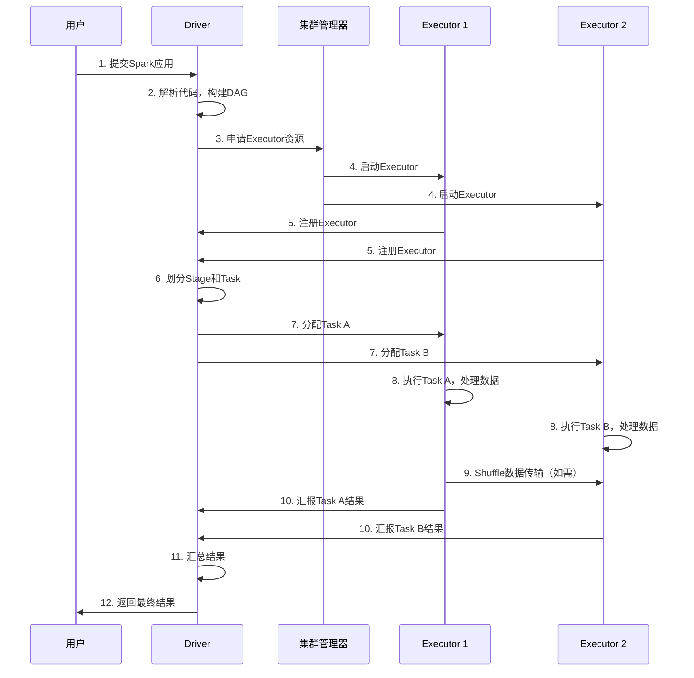
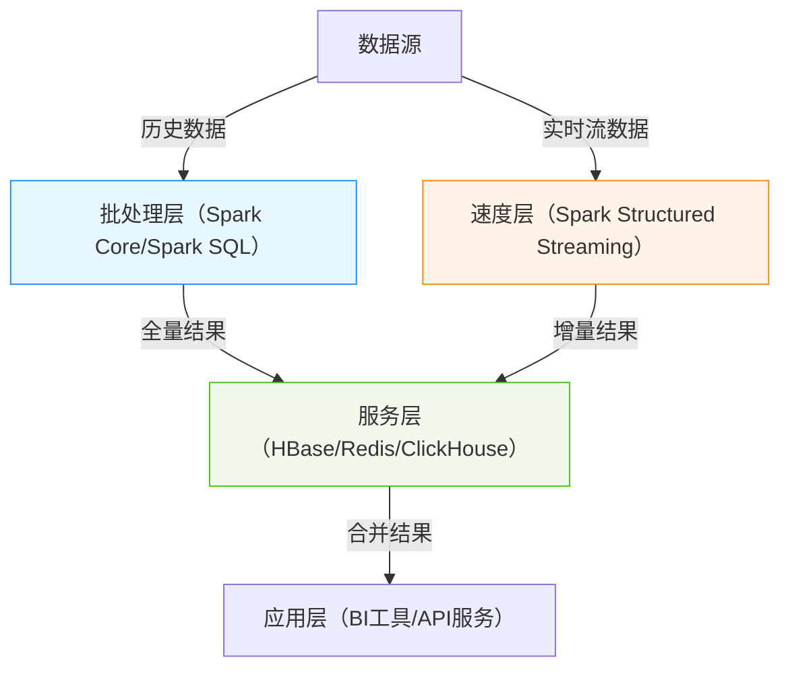

# 一、认知定位（Why & What）
## 1. 背景与起源：诞生的驱动力、解决的核心问题
### 1.1 诞生的核心驱动力
Spark的诞生源于**传统分布式计算框架的局限性**与**数据处理需求的升级**，核心驱动力可归纳为两点：
- **Hadoop MapReduce的固有缺陷**：作为早期主流分布式计算框架，MapReduce存在明显瓶颈，无法满足复杂场景需求：
  1. 迭代计算效率低：每次计算需将中间结果写入磁盘（HDFS），迭代任务（如机器学习模型训练）会产生大量磁盘IO，性能损耗严重；
  2. 实时处理能力缺失：仅支持离线批处理，无法应对流数据（如实时日志、交易数据）的低延迟处理需求；
  3. 编程模型复杂：需手动拆分任务为Map/Reduce阶段，开发成本高，不支持复杂计算逻辑（如多表关联、DAG依赖）。
- **数据处理需求的演进**：2010年后，数据场景从“离线批量分析”向“实时+复杂计算”升级：
  1. 机器学习场景：需要频繁迭代计算（如梯度下降），对内存复用需求迫切；
  2. 实时业务场景：电商实时推荐、金融风控等场景要求秒级/毫秒级数据处理；
  3. 多范式融合需求：企业希望用一套框架统一批处理、流处理、SQL查询、图计算，降低技术栈复杂度。

### 1.2 研发背景与演进
- **起源**：2009年由美国加州大学伯克利分校（UC Berkeley）AMP实验室（Algorithms, Machines, and People Lab）发起研发，核心目标是解决MapReduce的效率与灵活性问题；
- **关键里程碑**：
  1. 2010年：项目开源，基于Scala语言开发；
  2. 2013年：加入Apache基金会，成为顶级开源项目，社区快速扩张；
  3. 2014年：发布Spark 1.0，稳定支持批处理、流处理（Spark Streaming）、SQL（Spark SQL）三大核心能力；
  4. 2016年：发布Spark 2.0，引入结构化流（Structured Streaming），统一批/流处理模型，性能大幅提升；
  5. 至今：成为工业界主流分布式计算引擎，支持Python/Java/Scala/R多语言，生态覆盖数据处理全链路。


## 2. 核心本质：最简化的核心模型（抽象本质）
Spark的核心本质是**“基于弹性分布式数据集（RDD）的DAG式分布式计算引擎”**，通过两层抽象实现高效、灵活的计算能力：

### 2.1 核心数据抽象：弹性分布式数据集（RDD）
RDD（Resilient Distributed Dataset）是Spark对分布式数据的最基础抽象，可理解为“**分布式的、不可变的、可分区的数据集**”，其核心特性决定了Spark的优势：
- **不可变性（Immutability）**：RDD一旦创建无法修改，仅能通过“转换操作（Transformation）”生成新RDD，确保计算过程可追溯、可重试；
- **分区特性（Partitioning）**：数据按分区（Partition）分布式存储在集群节点，计算时遵循“数据本地化”原则（计算向数据移动），减少网络传输；
- **弹性（Resilience）**：通过“血统（Lineage）”记录RDD的生成依赖关系，当某分区数据丢失时，可基于Lineage重新计算恢复，无需依赖外部存储；
- **双类型操作**：支持“转换操作（Transformation，懒执行）”和“行动操作（Action，触发计算）”，通过懒执行将多个转换操作合并为一个DAG任务，优化执行效率。

### 2.2 核心执行抽象：DAG调度引擎
Spark将计算任务转化为**有向无环图（DAG）**，通过DAG调度引擎实现任务的优化与执行：
1. **任务解析**：将用户代码中的RDD转换操作解析为DAG（节点=RDD，边=转换操作）；
2. **阶段划分（Stage）**：根据“宽依赖”（如shuffle操作，需跨节点数据传输）将DAG划分为多个Stage，同一Stage内的任务可并行执行；
3. **任务调度**：将Stage拆分为独立的Task，分发到集群节点执行，优先调度数据本地化任务，减少IO开销。

### 2.3 本质优势：计算范式统一
Spark通过RDD+DAG抽象，实现了“**一栈式**”计算范式统一，无需为不同场景切换框架：
- 批处理：基于RDD执行离线大规模数据计算；
- 流处理：通过“微批处理”（Spark Streaming）或“结构化流”（Structured Streaming）将流数据转化为RDD/DataFrame处理；
- SQL查询：Spark SQL将SQL语句解析为DAG任务，复用RDD执行引擎；
- 图计算/机器学习：通过GraphX、MLlib库，基于RDD实现图算法（如PageRank）和机器学习模型（如逻辑回归）。


## 3. 定位与关系：在技术体系中的位置、与同类事物的对比
### 3.1 在技术体系中的位置
Spark属于**分布式计算引擎层**，处于数据处理技术栈的“核心执行层”，上接应用场景，下接存储/资源调度层，具体位置如下：

#### 3.1.1 技术栈分层（文字化步骤）
1. 数据源层：各类数据来源，如日志文件（HDFS）、数据库（MySQL/Hive）、消息队列（Kafka）、对象存储（S3）；
2. 存储层：分布式存储系统，如HDFS、S3、HBase，负责持久化存储数据；
3. 资源调度层：集群资源管理系统，如YARN、K8s、Mesos，负责分配CPU、内存等资源；
4. **计算引擎层（Spark定位）**：接收上层应用请求，将计算任务转化为DAG，调用资源调度层的资源执行任务；
5. 应用层：用户直接使用的工具/接口，如Spark SQL（SQL查询）、MLlib（机器学习）、Spark Streaming（流处理）、第三方BI工具（Tableau）。

#### 3.1.2 技术体系位置流程图（Mermaid）
```mermaid
flowchart TD
    A[数据源层] -->|读取数据| B[存储层]
    B -->|提供数据存储| C[资源调度层]
    C -->|分配CPU/内存| D[计算引擎层（Spark）]
    D -->|执行计算| E[应用层]
    style D fill:#f9d59b,stroke:#333,stroke-width:2px
    %% 标注顺序
    note over A,B: 1. 数据从数据源写入存储层
    note over B,C: 2. 存储层为计算提供持久化支持
    note over C,D: 3. 资源调度层为Spark分配计算资源
    note over D,E: 4. Spark执行计算并向应用层返回结果
```

### 3.2 与同类技术的对比（替代/互补关系）
Spark的核心竞品是**Hadoop MapReduce（批处理）** 和**Apache Flink（流处理）**，三者的定位与差异如下：

| 对比维度        | Apache Spark                          | Hadoop MapReduce              | Apache Flink                  |
|-----------------|---------------------------------------|-------------------------------|-------------------------------|
| 核心定位        | 批处理优先，支持多范式（批/流/SQL）   | 纯离线批处理                  | 流处理优先，支持批流统一      |
| 计算模型        | 基于RDD的DAG计算，支持内存迭代        | 基于Map/Reduce的两阶段计算    | 基于数据流（DataStream）的流计算 |
| 延迟性能        | 批处理：秒级-分钟级；流处理（微批）：秒级 | 批处理：分钟级-小时级         | 流处理：毫秒级；批处理：秒级   |
| 容错机制        | RDD血统（Lineage）重新计算            | 中间结果落盘，任务重试        | 状态快照（Checkpoint）+ 恰好一次语义 |
| 适用场景        | 离线批处理、机器学习、交互式分析      | 超大规模离线批处理（PB级）    | 实时流处理（如风控、推荐）、低延迟批处理 |
| 关系类型        | 替代（批处理场景）                    | 被替代（逐步退出主流）        | 互补+竞争（流处理竞争，批处理互补） |

#### 关键结论：
- **与MapReduce**：Spark是MapReduce的**直接替代者**——在批处理场景下，Spark通过内存计算和DAG优化，性能比MapReduce提升10-100倍，且支持更复杂的计算逻辑，目前MapReduce仅在超大规模（PB级）离线场景中少量使用；
- **与Flink**：二者是**“竞争+互补”关系**——Flink在实时流处理（毫秒级延迟）上占优，Spark在批处理、机器学习场景中更成熟；实际生产中，部分企业会同时部署Spark（批处理）和Flink（流处理），形成“批流协同”的架构。

# 二、原理支撑（How - Theory）
## 1. 体系结构：核心组件、组件关系、整体架构图
### 1.1 核心组件及其功能
Spark采用**主从架构（Master-Slave）** 设计，核心组件包括集群管理器、Driver、Executor三大类，各组件功能如下：

#### 1.1.1 集群管理器（Cluster Manager）
- **作用**：负责整个集群的资源（CPU、内存、磁盘等）管理与分配，是Spark运行的基础环境。
- **支持类型**：
  - Spark自带的Standalone Manager（独立集群模式）
  - Hadoop YARN（最常用，与Hadoop生态无缝集成）
  - Kubernetes（容器化部署首选）
  - Apache Mesos（多框架资源调度）
- **核心功能**：接收Driver的资源申请，为Executor分配资源并监控其状态。

#### 1.1.2 Driver程序
- **作用**：负责整个Spark应用的生命周期管理，是应用的控制中心。
- **核心功能**：
  1. 解析用户代码，生成逻辑执行计划（DAG）
  2. 将DAG划分为Stage和Task
  3. 向集群管理器申请资源
  4. 调度Task到Executor执行
  5. 监控任务执行状态，处理失败任务

#### 1.1.3 Executor
- **作用**：运行在Worker节点上的进程，负责实际执行Task并存储数据。
- **核心功能**：
  1. 执行Driver分配的Task
  2. 存储计算过程中的数据（内存缓存）
  3. 与其他Executor通信（如Shuffle阶段的数据传输）
  4. 向Driver汇报任务执行状态

### 1.2 组件关系与通信
各组件通过**网络通信**协同工作，核心交互关系如下：
- Driver ←→ 集群管理器：Driver申请资源，集群管理器分配Executor
- Driver ←→ Executor：Driver发送Task，Executor汇报执行结果
- Executor ←→ Executor：Shuffle阶段的数据传输（如Map输出到Reduce输入）

### 1.3 整体架构图（Mermaid）
```mermaid
flowchart TD
    subgraph 客户端
        A[用户应用程序]
    end
    
    subgraph 集群管理器
        B[Cluster Manager<br/>(YARN/K8s/Standalone)]
    end
    
    subgraph Driver节点
        C[Driver<br/>- DAG调度器<br/>- 任务调度器<br/>- 监控器]
    end
    
    subgraph Worker节点1
        D[Executor 1<br/>- 任务执行<br/>- 内存缓存]
    end
    
    subgraph Worker节点2
        E[Executor 2<br/>- 任务执行<br/>- 内存缓存]
    end
    
    subgraph Worker节点n
        F[Executor n<br/>- 任务执行<br/>- 内存缓存]
    end
    
    A -->|提交应用| C
    C -->|申请资源| B
    B -->|分配资源| D
    B -->|分配资源| E
    B -->|分配资源| F
    C -->|发送Task| D
    C -->|发送Task| E
    C -->|发送Task| F
    D -->|汇报结果| C
    E -->|汇报结果| C
    F -->|汇报结果| C
    D <-->|Shuffle数据| E
    E <-->|Shuffle数据| F
```


## 2. 核心机制：支撑运行的关键原理
### 2.1 调度机制
Spark的调度机制分为**DAG调度**和**任务调度**两层，实现从逻辑计划到物理执行的转换：

#### 2.1.1 DAG调度器（DAG Scheduler）
- **作用**：将用户代码解析为DAG，并划分为可执行的Stage。
- **核心流程**：
  1. 接收用户提交的Job（由Action操作触发）
  2. 解析RDD依赖关系，构建DAG图
  3. 根据“宽依赖”（Shuffle操作）划分Stage（宽依赖前为一个Stage）
  4. 为每个Stage生成TaskSet（包含多个Task）
  5. 将TaskSet提交给任务调度器

#### 2.1.2 任务调度器（Task Scheduler）
- **作用**：将Task分配到具体的Executor执行，考虑数据本地化。
- **核心策略**：
  1. 数据本地化级别（优先级从高到低）：
     - PROCESS_LOCAL：Task与数据在同一进程
     - NODE_LOCAL：Task与数据在同一节点
     - RACK_LOCAL：Task与数据在同一机架
     - ANY：任意节点
  2. 重试机制：失败的Task会在其他节点重试（默认4次）
  3. 推测执行：对运行缓慢的Task启动备份Task，取先完成的结果

### 2.2 容错机制
Spark通过多种机制保证分布式计算的可靠性：

#### 2.2.1 RDD血统（Lineage）
- **原理**：记录每个RDD的生成依赖关系（父RDD、转换操作），当RDD分区丢失时，可通过父RDD重新计算恢复。
- **优势**：无需持久化所有中间结果，节省存储空间。
- **适用场景**：转换操作较简单的场景（如map、filter）。

#### 2.2.2 检查点（Checkpoint）
- **原理**：将RDD数据持久化到可靠存储（如HDFS），截断血统链，避免长依赖链导致的重计算开销。
- **使用场景**：
  - 迭代计算（如机器学习）中，定期保存中间结果
  - 依赖链较长的RDD（重计算成本高）
- **操作方式**：`rdd.checkpoint()` + `sc.setCheckpointDir("hdfs://path")`

#### 2.2.3 广播变量（Broadcast Variable）
- **原理**：将大变量（如字典、模型参数）缓存到每个Executor的内存，避免重复传输和存储。
- **容错保障**：Driver保留原始变量，当Executor节点失败重启后，可重新获取广播变量。

### 2.3 Shuffle机制
Shuffle是Spark中最昂贵的操作之一，指**跨节点的数据重新分区**（如groupByKey、join），核心流程如下：

#### 2.3.1 阶段划分
- Map阶段：每个Task处理输入数据，生成`<key, value>`对，按key分区规则写入本地磁盘
- Reduce阶段：每个Task拉取所有Map任务中属于自己分区的数据，合并后处理

#### 2.3.2 关键优化
- 排序合并（Sort Merge）：Spark 1.2+默认使用，Map端排序后写入磁盘，Reduce端合并排序，减少内存占用
- 序列化：将数据序列化后传输，减少网络IO
- 本地性优化：优先将Reduce Task调度到Map数据所在节点

### 2.4 内存管理机制
Spark采用**统一内存管理模型**（Spark 1.6+），将Executor内存划分为以下区域：

- **存储内存（Storage Memory）**：
  - 用途：缓存RDD数据、广播变量
  - 特性：可与执行内存动态调整（默认比例50:50）

- **执行内存（Execution Memory）**：
  - 用途：Task执行过程中的临时数据（如Shuffle缓冲区）
  - 特性：任务间公平竞争，超额使用时可驱逐存储内存数据

- **用户内存（User Memory）**：
  - 用途：用户代码中创建的对象（如自定义数据结构）
  - 大小：总内存 - 存储+执行内存 - 预留内存

- **预留内存（Reserved Memory）**：
  - 用途：JVM自身开销
  - 固定大小：300MB


## 3. 抽象建模：如何将现实问题转化为技术模型
### 3.1 核心抽象概念演进
Spark的抽象模型从低级到高级逐步演进，满足不同场景需求：

#### 3.1.1 RDD（弹性分布式数据集）
- **适用场景**：复杂数据转换、非结构化数据处理、底层API操作
- **核心特性**：
  - 不可变分布式集合
  - 支持粗粒度转换（整个RDD的操作）
  - 无schema约束，灵活性高
- **建模逻辑**：将数据视为分布式对象集合，通过转换操作（map、filter等）实现数据处理

#### 3.1.2 DataFrame
- **适用场景**：结构化数据处理、SQL查询、数据分析
- **核心特性**：
  - 带schema的分布式数据集（类似关系型数据库表）
  - 支持列操作和SQL语法
  - 优化器（Catalyst）支持，执行效率高
- **建模逻辑**：将数据映射为二维表结构，通过表操作（过滤、关联、聚合）实现分析

#### 3.1.3 Dataset
- **适用场景**：类型安全的结构化数据处理、混合使用SQL和编程API
- **核心特性**：
  - 结合RDD的类型安全和DataFrame的结构化优势
  - 支持编译时类型检查
  - 兼容Java/Scala的面向对象编程
- **建模逻辑**：将数据视为强类型对象集合，兼具结构化分析和编程灵活性

### 3.2 抽象模型关系与转换
三种抽象模型可相互转换，形成完整的建模体系：

```mermaid
graph LR
    A[RDD] -->|toDF()| B[DataFrame]
    B -->|rdd| A
    B -->|as[Type]| C[Dataset]
    C -->|toDF()| B
    C -->|rdd| A
```

- **转换示例**：
  ```scala
  // RDD → DataFrame
  val rdd = sc.parallelize(Seq(("Alice", 25), ("Bob", 30)))
  val df = rdd.toDF("name", "age")
  
  // DataFrame → Dataset
  case class Person(name: String, age: Int)
  val ds = df.as[Person]
  
  // Dataset → RDD
  val rdd2 = ds.rdd
  ```

### 3.3 现实问题建模示例
以“用户行为分析”场景为例，展示建模过程：

1. **问题定义**：分析电商网站用户的购买行为，统计各年龄段的平均消费金额
2. **数据来源**：用户信息表（user_id, name, age）、订单表（order_id, user_id, amount）
3. **建模步骤**：
   - 读取数据为DataFrame（结构化建模）
   - 关联两表（join操作，模拟关系型数据库关联）
   - 按年龄分组聚合（groupBy + avg，实现统计逻辑）
   - 结果输出（Action操作，触发计算）


## 4. 流转逻辑：数据/信息/指令的传递路径与触发条件
### 4.1 作业执行全流程（文字化步骤）
1. **应用提交阶段**：
   1.1 用户编写Spark应用程序（使用RDD/DataFrame API）
   1.2 通过`spark-submit`命令提交应用到集群
   1.3 集群启动Driver进程，初始化SparkContext（核心入口）

2. **DAG构建阶段**：
   2.1 Driver解析用户代码，将转换操作（Transformation）转换为RDD依赖链
   2.2 当遇到行动操作（Action）时，触发Job创建
   2.3 DAG调度器根据依赖关系构建DAG图

3. **任务划分阶段**：
   3.1 DAG调度器根据宽依赖将DAG划分为多个Stage（逆序划分，从最后一个RDD向前）
   3.2 每个Stage包含多个Task（数量等于RDD分区数）
   3.3 将TaskSet提交给任务调度器

4. **资源申请与任务调度阶段**：
   4.1 Driver向集群管理器申请Executor资源
   4.2 集群管理器在Worker节点上启动Executor进程
   4.3 任务调度器根据数据本地化策略，将Task分配到Executor

5. **任务执行阶段**：
   5.1 Executor接收Task并执行，读取输入数据（从内存或磁盘）
   5.2 执行计算逻辑，中间结果可能缓存到内存
   5.3 若涉及Shuffle，Map端写入本地磁盘，Reduce端拉取数据
   5.4 任务完成后，将结果返回给Driver

6. **结果汇总阶段**：
   6.1 Driver收集所有Task的执行结果
   6.2 进行最终处理（如合并、排序）并返回给用户
   6.3 应用程序执行完成，释放资源

### 4.2 作业执行时序图（Mermaid）


### 4.3 关键触发条件
- **Job触发**：当执行Action操作（如collect、count、saveAsTextFile）时，触发一个Job
- **Stage划分触发**：遇到宽依赖（Shuffle操作）时，划分新的Stage
- **Task调度触发**：当Executor资源可用且数据本地化条件满足时，调度Task执行
- **Shuffle触发**：当执行需要跨分区数据聚合的操作（如groupByKey、reduceByKey、join）时触发
- **Checkpoint触发**：显式调用`checkpoint()`方法，且RDD首次被计算时执行 checkpoint

# 三、实践应用（How - Practice）
## 1. 基础操作：最小可用技能集（安装、配置、核心API）
### 1.1 环境准备与部署
#### 1.1.1 前置依赖与部署模式对比
Spark运行依赖JDK和分布式文件系统（如HDFS），生产中主流部署模式为**Standalone（独立集群）** 和**YARN（融合Hadoop生态）**，两者对比如下：

| 部署模式 | 适用场景 | 优势 | 劣势 |
|----------|----------|------|------|
| Standalone | 小规模测试/独立集群 | 配置简单、无需依赖其他组件 | 资源调度能力弱，不支持多框架共享资源 |
| YARN | 生产环境/大规模集群 | 资源隔离性好、支持多框架（Spark/Flink/MapReduce） | 配置复杂，依赖Hadoop生态 |

#### 1.1.2 单机/集群安装步骤（以Spark 3.3.0 + YARN为例）
1. **前置环境确认**：
   - 安装JDK 8/11（Spark 3.x不支持JDK 7及以下）
   - 部署Hadoop集群（HDFS + YARN，确保`start-dfs.sh`和`start-yarn.sh`正常启动）
   - 集群节点间配置SSH免密登录

2. **Spark安装**：
   1. 从[Spark官网](https://spark.apache.org/downloads.html)下载`spark-3.3.0-bin-hadoop3.tgz`
   2. 解压到所有节点的统一路径（如`/opt/spark`）：`tar -zxvf spark-3.3.0-bin-hadoop3.tgz -C /opt`
   3. 配置环境变量（所有节点`/etc/profile`）：
      ```bash
      export SPARK_HOME=/opt/spark
      export PATH=$PATH:$SPARK_HOME/bin:$SPARK_HOME/sbin
      ```
   4. 生效环境变量：`source /etc/profile`

3. **YARN集成配置**：
   1. 复制模板配置：`cp $SPARK_HOME/conf/spark-env.sh.template $SPARK_HOME/conf/spark-env.sh`
   2. 在`spark-env.sh`中添加YARN相关配置：
      ```bash
      export HADOOP_CONF_DIR=$HADOOP_HOME/etc/hadoop  # 指向Hadoop配置目录
      export SPARK_EXECUTOR_MEMORY=2g  # 默认Executor内存
      export SPARK_DRIVER_MEMORY=1g    # 默认Driver内存
      ```

4. **验证安装**：
   - 提交测试任务到YARN：`spark-submit --class org.apache.spark.examples.SparkPi --master yarn --deploy-mode cluster $SPARK_HOME/examples/jars/spark-examples_2.12-3.3.0.jar 10`
   - 若输出“Pi is roughly 3.14xxx”，则安装成功

### 1.2 核心配置（生产常用参数）
#### 1.2.1 全局配置（spark-defaults.conf）
核心配置项直接影响任务性能，需根据集群资源调整：
- `spark.executor.cores`：每个Executor的CPU核数（默认1，生产建议2-4）
- `spark.executor.instances`：Executor数量（默认2，根据总CPU核数计算）
- `spark.executor.memory`：Executor内存（默认1g，生产建议4-16g，需预留20%给JVM）
- `spark.driver.memory`：Driver内存（默认1g，若处理大结果集建议2-4g）
- `spark.default.parallelism`：默认并行度（建议设为总CPU核数的2-3倍，如`spark.executor.cores * spark.executor.instances * 2`）
- `spark.sql.shuffle.partitions`：SQL Shuffle分区数（默认200，需与并行度匹配，避免分区过多/过少）

#### 1.2.2 任务提交参数（spark-submit）
提交任务时可覆盖全局配置，格式如下：
```bash
spark-submit \
--class com.example.SparkJob \  # 主类全路径
--master yarn \                # 运行模式（yarn/standalone/local）
--deploy-mode cluster \        # Driver部署模式（cluster/client，生产用cluster）
--executor-cores 4 \           # 每个Executor核数
--executor-memory 8g \         # 每个Executor内存
--num-executors 10 \           # Executor数量
--conf spark.driver.memory=4g \# Driver内存
--jars mysql-connector-java-8.0.30.jar \  # 依赖jar包
/opt/jobs/spark-job.jar \      # 任务jar包
arg1 arg2                      # 任务参数
```

### 1.3 核心API使用（Python示例）
Spark支持Python/Scala/Java/R，以下为最常用的**RDD**和**DataFrame/Dataset** API示例（基于SparkSession，Spark 2.x+推荐）。

#### 1.3.1 RDD API（基础操作）
RDD适用于非结构化数据处理，核心操作分“转换（Transformation）”和“行动（Action）”：
```python
from pyspark import SparkContext
from pyspark.sql import SparkSession

# 初始化SparkSession（替代旧版SparkContext）
spark = SparkSession.builder \
    .appName("RDDExample") \
    .master("local[*]")  # 本地模式，*表示用所有CPU核
    .getOrCreate()
sc = spark.sparkContext

# 1. 创建RDD（从内存/文件）
# 内存创建
rdd1 = sc.parallelize([1, 2, 3, 4, 5])
# 文件创建（HDFS路径需前缀hdfs://，本地路径前缀file://）
rdd2 = sc.textFile("file:///opt/data/words.txt")

# 2. 转换操作（懒执行，不触发计算）
# 过滤偶数
rdd_filter = rdd1.filter(lambda x: x % 2 == 0)
# 单词拆分（flatMap将列表展平）
rdd_words = rdd2.flatMap(lambda line: line.split(" "))
# 统计单词频次（map→reduceByKey）
rdd_wordcount = rdd_words.map(lambda word: (word, 1)).reduceByKey(lambda a, b: a + b)

# 3. 行动操作（触发计算）
# 输出结果
print(rdd_filter.collect())  # [2,4]
rdd_wordcount.foreach(print)  # 打印每个单词的频次

# 关闭SparkSession
spark.stop()
```

#### 1.3.2 DataFrame API（结构化数据）
DataFrame带Schema，支持SQL风格操作，效率高于RDD，适用于结构化数据（如CSV/JSON/数据库表）：
```python
from pyspark.sql import SparkSession
from pyspark.sql.functions import col, sum, avg

# 初始化SparkSession
spark = SparkSession.builder \
    .appName("DataFrameExample") \
    .master("local[*]") \
    .getOrCreate()

# 1. 创建DataFrame（从文件/列表）
# 从CSV文件创建（header=True表示第一行为列名，inferSchema=True自动推断类型）
df = spark.read.csv(
    path="file:///opt/data/user_orders.csv",
    header=True,
    inferSchema=True
)
# 从列表创建（需指定Schema）
data = [("Alice", 25, "Beijing", 100), ("Bob", 30, "Shanghai", 200)]
schema = ["name", "age", "city", "order_amount"]
df2 = spark.createDataFrame(data, schema=schema)

# 2. 基础操作（过滤、排序、聚合）
# 过滤订单金额>150的用户
df_filter = df.filter(col("order_amount") > 150)
# 按城市分组，统计平均订单金额和总人数
df_agg = df.groupBy("city") \
    .agg(
        avg("order_amount").alias("avg_amount"),
        sum("age").alias("total_age")  # 示例：统计总年龄（无实际业务意义）
    ) \
    .orderBy(col("avg_amount").desc())  # 按平均金额降序

# 3. 输出结果（保存到文件/打印）
# 打印前10行
df_agg.show(10, truncate=False)  # truncate=False不截断长字符串
# 保存为Parquet文件（Spark默认格式，压缩率高）
df_agg.write \
    .mode("overwrite")  # 覆盖已有文件
    .parquet("file:///opt/result/city_order_agg.parquet")

# 关闭SparkSession
spark.stop()
```


## 2. 典型案例：代表性场景的完整实现（含步骤与解析）
### 2.1 案例1：批处理 - 日志数据分析（统计PV/UV）
#### 2.1.1 场景定义
分析Nginx访问日志，统计指定日期的**PV（页面浏览量）** 和**UV（独立访客数，按IP去重）**，并按访问路径（uri）分组统计Top10热门页面。

#### 2.1.2 日志格式与环境准备
- 日志格式（分隔符为` `）：`192.168.1.1 - - [10/Oct/2024:10:00:00 +0800] "GET /index.html HTTP/1.1" 200 1024`
- 环境：日志文件存储在HDFS路径`/user/logs/nginx/20241010/`，共10个文件，总大小10GB

#### 2.1.3 完整实现步骤（Scala代码）
1. **初始化SparkSession**：
   ```scala
   import org.apache.spark.sql.SparkSession
   import org.apache.spark.sql.functions._
   import org.apache.spark.sql.types._

   object NginxLogAnalysis {
     def main(args: Array[String]): Unit = {
       val spark = SparkSession.builder()
         .appName("NginxLogAnalysis")
         .master("yarn")  // 生产环境用yarn
         .config("spark.executor.cores", "4")
         .config("spark.executor.memory", "8g")
         .config("spark.num.executors", "10")
         .getOrCreate()
       import spark.implicits._
   ```

2. **定义Schema并读取日志文件**：
   ```scala
   // 定义日志Schema（避免inferSchema导致的性能问题）
   val logSchema = StructType(Array(
     StructField("ip", StringType, nullable = true),
     StructField("remote_user", StringType, nullable = true),
     StructField("auth_user", StringType, nullable = true),
     StructField("time_local", StringType, nullable = true),
     StructField("request", StringType, nullable = true),
     StructField("status", IntegerType, nullable = true),
     StructField("body_bytes_sent", LongType, nullable = true)
   ))

   // 读取HDFS日志文件（按空格分割，忽略引号内的空格）
   val logDF = spark.read
     .option("delimiter", " ")
     .option("quote", "\"")  // 处理request字段中的引号
     .schema(logSchema)
     .csv("hdfs:///user/logs/nginx/20241010/")
   ```

3. **数据清洗与字段提取**：
   ```scala
   // 从request字段提取uri（如"GET /index.html HTTP/1.1" → "/index.html"）
   val cleanDF = logDF
     .filter(col("request").isNotNull)  // 过滤空请求
     .withColumn("uri", split(col("request"), " ")(1))  // 按空格分割，取第2个元素
     .withColumn("date", to_date(col("time_local"), "dd/MMM/yyyy"))  // 解析日期（如10/Oct/2024）
     .filter(col("date") === "2024-10-10")  // 过滤指定日期
   ```

4. **统计PV/UV与Top10热门页面**：
   ```scala
   // 1. 全局PV/UV
   val globalStats = cleanDF.agg(
     count("*").alias("total_pv"),  // PV：总请求数
     countDistinct("ip").alias("total_uv")  // UV：IP去重计数
   )

   // 2. 按uri分组统计Top10热门页面
   val top10Uri = cleanDF.groupBy("uri")
     .agg(count("*").alias("pv"))
     .orderBy(col("pv").desc())
     .limit(10)
   ```

5. **结果输出**：
   ```scala
   // 打印全局统计结果
   println("=== 全局PV/UV统计 ===")
   globalStats.show(truncate = false)

   // 保存Top10页面到HDFS（Parquet格式）
   top10Uri.write
     .mode("overwrite")
     .parquet("hdfs:///user/result/nginx_top10_uri_20241010.parquet")

   // 关闭SparkSession
   spark.stop()
     }
   }
   ```

#### 2.1.4 执行命令与结果解析
1. **打包与提交**：
   - 用sbt/maven将代码打包为`nginx-log-analysis.jar`
   - 提交命令：
     ```bash
     spark-submit \
     --class NginxLogAnalysis \
     --master yarn \
     --deploy-mode cluster \
     --executor-cores 4 \
     --executor-memory 8g \
     --num-executors 10 \
     /opt/jobs/nginx-log-analysis.jar
     ```

2. **预期结果**：
   - 全局统计输出：
     ```
     === 全局PV/UV统计 ===
     +---------+---------+
     |total_pv |total_uv |
     +---------+---------+
     |1258936  |89234    |
     +---------+---------+
     ```
   - Top10页面结果：`/index.html`（PV 32100）、`/product/list.html`（PV 28900）等高频访问路径


### 2.2 案例2：流处理 - Kafka实时数据消费（用户行为监控）
#### 2.2.1 场景定义
实时消费Kafka主题`user_behavior`（用户点击、下单、支付行为），统计最近5分钟内的**实时下单量**（滑动窗口，窗口步长1分钟），并将结果写入MySQL供监控面板展示。

#### 2.2.2 环境准备
- Kafka集群：版本2.8.0，主题`user_behavior`的分区数10，副本数2
- MySQL：数据库`spark_monitor`，表`real_time_orders`（字段：window_start, window_end, order_count）
- 数据格式（Kafka消息值为JSON）：`{"user_id": "1001", "behavior_type": "order", "timestamp": 1696900800000, "product_id": "P001"}`

#### 2.2.3 完整实现步骤（Python代码）
1. **初始化SparkSession与配置Kafka**：
   ```python
   from pyspark.sql import SparkSession
   from pyspark.sql.functions import *
   from pyspark.sql.types import *
   from pyspark.sql.window import Window

   def main():
       spark = SparkSession.builder \
           .appName("RealTimeOrderMonitor") \
           .master("yarn") \
           .config("spark.executor.cores", "2") \
           .config("spark.executor.memory", "4g") \
           .config("spark.num.executors", "5") \
           .config("spark.sql.streaming.checkpointLocation", "/user/checkpoint/order_monitor")  # 流处理 checkpoint 路径（必设，用于容错）
           .getOrCreate()
       import spark.implicits._
   ```

2. **定义Schema并消费Kafka数据**：
   ```python
   # 定义Kafka消息值的JSON Schema
   behaviorSchema = StructType(Array(
       StructField("user_id", StringType),
       StructField("behavior_type", StringType),
       StructField("timestamp", LongType),
       StructField("product_id", StringType)
   ))

   # 消费Kafka数据
   kafkaDF = spark.readStream \
       .format("kafka") \
       .option("kafka.bootstrap.servers", "kafka-node1:9092,kafka-node2:9092")  # Kafka broker地址
       .option("subscribe", "user_behavior")  # 订阅的主题
       .option("startingOffsets", "latest")  # 从最新偏移量开始消费
       .load()

   # 解析Kafka消息值（二进制→字符串→JSON）
   parsedDF = kafkaDF \
       .select(from_json(col("value").cast(StringType), behaviorSchema).alias("data")) \
       .select("data.*") \
       .withColumn("event_time", to_timestamp(col("timestamp")/1000))  # 将毫秒时间戳转为Timestamp类型
   ```

3. **滑动窗口统计实时下单量**：
   ```python
   # 过滤下单行为，按滑动窗口分组统计
   orderWindowDF = parsedDF \
       .filter(col("behavior_type") == "order")  # 只保留下单行为
       .groupBy(
           window(
               col("event_time"), 
               windowDuration="5 minutes",  # 窗口长度：5分钟
               slideDuration="1 minute"     # 窗口步长：1分钟（每1分钟更新一次）
           )
       ) \
       .agg(count("*").alias("order_count")) \
       .select(
           col("window.start").alias("window_start"),
           col("window.end").alias("window_end"),
           col("order_count")
       )
   ```

4. **结果写入MySQL**：
   ```python
   # 定义MySQL连接参数
   mysqlConf = {
       "url": "jdbc:mysql://mysql-node:3306/spark_monitor?useSSL=false",
       "dbtable": "real_time_orders",
       "user": "spark_user",
       "password": "spark_pass",
       "driver": "com.mysql.cj.jdbc.Driver"
   }

   # 流处理结果写入MySQL（append模式，只新增数据）
   query = orderWindowDF.writeStream \
       .format("jdbc") \
       .options(**mysqlConf) \
       .outputMode("append")  # 窗口结果为新增数据，用append模式
       .start()

   # 等待流处理结束（持续运行）
   query.awaitTermination()

   if __name__ == "__main__":
       main()
   ```

#### 2.2.4 关键注意事项
- **Checkpoint**：必须设置`checkpointLocation`，用于保存流处理的偏移量和状态，避免重启后重复消费/丢失数据
- **窗口设计**：窗口长度和步长需根据业务延迟需求调整（如5分钟窗口+1分钟步长，平衡实时性和统计粒度）
- **Kafka偏移量**：生产中建议将偏移量提交到Kafka或外部存储（如MySQL），避免依赖Spark内部Checkpoint（可能因Checkpoint丢失导致偏移量丢失）


## 3. 问题诊断：常见错误、异常排查与解决方案
### 3.1 资源类错误（高频）
#### 3.1.1 错误1：Executor内存溢出（java.lang.OutOfMemoryError: Java heap space）
- **现象**：任务执行中Executor进程被杀，日志显示“Java heap space”
- **原因**：
  1. `spark.executor.memory`配置不足，无法容纳Task处理的临时数据（如Shuffle缓冲区）
  2. 数据倾斜导致单个Task处理过多数据
- **解决方案**：
  1. 增加Executor内存：`--executor-memory 16g`（需结合集群实际资源，避免超配）
  2. 启用内存动态调整：设置`spark.memory.fraction 0.8`（默认0.6，提高可用内存比例）
  3. 排查数据倾斜：通过Spark UI查看Task执行时间，定位长尾Task（详见3.3.1）

#### 3.1.2 错误2：Driver内存溢出（java.lang.OutOfMemoryError: GC overhead limit exceeded）
- **现象**：Driver进程崩溃，日志显示“GC overhead limit exceeded”（GC占用时间过高）
- **原因**：
  1. `spark.driver.memory`不足，如收集大量结果到Driver（如`collect()`操作）
  2. 广播变量过大，超出Driver内存限制
- **解决方案**：
  1. 避免使用`collect()`（改用`show()`或保存到文件），必须使用时先过滤数据
  2. 增加Driver内存：`--driver-memory 4g`
  3. 拆分大广播变量：将超大字典拆分为多个小广播变量，或使用外部存储（如Redis）

### 3.2 Shuffle类错误（生产高频）
#### 3.2.1 错误1：Shuffle文件找不到（org.apache.spark.shuffle.FetchFailedException）
- **现象**：Reduce阶段报错“FetchFailedException: Failed to connect to Executor”，Shuffle文件缺失
- **原因**：
  1. Executor因内存溢出被Kill，导致其生成的Shuffle文件丢失
  2. 网络不稳定，Reduce端无法拉取Map端的Shuffle文件
- **解决方案**：
  1. 解决Executor内存溢出问题（见3.1.1），确保Executor稳定运行
  2. 增加Shuffle超时时间：`--conf spark.shuffle.io.connectionTimeout=120s`（默认60s）
  3. 启用Shuffle文件复制：`--conf spark.shuffle.service.enabled=true`（YARN模式，用ShuffleService管理文件，避免Executor退出后文件丢失）

#### 3.2.2 错误2：Shuffle分区数不合理（性能瓶颈）
- **现象**：任务执行缓慢，Shuffle阶段耗时占比超70%，或单个Shuffle文件过大（>1GB）
- **原因**：
  1. 分区数过少（如默认200），导致单个Task处理数据过多，内存压力大
  2. 分区数过多，导致小文件过多，IO开销大
- **解决方案**：
  1. 调整SQL Shuffle分区数：`--conf spark.sql.shuffle.partitions=500`（建议设为总CPU核数的1-2倍）
  2. RDD Shuffle调整：`repartition(500)`或`coalesce(500)`（coalesce不增加分区，效率更高）
  3. 参考公式：分区数 = 总数据量（GB） / 每个分区建议大小（128MB-256MB）

### 3.3 数据倾斜（面试/生产高频）
#### 3.3.1 如何定位数据倾斜
1. **通过Spark UI定位**：
   - 进入“Stages”页面，查看“Task Duration”分布，若存在少数Task耗时远超平均（如多数10s，少数10min），则存在倾斜
   - 查看“Input Size/Records”，若少数Task处理的数据量是其他Task的10倍以上，确认倾斜

2. **通过日志定位倾斜Key**：
   ```scala
   // 统计每个Key的数据量，定位倾斜Key
   rdd.map(key => (key, 1))
     .reduceByKey(_ + _)
     .sortBy(_._2, ascending = false)
     .take(10)  // 查看Top10数据量最大的Key
   ```

#### 3.3.2 解决方案（按优先级排序）
1. **方案1：过滤/预处理倾斜Key**（最简单）
   - 若倾斜Key是无效数据（如NULL、空字符串），直接过滤：`filter(col("key").isNotNull && col("key") != "")`
   - 若倾斜Key是热点数据（如爆款商品ID），单独处理（如离线预计算结果，实时任务跳过）

2. **方案2：Key加盐（适用于RDD/DataFrame）**
   - 原理：给倾斜Key添加随机前缀（如0-9），拆分为多个子Key，分散到不同Task处理
   - 示例（DataFrame）：
     ```scala
     // 1. 给倾斜Key加盐（假设"P001"是倾斜Key）
     val saltedDF = df.withColumn(
       "salted_key",
       when(col("product_id") === "P001", 
            concat(col("product_id"), lit("_"), floor(rand() * 10))  // 加0-9随机前缀
       ).otherwise(col("product_id"))
     )

     // 2. 按加盐后的Key分组聚合
     val aggDF = saltedDF.groupBy("salted_key")
       .agg(sum("order_amount").alias("sum_amount"))

     // 3. 去掉盐值，合并结果
     val finalDF = aggDF.withColumn(
       "product_id",
       when(col("salted_key").startsWith("P001_"), lit("P001"))
       .otherwise(col("salted_key"))
     ).groupBy("product_id")
       .agg(sum("sum_amount").alias("total_amount"))
     ```

3. **方案3：使用Spark SQL的Bucket Join**（适用于大表Join倾斜）
   - 原理：将大表按倾斜Key分桶，小表广播，避免全量Shuffle
   - 操作步骤：
     1. 大表分桶：`df.write.bucketBy(10, "user_id").saveAsTable("bucketed_large_table")`
     2. 小表广播：`val smallDF = spark.read.table("small_table").cache()`
     3. 分桶Join：`spark.sql("SELECT /*+ MAPJOIN(s) */ l.*, s.* FROM bucketed_large_table l JOIN small_table s ON l.user_id = s.user_id")`

### 3.4 排查工具与方法
#### 3.4.1 Spark UI（核心工具）
- **访问路径**：YARN模式下，从YARN ResourceManager页面点击“Application Master”进入；Standalone模式下，访问`http://master-node:4040`
- **关键页面**：
  - **Stages**：查看Task执行时间、数据量、Shuffle情况，定位倾斜和超时
  - **Executors**：查看Executor内存使用、GC情况，定位内存溢出
  - **Jobs**：查看Job依赖关系，定位耗时Job

#### 3.4.2 日志分析
- **Driver日志**：YARN模式下，通过`yarn logs -applicationId <appId>`查看；Standalone模式下，日志在`$SPARK_HOME/work`目录
- **Executor日志**：YARN模式下，在NodeManager的`yarn.nodemanager.log-dirs`目录；重点搜索“ERROR”“OutOfMemoryError”关键词


## 4. 场景扩展：从单一场景到复杂系统的应用进阶
### 4.1 进阶场景1：批流融合（Lambda架构）
#### 4.1.1 架构定义
Lambda架构通过**批处理层（Batch Layer）** 处理全量历史数据，**速度层（Speed Layer）** 处理实时流数据，**服务层（Serving Layer）** 合并两层结果，提供低延迟、高准确性的数据分析服务（如实时用户画像、实时销售额统计）。

#### 4.1.2 架构图（Mermaid）


#### 4.1.3 核心实现步骤
1. **批处理层（全量计算）**：
   - 每天凌晨用Spark SQL处理前一天的全量订单数据，计算用户累计消费金额，结果写入HBase（`user_id`为RowKey，`total_amount`为列）
   - 代码示例（批处理任务）：
     ```scala
     val batchDF = spark.read.parquet("hdfs:///user/data/orders/20241010/")
     val userTotalDF = batchDF.groupBy("user_id")
       .agg(sum("amount").alias("total_amount"))
     // 写入HBase
     userTotalDF.write
       .format("org.apache.hadoop.hbase.spark")
       .option("hbase.table", "user_total_amount")
       .option("hbase.zookeeper.quorum", "zk-node1,zk-node2")
       .save()
     ```

2. **速度层（实时增量计算）**：
   - 用Structured Streaming消费Kafka实时订单流，计算用户当天实时消费金额，结果写入Redis（`user_id:20241010`为Key）
   - 代码示例（流处理任务）：
     ```scala
     val streamDF = spark.readStream
       .format("kafka")
       .option("subscribe", "real_time_orders")
       .load()
       .select(from_json(col("value").cast(StringType), orderSchema).alias("data"))
       .select("data.user_id", "data.amount")
       .groupBy("user_id")
       .agg(sum("amount").alias("real_time_amount"))
     // 写入Redis
     streamDF.writeStream
       .foreachBatch((batchDF, batchId) => {
         batchDF.foreach(row => {
           val userId = row.getString(0)
           val amount = row.getDouble(1)
           // Redis客户端写入（如Jedis）
           jedis.set(s"user:real_time:$userId", amount.toString)
         })
       })
       .start()
     ```

3. **服务层（结果合并）**：
   - 应用层查询时，从HBase获取用户历史累计金额，从Redis获取当天实时金额，相加后返回最终结果（`total = historical + real_time`）

### 4.2 进阶场景2：Spark与机器学习集成（MLlib）
#### 4.2.1 场景定义
用Spark MLlib构建**用户购物偏好分类模型**：基于用户历史行为数据（浏览时长、点击次数、订单金额），预测用户是否会购买某类商品（二分类任务）。

#### 4.2.2 核心实现步骤
1. **数据准备与特征工程**：
   ```scala
   import org.apache.spark.ml.feature.{VectorAssembler, StandardScaler}
   import org.apache.spark.ml.classification.LogisticRegression

   // 1. 读取数据（用户行为数据，label=1表示购买，0表示未购买）
   val dataDF = spark.read.parquet("hdfs:///user/data/user_behavior.parquet")
     .select(
       col("browse_duration").alias("feature1"),  // 浏览时长
       col("click_count").alias("feature2"),       // 点击次数
       col("order_amount").alias("feature3"),      // 历史订单金额
       col("is_purchase").alias("label")           // 标签（0/1）
     )

   // 2. 特征组装（将多个特征列合并为Vector类型的"features"列）
   val assembler = new VectorAssembler()
     .setInputCols(Array("feature1", "feature2", "feature3"))
     .setOutputCol("raw_features")

   // 3. 特征标准化（消除量纲影响，提高模型精度）
   val scaler = new StandardScaler()
     .setInputCol("raw_features")
     .setOutputCol("features")
     .setWithStd(true)  // 标准化均值为0，标准差为1
     .setWithMean(false)

   // 4. 数据拆分（训练集80%，测试集20%）
   val Array(trainDF, testDF) = dataDF.randomSplit(Array(0.8, 0.2), seed = 1234)
   ```

2. **模型训练与评估**：
   ```scala
   // 1. 初始化逻辑回归模型（二分类常用算法）
   val lr = new LogisticRegression()
     .setLabelCol("label")
     .setFeaturesCol("features")
     .setMaxIter(100)  // 迭代次数
     .setRegParam(0.01)  // 正则化参数，防止过拟合

   // 2. 构建机器学习流水线（串联特征工程和模型训练）
   import org.apache.spark.ml.Pipeline
   val pipeline = new Pipeline()
     .setStages(Array(assembler, scaler, lr))

   // 3. 训练模型
   val model = pipeline.fit(trainDF)

   // 4. 模型评估（用测试集计算准确率、F1分数）
   import org.apache.spark.ml.evaluation.BinaryClassificationEvaluator
   val predictions = model.transform(testDF)
   val evaluator = new BinaryClassificationEvaluator()
     .setLabelCol("label")
     .setRawPredictionCol("rawPrediction")
     .setMetricName("areaUnderROC")  // ROC曲线下面积（AUC），越高越好
   val auc = evaluator.evaluate(predictions)
   println(s"模型测试集AUC：$auc")  // 预期AUC>0.85为优秀模型
   ```

3. **模型部署与预测**：
   ```scala
   // 1. 保存模型到HDFS（供后续预测使用）
   model.write.overwrite().save("hdfs:///user/model/user_purchase_model")

   // 2. 加载模型，对新用户数据进行预测
   import org.apache.spark.ml.PipelineModel
   val loadedModel = PipelineModel.load("hdfs:///user/model/user_purchase_model")
   val newUserDF = spark.read.parquet("hdfs:///user/data/new_user_behavior.parquet")
   val predictionsDF = loadedModel.transform(newUserDF)
     .select("user_id", "probability", "prediction")  // probability：预测概率，prediction：预测结果（0/1）

   // 3. 保存预测结果到MySQL（供业务系统使用）
   predictionsDF.write
     .mode("overwrite")
     .jdbc("jdbc:mysql://mysql-node:3306/user_db", "user_purchase_prediction", mysqlConf)
   ```

### 4.3 生产化改造：从测试到生产的关键步骤
#### 4.3.1 参数化与配置管理
- 避免硬编码：将HDFS路径、Kafka地址、数据库连接参数等写入配置文件（如`application.conf`），通过`ConfigFactory`读取
- 示例（Scala）：
  ```scala
  import com.typesafe.config.ConfigFactory
  val config = ConfigFactory.load("application.conf")
  val kafkaServers = config.getString("kafka.bootstrap.servers")
  val hdfsInputPath = config.getString("hdfs.input.path")
  ```

#### 4.3.2 监控与告警
- **任务监控**：集成Prometheus + Grafana，监控任务执行时间、成功/失败次数、数据量
- **指标埋点**：在代码中埋点统计关键指标（如处理数据量、预测准确率），通过Spark Metrics输出
- **告警配置**：任务失败、执行超时、数据量异常（如低于阈值）时，通过邮件/钉钉告警

#### 4.3.3 调度集成
- 生产中用**Apache Airflow**或**Azkaban**调度Spark任务，支持：
  - 定时调度（如批处理任务每天凌晨2点执行）
  - 依赖调度（如“日志清洗任务”完成后，再执行“PV/UV统计任务”）
  - 失败重试（配置重试次数3次，间隔5分钟）
- Airflow DAG示例（Python）：
  ```python
  from airflow import DAG
  from airflow.providers.apache.spark.operators.spark_submit import SparkSubmitOperator
  from datetime import datetime

  default_args = {"owner": "spark", "retries": 3, "retry_delay": timedelta(minutes=5)}
  with DAG(
      dag_id="nginx_log_analysis",
      default_args=default_args,
      start_date=datetime(2024, 10, 1),
      schedule_interval="0 2 * * *"  # 每天凌晨2点执行
  ) as dag:
      spark_task = SparkSubmitOperator(
          task_id="log_analysis_task",
          application="/opt/jobs/nginx-log-analysis.jar",
          conn_id="spark_default",
          executor_cores=4,
          executor_memory="8g",
          num_executors=10
      )
  ```

# 四、深度进阶（Mastery）
## 1. 性能优化：瓶颈分析、调优策略、最佳参数配置
### 1.1 瓶颈分析：工具与方法
#### 1.1.1 核心分析工具
- **Spark UI（首选）**：通过Web界面定位瓶颈，关键页面与指标：
  1. Stages页面：查看Task执行时长分布（识别长尾Task）、Input Size（数据倾斜）、Shuffle Read/Write（Shuffle瓶颈）
  2. Executors页面：监控内存使用（Used Memory/Max Memory）、GC时间占比（GC Time > 20% 则为内存瓶颈）、CPU使用率（<70% 可能存在资源浪费或计算逻辑低效）
  3. Jobs页面：查看Job依赖关系，定位耗时Job（如包含多轮Shuffle的Job）
- **日志分析**：通过YARN日志（`yarn logs -applicationId <appId>`）或Standalone日志（`$SPARK_HOME/work`）搜索关键词：
  - "GC overhead limit exceeded"：内存瓶颈
  - "Shuffle fetch failed"：Shuffle IO或网络瓶颈
  - "Task took longer than X ms"：CPU或计算逻辑瓶颈
- **Profiler工具**：生产环境用`AsyncProfiler`（轻量级）、测试环境用`VisualVM`，分析：
  - 函数执行耗时（如自定义UDF执行过久）
  - 对象创建频率（避免频繁创建大对象导致GC）

#### 1.1.2 常见瓶颈类型与识别
| 瓶颈类型 | 识别特征 | 典型场景 |
|----------|----------|----------|
| CPU瓶颈 | Executors CPU使用率 > 90%，Task执行时长主要消耗在计算 | 复杂UDF（如字符串处理、正则匹配）、机器学习模型训练（如LR迭代计算） |
| 内存瓶颈 | GC时间占比 > 30%，出现OOM错误，内存缓存命中率 < 50% | 大表缓存、Shuffle缓冲区不足、数据倾斜导致单Task内存溢出 |
| IO瓶颈 | Shuffle Read/Write耗时占比 > 40%，HDFS读写延迟高 | 小文件过多（HDFS IO次数多）、Shuffle分区不合理（大文件IO慢） |
| 网络瓶颈 | 节点间数据传输耗时高（Spark UI "Shuffle Write Time"长） | 跨机架Shuffle、广播变量过大导致网络传输频繁 |


### 1.2 调优策略：分层落地
#### 1.2.1 资源调优（基础层）
- **Executor配置**：核心公式「总CPU核数 = Executor数量 × 每Executor核数」，生产推荐：
  1. 每Executor核数：2-4核（避免核数过多导致线程竞争，过少浪费资源）
  2. 每Executor内存：（核数 × 4-6GB），如4核Executor配16-24GB内存（预留20%给JVM堆外内存）
  3. Executor数量：（集群总可用CPU核数 - Driver核数）÷ 每Executor核数（预留10%资源给其他任务）
- **Driver配置**：
  1. 常规任务：1-2核CPU + 2-4GB内存
  2. 大结果集任务（如`collect()`、广播大变量）：2-4核CPU + 8-16GB内存
- **动态资源调整**：YARN模式下启用`spark.dynamicAllocation.enabled=true`，自动根据任务负载增减Executor，避免资源闲置（需配置`spark.shuffle.service.enabled=true`）

#### 1.2.2 计算逻辑调优（核心层）
- **避免不必要的Shuffle**：
  1. 用`reduceByKey`替代`groupByKey`（`reduceByKey`先局部聚合，减少Shuffle数据量）
  2. 用`broadcast join`替代普通Join（小表<1GB时，广播小表到Executor，避免Shuffle）
  3. 用`repartitionAndSortWithinPartitions`替代`repartition`+`sort`（合并操作，减少一次Shuffle）
- **算子优化**：
  1. 替换低效算子：`flatMap`+`filter` → `flatMap`（在flatMap中直接过滤，减少一次遍历）；`foreach` → `foreachPartition`（减少对象创建次数，如数据库连接池复用）
  2. 避免重复计算：用`cache()`/`persist()`缓存重复使用的RDD/DataFrame（优先用`MEMORY_ONLY_SER`序列化缓存，节省内存）
  3. 控制并行度：`spark.default.parallelism`设为总CPU核数的2-3倍（避免并行度过低导致CPU闲置，过高导致任务调度开销大）

#### 1.2.3 数据存储调优（底层）
- **文件格式优化**：优先用Parquet（列存储，压缩率高，支持谓词下推）替代CSV/JSON，生产推荐配置：
  - 压缩格式：Snappy（压缩/解压速度快，适合计算场景）
  - 分块大小：128-256MB（匹配HDFS块大小，减少IO次数）
- **小文件处理**：
  1. 写入时合并：用`coalesce`（不触发Shuffle）合并小文件，如`df.coalesce(10).write.parquet(...)`
  2. 读取时合并：启用`spark.sql.files.maxPartitionBytes=256MB`（合并小文件为大分区，减少Task数量）
- **分区策略**：按高频过滤字段分区（如时间、地域），避免分区过多（如按小时分区而非分钟，控制总分区数<1万）


### 1.3 最佳参数配置：生产实战版
| 参数类别 | 参数名 | 默认值 | 推荐值 | 适用场景 |
|----------|--------|--------|--------|----------|
| 资源类 | spark.executor.cores | 1 | 2-4 | 所有生产任务，平衡线程竞争与资源利用率 |
| 资源类 | spark.executor.memory | 1g | 8-24g | 按Executor核数配置（4核→16-24g） |
| 资源类 | spark.driver.memory | 1g | 2-16g | 大结果集/广播大变量时调大 |
| Shuffle类 | spark.shuffle.io.buffer.size | 32k | 128-256k | Shuffle数据量大时，减少磁盘溢写 |
| Shuffle类 | spark.shuffle.sort.bypassMergeThreshold | 200 | 500-1000 | 小分区Shuffle时，避免排序开销 |
| SQL类 | spark.sql.shuffle.partitions | 200 | 总CPU核数1-2倍 | SQL任务Shuffle分区数，避免数据倾斜 |
| SQL类 | spark.sql.files.maxPartitionBytes | 128mb | 256mb | 读取小文件时，合并为大分区 |
| 缓存类 | spark.storage.memoryFraction | 0.6 | 0.4-0.5 | 内存紧张时，减少缓存占比，避免OOM |
| 动态资源 | spark.dynamicAllocation.enabled | false | true | YARN集群，自动调整Executor数量 |


## 2. 稳健性设计：容错机制、高可用方案、灾备策略
### 2.1 容错机制：从任务到数据
#### 2.1.1 RDD层容错：血统（Lineage）
- **原理**：记录RDD的依赖关系（父RDD、转换操作），当某分区丢失时，通过父RDD重新计算恢复，无需备份数据
- **适用场景**：转换操作简单（如`map`/`filter`）、中间结果重计算成本低的任务
- **局限性**：长依赖链（如100轮迭代）重计算耗时高，需配合Checkpoint使用

#### 2.1.2 中间结果容错：Checkpoint
- **配置步骤**：
  1. 设置Checkpoint目录（必须是可靠存储，如HDFS）：`sc.setCheckpointDir("hdfs:///spark/checkpoint")`
  2. 对关键RDD调用`checkpoint()`：`val rdd = sc.textFile(...).map(...).checkpoint()`
- **优化点**：先`cache()`再`checkpoint()`（Checkpoint时直接从内存读取数据，避免重复计算）
- **适用场景**：迭代计算（如机器学习）、长依赖链RDD、重计算成本高的任务

#### 2.1.3 流处理容错：WAL与Exactly-Once
- **Spark Streaming**：
  1. 启用WAL（Write-Ahead Log）：`ssc.checkpoint("hdfs:///spark/streaming/checkpoint")`，将接收的流数据写入HDFS，避免Executor崩溃导致数据丢失
  2. 数据源可靠性：Kafka采用`Direct API`（直接消费Kafka分区，手动管理偏移量），实现Exactly-Once语义
- **Structured Streaming**：
  1. 内置容错：基于Checkpoint和WAL，自动恢复偏移量和计算状态
  2. Exactly-Once配置：`option("startingOffsets", "earliest")`+`outputMode("append")`+Checkpoint，确保数据不重复、不丢失


### 2.2 高可用方案：生产环境必配
#### 2.2.1 Driver HA（核心）
- **YARN模式（推荐）**：
  1. 配置`spark.yarn.maxAppAttempts=3`（Driver失败后重试次数）
  2. 启用`spark.yarn.am.attemptFailuresValidityInterval=1h`（重试时间窗口，避免无限重试）
  3. 原理：Driver（YARN AM）失败后，YARN自动重启AM，从Checkpoint恢复任务状态
- **Standalone模式**：
  1. 启动Spark Master备用节点：`start-master.sh`（主）+`start-master.sh -webui-port 8081`（备）
  2. 配置`spark.master=spark://master1:7077,master2:7077`，Driver自动连接可用Master

#### 2.2.2 Executor HA
- **动态资源调度**：启用`spark.dynamicAllocation.enabled=true`，Executor崩溃后，集群自动补充新Executor
- **任务重试**：配置`spark.task.maxFailures=4`（Task失败后重试次数，默认4次），避免偶发错误导致任务失败
- **黑名单机制**：`spark.blacklist.enabled=true`（默认true），将频繁崩溃的节点加入黑名单，避免任务重复调度到故障节点

#### 2.2.3 集群管理器HA
- **YARN HA**：配置2个ResourceManager（主备），通过ZooKeeper选举，确保资源调度不中断
- **K8s HA**：依赖K8s集群自身的高可用（多Master节点），Spark任务通过Deployment部署，自动重启故障Pod


### 2.3 灾备策略：数据与任务双保障
#### 2.3.1 数据灾备
- **Checkpoint备份**：将Spark Checkpoint目录（HDFS）同步到异地集群（如通过HDFS DistCp定期同步），避免本地集群故障导致Checkpoint丢失
- **结果数据备份**：核心计算结果（如报表、模型）写入多存储介质（HDFS+MySQL+对象存储），确保单存储故障不影响数据可用性
- **数据源备份**：原始数据（如Kafka消息）启用副本机制（Kafka副本数≥3），避免数据源单点故障

#### 2.3.2 任务灾备
- **任务重试与幂等性**：
  1. 批处理任务：通过Airflow/Azkaban配置重试次数（3次），任务逻辑确保幂等（如写入数据前先删除旧数据，避免重复写入）
  2. 流处理任务：基于Checkpoint恢复，输出结果时使用幂等写入（如MySQL用`INSERT ON DUPLICATE KEY UPDATE`，HBase用覆盖写入）
- **多集群部署**：核心任务在主备两个Spark集群部署，主集群故障时手动切换到备集群（短期）；长期可通过K8s联邦实现自动切换


## 3. 本源探究：核心源码解析、设计思想溯源
### 3.1 核心源码解析：关键模块
#### 3.1.1 DAG调度器（org.apache.spark.scheduler.DAGScheduler）
- **核心职责**：将RDD依赖链转换为Stage，提交TaskSet到TaskScheduler
- **关键流程（源码核心逻辑）**：
  1. `submitJob()`：接收Action操作触发的Job，创建`JobSubmitted`事件
  2. `handleJobSubmitted()`：构建DAG，从最终RDD（ResultRDD）反向遍历依赖
  3. `getOrCreateParentStages()`：根据“宽依赖”（ShuffleDependency）划分Stage，宽依赖前为一个Stage
  4. `submitStage()`：提交Stage，若父Stage未完成则先提交父Stage，完成后提交当前Stage的TaskSet
- **关键类**：`Stage`（包含Task集合）、`ShuffleDependency`（宽依赖标识）、`ResultStage`（最终输出Stage）

#### 3.1.2 Task调度器（org.apache.spark.scheduler.TaskScheduler）
- **核心职责**：将TaskSet分配到Executor，监控Task执行状态
- **关键流程**：
  1. `submitTasks()`：接收DAGScheduler的TaskSet，创建`TaskSetManager`（管理Task优先级、重试）
  2. `resourceOffers()`：接收Executor资源通知，为Task分配资源（基于数据本地化）
  3. `launchTask()`：向Executor发送`LaunchTask`消息，启动Task执行
  4. `handleTaskCompletion()`：接收Task执行结果，成功则记录，失败则重试（≤`spark.task.maxFailures`）
- **数据本地化逻辑**：优先分配`PROCESS_LOCAL`（同进程）→`NODE_LOCAL`（同节点）→`RACK_LOCAL`（同机架）→`ANY`，减少网络传输

#### 3.1.3 Shuffle模块（org.apache.spark.shuffle）
- **Shuffle Write（Map端）**：
  1. `ShuffleMapTask`执行后，数据通过`ShuffleWriter`写入本地磁盘
  2. 排序合并Shuffle（默认）：先按Partition排序，再写入磁盘，生成索引文件（.index）和数据文件（.data）
- **Shuffle Read（Reduce端）**：
  1. `ReduceTask`通过`ShuffleReader`向Map端Executor拉取数据（基于.index文件定位数据位置）
  2. 拉取后合并排序，生成最终的Partition数据
- **关键优化**：`ShuffleService`（YARN模式）：独立于Executor的Shuffle服务，Executor崩溃后仍能提供Shuffle数据，避免数据丢失


### 3.2 设计思想溯源：Spark的底层逻辑
#### 3.2.1 函数式编程思想
- **体现**：RDD不可变（Immutability）、转换操作（Transformation）为纯函数（无副作用）
- **优势**：
  1. 不可变数据：避免多线程并发修改问题，简化分布式计算一致性
  2. 纯函数：转换操作结果仅依赖输入，便于重试和容错（Lineage机制基础）

#### 3.2.2 惰性求值（Lazy Evaluation）
- **体现**：Transformation操作仅记录依赖，不触发计算；仅当Action操作触发时，才从后向前推导执行计划
- **优势**：
  1. 优化执行计划：合并连续的Transformation（如`map`+`filter`合并为一次遍历）
  2. 减少不必要计算：如`take(10)`仅计算前10条数据，无需处理全量数据

#### 3.2.3 分治思想（Divide and Conquer）
- **体现**：
  1. 数据分区：RDD按Partition分布式存储，计算时按分区并行处理
  2. Stage划分：将DAG按宽依赖拆分为多个Stage，Stage内Task并行执行，Stage间按依赖顺序执行
- **优势**：将大规模计算拆解为小规模并行任务，适配分布式集群架构

## 4. 版本与特性：主流版本差异、关键特性演进（含弃用与新增）
### 4.1 主流版本划分与核心定位
Spark 版本演进以“稳定性”和“功能拓展”为核心，生产中主流版本集中在 **2.x（稳定过渡版）** 和 **3.x（当前主流版）**，各版本定位清晰：

| 版本系列 | 发布时间 | 核心定位 | 生产适配建议 |
|----------|----------|----------|--------------|
| 1.x      | 2014-2016 | 基础功能验证，RDD核心能力落地 | 已淘汰，无维护，禁止生产使用 |
| 2.x      | 2016-2020 | 结构化API统一（DataFrame/Dataset），流处理成熟（Structured Streaming） | 2.4.x为长期支持版（LTS），老旧集群可保留，新集群不推荐 |
| 3.x      | 2020-至今 | 性能大幅提升（AQE、动态分区裁剪），云原生支持（K8s优化），AI集成增强 | 3.1.x/3.3.x为LTS版，当前生产首选，推荐新集群直接部署3.3.x |


### 4.2 关键版本差异：核心特性对比
#### 4.2.1 2.0 vs 2.4（2.x系列关键更新）
- **2.0（2016）**：里程碑版本，奠定结构化API基础
  - 新增 **Structured Streaming**：替代Spark Streaming的微批模型，支持基于事件时间的流处理，统一批/流API
  - 强化 **Dataset API**：合并RDD的类型安全与DataFrame的结构化优势，支持编译时类型检查
  - 优化 **Catalyst优化器**：新增成本优化（Cost-Based Optimization，CBO），提升SQL执行效率

- **2.4（2018，LTS版）**：2.x系列功能完善版
  - 增强Structured Streaming：支持流-批Join、动态水位线（Watermark）优化
  - 新增 **Avro文件格式原生支持**：无需依赖外部包，直接读写Avro数据
  - 优化K8s支持：初步实现Spark on K8s部署，支持Pod模板配置
  - 弃用警告：Spark Streaming的部分API（如`Receiver`模式）标记为Deprecated，推荐迁移到Structured Streaming


#### 4.2.2 2.4 vs 3.3（2.x→3.x核心升级）
| 特性类别 | 2.4版本状态 | 3.3版本状态（核心改进） | 生产价值 |
|----------|-------------|--------------------------|----------|
| SQL优化 | CBO基础支持，无动态优化 | 新增 **自适应查询优化（AQE）**：运行时动态调整执行计划（如自动合并小分区、调整Join策略），SQL性能提升30%-50% | 复杂SQL任务无需手动调优，降低运维成本 |
| 数据格式 | 需手动依赖外部包支持Delta Lake | 原生支持 **Delta Lake 2.0**：ACID事务、时间旅行（Time Travel）、Schema演进，解决湖仓数据一致性问题 | 湖仓一体架构核心支撑，避免数据脏写 |
| 云原生 | K8s支持基础，无弹性伸缩 | K8s优化：支持动态资源分配（Dynamic Allocation）、Pod优雅退出、镜像分层构建，适配云原生弹性集群 | 云环境部署成本降低，资源利用率提升20%+ |
| 性能优化 | Shuffle无原生加密 | 新增 **Shuffle原生加密**（基于AES-256）、Shuffle压缩优化（ZSTD压缩比提升15%） | 金融等敏感场景数据安全保障，减少网络IO |
| 弃用功能 | Spark Streaming仍可用 | 正式弃用 **Spark Streaming的Receiver模式**、Java 8以下版本支持，推荐全面迁移到Structured Streaming | 强制技术栈升级，避免老旧API隐患 |


### 4.3 版本升级注意事项
- **API兼容性**：
  1. 3.x移除2.x中标记为Deprecated的API，如`org.apache.spark.sql.functions.broadcast`需改为`org.apache.spark.sql.functions.broadcast`（包路径无变化，但部分重载方法删除）
  2. Dataset API中`mapPartitionsWithIndex`的返回类型约束更严格，需显式指定泛型

- **环境依赖**：
  1. 3.x要求JDK 8+（推荐JDK 11，JDK 8将于2026年停止维护）
  2. Hadoop版本适配：3.3.x支持Hadoop 3.2+，不兼容Hadoop 2.7及以下（需先升级Hadoop集群）

- **性能坑点**：
  1. AQE默认开启（`spark.sql.adaptive.enabled=true`），但复杂Join场景可能出现计划抖动，建议初期关闭，逐步验证后开启
  2. 3.x对Shuffle分区数默认值调整（`spark.sql.shuffle.partitions=200`→保持不变，但AQE会动态调整，需监控分区合并情况）


## 5. 生态与趋势：周边生态集成、技术发展方向（短期/长期）
### 5.1 周边生态集成：核心组件与实践
#### 5.1.1 存储层集成（数据输入/输出）
- **HDFS/S3/OSS**：Spark默认支持的分布式存储，生产配置优化：
  - HDFS：启用`spark.hadoop.fs.hdfs.impl.disable.cache=true`，避免NameNode连接泄露
  - S3：配置`spark.hadoop.fs.s3a.access.key`/`secret.key`，使用`S3A`客户端（替代旧版S3客户端），开启`spark.hadoop.fs.s3a.fast.upload=true`提升写入速度
- **HBase**：通过`spark-hbase-connector`集成，核心场景：
  - 批量读写：用`HBaseContext`批量写入，避免单条Put导致的性能问题
  - 实时查询：结合Structured Streaming，流数据写入HBase供实时查询（如用户画像标签存储）
- **ClickHouse**：通过`clickhouse-spark-connector`集成，适用于OLAP场景：
  - 批量导入：Spark计算结果写入ClickHouse（用`Append`模式，避免Overwrite导致的分区锁）
  - 联合查询：通过`spark.sql.catalog.clickhouse`注册ClickHouse Catalog，直接查询ClickHouse表（如实时报表拼接）


#### 5.1.2 调度与监控生态
- **调度工具集成**：
  - **Apache Airflow**：生产首选，通过`SparkSubmitOperator`调度批处理任务，支持DAG依赖（如“日志清洗→PV统计→报表生成”串行执行）
  - **Apache DolphinScheduler**：国产调度工具，可视化配置Spark任务，支持多租户、告警集成，适合国内企业运维习惯
- **监控生态**：
  1. **Prometheus + Grafana**：通过`spark-metrics`导出指标（如任务执行时长、Executor内存使用率），Grafana配置Dashboard实时监控
  2. **ELK Stack**：收集Spark日志（Driver/Executor），通过Kibana检索错误日志，设置关键词告警（如“OOM”“Shuffle failed”）
  3. **Datadog**：云环境首选，自动发现Spark集群，提供预置Dashboard，支持APM（应用性能监控）


#### 5.1.3 机器学习生态（MLlib + 周边）
- **MLlib核心集成**：
  - 与 **MLflow** 集成：跟踪模型训练参数、指标、 artifacts，实现模型版本管理（如“v1模型AUC=0.85，v2模型AUC=0.88”）
  - 与 **Hyperopt** 集成：自动调优机器学习模型参数（如逻辑回归的`regParam`、树模型的`maxDepth`），减少人工调参成本
- **大模型集成**：
  1. Spark 3.4+支持 **LangChain Spark Connector**：将Spark作为大模型的向量数据库（存储文本嵌入向量），实现语义检索
  2. 与 **TensorFlow/PyTorch** 集成：通过`spark-tensorflow-connector`读取TFRecord文件，分布式训练小模型（数据量10TB以下）


### 5.2 技术发展方向
#### 5.2.1 短期趋势（1-3年）：性能与云原生深化
- **湖仓一体架构普及**：Spark + Delta Lake + Iceberg 成为标准栈，解决数据湖的一致性、事务性问题，替代传统Hive数据仓库
- **K8s全面替代YARN**：云厂商（AWS EKS、阿里云ACK）推出Spark on K8s托管服务，支持Serverless模式（按需创建Executor，无任务时释放资源），运维成本降低40%
- **AI与Spark融合加速**：MLlib新增大模型相关算子（如文本嵌入生成、向量相似度计算），支持分布式特征工程（如10亿级用户特征处理）


#### 5.2.2 长期趋势（3-5年）：架构重构与场景拓展
- **原生流处理引擎升级**：逐步替代微批模型，支持真正的实时流（毫秒级延迟），追赶Flink的流处理能力（如Spark 4.0计划引入原生流执行引擎）
- **存算分离深化**：计算节点与存储节点完全分离，支持跨云存储读取（如AWS S3 + 阿里云OSS混合计算），适配多区域灾备场景
- **边缘计算支持**：推出轻量级Spark Edge版本，支持物联网边缘节点（如工厂设备、车载终端）的分布式计算，处理实时传感器数据


## 6. 场景化实践：不同业务场景的适配策略与最佳实践
### 6.1 电商场景：实时推荐与用户画像
#### 6.1.1 核心需求
- 实时推荐：用户点击商品后，1秒内返回相似商品推荐（高吞吐、低延迟）
- 用户画像：每日更新用户标签（如“母婴用户”“高消费用户”），支撑精准营销（批处理、高准确性）


#### 6.1.2 适配策略
- **实时推荐技术栈**：Kafka + Spark Structured Streaming + Redis
  1. 数据接入：Kafka实时接收用户行为数据（点击、加购、下单），主题分区数=Executor数（1:1匹配，避免数据倾斜）
  2. 特征计算：Structured Streaming计算实时特征（如最近1小时点击品类、点击频次），窗口设置为“1小时滑动窗口，5分钟步长”
  3. 推荐输出：实时特征写入Redis（Key=用户ID，Value=JSON格式特征），推荐服务读取Redis特征，调用推荐模型返回结果

- **用户画像技术栈**：Spark SQL + Delta Lake + HBase
  1. 批处理计算：每日凌晨用Spark SQL处理前一天全量数据（用户行为+订单数据），计算静态标签（如“月消费>5000→高消费用户”）
  2. 数据存储：结果写入Delta Lake（支持Schema演进，避免标签新增导致的表结构修改），同时同步到HBase（供实时查询，RowKey=用户ID）
  3. 质量校验：用Spark SQL计算标签分布（如“高消费用户占比15%”），与历史数据对比，偏差超5%则触发告警


#### 6.1.3 最佳实践
- 实时任务优化：启用Structured Streaming的“低延迟模式”（`spark.sql.streaming.lowLatency.enabled=true`），批处理间隔设为1秒，避免延迟累积
- 画像数据一致性：用Delta Lake的“时间旅行”功能（`FOR SYSTEM TIME AS OF '2024-10-01 00:00:00'`），回滚错误的标签计算结果
- 资源隔离：推荐任务与画像任务使用不同YARN队列（推荐队列优先级高，资源预留30%），避免画像任务抢占资源导致推荐延迟


### 6.2 金融场景：风控与合规报表
#### 6.2.1 核心需求
- 实时风控：用户支付时，500ms内完成风险评分（低延迟、高可靠性）
- 合规报表：每月生成监管要求的交易报表（100%准确性，不可篡改）


#### 6.2.2 适配策略
- **实时风控技术栈**：Kafka + Spark Structured Streaming + Flink（混合架构）
  1. 数据接入：Kafka分区按“用户ID哈希”分配，避免单分区数据倾斜（风控任务对延迟敏感，倾斜会导致超时）
  2. 风险计算：简单规则（如“单日支付>10次→风险”）用Spark Structured Streaming处理（延迟100ms），复杂模型（如XGBoost风险评分）用Flink处理（延迟50ms），结果合并后返回
  3. 容错保障：启用Spark Checkpoint（HDFS异地备份）、Kafka消息副本数=3，确保数据不丢失

- **合规报表技术栈**：Spark SQL + Hive + 区块链存证
  1. 数据预处理：用Spark SQL清洗交易数据（去重、补全缺失值），结果写入Hive分区表（按年月分区，如`dt=202410`）
  2. 报表生成：Spark SQL执行监管报表SQL（如“每月各分行交易笔数”），结果输出为Parquet文件（不可修改）
  3. 合规存证：报表哈希值写入区块链（如蚂蚁链），确保不可篡改，满足监管审计要求


#### 6.2.3 最佳实践
- 延迟控制：风控任务禁用AQE（避免计划调整导致延迟），设置`spark.sql.streaming.maxBatchesToRetain=10`（减少Checkpoint体积，加快恢复速度）
- 准确性保障：报表任务启用“双跑校验”（Spark与Hive分别计算，结果对比一致后输出），避免计算逻辑错误
- 安全合规：Spark任务启用Kerberos认证、数据传输加密（TLS 1.3），敏感字段（如银行卡号）用AES加密存储


### 6.3 物联网场景：时序数据处理
#### 6.3.1 核心需求
- 设备监控：实时处理传感器数据（如温度、压力），异常时触发告警（高吞吐，支持百万级设备）
- 时序分析：计算设备月度运行指标（如“平均温度”“故障次数”），支撑设备维护计划（批处理，大数据量）


#### 6.3.2 适配策略
- **实时监控技术栈**：MQTT + Spark Structured Streaming + InfluxDB
  1. 数据接入：MQTT broker（如EMQX）接收设备数据，转发到Kafka（分区数=设备类型数，避免跨类型数据混存）
  2. 异常检测：Spark Structured Streaming计算实时指标（如“5分钟平均温度”），与阈值对比（如“温度>80℃→异常”），异常数据写入InfluxDB（时序数据库）
  3. 告警触发：InfluxDB监控规则（如“连续3个批处理周期异常”）触发告警，通过钉钉/短信通知运维人员

- **时序分析技术栈**：Spark Core + TimescaleDB
  1. 数据导入：Spark Core读取历史传感器数据（HDFS存储，格式为Parquet），按“设备ID+时间”分区
  2. 指标计算：用`mapPartitions`批量处理时序数据（避免单条处理），计算月度指标（如“每月故障次数=sum(故障标记)”）
  3. 结果存储：写入TimescaleDB（PostgreSQL时序扩展），支持按时间范围查询（如“查询设备A 2024年10月指标”）


#### 6.3.3 最佳实践
- 吞吐优化：传感器数据按“设备ID+时间戳”分区，Spark读取时启用`spark.sql.files.maxPartitionBytes=512MB`，减少Task数量
- 延迟控制：Structured Streaming批处理间隔设为5秒，启用“连续处理模式”（`spark.sql.streaming.continuous.enabled=true`），延迟降至1秒内
- 存储优化：历史数据按“冷热分离”存储（近3个月数据存InfluxDB，3个月前数据转存HDFS归档），降低存储成本
