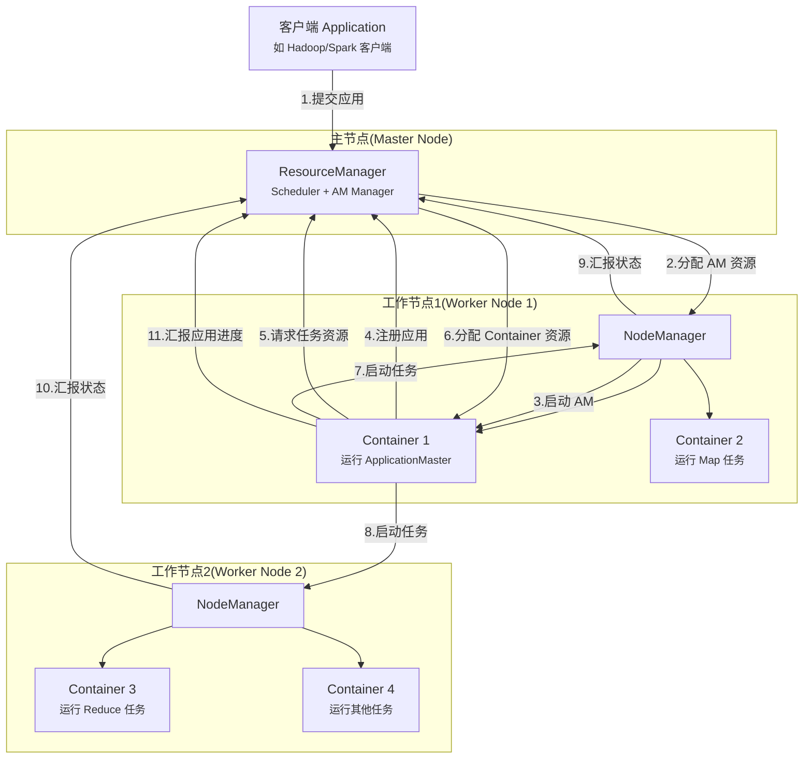
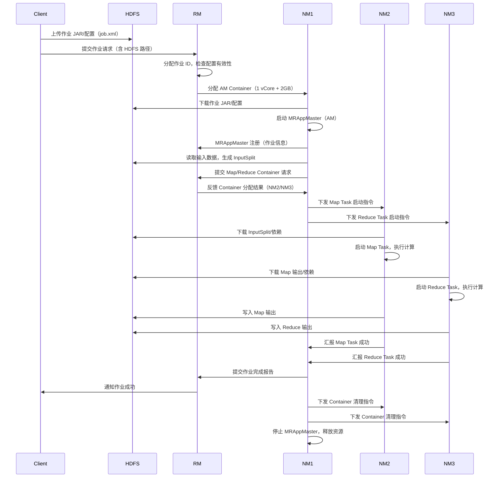
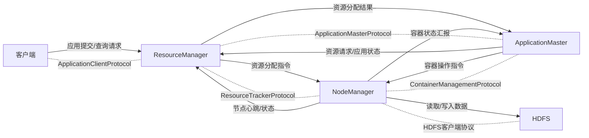
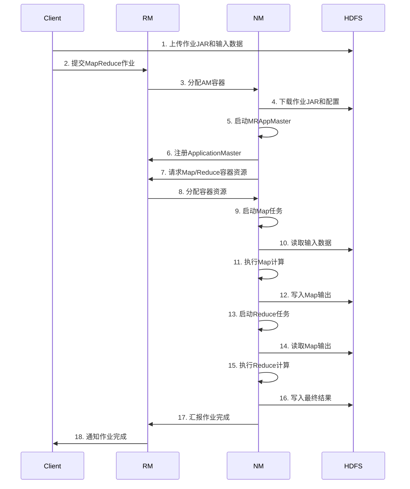
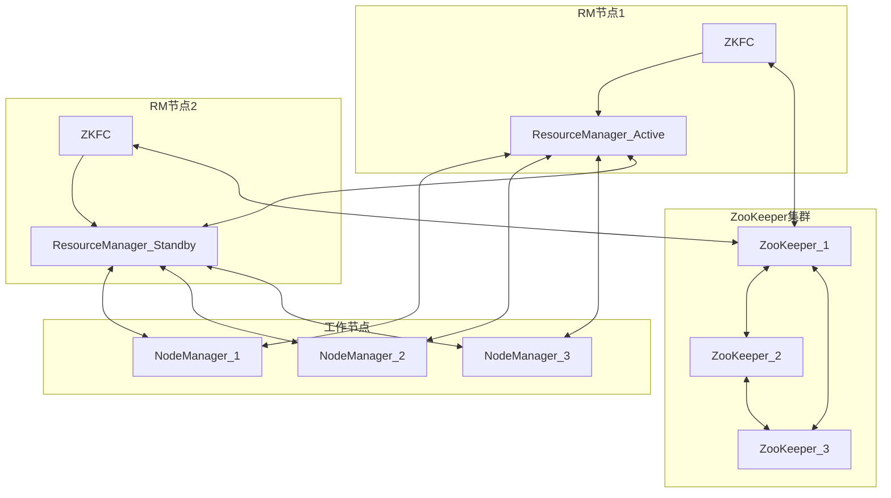

# 一、认知定位（Why & What）
## 1. 背景与起源

### 1.1 Hadoop 1.x的架构痛点
- **计算与资源管理耦合**：Hadoop 1.x中，MapReduce框架同时承担“计算任务调度”与“集群资源管理”双重职责，组件高度耦合。当集群规模扩大（如节点数超千台）时，**JobTracker**（MapReduce的核心组件）会面临负载过高、响应延迟的问题，成为集群扩展的瓶颈。
- **资源利用率低**：1.x仅支持MapReduce一种计算框架，集群资源只能服务于批处理任务，无法同时运行实时计算（如Storm）、交互式查询（如Hive）等其他类型任务，导致资源闲置，尤其在非批处理任务需求增加的场景下，资源浪费问题突出。
- **可靠性与容错性不足**：JobTracker是单点架构，一旦发生故障，整个集群的计算任务会中断，且恢复过程复杂，无法保障生产环境下的高可用性；同时，资源分配粒度较粗（以“槽位Slot”为单位，分为Map Slot和Reduce Slot），不同类型任务无法灵活复用资源，进一步降低容错场景下的资源调配效率。

### 1.2 YARN的诞生与核心目标

- 2012年，Hadoop 2.x正式引入YARN（Yet Another Resource Negotiator 又一个资源协调器），作为独立的资源管理与作业调度框架，核心目标是解耦Hadoop的“资源管理”与“计算任务执行”，解决1.x的架构局限。
- 具体目标包括：实现集群资源的统一管理与动态分配，支持多计算框架（MapReduce、Spark、Flink等）共享集群资源；提升集群扩展性（支持万级节点）与可靠性（核心组件高可用）；优化资源利用率，满足不同类型计算任务（批处理、流处理、交互式查询）的资源需求。

## 2. 核心抽象

### 2.1 核心组件模型（“一主两从+应用代理”架构）

- **ResourceManager（RM）- 集群资源“总管家”**
  - 全局唯一，负责集群整体资源（CPU、内存、磁盘、网络等）的分配与管理，是YARN的核心决策组件。
  - 核心子模块：调度器（Scheduler）—— 仅负责资源分配，不参与任务监控与容错；应用管理器（ApplicationManager）—— 负责接收应用提交、启动/管理ApplicationMaster、监控ApplicationMaster状态并处理故障。
- **NodeManager（NM）- 节点资源“执行者”**
  - 部署在集群每个节点上，负责单个节点的资源管理与任务执行。
  - 核心职责：向ResourceManager汇报节点资源使用情况（剩余CPU、内存等）；接收ResourceManager的资源分配指令，创建/销毁Container（资源容器）；监控Container的资源使用情况（如内存超限则kill容器）；管理节点级别的日志与附属服务（如作业历史服务）。
- **ApplicationMaster（AM）- 应用“代理人”**
  - 每个应用（如一个MapReduce作业、一个Spark任务）对应一个ApplicationMaster，由ResourceManager的应用管理器启动（首次启动在NodeManager的Container中）。
  - 核心职责：代表应用与ResourceManager协商资源（申请Container）；将申请到的Container分配给具体任务，并与NodeManager通信，启动/监控任务执行；负责应用级别的容错（如任务失败后重新申请资源启动任务）。
- **Container - 资源“封装单元”**
  - YARN的最小资源分配单位，封装了节点上的一定量资源（如1核CPU、2GB内存），并隔离不同应用的资源使用。
  - 特性：资源按需分配，支持动态调整；仅在任务执行期间存在，任务结束后Container释放资源；每个Container对应一个具体任务（如Map任务、Reduce任务、Spark Executor任务）。

### 2.2 资源调度与分配模型
- **两级调度机制**：第一级由ResourceManager的调度器（如Capacity Scheduler、Fair Scheduler）将集群资源分配给不同应用（以“资源池”为单位）；第二级由应用的ApplicationMaster将分配到的资源进一步分配给具体任务（创建Container）。
- **基于队列的资源隔离**：支持通过队列划分资源（如按部门、按应用类型创建队列），调度器可配置队列的资源配额（如最小资源占比、最大资源上限），避免单个应用占用过多资源，保障集群资源的公平性与稳定性。
- **动态资源调整**：支持根据应用任务的实际资源需求动态调整Container的资源（如内存不足时申请扩容），相比Hadoop 1.x的固定Slot模型，大幅提升资源利用率。

### 2.3 作业执行流程模型

1. 客户端提交应用（如MapReduce作业）到ResourceManager，指定应用所需资源与ApplicationMaster启动参数；
2. ResourceManager的应用管理器为应用分配第一个Container，并通知对应节点的NodeManager启动ApplicationMaster；
3. ApplicationMaster启动后，向ResourceManager的调度器申请后续任务所需的Container资源；
4. 调度器根据队列配额、资源空闲情况，将Container分配给ApplicationMaster；
5. ApplicationMaster通知对应节点的NodeManager创建Container，并将任务分发到Container中执行；
6. 任务执行过程中，NodeManager监控Container资源使用情况，ApplicationMaster监控任务执行状态；
7. 所有任务执行完成后，ApplicationMaster向ResourceManager申请注销应用，释放所有资源，作业执行结束。

## 3. 哲学与定位

### 3.1 YARN的核心哲学
- **解耦与统一**：通过分离“资源管理”与“计算执行”，实现集群资源的统一管理，打破Hadoop 1.x的框架垄断，支持多计算框架共享集群，体现“一次部署，多框架复用”的设计理念。
- **弹性与高效**：以动态资源分配、细粒度Container为核心，适配不同类型计算任务的资源需求（批处理需高吞吐量、流处理需低延迟），最大化集群资源利用率，同时支持集群规模的弹性扩展（从百级节点到万级节点）。
- **可靠与容错**：核心组件（ResourceManager）支持高可用（HA）部署（通过ZooKeeper实现主备切换），ApplicationMaster与NodeManager具备故障检测与自动恢复能力，保障生产环境下的集群稳定性。

### 3.2 YARN在Hadoop生态中的位置
- **生态核心枢纽**：YARN是Hadoop生态系统的“资源调度中心”，位于底层存储（HDFS、HBase）与上层计算框架（MapReduce、Spark、Flink、Hive、Storm）之间，**承上启下**：向下管理集群硬件资源，向上为各类计算框架提供统一的资源接口，是所有计算任务运行的基础支撑。
- **大数据平台基石**：无论是批处理（MapReduce、Spark Batch）、流处理（Flink、Spark Streaming）、交互式查询（Hive on Tez、Presto），还是机器学习任务（Spark MLlib、TensorFlow on YARN），均需通过YARN获取集群资源，其性能与稳定性直接决定整个大数据平台的运行效率。

### 3.3 YARN与其他资源管理技术的对比
#### 3.3.1 与Hadoop 1.x MapReduce架构对比
| 维度                | Hadoop 1.x MapReduce       | Hadoop YARN                |
|---------------------|----------------------------|----------------------------|
| 架构耦合度          | 计算与资源管理高度耦合     | 计算与资源管理完全解耦     |
| 核心组件            | JobTracker（单点）、TaskTracker | ResourceManager（HA）、NodeManager、ApplicationMaster |
| 资源分配单位        | 固定Slot（Map Slot/Reduce Slot） | 动态Container（CPU+内存）  |
| 多框架支持          | 仅支持MapReduce            | 支持Spark、Flink、Hive等多框架 |
| 集群扩展性          | 受限（千级节点瓶颈～4000）  | 高（万级节点支持）         |
| 容错性              | 低（JobTracker单点故障）   | 高（RM HA、AM容错）        |

#### 3.3.2 与Apache Mesos对比
- **定位差异**：YARN是专为大数据计算场景设计的资源管理器，深度适配Hadoop生态组件（HDFS、MapReduce等）；Mesos是通用型资源管理器，支持大数据计算、容器（Docker）、服务部署等多场景，适用范围更广。
- **调度粒度**：YARN以“应用”为单位进行资源调度，每个应用由独立AM管理；Mesos以“任务”为单位调度，支持更细粒度的资源共享（如多个应用共享同一节点的CPU核心）。
- **生态兼容性**：YARN与Hadoop生态无缝集成，无需额外配置即可运行Spark、Flink等框架；Mesos需通过Marathon、Chronos等组件适配大数据框架，集成成本略高。
- **集群规模**：两者均支持万级节点，但YARN在超大规模大数据集群（如十万级节点）的稳定性与性能优化上更具优势，Mesos在混合部署场景（大数据+容器）下更灵活。

#### 3.3.3 与Kubernetes（K8s）对比
- **核心场景**：YARN聚焦大数据计算任务（批处理、流处理），资源调度优化针对计算密集型/内存密集型任务；K8s聚焦容器编排与服务化部署，支持微服务、大数据任务、AI任务等多场景，更侧重“应用生命周期管理”。
- **资源模型**：YARN的Container仅封装CPU、内存等计算资源，依赖NodeManager实现资源隔离；K8s的Pod支持CPU、内存、GPU、存储等多类型资源，通过CGroup、Namespace实现更严格的容器隔离，资源模型更丰富。
- **生态集成**：YARN与HDFS、HBase等Hadoop组件原生集成，大数据任务提交更便捷；K8s需通过Volumes、ConfigMaps等组件适配HDFS，集成复杂度较高，但可借助K8s的自动扩缩容、滚动更新能力优化大数据任务运维。
- **容错机制**：YARN通过AM重试、RM HA实现容错，针对大数据任务的失败恢复优化更成熟；K8s通过Pod重启、Deployment控制器、StatefulSet等实现容错，更适合长周期服务的稳定性保障。

# 二、原理支撑（How - Theory）
## 1. 体系结构

### 1.1 核心组件（及部署后进程作用）
YARN 体系的核心组件通过“主从架构+应用代理”模式实现资源管理与任务调度解耦，部署后对应 3 类关键进程，各组件功能如下：
- **ResourceManager（RM）**：全局唯一主进程，负责集群资源统筹管理与应用生命周期协调，包含 2 个核心子模块：
  - **Scheduler（调度器）**：纯资源分配组件，根据调度策略（如容量、公平）将集群资源（CPU、内存）分配给应用，不负责应用监控与故障恢复；
  - **ApplicationsManager（AM 管理器）**：负责接收应用提交请求、为应用启动首个 Container（用于运行 AM）、监控 AM 健康状态（若 AM 故障，需判断是否重启）。
- **NodeManager（NM）**：每个节点唯一从进程，负责单节点资源管理与容器生命周期管控：
  - 节点资源管控：实时采集节点剩余 CPU、内存资源，通过心跳汇报给 RM；
  - 容器生命周期管理：接收 RM/AM 指令，执行 Container 的启动、停止、资源隔离（通过 Linux Cgroups 实现）；
  - 任务日志管理：收集 Container 运行日志，提供日志聚合与查询能力。
- **ApplicationMaster（AM）**：每个应用（如 MapReduce Job、Spark Application）专属的“应用代理”，无独立部署进程（运行在 Container 中）：
  - 资源请求代理：向 RM 的 Scheduler 申请应用所需的 Container 资源；
  - 任务调度执行：将申请到的 Container 分配给具体任务（如 Map Task、Reduce Task），并向 NM 下发任务启动指令；
  - 任务监控容错：实时监控任务运行状态，若任务故障，协调 NM 重启任务（需在 RM 允许的重试次数内）。
- **Container**：YARN 资源分配的最小逻辑单位，非独立进程（是 NM 管理的资源隔离单元）：
  - 资源封装：包含固定规格的资源（如 1 vCore CPU + 2GB 内存），是任务运行的“资源容器”；
  - 环境隔离：通过 Cgroups 实现 CPU、内存资源限制，避免不同任务间资源抢占；
  - 任务载体：每个 Container 仅运行 1 个任务（如 AM、Map Task、Reduce Task），任务生命周期与 Container 绑定。

### 1.2 组件关系
YARN 各组件通过“主从通信+应用代理交互”形成稳定协作关系，核心交互逻辑如下：
- **RM 与 NM**：主从管控关系
  - NM 定期（默认 3 秒）向 RM 发送心跳，汇报节点资源状态（剩余资源、Container 状态）；
  - RM 基于心跳信息更新集群资源视图，向 NM 下发 Container 分配/回收指令。
- **RM 与 AM**：应用统筹关系
  - AM 启动后向 RM 注册，汇报应用基本信息（如应用 ID、所需资源总量）；
  - AM 向 RM 提交资源请求，RM 的 Scheduler 基于策略分配资源并反馈给 AM；
  - RM 监控 AM 状态，若 AM 故障且符合重启条件（如 MapReduce 允许 AM 重启 1 次），则为其重新分配 Container 启动 AM。
- **AM 与 NM**：任务执行协调关系
  - AM 向 NM 下发 Container 启动指令（含任务脚本、资源规格、环境变量）；
  - NM 启动 Container 后，向 AM 反馈 Container 运行状态（启动成功、运行中、失败）；
  - 任务运行中，AM 通过 NM 获取任务日志，若任务故障，向 NM 下发 Container 重启指令。
- **Container 与其他组件**：资源依赖关系
  - Container 的创建由 RM 分配资源、AM 发起请求、NM 执行启动，三者协同完成；
  - Container 的资源上限由 RM 调度器定义，NM 通过 Cgroups 强制执行，AM 监控 Container 资源使用（避免超配）。

### 1.3 整体架构图

## 2. 核心机制

### 2.1 调度机制（资源分配策略）
YARN 通过“调度器”实现集群资源的公平、高效分配，生产环境中主流调度器分为 3 类，核心差异通过表格对比如下：

| 调度器类型       | 核心特点                                  | 适用场景                          | 优缺点                                  | 市占率（生产环境） |
|------------------|-------------------------------------------|-----------------------------------|-----------------------------------------|--------------------|
| FIFO Scheduler   | 按应用提交顺序排队，先到先得，无优先级区分 | 小规模集群、单用户场景（如测试环境）| 优点：实现简单、无额外配置；缺点：大应用阻塞小应用，资源利用率低 | < 5%               |
| Capacity Scheduler | 按“队列”划分资源，每个队列有固定资源容量，队列内按 FIFO/优先级调度 | 多部门共享集群（如企业内部多业务线）| 优点：资源隔离性强、支持队列权重调整；缺点：闲置资源共享灵活性低 | ~40%               |
| Fair Scheduler    | 按“用户/队列”实现资源公平分配，闲置资源自动共享 | 多用户、多应用类型集群（如大数据平台）| 优点：资源利用率高、支持资源抢占（可配置）；缺点：配置复杂、抢占可能影响稳定性 | ~55%               |

### 2.2 容错机制（故障检测与恢复）
YARN 通过“心跳检测+状态持久化”实现各组件的故障容错，核心逻辑按组件分类如下：
- **ResourceManager 容错（RM HA）**：
  - 部署模式：1 个 Active RM（对外提供服务）+ 1 个 Standby RM（同步状态，备用），配合 3 个以上 JournalNode（存储 RM 元数据，如应用状态、资源分配记录）；
  - 故障检测：通过 ZKFC（ZooKeeper Failover Controller）实现 Active/Standby 状态监控，ZKFC 定期向 ZooKeeper 注册节点，若 Active RM 失联，ZKFC 触发“脑裂防护”（确保仅 1 个 RM 成为 Active）；
  - 恢复逻辑：Standby RM 从 JournalNode 同步最新元数据，切换为 Active 后，通过 NM 心跳重新获取集群资源状态，无需重启已运行的应用（AM/Container 状态由 NM 汇报）。
- **NodeManager 容错**：
  - 故障检测：RM 若超过“超时阈值”（默认 10 分钟）未收到 NM 心跳，标记该 NM 为“失联”；
  - 恢复逻辑：RM 回收该 NM 上所有已分配的 Container 资源，将这些资源重新纳入集群可用资源池；AM 监控到该节点上的任务故障后，向 RM 重新申请资源，在其他正常 NM 上重启任务。
- **ApplicationMaster 容错**：
  - 故障检测：RM 若超过“AM 超时阈值”（默认 10 分钟）未收到 AM 心跳，判定 AM 故障；
  - 恢复逻辑：RM 根据应用配置的“AM 重试次数”（如 MapReduce 默认 1 次，Spark 可配置）决定是否重启：
    - 允许重启：RM 为 AM 重新分配 1 个 Container，启动新 AM，新 AM 通过“状态恢复机制”（如 MapReduce 从 HDFS 读取 Job 配置，Spark 从 Checkpoint 恢复）获取应用历史状态；
    - 不允许重启：直接标记应用为“失败”，向客户端返回故障信息。
- **Container 容错**：
  - 故障检测：AM 定期向 NM 查询 Container 状态，若 Container 进程崩溃或资源超配（被 NM 杀死），NM 向 AM 反馈“Container 失败”；
  - 恢复逻辑：AM 若未超过“任务重试次数”（如 Map Task 默认 4 次，Reduce Task 默认 2 次），向 RM 重新申请 Container，在其他 NM 上重启任务；若超过重试次数，标记应用为“失败”。

### 2.3 YARN 工作机制（整体运行逻辑）
YARN 作为“通用资源管理平台”，核心工作机制可概括为“资源管理与任务调度解耦”，整体流程如下：
1. **资源初始化**：集群启动时，NM 向 RM 发送“注册请求”，汇报节点资源总量（CPU 核数、内存大小），RM 构建全局资源视图；
2. **应用提交**：客户端向 RM 提交应用，携带应用配置（如任务数量、资源需求）与运行脚本；
3. **AM 启动**：RM 的 ApplicationsManager 为应用分配 1 个“AM Container”，通知对应 NM 启动 AM；
4. **资源请求**：AM 启动后向 RM 注册，基于应用任务需求，生成“资源请求清单”（如需要 10 个 Map Task Container，每个 1 vCore + 2GB 内存），定期向 RM 提交请求；
5. **资源分配**：RM 的 Scheduler 根据调度策略，从集群可用资源中筛选匹配的 NM，为 AM 分配 Container，并将“Container 分配结果”（含 NM 地址、资源规格）反馈给 AM；
6. **任务执行**：AM 向分配到的 NM 下发“Container 启动指令”，NM 基于指令启动 Container，执行具体任务（如 Map Task），并实时向 AM 汇报任务状态；
7. **应用完成**：所有任务执行完毕后，AM 向 RM 提交“应用完成报告”，RM 标记应用为“成功”，并通知客户端；AM 与所有 Container 被 NM 清理，释放资源。

### 2.4 作业提交流程（以 MapReduce 作业为例）
MapReduce 作业是 YARN 最典型的应用场景，其提交流程覆盖 YARN 核心组件交互，具体步骤与流程图表如下：

#### 2.4.1 作业提交详细步骤
1. **客户端准备作业**：客户端（如 `hadoop jar` 命令）将作业 JAR 包、输入数据路径、输出路径等配置写入 HDFS，生成“作业配置文件”（job.xml），并向 RM 发送“作业提交请求”；
2. **RM 接收并初始化作业**：RM 的 ApplicationsManager 接收请求，为作业分配“作业 ID”，检查 HDFS 中作业配置与 JAR 包的有效性（如输出路径是否已存在），通过 Scheduler 为作业启动首个 Container（用于运行 MRAppMaster，即 MapReduce 的 AM）；
3. **NM 启动 MRAppMaster**：RM 通知指定 NM 启动“AM Container”，NM 下载 HDFS 中的作业配置与 JAR 包，启动 MRAppMaster 进程；
4. **MRAppMaster 注册与任务规划**：MRAppMaster 向 RM 注册，汇报作业基本信息（如 Map 任务数、Reduce 任务数），并读取 HDFS 中的输入数据，规划 Map 任务分片（InputSplit）；
5. **MRAppMaster 申请 Container**：MRAppMaster 根据任务分片数量，向 RM 的 Scheduler 提交“Container 资源请求”（如每个 Map 任务需 1 vCore + 1GB 内存，每个 Reduce 任务需 2 vCore + 4GB 内存）；
6. **RM 分配 Container 并反馈**：Scheduler 根据调度策略（如 Capacity）为 Map/Reduce 任务分配 Container，将 Container 对应的 NM 地址、资源规格反馈给 MRAppMaster；
7. **NM 启动任务 Container**：MRAppMaster 向分配到的 NM 下发“Container 启动指令”，NM 下载任务依赖（如 JAR 包、分片数据），启动 Map/Reduce Task 进程；
8. **任务执行与状态汇报**：Task 进程读取输入数据（Map 任务读分片，Reduce 任务读 Map 输出），执行计算逻辑，将输出写入 HDFS；NM 实时向 MRAppMaster 汇报 Task 状态（运行中/成功/失败）；
9. **作业完成与清理**：所有 Map/Reduce 任务执行完毕后，MRAppMaster 向 RM 提交“作业完成报告”，RM 标记作业为“成功”，并通知客户端；MRAppMaster 触发 Container 清理（停止所有 Task 进程），自身退出后，NM 释放 AM Container 资源。

#### 2.4.2 作业提交流程图



## 3. 抽象建模

### 3.1 核心抽象概念
YARN 为解决“集群资源统一管理+多应用类型适配”的现实问题，抽象出 4 个核心概念，覆盖资源、应用、任务的全生命周期：
- **资源抽象：CPU + 内存**
  - 现实问题：不同任务对硬件资源的需求不同（如 Map 任务需内存少、CPU 多，Reduce 任务需内存多），需量化资源规格；
  - 技术抽象：YARN 默认将资源分为“CPU 虚拟核（vCore）”与“内存（GB/MB）”，每个资源维度均设定“最小单位”（如 CPU 最小 1 vCore，内存最小 128MB），支持通过配置扩展其他资源（如 GPU、磁盘 IO）。
- **应用抽象：Application**
  - 现实问题：集群需运行多种应用（MapReduce、Spark、Flink），需统一应用的提交与管理接口；
  - 技术抽象：每个应用对应 1 个“Application ID”，包含 3 个核心属性：
    - 应用配置：资源需求（单 Container 规格、总 Container 数量）、运行脚本（如 `mapred-site.xml`、Spark 任务 Jar）；
    - 生命周期状态：提交中→初始化→运行中→成功/失败；
    - 代理组件：每个 Application 绑定 1 个 AM，由 AM 代理完成资源请求与任务调度。
- **任务抽象：Task**
  - 现实问题：应用需拆解为多个并行任务（如 MapReduce 拆分为 Map/Reduce Task），需统一任务的执行与监控逻辑；
  - 技术抽象：Task 是应用的最小执行单元，与 Container 一一绑定，包含：
    - 任务类型：如 Map Task、Reduce Task、Spark Executor Task；
    - 依赖信息：输入数据路径（HDFS 地址）、运行依赖（JAR 包、环境变量）；
    - 状态流转：待启动→启动中→运行中→成功/失败（可重试）。
- **资源容器抽象：Container**
  - 现实问题：需隔离不同任务的资源使用，避免单个任务抢占集群资源；
  - 技术抽象：Container 是“资源+环境”的封装单元，具备 2 个核心特性：
    - 资源独占性：每个 Container 拥有固定的 CPU/内存配额，由 NM 通过 Cgroups 强制隔离；
    - 生命周期绑定：Container 从“分配→启动→运行→停止”的生命周期，与 Task 完全同步，Task 结束后 Container 立即释放资源。

### 3.2 建模逻辑（现实问题→技术方案）
YARN 的建模逻辑围绕“解耦资源管理与任务调度”这一核心目标，将现实中的集群管理问题转化为分层技术模型，具体映射关系如下：
1. **现实问题 1：多应用争抢集群资源，导致资源利用率低**
   - 建模思路：将“资源分配”与“任务执行”解耦，抽象出“ResourceManager（负责资源管理）”与“ApplicationMaster（负责任务调度）”；
   - 技术方案：RM 仅关注“资源分给谁”（按调度策略分配 Container），AM 仅关注“资源怎么用”（将 Container 分配给具体任务），避免应用直接争抢资源。
2. **现实问题 2：不同应用类型（批处理、流处理）的任务逻辑差异大，难以统一管理**
   - 建模思路：抽象出“通用应用代理（AM）”，让 AM 适配不同应用的任务逻辑，RM 无需感知应用类型；
   - 技术方案：MapReduce 应用对应 MRAppMaster，Spark 应用对应 SparkApplicationMaster，所有 AM 均通过 RM 统一的“资源请求接口”与“状态汇报接口”交互，实现多应用类型适配。
3. **现实问题 3：节点故障导致任务中断，需保证应用运行稳定性**
   - 建模思路：抽象出“状态持久化”与“故障检测”机制，将应用/任务状态与硬件节点解耦；
   - 技术方案：RM 元数据存储在 JournalNode，AM 状态通过 HDFS/Checkpoint 持久化，NM 心跳实现故障检测，故障后通过“资源重分配+任务重启”恢复应用运行，无需依赖具体硬件节点。

## 4. 流转逻辑

### 4.1 数据/信息/指令传递路径
YARN 中各类数据（如配置信息、资源状态）、信息（如应用状态、任务状态）、指令（如 Container 启动/停止）通过“组件间交互接口”传递，核心路径按角色分类如下：
- **客户端 ↔ ResourceManager**：
  - 传递内容：应用提交请求（含作业配置、HDFS 路径）、应用状态查询请求、作业取消指令；
  - 传递协议：基于 RPC（Remote Procedure Call）的 `ApplicationClientProtocol` 协议。
- **ResourceManager ↔ NodeManager**：
  - 传递内容：
    - RM→NM：Container 分配指令（含 Container ID、资源规格、AM 地址）、Container 回收指令；
    - NM→RM：节点心跳（含剩余 CPU/内存、Container 状态列表）、节点注册请求；
  - 传递协议：基于 RPC 的 `ResourceTrackerProtocol` 协议。
- **ResourceManager ↔ ApplicationMaster**：
  - 传递内容：
    - AM→RM：应用注册请求（含应用 ID、AM 地址）、资源请求（含 Container 数量、资源规格）、应用状态汇报（含任务成功/失败数）；
    - RM→AM：资源分配结果（含 NM 地址、Container ID）、应用停止指令；
  - 传递协议：基于 RPC 的 `ApplicationMasterProtocol` 协议。
- **ApplicationMaster ↔ NodeManager**：
  - 传递内容：
    - AM→NM：Container 启动指令（含任务脚本、依赖路径、环境变量）、Container 停止指令、任务日志查询请求；
    - NM→AM：Container 状态汇报（启动成功/运行中/失败）、任务日志数据；
  - 传递协议：基于 RPC 的 `ContainerManagementProtocol` 协议。
- **NodeManager ↔ HDFS**：
  - 传递内容：作业 JAR 包、应用配置文件、任务输入数据（从 HDFS 读取）、任务输出数据（写入 HDFS）；
  - 传递协议：基于 HDFS 的 `ClientProtocol` 协议（即 HDFS 客户端协议）。

### 4.2 关键传递的触发条件
各类数据/信息/指令的传递需满足特定“触发条件”，避免无效交互，核心触发条件如下：
- **客户端→RM：应用提交请求**：
  - 触发条件：用户执行应用提交命令（如 `hadoop jar`、`spark-submit`），且客户端完成作业配置校验（如输出路径不存在、JAR 包可访问）。
- **NM→RM：节点心跳**：
  - 触发条件：NM 进程启动后，按“固定时间间隔”（默认 3 秒）触发，无论节点状态是否变化均需发送；若节点资源/Container 状态变化（如 Container 启动/失败），则在心跳中携带最新状态。
- **AM→RM：资源请求**：
  - 触发条件：
    1. AM 完成应用初始化后，若存在未分配的任务（如 Map 任务未分配 Container）；
    2. AM 监控到任务故障，需重新申请资源时；
    3. 资源请求按“批次”触发，AM 会将多个 Container 请求合并为 1 个请求包（默认每 100ms 合并一次），减少 RPC 交互次数。
- **AM→NM：Container 启动指令**：
  - 触发条件：AM 收到 RM 反馈的“资源分配结果”后，且该 Container 对应的任务处于“待启动”状态，立即向目标 NM 下发启动指令。
- **NM→AM：Container 状态汇报**：
  - 触发条件：
    1. Container 启动/停止完成后（同步触发）；
    2. Container 运行中状态变化（如资源超配被杀死、任务执行抛出异常）；
    3. 按“固定间隔”（默认 1 秒）汇报 Container 运行状态（如 CPU/内存使用率）。
- **RM→NM：Container 回收指令**：
  - 触发条件：
    1. 应用完成后，AM 向 RM 提交“应用完成报告”，RM 触发该应用所有 Container 的回收；
    2. NM 标记为“失联”后，RM 向其他正常 NM 下发该节点上 Container 的回收指令；
    3. Container 运行超时（超过 AM 配置的“任务超时时间”），RM 触发回收。

### 4.3 流转逻辑概览图



# 三、实践应用（How - Practice）

## 1. 基础操作
### 1.1 安装部署
#### 1.1.1 环境准备
- 操作系统：推荐Linux（CentOS 7/8或Ubuntu 18.04+），需关闭SELinux和防火墙
- JDK：必须安装JDK 8（Hadoop 3.x推荐1.8.0_201及以上版本）
- 网络：所有节点之间可互相ping通，配置好主机名与IP映射（/etc/hosts）
- 免密登录：主节点到所有从节点需配置SSH免密登录
- 磁盘：建议每个节点挂载独立数据盘，格式化为ext4/xfs文件系统

#### 1.1.2 安装步骤（Hadoop 3.3.x为例）
1. 下载Hadoop安装包：`wget https://archive.apache.org/dist/hadoop/common/hadoop-3.3.4/hadoop-3.3.4.tar.gz`
2. 解压到指定目录：`tar -zxvf hadoop-3.3.4.tar.gz -C /opt/`
3. 配置环境变量（/etc/profile）：
   ```
   export HADOOP_HOME=/opt/hadoop-3.3.4
   export PATH=$PATH:$HADOOP_HOME/bin:$HADOOP_HOME/sbin
   ```
4. 使环境变量生效：`source /etc/profile`
5. 修改Hadoop配置文件（$HADOOP_HOME/etc/hadoop）：
   - hadoop-env.sh：配置`export JAVA_HOME=/usr/local/jdk1.8.0_201`
   - core-site.xml：配置HDFS namenode地址
   - hdfs-site.xml：配置HDFS副本数及数据存储路径
   - yarn-site.xml：配置YARN相关参数
   - mapred-site.xml：配置MapReduce使用YARN
   - workers：添加所有从节点主机名

#### 1.1.3 集群启动与验证
1. 初始化HDFS：`hdfs namenode -format`（仅首次启动时执行）
2. 启动HDFS：`start-dfs.sh`
3. 启动YARN：`start-yarn.sh`
4. 验证服务状态：
   - 执行`jps`命令，主节点应包含ResourceManager、NameNode、SecondaryNameNode
   - 从节点应包含NodeManager、DataNode
   - 访问Web界面：YARN ResourceManager（http://主节点IP:8088）

### 1.2 核心配置
#### 1.2.1 主要配置文件
- yarn-site.xml：YARN核心配置文件，包含RM、NM、调度器等配置
- mapred-site.xml：MapReduce相关配置，指定使用YARN作为资源管理器
- capacity-scheduler.xml：容量调度器配置（若使用容量调度器）
- fair-scheduler.xml：公平调度器配置（若使用公平调度器）

#### 1.2.2 关键配置参数（yarn-site.xml）
- `yarn.resourcemanager.hostname`：ResourceManager所在节点主机名
- `yarn.nodemanager.resource.memory-mb`：节点可分配的总内存（MB）
- `yarn.nodemanager.resource.cpu-vcores`：节点可分配的总虚拟CPU核心数
- `yarn.scheduler.minimum-allocation-mb`：单个Container最小内存（MB）
- `yarn.scheduler.maximum-allocation-mb`：单个Container最大内存（MB）
- `yarn.scheduler.minimum-allocation-vcores`：单个Container最小CPU核心数
- `yarn.scheduler.maximum-allocation-vcores`：单个Container最大CPU核心数
- `yarn.nodemanager.aux-services`：配置为`mapreduce_shuffle`，支持MapReduce洗牌操作

#### 1.2.3 配置示例（单节点测试环境）
```xml
<configuration>
  <!-- ResourceManager配置 -->
  <property>
    <name>yarn.resourcemanager.hostname</name>
    <value>localhost</value>
  </property>
  
  <!-- NodeManager配置 -->
  <property>
    <name>yarn.nodemanager.resource.memory-mb</name>
    <value>4096</value>
  </property>
  <property>
    <name>yarn.nodemanager.resource.cpu-vcores</name>
    <value>2</value>
  </property>
  
  <!-- 容器资源配置 -->
  <property>
    <name>yarn.scheduler.minimum-allocation-mb</name>
    <value>512</value>
  </property>
  <property>
    <name>yarn.scheduler.maximum-allocation-mb</name>
    <value>2048</value>
  </property>
  
  <!-- 启用MapReduce洗牌服务 -->
  <property>
    <name>yarn.nodemanager.aux-services</name>
    <value>mapreduce_shuffle</value>
  </property>
</configuration>
```

### 1.3 常用命令
#### 1.3.1 集群管理命令
- 启动YARN集群：`start-yarn.sh`
- 停止YARN集群：`stop-yarn.sh`
- 单独启动ResourceManager：`yarn --daemon start resourcemanager`
- 单独停止ResourceManager：`yarn --daemon stop resourcemanager`
- 单独启动NodeManager：`yarn --daemon start nodemanager`
- 单独停止NodeManager：`yarn --daemon stop nodemanager`
- 查看集群状态：`yarn node -list -all`

#### 1.3.2 应用管理命令
- 提交MapReduce作业：`yarn jar <jar包路径> <主类> [参数]`
- 查看应用列表：`yarn application -list`
- 查看应用状态：`yarn application -status <应用ID>`
- 杀死应用：`yarn application -kill <应用ID>`
- 查看应用日志：`yarn logs -applicationId <应用ID>`
- 查看容器列表：`yarn container -list <应用尝试ID>`

#### 1.3.3 队列管理命令
- 查看队列信息：`yarn queue -status <队列名称>`
- 更新队列配置：`yarn queue -update <队列名称>`

### 1.4 核心API
#### 1.4.1 Java API基础
YARN提供了Java API用于与ResourceManager交互，主要包括：
- `YarnClient`：用于提交应用、查询应用状态等
- `ApplicationSubmissionContext`：封装应用提交信息
- `Resource`：定义资源需求（内存、CPU等）
- `ContainerLaunchContext`：定义容器启动信息

#### 1.4.2 应用提交示例代码
```java
import org.apache.hadoop.conf.Configuration;
import org.apache.hadoop.yarn.api.records.*;
import org.apache.hadoop.yarn.client.api.YarnClient;
import org.apache.hadoop.yarn.client.api.YarnClientFactory;
import org.apache.hadoop.yarn.exceptions.YarnException;
import org.apache.hadoop.yarn.util.Records;

import java.io.IOException;
import java.util.ArrayList;
import java.util.List;

public class YarnAppSubmitter {
    public static void main(String[] args) throws IOException, YarnException {
        // 1. 创建配置和YARN客户端
        Configuration conf = new Configuration();
        YarnClient yarnClient = YarnClientFactory.createYarnClient();
        yarnClient.init(conf);
        yarnClient.start();
        
        // 2. 创建应用提交上下文
        ApplicationSubmissionContext appContext = Records.newRecord(ApplicationSubmissionContext.class);
        ApplicationId appId = yarnClient.createApplication().getApplicationSubmissionContext().getApplicationId();
        appContext.setApplicationId(appId);
        appContext.setApplicationName("MyYarnApp");
        
        // 3. 设置AM容器资源需求
        Resource resource = Records.newRecord(Resource.class);
        resource.setMemorySize(1024); // 1GB内存
        resource.setVirtualCores(1); // 1个虚拟CPU核心
        appContext.setResource(resource);
        
        // 4. 设置AM启动命令
        ContainerLaunchContext amLaunchContext = Records.newRecord(ContainerLaunchContext.class);
        List<String> commands = new ArrayList<>();
        commands.add("echo 'Hello YARN' && sleep 60"); // 简单测试命令
        amLaunchContext.setCommands(commands);
        appContext.setAMContainerSpec(amLaunchContext);
        
        // 5. 提交应用
        yarnClient.submitApplication(appContext);
        System.out.println("应用已提交，ID: " + appId);
        
        // 6. 关闭客户端
        yarnClient.stop();
    }
}
```

## 2. 典型案例

### 2.1 MapReduce作业提交与运行
#### 2.1.1 准备工作
1. 确保HDFS和YARN已正常启动
2. 在HDFS上创建输入目录：`hdfs dfs -mkdir -p /user/input`
3. 上传测试数据到HDFS：`hdfs dfs -put /本地文件路径 /user/input/`
4. 准备MapReduce作业JAR包（可使用Hadoop自带的示例JAR）

#### 2.1.2 提交步骤
1. 查看Hadoop示例JAR中的可用类：`yarn jar $HADOOP_HOME/share/hadoop/mapreduce/hadoop-mapreduce-examples-3.3.4.jar`
2. 提交WordCount作业：
   ```bash
   yarn jar $HADOOP_HOME/share/hadoop/mapreduce/hadoop-mapreduce-examples-3.3.4.jar wordcount \
   /user/input /user/output/wordcount-result
   ```
3. 监控作业状态：
   - 通过Web界面：访问ResourceManager页面（http://主节点IP:8088）
   - 通过命令行：`yarn application -list` 查看应用ID，再用`yarn application -status <应用ID>`查看详情

#### 2.1.3 查看结果
1. 作业完成后，查看输出目录：`hdfs dfs -ls /user/output/wordcount-result`
2. 查看结果文件内容：`hdfs dfs -cat /user/output/wordcount-result/part-r-00000`

#### 2.1.4 作业提交流程图


### 2.2 Spark on YARN部署
#### 2.2.1 环境准备
1. 下载Spark安装包（选择对应Hadoop版本）：`wget https://archive.apache.org/dist/spark/spark-3.3.2/spark-3.3.2-bin-hadoop3.tgz`
2. 解压安装包：`tar -zxvf spark-3.3.2-bin-hadoop3.tgz -C /opt/`
3. 配置Spark环境变量：
   ```
   export SPARK_HOME=/opt/spark-3.3.2-bin-hadoop3
   export PATH=$PATH:$SPARK_HOME/bin
   ```

#### 2.2.2 提交Spark应用（Client模式）
```bash
spark-submit \
  --class org.apache.spark.examples.SparkPi \
  --master yarn \
  --deploy-mode client \
  --executor-memory 1g \
  --num-executors 2 \
  --executor-cores 1 \
  $SPARK_HOME/examples/jars/spark-examples_2.12-3.3.2.jar \
  100
```

#### 2.2.3 提交Spark应用（Cluster模式）
```bash
spark-submit \
  --class org.apache.spark.examples.SparkPi \
  --master yarn \
  --deploy-mode cluster \
  --executor-memory 1g \
  --num-executors 2 \
  --executor-cores 1 \
  $SPARK_HOME/examples/jars/spark-examples_2.12-3.3.2.jar \
  100
```

#### 2.2.4 两种模式对比
| 特性 | Client模式 | Cluster模式 |
|------|------------|-------------|
| Driver位置 | 运行在客户端 | 运行在YARN集群中 |
| 日志输出 | 直接输出到控制台 | 需通过yarn logs命令查看 |
| 网络依赖 | 客户端需与所有Executor通信 | 客户端提交后即可断开连接 |
| 适用场景 | 交互式开发、调试 | 生产环境、长时间运行的任务 |
| 容错性 | 客户端故障导致作业失败 | 客户端故障不影响作业运行 |

### 2.3 容量调度器配置与使用
#### 2.3.1 配置步骤
1. 启用容量调度器（yarn-site.xml）：
   ```xml
   <property>
     <name>yarn.resourcemanager.scheduler.class</name>
     <value>org.apache.hadoop.yarn.server.resourcemanager.scheduler.capacity.CapacityScheduler</value>
   </property>
   ```

2. 配置队列（capacity-scheduler.xml）：
   ```xml
   <!-- 配置默认队列容量 -->
   <property>
     <name>yarn.scheduler.capacity.root.default.capacity</name>
     <value>40</value>
   </property>
   
   <!-- 创建生产队列 -->
   <property>
     <name>yarn.scheduler.capacity.root.prod.capacity</name>
     <value>50</value>
   </property>
   
   <!-- 创建测试队列 -->
   <property>
     <name>yarn.scheduler.capacity.root.test.capacity</name>
     <value>10</value>
   </property>
   
   <!-- 配置队列层次结构 -->
   <property>
     <name>yarn.scheduler.capacity.root.queues</name>
     <value>default,prod,test</value>
   </property>
   
   <!-- 配置队列最大容量 -->
   <property>
     <name>yarn.scheduler.capacity.root.test.maximum-capacity</name>
     <value>20</value>
   </property>
   ```

3. 重启YARN使配置生效：`stop-yarn.sh && start-yarn.sh`

#### 2.3.2 向指定队列提交作业
```bash
# MapReduce作业指定队列
yarn jar $HADOOP_HOME/share/hadoop/mapreduce/hadoop-mapreduce-examples-3.3.4.jar wordcount \
-Dmapreduce.job.queuename=prod \
/user/input /user/output/prod-result

# Spark作业指定队列
spark-submit \
--class org.apache.spark.examples.SparkPi \
--master yarn \
--deploy-mode cluster \
--queue test \
--executor-memory 1g \
$SPARK_HOME/examples/jars/spark-examples_2.12-3.3.2.jar \
100
```

## 3. 问题诊断

### 3.1 启动故障
#### 3.1.1 ResourceManager启动失败
- 常见错误：`java.net.BindException: 地址已在使用`
  - 排查：使用`netstat -tunlp | grep 8032`检查端口是否被占用
  - 解决：杀死占用端口的进程或修改yarn-site.xml中RM的端口配置

- 常见错误：`ClassNotFoundException: org.apache.hadoop.yarn.server.resourcemanager.ResourceManager`
  - 排查：检查Hadoop安装包完整性和环境变量配置
  - 解决：重新安装Hadoop并正确配置HADOOP_HOME

#### 3.1.2 NodeManager启动失败
- 常见错误：`java.io.IOException: 找不到数据目录`
  - 排查：检查yarn-site.xml中配置的数据目录权限
  - 解决：确保配置的目录存在且Hadoop用户有读写权限

- 常见错误：`ContainerExitException: Container exited with a non-zero exit code 1`
  - 排查：查看NM日志（$HADOOP_HOME/logs/yarn-*-nodemanager-*.log）
  - 解决：通常是资源配置不当，调整yarn.nodemanager.resource.memory-mb等参数

### 3.2 资源分配问题
#### 3.2.1 应用一直处于ACCEPTED状态
- 原因：申请的资源超过集群可用资源或队列容量
- 排查：
  - 查看应用请求的资源：`yarn application -status <应用ID>`
  - 查看集群资源使用情况：`yarn top`
- 解决：
  - 减少应用请求的资源量
  - 增加集群节点或扩容现有节点
  - 调整队列容量配置

#### 3.2.2 Container被杀死（OOM）
- 原因：Container使用的内存超过分配的内存限制
- 排查：
  - 查看应用日志：`yarn logs -applicationId <应用ID>`
  - 查找包含"Killed process"和"Out of memory"的日志
- 解决：
  - 增加单个Container的内存分配
  - 优化应用代码，减少内存占用
  - 调整YARN内存检查参数：
    ```xml
    <property>
      <name>yarn.nodemanager.pmem-check-enabled</name>
      <value>false</value> <!-- 生产环境不建议关闭，仅用于调试 -->
    </property>
    ```

### 3.3 应用运行失败
#### 3.3.1 MapReduce作业失败
- 常见错误：`FileNotFoundException: 输入路径不存在`
  - 排查：检查提交命令中的输入路径是否正确
  - 解决：确保HDFS中存在该路径，使用`hdfs dfs -ls <路径>`验证

- 常见错误：`Permission denied: user=xxx, access=WRITE, inode="/user/output"`
  - 排查：检查输出路径的权限设置
  - 解决：修改输出目录权限或使用有足够权限的用户提交作业

#### 3.3.2 Spark on YARN失败
- 常见错误：`Application application_xxx failed 2 times due to AM Container for appattempt_xxx exited with exitCode: -104`
  - 原因：AM内存不足
  - 解决：增加AM内存：`--driver-memory 1g`

- 常见错误：`No such file or directory: hdfs://xxx/user/xxx/.sparkStaging/application_xxx/xxx.jar`
  - 原因：Spark上传JAR包到HDFS失败
  - 解决：检查HDFS空间和权限，或手动上传JAR包并指定`--jar hdfs:///path/to/jar`

### 3.4 问题排查工具
- YARN Web界面：提供应用状态、资源使用、容器信息等可视化展示
- YARN命令行工具：`yarn application`、`yarn logs`、`yarn node`等
- 日志文件：
  - ResourceManager日志：$HADOOP_HOME/logs/yarn-*-resourcemanager-*.log
  - NodeManager日志：$HADOOP_HOME/logs/yarn-*-nodemanager-*.log
  - 应用日志：可通过`yarn logs -applicationId <应用ID>`查看
- 监控工具：
  - Ganglia：集群资源监控
  - Prometheus + Grafana：配合Hadoop Exporter实现自定义监控面板

## 4. 场景扩展

### 4.1 YARN高可用配置
#### 4.1.1 架构说明

YARN高可用通过部署两个ResourceManager（Active和Standby）实现，使用ZooKeeper进行状态管理和自动故障转移。

#### 4.1.2 配置步骤
1. 配置yarn-site.xml：
   ```xml
   <!-- 启用RM高可用 -->
   <property>
     <name>yarn.resourcemanager.ha.enabled</name>
     <value>true</value>
   </property>
   
   <!-- RM实例ID列表 -->
   <property>
     <name>yarn.resourcemanager.ha.rm-ids</name>
     <value>rm1,rm2</value>
   </property>
   
   <!-- 配置每个RM的主机名 -->
   <property>
     <name>yarn.resourcemanager.hostname.rm1</name>
     <value>node1</value>
   </property>
   <property>
     <name>yarn.resourcemanager.hostname.rm2</name>
     <value>node2</value>
   </property>
   
   <!-- 配置ZooKeeper集群 -->
   <property>
     <name>yarn.resourcemanager.zk-address</name>
     <value>node1:2181,node2:2181,node3:2181</value>
   </property>
   
   <!-- 启用自动故障转移 -->
   <property>
     <name>yarn.resourcemanager.ha.automatic-failover.enabled</name>
     <value>true</value>
   </property>
   ```

2. 启动ZooKeeper集群（需提前部署）
3. 初始化RM状态：`yarn rmadmin -initializeSharedState`
4. 启动YARN集群：`start-yarn.sh`
5. 验证高可用状态：`yarn rmadmin -getAllServiceState`

#### 4.1.3 高可用架构图


### 4.2 多租户资源隔离与管理
#### 4.2.1 队列规划策略

- 按部门划分：为每个部门创建独立队列（如finance、marketing、engineering）
- 按项目划分：为重要项目创建专属队列（如projectA、projectB）
- 按作业类型划分：为不同类型作业创建队列（如batch、interactive、streaming）

#### 4.2.2 资源限制配置
- 队列容量：为每个队列分配固定比例的集群资源
- 最大容量：限制队列可使用的最大资源比例（防止资源滥用）
- 最小资源保障：确保队列在资源紧张时有最低资源保障
- 权重配置：配置队列间的资源分配权重

#### 4.2.3 权限控制配置
```xml
<!-- 配置队列提交权限 -->
<property>
  <name>yarn.scheduler.capacity.root.prod.acl_submit_applications</name>
  <value>prod_user,prod_admin</value>
</property>

<!-- 配置队列管理权限 -->
<property>
  <name>yarn.scheduler.capacity.root.prod.acl_administer_queue</name>
  <value>prod_admin</value>
</property>

<!-- 配置队列查看权限 -->
<property>
  <name>yarn.scheduler.capacity.root.prod.acl_application_max_priority</name>
  <value>*</value>
</property>
```

### 4.3 YARN与其他组件集成
#### 4.3.1 与Hive集成
Hive可通过配置使用YARN作为执行引擎，实现SQL查询的分布式执行：

1. 配置hive-site.xml：
   ```xml
   <property>
     <name>hive.execution.engine</name>
     <value>tez</value> <!-- 或mr/spark -->
   </property>
   <property>
     <name>hive.execution.mode</name>
     <value>yarn</value>
   </property>
   ```

2. 提交Hive查询：
   ```sql
   -- 直接在Hive CLI中执行，查询会自动提交到YARN
   SELECT count(*) FROM user_logs WHERE dt='2023-01-01';
   ```

#### 4.3.2 与Flink集成
Flink可以部署在YARN上，实现流处理作业的资源管理：

1. 提交Flink作业到YARN：
   ```bash
   ./bin/flink run -m yarn-cluster \
     -p 4 \
     ./examples/streaming/WordCount.jar
   ```

2. 启动Flink YARN会话（可提交多个作业）：
   ```bash
   ./bin/yarn-session.sh -n 2 -s 2 -jm 1024 -tm 2048
   ```

### 4.4 YARN集群监控与调优
#### 4.4.1 监控体系搭建
1. 基础监控：使用YARN自带的Web界面（8088端口）
2. 高级监控：
   - 部署Prometheus + Grafana
   - 安装Hadoop Exporter：`https://github.com/prometheus/jmx_exporter`
   - 配置Grafana面板，监控关键指标

#### 4.4.2 关键调优参数
- 内存配置：
  - `yarn.nodemanager.resource.memory-mb`：根据节点实际内存配置
  - `yarn.scheduler.minimum-allocation-mb`：设置合理的最小内存单位
  - `yarn.nodemanager.vmem-pmem-ratio`：虚拟内存与物理内存比率（默认2.1）

- CPU配置：
  - `yarn.nodemanager.resource.cpu-vcores`：根据节点CPU核心数配置
  - `yarn.scheduler.minimum-allocation-vcores`：设置合理的最小CPU单位

- 调度器调优：
  - 容量调度器：`yarn.scheduler.capacity.queue-mappings`配置队列自动映射
  - 公平调度器：`yarn.scheduler.fair.preemption`启用资源抢占

#### 4.4.3 性能优化实践
- 增加Container启动速度：
  - 启用本地化缓存：`yarn.nodemanager.localizer.cache.target-size-mb`
  - 配置共享缓存：`yarn.sharedcache.enabled=true`

- 优化资源利用率：
  - 启用资源超配（谨慎使用）：`yarn.nodemanager.resource.overcommit.enabled=true`
  - 配置队列弹性容量：允许队列使用其他队列的闲置资源

- 容错性优化：
  - 调整NM心跳间隔：`yarn.nodemanager.heartbeat-interval-ms`
  - 配置应用超时时间：`yarn.application.lifetime`

# 四、深度进阶（Mastery）

## 1. 性能优化

### 1.1 瓶颈分析
#### 1.1.1 资源调度瓶颈
- **队列资源争用**：多租户场景下队列资源分配不合理，导致关键作业等待
- **调度器计算开销**：大规模集群（>1000节点）中，调度器（尤其是公平调度器）决策耗时增加
- **资源碎片**：小任务频繁申请释放资源，导致集群存在大量不可用的小资源碎片

#### 1.1.2 容器生命周期瓶颈
- **容器启动延迟**：分布式缓存下载慢、JVM启动开销大，导致Container启动时间过长（>10秒）
- **资源隔离开销**：Cgroups配置不当导致CPU/内存隔离消耗过多节点资源
- **日志收集阻塞**：任务日志实时写入HDFS时，IO阻塞导致Container结束延迟

#### 1.1.3 网络与IO瓶颈
- **NodeManager与ResourceManager通信**：心跳频率过高或数据量过大，导致RM处理压力大
- **跨节点数据传输**：Shuffle阶段数据传输未本地化，导致网络带宽饱和
- **本地存储IO**：节点磁盘IO性能不足，影响Container日志写入和临时文件处理

### 1.2 调优策略
#### 1.2.1 资源调度优化
- **队列层级优化**：按作业优先级划分多级队列，核心业务队列配置更高权重
- **调度器选择**：
  - 超大规模集群（>5000节点）优先选择Capacity Scheduler（计算开销更低）
  - 多租户动态资源需求场景选择Fair Scheduler（支持抢占和弹性调整）
- **资源碎片整理**：
  - 配置最小资源单位与任务需求匹配（如任务最小需1GB内存，则`yarn.scheduler.minimum-allocation-mb=1024`）
  - 启用资源合并策略（`yarn.scheduler.capacity.resource-calculator=DominantResourceCalculator`）

#### 1.2.2 容器启动优化
- **分布式缓存预热**：
  - 配置共享缓存（`yarn.sharedcache.enabled=true`），复用公共依赖（如JAR包）
  - 调整本地化缓存大小（`yarn.nodemanager.localizer.cache.target-size-mb=10240`）
- **JVM优化**：
  - 启用JVM重用（MapReduce：`mapreduce.job.jvm.numtasks=5`，减少JVM启动次数）
  - 预启动空闲Container（`yarn.nodemanager.preallocated-containers=true`，仅适用于稳定负载场景）
- **日志收集异步化**：`yarn.nodemanager.log-aggregation.async=true`，避免日志写入阻塞任务结束

#### 1.2.3 网络与IO优化
- **心跳机制调整**：
  - 增大NM心跳间隔（`yarn.nodemanager.heartbeat-interval-ms=5000`，默认3000ms）
  - 减少心跳携带数据（`yarn.nodemanager.heartbeat.retain-seconds=300`，仅保留最近状态）
- **数据本地化增强**：
  - 提高本地化调度优先级（`mapreduce.job.locality.wait=3000`，延长等待本地资源时间）
  - 配置机架感知（`topology.data.file=./topology.data`），优化跨机架数据传输
- **存储IO优化**：
  - 日志目录与数据目录分离（`yarn.nodemanager.log-dirs`与`yarn.nodemanager.local-dirs`配置不同磁盘）
  - 启用SSD存储临时文件（`yarn.nodemanager.local-dirs=/mnt/ssd/yarn/local`）

### 1.3 最佳参数配置
#### 1.3.1 核心参数推荐（生产环境）
| 参数类别         | 参数名                                      | 推荐值          | 适用场景                  |
|------------------|---------------------------------------------|-----------------|---------------------------|
| 资源分配         | yarn.scheduler.minimum-allocation-mb         | 1024            | 通用场景                  |
| 资源分配         | yarn.scheduler.maximum-allocation-mb         | 32768           | 大内存任务（如ML训练）    |
| 资源分配         | yarn.nodemanager.resource.memory-mb          | 节点内存80%     | 避免与系统进程争用资源    |
| 容器启动         | yarn.nodemanager.localizer.cache.target-size-mb | 10240        | 共享依赖较多的集群        |
| 调度器优化       | yarn.scheduler.capacity.node-locality-delay  | 40              | 数据本地化优先的批处理    |
| 容错与稳定性     | yarn.resourcemanager.am.liveness-monitor.expiry-interval-ms | 60000 | 网络不稳定集群            |
| 日志优化         | yarn.log-aggregation.retain-seconds          | 604800          | 保留7天日志（默认7天）    |
| 性能监控         | yarn.timeline-service.enabled                | true            | 需要作业历史追踪的场景    |

#### 1.3.2 不同场景参数调整
- **离线批处理（MapReduce/Spark批处理）**：
  ```xml
  <property>
    <name>yarn.scheduler.capacity.node-locality-delay</name>
    <value>40</value> <!-- 延长本地化等待 -->
  </property>
  <property>
    <name>mapreduce.job.jvm.numtasks</name>
    <value>10</value> <!-- 提高JVM重用次数 -->
  </property>
  ```

- **实时流处理（Flink/Spark Streaming）**：
  ```xml
  <property>
    <name>yarn.scheduler.minimum-allocation-mb</name>
    <value>2048</value> <!-- 流处理任务内存需求更高 -->
  </property>
  <property>
    <name>yarn.resourcemanager.am.liveness-monitor.expiry-interval-ms</name>
    <value>120000</value> <!-- 延长AM超时时间 -->
  </property>
  ```

- **交互式查询（Hive/Impala）**：
  ```xml
  <property>
    <name>yarn.scheduler.fair.preemption</name>
    <value>true</value> <!-- 启用资源抢占，确保查询响应速度 -->
  </property>
  <property>
    <name>yarn.scheduler.fair.preemption.cluster-utilization-threshold</name>
    <value>0.8</value>
  </property>
  ```

## 2. 稳健性设计

### 2.1 容错机制深度解析
#### 2.1.1 进程级容错
- **ResourceManager容错**：
  - 内部状态维护：通过`RMStateStore`持久化应用元数据（应用ID、队列信息、资源分配记录）
  - 故障检测：基于ZooKeeper的临时节点监控Active RM状态，超时未心跳则触发切换
  - 恢复逻辑：Standby RM从`JournalNode`同步最新状态，重启后通过NM心跳重建集群资源视图

- **NodeManager容错**：
  - 健康检查：内置`NodeHealthCheckerService`定期检查磁盘健康状态（`yarn.nodemanager.disk-health-checker.min-healthy-disks=0.5`）
  - 自我恢复：NM进程崩溃时，通过操作系统服务（如systemd）自动重启，重启后重新向RM注册

#### 2.1.2 应用级容错
- **ApplicationMaster容错**：
  - 重试策略：可配置`yarn.app.mapreduce.am.max-attempts=2`（默认1次重试）
  - 状态恢复：AM重启后通过读取HDFS上的应用元数据（如MapReduce的`_temporary`目录）重建任务状态

- **Container容错**：
  - 失败检测：NM通过进程PID监控Container，结合`exitCode`判断失败类型（OOM为143，正常退出为0）
  - 重试限制：通过`mapreduce.map.maxattempts=4`和`mapreduce.reduce.maxattempts=2`控制任务重试次数

### 2.2 高可用方案实现
#### 2.2.1 ResourceManager HA架构
- **核心组件**：
  - Active RM：处理应用提交、资源分配的主服务
  - Standby RM：同步Active状态，随时准备接管
  - ZooKeeper：存储RM状态元数据，实现Leader选举
  - JournalNode集群（3+节点）：存储应用状态变更日志，保证Active与Standby数据一致

- **故障转移流程**：
  1. Active RM定期向ZooKeeper写入心跳（临时节点）
  2. 若ZooKeeper检测到心跳超时（默认5000ms），触发选举
  3. Standby RM通过JournalNode同步最新状态（最多丢失最后1条日志）
  4. Standby RM切换为Active，开始处理新请求
  5. 所有NM通过心跳发现RM切换，更新连接地址

#### 2.2.2 高可用配置最佳实践
- **JournalNode部署**：
  - 独立于RM和NM节点，避免资源争用
  - 配置`dfs.journalnode.edits.dir`到高性能磁盘（如SSD）
  - 至少3节点，确保奇数（避免脑裂）

- **ZooKeeper配置**：
  ```xml
  <property>
    <name>yarn.resourcemanager.zk-address</name>
    <value>zk1:2181,zk2:2181,zk3:2181</value>
  </property>
  <property>
    <name>yarn.resourcemanager.zk-state-store.parent-path</name>
    <value>/yarn/rmstore</value> <!-- 独立ZNode路径 -->
  </property>
  ```

- **自动故障转移**：
  ```xml
  <property>
    <name>yarn.resourcemanager.ha.automatic-failover.enabled</name>
    <value>true</value>
  </property>
  <property>
    <name>yarn.resourcemanager.ha.automatic-failover.zk-base-path</name>
    <value>/yarn/failover</value>
  </property>
  ```

### 2.3 灾备策略
#### 2.3.1 数据灾备
- **元数据备份**：
  - 定期备份JournalNode数据（`dfs.journalnode.edits.dir`）到异地存储
  - 通过`yarn rmadmin -backupSharedCache`备份共享缓存元数据

- **日志灾备**：
  - 配置`yarn.log-aggregation.remote-directory`到跨区域HDFS集群
  - 启用日志定期归档（`yarn.log-aggregation.retain-seconds=2592000`，保留30天）

#### 2.3.2 跨集群容灾
- **双活集群设计**：
  - 主集群与备集群地理隔离（不同机房）
  - 通过`DistCp`定期同步HDFS数据到备集群
  - 应用配置多集群提交能力，支持故障时切换目标集群

- **降级策略**：
  - 单集群故障时，优先保障核心作业（通过队列优先级配置）
  - 启用资源超配（`yarn.nodemanager.resource.overcommit.enabled=true`），临时提升备集群资源利用率

## 3. 本源探究

### 3.1 核心源码解析

#### 3.1.1 ResourceManager核心类
- **ResourceManager.java**：
  - 主入口类，初始化`ResourceScheduler`、`ApplicationsManager`等核心服务
  - 核心方法：`serviceStart()`（启动所有子服务）、`handleSubmitApplication()`（处理应用提交）

- **ResourceScheduler接口**：
  - 定义资源调度核心方法：`allocate()`（处理资源请求）、`submitApplication()`（注册应用）
  - 实现类：`CapacityScheduler`、`FairScheduler`、`FifoScheduler`

- **ApplicationMasterService.java**：
  - 处理AM的资源请求和状态汇报
  - 核心逻辑：`allocate()`方法通过`SchedulerApplication`匹配资源，生成`AllocateResponse`

#### 3.1.2 NodeManager核心类
- **NodeManager.java**：
  - 管理节点资源和Container生命周期，初始化`ContainerManager`、`NodeStatusUpdater`
  - 核心机制：通过`ContainerExecutor`（默认`LinuxContainerExecutor`）操作Container

- **ContainerManagerImpl.java**：
  - 处理AM的Container启动/停止请求
  - 启动流程：`startContainer()`→验证资源→准备本地目录→调用`ContainerLaunch`脚本

- **ResourceLocalizationService.java**：
  - 负责分布式缓存下载（JAR包、配置文件）
  - 优化点：通过`LocalResourcesTracker`跟踪缓存资源，避免重复下载

#### 3.1.3 调度器实现逻辑（以CapacityScheduler为例）
1. **队列初始化**：`CapacityScheduler.initialize()`解析`capacity-scheduler.xml`，构建`CapacitySchedulerQueue`树
2. **资源请求处理**：
   - AM的资源请求进入`ApplicationAttempt`的请求队列
   - `CapacityScheduler.allocate()`调用`Queue.assignContainers()`分配资源
3. **节点选择策略**：
   - 优先本地节点（同节点→同机架→其他机架）
   - 通过`DominantResourceCalculator`计算资源占比，选择最优节点

### 3.2 设计思想溯源
#### 3.2.1 核心设计理念
- **资源与调度解耦**：
  - 问题背景：MapReduce 1.x中JobTracker同时负责资源管理和任务调度，扩展性差
  - 解决方案：YARN将资源管理（RM）与任务调度（AM）分离，支持多计算框架（MapReduce/Spark/Flink）

- **通用化资源模型**：
  - 抽象资源为“可量化维度”（CPU、内存、GPU等），而非特定框架的资源概念
  - 支持自定义资源类型（通过`yarn.resource-types`配置），适配新型硬件

- **主从架构+分布式协作**：
  - RM作为主节点全局协调，NM作为从节点管理本地资源，避免单点瓶颈
  - 基于心跳的异步通信，减少组件间耦合

#### 3.2.2 与其他资源管理器的设计对比
| 设计维度       | YARN                     | Kubernetes               | Mesos                    |
|----------------|--------------------------|-------------------------|--------------------------|
| 资源模型       | 基于Container的静态资源分配 | 基于Pod的动态资源分配    | 细粒度资源切片（Offer机制）|
| 调度粒度       | 应用级（AM代理）          | 容器级                  | 框架级（Framework代理）   |
| 扩展性         | 插件化调度器             | CRD扩展                 | 模块化设计               |
| 生态适配       | 大数据框架原生支持        | 容器化应用为主          | 通用型，需适配层         |

## 4. 版本与特性

### 4.1 主流版本核心差异（2.x vs 3.x）
| 特性类别       | Hadoop 2.x                  | Hadoop 3.x                  |
|----------------|-----------------------------|-----------------------------|
| 资源管理       | 仅支持CPU、内存             | 支持GPU、FPGA等异构资源     |
| RM HA          | 需手动配置JournalNode       | 内置自动HA配置工具          |
| 容器隔离       | 基于Linux Cgroups v1        | 支持Cgroups v2              |
| 性能优化       | 无联邦机制                  | 支持YARN联邦（Federation）  |
| 安全性         | 基础Kerberos支持            | 增强型访问控制（ACLs）      |
| API兼容性      | 部分API在3.x中废弃          | 提供兼容层支持旧API         |

### 4.2 关键特性演进
#### 4.2.1 Hadoop 2.x重要特性（2.0-2.10）
- **YARN Timeline Service V1**：记录应用运行历史，但存在 scalability 问题
- **Capacity Scheduler动态调整**：支持运行时修改队列容量（`yarn queue -update`）
- **Node Labels**：支持节点标签（如GPU节点），实现作业定向调度
- **Cgroups资源隔离**：基于Cgroups限制Container的CPU、内存使用

#### 4.2.2 Hadoop 3.x重要特性（3.0-3.3）
- **YARN Timeline Service V2**：重构历史服务，基于流处理架构，支持更大规模集群
- **联邦YARN（Federation）**：允许多个RM协同工作，突破单RM瓶颈（支持10k+节点）
- **GPU/FPGA支持**：通过`yarn.resource-types=gpu`配置，支持异构计算资源调度
- **弹性Container**：允许AM动态调整Container资源（`yarn.am.elasticity.enabled=true`）
- **自动均衡器**：自动迁移Container到负载较低节点，优化资源利用率

#### 4.2.3 废弃与替代特性
| 废弃特性                  | 替代方案                          | 废弃版本 |
|---------------------------|-----------------------------------|----------|
| MapReduce JobTracker/TaskTracker | YARN + MapReduce on YARN         | 2.0      |
| Timeline Service V1       | Timeline Service V2               | 3.0      |
| 静态资源配置              | 动态资源调整（`yarn rmadmin -refreshQueues`） | 3.1      |
| LinuxContainerExecutor（旧版） | CgroupsV2ContainerExecutor       | 3.2      |

## 5. 生态与趋势

### 5.1 周边生态集成
#### 5.1.1 计算框架集成
- **Spark on YARN**：
  - 两种模式：`cluster`（Driver在YARN集群）和`client`（Driver在本地）
  - 优势：YARN管理Executor资源，支持动态资源分配（`spark.dynamicAllocation.enabled=true`）

- **Flink on YARN**：
  - 部署模式：`session`（共享集群）和`per-job`（每个作业独立集群）
  - 集成点：通过`YarnClusterDescriptor`与RM交互，申请TaskManager资源

- **Hive on YARN**：
  - 执行引擎：Tez或MapReduce，均通过YARN调度
  - 优化：启用`hive.exec.dynamic.partition=true`时，YARN可动态调整Reducer数量

#### 5.1.2 监控与管理工具
- **Apache Ambari**：提供YARN集群的可视化部署、监控和配置管理
- **Cloudera Manager**：企业级YARN管理工具，支持自动调优和故障诊断
- **Prometheus + Grafana**：通过`jmx_exporter`采集YARN metrics，构建自定义监控面板
- **Apache Slider**：支持在YARN上部署长期运行服务（如HBase、Solr）

### 5.2 技术发展方向
#### 5.2.1 短期趋势（1-2年）
- **云原生适配**：
  - 支持Kubernetes与YARN混合部署（通过`K8sYarnIntegration`）
  - 容器化YARN组件（RM/NM打包为Docker镜像）

- **智能调度**：
  - 引入机器学习模型预测作业资源需求，优化分配策略
  - 基于作业历史数据自动调整队列资源配额

#### 5.2.2 长期趋势（3-5年）
- **Serverless化**：
  - 支持无服务器模式提交作业，用户无需关心资源配置
  - 自动弹性伸缩集群资源，匹配作业负载

- **统一资源管理**：
  - 打破YARN与Kubernetes壁垒，实现跨平台资源调度
  - 支持更多异构资源（如TPU、量子计算资源）的统一管理


## 6. 场景化实践
### 6.1 离线批处理场景（如日志分析、数据ETL）
#### 6.1.1 适配策略
- **资源配置**：
  - 大内存Container（8-16GB），中等CPU核心（2-4 vCore）
  - 启用JVM重用（`mapreduce.job.jvm.numtasks=5-10`）

- **调度优化**：
  - 使用Capacity Scheduler，为批处理队列分配70%集群资源
  - 配置`yarn.scheduler.capacity.node-locality-delay=40`，优先本地数据处理

- **容错调整**：
  - 提高Map任务重试次数（`mapreduce.map.maxattempts=4`）
  - 延长作业超时时间（`yarn.application.lifetime=86400000`，24小时）

#### 6.1.2 最佳实践
- 作业提交前通过`hadoop jar <jar> -Dmapreduce.job.reduces=xxx`合理设置Reducer数量（通常为节点数2-3倍）
- 启用Map输出压缩（`mapreduce.map.output.compress=true`），减少Shuffle数据传输
- 非核心作业安排在凌晨等低峰期运行，通过`yarn application -submit -schedule <time>`定时提交

### 6.2 实时流处理场景（如实时监控、风控系统）
#### 6.2.1 适配策略
- **资源配置**：
  - 稳定内存资源（4-8GB，避免GC频繁），较高CPU核心（4-8 vCore）
  - 禁用资源超配，确保流处理稳定性

- **调度优化**：
  - 使用Fair Scheduler，配置流处理队列`minResources`保障基础资源
  - 启用资源抢占（`yarn.scheduler.fair.preemption=true`），防止资源被批处理作业占用

- **高可用配置**：
  - 流处理应用AM重试次数设为`3`（`yarn.app.mapreduce.am.max-attempts=3`）
  - 配置NM故障时快速转移任务（`yarn.resourcemanager.recovery.enabled=true`）

#### 6.2.2 最佳实践
- Flink作业配置`state.backend=rocksdb`和检查点机制，配合YARN重启实现端到端容错
- 流处理任务与批处理任务使用不同节点标签（如`yarn node -updateLabels "node1:streaming"`）
- 监控`Container`内存使用趋势，避免内存泄漏（通过`yarn top`实时查看）

### 6.3 交互式查询场景（如数据分析、报表生成）
#### 6.3.1 适配策略
- **资源配置**：
  - 中等资源规格（2-4GB内存，2-4 vCore），快速启动优先
  - 减少Container启动延迟（`yarn.nodemanager.localizer.cache.target-size-mb=20480`）

- **调度优化**：
  - 配置查询队列高优先级（`yarn.scheduler.capacity.root.interactive.priority=1`）
  - 限制单查询资源使用（`yarn.scheduler.capacity.root.interactive.maximum-capacity=30%`）

- **响应速度优化**：
  - 启用本地缓存预热常用数据（如Hive元数据、UDF函数）
  - 限制查询超时时间（`hive.query.timeout=3600`，1小时）

#### 6.3.2 最佳实践
- 使用Spark Thrift Server部署在YARN上，共享Executor资源（`spark.dynamicAllocation.enabled=true`）
- 对频繁查询的结果集进行缓存（如Hive Materialized View），减少重复计算
- 通过YARN应用优先级（`mapreduce.job.priority=HIGH`）确保核心查询优先执行

### 6.4 场景化实践总结图

