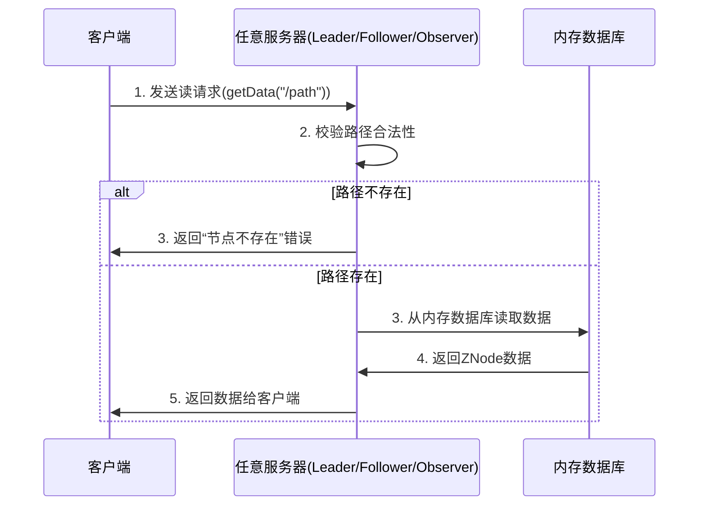
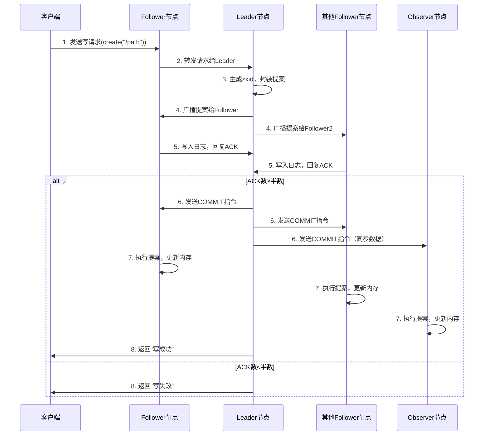
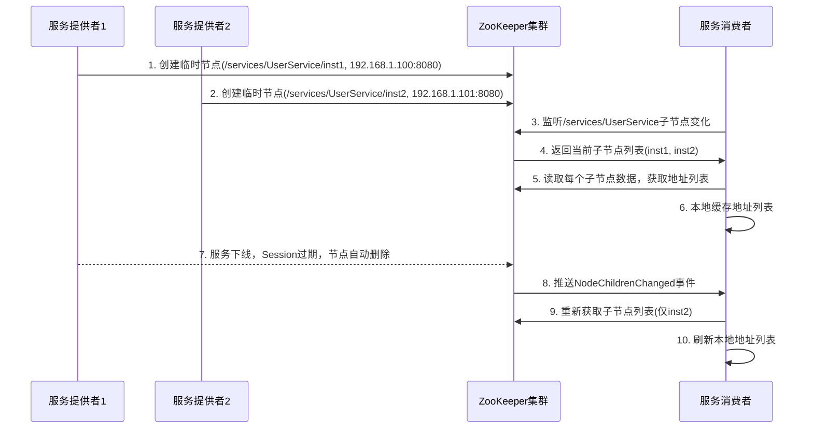
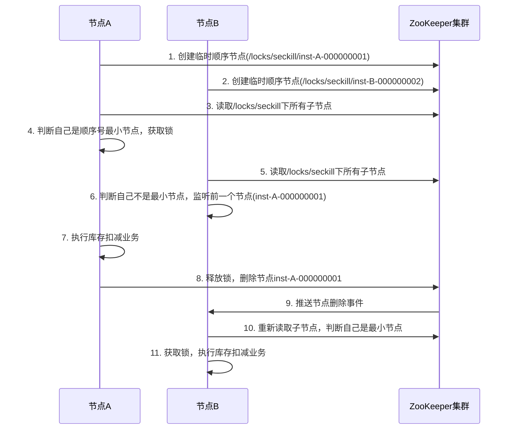

# 一、认知定位（Why & What）
## 1. 背景与起源
### 1.1 诞生驱动力：分布式系统的核心痛点
在ZooKeeper出现前，分布式系统的构建面临多个难以统一解决的协调问题，这些痛点成为其诞生的直接驱动力：
- **配置同步难题**：分布式集群中多节点需使用统一配置（如服务地址、阈值参数），传统手动修改或单点推送方式易出现配置不一致，导致节点行为异常
- **命名服务缺失**：节点间相互发现需依赖唯一标识（如服务名映射IP），无标准化方案时，节点寻址效率低且易出现冲突
- **分布式锁空白**：多节点并发操作共享资源（如写入同一文件）时，缺乏跨节点的锁机制，易引发数据脏写、一致性破坏
- **集群管理低效**：无法实时感知节点上下线状态，节点故障后需人工排查，导致服务恢复延迟，可用性下降

### 1.2 起源：从Yahoo到Apache的演进
据Apache ZooKeeper官方文档描述，其起源与Hadoop生态的早期发展紧密相关：
- 2006年左右，Yahoo团队在开发Hadoop分布式文件系统（HDFS）和MapReduce时，发现亟需一个专门的工具解决集群协调问题，遂启动ZooKeeper项目
- 项目初期定位为Hadoop生态的“协调基础设施”，核心目标是为HDFS、YARN等组件提供稳定的分布式协调能力
- 2008年，Yahoo将ZooKeeper捐献给Apache软件基金会，进入Apache孵化器；2010年，ZooKeeper正式成为Apache顶级项目，此后逐步脱离Hadoop生态独立发展，成为支撑各类分布式系统的通用协调工具

## 2. 核心本质
### 2.1 数据模型：简化的分布式“文件系统”
ZooKeeper的核心数据模型是**树形结构（ZNode Tree）**，可抽象为“轻量级分布式文件系统”，但与传统文件系统有明确差异：
- **节点（ZNode）**：树的每个节点称为ZNode，兼具“文件”和“目录”特性——既可以存储少量数据（默认上限1MB，官方建议仅存配置、标识等小数据），也可以包含子ZNode
- **路径标识**：每个ZNode通过绝对路径唯一标识（如`/hadoop/config`），路径格式与Unix文件系统一致，便于客户端理解和操作
- **数据特性**：ZNode存储的数据为二进制字节流，ZooKeeper不解析数据内容，仅负责数据的一致性存储与传递

### 2.2 核心能力：一致性与事件驱动的结合
ZooKeeper的本质是“**高可用、强一致性的分布式小数据存储与事件通知服务**”，核心能力聚焦两点：
- **一致性保障**：通过ZAB（ZooKeeper Atomic Broadcast）协议实现数据一致性——读操作默认提供“强一致性”（客户端读取到的是最新数据），写操作提供“顺序一致性”（所有客户端看到的写操作顺序一致）
- **事件通知（Watcher）**：客户端可对指定ZNode注册Watcher，当ZNode发生数据变更、子节点增减等事件时，ZooKeeper会主动向客户端推送通知，避免客户端轮询，降低资源消耗

### 2.3 本质提炼：不是“存储工具”，而是“协调中枢”
需明确ZooKeeper的核心边界：它不适合存储大量数据（如业务日志、用户数据），而是通过“小数据存储+事件通知”的组合，解决分布式系统的“协调问题”，本质是分布式系统的“神经中枢”——负责传递关键状态、同步核心配置、触发节点协作。

## 3. 定位与关系
### 3.1 技术体系中的位置：分布式系统的“协调层”
在整个技术架构中，ZooKeeper处于“**基础设施层-协调层**”，位于底层硬件/操作系统与上层业务应用之间，作用是支撑分布式应用的稳定运行：
- 上层依赖：Hadoop（HDFS、YARN）、Kafka（早期版本）、Flink、Solr等分布式组件，均依赖ZooKeeper实现集群管理、配置同步、分布式锁等功能
- 下层支撑：依赖底层的网络（保证节点通信）、操作系统（进程运行），自身通过集群部署（通常3/5节点）实现高可用，不直接依赖其他中间件

### 3.2 同类工具对比：生态差异决定适用场景
ZooKeeper的主要同类工具为etcd（Kubernetes生态）、Consul（HashiCorp生态），三者均为分布式协调/存储工具，但因生态、一致性算法、核心特性差异，适用场景不同，不存在绝对替代关系，而是“生态适配优先”。

| 对比维度       | ZooKeeper                | etcd                     | Consul                   |
|----------------|--------------------------|--------------------------|--------------------------|
| 核心定位       | 通用分布式协调服务       | K8s生态默认配置存储/协调 | 服务发现+配置存储+服务网格 |
| 一致性算法     | ZAB协议                  | Raft协议                 | Raft协议                 |
| 数据模型       | 树形ZNode（支持临时节点） | 键值对（支持前缀查询）   | 键值对（支持服务健康检查） |
| 生态依赖       | Hadoop、Kafka（早期）、Flink | Kubernetes、云原生应用   | HashiCorp工具链（Terraform等）、微服务 |
| 适用场景       | 传统分布式组件协调（如Hadoop集群） | 云原生环境配置存储（如K8s集群信息） | 微服务架构的服务发现与健康检查 |

### 3.3 关系总结：替代为主，互补极少
- 替代关系：在不同生态中相互替代——如Kubernetes用etcd替代ZooKeeper作为配置存储，Kafka新版本通过KRaft协议替代ZooKeeper的协调功能；Consul在微服务场景中，可替代ZooKeeper的服务发现与配置同步功能
- 互补关系：几乎不存在——三者核心能力重叠度高（均解决协调/存储问题），且分属不同生态，实际应用中通常选择一种工具作为协调中枢，不会同时使用多种。

# 二、原理支撑（How - Theory）
## 1. 体系结构
### 1.1 核心组件：三层架构的角色与职责
ZooKeeper 体系结构分为 **客户端层、服务器集群层、数据存储层**，各组件职责明确，协同实现分布式协调能力：

#### 1.1.1 客户端层（Client）
客户端是用户应用与 ZooKeeper 集群交互的入口，核心职责包括：
- 建立与服务器的 TCP 长连接（默认端口 2181），维持会话（Session）
- 发送读/写请求（如创建 ZNode、获取数据、注册 Watcher）
- 接收服务器推送的 Watcher 事件通知
- 自动重连：若当前连接的服务器故障，客户端会自动切换到集群中其他可用服务器

#### 1.1.2 服务器集群层（Server Cluster）
集群由 **奇数个节点（通常 3/5/7 个）** 组成，避免投票死锁，节点分为三种角色，仅 Leader 和 Follower 参与一致性决策：

| 角色       | 核心职责                                                                 | 关键特性                     |
|------------|--------------------------------------------------------------------------|------------------------------|
| Leader     | 1. 处理所有写请求（创建/删除/修改 ZNode）<br>2. 发起 Leader 选举<br>3. 向 Follower 广播事务日志 | 集群中唯一，负责一致性协调   |
| Follower   | 1. 处理读请求<br>2. 参与 Leader 选举投票<br>3. 同步 Leader 的事务日志，保持数据一致 | 可被客户端连接，无写处理能力 |
| Observer   | 1. 处理读请求<br>2. 同步 Leader 的事务日志（不参与投票）<br>3. 扩展读性能       | 不参与选举和投票，适合读密集场景 |

#### 1.1.3 数据存储层
ZooKeeper 数据存储分为 **内存存储** 和 **持久化存储**，兼顾性能与可靠性：
- **内存数据库（In-Memory Database）**：存储当前集群的所有 ZNode 树形结构与数据，读请求直接从内存读取，保证低延迟
- **事务日志（Transaction Log）**：所有写操作（事务）会先写入磁盘日志文件，确保操作可追溯，避免内存数据丢失
- **快照（Snapshot）**：定期（可配置）将内存数据库的完整状态快照写入磁盘，用于快速恢复（如集群重启时，无需重放全部日志）


### 1.2 整体架构图
```mermaid
graph TD
    subgraph 客户端层
        Client1[客户端A]
        Client2[客户端B]
        Client3[客户端C]
    end

    subgraph 服务器集群层
        Leader[Leader节点<br>处理写请求+选举]
        Follower1[Follower节点1<br>读请求+投票]
        Follower2[Follower节点2<br>读请求+投票]
        Observer[Observer节点<br>读请求+无投票]
    end

    subgraph 数据存储层
        MemDB[内存数据库<br>ZNode树]
        Log[事务日志<br>写操作记录]
        Snapshot[快照文件<br>全量状态]
    end

    % 客户端与服务器连接（客户端可连任意节点）
    Client1 --> Leader
    Client1 --> Follower1
    Client2 --> Follower2
    Client3 --> Observer

    % 服务器内部交互
    Leader -->|1. 广播事务<br>2. 同步数据| Follower1
    Leader -->|1. 广播事务<br>2. 同步数据| Follower2
    Leader -->|仅同步数据| Observer
    Follower1 -->|投票| Leader
    Follower2 -->|投票| Leader

    % 服务器与存储层关联
    Leader --> MemDB
    Follower1 --> MemDB
    Follower2 --> MemDB
    Observer --> MemDB
    Leader --> Log
    Leader --> Snapshot
```


## 2. 核心机制
### 2.1 ZAB 协议：一致性的“基石”
ZAB（ZooKeeper Atomic Broadcast）是 ZooKeeper 自定义的一致性协议，核心目标是 **保证集群中所有节点的数据一致**，分为 **崩溃恢复** 和 **消息广播** 两个核心阶段，以及 Leader 选举流程。

#### 2.1.1 阶段1：崩溃恢复（Leader 故障后）
当原 Leader 节点故障（如断网、宕机），集群进入崩溃恢复阶段，确保新 Leader 选举后，所有节点数据一致：
1. **选举触发**：Follower 检测到与 Leader 的心跳超时（默认 2000ms），认为 Leader 故障，切换为“LOOKING”状态，发起选举
2. **投票规则**：
   - 每个节点投票给“zxid（事务ID）最大 + myid（节点唯一标识）最大”的节点（zxid 越大表示数据越新，myid 用于打破平局）
   - 节点先给自己投票，再接收其他节点的投票，若某节点得票超过集群半数（如 3 节点需 2 票，5 节点需 3 票），则成为新 Leader
3. **数据同步**：新 Leader 与所有 Follower 对比 zxid，将 Follower 缺失的事务日志同步给它，确保所有节点数据一致后，恢复正常服务

#### 2.1.2 阶段2：消息广播（正常运行时）
集群有正常 Leader 时，所有写请求通过“消息广播”实现一致性，流程类似 2PC（两阶段提交），但简化了 abort 逻辑：
1. **请求接收**：客户端将写请求发送给任意节点，若节点是 Follower/Observer，会转发给 Leader
2. **提案广播**：Leader 生成一个新的 zxid，将写请求封装为“提案”，广播给所有 Follower
3. **投票确认**：Follower 收到提案后，先写入本地事务日志，再向 Leader 回复“ACK（确认）”
4. **事务提交**：当 Leader 收到超过半数 Follower 的 ACK 后，向所有节点发送“COMMIT”指令，Follower/Observer 执行提案并更新内存数据库
5. **结果返回**：Leader 向客户端返回写操作成功（若失败则返回错误）


### 2.2 Watcher 机制：事件驱动的“通知器”
Watcher 是 ZooKeeper 实现“实时感知”的核心机制，允许客户端监听 ZNode 的变化，避免轮询，流程分为 **注册、触发、销毁** 三步：

#### 2.2.1 核心流程
1. **注册阶段**：客户端调用 `getData(path, watch=true)` 或 `getChildren(path, watch=true)` 等 API，向服务器注册 Watcher，指定监听的 ZNode 路径
2. **触发阶段**：当监听的 ZNode 发生“数据变更”“子节点增减”“节点删除”等事件时，服务器生成对应的 Watcher 事件，推送给客户端
3. **销毁阶段**：Watcher 是“一次性触发”的——事件推送后，该 Watcher 自动销毁，若需持续监听，客户端需重新注册

#### 2.2.2 关键特性
- **轻量级**：Watcher 仅存储在内存中，不持久化，服务器重启后所有未触发的 Watcher 失效
- **异步通知**：服务器推送事件是异步的，客户端需通过回调函数处理事件，不阻塞当前操作
- **会话绑定**：Watcher 与客户端 Session 绑定，若 Session 超时或断开，Watcher 自动失效


### 2.3 会话（Session）机制：连接的“生命周期管理”
Session 是客户端与 ZooKeeper 集群的逻辑连接，用于维护客户端状态，核心是“心跳检测”和“超时管理”：
1. **Session 创建**：客户端与服务器建立 TCP 连接后，服务器分配一个唯一的 SessionID，生成超时时间（默认 30000ms，可配置）
2. **心跳维持**：客户端定期（默认 1/3 超时时间，约 10000ms）向服务器发送“ping”请求，服务器回复“pong”，维持 Session 活性
3. **超时处理**：若服务器在超时时间内未收到客户端的心跳，认为客户端故障，会：
   - 销毁该客户端注册的所有 Watcher
   - 删除该客户端创建的“临时 ZNode”（如分布式锁的临时节点、服务发现的实例节点）
   - 标记 Session 为“过期”，客户端重连后需重新创建 Session


### 2.4 数据一致性策略：读“快”写“稳”的平衡
ZooKeeper 针对读/写请求采用不同策略，兼顾性能与一致性：
- **读请求**：客户端可连接任意节点（Leader/Follower/Observer），直接从内存数据库读取数据，无需经过 Leader，延迟低（**最终一致性**，极端情况下可能读取到旧数据，但默认配置下接近强一致性）
- **写请求**：必须经过 Leader 处理，通过 ZAB 协议广播到所有节点，确保所有节点数据一致（**顺序一致性**——所有客户端看到的写操作顺序相同；**原子性**——写操作要么全成功，要么全失败）


## 3. 抽象建模：现实问题→技术模型
ZooKeeper 通过 **ZNode 树形结构+属性配置**，将分布式系统的协调问题抽象为可操作的技术模型，核心场景的建模逻辑如下：

### 3.1 场景1：服务发现→临时节点+子节点监听
**现实问题**：客户端需要实时知道“哪些服务实例在线”，避免调用已下线的实例。  
**建模逻辑**：
- 定义根节点：如 `/service/user-service`（代表“用户服务”）
- 服务实例注册：每个服务实例启动时，在根节点下创建 **临时顺序节点**（如 `/service/user-service/instance-000000001`），节点数据存储实例地址（如 `192.168.1.100:8080`）
- 客户端监听：客户端调用 `getChildren("/service/user-service", watch=true)`，监听根节点的子节点变化
- 实例下线：服务实例故障或关闭时，Session 超时，临时节点自动删除，ZooKeeper 向客户端推送“子节点删除”事件，客户端更新服务列表

### 3.2 场景2：分布式锁→临时节点+节点存在性判断
**现实问题**：多节点并发操作共享资源（如写入同一数据库表），需避免数据冲突。  
**建模逻辑**：
#### 3.2.1 排他锁（同一时间仅一个节点持有）
1. 定义锁节点：如 `/lock/order-db`（代表“订单数据库锁”）
2. 加锁：客户端尝试创建 **临时节点** `/lock/order-db`，若创建成功，说明获取锁；若失败（节点已存在），则监听该节点的“删除”事件，等待锁释放
3. 解锁：客户端操作完成后，删除临时节点，或 Session 超时自动删除，其他客户端收到事件后重新尝试加锁

#### 3.2.2 共享锁（多个节点可同时持有，如读锁）
1. 定义锁节点：如 `/lock/order-db-read`（代表“订单数据库读锁”）
2. 加锁：客户端在锁节点下创建 **临时顺序节点**（如 `/lock/order-db-read/lock-000000001`），判断“自己是否是序号最小的节点”：
   - 若是：获取锁
   - 若否：监听前一个节点（如序号 2 监听序号 1）的“删除”事件，等待前一个节点释放锁
3. 解锁：客户端操作完成后删除节点，后续节点收到事件后重新判断

### 3.3 场景3：配置同步→持久节点+数据监听
**现实问题**：集群中所有节点需使用相同的配置（如数据库连接池大小），配置修改后需实时同步到所有节点。  
**建模逻辑**：
1. 定义配置节点：如 `/config/hadoop/core-site`（存储 Hadoop 的 core-site 配置）
2. 配置写入：管理员通过客户端将配置内容（如 JSON 字符串）写入该 **持久节点**
3. 节点监听：所有集群节点调用 `getData("/config/hadoop/core-site", watch=true)`，监听节点数据变化
4. 配置更新：管理员修改配置节点数据后，ZooKeeper 向所有节点推送“数据变更”事件，节点读取新数据并更新本地配置


## 4. 流转逻辑：数据/指令的传递路径
ZooKeeper 的核心流转场景分为 **读请求** 和 **写请求**，路径差异源于“一致性保障策略”：

### 4.1 读请求流转：客户端→任意服务器→内存数据库
#### 4.1.1 详细步骤
1. 客户端通过 TCP 连接向任意服务器（Leader/Follower/Observer）发送读请求（如 `getData("/path")`）
2. 服务器检查请求路径是否存在：若不存在，返回“节点不存在”错误；若存在，执行下一步
3. 服务器从 **内存数据库** 中读取该 ZNode 的数据
4. 服务器将数据返回给客户端（若客户端注册了 Watcher，同时在内存中记录 Watcher）

#### 4.1.2 读请求流转图



### 4.2 写请求流转：客户端→Leader→所有节点
#### 4.2.1 详细步骤
1. 客户端向任意服务器发送写请求（如 `create("/path", "data")`）
2. 服务器判断自身角色：
   - 若为 Leader：直接处理请求
   - 若为 Follower/Observer：将请求转发给 Leader
3. Leader 生成新的 zxid，将写请求封装为“提案”，广播给所有 Follower
4. Follower 收到提案后，写入本地事务日志，向 Leader 回复“ACK”
5. Leader 收到超过半数 Follower 的 ACK 后，向所有节点（Follower/Observer）发送“COMMIT”指令
6. 所有节点执行提案，更新内存数据库
7. Leader 向客户端返回“写成功”（若步骤 4 中 ACK 未达半数，返回“写失败”）

#### 4.2.2 写请求流转图


# 三、实践应用（How - Practice）
## 1. 基础操作：最小可用技能集
### 1.1 环境安装：单机与集群部署
#### 1.1.1 前置依赖
- JDK 8+（ZooKeeper 3.8+ 需 JDK 8，官方推荐 11），需配置 `JAVA_HOME` 环境变量
- 操作系统：Linux（生产首选，如 CentOS 7/8、Ubuntu 20.04），Windows 仅用于开发测试
- 集群部署需满足：节点间网络互通（关闭防火墙或开放端口）、各节点时间同步（通过 NTP 服务）

#### 1.1.2 单机部署步骤（以 3.8.4 版本为例）
1. 下载安装包：从 Apache 官网（https://zookeeper.apache.org/releases.html）下载 `apache-zookeeper-3.8.4-bin.tar.gz`（注意带 `bin` 后缀，含可执行文件）
2. 解压：`tar -zxvf apache-zookeeper-3.8.4-bin.tar.gz -C /opt/`，并重命名为 `zookeeper`
3. 配置文件：
   - 进入配置目录：`cd /opt/zookeeper/conf`
   - 复制模板文件：`cp zoo_sample.cfg zoo.cfg`
   - 编辑 `zoo.cfg`，修改核心参数：
     ```properties
     # 数据存储目录（需手动创建）
     dataDir=/opt/zookeeper/data
     # 客户端连接端口
     clientPort=2181
     # 会话超时时间（默认 30000ms）
     sessionTimeout=30000
     ```
4. 创建数据目录：`mkdir -p /opt/zookeeper/data`
5. 启动服务：
   - 启动：`/opt/zookeeper/bin/zkServer.sh start`
   - 验证状态：`/opt/zookeeper/bin/zkServer.sh status`，显示 `Mode: standalone` 即成功
6. 客户端连接：`/opt/zookeeper/bin/zkCli.sh -server localhost:2181`，出现 `[zk: localhost:2181(CONNECTED)]` 即连接成功

#### 1.1.3 集群部署步骤（3 节点为例）
假设 3 个节点 IP 分别为 `192.168.1.101`、`192.168.1.102`、`192.168.1.103`，步骤如下：
1. 重复单机部署步骤 1-4，在 3 个节点上完成基础配置
2. 配置集群节点：每个节点的 `zoo.cfg` 末尾添加集群信息（所有节点配置相同）：
   ```properties
   # server.${myid}=${IP}:${选举端口}:${通信端口}
   server.1=192.168.1.101:2888:3888
   server.2=192.168.1.102:2888:3888
   server.3=192.168.1.103:2888:3888
   ```
   - `myid`：每个节点的唯一标识（1-255），需在 `dataDir` 下创建 `myid` 文件写入
   - 2888 端口：Leader 与 Follower 的数据同步端口；3888 端口：Leader 选举端口
3. 设置 `myid`：
   - 101 节点：`echo 1 > /opt/zookeeper/data/myid`
   - 102 节点：`echo 2 > /opt/zookeeper/data/myid`
   - 103 节点：`echo 3 > /opt/zookeeper/data/myid`
4. 启动集群：3 个节点分别执行 `zkServer.sh start`，启动后通过 `zkServer.sh status` 查看角色（1 个 Leader，2 个 Follower）


### 1.2 核心配置：zoo.cfg 关键参数
| 参数名               | 含义                                                                 | 默认值       | 生产建议                  |
|----------------------|----------------------------------------------------------------------|--------------|---------------------------|
| dataDir              | 数据存储目录（含事务日志、快照、myid）                               | /tmp/zookeeper | 自定义路径，避免/tmp（重启丢失） |
| clientPort           | 客户端连接端口                                                       | 2181         | 保持默认，需开放防火墙端口 |
| sessionTimeout       | 客户端会话超时时间（ms）                                             | 30000        | 5000-30000，根据业务调整  |
| tickTime             | 集群时间基准（ms），选举超时、心跳间隔均为其整数倍                   | 2000         | 2000-5000，不宜过小       |
| initLimit            | Leader 初始化时，Follower 同步数据的最大超时时间（单位：tickTime）   | 10           | 15-20，节点多/网络差时调大 |
| syncLimit            | Leader 与 Follower 通信的最大超时时间（单位：tickTime）              | 5            | 10-15，避免频繁断连       |
| autopurge.snapRetainCount | 保留的快照文件数量                                                 | 3            | 5-10，平衡磁盘占用与恢复需求 |
| autopurge.purgeInterval | 自动清理过期快照和日志的间隔时间（小时）                             | 0（禁用）    | 24，开启自动清理           |


### 1.3 核心 API：命令行与 Java 客户端
#### 1.3.1 命令行 API（zkCli.sh）
| 命令格式                          | 功能描述                                  | 示例                                  |
|-----------------------------------|-------------------------------------------|---------------------------------------|
| `create [-s] [-e] /path [data]`   | 创建节点（-s：顺序节点，-e：临时节点）    | `create -e /service/user 192.168.1.100` |
| `get /path [watch]`               | 获取节点数据（watch：true 开启监听）      | `get /service/user true`              |
| `ls /path [watch]`                | 列出子节点（watch：true 监听子节点变化）  | `ls /service true`                    |
| `set /path [data]`                | 修改节点数据                              | `set /service/user 192.168.1.101`     |
| `delete /path`                    | 删除节点（需无子节点）                    | `delete /service/user`                |
| `rmr /path`                       | 递归删除节点（含子节点）                  | `rmr /service`                        |
| `stat /path`                      | 查看节点状态（zxid、版本、过期时间等）    | `stat /service/user`                  |

#### 1.3.2 Java 客户端 API（Curator 框架）
ZooKeeper 原生 API 繁琐（需处理重试、Watcher 重注册），生产推荐使用 Apache Curator（官方维护的客户端框架），以下为核心操作示例（基于 Curator 5.5.0）：

##### 依赖配置（Maven）
```xml
<dependency>
    <groupId>org.apache.curator</groupId>
    <artifactId>curator-framework</artifactId>
    <version>5.5.0</version>
</dependency>
<dependency>
    <groupId>org.apache.curator</groupId>
    <artifactId>curator-recipes</artifactId>
    <version>5.5.0</version>
</dependency>
```

##### 客户端初始化（带重试策略）
```java
import org.apache.curator.framework.CuratorFramework;
import org.apache.curator.framework.CuratorFrameworkFactory;
import org.apache.curator.retry.ExponentialBackoffRetry;

public class ZkClient {
    private static final String ZK_CONNECT_STR = "192.168.1.101:2181,192.168.1.102:2181,192.168.1.103:2181";
    private static final int SESSION_TIMEOUT = 30000;
    private static final int CONNECTION_TIMEOUT = 5000;

    // 初始化客户端（指数退避重试：初始间隔 1000ms，重试 3 次）
    public static CuratorFramework getClient() {
        CuratorFramework client = CuratorFrameworkFactory.builder()
                .connectString(ZK_CONNECT_STR)
                .sessionTimeoutMs(SESSION_TIMEOUT)
                .connectionTimeoutMs(CONNECTION_TIMEOUT)
                .retryPolicy(new ExponentialBackoffRetry(1000, 3))
                .namespace("my-app") // 命名空间（所有操作基于 /my-app 路径）
                .build();
        client.start(); // 启动客户端
        return client;
    }
}
```

##### 节点操作示例（创建、查询、修改、删除）
```java
public class ZkNodeOps {
    public static void main(String[] args) throws Exception {
        CuratorFramework client = ZkClient.getClient();
        String nodePath = "/config/db";

        // 1. 创建临时顺序节点（数据为 UTF-8 字节数组）
        String createdPath = client.create()
                .creatingParentsIfNeeded() // 父节点不存在则自动创建
                .withMode(CreateMode.EPHEMERAL_SEQUENTIAL) // 临时顺序节点
                .forPath(nodePath, "jdbc:mysql://localhost:3306/mydb".getBytes());
        System.out.println("创建节点：" + createdPath);

        // 2. 查询节点数据
        byte[] data = client.getData().forPath(createdPath);
        System.out.println("节点数据：" + new String(data));

        // 3. 修改节点数据（版本号 -1 表示忽略版本，强制修改）
        client.setData().withVersion(-1).forPath(createdPath, "jdbc:mysql://localhost:3306/newdb".getBytes());

        // 4. 删除节点（guaranteed() 确保删除成功，即使客户端断开）
        client.delete().guaranteed().forPath(createdPath);

        // 关闭客户端
        client.close();
    }
}
```


## 2. 典型案例：代表性场景实现
### 2.1 案例1：分布式服务发现
#### 2.1.1 场景需求
微服务架构中，服务消费者需实时获取服务提供者的地址列表，避免调用下线实例（如 UserService 有 3 个实例，消费者需知道哪些实例在线）。

#### 2.1.2 实现原理
- 服务提供者：启动时在 ZooKeeper 上创建 **临时节点**（节点路径：`/services/{服务名}/{实例ID}`，数据：实例地址），下线时节点自动删除（Session 过期）。
- 服务消费者：监听 `/services/{服务名}` 的子节点变化，实时更新本地地址列表。

#### 2.1.3 完整步骤（基于 Curator）
##### 1. 服务提供者注册（UserService 实例）
```java
public class ServiceProvider {
    private final CuratorFramework client;
    private final String serviceName;
    private final String instanceAddress; // 如 "192.168.1.100:8080"

    public ServiceProvider(CuratorFramework client, String serviceName, String instanceAddress) {
        this.client = client;
        this.serviceName = serviceName;
        this.instanceAddress = instanceAddress;
    }

    // 注册服务
    public void register() throws Exception {
        String servicePath = "/services/" + serviceName;
        String instancePath = servicePath + "/" + UUID.randomUUID(); // 实例ID用UUID避免重复

        // 创建临时节点（服务下线时自动删除）
        client.create()
                .creatingParentsIfNeeded()
                .withMode(CreateMode.EPHEMERAL)
                .forPath(instancePath, instanceAddress.getBytes());

        System.out.println("服务注册成功：" + instancePath + " -> " + instanceAddress);
    }

    // 注销服务（可选，主动下线时调用）
    public void unregister() throws Exception {
        String servicePath = "/services/" + serviceName;
        // 递归删除该服务下的所有本实例节点（实际可通过实例ID精准删除）
        client.delete().deletingChildrenIfNeeded().forPath(servicePath);
    }
}
```

##### 2. 服务消费者发现（Consumer 端）
```java
public class ServiceConsumer {
    private final CuratorFramework client;
    private final String serviceName;
    private List<String> addressList = new CopyOnWriteArrayList<>(); // 线程安全的地址列表

    public ServiceConsumer(CuratorFramework client, String serviceName) {
        this.client = client;
        this.serviceName = serviceName;
        // 初始化时获取地址列表并启动监听
        try {
            refreshAddressList();
            startWatch();
        } catch (Exception e) {
            throw new RuntimeException("服务发现初始化失败", e);
        }
    }

    // 刷新地址列表（从ZooKeeper读取子节点）
    private void refreshAddressList() throws Exception {
        String servicePath = "/services/" + serviceName;
        List<String> instancePaths = client.getChildren().forPath(servicePath);
        List<String> newAddresses = new ArrayList<>();

        for (String instancePath : instancePaths) {
            String fullPath = servicePath + "/" + instancePath;
            byte[] data = client.getData().forPath(fullPath);
            newAddresses.add(new String(data));
        }

        addressList.clear();
        addressList.addAll(newAddresses);
        System.out.println("刷新服务地址列表：" + addressList);
    }

    // 启动子节点监听（子节点变化时刷新地址列表）
    private void startWatch() throws Exception {
        String servicePath = "/services/" + serviceName;
        client.getChildren()
                .usingWatcher((Watcher) event -> {
                    // Watcher 触发时（子节点增删），重新刷新列表并再次注册监听
                    if (event.getType() == Watcher.Event.EventType.NodeChildrenChanged) {
                        try {
                            refreshAddressList();
                            startWatch(); // 重新注册监听（一次性触发）
                        } catch (Exception e) {
                            e.printStackTrace();
                        }
                    }
                })
                .forPath(servicePath);
    }

    // 从地址列表中选择一个实例（简单轮询）
    public String selectInstance() {
        if (addressList.isEmpty()) {
            throw new RuntimeException("无可用服务实例");
        }
        int index = new Random().nextInt(addressList.size());
        return addressList.get(index);
    }
}
```

#### 2.1.4 服务发现流程图



### 2.2 案例2：分布式排他锁
#### 2.2.1 场景需求
多节点并发操作共享资源（如秒杀库存扣减、数据库表分区写入），需保证同一时间仅一个节点执行操作，避免数据不一致。

#### 2.2.2 实现原理
- 锁节点：在 ZooKeeper 上创建 **临时顺序节点**（路径：`/locks/{锁名}/{节点ID}-`），顺序号最小的节点获得锁。
- 释放锁：操作完成后删除节点，或节点故障时 Session 过期自动删除，后续节点监听前一个节点的删除事件，依次获取锁。

#### 2.2.3 完整实现（基于 Curator Recipes）
Curator 提供 `InterProcessMutex` 封装分布式锁，无需手动处理节点创建与监听：
```java
public class DistributedLock {
    private final InterProcessMutex lock;
    private final CuratorFramework client;
    private final String lockPath; // 锁节点路径，如 "/locks/seckill-stock"

    public DistributedLock(CuratorFramework client, String lockName) {
        this.client = client;
        this.lockPath = "/locks/" + lockName;
        // 初始化排他锁（参数：客户端、锁路径、锁类型（默认排他））
        this.lock = new InterProcessMutex(client, lockPath);
    }

    // 获取锁（带超时时间，避免死等）
    public boolean acquire(long timeout, TimeUnit unit) throws Exception {
        return lock.acquire(timeout, unit);
    }

    // 释放锁
    public void release() throws Exception {
        if (lock.isAcquiredInThisProcess()) {
            lock.release();
            System.out.println("释放分布式锁：" + lockPath);
        }
    }

    // 业务逻辑示例（秒杀库存扣减）
    public void seckillStock(String productId) throws Exception {
        if (acquire(5, TimeUnit.SECONDS)) { // 5秒内获取锁，否则失败
            try {
                // 1. 查库存（数据库/Redis）
                int stock = getStockFromDB(productId);
                if (stock <= 0) {
                    System.out.println("商品" + productId + "库存不足");
                    return;
                }
                // 2. 扣减库存
                updateStockToDB(productId, stock - 1);
                System.out.println("商品" + productId + "库存扣减成功，剩余：" + (stock - 1));
            } finally {
                release(); // 必须在finally中释放锁，避免异常导致锁泄漏
            }
        } else {
            throw new RuntimeException("获取分布式锁超时（5秒）");
        }
    }

    // 模拟数据库操作
    private int getStockFromDB(String productId) { return 100; }
    private void updateStockToDB(String productId, int stock) {}
}
```

#### 2.2.4 锁竞争流程图



### 2.3 案例3：分布式配置同步
#### 2.3.1 场景需求
集群中所有节点（如 10 个 Web 节点）需使用相同配置（如数据库连接池大小、日志级别），配置修改后需实时同步到所有节点，无需重启服务。

#### 2.3.2 实现原理
- 配置节点：在 ZooKeeper 上创建 **持久节点**（路径：`/config/{应用名}/{配置项}`，数据：配置值）。
- 配置监听：所有节点监听配置节点的数据变化，配置更新时触发 Watcher，节点读取新配置并应用。

#### 2.3.3 完整实现（基于 Curator）
```java
public class ConfigSync {
    private final CuratorFramework client;
    private final String configPath; // 配置节点路径，如 "/config/my-web/db-pool-size"
    private String currentConfig; // 当前配置值

    public ConfigSync(CuratorFramework client, String appName, String configKey) {
        this.client = client;
        this.configPath = "/config/" + appName + "/" + configKey;
        // 初始化配置并启动监听
        try {
            initConfig();
            startConfigWatch();
        } catch (Exception e) {
            throw new RuntimeException("配置同步初始化失败", e);
        }
    }

    // 初始化配置（从ZooKeeper读取初始值）
    private void initConfig() throws Exception {
        if (client.checkExists().forPath(configPath) == null) {
            // 配置节点不存在时，创建并设置默认值
            client.create().creatingParentsIfNeeded().forPath(configPath, "10".getBytes()); // 默认连接池大小10
        }
        byte[] data = client.getData().forPath(configPath);
        currentConfig = new String(data);
        applyConfig(currentConfig); // 应用初始配置
    }

    // 启动配置监听（数据变化时更新配置）
    private void startConfigWatch() throws Exception {
        client.getData()
                .usingWatcher((Watcher) event -> {
                    if (event.getType() == Watcher.Event.EventType.NodeDataChanged) {
                        try {
                            // 读取新配置
                            byte[] newData = client.getData().forPath(configPath);
                            String newConfig = new String(newData);
                            // 应用新配置
                            applyConfig(newConfig);
                            // 重新注册监听
                            startConfigWatch();
                        } catch (Exception e) {
                            e.printStackTrace();
                        }
                    }
                })
                .forPath(configPath);
    }

    // 应用配置（实际业务中需更新本地配置，如连接池大小）
    private void applyConfig(String config) {
        this.currentConfig = config;
        System.out.println("配置更新：" + configPath + " = " + currentConfig);
        // 示例：更新数据库连接池大小
        updateDbPoolSize(Integer.parseInt(currentConfig));
    }

    // 模拟更新数据库连接池
    private void updateDbPoolSize(int size) {
        // 实际代码：如 HikariCP 的 setMaximumPoolSize 方法
    }

    // 提供外部更新配置的方法（如管理员后台调用）
    public void updateConfig(String newConfig) throws Exception {
        client.setData().withVersion(-1).forPath(configPath, newConfig.getBytes());
    }
}
```


## 3. 问题诊断：常见错误与排查方案
### 3.1 常见错误分类与解决方案
| 错误现象                                  | 可能原因                                  | 排查与解决方案                                                                 |
|-------------------------------------------|-------------------------------------------|------------------------------------------------------------------------------|
| 客户端连接超时：`Connection refused`      | 1. ZooKeeper 服务未启动<br>2. 防火墙未开放 2181 端口<br>3. 集群节点 IP/端口配置错误 | 1. 执行 `zkServer.sh status` 检查服务状态<br>2. 关闭防火墙（`systemctl stop firewalld`）或开放端口（`firewall-cmd --add-port=2181/tcp --permanent`）<br>3. 验证客户端连接串与集群配置是否一致 |
| Leader 选举失败：`No leader elected`      | 1. 集群节点数为偶数（如 2 个）<br>2. 节点间网络不通（2888/3888 端口未开放）<br>3. `myid` 文件重复或缺失 | 1. 调整集群节点数为奇数（3/5/7 个）<br>2. 测试节点间连通性（`ping 192.168.1.102`、`telnet 192.168.1.102 2888`）<br>3. 检查每个节点 `dataDir/myid` 文件，确保值唯一且与 `zoo.cfg` 中 `server.x` 对应 |
| Session 过期：`Session expired`           | 1. 客户端心跳超时（网络波动）<br>2. 会话超时时间设置过小<br>3. 集群压力过大，无法响应心跳 | 1. 检查客户端与集群间网络稳定性（`traceroute` 排查丢包）<br>2. 增大 `sessionTimeout`（如 60000ms）<br>3. 查看集群负载（`top` 看 CPU/内存），必要时扩容节点 |
| 节点无法删除：`Node not empty`            | 节点存在子节点，`delete` 命令无法删除      | 使用 `rmr /path` 递归删除，或先删除所有子节点再删除父节点                      |
| 数据不一致：客户端读取到旧数据            | 1. 读请求路由到 Follower，且 Follower 未同步最新数据<br>2. 客户端开启了本地缓存 | 1. 强制读请求路由到 Leader（通过 Curator 的 `LeaderSelector` 或自定义路由）<br>2. 禁用客户端本地缓存，或配置缓存过期时间 |


### 3.2 核心排查工具与日志分析
#### 3.2.1 常用命令工具
| 命令                                      | 用途                                                                 |
|-------------------------------------------|----------------------------------------------------------------------|
| `zkServer.sh status`                      | 查看单个节点状态（角色：Leader/Follower/Observer，ZAB 状态）          |
| `zkCli.sh -server {IP}:2181`              | 连接集群，执行节点操作、状态查询（如 `stat /` 查看根节点状态）        |
| `zkCleanup.sh -n {保留数量} {dataDir}`    | 手动清理过期快照和事务日志（补充自动清理）                            |
| `netstat -tuln | grep 2181`              | 检查 2181 端口是否监听（确认服务正常对外提供服务）                    |
| `jstat -gc {ZK进程ID} 1000`               | 查看 ZooKeeper JVM 内存使用（避免内存溢出）                          |

#### 3.2.2 日志分析
ZooKeeper 日志默认存储在 `dataDir/logs` 目录下，核心日志文件：
- `zookeeper-{用户名}-{主机名}-server.log`：服务运行日志（含启动、连接、错误信息），如 Session 过期、选举失败信息会在此记录。
- `zookeeper-{用户名}-{主机名}-audit.log`：审计日志（记录所有客户端操作，如节点创建、删除）。

**日志排查示例**：  
若客户端报 `Session expired`，可在 Server 日志中搜索 `SessionExpired`，查看具体 SessionID 与过期原因：
```
2024-05-20 14:30:00,123 [myid:1] - INFO  [NIOServerCxn.Factory:0.0.0.0/0.0.0.0:2181:NIOServerCnxn@1000] - Session expired: 0x100000123456789
2024-05-20 14:30:00,124 [myid:1] - INFO  [SessionTracker:ZooKeeperServer@600] - Expiring session 0x100000123456789, timeout of 30000ms exceeded
```
原因：客户端超过 30000ms 未发送心跳，需检查客户端网络或调整 `sessionTimeout`。


## 4. 场景扩展：从单一场景到复杂系统
### 4.1 多集群部署：跨机房高可用
#### 4.1.1 场景需求
生产环境中，单集群部署存在机房故障风险（如断电、网络中断），需跨两个机房部署 ZooKeeper 集群，确保单个机房故障时服务不中断。

#### 4.1.2 实现方案（跨机房 5 节点集群）
- 机房 A：3 个节点（`192.168.1.101`、`192.168.1.102`、`192.168.1.103`）
- 机房 B：2 个节点（`192.168.2.101`、`192.168.2.102`）
- 配置 `zoo.cfg` 时，所有节点包含 5 个 `server.x` 配置，确保跨机房节点通信正常：
  ```properties
  server.1=192.168.1.101:2888:3888
  server.2=192.168.1.102:2888:3888
  server.3=192.168.1.103:2888:3888
  server.4=192.168.2.101:2888:3888
  server.5=192.168.2.102:2888:3888
  ```
- 注意事项：跨机房网络延迟较高，需调大 `initLimit`（如 20）和 `syncLimit`（如 10），避免频繁断连。

### 4.2 与 Spring Cloud 集成：微服务协调
#### 4.2.1 场景需求
Spring Cloud 微服务架构中，使用 ZooKeeper 替代 Eureka 实现服务注册发现，替代 Config 实现配置同步。

#### 4.2.2 集成步骤（Spring Cloud Zookeeper）
##### 1. 依赖配置（Maven）
```xml
<dependency>
    <groupId>org.springframework.cloud</groupId>
    <artifactId>spring-cloud-starter-zookeeper-discovery</artifactId>
    <version>3.1.5</version> <!-- 适配 Spring Boot 2.7.x -->
</dependency>
<dependency>
    <groupId>org.springframework.cloud</groupId>
    <artifactId>spring-cloud-starter-zookeeper-config</artifactId>
    <version>3.1.5</version>
</dependency>
```

##### 2. 配置文件（bootstrap.yml，优先加载）
```yaml
spring:
  application:
    name: user-service # 服务名
  cloud:
    zookeeper:
      connect-string: 192.168.1.101:2181,192.168.1.102:2181,192.168.1.103:2181
      discovery:
        enabled: true # 开启服务注册发现
        instance-host: 192.168.1.100 # 服务实例IP（可选，默认自动获取）
        instance-port: 8080 # 服务端口
      config:
        enabled: true # 开启配置同步
        root: /config # 配置根节点
        default-context: user-service # 默认配置上下文（对应 /config/user-service）
        profile-separator: '-' # 环境分隔符（如 /config/user-service-dev 对应 dev 环境）
```

##### 3. 服务注册与发现代码
```java
// 服务提供者启动类（开启服务注册）
@SpringBootApplication
@EnableDiscoveryClient
public class UserServiceApplication {
    public static void main(String[] args) {
        SpringApplication.run(UserServiceApplication.class, args);
    }
}

// 服务消费者（使用 Feign 调用，自动从 ZooKeeper 获取地址）
@RestController
public class OrderController {
    @Autowired
    private UserFeignClient userFeignClient;

    @GetMapping("/order/{userId}")
    public String getOrderByUserId(@PathVariable String userId) {
        // 调用 UserService，Feign 自动负载均衡
        return userFeignClient.getUserInfo(userId);
    }

    // Feign 客户端接口
    @FeignClient(name = "user-service") // 对应服务名
    public interface UserFeignClient {
        @GetMapping("/user/{id}")
        String getUserInfo(@PathVariable("id") String id);
    }
}
```

### 4.3 监控告警：Prometheus + Grafana
#### 4.3.1 场景需求
实时监控 ZooKeeper 集群状态（如节点角色、连接数、事务数），当指标异常（如连接数突增、Leader 频繁切换）时触发告警。

#### 4.3.2 实现步骤
1. **暴露 ZooKeeper 指标**：
   - 下载 Prometheus 监控插件 `zookeeper_exporter`（https://github.com/dabealu/zookeeper_exporter）
   - 启动 exporter：`./zookeeper_exporter --zk-hosts=192.168.1.101:2181,192.168.1.102:2181,192.168.1.103:2181 --web.listen-address=:9141`
   - 验证指标：访问 `http://{exporter-ip}:9141/metrics`，可看到 `zk_connections`、`zk_leader_count` 等指标。

2. **配置 Prometheus 采集**：
   在 `prometheus.yml` 中添加 Job：
   ```yaml
   scrape_configs:
     - job_name: 'zookeeper'
       scrape_interval: 15s # 15秒采集一次
       static_configs:
         - targets: ['192.168.1.100:9141'] # zookeeper_exporter 地址
   ```

3. **Grafana 配置面板**：
   - 导入 ZooKeeper 监控面板（ID：10465，来自 Grafana 官网）
   - 配置告警规则（如：`zk_leader_count != 1` 时触发 Leader 异常告警，`zk_connections > 1000` 时触发连接数超限告警）

# 四、深度进阶（Mastery）
## 1. 性能优化：瓶颈分析、调优策略、最佳参数配置
### 1.1 瓶颈分析：定位性能卡点
ZooKeeper 性能瓶颈集中在 **磁盘IO、网络、内存、连接数** 四大维度，需通过监控工具（如 Prometheus、ZooKeeper 自带 `stat` 命令）定位卡点：

#### 1.1.1 核心瓶颈识别
| 瓶颈类型       | 表现特征                                                                 | 监控指标（参考）                          |
|----------------|--------------------------------------------------------------------------|-------------------------------------------|
| 磁盘IO瓶颈     | 写请求延迟高（>100ms）、事务日志刷盘耗时久；快照生成时CPU/IO占用突增       | `zk_transaction_log_sync_time`（刷盘耗时）、`iostat %util`（磁盘利用率>90%） |
| 网络瓶颈       | 集群节点间数据同步延迟（Follower 与 Leader 数据差大）、客户端连接超时频繁 | `zk_peer_sync_delay`（节点同步延迟）、`netstat -i`（网卡丢包率>0.1%） |
| 内存瓶颈       | 读请求延迟上升、JVM 频繁 Full GC；内存数据库（ZNode树）占用超物理内存     | `jstat -gcutil`（Full GC 频率>1次/小时）、`zk_in_memory_database_size`（内存占用） |
| 连接数瓶颈     | 新客户端无法建立连接、`Too many open files` 错误；连接数达到系统限制       | `zk_connections`（客户端连接数）、`ulimit -n`（系统文件句柄数） |


### 1.2 调优策略：针对性突破卡点
#### 1.2.1 磁盘IO调优（核心：减少刷盘开销）
- **事务日志与快照分离存储**：将 `dataDir`（快照）和 `dataLogDir`（事务日志）挂载到不同磁盘（如 SSD），避免快照生成与日志刷盘竞争IO；事务日志优先用 SSD，降低刷盘延迟（官方强烈推荐）。
- **优化日志刷盘策略**：通过 `syncLimit` 和 `fsync.warningthresholdms` 控制刷盘频率，平衡一致性与性能：
  - 生产建议：`dataLogDir` 所在磁盘为 SSD 时，启用 `forceSync=true`（默认），保证数据不丢失；若为 HDD，可设置 `forceSync=false`（牺牲部分一致性换性能，需评估业务容忍度）。
- **减少快照生成频率**：调整 `autopurge.snapRetainCount`（保留快照数，默认3→建议5-10）和 `autopurge.purgeInterval`（清理间隔，默认24小时→无需频繁调整），避免快照生成占用过多IO；同时通过 `snapshot.trust.empty` 关闭空快照生成（ZooKeeper 3.6+ 支持）。

#### 1.2.2 网络调优（核心：降低同步延迟）
- **集群节点部署优化**：跨机房部署时，将 Leader 节点放在网络延迟低的机房（如核心业务机房），Follower 按机房均匀分布，避免单机房故障导致 Leader 不可用；同一集群内节点间网络延迟控制在 10ms 内。
- **调整同步参数**：增大 `initLimit`（Leader 初始化同步超时，默认10→15-20）和 `syncLimit`（Leader 与 Follower 通信超时，默认5→10-15），避免网络波动导致节点频繁断开连接；减少 `leaderServes`（Leader 是否处理读请求，默认true→读密集场景设为false，让 Leader 专注写请求与同步）。

#### 1.2.3 内存调优（核心：避免GC与内存溢出）
- **JVM内存配置**：通过 `ZOOMAIN` 环境变量设置堆内存，建议为物理内存的 50%-70%（如 16GB 物理内存设为 `-Xms8g -Xmx8g`），避免堆内存过大导致 Full GC 耗时久；同时设置 `-XX:+UseG1GC`（G1垃圾收集器），优化内存回收效率（ZooKeeper 3.5+ 推荐）。
- **限制 ZNode 数据大小**：严格控制单个 ZNode 数据量（官方建议<1KB，最大不超过1MB），避免内存数据库膨胀；定期清理无用 ZNode（如临时节点残留、过期配置节点），减少内存占用。

#### 1.2.4 连接数调优（核心：突破系统与应用限制）
- **提升系统文件句柄数**：修改 `/etc/security/limits.conf`，增大 ZooKeeper 进程的文件句柄限制（如 `zookeeper soft nofile 65535`、`zookeeper hard nofile 131072`），避免连接数达限时无法新建连接。
- **客户端连接池优化**：客户端使用连接池（如 Curator 的 `CuratorFramework` 复用连接），避免频繁创建/关闭 TCP 连接；设置合理的 `sessionTimeout`（默认30s→根据业务调整，避免过短导致连接频繁断开）。


### 1.3 最佳参数配置：生产环境参考
基于 ZooKeeper 3.8.x 版本，整理核心配置参数的生产最佳值：

| 配置参数                 | 含义                                                                 | 默认值       | 生产推荐值                | 适用场景                  |
|--------------------------|----------------------------------------------------------------------|--------------|---------------------------|---------------------------|
| `dataDir`                | 快照存储目录                                                         | /tmp/zookeeper | /data/zookeeper/snapshot   | 所有环境，需独立磁盘      |
| `dataLogDir`             | 事务日志存储目录                                                     | 同 dataDir   | /data/zookeeper/logs       | 所有环境，优先 SSD 磁盘   |
| `tickTime`               | 集群时间基准（ms）                                                   | 2000         | 2000-3000                  | 网络稳定→2000，不稳定→3000 |
| `initLimit`              | Leader 初始化同步超时（tickTime 倍数）                               | 10           | 15-20                      | 跨机房部署→20             |
| `syncLimit`              | Leader 与 Follower 通信超时（tickTime 倍数）                          | 5            | 10-15                      | 跨机房部署→15             |
| `autopurge.snapRetainCount` | 保留快照数量                                                       | 3            | 5-10                       | 需历史快照恢复→10         |
| `autopurge.purgeInterval` | 自动清理过期快照/日志间隔（小时）                                     | 0（禁用）    | 24                         | 所有环境，避免磁盘满      |
| `maxClientCnxns`         | 单个客户端最大连接数                                                 | 60           | 100-200                    | 高并发客户端→200          |
| `leaderServes`           | Leader 是否处理读请求                                               | true         | false                      | 读密集场景（如服务发现）  |
| `forceSync`              | 事务日志是否强制刷盘                                                 | true         | true（SSD）/false（HDD）   | 数据一致性要求高→true     |


## 2. 稳健性设计：容错机制、高可用方案、灾备策略
### 2.1 容错机制：应对节点故障
ZooKeeper 核心容错依赖 **ZAB协议** 和 **节点角色分工**，确保单节点故障不影响集群可用性：

#### 2.1.1 故障类型与容错逻辑
| 故障节点类型 | 影响范围                                                                 | 容错恢复流程                                                                 |
|--------------|--------------------------------------------------------------------------|------------------------------------------------------------------------------|
| Follower 故障 | 读请求能力下降（其他 Follower/Observer 可承接）；写请求同步节点减少       | 1. Leader 检测到 Follower 心跳超时（`syncLimit * tickTime`），标记其下线；<br>2. 故障 Follower 重启后，自动同步 Leader 缺失的事务日志，重新加入集群；<br>3. 若剩余 Follower 数≥半数，写请求正常处理（如 3 节点集群，1 个 Follower 故障，仍有 1 个 Follower+1 个 Leader，满足半数）。 |
| Leader 故障   | 写请求中断；集群进入崩溃恢复阶段                                         | 1. 所有 Follower 检测到 Leader 心跳超时，切换为 LOOKING 状态，发起 Leader 选举；<br>2. 选举产生新 Leader（zxid 最大的节点）；<br>3. 新 Leader 同步所有 Follower 数据，完成后集群恢复服务（恢复时间≈10-30s，取决于数据同步量）。 |
| Observer 故障 | 读请求能力下降（不影响写请求与选举）                                     | 故障 Observer 重启后，自动同步 Leader 数据，重新加入集群；无需选举，恢复速度快。 |

#### 2.1.2 容错能力边界
- 集群节点数为 **2n+1（奇数）** 时，最大容错节点数为 n（如 3 节点→容错1个，5 节点→容错2个）；生产环境优先选择 3 或 5 节点（7 节点以上会增加同步延迟，性价比低）。
- 若故障节点数≥n+1（如 3 节点故障2个），集群无法选举 Leader，进入不可用状态；需避免单机房故障导致超过半数节点下线（如跨机房部署）。


### 2.2 高可用方案：多维度保障服务在线
#### 2.2.1 集群部署优化
- **节点角色合理分配**：读密集场景（如服务发现）增加 Observer 节点（不参与选举，仅处理读请求），提升读性能同时不影响容错；写密集场景（如分布式锁）保证 Follower 节点数≥2（确保 Leader 故障后能选举新 Leader）。
- **跨机房部署**：将集群节点分布在 2-3 个机房（如 3 节点→2个机房：A机房2个，B机房1个），避免单机房故障（如断电、网络中断）导致集群不可用；需确保机房间网络延迟<50ms（避免同步超时）。

#### 2.2.2 客户端高可用
- **连接重试与节点切换**：客户端使用集群连接串（如 `192.168.1.101:2181,192.168.1.102:2181`），而非单节点；配置重试策略（如 Curator 的 `ExponentialBackoffRetry`，初始间隔1s，重试3次），避免临时网络波动导致连接失败。
- **读请求负载均衡**：客户端将读请求分发到 Follower/Observer 节点，避免所有读请求打向 Leader；Curator 等框架已内置该能力，无需手动实现。


### 2.3 灾备策略：数据与服务双备份
#### 2.3.1 数据备份
- **自动备份**：依赖 `autopurge` 配置保留快照与日志（需确保 `dataDir` 和 `dataLogDir` 磁盘空间充足）；定期将快照文件（`dataDir/version-2/*.snap`）和事务日志（`dataLogDir/version-2/*.log`）复制到异地存储（如 S3、NFS），备份频率建议每日1次。
- **手动备份**：执行 `zkServer.sh stop` 停止服务（或在非高峰期），拷贝 `dataDir` 和 `dataLogDir` 目录到备份介质；若需热备份，可使用 `zkCli.sh` 执行 `dump` 命令导出内存数据（仅适用于小集群）。

#### 2.3.2 灾难恢复
- **快照恢复**：1. 停止故障集群所有节点；2. 删除 `dataDir` 和 `dataLogDir` 下所有文件；3. 将备份的快照文件复制到 `dataDir/version-2/`；4. 启动集群，节点自动加载快照并同步后续日志（恢复后需验证数据一致性）。
- **跨区域灾备**：在异地部署备用集群，通过 `zkCopy` 等工具实时同步主集群数据；主集群故障时，客户端切换到备用集群（需配置 DNS 或配置中心动态切换连接串）。


## 3. 本源探究：核心源码解析、设计思想溯源
### 3.1 核心源码解析：关键模块实现
基于 ZooKeeper 3.8.x 源码（GitHub 仓库：https://github.com/apache/zookeeper），聚焦面试高频模块：

#### 3.1.1 ZAB协议实现（核心包：`org.apache.zookeeper.server.quorum`）
- **Leader 选举流程**：
  1. 节点进入 LOOKING 状态，调用 `QuorumPeer.startLeaderElection()` 启动选举；
  2. 通过 `FastLeaderElection` 类实现投票逻辑：生成包含 `myid` 和 `zxid` 的投票，发送给其他节点；
  3. 接收其他节点投票，通过 `calculateVote()` 比较投票（优先比较 zxid，zxid 相同比较 myid），若自身投票成为多数票，成为 Leader；
  4. Leader 向所有节点发送 `LEADERINFO` 消息，集群切换到 FOLLOWING/LEADING 状态。
- **消息广播流程**：
  1. Leader 接收写请求，调用 `LeaderRequestProcessor.processRequest()` 生成提案（含 zxid）；
  2. 通过 `SyncRequestProcessor` 将提案写入事务日志，再通过 `ProposalRequestProcessor` 广播给所有 Follower；
  3. Follower 接收提案后，写入日志并回复 ACK；Leader 收到半数以上 ACK 后，调用 `CommitProcessor` 发送 COMMIT 消息；
  4. Follower/Observer 执行 COMMIT，更新内存数据库（`ZKDatabase`）。

#### 3.1.2 Watcher机制实现（核心包：`org.apache.zookeeper.server`）
- **注册流程**：客户端调用 `getData(path, watch=true)` 时，`DataNode` 节点的 `watchers` 集合（`WatchManager`）添加该 Watcher，关联事件类型（如 `NodeDataChanged`）。
- **触发流程**：当 ZNode 数据变更时，`ZooKeeperServer` 调用 `WatchManager.triggerWatch()`，遍历关联的 Watcher，生成 `WatchedEvent` 并放入客户端的 `EventQueue`；
- **销毁流程**：Watcher 触发后，从 `watchers` 集合中移除（一次性触发）；若客户端 Session 过期，`SessionTracker` 调用 `WatchManager.removeWatcher()` 清理所有关联 Watcher。


### 3.2 设计思想溯源：为何这样设计？
#### 3.2.1 一致性协议选择：ZAB而非Paxos
- **Paxos的问题**：Paxos 协议复杂度高，实现难度大；且 Paxos 是“通用一致性协议”，未针对分布式协调场景优化（如 Leader 选举与数据同步的耦合）。
- **ZAB的优势**：ZAB 是“为 ZooKeeper 定制的协议”，将 Leader 选举与数据同步整合，流程更简洁；支持“崩溃恢复”（确保 Leader 故障后数据一致）和“消息广播”（确保正常运行时一致性），更适配协调场景的低延迟需求。

#### 3.2.2 数据模型设计：树形结构+轻量级存储
- **树形结构选择**：树形结构天然适合表示“层级关系”（如 `/service/user-service/instance1`），符合服务发现、配置同步等场景的路径标识需求；且路径唯一，便于客户端定位节点。
- **轻量级存储**：限制 ZNode 数据大小（<1MB），避免存储大量数据导致内存/IO瓶颈；ZooKeeper 定位是“协调工具”，而非“存储工具”，轻量级设计确保高吞吐与低延迟。


## 4. 版本与特性：主流版本差异、关键特性演进
### 4.1 主流版本时间线与核心差异
ZooKeeper 版本演进以“稳定性”和“安全增强”为核心，主流版本为 3.4.x（稳定版）、3.5.x（功能增强）、3.6.x（安全与性能优化）、3.8.x（最新稳定版）：

| 版本系列 | 发布时间   | 核心特性                                                                 | 兼容性与推荐场景                          |
|----------|------------|--------------------------------------------------------------------------|-------------------------------------------|
| 3.4.x    | 2013-2021  | 基础功能稳定（ZAB、Watcher、分布式锁）；支持 Java 7+；无动态配置          | 兼容性最好，适合依赖旧版本生态（如 Hadoop 2.x）；已停止更新（仅安全补丁） |
| 3.5.x    | 2018-2022  | 新增动态配置（无需重启修改集群节点）、Metric 监控（JMX 扩展）、Quota 限制（ZNode 数量/大小）；支持 Java 8+ | 功能增强，适合需要动态调整集群的场景；部分旧工具（如旧版 Flink）需适配 |
| 3.6.x    | 2020-2023  | 安全增强（支持 TLS 1.3、细粒度权限控制）、性能优化（减少 Full GC）、新增快照压缩（ZSTD）；支持 Java 8+ | 安全需求高的场景（如金融）；性能优于 3.5.x |
| 3.8.x    | 2022-至今  | 修复 3.6.x 已知 Bug；增强 Observer 功能（支持批量同步）；支持 Java 11+；移除废弃 API（如旧版选举接口） | 生产首选，兼容性好（适配 Hadoop 3.x、Flink 1.15+）；支持最新 JDK |

### 4.2 关键特性演进与弃用
#### 4.2.1 新增特性（高频考点）
- **动态配置（3.5.x+）**：通过 `/zookeeper/config` 节点修改集群配置（如添加/删除节点），无需重启集群；解决传统配置（`zoo.cfg`）需重启的问题，提升运维效率。
- **细粒度权限控制（3.6.x+）**：支持基于路径的 ACL 权限（如 `/service` 节点允许读，`/lock` 节点允许写），且支持 LDAP 集成，增强安全性。
- **快照压缩（3.6.x+）**：默认使用 ZSTD 算法压缩快照文件，减少磁盘占用（压缩率约 50%）；可通过 `snapshot.compression.type` 配置压缩算法（如 `none` 禁用）。

#### 4.2.2 弃用与移除
- 3.5.x 弃用 `Configure.sh` 脚本，改用 `zkServer-initialize.sh` 初始化集群；
- 3.6.x 弃用 TLS 1.0/1.1，仅支持 TLS 1.2+；
- 3.8.x 移除 `org.apache.zookeeper.server.quorum.QuorumPeerMain` 的旧构造函数，需使用新 API 启动服务。


## 5. 生态与趋势：周边生态集成、技术发展方向
### 5.1 周边生态集成：与主流框架的协作
ZooKeeper 是“分布式生态的基础协调工具”，核心集成场景如下：

| 框架/工具       | 集成场景                                                                 | 版本依赖与注意事项                          |
|------------------|--------------------------------------------------------------------------|-------------------------------------------|
| Hadoop 生态      | HDFS：存储 NameNode 元数据；YARN：管理 ResourceManager 高可用；MapReduce：任务调度协调 | Hadoop 2.x 依赖 3.4.x；Hadoop 3.x 推荐 3.5.x+ |
| Flink            | 集群高可用（JobManager 故障恢复）；状态后端元数据存储；Checkpoint 协调     | Flink 1.13+ 支持 3.5.x+；Flink 1.17+ 可选项用 etcd 替代 |
| Kafka（早期）    | 存储 Broker 元数据；协调 Partition 副本选举；Consumer Group 管理           | Kafka 2.8 前依赖 ZooKeeper；Kafka 2.8+ 推出 KRaft 模式（内置协调，替代 ZooKeeper） |
| Solr             | 集群节点发现；配置同步；Leader 选举（SolrCloud 模式）                     | 所有版本依赖 ZooKeeper；推荐 3.5.x+ 以支持动态配置 |

### 5.2 技术发展方向：短期与长期趋势
#### 5.2.1 短期趋势（1-3年）
- **性能持续优化**：聚焦 Observer 节点的读性能（如批量处理读请求）、事务日志刷盘效率（如异步刷盘优化）；
- **安全增强**：支持 OAuth2.0 认证、敏感数据加密（如 ZNode 数据加密存储）；
- **云原生适配**：提供 Docker 镜像（官方已发布）、K8s 部署 Helm Chart，简化云环境部署；支持动态资源调整（如根据负载自动扩缩容 Observer 节点）。

#### 5.2.2 长期趋势（3-5年）
- **与 K8s 生态融合**：目前 K8s 生态以 etcd 为主，ZooKeeper 社区正推进与 K8s 的集成（如通过 Operator 管理 ZooKeeper 集群），争夺云原生协调市场；
- **多一致性模型支持**：目前仅支持强一致性，未来可能增加“最终一致性”选项，适配不同业务场景（如非核心配置同步可接受最终一致性，换取更高性能）；
- **轻量化与边缘部署**：优化内存占用（如支持 ZNode 数据分页存储），适配边缘计算场景（资源有限的边缘节点）。

#### 5.2.3 挑战与应对
- **竞争压力**：etcd（K8s 生态）、Consul（微服务生态）的崛起，抢占 ZooKeeper 的市场份额；ZooKeeper 需通过差异化（如更成熟的容错机制、更丰富的生态集成）巩固优势；
- **复杂度问题**：源码复杂度高，二次开发门槛高；社区正推进文档优化、API 简化（如提供更友好的 Java 客户端），降低使用门槛。


## 6. 场景化实践：不同业务场景的适配策略
### 6.1 金融级场景：高可用与数据一致性优先
#### 6.1.1 场景需求
金融业务（如支付、转账）对 **数据一致性、服务可用性、安全性** 要求极高：不允许数据丢失（如分布式锁误释放导致重复扣款），服务可用性需达到 99.99%（每年 downtime <52分钟）。

#### 6.1.2 适配策略
- **集群部署**：5 节点跨 3 个机房（A机房2个，B机房2个，C机房1个），最大容错2个节点，避免单机房故障；所有节点使用 SSD 存储事务日志，确保写请求延迟<50ms。
- **数据安全**：启用 TLS 1.3 加密节点间通信；配置 ACL 权限（仅支付服务可写 `/lock/payment` 节点）；每小时备份快照与日志，异地存储（如跨城市备份）。
- **监控告警**：实时监控 `zk_transaction_log_sync_time`（刷盘耗时>100ms 告警）、`zk_leader_count`（Leader 频繁切换告警）、`zk_connections`（异常连接数突增告警）；告警响应时间<5分钟。

### 6.2 互联网高并发场景：读密集与高吞吐优先
#### 6.2.1 场景需求
互联网业务（如电商服务发现、直播房间状态同步）的特点是 **读请求密集（QPS 10万+）、连接数多（10万+客户端）**，需保证读延迟低（<10ms），支持快速扩容。

#### 6.2.2 适配策略
- **节点角色配置**：3 个 Follower 节点（保证写可用）+ N 个 Observer 节点（N 根据读 QPS 调整，如 5-10 个）；Observer 部署在靠近客户端的机房，降低读延迟。
- **性能优化**：Leader 不处理读请求（`leaderServes=false`）；客户端读请求优先分发到 Observer；增大 `maxClientCnxns`（如 500），提升单节点连接数。
- **扩容策略**：读 QPS 增长时，新增 Observer 节点（无需修改集群配置，动态加入）；通过 K8s StatefulSet 管理 Observer 集群，支持自动扩缩容。

### 6.3 边缘计算场景：资源有限与低功耗优先
#### 6.3.1 场景需求
边缘计算（如物联网设备协调、边缘节点状态同步）的特点是 **资源有限（边缘节点内存<4GB、CPU 核心数少）、网络不稳定**，需 ZooKeeper 轻量化部署。

#### 6.3.2 适配策略
- **集群简化**：2 个节点（1 个 Leader + 1 个 Follower）+ 1 个轻量级 Observer（如使用嵌入式 ZooKeeper 客户端）；减少节点资源占用，同时保证基本容错。
- **配置优化**：降低 JVM 堆内存（如 `-Xms512m -Xmx512m`）；关闭快照自动清理（`autopurge.purgeInterval=0`），手动在低峰期清理（减少 CPU 占用）；增大 `sessionTimeout`（如 60s），适应边缘网络波动。
- **数据精简**：ZNode 数据量控制在<512B；定期清理无用临时节点（如设备离线后残留的节点），避免内存膨胀。

